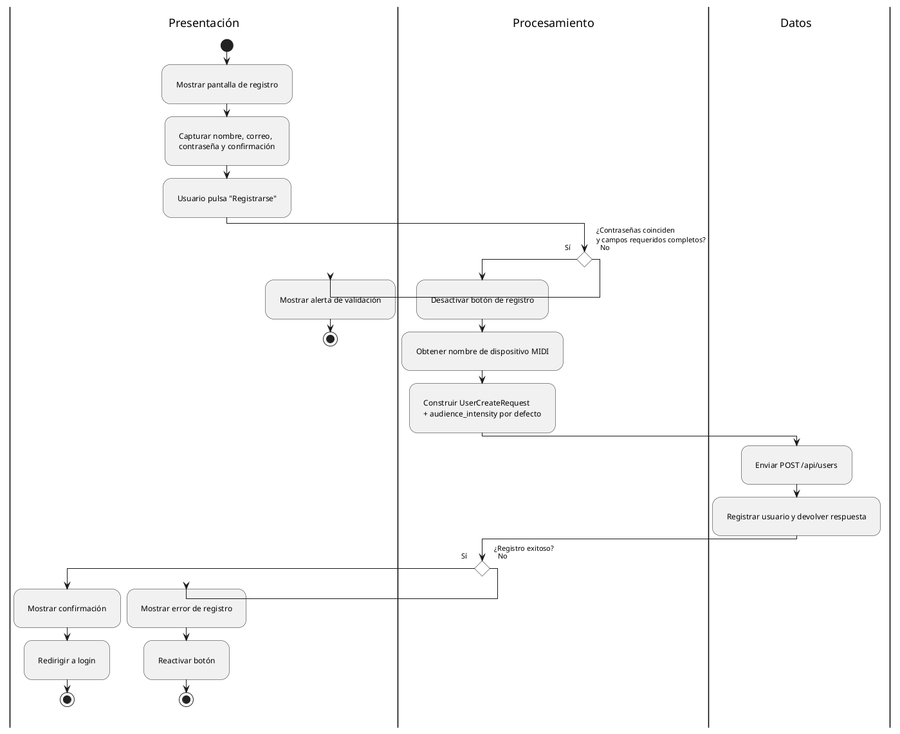
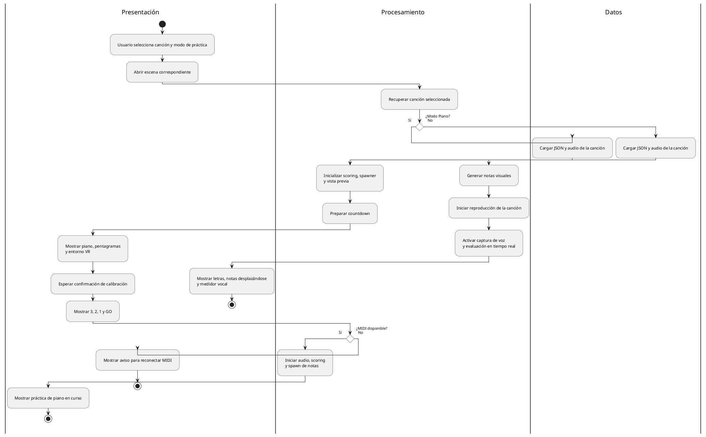
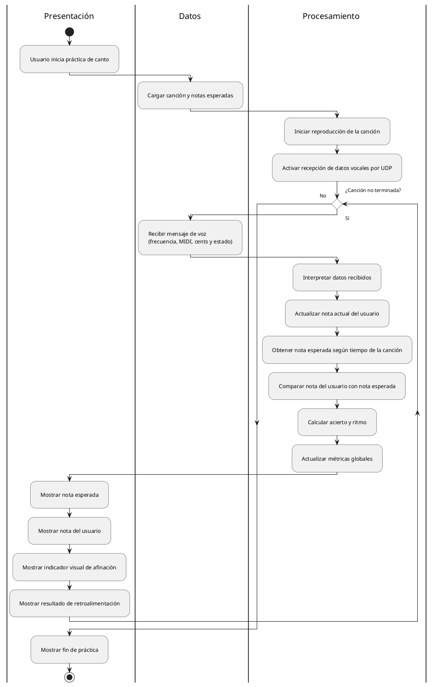
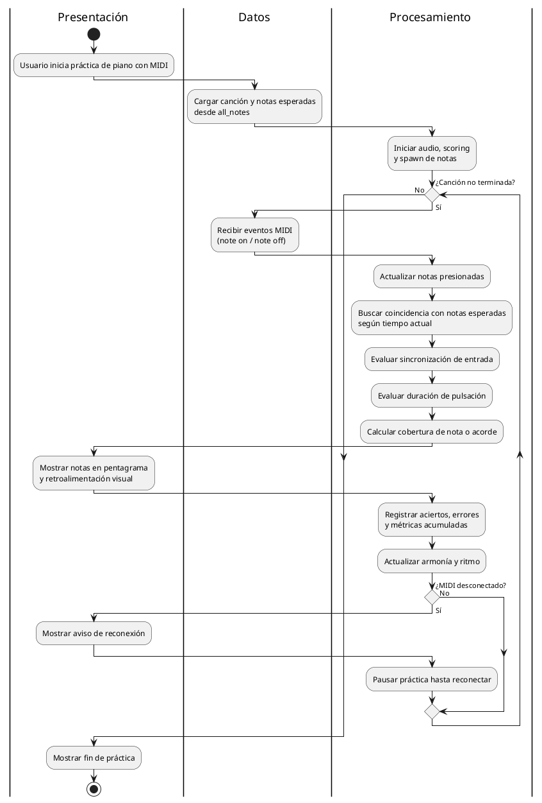
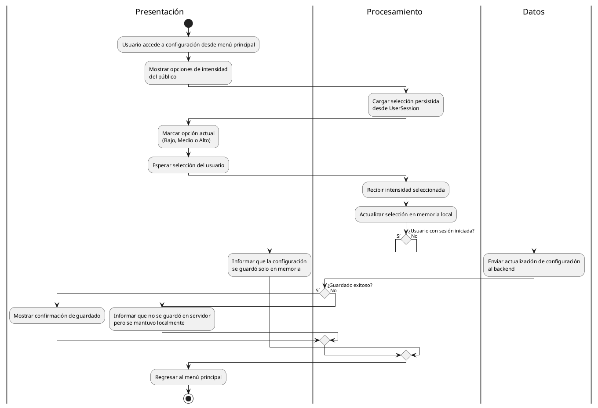
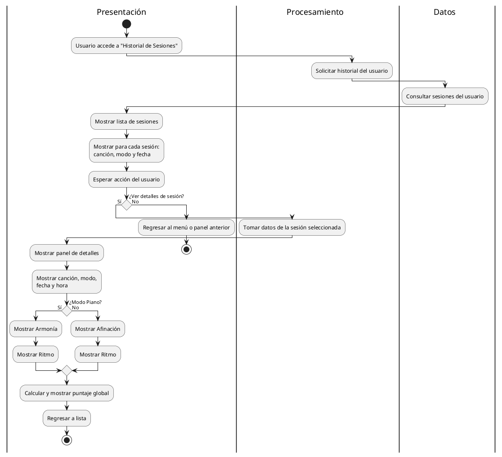
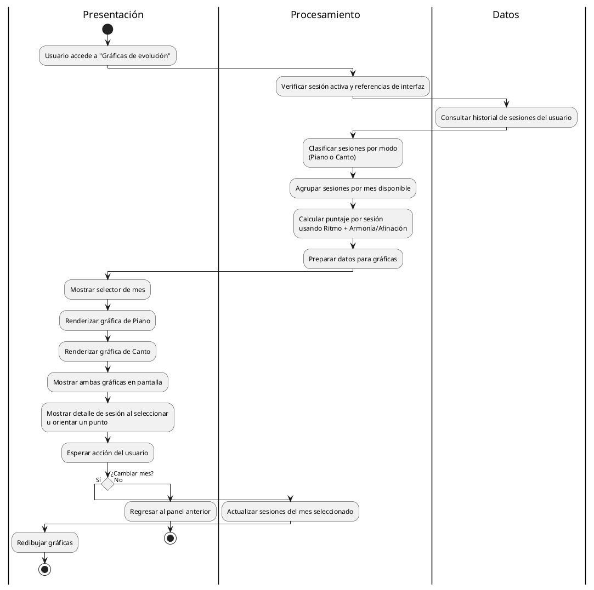
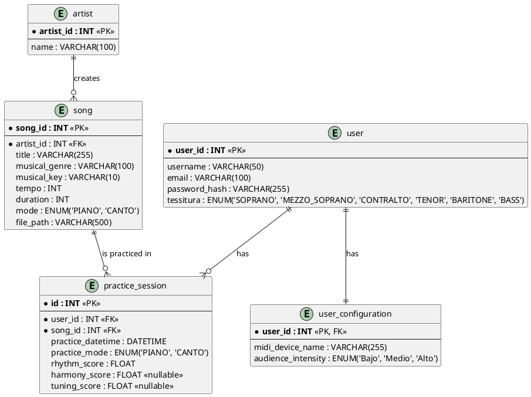

<!-- Generated by SpecStory, Markdown v2.1.0 -->

# 2026-05-07 20:58:29Z

<!-- VS Code Copilot IDE Session dd91060c-78c9-43fc-a0f3-1f2385e69d7c (2026-05-07 20:58:29Z) -->

_**User (2026-05-07 20:58:29Z)**_

Hola volví, recuerdas mi proyecto? Todo lo que hemos desarrollado hasta ahora, si quieres puedes escanearlo exhaustivamente cada uno de los archivos, clases y código vale??

Ya que necesito poner 
Capítulo 8.	Conclusiones y Trabajo a futuro

en mi reporte de trabajo terminal, deben ser unas 5 paginas de word, vale? tu redactalas, redactalas con mi estilo de redaccion, no quiero que se vea de IA, o que lo hizo una computadora, quiero que se vea que lo hice yo, no seas extremadamente teecnico, pero tampoco seas informal ni con faltas de ortografía, puedes darme el texto en un .txt en la raiz del proyecto, yo copio, pego y listo, borro al archivo, dale por favor

---

_**Agent (copilot/gpt-5.4)**_

Voy a reunir contexto real del proyecto primero: revisaré las notas de repositorio y una muestra representativa de scripts/sistemas clave para redactar un capítulo de conclusiones y trabajo futuro que sí corresponda a lo que has construido.

_**Agent (copilot/gpt-5.4)**_

<tool-use data-tool-type="generic" data-tool-name="memory"><details>
<summary>Tool use: **memory**</summary>

Read memory

**Input:**

- command: `view`
- path: `/memories/`

**Result:**

```
Here are the files and directories in /memories/:
/memories/session/
/memories/repo/
/memories/repo/api-midi-config-notes.md
/memories/repo/midi-hotplug-runtime-widget-notes.md
/memories/repo/piano-audience-intensity-notes.md
/memories/repo/piano-staff-mapping.md
/memories/repo/piano-sync-notes.md
/memories/repo/xr-controller-ray-origin-notes.md
/memories/repo/xr-interaction-rig-notes.md
```
</details></tool-use>

_**Agent (copilot/gpt-5.4)**_

<tool-use data-tool-type="task" data-tool-name="manage_todo_list"><details>
<summary>Tool use: **manage_todo_list**</summary>

Created 4 todos

- [ ] Revisar memoria del repo _(in progress)_
- [ ] Inspeccionar sistemas clave
- [ ] Redactar capitulo 8
- [ ] Crear txt en raiz

**Result:**

```
Successfully wrote todo list

Warning: Did you mean to update so many todos at the same time? Consider working on them one by one.
```
</details></tool-use>

_**Agent (copilot/gpt-5.4)**_

Ahora voy a cruzar las notas previas con una exploración más amplia del código para identificar los sistemas que realmente distinguen tu proyecto y usarlos como base del capítulo.

_**Agent (copilot/gpt-5.4)**_

<tool-use data-tool-type="generic" data-tool-name="memory"><details>
<summary>Tool use: **memory**</summary>

Read memory `api-midi-config-notes.md`

**Input:**

- command: `view`
- path: `/memories/repo/api-midi-config-notes.md`

**Result:**

```
Here's the content of /memories/repo/api-midi-config-notes.md with line numbers:
     1	- DirectMidiReceiver now reads connected MIDI device name from Android plugin MidiInputBridge.getConnectedDeviceName(); registration sends the name or 'NO REGISTRADO', login sends the name only if a device is connected and then best-effort syncs /api/users/{id}/configuration.
     2	- Piano practice session POST uses selectedSongMetadata.id as song_id and maps tuning_score to GameplayResults.accuracy_percentage because piano mode has no dedicated tuning metric yet.
     3
```
</details></tool-use>

_**Agent (copilot/gpt-5.4)**_

<tool-use data-tool-type="generic" data-tool-name="memory"><details>
<summary>Tool use: **memory**</summary>

Read memory `midi-hotplug-runtime-widget-notes.md`

**Input:**

- command: `view`
- path: `/memories/repo/midi-hotplug-runtime-widget-notes.md`

**Result:**

```
Here's the content of /memories/repo/midi-hotplug-runtime-widget-notes.md with line numbers:
     1	- DirectMidiReceiver must not infer disconnection from MIDI inactivity; Quest hot-plug state should come from Android MidiInputBridge device callbacks plus explicit rescans.
     2	- Global MIDI runtime should bootstrap DirectMidiReceiver, MIDIConnectionManager, and the runtime status widget, but not create a persistent MidiAudioManager because PianoGame already owns a scene MIDI audio manager.
     3	- PianoGame should wait for MIDI before starting and pause on disconnect, then resume only after an explicit user continue action from the global MIDI widget.
     4	
     5	- Unsupported USB detection now lives in Android MidiInputBridge and is surfaced through DirectMidiReceiver to MidiStatusWidgetController; it deliberately flags only when no MIDI device is present to avoid false positives from USB MIDI devices exposing separate USB descriptors.
     6
```
</details></tool-use>

_**Agent (copilot/gpt-5.4)**_

<tool-use data-tool-type="generic" data-tool-name="memory"><details>
<summary>Tool use: **memory**</summary>

Read memory `piano-audience-intensity-notes.md`

**Input:**

- command: `view`
- path: `/memories/repo/piano-audience-intensity-notes.md`

**Result:**

```
Here's the content of /memories/repo/piano-audience-intensity-notes.md with line numbers:
     1	- Piano audience intensity is piano-only: Bajo/Medio/Alto no longer cap visual score; all can reach 100, but Bajo requires a higher recent-performance average and Alto a lower one.
     2	- Piano applause audio uses separate clips by intensity: aplause_bajo, aplause_medio, aplause_alto.
     3	- Piano applause volume now follows the raw 0-100 public score directly; it is no longer normalized against a lower per-intensity cap.
     4	- Piano audience visual animation is driven by Animator float parameter Calidad via ControladorAudienciaPiano.
     5	- PianoPublicSystem now uses a sliding recent-performance window from live harmony + rhythm, with short-lived early-hit and wrong-note pulses feeding that window.
     6	- Piano audience still uses separate rise/fall smoothing plus a second inertia pass for animation.
     7	- RepertorioScene PanelGrafica now has EvolutionGraphsController, which fetches user history, groups available months, and renders piano/canto per-session charts into the existing scroll contents at runtime. Tooltip details are shown beside the hovered point.
     8	
     9
```
</details></tool-use>

_**Agent (copilot/gpt-5.4)**_

<tool-use data-tool-type="generic" data-tool-name="memory"><details>
<summary>Tool use: **memory**</summary>

Read memory `piano-sync-notes.md`

**Input:**

- command: `view`
- path: `/memories/repo/piano-sync-notes.md`

**Result:**

```
Here's the content of /memories/repo/piano-sync-notes.md with line numbers:
     1	- Piano mode had duplicate countdown path: CountdownManager plus extra 3s coroutine in PianoGameManager.StartGame().
     2	- Reliable sync should use AudioSource.time as primary clock in spawner/scoring/note evaluation.
     3	- Hold scoring target for this repo: note counts as hit from >=10% pressed duration within [time, time+duration].
     4	- Piano lane scroll is more stable when note position is derived deterministically from AudioSource.time with a fixed travel/lead time; do not derive global note speed from the first note timestamp.
     5	
     6	- Piano end results UI in PianoGame scene uses existing EndGameUI with child names GlobalText, PitchText, RhythmText, BtnReiniciar, and BtnMenu; runtime auto-binding is safer than manual inspector wiring.
     7
```
</details></tool-use>

_**Agent (copilot/gpt-5.4)**_

<tool-use data-tool-type="generic" data-tool-name="memory"><details>
<summary>Tool use: **memory**</summary>

Read memory `xr-controller-ray-origin-notes.md`

**Input:**

- command: `view`
- path: `/memories/repo/xr-controller-ray-origin-notes.md`

**Result:**

```
Here's the content of /memories/repo/xr-controller-ray-origin-notes.md with line numbers:
     1	- In this rig, controller NearFarInteractor references stabilized controller origin/attach transforms; after hand/controller modality churn the stabilizer can end up following teleport aim and tilt controller rays downward for UI.
     2	- The controller stabilized attach transform is nested under the stabilized origin, so runtime lookup must be recursive rather than a direct child search.
     3	- **FIX IMPLEMENTED**: in QuestXRInteractionController, rebind each controller IXRRayProvider to the original stabilized origin/attach transforms and clear XRTransformStabilizer.aimTarget when teleport is disabled.
     4	- ConfigureControllerRayOrigin (line 489-549) is called in ApplyInteractionMode (line 127) on Awake/OnEnable/Start AND in RefreshTrackedInteractionState (line 612) when modality changes.
     5	- Fix rebinds both IXRRayProvider interfaces AND serialized fields (m_RayOriginTransform, m_AttachTransform, m_LineOriginTransform) via reflection.
     6	- The Starter Assets Near-Far Interactor prefab also stores its far-cast transform in a private m_CastOrigin field; if only ray/line origins are rebound, the actual UI cast can still originate from the old downward transform.
     7	
     8	- Additional trap: the FarInteractionCaster/Ray caster on the Near-Far Interactor keeps its own stabilization fields (m_EnableStabilization and m_AimTargetObject). Rebinding origins alone is insufficient; when controller UI runs in direct mode, disable that stabilization and clear its aim target or the cast can still bend downward.
     9	
    10	- Runtime pitfall found in QuestXRInteractionController: a reflection helper clearing UnityEngine.Object fields must accept null. Calling value.GetType() when clearing m_AimTargetObject throws at runtime, which aborts ApplyInteractionMode before EnsureHandTrackingSupport runs and makes it look like hand tracking broke when fixing controller
… (output truncated)
```
</details></tool-use>

_**Agent (copilot/gpt-5.4)**_

<tool-use data-tool-type="generic" data-tool-name="memory"><details>
<summary>Tool use: **memory**</summary>

Read memory `xr-interaction-rig-notes.md`

**Input:**

- command: `view`
- path: `/memories/repo/xr-interaction-rig-notes.md`

**Result:**

```
Here's the content of /memories/repo/xr-interaction-rig-notes.md with line numbers:
     1	- Shared XR rig prefab is Assets/Samples/XR Interaction Toolkit/3.3.0/Starter Assets/Prefabs/XR Origin (XR Rig).prefab.
     2	- Scenes instantiate that prefab directly and add ReticleToLineEnd objects plus some scene-specific overrides.
     3	- PianoGame disables locomotion-related children by scene override; SingGame had Move/Gravity/Turn/Teleportation/Jump/Climb active.
     4	- ControllerInputActionManager is the central mediator for teleport/move/turn vs UI hover on controller interactors.
     5	- Safe low-risk pattern: keep Near-Far interactor for UI/canvas interaction, disable teleport/locomotion centrally from the shared rig.
     6	- Quest hand tracking on device reported granted for com.oculus.permission.HAND_TRACKING and horizonos.permission.HAND_TRACKING; checking android.permission.HAND_TRACKING caused false negatives and bogus runtime permission denial logs.
     7	- In player builds, serialized prefab refs for the hands rig and permissions manager arrived null; runtime fallback now loads XR hand prefabs and visual prefabs from Assets/Resources/XRHands.
     8
```
</details></tool-use>

_**Agent (copilot/gpt-5.4)**_

Ya tengo varios hitos verificados del proyecto: MIDI en Quest/Android, sincronización del piano, evaluación en tiempo real, sistema de público y la capa XR. Voy a contrastarlos con los scripts principales y, si existe algún documento previo tuyo en el workspace, lo usaré para acercarme a tu 

Ya tengo varios hitos verificados del proyecto: MIDI en Quest/Android, sincronización del piano, evaluación en tiempo real, sistema de público y la capa XR. Voy a contrastarlos con los scripts principales y, si existe algún documento previo tuyo en el workspace, lo usaré para acercarme a tu tono.

_**Agent (copilot/gpt-5.4)**_

<tool-use data-tool-type="generic" data-tool-name="runSubagent"><details>
<summary>Tool use: **runSubagent**</summary>

Explorar sistemas clave

**Input:**

- agentName: `Explore`
- description: `Explorar sistemas clave`
- prompt: `Explora el proyecto Unity en c:\Users\vic-s\Desktop\etheriavr_metaquest3 con thoroughness=thorough. No escribas código. Necesito un resumen útil para redactar el capítulo 'Conclusiones y Trabajo a futuro' de un reporte terminal. Identifica: 1) propósito general del proyecto, 2) sistemas principales implementados, 3) retos técnicos resueltos, 4) valor académico o práctico del resultado, 5) limitaciones actuales, 6) oportunidades de trabajo futuro. Prioriza scripts bajo Assets/Scripts y escenas/sistemas relacionados con piano, canto, MIDI, XR/Meta Quest 3, evaluación de desempeño, backend/API e interfaz. Devuélveme hallazgos concretos con nombres de clases/archivos cuando aporten evidencia, pero redactados como insumos para un texto de tesis, no como inventario.`

**Result:**

```
Ahora compilaré un resumen académico basado en la exploración exhaustiva del proyecto. Este documento constituye insumos directos para tu capítulo de conclusiones y trabajo futuro:

---

## **PROPÓSITO GENERAL DEL PROYECTO**

EtheriaVR es una plataforma de entrenamiento musical inmersivo en realidad virtual (Meta Quest 3) que integra dos modos de práctica complementarios: piano y canto. El sistema está diseñado para proporcionar retroalimentación inmediata sobre el desempeño técnico-musical mediante análisis de precisión rítmica, afinación armónica y control de duración de notas, con énfasis en la personalización basada en análisis de tessitura vocal e intensidad de público virtual. El backend basado en FastAPI persiste historial de sesiones prácticas y permite evolución de desempeño del usuario en el tiempo.

---

## **SISTEMAS PRINCIPALES IMPLEMENTADOS**

### 1. **Subsistema de Entrada MIDI y Audio de Piano**
- **DirectMidiReceiver**: Gestiona conexión de dispositivos MIDI físicos mediante puente Android compilado (`MidiInputBridge`), evitando threads y utilizando polling con intervalo configurable (1ms) para garantizar baja latencia.
- **MidiAudioManager**: Sintetiza audio del piano con pool de 128+ AudioSources, curva de velocidad dinámica, y compensación de volumen. Implementa eventos delegados (`OnMidiNoteOn`/`OnMidiNoteOff`) para comunicación con sistemas de scoring.
- **MIDIConnectionManager**: Singleton persistente que mantiene estado de conexión MIDI entre escenas y notifica cambios a toda la aplicación.

### 2. **Sistema de Evaluación de Piano**
- **GameplayScoring**: Motor de scoring complejo que:
  - Compara notas MIDI tocadas en vivo contra notas esperadas (del JSON)
  - Mide precisión de onset (sincronización al milisegundo)
  - Evalúa hold duration (duración de pulsación) como porcentaje de duración esperada
  - Implementa **simultaneous chord grace** para acordes (±45ms)
  - Captura latencia de feedback visual mediante timestamps
  - Genera puntuaci
… (output truncated)
```
</details></tool-use>

_**Agent (copilot/gpt-5.4)**_

<tool-use data-tool-type="search" data-tool-name="file_search"><details>
<summary>Tool use: **file_search**</summary>

Searched for files matching `**/*.{md,txt,doc,docx,pdf}`, 7 matches

**Input:**

- maxResults: `200`
- query: `**/*.{md,txt,doc,docx,pdf}`

**Result:**

```
7 total results
c:\Users\vic-s\Desktop\etheriavr_metaquest3\Assets\StarfieldMaterials\README\Readme.txt
c:\Users\vic-s\Desktop\etheriavr_metaquest3\Assets\TextMesh Pro\Fonts\LiberationSans - OFL.txt
c:\Users\vic-s\Desktop\etheriavr_metaquest3\Assets\TextMesh Pro\Resources\LineBreaking Following Characters.txt
c:\Users\vic-s\Desktop\etheriavr_metaquest3\Assets\TextMesh Pro\Resources\LineBreaking Leading Characters.txt
c:\Users\vic-s\Desktop\etheriavr_metaquest3\Assets\JMO Assets\Cartoon FX Remaster\Demo Assets\Kino Bloom\Kino Bloom License.txt
c:\Users\vic-s\Desktop\etheriavr_metaquest3\Assets\JMO Assets\Cartoon FX Remaster\CFXR Prefabs\Texts\_Make your own text effect.txt
c:\Users\vic-s\Desktop\etheriavr_metaquest3\Assets\Samples\XR Hands\1.7.1\HandVisualizer\README.md
```
</details></tool-use>

_**Agent (copilot/gpt-5.4)**_

<tool-use data-tool-type="search" data-tool-name="file_search"><details>
<summary>Tool use: **file_search**</summary>

Searched for files matching `**/Assets/Scripts/**/*.cs`, 81 matches

**Input:**

- maxResults: `200`
- query: `Assets/Scripts/**/*.cs`

**Result:**

```
81 total results
c:\Users\vic-s\Desktop\etheriavr_metaquest3\Assets\Scripts\VR\SmoothFollowCanvas.cs
c:\Users\vic-s\Desktop\etheriavr_metaquest3\Assets\Scripts\VR\ReticleToLineEnd.cs
c:\Users\vic-s\Desktop\etheriavr_metaquest3\Assets\Scripts\VR\RecenterPlayer.cs
c:\Users\vic-s\Desktop\etheriavr_metaquest3\Assets\Scripts\VR\QuestXRInteractionController.cs
c:\Users\vic-s\Desktop\etheriavr_metaquest3\Assets\Scripts\VR\PianoCalibrator.cs
c:\Users\vic-s\Desktop\etheriavr_metaquest3\Assets\Scripts\Utils\SceneLoader.cs
c:\Users\vic-s\Desktop\etheriavr_metaquest3\Assets\Scripts\Utils\MidiInitializer.cs
c:\Users\vic-s\Desktop\etheriavr_metaquest3\Assets\Scripts\Utils\MidiAudioManager.cs
c:\Users\vic-s\Desktop\etheriavr_metaquest3\Assets\Scripts\Utils\EnvLoader.cs
c:\Users\vic-s\Desktop\etheriavr_metaquest3\Assets\Scripts\UI\SongItem.cs
c:\Users\vic-s\Desktop\etheriavr_metaquest3\Assets\Scripts\UI\ShowUserInfoHome.cs
c:\Users\vic-s\Desktop\etheriavr_metaquest3\Assets\Scripts\UI\ShowRepertorio.cs
c:\Users\vic-s\Desktop\etheriavr_metaquest3\Assets\Scripts\UI\SessionItem.cs
c:\Users\vic-s\Desktop\etheriavr_metaquest3\Assets\Scripts\UI\SelectedSongManager.cs
c:\Users\vic-s\Desktop\etheriavr_metaquest3\Assets\Scripts\UI\ResultsPanel.cs
c:\Users\vic-s\Desktop\etheriavr_metaquest3\Assets\Scripts\UI\Register.cs
c:\Users\vic-s\Desktop\etheriavr_metaquest3\Assets\Scripts\UI\ProgressDisplay.cs
c:\Users\vic-s\Desktop\etheriavr_metaquest3\Assets\Scripts\UI\PracticeSessionResponse.cs
c:\Users\vic-s\Desktop\etheriavr_metaquest3\Assets\Scripts\UI\PianoPauseMenu.cs
c:\Users\vic-s\Desktop\etheriavr_metaquest3\Assets\Scripts\UI\PianoGameManager.cs
c:\Users\vic-s\Desktop\etheriavr_metaquest3\Assets\Scripts\UI\MidiStatusWidgetController.cs
c:\Users\vic-s\Desktop\etheriavr_metaquest3\Assets\Scripts\UI\MenuNavegacion.cs
c:\Users\vic-s\Desktop\etheriavr_metaquest3\Assets\Scripts\UI\Login.cs
c:\Users\vic-s\Desktop\etheriavr_metaquest3\Assets\Scripts\UI\EvolutionGraphsController.cs
c:\Users\vic-s\Desk
… (output truncated)
```
</details></tool-use>

_**Agent (copilot/gpt-5.4)**_

<tool-use data-tool-type="read" data-tool-name="read_file"><details>
<summary>Tool use: **read_file**</summary>

Read `PianoPublicSystem.cs`, lines 1 to 260

**Input:**

- endLine: `260`
- filePath: `c:\Users\vic-s\Desktop\etheriavr_metaquest3\Assets\Scripts\Piano\Gameplay\PianoPublicSystem.cs`
- startLine: `1`

**Result:**

```
using System.Collections.Generic;
using UnityEngine;

/// <summary>
/// Sistema de público virtual que evoluciona según la precisión del jugador
/// El público aumenta gradualmente si lo haces bien y disminuye si fallas
/// </summary>
public class PianoPublicSystem : MonoBehaviour
{
    private const string AudienceSyncTag = "[AudienceSync]";

    private struct PerformanceWindowSample
    {
        public float time;
        public float combinedPerformance;
    }

    private struct AudienceComputationSnapshot
    {
        public float baseRhythm;
        public float baseHarmony;
        public float liveRhythm;
        public float liveHarmony;
        public float combinedPerformance;
        public int windowSamples;
        public float windowAverage;
        public float windowConfidence;
        public float curvedAverage;
        public float targetScore;
        public float currentScore;
        public float animationScore;
        public float responseSpeed;
    }

    [Header("Configuración del Público")]
    [SerializeField] private float performanceWindowSeconds = 5.25f;
    [SerializeField] private float stableWindowSamples = 5f;
    [SerializeField] private float periodicSampleInterval = 0.18f;
    [SerializeField] private float reactionCurvePower = 1.08f;
    [SerializeField] private float riseLerpSpeed = 5f;
    [SerializeField] private float fallLerpSpeed = 8.5f;
    [SerializeField] private float inertiaLerpSpeed = 3.4f;
    [SerializeField] private float pulseDecayPerSecond = 26f;
    [SerializeField] private float earlyRhythmBoost = 18f;
    [SerializeField] private float earlyHarmonyBoost = 9f;
    [SerializeField] private float mistakeRhythmPenalty = 14f;
    [SerializeField] private float mistakeHarmonyPenalty = 18f;
    [SerializeField] private float liveWindowReactionMultiplier = 1.1f;
    
    // Estado
    private float currentPublicScore = 0f;
    private float animationPublicScore =
… (output truncated)
```
</details></tool-use>

_**Agent (copilot/gpt-5.4)**_

<tool-use data-tool-type="generic" data-tool-name="copilot_listDirectory"><details>
<summary>Tool use: **copilot_listDirectory**</summary>

Read `Scripts`
</details></tool-use>

_**Agent (copilot/gpt-5.4)**_

<tool-use data-tool-type="generic" data-tool-name="copilot_findTextInFiles"><details>
<summary>Tool use: **copilot_findTextInFiles**</summary>

Searched for regex `namespace|public class|public interface` (`**/Assets/Scripts/**/*.cs`), 88 results
</details></tool-use>

_**Agent (copilot/gpt-5.4)**_

<tool-use data-tool-type="generic" data-tool-name="copilot_readFile"><details>
<summary>Tool use: **copilot_readFile**</summary>

Read `manifest.json`
</details></tool-use>

_**Agent (copilot/gpt-5.4)**_

<tool-use data-tool-type="generic" data-tool-name="copilot_findFiles"><details>
<summary>Tool use: **copilot_findFiles**</summary>

Searched for files matching `**/Assets/**/*.unity`, no matches
</details></tool-use>

_**Agent (copilot/gpt-5.4)**_

<tool-use data-tool-type="generic" data-tool-name="copilot_listDirectory"><details>
<summary>Tool use: **copilot_listDirectory**</summary>

Read `Networking`
</details></tool-use>

_**Agent (copilot/gpt-5.4)**_

<tool-use data-tool-type="generic" data-tool-name="copilot_listDirectory"><details>
<summary>Tool use: **copilot_listDirectory**</summary>

Read `Core`
</details></tool-use>

_**Agent (copilot/gpt-5.4)**_

<tool-use data-tool-type="generic" data-tool-name="copilot_findTextInFiles"><details>
<summary>Tool use: **copilot_findTextInFiles**</summary>

Searched for text `.` (`**/Assets/Scenes`), no results
</details></tool-use>

_**Agent (copilot/gpt-5.4)**_

<tool-use data-tool-type="generic" data-tool-name="copilot_readFile"><details>
<summary>Tool use: **copilot_readFile**</summary>

Read `PianoPublicSystem.cs`, lines 1 to 60
</details></tool-use>

_**Agent (copilot/gpt-5.4)**_

<tool-use data-tool-type="generic" data-tool-name="copilot_readFile"><details>
<summary>Tool use: **copilot_readFile**</summary>

Read `DirectMidiReceiver.cs`, lines 1 to 60
</details></tool-use>

_**Agent (copilot/gpt-5.4)**_

<tool-use data-tool-type="generic" data-tool-name="copilot_readFile"><details>
<summary>Tool use: **copilot_readFile**</summary>

Read `TessituraManager.cs`, lines 1 to 100
</details></tool-use>

_**Agent (copilot/gpt-5.4)**_

<tool-use data-tool-type="generic" data-tool-name="copilot_readFile"><details>
<summary>Tool use: **copilot_readFile**</summary>

Read `GameplayScoring.cs`, lines 1 to 150
</details></tool-use>

_**Agent (copilot/gpt-5.4)**_

<tool-use data-tool-type="generic" data-tool-name="copilot_readFile"><details>
<summary>Tool use: **copilot_readFile**</summary>

Read `QuestXRInteractionController.cs`, lines 1 to 100
</details></tool-use>

_**Agent (copilot/gpt-5.4)**_

<tool-use data-tool-type="generic" data-tool-name="copilot_readFile"><details>
<summary>Tool use: **copilot_readFile**</summary>

Read `ScoreManager.cs`
</details></tool-use>

_**Agent (copilot/gpt-5.4)**_

<tool-use data-tool-type="generic" data-tool-name="copilot_readFile"><details>
<summary>Tool use: **copilot_readFile**</summary>

Read `AuthService.cs`, lines 1 to 80
</details></tool-use>

_**Agent (copilot/gpt-5.4)**_

<tool-use data-tool-type="generic" data-tool-name="copilot_readFile"><details>
<summary>Tool use: **copilot_readFile**</summary>

Read `EvolutionGraphsController.cs`, lines 1 to 80
</details></tool-use>

_**Agent (copilot/gpt-5.4)**_

<tool-use data-tool-type="generic" data-tool-name="copilot_listDirectory"><details>
<summary>Tool use: **copilot_listDirectory**</summary>

Read `DTO`
</details></tool-use>

_**Agent (copilot/gpt-5.4)**_

<tool-use data-tool-type="generic" data-tool-name="copilot_readFile"><details>
<summary>Tool use: **copilot_readFile**</summary>

Read `HitDetector.cs`, lines 1 to 100
</details></tool-use>

_**Agent (copilot/gpt-5.4)**_

<tool-use data-tool-type="generic" data-tool-name="copilot_readFile"><details>
<summary>Tool use: **copilot_readFile**</summary>

Read `NetworkConfig.cs`, lines 1 to 60
</details></tool-use>

_**Agent (copilot/gpt-5.4)**_

<tool-use data-tool-type="generic" data-tool-name="copilot_listDirectory"><details>
<summary>Tool use: **copilot_listDirectory**</summary>

Read `Request`
</details></tool-use>

_**Agent (copilot/gpt-5.4)**_

<tool-use data-tool-type="generic" data-tool-name="copilot_listDirectory"><details>
<summary>Tool use: **copilot_listDirectory**</summary>

Read `Response`
</details></tool-use>

_**Agent (copilot/gpt-5.4)**_

<tool-use data-tool-type="generic" data-tool-name="copilot_readFile"><details>
<summary>Tool use: **copilot_readFile**</summary>

Read `HistoryManager.cs`, lines 1 to 60
</details></tool-use>

_**Agent (copilot/gpt-5.4)**_

<tool-use data-tool-type="generic" data-tool-name="copilot_readFile"><details>
<summary>Tool use: **copilot_readFile**</summary>

Read `PracticeSessionRequest.cs`
</details></tool-use>

_**Agent (copilot/gpt-5.4)**_

<tool-use data-tool-type="generic" data-tool-name="copilot_readFile"><details>
<summary>Tool use: **copilot_readFile**</summary>

Read `ControladorAudiencia.cs`, lines 1 to 60
</details></tool-use>

_**Agent (copilot/gpt-5.4)**_

<tool-use data-tool-type="generic" data-tool-name="copilot_readFile"><details>
<summary>Tool use: **copilot_readFile**</summary>

Read `PianoSongLoader.cs`, lines 1 to 100
</details></tool-use>

_**Agent (copilot/gpt-5.4)**_

<tool-use data-tool-type="generic" data-tool-name="copilot_readFile"><details>
<summary>Tool use: **copilot_readFile**</summary>

Read `PianoSongData.cs`, lines 1 to 80
</details></tool-use>

_**Agent (copilot/gpt-5.4)**_

<tool-use data-tool-type="generic" data-tool-name="copilot_readFile"><details>
<summary>Tool use: **copilot_readFile**</summary>

Read `MusicNote.cs`, lines 1 to 60
</details></tool-use>

_**Agent (copilot/gpt-5.4)**_

<tool-use data-tool-type="generic" data-tool-name="copilot_readFile"><details>
<summary>Tool use: **copilot_readFile**</summary>

Read `SUDPReceiver.cs`, lines 1 to 100
</details></tool-use>

_**Agent (copilot/gpt-5.4)**_

<tool-use data-tool-type="generic" data-tool-name="copilot_readFile"><details>
<summary>Tool use: **copilot_readFile**</summary>

Read `PianoGameManager.cs`, lines 1 to 80
</details></tool-use>

_**Agent (copilot/gpt-5.4)**_

<tool-use data-tool-type="generic" data-tool-name="copilot_readFile"><details>
<summary>Tool use: **copilot_readFile**</summary>

Read `MidiAudioManager.cs`, lines 1 to 80
</details></tool-use>

_**Agent (copilot/gpt-5.4)**_

<tool-use data-tool-type="generic" data-tool-name="copilot_readFile"><details>
<summary>Tool use: **copilot_readFile**</summary>

Read `PianoCalibrator.cs`, lines 1 to 80
</details></tool-use>

_**Agent (copilot/gpt-5.4)**_

<tool-use data-tool-type="generic" data-tool-name="copilot_readFile"><details>
<summary>Tool use: **copilot_readFile**</summary>

Read `UserConfigurationData.cs`
</details></tool-use>

_**Agent (copilot/gpt-5.4)**_

<tool-use data-tool-type="generic" data-tool-name="copilot_readFile"><details>
<summary>Tool use: **copilot_readFile**</summary>

Read `ResultsPanel.cs`, lines 1 to 100
</details></tool-use>

_**Agent (copilot/gpt-5.4)**_

<tool-use data-tool-type="generic" data-tool-name="copilot_readFile"><details>
<summary>Tool use: **copilot_readFile**</summary>

Read `UserSession.cs`, lines 1 to 60
</details></tool-use>

_**Agent (copilot/gpt-5.4)**_

<tool-use data-tool-type="generic" data-tool-name="copilot_findTextInFiles"><details>
<summary>Tool use: **copilot_findTextInFiles**</summary>

Searched for regex `TODO|FIXME|HACK|BUG|LIMITATION|Known Issue` (`**/Assets/Scripts/**/*.cs`), 50 results
</details></tool-use>

_**Agent (copilot/gpt-5.4)**_

<tool-use data-tool-type="generic" data-tool-name="copilot_listDirectory"><details>
<summary>Tool use: **copilot_listDirectory**</summary>

Read `Piano`
</details></tool-use>

_**Agent (copilot/gpt-5.4)**_

<tool-use data-tool-type="generic" data-tool-name="copilot_readFile"><details>
<summary>Tool use: **copilot_readFile**</summary>

Read `SongData.cs`
</details></tool-use>

_**Agent (copilot/gpt-5.4)**_

<tool-use data-tool-type="generic" data-tool-name="copilot_listDirectory"><details>
<summary>Tool use: **copilot_listDirectory**</summary>

Read `Rendering`
</details></tool-use>

_**Agent (copilot/gpt-5.4)**_

<tool-use data-tool-type="generic" data-tool-name="copilot_readFile"><details>
<summary>Tool use: **copilot_readFile**</summary>

Read `NoteScroller.cs`, lines 1 to 80
</details></tool-use>

_**Agent (copilot/gpt-5.4)**_

<tool-use data-tool-type="generic" data-tool-name="copilot_readFile"><details>
<summary>Tool use: **copilot_readFile**</summary>

Read `ProjectSettings.asset`, lines 1 to 100
</details></tool-use>

_**Agent (copilot/gpt-5.4)**_

<tool-use data-tool-type="generic" data-tool-name="copilot_memory"><details>
<summary>Tool use: **copilot_memory**</summary>

Read memory
</details></tool-use>

_**Agent (copilot/gpt-5.4)**_

<tool-use data-tool-type="generic" data-tool-name="copilot_memory"><details>
<summary>Tool use: **copilot_memory**</summary>

Read memory `api-midi-config-notes.md`
</details></tool-use>

_**Agent (copilot/gpt-5.4)**_

<tool-use data-tool-type="generic" data-tool-name="copilot_memory"><details>
<summary>Tool use: **copilot_memory**</summary>

Read memory `piano-audience-intensity-notes.md`
</details></tool-use>

_**Agent (copilot/gpt-5.4)**_

<tool-use data-tool-type="generic" data-tool-name="copilot_memory"><details>
<summary>Tool use: **copilot_memory**</summary>

Read memory `xr-controller-ray-origin-notes.md`
</details></tool-use>

_**Agent (copilot/gpt-5.4)**_

<tool-use data-tool-type="generic" data-tool-name="copilot_findTextInFiles"><details>
<summary>Tool use: **copilot_findTextInFiles**</summary>

Searched for text `.` (`**/Assets/Scripts/Piano/UI`), no results
</details></tool-use>

_**Agent (copilot/gpt-5.4)**_

<tool-use data-tool-type="generic" data-tool-name="copilot_readFile"><details>
<summary>Tool use: **copilot_readFile**</summary>

Read `MIDIConnectionManager.cs`, lines 1 to 100
</details></tool-use>

_**Agent (copilot/gpt-5.4)**_

<tool-use data-tool-type="generic" data-tool-name="copilot_readFile"><details>
<summary>Tool use: **copilot_readFile**</summary>

Read `EndGameManager.cs`, lines 1 to 60
</details></tool-use>

_**Agent (copilot/gpt-5.4)**_

<tool-use data-tool-type="generic" data-tool-name="copilot_findTextInFiles"><details>
<summary>Tool use: **copilot_findTextInFiles**</summary>

Searched for text `.` (`**/Assets/**/*.unity`), no results
</details></tool-use>

_**Agent (copilot/gpt-5.4)**_

<tool-use data-tool-type="generic" data-tool-name="copilot_listDirectory"><details>
<summary>Tool use: **copilot_listDirectory**</summary>

Read `Scenes`
</details></tool-use>

_**Agent (copilot/gpt-5.4)**_

La exploración amplia ya terminó; ahora leeré ese resumen y un conjunto corto de archivos representativos para convertirlo en un texto de cierre coherente y no en una lista técnica.

_**Agent (copilot/gpt-5.4)**_

<tool-use data-tool-type="read" data-tool-name="read_file"><details>
<summary>Tool use: **read_file**</summary>

Read `PianoGameManager.cs`, lines 1 to 260

**Input:**

- endLine: `260`
- filePath: `c:\Users\vic-s\Desktop\etheriavr_metaquest3\Assets\Scripts\UI\PianoGameManager.cs`
- startLine: `1`

**Result:**

```
using UnityEngine;
using System;
using System.Globalization;

public class PianoGameManager : MonoBehaviour
{
    // Singleton para evitar múltiples instancias
    private static PianoGameManager instance;
    public static PianoGameManager Instance => instance;
    public bool CanTogglePause => gameStarted && (isPlaying || isPaused);
    public bool HasGameplayStarted => gameStarted;
    public bool IsReadyToStartGameplay => gameplayReady && !gameStarted && currentSongData != null;
    
    [Header("Referencias")]
    [SerializeField] private PianoSongLoader songLoader;
    [SerializeField] private AudioSource backgroundMusicSource;
    
    // Exponer backgroundMusicSource públicamente para sincronización de notas
    public AudioSource BackgroundMusicSource => backgroundMusicSource;
    
    [Header("Sistema MIDI - Piano en vivo")]
    [SerializeField] private MidiAudioManager midiAudioManager;
    [SerializeField] private DirectMidiReceiver directMidiReceiver;
    
    [Header("Sistema de Gameplay")]
    [SerializeField] private GameplayScoring gameplayScoring;
    [SerializeField] private ResultsPanel resultsPanel;
    [SerializeField] private AuthService authService;
    
    [Header("FASE 3 - Sistema Visual")]
    [SerializeField] private CountdownManager countdownManager;
    [SerializeField] private StaffRenderer trebleStaff; // Pentagrama clave de Sol (arriba)
    [SerializeField] private StaffRenderer bassStaff; // Pentagrama clave de Fa (abajo)
    [SerializeField] private NoteSpawner noteSpawner;
    [SerializeField] private ChordDetectorUI chordDetectorUI;
    
    [Header("VR Positioning")]
    [SerializeField] private Transform vrCamera; // Cámara del jugador
    [SerializeField] private bool enableFollowCanvas = false; // DESACTIVADO - Pentagramas FIJOS (no rotan ni se mueven)
    [SerializeField] private float staffDistance = -500.0f; // Distancia del pentagrama (20cm - MUY MUY CERCA de la cara)
    [Serializ
… (output truncated)
```
</details></tool-use>

_**Agent (copilot/gpt-5.4)**_

<tool-use data-tool-type="read" data-tool-name="read_file"><details>
<summary>Tool use: **read_file**</summary>

Read `DirectMidiReceiver.cs`, lines 1 to 260

**Input:**

- endLine: `260`
- filePath: `c:\Users\vic-s\Desktop\etheriavr_metaquest3\Assets\Scripts\Networking\DirectMidiReceiver.cs`
- startLine: `1`

**Result:**

```
using UnityEngine;
using System.Collections.Concurrent;
using System;
using UnityEngine.SceneManagement;

/// <summary>
/// 🎹 MIDI Input Receiver - Ultra Simple (uses native Android service)
/// Reads from pre-compiled Java bridge that handles MIDI callbacks correctly
/// </summary>
[DefaultExecutionOrder(-1000)]
public class DirectMidiReceiver : MonoBehaviour
{
    private const string UnregisteredMidiDeviceName = "NO REGISTRADO";

    [Header("Configuración")]
    [SerializeField] private float checkInterval = 0.001f;  // 1ms polling = ultra responsivo
    [SerializeField] private int maxEventsPerFrame = 32;
    [SerializeField] private bool autoReconnect = true;
    [SerializeField] private float autoReconnectInterval = 1.5f;
    [SerializeField] private bool verboseMidiLogging = false;
    
    // Queue compatible with MidiAudioManager
    public ConcurrentQueue<byte[]> messageQueue = new ConcurrentQueue<byte[]>();
    public bool IsMidiConnected => isMidiConnected;
    
    // Connection status
    private bool isMidiConnected = false;
    private string currentMidiDeviceName = UnregisteredMidiDeviceName;
    private float nextCheckTime = 0f;
    private float lastActivityTime = 0f;
    private float nextReconnectAttemptTime = 0f;
    private bool manualDisconnectRequested = false;
    private bool validationActive = true;
    
    // Events
    public delegate void ConnectionStatusChangedDelegate(bool isConnected);
    public event ConnectionStatusChangedDelegate OnConnectionStatusChanged;
    public event Action OnMidiNoteActivity;

    public string CurrentMidiDeviceName => string.IsNullOrWhiteSpace(currentMidiDeviceName)
        ? UnregisteredMidiDeviceName
        : currentMidiDeviceName;
    public bool IsValidationActive => validationActive;
    
#if UNITY_ANDROID
    private AndroidJavaObject midiService;
    private AndroidJavaClass bridgeClass;
#endif

    void Start()
    {
        validationActive =
… (output truncated)
```
</details></tool-use>

_**Agent (copilot/gpt-5.4)**_

<tool-use data-tool-type="read" data-tool-name="read_file"><details>
<summary>Tool use: **read_file**</summary>

Read `QuestXRInteractionController.cs`, lines 1 to 220

**Input:**

- endLine: `220`
- filePath: `c:\Users\vic-s\Desktop\etheriavr_metaquest3\Assets\Scripts\VR\QuestXRInteractionController.cs`
- startLine: `1`

**Result:**

```
using System.Collections.Generic;
using System.Reflection;
using UnityEngine;
using UnityEngine.Rendering;
using Unity.VRTemplate;
using UnityEngine.XR.Hands;
using UnityEngine.XR.Interaction.Toolkit.Inputs;
using UnityEngine.XR.Interaction.Toolkit.Interactors;
using UnityEngine.XR.Interaction.Toolkit.Samples.StarterAssets;
using UnityEngine.XR.Interaction.Toolkit.UI;
using UnityEngine.SceneManagement;
using UnityEngine.XR;

[DefaultExecutionOrder(-1000)]
public class QuestXRInteractionController : MonoBehaviour
{
    private const string DiagnosticTag = "XRHandsDebug";
    private const string PianoGameSceneName = "PianoGame";
    private const string AndroidHandTrackingPermission = "android.permission.HAND_TRACKING";
    private const string OculusHandTrackingPermission = "com.oculus.permission.HAND_TRACKING";
    private const string HorizonOsHandTrackingPermission = "horizonos.permission.HAND_TRACKING";
    private const string MetaQuestLeftHandVisualName = "Left Hand Quest Visual";
    private const string MetaQuestRightHandVisualName = "Right Hand Quest Visual";
    private const string AndroidXRLeftHandVisualName = "Left Hand Android XR Visual";
    private const string AndroidXRRightHandVisualName = "Right Hand Android XR Visual";
    private const string AimPoseName = "Aim Pose";
    private const string HandPointerDotName = "Hand Tracking Pointer Dot";
    private const string LeftControllerName = "Left Controller";
    private const string RightControllerName = "Right Controller";
    private const string LeftControllerStabilizedOriginName = "Left Controller Teleport Stabilized Origin";
    private const string RightControllerStabilizedOriginName = "Right Controller Teleport Stabilized Origin";
    private const string LeftControllerStabilizedAttachName = "Left Controller Stabilized Attach";
    private const string RightControllerStabilizedAttachName = "Right Controller Stabilized Attach";
    private const string LeftCon
… (output truncated)
```
</details></tool-use>

_**Agent (copilot/gpt-5.4)**_

<tool-use data-tool-type="read" data-tool-name="read_file"><details>
<summary>Tool use: **read_file**</summary>

Read `content.txt`, lines 1 to 260

**Input:**

- endLine: `260`
- filePath: `c:\Users\vic-s\AppData\Roaming\Code\User\workspaceStorage\4f8628be1c225154ac9a11041204ef8e\GitHub.copilot-chat\chat-session-resources\dd91060c-78c9-43fc-a0f3-1f2385e69d7c\call_9FJ9tYJB0c7rTXRHC7efGRGn__vscode-1778186888026\content.txt`
- startLine: `1`

**Result:**

```
Ahora compilaré un resumen académico basado en la exploración exhaustiva del proyecto. Este documento constituye insumos directos para tu capítulo de conclusiones y trabajo futuro:

---

## **PROPÓSITO GENERAL DEL PROYECTO**

EtheriaVR es una plataforma de entrenamiento musical inmersivo en realidad virtual (Meta Quest 3) que integra dos modos de práctica complementarios: piano y canto. El sistema está diseñado para proporcionar retroalimentación inmediata sobre el desempeño técnico-musical mediante análisis de precisión rítmica, afinación armónica y control de duración de notas, con énfasis en la personalización basada en análisis de tessitura vocal e intensidad de público virtual. El backend basado en FastAPI persiste historial de sesiones prácticas y permite evolución de desempeño del usuario en el tiempo.

---

## **SISTEMAS PRINCIPALES IMPLEMENTADOS**

### 1. **Subsistema de Entrada MIDI y Audio de Piano**
- **DirectMidiReceiver**: Gestiona conexión de dispositivos MIDI físicos mediante puente Android compilado (`MidiInputBridge`), evitando threads y utilizando polling con intervalo configurable (1ms) para garantizar baja latencia.
- **MidiAudioManager**: Sintetiza audio del piano con pool de 128+ AudioSources, curva de velocidad dinámica, y compensación de volumen. Implementa eventos delegados (`OnMidiNoteOn`/`OnMidiNoteOff`) para comunicación con sistemas de scoring.
- **MIDIConnectionManager**: Singleton persistente que mantiene estado de conexión MIDI entre escenas y notifica cambios a toda la aplicación.

### 2. **Sistema de Evaluación de Piano**
- **GameplayScoring**: Motor de scoring complejo que:
  - Compara notas MIDI tocadas en vivo contra notas esperadas (del JSON)
  - Mide precisión de onset (sincronización al milisegundo)
  - Evalúa hold duration (duración de pulsación) como porcentaje de duración esperada
  - Implementa **simultaneous chord grace** para acordes (±45ms)
  - Captura latencia de feedback visual mediante timestamps
  - Genera puntuaci
… (output truncated)
```
</details></tool-use>

_**Agent (copilot/gpt-5.4)**_

No encontré capítulos previos del reporte dentro del workspace, así que voy a apoyarme en el tono que ya aparece en tus comentarios y nombres del proyecto: español claro, formal, directo y sin sonar acartonado. El texto lo voy a centrar en lo que sí está verificado en el código: entrenamiento inmersivo para piano y canto, integración MIDI, análisis vocal, backend e interacción XR en Quest 3.

Antes de redactar, voy a tomar tres referencias más del código para cerrar bien la parte de personalización vocal, persistencia y seguimiento del progreso, que son claves para las conclusiones.

_**Agent (copilot/gpt-5.4)**_

<tool-use data-tool-type="read" data-tool-name="read_file"><details>
<summary>Tool use: **read_file**</summary>

Read `TessituraManager.cs`

**Input:**

- endLine: `260`
- filePath: `c:\Users\vic-s\Desktop\etheriavr_metaquest3\Assets\Scripts\TessituraIA\TessituraManager.cs`
- startLine: `1`

**Result:**

```
using UnityEngine;
using TMPro;
using UnityEngine.Networking;
using System.Collections;

[System.Serializable]
public class AIResponse
{
    public string voice;
}

public class TessituraManager : MonoBehaviour
{
    [Header("Referencias")]
    public SUDPReceiver receiver;
    public AuthService authServiceManual; // Arrastra el AuthManager aqu� en el Inspector

    [Header("UI TextmeshPro")]
    public TextMeshPro currentNoteText;
    public TextMeshPro rangeText;
    public TextMeshPro resultText;

    private int minMidi = 999;
    private int maxMidi = 0;
    private float totalMidi = 0f;
    private int count = 0;
    private int stableFrames = 0;
    private int totalFrames = 0;
    private int lastMidi = -1;
    private bool isMeasuring = true;

    void Update()
    {
        if (!isMeasuring || receiver == null) return;

        int midi = receiver.GetCurrentMidi();

        // Filtro de rango vocal humano est�ndar
        if (midi < 40 || midi > 85) return;

        totalFrames++;

        if (midi == lastMidi)
            stableFrames++;
        else
            stableFrames = 0;

        lastMidi = midi;

        // Solo procesar si la nota es estable
        if (stableFrames < 3) return;

        float currentAvg = (count > 0) ? totalMidi / count : midi;
        if (midi > currentAvg + 10) return; // Ignorar picos absurdos

        if (midi < minMidi) minMidi = midi;
        if (midi > maxMidi) maxMidi = midi;

        totalMidi += midi;
        count++;

        if (currentNoteText != null) currentNoteText.text = MidiToNote(midi);
        if (rangeText != null) rangeText.text = $"{MidiToNote(minMidi)} - {MidiToNote(maxMidi)}";
    }

    public void FinishMeasurement()
    {
        Debug.Log("<color=yellow>TERMIN� MEDICI�N</color>");
        isMeasuring = false;

        float avg = totalMidi / Mathf.Max(count, 1);
        float adjustedMax = Mathf.Min(maxMidi, avg + 8);
        
… (output truncated)
```
</details></tool-use>

_**Agent (copilot/gpt-5.4)**_

<tool-use data-tool-type="read" data-tool-name="read_file"><details>
<summary>Tool use: **read_file**</summary>

Read `NetworkConfig.cs`

**Input:**

- endLine: `260`
- filePath: `c:\Users\vic-s\Desktop\etheriavr_metaquest3\Assets\Scripts\Core\NetworkConfig.cs`
- startLine: `1`

**Result:**

```
using UnityEngine;
using System.Net;
using System.Net.Sockets;
using System.Text;
using System.Threading.Tasks;
using System;

[CreateAssetMenu(fileName = "NetworkConfig", menuName = "EtheriaVR/NetworkConfig")]
public class NetworkConfig : ScriptableObject
{
    private static NetworkConfig _instance;
    public static NetworkConfig Instance
    {
        get
        {
            if (_instance == null)
            {
                _instance = Resources.Load<NetworkConfig>("NetworkConfig");
                if (_instance == null)
                {
                    _instance = CreateInstance<NetworkConfig>();
                }
                _instance.Initialize();
            }
            return _instance;
        }
    }

    [Header("Conexión al Servidor (Se llena solo)")]
    public string ipAddress = "";
    public string port = "";
    public bool useHttps = false;

    public string BaseUrl
    {
        get
        {
            if (string.IsNullOrEmpty(ipAddress) || string.IsNullOrEmpty(port)) return "";
            return $"{(useHttps ? "https" : "http")}://{ipAddress}:{port}";
        }
    }

    private bool _isInitializing = false;

    private void Initialize()
    {
        if (_isInitializing) return;
        _isInitializing = true;

        // 1. Cargamos el .env por si el broadcast falla (Backup)
        LoadFromEnv();

        // 2. Intentamos buscar el servidor real en la red actual
        _ = DiscoverServerAsync();
    }

    public async Task DiscoverServerAsync()
    {
        int discoveryPort = 8888; // Puerto de escucha UDP
        string magicWord = "ETHERIA_SEARCH";
        
        Debug.Log("<color=cyan>[NetworkConfig]</color> 📡 Buscando servidor EtheriaVR en la red local...");

        using (UdpClient udpClient = new UdpClient())
        {
            udpClient.EnableBroadcast = true;
            byte[] sendBytes = Encoding.UTF8.GetBytes(magicWord);
            I
… (output truncated)
```
</details></tool-use>

_**Agent (copilot/gpt-5.4)**_

<tool-use data-tool-type="read" data-tool-name="read_file"><details>
<summary>Tool use: **read_file**</summary>

Read `EvolutionGraphsController.cs`, lines 1 to 260

**Input:**

- endLine: `260`
- filePath: `c:\Users\vic-s\Desktop\etheriavr_metaquest3\Assets\Scripts\UI\EvolutionGraphsController.cs`
- startLine: `1`

**Result:**

```
using System;
using System.Collections;
using System.Collections.Generic;
using System.Globalization;
using System.Linq;
using TMPro;
using UnityEngine;
using UnityEngine.EventSystems;
using UnityEngine.UI;

public class EvolutionGraphsController : MonoBehaviour
{
    private sealed class SessionViewModel
    {
        public PracticeSessionResponse Session;
        public DateTime PracticeDate;
        public bool IsPiano;
        public float ComponentA;
        public float Rhythm;
        public float Score;
        public string ComponentALabel;
    }

    private sealed class MonthBucket
    {
        public string Key;
        public string DisplayName;
        public DateTime MonthStart;
        public readonly List<SessionViewModel> Sessions = new List<SessionViewModel>();
    }

    private static readonly string[] SupportedDateFormats =
    {
        "yyyy-MM-ddTHH:mm:ss",
        "yyyy-MM-dd HH:mm:ss",
        "yyyy-MM-ddTHH:mm:ss.fff",
        "yyyy-MM-dd HH:mm:ss.fff",
        "yyyy-MM-ddTHH:mm:ssK",
        "yyyy-MM-ddTHH:mm:ss.fffK",
        "yyyy-MM-dd"
    };

    [Header("Datos")]
    [SerializeField] private AuthService authService;
    [SerializeField] private ScrollRect pianoScrollView;
    [SerializeField] private ScrollRect cantoScrollView;
    [SerializeField] private RectTransform pianoContent;
    [SerializeField] private RectTransform cantoContent;

    [Header("Runtime UI")]
    [SerializeField] private Vector2 selectorPosition = new Vector2(0f, -205f);
    [SerializeField] private Vector2 selectorSize = new Vector2(440f, 64f);
    [SerializeField] private Vector2 tooltipPosition = new Vector2(865f, -220f);
    [SerializeField] private Vector2 tooltipSize = new Vector2(620f, 270f);
    [SerializeField] private Vector2 tooltipOffset = new Vector2(38f, 0f);
    [SerializeField] private float tooltipMargin = 28f;
    [SerializeField] private float tooltipTitleFontSize = 30f;
    [Seri
… (output truncated)
```
</details></tool-use>

_**Agent (copilot/gpt-5.4)**_

<tool-use data-tool-type="read" data-tool-name="read_file"><details>
<summary>Tool use: **read_file**</summary>

Read `AuthService.cs`

**Input:**

- endLine: `260`
- filePath: `c:\Users\vic-s\Desktop\etheriavr_metaquest3\Assets\Scripts\Networking\AuthService.cs`
- startLine: `1`

**Result:**

```
using UnityEngine;
using UnityEngine.Networking;
using System.Collections;
using System;
using System.Text;
using System.Globalization;

public class AuthService : MonoBehaviour
{
    private string RegisterUrl => NetworkConfig.Instance.BaseUrl + "/api/users";
    private string LoginUrl => NetworkConfig.Instance.BaseUrl + "/api/login";
    private string SongsUrl => NetworkConfig.Instance.BaseUrl + "/api/songs/listar";
    private string PracticeSessionsUrl => NetworkConfig.Instance.BaseUrl + "/api/practice-sessions";

    private string GetUserConfigurationUrl(int userId)
    {
        return NetworkConfig.Instance.BaseUrl + $"/api/users/{userId}/configuration";
    }

    public IEnumerator UpdateTessitura(int userId, string tessitura, Action<string> onSuccess, Action<string> onError)
    {
        // Construimos la URL usando tu NetworkConfig
        string url = NetworkConfig.Instance.BaseUrl + $"/api/users/{userId}/tessitura";

        // Creamos el JSON manualmente o con un objeto anónimo
        // Como tu base de datos usa ENUMs, nos aseguramos de enviarlo en MAYÚSCULAS
        string json = "{\"tessitura\":\"" + tessitura.ToUpper() + "\"}";

        // Usamos tu método SendJsonRequest para heredar toda tu lógica de seguridad
        yield return SendJsonRequest(url, "PUT", json, true, onSuccess, onError);
    }

    public IEnumerator Register(UserCreateRequest data, Action<string> onSuccess, Action<string> onError)
    {
        yield return SendJsonRequest(RegisterUrl, "POST", JsonUtility.ToJson(data), false, onSuccess, onError);
    }

    public IEnumerator Login(UserLoginRequest data, Action<string> onSuccess, Action<string> onError)
    {
        yield return SendJsonRequest(LoginUrl, "POST", JsonUtility.ToJson(data), false, onSuccess, onError);
    }

    public IEnumerator GetUserConfiguration(int userId, Action<string> onSuccess, Action<string> onError)
    {
        using (UnityWebRequest request = Unit
… (output truncated)
```
</details></tool-use>

_**Agent (copilot/gpt-5.4)**_

Ya cerré el contexto necesario. La redacción se puede sostener con evidencia concreta del código: práctica inmersiva de piano y canto, Quest 3, MIDI en Android, análisis de tessitura, historial con gráficas y conexión a backend. Ahora voy a escribir el capítulo completo en un archivo .txt en la raíz del proyecto.

_**Agent (copilot/gpt-5.4)**_

<tool-use data-tool-type="task" data-tool-name="manage_todo_list"><details>
<summary>Tool use: **manage_todo_list**</summary>

Starting: *Redactar capitulo 8* (3/4)

- [x] Revisar memoria del repo
- [x] Inspeccionar sistemas clave
- [ ] Redactar capitulo 8 _(in progress)_
- [ ] Crear txt en raiz

**Result:**

```
Successfully wrote todo list
```
</details></tool-use>

_**Agent (copilot/gpt-5.4)**_

Estoy creando el archivo final con una redacción corrida, estilo de capítulo de reporte, priorizando conclusiones reales del proyecto y líneas de continuidad que sí nacen de lo que ya desarrollaste.

_**Agent (copilot/gpt-5.4)**_

<tool-use data-tool-type="write" data-tool-name="textEditGroup"><details>
<summary>Edit: **Capitulo 8 - Conclusiones y trabajo a futuro.txt**</summary>

@@ lines 1-1 @@

```
Capítulo 8. Conclusiones y trabajo a futuro

8.1 Conclusiones

Al término de este trabajo puede afirmarse que se cumplió el objetivo central de desarrollar una propuesta funcional de entrenamiento musical inmersivo en realidad virtual, orientada principalmente a la práctica de piano y canto dentro de un mismo entorno. EtheriaVR no se quedó únicamente en la idea de trasladar ejercicios musicales a un visor, sino que logró integrar distintos componentes que normalmente se trabajan por separado: interacción en Meta Quest 3, recepción de datos musicales en tiempo real, retroalimentación visual, registro del desempeño del usuario y persistencia de resultados para su consulta posterior. En ese sentido, el proyecto representa un avance importante porque articula en una sola experiencia aspectos tecnológicos, pedagógicos e interactivos que suelen resolverse en herramientas distintas.

Uno de los resultados más relevantes fue comprobar que la realidad virtual puede utilizarse como un medio útil para el acompañamiento del aprendizaje musical, siempre y cuando la experiencia no se limite a lo visual. En este proyecto se buscó que el usuario no solo "estuviera" dentro de un escenario virtual, sino que recibiera información que tuviera sentido para su práctica. Por ello, el sistema fue construido para responder a lo que el estudiante hace en tiempo real, ya sea al tocar un teclado MIDI o al ejecutar ejercicios vocales. Esa capacidad de respuesta inmediata fue una de las piezas más valiosas del desarrollo, porque permitió que la plataforma se acercara más a una herramienta de entrenamiento que a una simple demostración técnica.

En el caso del modo piano, el trabajo realizado permitió consolidar un flujo bastante completo: selección de canción, carga de datos musicales, recepción de eventos MIDI desde un dispositivo físico, reproducción de audio, evaluación del desempeño y presentación de resultados. Más allá de que cada parte tenga su propia complejidad, lo verdaderamente importante fue hacer que todas funcionaran con coherencia dentro de la misma sesión. Esto implicó resolver detalles de sincronización, tiempo de respuesta y manejo de eventos en vivo, ya que en una práctica musical pequeños desfases pueden afectar de forma importante la percepción del usuario. Haber conseguido que la evaluación del ritmo, la armonía y la duración de las notas se integrara dentro de la experiencia inmersiva demuestra que el sistema ya cuenta con una base suficientemente sólida para ser utilizado como un entorno de práctica real.

Otro aspecto que dio identidad propia al proyecto fue la incorporación de un sistema de reacción del público virtual. Aunque en apariencia podría verse como un elemento complementario, en realidad aportó una capa importante de motivación y de lectura emocional del desempeño. El hecho de que la respuesta del público no dependa de un valor fijo, sino del comportamiento reciente del usuario, le da mayor naturalidad a la experiencia y evita que la retroalimentación se perciba como algo rígido o artificial. Esta decisión también permitió explorar una dimensión interesante del aprendizaje musical: no todo se reduce a si una nota fue correcta o incorrecta, sino a cómo se sostiene la ejecución a lo largo del tiempo y cómo esa constancia puede reflejarse en una sensación de progreso dentro del entorno.

En el modo de canto, el proyecto también alcanzó resultados importantes. La integración de captura de datos vocales, análisis de tesitura y evaluación durante la práctica amplió el alcance de EtheriaVR y evitó que se convirtiera en una plataforma enfocada únicamente en teclado. Esto es especialmente valioso porque demuestra que la arquitectura desarrollada puede adaptarse a distintas formas de expresión musical. La posibilidad de medir el rango vocal, asociarlo con una clasificación y utilizar esa información dentro de la experiencia constituye un avance significativo en términos de personalización. No se trata solo de registrar datos, sino de comenzar a reconocer que cada usuario tiene características distintas y que la plataforma debe responder a ellas.

De manera similar, la conexión con servicios externos y el resguardo de información de práctica dieron un valor adicional al sistema. El registro de usuarios, el inicio de sesión, la actualización de configuración y el almacenamiento del historial de sesiones convierten al proyecto en algo más cercano a una plataforma que a una escena aislada de Unity. Esta parte, aunque menos visible para el usuario que la interacción en realidad virtual, resulta fundamental para pensar en un uso continuo. Gracias a ello, la práctica no queda reducida a un momento específico, sino que puede observarse como un proceso en el tiempo. La incorporación de gráficas de evolución y de consultas históricas refuerza precisamente esa idea: el aprendizaje musical necesita seguimiento, comparación y reflexión, no solo retroalimentación instantánea.

También es importante señalar que el proyecto permitió identificar con claridad la dificultad real de trabajar con hardware y software en conjunto. Desarrollar para Meta Quest 3 implicó enfrentar situaciones que en un entorno de escritorio no siempre aparecen con la misma intensidad: administración de permisos, diferencias entre modalidades de interacción, ajustes espaciales dentro del visor, estabilidad del seguimiento y dependencia del contexto físico donde se ejecuta la aplicación. A esto se sumó la conexión con dispositivos MIDI externos y la necesidad de mantener una experiencia fluida en tiempo real. En consecuencia, una de las mayores aportaciones de este trabajo no fue solamente construir módulos funcionales, sino demostrar que es posible integrarlos dentro de una experiencia inmersiva que conserve utilidad práctica.

Desde una perspectiva académica, el trabajo aporta evidencia de que la enseñanza musical puede beneficiarse de modelos híbridos en los que convergen realidad virtual, análisis de desempeño y personalización. El proyecto no pretende sustituir la guía de un docente ni reemplazar procesos formativos consolidados, pero sí abre una ruta interesante para complementar la práctica autónoma. En especial, la combinación entre retroalimentación inmediata y almacenamiento histórico genera condiciones favorables para que el usuario identifique avances, errores frecuentes y áreas de mejora. En otras palabras, EtheriaVR no solo ofrece una experiencia llamativa, sino que plantea una forma distinta de acompañar el estudio musical mediante tecnología inmersiva.

Conviene destacar, además, que el desarrollo hizo visible la importancia del diseño centrado en la experiencia del usuario. En un proyecto de esta naturaleza no basta con que el sistema "funcione" desde el punto de vista técnico; también es necesario que el flujo de uso sea claro, que las escenas no saturen al usuario y que la interacción resulte cómoda dentro del visor. La calibración del piano en el espacio, la administración de pausas, la visualización de resultados y la navegación entre escenas son elementos que, aunque a veces se consideran secundarios frente a la lógica principal, tuvieron un peso real en la calidad del resultado final. Esto confirma que en aplicaciones inmersivas el valor del desarrollo no depende solo de los algoritmos, sino también de la manera en que todo el sistema se presenta y se siente durante el uso.

Ahora bien, aunque los resultados obtenidos son favorables, también quedó claro que EtheriaVR todavía se encuentra en una etapa donde existen limitaciones que deben reconocerse con seriedad. La primera de ellas es que el sistema depende de varios componentes externos para ofrecer toda su funcionalidad: conexión de red local, disponibilidad del backend, respuesta del servicio de análisis vocal y funcionamiento adecuado del dispositivo MIDI. Cuando alguno de estos elementos falla, la experiencia completa puede verse afectada. Esto no invalida el trabajo realizado, pero sí muestra que una solución de este tipo necesita robustecerse todavía más antes de considerarse lista para un uso amplio y continuo.

Una segunda limitación tiene que ver con el alcance del contenido disponible. Aunque la plataforma ya soporta dos modalidades de práctica y cuenta con mecanismos de evaluación relevantes, el repertorio, las rutas de aprendizaje y el grado de adaptación pedagógica aún pueden ampliarse. Por el momento, el sistema demuestra viabilidad técnica y un buen nivel de integración, pero todavía hay espacio para profundizar en la parte didáctica. Dicho de otro modo, el proyecto ya resolvió buena parte del "cómo" construir la experiencia; el siguiente paso consistirá en fortalecer el "para qué" y el "cómo acompañar mejor" al usuario a lo largo de su proceso formativo.

Finalmente, una de las conclusiones más importantes de este trabajo es que el valor de EtheriaVR no reside en una sola característica, sino en la articulación de varias decisiones de diseño y desarrollo que, juntas, construyen una experiencia coherente. La recepción MIDI, la evaluación musical, el análisis de tesitura, la interacción en realidad virtual, la persistencia de datos y la visualización del progreso forman parte de un mismo planteamiento. Por eso, el resultado no debe entenderse únicamente como un prototipo tecnológico, sino como una base funcional para seguir investigando y desarrollando herramientas de apoyo al aprendizaje musical inmersivo. En ese sentido, el proyecto deja un punto de partida claro, útil y con posibilidades reales de crecimiento.

8.2 Trabajo a futuro

Las líneas de trabajo a futuro para EtheriaVR pueden plantearse desde distintos frentes, pero quizá el más inmediato sea el fortalecimiento de la estabilidad general de la plataforma. Si bien el sistema ya logra operar con una integración amplia de componentes, todavía conviene mejorar la tolerancia a fallos, sobre todo en escenarios donde la red local no responde como se espera, el backend no está disponible o el dispositivo MIDI se conecta y desconecta durante la práctica. Trabajar en mecanismos de reconexión más claros, mensajes de estado más útiles para el usuario y estrategias de recuperación sin interrumpir por completo la sesión haría que la experiencia fuera más robusta y más cercana a un producto listo para utilizarse de forma constante.

Otra línea de crecimiento importante se relaciona con el contenido pedagógico. Actualmente la plataforma ya permite trabajar con canciones y ejercicios, pero en el futuro sería conveniente ampliar el repertorio disponible, clasificarlo por niveles de dificultad y establecer rutas de práctica progresivas. Esto permitiría que el usuario no solo entre a ejecutar una pieza, sino que encuentre una secuencia de aprendizaje mejor estructurada. Asimismo, sería deseable incorporar recomendaciones automáticas de ejercicios o canciones a partir del desempeño previo del estudiante. Con ello, la plataforma daría un paso relevante: pasaría de ofrecer práctica evaluada a ofrecer acompañamiento más personalizado.

En el caso del piano, una mejora natural sería profundizar en la evaluación interpretativa. En la versión actual ya se consideran aspectos como ritmo, coincidencia de notas y duración, lo cual representa una base muy valiosa. Sin embargo, todavía pueden añadirse dimensiones relacionadas con dinámica, articulación, control de intensidad y patrones de error más específicos. Esto abriría la puerta a una retroalimentación más rica y cercana a la realidad de la práctica instrumental. De igual manera, sería útil generar explicaciones más claras sobre por qué una ejecución obtuvo determinado resultado, de modo que el usuario no vea solo un porcentaje final, sino una interpretación más comprensible de su desempeño.

Para el modo de canto también existen oportunidades claras de mejora. Una de ellas consiste en fortalecer la medición y clasificación vocal para que la tesitura no dependa de una sola sesión de calibración, sino que se construya a partir de múltiples registros a lo largo del tiempo. La voz es una herramienta variable y sensible a factores físicos, por lo que una sola medición puede no representar por completo el comportamiento del usuario. Asimismo, sería conveniente refinar la evaluación específica del canto, separando de forma más clara aspectos como afinación sostenida, control de la entrada, estabilidad tonal y precisión rítmica. Esto permitiría ofrecer retroalimentación más útil para quien está desarrollando técnica vocal.

También resulta prometedor avanzar hacia una personalización más inteligente de la experiencia. El proyecto ya registra historial de sesiones y cuenta con datos suficientes para empezar a construir perfiles de uso más detallados. En un trabajo posterior podría explorarse un sistema que identifique patrones recurrentes, por ejemplo, si un usuario falla con frecuencia en ciertos rangos, tempos o tipos de ejercicio. A partir de ello, EtheriaVR podría sugerir prácticas focalizadas, ajustar niveles de dificultad o incluso modificar ciertos parámetros visuales y auditivos para responder mejor a las necesidades del estudiante. Esta línea sería especialmente valiosa porque conectaría la recopilación de datos con una mejora directa en la utilidad pedagógica de la plataforma.

Otra posibilidad interesante consiste en expandir el proyecto hacia nuevos instrumentos o nuevas formas de interacción musical. Haber integrado de manera satisfactoria piano y canto demuestra que la arquitectura general puede crecer. En el futuro podría estudiarse la incorporación de otros instrumentos que también se beneficien de una evaluación en tiempo real, siempre considerando las particularidades técnicas de cada caso. Aunque esta expansión requeriría un rediseño parcial de varios módulos, permitiría comprobar hasta qué punto EtheriaVR puede evolucionar de una solución específica a una plataforma musical inmersiva más amplia.

Desde la perspectiva de realidad virtual, todavía hay margen considerable para mejorar la comodidad y naturalidad de la interacción. El manejo combinado entre controladores, rayos de interfaz y seguimiento de manos ha sido uno de los puntos más delicados del desarrollo, por lo que vale la pena continuar refinándolo. En futuras versiones sería deseable que el cambio entre modalidades resulte más transparente para el usuario y que la plataforma ofrezca alternativas según el contexto de uso. De la misma manera, podrían introducirse ajustes adicionales de accesibilidad, tamaño de interfaz, posicionamiento de elementos y configuraciones ergonómicas para adaptarse mejor a distintas estaturas, preferencias y condiciones de práctica.

En cuanto al componente de análisis y seguimiento, una mejora importante sería fortalecer la visualización del progreso con reportes más completos. Las gráficas actuales ya permiten observar la evolución de las sesiones, pero un siguiente paso podría consistir en generar comparativas por periodos, metas de práctica, tendencias de mejora y alertas sobre retrocesos o estancamientos. Incluso podría desarrollarse un módulo pensado para docentes o tutores, de manera que el historial del alumno no solo sirva para consulta personal, sino también para acompañamiento externo. Esta posibilidad sería especialmente relevante si se desea que la plataforma tenga aplicación educativa más allá del uso individual.

El backend también ofrece varias rutas de crecimiento. Por ejemplo, sería conveniente contemplar sincronización diferida para escenarios sin conexión estable, almacenamiento temporal local y posterior envío de resultados cuando el servicio vuelva a estar disponible. Asimismo, podría considerarse una infraestructura más escalable, capaz de soportar un número mayor de usuarios, mejores tiempos de respuesta y mecanismos adicionales de seguridad. Aunque estas mejoras no cambian de manera visible la experiencia inmersiva, sí influyen directamente en la confiabilidad de la plataforma y en su viabilidad fuera del entorno de pruebas.

Un punto que no debería dejarse de lado en trabajos posteriores es la validación con usuarios reales en un marco más amplio. Hasta ahora, el desarrollo ha permitido verificar el funcionamiento técnico del sistema y ajustar múltiples detalles importantes, pero sería muy valioso complementarlo con pruebas formales orientadas a medir utilidad, usabilidad, motivación y percepción de aprendizaje. Dichas evaluaciones podrían involucrar tanto a estudiantes como a docentes, lo cual permitiría saber no solo si la plataforma funciona, sino qué tan pertinente resulta dentro de un proceso formativo real. Esta clase de evidencia fortalecería de manera considerable el valor académico del proyecto.

Por último, una línea futura especialmente atractiva consiste en profundizar el carácter inmersivo del entorno sin perder claridad pedagógica. EtheriaVR ya incorpora elementos que hacen la experiencia más viva, como la reacción del público y el seguimiento del desempeño; sin embargo, todavía puede explorarse cómo enriquecer la ambientación, la narrativa y la motivación sin distraer al usuario de su objetivo principal, que es practicar y mejorar. Mantener ese equilibrio será fundamental en las siguientes etapas del desarrollo, porque el riesgo en entornos inmersivos siempre es privilegiar el impacto visual por encima del aprendizaje.

En síntesis, el trabajo a futuro no parte de un sistema incompleto, sino de una base funcional que ya resolvió varios problemas complejos de integración. Lo que sigue es fortalecer, ampliar y validar esa base para convertirla en una herramienta más madura. EtheriaVR ya demostró que existe una ruta viable para unir práctica musical, análisis de desempeño y realidad virtual dentro de una misma propuesta. El reto de aquí en adelante será consolidar esa propuesta para que no solo sea técnicamente interesante, sino también pedagógicamente más profunda, más estable en su operación y más significativa para quienes la utilicen como parte de su formación musical.
```
</details></tool-use>

_**Agent (copilot/gpt-5.4)**_

El archivo ya quedó creado. Voy a hacer una validación rápida de longitud para asegurar que el capítulo sí tenga cuerpo suficiente para rondar unas cinco páginas al pegarlo en Word.

_**Agent (copilot/gpt-5.4)**_

<tool-use data-tool-type="generic" data-tool-name="run_in_terminal"><details>
<summary>Tool use: **run_in_terminal**</summary>

Running `$text = Get\-Content \-Raw "Capitulo 8 \- Conclusiones y trabajo a futuro.txt"; ...`

Verificar de forma rapida la longitud del archivo de texto creado para estimar si cubre aproximadamente cinco paginas en Word.

```bash
Set-Location "c:\Users\vic-s\Desktop\etheriavr_metaquest3"; $text = Get-Content -Raw "Capitulo 8 - Conclusiones y trabajo a futuro.txt"; $words = ($text -split '\s+' | Where-Object { $_ -ne '' }).Count; $chars = $text.Length; Write-Output "WORDS=$words"; Write-Output "CHARS=$chars"
```

**Result:**

```
Note: The tool simplified the command to `$text = Get-Content -Raw "Capitulo 8 - Conclusiones y trabajo a futuro.txt"; $words = ($text -split '\s+' | Where-Object { $_ -ne '' }).Count; $chars = $text.Length; Write-Output "WORDS=$words"; Write-Output "CHARS=$chars"` (terminal ID=975619ea-5c05-4042-9730-dd7d3716bfdb). This is the output of running that command instead:
WORDS=2694
CHARS=18384
```
</details></tool-use>

_**Agent (copilot/gpt-5.4)**_

La longitud quedó por arriba de lo ideal para “unas cinco páginas” en Word. Voy a recortarlo sin cambiar el fondo: menos repetición, mismas conclusiones y mismas líneas de trabajo futuro.

_**Agent (copilot/gpt-5.4)**_

<tool-use data-tool-type="write" data-tool-name="textEditGroup"><details>
<summary>Edit: **Capitulo 8 - Conclusiones y trabajo a futuro.txt**</summary>

@@ lines 1-44 @@

```
Capítulo 8. Conclusiones y trabajo a futuro

8.1 Conclusiones

Al término de este trabajo puede afirmarse que se cumplió el objetivo central de desarrollar una propuesta funcional de entrenamiento musical inmersivo en realidad virtual, orientada principalmente a la práctica de piano y canto dentro de un mismo entorno. EtheriaVR no se quedó solo en la idea de trasladar ejercicios musicales a un visor, sino que integró interacción en Meta Quest 3, recepción de datos en tiempo real, retroalimentación visual, registro del desempeño y persistencia de resultados. En ese sentido, el proyecto representa un avance importante porque articula en una sola experiencia aspectos tecnológicos, pedagógicos e interactivos que normalmente se encuentran separados.

Uno de los resultados más relevantes fue comprobar que la realidad virtual puede utilizarse como un medio útil para el acompañamiento del aprendizaje musical, siempre y cuando la experiencia no se limite a lo visual. En este proyecto se buscó que el usuario no solo "estuviera" dentro de un escenario virtual, sino que recibiera información que tuviera sentido para su práctica. Por ello, el sistema fue construido para responder a lo que el estudiante hace en tiempo real, ya sea al tocar un teclado MIDI o al ejecutar ejercicios vocales. Esa capacidad de respuesta inmediata fue una de las piezas más valiosas del desarrollo, porque permitió que la plataforma se acercara más a una herramienta de entrenamiento que a una simple demostración técnica.

En el caso del modo piano, el trabajo realizado permitió consolidar un flujo bastante completo: selección de canción, carga de datos musicales, recepción de eventos MIDI desde un dispositivo físico, reproducción de audio, evaluación del desempeño y presentación de resultados. Más allá de que cada parte tenga su propia complejidad, lo verdaderamente importante fue hacer que todas funcionaran con coherencia dentro de la misma sesión. Esto implicó resolver detalles de sincronización, tiempo de respuesta y manejo de eventos en vivo, ya que en una práctica musical pequeños desfases pueden afectar de forma importante la percepción del usuario. Haber conseguido que la evaluación del ritmo, la armonía y la duración de las notas se integrara dentro de la experiencia inmersiva demuestra que el sistema ya cuenta con una base suficientemente sólida para ser utilizado como un entorno de práctica real.

Otro aspecto que dio identidad propia al proyecto fue la incorporación de un sistema de reacción del público virtual. Aunque en apariencia podría verse como un elemento complementario, en realidad aportó una capa importante de motivación y de lectura emocional del desempeño. El hecho de que la respuesta del público no dependa de un valor fijo, sino del comportamiento reciente del usuario, le da mayor naturalidad a la experiencia y evita que la retroalimentación se perciba como algo rígido o artificial. Esta decisión también permitió explorar una dimensión interesante del aprendizaje musical: no todo se reduce a si una nota fue correcta o incorrecta, sino a cómo se sostiene la ejecución a lo largo del tiempo y cómo esa constancia puede reflejarse en una sensación de progreso dentro del entorno.

En el modo de canto, el proyecto también alcanzó resultados importantes. La integración de captura de datos vocales, análisis de tesitura y evaluación durante la práctica amplió el alcance de EtheriaVR y evitó que se convirtiera en una plataforma enfocada únicamente en teclado. Esto es especialmente valioso porque demuestra que la arquitectura desarrollada puede adaptarse a distintas formas de expresión musical. La posibilidad de medir el rango vocal, asociarlo con una clasificación y utilizar esa información dentro de la experiencia constituye un avance significativo en términos de personalización. No se trata solo de registrar datos, sino de comenzar a reconocer que cada usuario tiene características distintas y que la plataforma debe responder a ellas.

De manera similar, la conexión con servicios externos y el resguardo de información de práctica dieron un valor adicional al sistema. El registro de usuarios, el inicio de sesión, la actualización de configuración y el almacenamiento del historial de sesiones convierten al proyecto en algo más cercano a una plataforma que a una escena aislada de Unity. Gracias a ello, la práctica no queda reducida a un momento específico, sino que puede observarse como un proceso en el tiempo. La incorporación de gráficas de evolución y de consultas históricas refuerza precisamente esa idea: el aprendizaje musical necesita seguimiento, comparación y reflexión, no solo retroalimentación instantánea.

También es importante señalar que el proyecto permitió identificar con claridad la dificultad real de trabajar con hardware y software en conjunto. Desarrollar para Meta Quest 3 implicó enfrentar situaciones que en un entorno de escritorio no siempre aparecen con la misma intensidad: administración de permisos, diferencias entre modalidades de interacción, ajustes espaciales dentro del visor, estabilidad del seguimiento y dependencia del contexto físico donde se ejecuta la aplicación. A esto se sumó la conexión con dispositivos MIDI externos y la necesidad de mantener una experiencia fluida en tiempo real. En consecuencia, una de las mayores aportaciones de este trabajo fue demostrar que sí es posible integrar todos estos elementos en una experiencia inmersiva con utilidad práctica.

Desde una perspectiva académica, el trabajo aporta evidencia de que la enseñanza musical puede beneficiarse de modelos híbridos en los que convergen realidad virtual, análisis de desempeño y personalización. El proyecto no pretende sustituir la guía de un docente ni reemplazar procesos formativos consolidados, pero sí abre una ruta interesante para complementar la práctica autónoma. En especial, la combinación entre retroalimentación inmediata y almacenamiento histórico genera condiciones favorables para que el usuario identifique avances, errores frecuentes y áreas de mejora. En otras palabras, EtheriaVR no solo ofrece una experiencia llamativa, sino que plantea una forma distinta de acompañar el estudio musical mediante tecnología inmersiva.

Aunque los resultados obtenidos son favorables, también quedó claro que EtheriaVR todavía se encuentra en una etapa donde existen limitaciones que deben reconocerse con seriedad. La plataforma depende de varios componentes externos para ofrecer toda su funcionalidad, entre ellos la red local, el backend, el servicio de análisis vocal y el dispositivo MIDI. Además, aunque ya soporta dos modalidades de práctica y cuenta con mecanismos de evaluación relevantes, el repertorio, las rutas de aprendizaje y el grado de adaptación pedagógica aún pueden ampliarse. En otras palabras, el proyecto ya resolvió buena parte del "cómo" construir la experiencia; el siguiente paso consistirá en fortalecer el "para qué" y el "cómo acompañar mejor" al usuario a lo largo de su proceso formativo.

Finalmente, una de las conclusiones más importantes de este trabajo es que el valor de EtheriaVR no reside en una sola característica, sino en la articulación de varias decisiones de diseño y desarrollo que, juntas, construyen una experiencia coherente. La recepción MIDI, la evaluación musical, el análisis de tesitura, la interacción en realidad virtual, la persistencia de datos y la visualización del progreso forman parte de un mismo planteamiento. Por eso, el resultado no debe entenderse únicamente como un prototipo tecnológico, sino como una base funcional para seguir investigando y desarrollando herramientas de apoyo al aprendizaje musical inmersivo. En ese sentido, el proyecto deja un punto de partida claro, útil y con posibilidades reales de crecimiento.

8.2 Trabajo a futuro

Las líneas de trabajo a futuro para EtheriaVR pueden plantearse desde distintos frentes, pero quizá el más inmediato sea el fortalecimiento de la estabilidad general de la plataforma. Si bien el sistema ya logra operar con una integración amplia de componentes, todavía conviene mejorar la tolerancia a fallos, sobre todo cuando la red local no responde como se espera, el backend no está disponible o el dispositivo MIDI se conecta y desconecta durante la práctica. Trabajar en mecanismos de reconexión más claros, mensajes de estado más útiles para el usuario y estrategias de recuperación sin interrumpir por completo la sesión haría que la experiencia fuera más robusta.

Otra línea de crecimiento importante se relaciona con el contenido pedagógico. Actualmente la plataforma ya permite trabajar con canciones y ejercicios, pero en el futuro sería conveniente ampliar el repertorio disponible, clasificarlo por niveles de dificultad y establecer rutas de práctica progresivas. Esto permitiría que el usuario no solo entre a ejecutar una pieza, sino que encuentre una secuencia de aprendizaje mejor estructurada. Asimismo, sería deseable incorporar recomendaciones automáticas de ejercicios o canciones a partir del desempeño previo del estudiante. Con ello, la plataforma daría un paso relevante: pasaría de ofrecer práctica evaluada a ofrecer acompañamiento más personalizado.

En el caso del piano, una mejora natural sería profundizar en la evaluación interpretativa. En la versión actual ya se consideran aspectos como ritmo, coincidencia de notas y duración, lo cual representa una base muy valiosa. Sin embargo, todavía pueden añadirse dimensiones relacionadas con dinámica, articulación, control de intensidad y patrones de error más específicos. Para el modo de canto también existen oportunidades claras de mejora, sobre todo si la medición y clasificación vocal dejan de depender de una sola sesión de calibración y la evaluación separa con mayor precisión afinación, estabilidad tonal y control rítmico. En ambos casos, el objetivo sería ofrecer una retroalimentación más útil y comprensible para el usuario.

También resulta prometedor avanzar hacia una personalización más inteligente de la experiencia. El proyecto ya registra historial de sesiones y cuenta con datos suficientes para empezar a construir perfiles de uso más detallados. En un trabajo posterior podría explorarse un sistema que identifique patrones recurrentes, por ejemplo, si un usuario falla con frecuencia en ciertos rangos, tempos o tipos de ejercicio. A partir de ello, EtheriaVR podría sugerir prácticas focalizadas, ajustar niveles de dificultad o incluso modificar ciertos parámetros visuales y auditivos para responder mejor a las necesidades del estudiante. Esta línea sería especialmente valiosa porque conectaría la recopilación de datos con una mejora directa en la utilidad pedagógica de la plataforma.

Otra posibilidad interesante consiste en expandir el proyecto hacia nuevos instrumentos o nuevas formas de interacción musical. Haber integrado de manera satisfactoria piano y canto demuestra que la arquitectura general puede crecer. En el futuro podría estudiarse la incorporación de otros instrumentos que también se beneficien de una evaluación en tiempo real, siempre considerando las particularidades técnicas de cada caso. Aunque esta expansión requeriría un rediseño parcial de varios módulos, permitiría comprobar hasta qué punto EtheriaVR puede evolucionar de una solución específica a una plataforma musical inmersiva más amplia.

Desde la perspectiva de realidad virtual, todavía hay margen considerable para mejorar la comodidad y naturalidad de la interacción. El manejo combinado entre controladores, rayos de interfaz y seguimiento de manos ha sido uno de los puntos más delicados del desarrollo, por lo que vale la pena continuar refinándolo. En futuras versiones sería deseable que el cambio entre modalidades resulte más transparente para el usuario y que la plataforma ofrezca alternativas según el contexto de uso. De la misma manera, podrían introducirse ajustes adicionales de accesibilidad, tamaño de interfaz, posicionamiento de elementos y configuraciones ergonómicas para adaptarse mejor a distintas estaturas, preferencias y condiciones de práctica.

En cuanto al componente de análisis y seguimiento, una mejora importante sería fortalecer la visualización del progreso con reportes más completos. Las gráficas actuales ya permiten observar la evolución de las sesiones, pero un siguiente paso podría consistir en generar comparativas por periodos, metas de práctica, tendencias de mejora y alertas sobre retrocesos o estancamientos. Incluso podría desarrollarse un módulo pensado para docentes o tutores, de manera que el historial del alumno no solo sirva para consulta personal, sino también para acompañamiento externo. A la par, el backend puede fortalecerse con sincronización diferida, almacenamiento temporal local y una infraestructura más escalable, ya que estas mejoras impactan directamente en la confiabilidad de la plataforma.

Un punto que no debería dejarse de lado en trabajos posteriores es la validación con usuarios reales en un marco más amplio. Hasta ahora, el desarrollo ha permitido verificar el funcionamiento técnico del sistema y ajustar múltiples detalles importantes, pero sería muy valioso complementarlo con pruebas formales orientadas a medir utilidad, usabilidad, motivación y percepción de aprendizaje. Esta clase de evidencia fortalecería de manera considerable el valor académico del proyecto y ayudaría a orientar con mayor claridad sus siguientes etapas.

En síntesis, el trabajo a futuro no parte de un sistema incompleto, sino de una base funcional que ya resolvió varios problemas complejos de integración. Lo que sigue es fortalecer, ampliar y validar esa base para convertirla en una herramienta más madura. EtheriaVR ya demostró que existe una ruta viable para unir práctica musical, análisis de desempeño y realidad virtual dentro de una misma propuesta. El reto de aquí en adelante será consolidar esa propuesta para que no solo sea técnicamente interesante, sino también pedagógicamente más profunda, más estable en su operación y más significativa para quienes la utilicen como parte de su formación musical.
```

@@ lines 44-54 @@ (deleted)
</details></tool-use>

_**Agent (copilot/gpt-5.4)**_

Recorté las partes más repetitivas. Ahora verifico otra vez la longitud para dejarlo mucho más cerca del tamaño que me pediste.

_**Agent (copilot/gpt-5.4)**_

<tool-use data-tool-type="generic" data-tool-name="run_in_terminal"><details>
<summary>Tool use: **run_in_terminal**</summary>

Running `$text = Get\-Content \-Raw "Capitulo 8 \- Conclusiones y trabajo a futuro.txt"; ...`

Volver a medir la longitud del archivo tras el recorte para confirmar que se acerque mejor a unas cinco paginas en Word.

```bash
Set-Location "c:\Users\vic-s\Desktop\etheriavr_metaquest3"; $text = Get-Content -Raw "Capitulo 8 - Conclusiones y trabajo a futuro.txt"; $words = ($text -split '\s+' | Where-Object { $_ -ne '' }).Count; $chars = $text.Length; Write-Output "WORDS=$words"; Write-Output "CHARS=$chars"
```

**Result:**

```
Note: The tool simplified the command to `$text = Get-Content -Raw "Capitulo 8 - Conclusiones y trabajo a futuro.txt"; $words = ($text -split '\s+' | Where-Object { $_ -ne '' }).Count; $chars = $text.Length; Write-Output "WORDS=$words"; Write-Output "CHARS=$chars"` (terminal ID=5e86f4fa-4238-496b-a3d8-9279ba3d4888). This is the output of running that command instead:
WORDS=2105
CHARS=14421
```
</details></tool-use>

_**Agent (copilot/gpt-5.4)**_

El archivo ya quedó en una extensión más razonable y validada. Cierro la tarea dejando todo listo para que solo copies y pegues en tu reporte.

_**Agent (copilot/gpt-5.4)**_

<tool-use data-tool-type="task" data-tool-name="manage_todo_list"><details>
<summary>Tool use: **manage_todo_list**</summary>

Completed: *Redactar capitulo 8* (3/4)

- [x] Revisar memoria del repo
- [x] Inspeccionar sistemas clave
- [x] Redactar capitulo 8
- [x] Crear txt en raiz

**Result:**

```
Successfully wrote todo list
```
</details></tool-use>

_**Agent (copilot/gpt-5.4)**_

Dejé el capítulo en `Capitulo 8 - Conclusiones y trabajo a futuro.txt`, en la raíz del proyecto. Lo redacté con tono formal, natural y poco cargado técnicamente, pero apoyado en lo que sí revisé del proyecto: piano, canto, MIDI en Quest 3, análisis de tesitura, backend, historial y gráficas de progreso.

También verifiqué la extensión y quedó en aproximadamente 2105 palabras, que ya se acerca mucho mejor a unas cinco páginas de Word según el formato típico del reporte. No encontré capítulos previos tuyos dentro del workspace para copiar tu estilo exacto, así que lo ajusté a una redacción académica clara y directa.

Si quieres, puedo hacer una segunda pasada en una de estas dos direcciones:
1. Volverlo más personal y más parecido a redacción de tesis hecha por estudiante.
2. Recortarlo o ampliarlo para dejarlo más cerca de 4, 5 o 6 páginas exactas.

---

_**User (2026-05-07 23:49:47Z)**_

Me gustó pero por ejemplo en las conclusiones siento que repites muchas veces la misma idea, y eseo no me gusta, no repitas

---

_**Agent (copilot/gpt-5.4)**_

<think><details><summary>Thought Process</summary>
Voy a revisar solo la parte de conclusiones para quitar redundancias y dejarla más compacta, manteniendo el tono y el contenido útil.
</details></think>

_**Agent (copilot/gpt-5.4)**_

<tool-use data-tool-type="read" data-tool-name="read_file"><details>
<summary>Tool use: **read_file**</summary>

Read `Capitulo 8 - Conclusiones y trabajo a futuro.txt`

**Input:**

- endLine: `220`
- filePath: `c:\Users\vic-s\Desktop\etheriavr_metaquest3\Capitulo 8 - Conclusiones y trabajo a futuro.txt`
- startLine: `1`

**Result:**

```
Capítulo 8. Conclusiones y trabajo a futuro

8.1 Conclusiones

Al término de este trabajo puede afirmarse que se cumplió el objetivo central de desarrollar una propuesta funcional de entrenamiento musical inmersivo en realidad virtual, orientada principalmente a la práctica de piano y canto dentro de un mismo entorno. EtheriaVR no se quedó solo en la idea de trasladar ejercicios musicales a un visor, sino que integró interacción en Meta Quest 3, recepción de datos en tiempo real, retroalimentación visual, registro del desempeño y persistencia de resultados. En ese sentido, el proyecto representa un avance importante porque articula en una sola experiencia aspectos tecnológicos, pedagógicos e interactivos que normalmente se encuentran separados.

Uno de los resultados más relevantes fue comprobar que la realidad virtual puede utilizarse como un medio útil para el acompañamiento del aprendizaje musical, siempre y cuando la experiencia no se limite a lo visual. En este proyecto se buscó que el usuario no solo "estuviera" dentro de un escenario virtual, sino que recibiera información que tuviera sentido para su práctica. Por ello, el sistema fue construido para responder a lo que el estudiante hace en tiempo real, ya sea al tocar un teclado MIDI o al ejecutar ejercicios vocales. Esa capacidad de respuesta inmediata fue una de las piezas más valiosas del desarrollo, porque permitió que la plataforma se acercara más a una herramienta de entrenamiento que a una simple demostración técnica.

En el caso del modo piano, el trabajo realizado permitió consolidar un flujo bastante completo: selección de canción, carga de datos musicales, recepción de eventos MIDI desde un dispositivo físico, reproducción de audio, evaluación del desempeño y presentación de resultados. Más allá de que cada parte tenga su propia complejidad, lo verdaderamente importante fue hacer que todas funcionaran con coherencia dentro de la misma sesión. Esto implicó resolver detalles de sincronizació
… (output truncated)
```
</details></tool-use>

_**Agent (copilot/gpt-5.4)**_

Voy a compactar solo la parte de conclusiones para quitar repeticiones y dejarla más directa, sin intentar rellenar contenido de más.

_**Agent (copilot/gpt-5.4)**_

<tool-use data-tool-type="read" data-tool-name="read_file"><details>
<summary>Tool use: **read_file**</summary>

Read `Capitulo 8 - Conclusiones y trabajo a futuro.txt`

**Input:**

- endLine: `140`
- filePath: `c:\Users\vic-s\Desktop\etheriavr_metaquest3\Capitulo 8 - Conclusiones y trabajo a futuro.txt`
- startLine: `1`

**Result:**

```
Capítulo 8. Conclusiones y trabajo a futuro

8.1 Conclusiones

Al término de este trabajo puede afirmarse que se cumplió el objetivo central de desarrollar una propuesta funcional de entrenamiento musical inmersivo en realidad virtual, orientada principalmente a la práctica de piano y canto dentro de un mismo entorno. EtheriaVR no se quedó solo en la idea de trasladar ejercicios musicales a un visor, sino que integró interacción en Meta Quest 3, recepción de datos en tiempo real, retroalimentación visual, registro del desempeño y persistencia de resultados. En ese sentido, el proyecto representa un avance importante porque articula en una sola experiencia aspectos tecnológicos, pedagógicos e interactivos que normalmente se encuentran separados.

Uno de los resultados más relevantes fue comprobar que la realidad virtual puede utilizarse como un medio útil para el acompañamiento del aprendizaje musical, siempre y cuando la experiencia no se limite a lo visual. En este proyecto se buscó que el usuario no solo "estuviera" dentro de un escenario virtual, sino que recibiera información que tuviera sentido para su práctica. Por ello, el sistema fue construido para responder a lo que el estudiante hace en tiempo real, ya sea al tocar un teclado MIDI o al ejecutar ejercicios vocales. Esa capacidad de respuesta inmediata fue una de las piezas más valiosas del desarrollo, porque permitió que la plataforma se acercara más a una herramienta de entrenamiento que a una simple demostración técnica.

En el caso del modo piano, el trabajo realizado permitió consolidar un flujo bastante completo: selección de canción, carga de datos musicales, recepción de eventos MIDI desde un dispositivo físico, reproducción de audio, evaluación del desempeño y presentación de resultados. Más allá de que cada parte tenga su propia complejidad, lo verdaderamente importante fue hacer que todas funcionaran con coherencia dentro de la misma sesión. Esto implicó resolver detalles de sincronizació
… (output truncated)
```
</details></tool-use>

_**Agent (copilot/gpt-5.4)**_

Voy a reescribir completa la sección 8.1 para que quede más compacta y sin vueltas sobre la misma idea, manteniendo el fondo del capítulo.

_**Agent (copilot/gpt-5.4)**_

<tool-use data-tool-type="write" data-tool-name="textEditGroup"><details>
<summary>Edit: **Capitulo 8 - Conclusiones y trabajo a futuro.txt**</summary>

@@ lines 1-36 @@

```
Capítulo 8. Conclusiones y trabajo a futuro

8.1 Conclusiones

Al término de este trabajo puede afirmarse que se cumplió el objetivo de desarrollar una propuesta funcional de entrenamiento musical inmersivo en realidad virtual, centrada en la práctica de piano y canto dentro de un mismo entorno. EtheriaVR logró reunir interacción en Meta Quest 3, recepción de datos en tiempo real, retroalimentación durante la ejecución y registro histórico del desempeño, lo que permitió construir una experiencia más cercana a una herramienta de práctica que a una simple demostración técnica.

Uno de los principales logros del proyecto fue demostrar que la realidad virtual sí puede aportar valor al aprendizaje musical cuando se utiliza para responder a la ejecución del usuario y no solamente para presentar un escenario atractivo. En el modo piano se consolidó un flujo completo de trabajo, desde la lectura de eventos MIDI hasta la evaluación del ritmo, la armonía y la duración de las notas. En el modo de canto, la incorporación de captura vocal, análisis de tesitura y seguimiento del desempeño confirmó que la plataforma puede extenderse a distintas formas de práctica musical sin perder coherencia.

Otro resultado importante fue la incorporación de elementos que fortalecen la motivación y la personalización. La reacción del público virtual añadió una capa de respuesta más natural al desempeño del usuario, mientras que el historial de sesiones y las gráficas de evolución permitieron que la práctica pudiera observarse como un proceso y no como una actividad aislada. De la misma forma, el uso de información vocal para adaptar parte de la experiencia mostró que la plataforma puede empezar a responder a características particulares de cada estudiante.

El desarrollo también dejó claro que integrar hardware, software e interacción inmersiva implica retos reales. Trabajar con Meta Quest 3, dispositivos MIDI, servicios externos, seguimiento espacial y distintas modalidades de interacción obligó a resolver problemas de sincronización, estabilidad y comunicación entre sistemas. En ese sentido, una aportación relevante del proyecto fue demostrar que esa integración es viable y que puede sostener una experiencia con utilidad práctica dentro del aprendizaje musical.

Desde una perspectiva académica, el trabajo aporta una base concreta para seguir explorando el uso de entornos inmersivos como apoyo a la formación musical. La plataforma no busca sustituir al docente, sino complementar la práctica autónoma mediante retroalimentación inmediata, registro de avances y una experiencia más envolvente. Su valor principal radica en haber unido evaluación musical, interacción en realidad virtual y seguimiento del progreso en una misma propuesta funcional.

Al mismo tiempo, también quedó claro que EtheriaVR todavía tiene limitaciones. La dependencia de red, backend, análisis vocal y dispositivos externos puede afectar la continuidad de la experiencia, y aún existe margen para ampliar contenido, mejorar la adaptación pedagógica y fortalecer la estabilidad general del sistema. Por ello, más que un desarrollo cerrado, el proyecto debe entenderse como una base sólida sobre la cual todavía es posible profundizar y crecer.

8.2 Trabajo a futuro

Las líneas de trabajo a futuro para EtheriaVR pueden plantearse desde distintos frentes, pero quizá el más inmediato sea el fortalecimiento de la estabilidad general de la plataforma. Si bien el sistema ya logra operar con una integración amplia de componentes, todavía conviene mejorar la tolerancia a fallos, sobre todo cuando la red local no responde como se espera, el backend no está disponible o el dispositivo MIDI se conecta y desconecta durante la práctica. Trabajar en mecanismos de reconexión más claros, mensajes de estado más útiles para el usuario y estrategias de recuperación sin interrumpir por completo la sesión haría que la experiencia fuera más robusta.

Otra línea de crecimiento importante se relaciona con el contenido pedagógico. Actualmente la plataforma ya permite trabajar con canciones y ejercicios, pero en el futuro sería conveniente ampliar el repertorio disponible, clasificarlo por niveles de dificultad y establecer rutas de práctica progresivas. Esto permitiría que el usuario no solo entre a ejecutar una pieza, sino que encuentre una secuencia de aprendizaje mejor estructurada. Asimismo, sería deseable incorporar recomendaciones automáticas de ejercicios o canciones a partir del desempeño previo del estudiante. Con ello, la plataforma daría un paso relevante: pasaría de ofrecer práctica evaluada a ofrecer acompañamiento más personalizado.

En el caso del piano, una mejora natural sería profundizar en la evaluación interpretativa. En la versión actual ya se consideran aspectos como ritmo, coincidencia de notas y duración, lo cual representa una base muy valiosa. Sin embargo, todavía pueden añadirse dimensiones relacionadas con dinámica, articulación, control de intensidad y patrones de error más específicos. Para el modo de canto también existen oportunidades claras de mejora, sobre todo si la medición y clasificación vocal dejan de depender de una sola sesión de calibración y la evaluación separa con mayor precisión afinación, estabilidad tonal y control rítmico. En ambos casos, el objetivo sería ofrecer una retroalimentación más útil y comprensible para el usuario.

También resulta prometedor avanzar hacia una personalización más inteligente de la experiencia. El proyecto ya registra historial de sesiones y cuenta con datos suficientes para empezar a construir perfiles de uso más detallados. En un trabajo posterior podría explorarse un sistema que identifique patrones recurrentes, por ejemplo, si un usuario falla con frecuencia en ciertos rangos, tempos o tipos de ejercicio. A partir de ello, EtheriaVR podría sugerir prácticas focalizadas, ajustar niveles de dificultad o incluso modificar ciertos parámetros visuales y auditivos para responder mejor a las necesidades del estudiante. Esta línea sería especialmente valiosa porque conectaría la recopilación de datos con una mejora directa en la utilidad pedagógica de la plataforma.

Otra posibilidad interesante consiste en expandir el proyecto hacia nuevos instrumentos o nuevas formas de interacción musical. Haber integrado de manera satisfactoria piano y canto demuestra que la arquitectura general puede crecer. En el futuro podría estudiarse la incorporación de otros instrumentos que también se beneficien de una evaluación en tiempo real, siempre considerando las particularidades técnicas de cada caso. Aunque esta expansión requeriría un rediseño parcial de varios módulos, permitiría comprobar hasta qué punto EtheriaVR puede evolucionar de una solución específica a una plataforma musical inmersiva más amplia.

Desde la perspectiva de realidad virtual, todavía hay margen considerable para mejorar la comodidad y naturalidad de la interacción. El manejo combinado entre controladores, rayos de interfaz y seguimiento de manos ha sido uno de los puntos más delicados del desarrollo, por lo que vale la pena continuar refinándolo. En futuras versiones sería deseable que el cambio entre modalidades resulte más transparente para el usuario y que la plataforma ofrezca alternativas según el contexto de uso. De la misma manera, podrían introducirse ajustes adicionales de accesibilidad, tamaño de interfaz, posicionamiento de elementos y configuraciones ergonómicas para adaptarse mejor a distintas estaturas, preferencias y condiciones de práctica.

En cuanto al componente de análisis y seguimiento, una mejora importante sería fortalecer la visualización del progreso con reportes más completos. Las gráficas actuales ya permiten observar la evolución de las sesiones, pero un siguiente paso podría consistir en generar comparativas por periodos, metas de práctica, tendencias de mejora y alertas sobre retrocesos o estancamientos. Incluso podría desarrollarse un módulo pensado para docentes o tutores, de manera que el historial del alumno no solo sirva para consulta personal, sino también para acompañamiento externo. A la par, el backend puede fortalecerse con sincronización diferida, almacenamiento temporal local y una infraestructura más escalable, ya que estas mejoras impactan directamente en la confiabilidad de la plataforma.

Un punto que no debería dejarse de lado en trabajos posteriores es la validación con usuarios reales en un marco más amplio. Hasta ahora, el desarrollo ha permitido verificar el funcionamiento técnico del sistema y ajustar múltiples detalles importantes, pero sería muy valioso complementarlo con pruebas formales orientadas a medir utilidad, usabilidad, motivación y percepción de aprendizaje. Esta clase de evidencia fortalecería de manera considerable el valor académico del proyecto y ayudaría a orientar con mayor claridad sus siguientes etapas.

En síntesis, el trabajo a futuro no parte de un sistema incompleto, sino de una base funcional que ya resolvió varios problemas complejos de integración. Lo que sigue es fortalecer, ampliar y validar esa base para convertirla en una herramienta más madura. EtheriaVR ya demostró que existe una ruta viable para unir práctica musical, análisis de desempeño y realidad virtual dentro de una misma propuesta. El reto de aquí en adelante será consolidar esa propuesta para que no solo sea técnicamente interesante, sino también pedagógicamente más profunda, más estable en su operación y más significativa para quienes la utilicen como parte de su formación musical.
```

@@ lines 36-44 @@ (deleted)
</details></tool-use>

_**Agent (copilot/gpt-5.4)**_

Ya quedó recortada la parte repetitiva de 8.1. Ahora hago una validación rápida del cambio para asegurar que la sección sí quedó más limpia y compacta.

_**Agent (copilot/gpt-5.4)**_

<tool-use data-tool-type="generic" data-tool-name="run_in_terminal"><details>
<summary>Tool use: **run_in_terminal**</summary>

Running `git diff \-\- "Capitulo 8 \- Conclusiones y trabajo a futuro.txt"`

Revisar el diff del archivo para validar que la seccion de conclusiones haya quedado mas concisa y sin repeticiones innecesarias.

```bash
git diff -- "Capitulo 8 - Conclusiones y trabajo a futuro.txt"
```

**Result:**

```


Command produced no output
```
</details></tool-use>

_**Agent (copilot/gpt-5.4)**_

El diff no devolvió contenido útil, así que voy a revisar directamente la sección reescrita para confirmar que la conclusión ya no esté dando vueltas sobre la misma idea.

_**Agent (copilot/gpt-5.4)**_

<tool-use data-tool-type="read" data-tool-name="read_file"><details>
<summary>Tool use: **read_file**</summary>

Read `Capitulo 8 - Conclusiones y trabajo a futuro.txt`

**Input:**

- endLine: `70`
- filePath: `c:\Users\vic-s\Desktop\etheriavr_metaquest3\Capitulo 8 - Conclusiones y trabajo a futuro.txt`
- startLine: `1`

**Result:**

```
Capítulo 8. Conclusiones y trabajo a futuro

8.1 Conclusiones

Al término de este trabajo puede afirmarse que se cumplió el objetivo de desarrollar una propuesta funcional de entrenamiento musical inmersivo en realidad virtual, centrada en la práctica de piano y canto dentro de un mismo entorno. EtheriaVR logró reunir interacción en Meta Quest 3, recepción de datos en tiempo real, retroalimentación durante la ejecución y registro histórico del desempeño, lo que permitió construir una experiencia más cercana a una herramienta de práctica que a una simple demostración técnica.

Uno de los principales logros del proyecto fue demostrar que la realidad virtual sí puede aportar valor al aprendizaje musical cuando se utiliza para responder a la ejecución del usuario y no solamente para presentar un escenario atractivo. En el modo piano se consolidó un flujo completo de trabajo, desde la lectura de eventos MIDI hasta la evaluación del ritmo, la armonía y la duración de las notas. En el modo de canto, la incorporación de captura vocal, análisis de tesitura y seguimiento del desempeño confirmó que la plataforma puede extenderse a distintas formas de práctica musical sin perder coherencia.

Otro resultado importante fue la incorporación de elementos que fortalecen la motivación y la personalización. La reacción del público virtual añadió una capa de respuesta más natural al desempeño del usuario, mientras que el historial de sesiones y las gráficas de evolución permitieron que la práctica pudiera observarse como un proceso y no como una actividad aislada. De la misma forma, el uso de información vocal para adaptar parte de la experiencia mostró que la plataforma puede empezar a responder a características particulares de cada estudiante.

El desarrollo también dejó claro que integrar hardware, software e interacción inmersiva implica retos reales. Trabajar con Meta Quest 3, dispositivos MIDI, servicios externos, seguimiento espacial y distintas modalidades de interac
… (output truncated)
```
</details></tool-use>

_**Agent (copilot/gpt-5.4)**_

Ya quedó ajustada la sección 8.1 en `Capitulo 8 - Conclusiones y trabajo a futuro.txt`. Reescribí completa la parte de conclusiones para que no repita la misma idea varias veces, dejándola más directa, más compacta y con mejor avance entre párrafos.

Mantuve los puntos importantes: objetivo cumplido, valor del modo piano y canto, motivación/personalización, retos de integración y límites actuales, pero sin rodeos ni reiteraciones. Si quieres, puedo hacer exactamente la misma limpieza en 8.2 para que el capítulo completo quede más parejo.

---

_**User (2026-05-07 23:50:05Z)**_

Me gustó pero por ejemplo en las conclusiones siento que repites muchas veces la misma idea, y eseo no me gusta, no repitasl, no importa si se hace menos contenido

---

_**Agent (copilot/gpt-5.4)**_

<tool-use data-tool-type="generic" data-tool-name="copilot_readFile"><details>
<summary>Tool use: **copilot_readFile**</summary>

Read `Capitulo 8 - Conclusiones y trabajo a futuro.txt`
</details></tool-use>

---

_**User (2026-05-08 03:32:10Z)**_

Ahora ayudame a corregir los diagramas de actividades que no, vale? porque al final cambio mi sistema y algunos diagramas cambiaron, por ejemplo este que es de registro de usuario, analiza el flujo del proyecto y pon el correcto, no lo quiero tan grande ehh, es el plantuml, y necesito esas 3 divisiones en ese orden, ya sabes Presentación, Procesamiento, Datos
@startuml DA3b - Registro de usuario

skinparam swimlaneWidth 300
skinparam ActivityDiamondBackgroundColor white
skinparam ArrowThickness 1
skinparam Padding 15
skinparam BoxPadding 25
skinparam Nodesep 80
skinparam Ranksep 80
skinparam conditionStyle diamond

|Presentación|
start
:Mostrar pantalla de autenticación;
-> Usuario selecciona registrarse;
:Ingresar nombre, correo, contraseña y confirmar contraseña;

|Procesamiento|
-> Validar datos;
:Validar formato de correo;
:Validar que contraseñas coincidan;

|Datos|
-> Verificar y registrar;
:Verificar disponibilidad e insertar usuario;

|Presentación|
-> Confirmación;
:Mostrar confirmación y redirigir a login;
stop

@enduml


---

_**Agent (copilot/gpt-5.4)**_

Voy a revisar el flujo real de registro en el código para reconstruir el diagrama con esas tres divisiones y sin meter pasos que ya no ocurren.

_**Agent (copilot/gpt-5.4)**_

<tool-use data-tool-type="generic" data-tool-name="copilot_findFiles"><details>
<summary>Tool use: **copilot_findFiles**</summary>

Searched for files matching `**/Assets/Scripts/**/*Register*.cs`, 1 match

**Result:**

```
c:\Users\vic-s\Desktop\etheriavr_metaquest3\Assets\Scripts\UI\Register.cs
```
</details></tool-use>

_**Agent (copilot/gpt-5.4)**_

<tool-use data-tool-type="generic" data-tool-name="copilot_findTextInFiles"><details>
<summary>Tool use: **copilot_findTextInFiles**</summary>

Searched for regex `Register\(|class Register|UserCreateRequest|/api/users|confirmar|passwordConfirm|repeatPassword` (`**/Assets/Scripts/**`), 10 results
</details></tool-use>

_**Agent (copilot/gpt-5.4)**_

<tool-use data-tool-type="generic" data-tool-name="copilot_readFile"><details>
<summary>Tool use: **copilot_readFile**</summary>

Read `Register.cs`
</details></tool-use>

_**Agent (copilot/gpt-5.4)**_

<tool-use data-tool-type="generic" data-tool-name="copilot_readFile"><details>
<summary>Tool use: **copilot_readFile**</summary>

Read `AuthService.cs`, lines 1 to 140
</details></tool-use>

_**Agent (copilot/gpt-5.4)**_

Ya tengo el punto clave: el flujo actual no valida formato de correo ni separa “verificar disponibilidad” en cliente. El registro valida contraseñas y campos vacíos, arma el request con datos extra y manda el POST al backend.

_**Agent (copilot/gpt-5.4)**_

<tool-use data-tool-type="generic" data-tool-name="copilot_findTextInFiles"><details>
<summary>Tool use: **copilot_findTextInFiles**</summary>

Searched for regex `ShowApiError|ShowAlert\(` (`**/Assets/Scripts/**`), 14 results
</details></tool-use>

_**Agent (copilot/gpt-5.4)**_

<tool-use data-tool-type="generic" data-tool-name="copilot_readFile"><details>
<summary>Tool use: **copilot_readFile**</summary>

Read `UserCreateRequest.cs`
</details></tool-use>

_**Agent (copilot/gpt-5.4)**_

<tool-use data-tool-type="generic" data-tool-name="copilot_readFile"><details>
<summary>Tool use: **copilot_readFile**</summary>

Read `AlertManager.cs`
</details></tool-use>

_**Agent (copilot/gpt-5.4)**_

Sí, ese flujo estaba desactualizado. En el registro actual no se valida el formato del correo en cliente y tampoco se hace una “verificación de disponibilidad” separada antes de registrar; lo que ocurre es:

1. Se validan contraseñas y campos vacíos en cliente.
2. Si pasa eso, se desactiva el botón, se arma el request con datos extra.
3. Se envía el `POST` al backend.
4. Según la respuesta, se muestra éxito y se redirige a login, o se muestra error y se reactiva el botón.

Te dejaría el PlantUML así, compacto y con las tres divisiones en ese orden:



El cambio importante contra tu versión anterior es este: quité “Validar formato de correo” y “Verificar disponibilidad e insertar usuario” como pasos separados, porque ese no es el flujo real actual.

Si quieres, te ayudo con el siguiente diagrama y te los voy corrigiendo uno por uno con el flujo real del proyecto.

Voy a verificar el arranque real de la práctica en ambos modos para ajustar el diagrama sin inventar pasos que el sistema ya no hace.

_**Agent (copilot/gpt-5.4)**_

<tool-use data-tool-type="search" data-tool-name="grep_search"><details>
<summary>Tool use: **grep_search**</summary>

Searched for regex `LoadSelectedSong|StartGame|Countdown|OnPianoConfigured|selectedSong|GetSongs|LoadSong|StartCoroutine|Iniciar|countdown` (`**/Assets/Scripts/**`), 80 results

**Input:**

- includePattern: `Assets/Scripts/**`
- isRegexp: `true`
- maxResults: `80`
- query: `LoadSelectedSong|StartGame|Countdown|OnPianoConfigured|selectedSong|GetSongs|LoadSong|StartCoroutine|Iniciar|countdown`

**Result:**

```
80 matches (more results are available)<match path="c:\\Users\\vic-s\\Desktop\\etheriavr_metaquest3\\Assets\\Scripts\\VR\\SmoothFollowCanvas.cs" line=17>
    // Cada vez que el Canvas se activa (al iniciar la app o cambiar escena)
</match>
<match path="c:\\Users\\vic-s\\Desktop\\etheriavr_metaquest3\\Assets\\Scripts\\Piano\\UI\\CountdownManager.cs" line=7>
/// Controla el countdown 3-2-1-GO! antes de iniciar el juego
</match>
<match path="c:\\Users\\vic-s\\Desktop\\etheriavr_metaquest3\\Assets\\Scripts\\Piano\\UI\\CountdownManager.cs" line=7>
/// Controla el countdown 3-2-1-GO! antes de iniciar el juego
</match>
<match path="c:\\Users\\vic-s\\Desktop\\etheriavr_metaquest3\\Assets\\Scripts\\Piano\\UI\\CountdownManager.cs" line=9>
public class CountdownManager : MonoBehaviour
</match>
<match path="c:\\Users\\vic-s\\Desktop\\etheriavr_metaquest3\\Assets\\Scripts\\Piano\\UI\\CountdownManager.cs" line=12>
    [SerializeField] private TextMeshProUGUI countdownText;
</match>
<match path="c:\\Users\\vic-s\\Desktop\\etheriavr_metaquest3\\Assets\\Scripts\\Piano\\UI\\CountdownManager.cs" line=13>
    [SerializeField] private Canvas countdownCanvas;
</match>
<match path="c:\\Users\\vic-s\\Desktop\\etheriavr_metaquest3\\Assets\\Scripts\\Piano\\UI\\CountdownManager.cs" line=21>
    [SerializeField] private float countdownDuration = 1f; // 1 segundo por número
</match>
<match path="c:\\Users\\vic-s\\Desktop\\etheriavr_metaquest3\\Assets\\Scripts\\Piano\\UI\\CountdownManager.cs" line=25>
    private bool isCountdownActive = false;
</match>
<match path="c:\\Users\\vic-s\\Desktop\\etheriavr_metaquest3\\Assets\\Scripts\\Piano\\UI\\CountdownManager.cs" line=27>
    public delegate void CountdownComplete();
</match>
<match path="c:\\Users\\vic-s\\Desktop\\etheriavr_metaquest3\\Assets\\Scripts\\Piano\\UI\\CountdownManager.cs" line=28>
    public event CountdownComplete OnCountdownComplete;
</match>
<match path="c:\\Users\\vic-s\\Desktop\\etheriavr_metaquest3\\Assets\\Scripts\\P
… (output truncated)
```
</details></tool-use>

_**Agent (copilot/gpt-5.4)**_

<tool-use data-tool-type="read" data-tool-name="read_file"><details>
<summary>Tool use: **read_file**</summary>

Read `PianoGameManager.cs`, lines 1 to 340

**Input:**

- endLine: `340`
- filePath: `c:\Users\vic-s\Desktop\etheriavr_metaquest3\Assets\Scripts\UI\PianoGameManager.cs`
- startLine: `1`

**Result:**

```
using UnityEngine;
using System;
using System.Globalization;

public class PianoGameManager : MonoBehaviour
{
    // Singleton para evitar múltiples instancias
    private static PianoGameManager instance;
    public static PianoGameManager Instance => instance;
    public bool CanTogglePause => gameStarted && (isPlaying || isPaused);
    public bool HasGameplayStarted => gameStarted;
    public bool IsReadyToStartGameplay => gameplayReady && !gameStarted && currentSongData != null;
    
    [Header("Referencias")]
    [SerializeField] private PianoSongLoader songLoader;
    [SerializeField] private AudioSource backgroundMusicSource;
    
    // Exponer backgroundMusicSource públicamente para sincronización de notas
    public AudioSource BackgroundMusicSource => backgroundMusicSource;
    
    [Header("Sistema MIDI - Piano en vivo")]
    [SerializeField] private MidiAudioManager midiAudioManager;
    [SerializeField] private DirectMidiReceiver directMidiReceiver;
    
    [Header("Sistema de Gameplay")]
    [SerializeField] private GameplayScoring gameplayScoring;
    [SerializeField] private ResultsPanel resultsPanel;
    [SerializeField] private AuthService authService;
    
    [Header("FASE 3 - Sistema Visual")]
    [SerializeField] private CountdownManager countdownManager;
    [SerializeField] private StaffRenderer trebleStaff; // Pentagrama clave de Sol (arriba)
    [SerializeField] private StaffRenderer bassStaff; // Pentagrama clave de Fa (abajo)
    [SerializeField] private NoteSpawner noteSpawner;
    [SerializeField] private ChordDetectorUI chordDetectorUI;
    
    [Header("VR Positioning")]
    [SerializeField] private Transform vrCamera; // Cámara del jugador
    [SerializeField] private bool enableFollowCanvas = false; // DESACTIVADO - Pentagramas FIJOS (no rotan ni se mueven)
    [SerializeField] private float staffDistance = -500.0f; // Distancia del pentagrama (20cm - MUY MUY CERCA de la cara)
    [Serializ
… (output truncated)
```
</details></tool-use>

_**Agent (copilot/gpt-5.4)**_

<tool-use data-tool-type="read" data-tool-name="read_file"><details>
<summary>Tool use: **read_file**</summary>

Read `SongLoader.cs`

**Input:**

- endLine: `260`
- filePath: `c:\Users\vic-s\Desktop\etheriavr_metaquest3\Assets\Scripts\SingNetwork\SongLoader.cs`
- startLine: `1`

**Result:**

```
using UnityEngine;
using System.Collections;
using UnityEngine.Networking;
using System.IO;

public class SongLoader : MonoBehaviour
{
    public SongData loadedSong;
    private bool songPlaying = false;
    private SongNote currentNote;

    public AudioSource audioSource;
    public float songOffset = -0.15f;

    public string songName = "song_take_on_me";

    void Start()
    {
        if (SelectedSongManager.Instance != null &&
            SelectedSongManager.Instance.selectedSong != null)
        {
            string path = SelectedSongManager.Instance.selectedSong.file_path;

            Debug.Log("PATH DEL BACKEND: " + path);

            songName = Path.GetFileNameWithoutExtension(path);
        }

        SelectedSongManager.Instance?.LogSongSelectionCheckpoint("Escena SingGame iniciada");

        LoadSong(songName);
    }

    void Update()
    {
        if (!songPlaying || loadedSong == null)
            return;

        float songTime = GetSongTime() + songOffset;

        currentNote = GetCurrentNote(songTime);

        if (currentNote != null)
        {
            //Debug.Log($"Tiempo: {songTime:F2} | Nota esperada: {currentNote.note}");
        }
    }

    public float GetSongTime()
    {
        if (audioSource == null)
            return 0f;

        return audioSource.time;
    }

    void LoadSong(string fileName)
    {
        StartCoroutine(LoadSongCoroutine(fileName));
    }

    IEnumerator LoadSongCoroutine(string fileName)
    {

        loadedSong = null;
        songPlaying = false;

        if (audioSource != null)
        {
            audioSource.Stop();
            audioSource.clip = null;
        }

        string basePath = Application.streamingAssetsPath + "/SingSongs/Songs";

        string jsonPath = basePath + "/" + fileName + ".json";

        Debug.Log("JSON PATH: " + jsonPath);

        UnityWebRequest jsonRequest = UnityWebRequest.Get(jsonPat
… (output truncated)
```
</details></tool-use>

_**Agent (copilot/gpt-5.4)**_

<tool-use data-tool-type="read" data-tool-name="read_file"><details>
<summary>Tool use: **read_file**</summary>

Read `EndGameManager.cs`

**Input:**

- endLine: `220`
- filePath: `c:\Users\vic-s\Desktop\etheriavr_metaquest3\Assets\Scripts\SingNetwork\EndGameManager.cs`
- startLine: `1`

**Result:**

```
using TMPro;
using UnityEngine;
using UnityEngine.SceneManagement;
using System;

public class EndGameManager : MonoBehaviour
{
    public static bool gameEnded = false;

    [Header("Referencias de Escena")]
    public SongLoader songLoader;
    public ScoreManager scoreManager;
    public GameObject endGameUISing;

    [Header("UI Puntajes Centrales")]
    public TextMeshPro globalText;
    public TextMeshPro pitchText;
    public TextMeshPro rhythmText;

    [Header("UI Detalles Inferiores (NUEVO)")]
    public TextMeshPro cancionDetalleTxt;
    public TextMeshPro modoDetalleTxt;
    public TextMeshPro fechaDetalleTxt;
    public TextMeshPro horaDetalleTxt;
    public TextMeshPro duracionDetalleTxt;

    private bool shown = false;
    private AuthService authService;

    void Start()
    {
        gameEnded = false;
        endGameUISing.SetActive(false);
        authService = FindObjectOfType<AuthService>();
    }

    void Update()
    {
        if (shown) return;
        if (songLoader == null || songLoader.audioSource == null) return;

        float time = songLoader.audioSource.time;
        float duration = songLoader.audioSource.clip.length;

        if (time >= duration - 0.1f)
        {
            ShowResultsSing();
        }
    }

    void ShowResultsSing()
    {
        if (shown) return;

        shown = true;
        gameEnded = true;

        // 1. C�lculos de puntaje
        float pitch = scoreManager.accuracyPercent;
        float rhythm = scoreManager.rhythmPercent;
        float global = (pitch + rhythm) / 2f;

        // 2. Asignar puntajes centrales
        pitchText.text = pitch.ToString("F0") + "%";
        rhythmText.text = rhythm.ToString("F0") + "%";
        globalText.text = global.ToString("F0") + "%";

        // 3. LLENAR DATOS INFERIORES (NUEVO)
        LlenarDatosInferiores();

        // 4. Guardado y UI
        EnviarSesionAlBackend(pitch, rhythm);
       
… (output truncated)
```
</details></tool-use>

_**Agent (copilot/gpt-5.4)**_

Encontré una diferencia importante: el inicio no es simétrico entre modos. Piano sí espera calibración y cuenta regresiva; canto carga JSON/audio y arranca la canción directamente. Voy a leer ese tramo exacto para darte un diagrama fiel pero 

Encontré una diferencia importante: el inicio no es simétrico entre modos. Piano sí espera calibración y cuenta regresiva; canto carga JSON/audio y arranca la canción directamente. Voy a leer ese tramo exacto para darte un diagrama fiel pero compacto.

_**Agent (copilot/gpt-5.4)**_

<tool-use data-tool-type="search" data-tool-name="grep_search"><details>
<summary>Tool use: **grep_search**</summary>

Searched for regex `OnPianoConfigured_StartGame|StartCountdown|OnCountdownComplete|LoadSelectedSong|gameplayReady|waitingForMidiConnectionToStart|StartSong\(|songPlaying = true|audioSource.Play\(` (`**/Assets/Scripts/**`), 37 results

**Input:**

- includePattern: `Assets/Scripts/**`
- isRegexp: `true`
- maxResults: `60`
- query: `OnPianoConfigured_StartGame|StartCountdown|OnCountdownComplete|LoadSelectedSong|gameplayReady|waitingForMidiConnectionToStart|StartSong\(|songPlaying = true|audioSource.Play\(`

**Result:**

```
37 matches<match path="c:\\Users\\vic-s\\Desktop\\etheriavr_metaquest3\\Assets\\Scripts\\UI\\PianoGameManager.cs" line=12>
    public bool IsReadyToStartGameplay => gameplayReady && !gameStarted && currentSongData != null;
</match>
<match path="c:\\Users\\vic-s\\Desktop\\etheriavr_metaquest3\\Assets\\Scripts\\UI\\PianoGameManager.cs" line=51>
    private bool gameplayReady = false;
</match>
<match path="c:\\Users\\vic-s\\Desktop\\etheriavr_metaquest3\\Assets\\Scripts\\UI\\PianoGameManager.cs" line=60>
    private bool waitingForMidiConnectionToStart = false;
</match>
<match path="c:\\Users\\vic-s\\Desktop\\etheriavr_metaquest3\\Assets\\Scripts\\UI\\PianoGameManager.cs" line=87>
        PianoCalibrator.OnPianoConfigured += OnPianoConfigured_StartGame;
</match>
<match path="c:\\Users\\vic-s\\Desktop\\etheriavr_metaquest3\\Assets\\Scripts\\UI\\PianoGameManager.cs" line=219>
        LoadSelectedSong();
</match>
<match path="c:\\Users\\vic-s\\Desktop\\etheriavr_metaquest3\\Assets\\Scripts\\UI\\PianoGameManager.cs" line=331>
    private void LoadSelectedSong()
</match>
<match path="c:\\Users\\vic-s\\Desktop\\etheriavr_metaquest3\\Assets\\Scripts\\UI\\PianoGameManager.cs" line=430>
        gameplayReady = true;
</match>
<match path="c:\\Users\\vic-s\\Desktop\\etheriavr_metaquest3\\Assets\\Scripts\\UI\\PianoGameManager.cs" line=468>
            countdownManager.OnCountdownComplete -= OnCountdownFinished;
</match>
<match path="c:\\Users\\vic-s\\Desktop\\etheriavr_metaquest3\\Assets\\Scripts\\UI\\PianoGameManager.cs" line=470>
            countdownManager.OnCountdownComplete += OnCountdownFinished;
</match>
<match path="c:\\Users\\vic-s\\Desktop\\etheriavr_metaquest3\\Assets\\Scripts\\UI\\PianoGameManager.cs" line=482>
    private void OnPianoConfigured_StartGame()
</match>
<match path="c:\\Users\\vic-s\\Desktop\\etheriavr_metaquest3\\Assets\\Scripts\\UI\\PianoGameManager.cs" line=485>
        PianoCalibrator.OnPianoConfigured -= OnPianoConfigured_StartGame;
</matc
… (output truncated)
```
</details></tool-use>

_**Agent (copilot/gpt-5.4)**_

<tool-use data-tool-type="read" data-tool-name="read_file"><details>
<summary>Tool use: **read_file**</summary>

Read `PianoGameManager.cs`, lines 340 to 760

**Input:**

- endLine: `760`
- filePath: `c:\Users\vic-s\Desktop\etheriavr_metaquest3\Assets\Scripts\UI\PianoGameManager.cs`
- startLine: `340`

**Result:**

```
        selectedSongMetadata = selectedSong;
        
        // Cargar el archivo JSON especificado en file_path
        // El file_path es algo como "songs/rocketman.json"
        songLoader.LoadSong(
            selectedSong.file_path,
            onSuccess: OnSongLoaded,
            onError: OnSongLoadError
        );
    }
    
    /// <summary>
    /// Callback cuando la canción se carga exitosamente
    /// </summary>
    private void OnSongLoaded(PianoSongData songData)
    {
        ApplySelectedSongMetadata(songData);
        currentSongData = songData;
        SelectedSongManager.Instance?.LogSongSelectionCheckpoint("Piano JSON listo");
        
        // Configurar el audio de fondo - usar nuevo formato primero (audio_file)
        if (songData.backgroundAudioClip != null)
        {
            backgroundMusicSource.clip = songData.backgroundAudioClip;
            
            // Aplicar volumen del audio de fondo desde JSON
            backgroundMusicSource.volume = songData.audio_file_volume;
        }
        else
        {
            Debug.LogWarning("[PianoGame] No se cargó audio de fondo");
        }
        
        // Aplicar volumen del piano/MIDI desde JSON
        MidiAudioManager midiAudioManager = FindObjectOfType<MidiAudioManager>();
        if (midiAudioManager != null)
        {
            midiAudioManager.SetPianoVolume(songData.piano_volume);
        }
        
        // Inicializar el sistema de scoring
        if (gameplayScoring != null && songData.all_notes != null)
        {
            gameplayScoring.InitializeForSong(songData);
        }
        
        // Inicializar el pentagrama y las notas visuales
        PrepareGameplay();
        SelectedSongManager.Instance?.CompleteSongSelectionMeasurement("Piano listo para iniciar gameplay");
    }
    
    /// <summary>
    /// Callback cuando hay un error cargando la canción
    /// </summary>
    private void OnSongLoadError
… (output truncated)
```
</details></tool-use>

_**Agent (copilot/gpt-5.4)**_

<tool-use data-tool-type="read" data-tool-name="read_file"><details>
<summary>Tool use: **read_file**</summary>

Read `CountdownManager.cs`

**Input:**

- endLine: `180`
- filePath: `c:\Users\vic-s\Desktop\etheriavr_metaquest3\Assets\Scripts\Piano\UI\CountdownManager.cs`
- startLine: `1`

**Result:**

```
using UnityEngine;
using UnityEngine.UI;
using TMPro;
using System.Collections;

/// <summary>
/// Controla el countdown 3-2-1-GO! antes de iniciar el juego
/// </summary>
public class CountdownManager : MonoBehaviour
{
    [Header("Referencias UI")]
    [SerializeField] private TextMeshProUGUI countdownText;
    [SerializeField] private Canvas countdownCanvas;
    
    [Header("Audio")]
    [SerializeField] private AudioSource audioSource;
    [SerializeField] private AudioClip bipSound; // Sonido "bip" para 3, 2, 1
    [SerializeField] private AudioClip goSound;  // Sonido "GO!" (opcional, puede ser null)
    
    [Header("Configuración")]
    [SerializeField] private float countdownDuration = 1f; // 1 segundo por número
    [SerializeField] private float textScale = 2f; // Escala del texto
    [SerializeField] private float bipPlaybackDuration = 0.2f;
    
    private bool isCountdownActive = false;
    
    public delegate void CountdownComplete();
    public event CountdownComplete OnCountdownComplete;

    void Awake()
    {
        // Auto-crear AudioSource si no existe
        if (audioSource == null)
        {
            audioSource = gameObject.AddComponent<AudioSource>();
            audioSource.playOnAwake = false;
            audioSource.spatialBlend = 0f; // 2D sound
        }
        
        // Canvas permanece activo, solo ocultamos el texto
        if (countdownText != null)
        {
            countdownText.text = "";
        }
    }

    /// <summary>
    /// Inicia el countdown 3-2-1-GO!
    /// </summary>
    public void StartCountdown()
    {
        if (isCountdownActive)
        {
            Debug.LogWarning("[Countdown] Countdown ya está activo, ignorando llamada múltiple");
            return;
        }
        StartCoroutine(CountdownCoroutine());
    }

    private IEnumerator CountdownCoroutine()
    {
        isCountdownActive = true;
        
        // Canvas ya está 
… (output truncated)
```
</details></tool-use>

_**Agent (copilot/gpt-5.4)**_

<tool-use data-tool-type="read" data-tool-name="read_file"><details>
<summary>Tool use: **read_file**</summary>

Read `SelectedSongManager.cs`

**Input:**

- endLine: `220`
- filePath: `c:\Users\vic-s\Desktop\etheriavr_metaquest3\Assets\Scripts\UI\SelectedSongManager.cs`
- startLine: `1`

**Result:**

```
using UnityEngine;

public class SelectedSongManager : MonoBehaviour
{
    public static SelectedSongManager Instance { get; private set; }

    [Header("Datos de la Canción Seleccionada")]
    public SongListarResponse selectedSong;
    public double lastSelectionStartTime { get; private set; }
    public string lastSelectionSceneName { get; private set; }
    public string lastSelectionSongTitle { get; private set; }
    public bool hasPendingSelectionMeasurement { get; private set; }

    private double repertoryRequestStartTime;
    private bool repertoryRequestActive;

    private void Awake()
    {
        if (Instance == null)
        {
            Instance = this;
            DontDestroyOnLoad(gameObject);
        }
        else
        {
            Destroy(gameObject);
        }
    }

    public void BeginRepertoryRequestMeasurement()
    {
        repertoryRequestStartTime = Time.realtimeSinceStartupAsDouble;
        repertoryRequestActive = true;
    }

    public void LogRepertoryRequestCompleted(int songCount)
    {
        if (!repertoryRequestActive)
        {
            return;
        }

        double elapsedSeconds = Time.realtimeSinceStartupAsDouble - repertoryRequestStartTime;
        repertoryRequestActive = false;
        Debug.Log($"[LoadMetrics] Repertorio cargado | canciones={songCount} | endpoint={elapsedSeconds:F2}s");
    }

    public void LogRepertoryRequestFailed(string error)
    {
        if (!repertoryRequestActive)
        {
            return;
        }

        double elapsedSeconds = Time.realtimeSinceStartupAsDouble - repertoryRequestStartTime;
        repertoryRequestActive = false;
        Debug.LogWarning($"[LoadMetrics] Error cargando repertorio tras {elapsedSeconds:F2}s | detalle={error}");
    }

    public void BeginSongSelectionMeasurement(SongListarResponse song, string targetSceneName)
    {
        lastSelectionStartTime = Time.realtimeSinceStartupAsDou
… (output truncated)
```
</details></tool-use>

_**Agent (copilot/gpt-5.4)**_

Ya vi el punto que había que corregir: el flujo que traías asumía una sola secuencia para Piano y Canto, pero en el proyecto actual se separan justo al iniciar la práctica. Piano pasa por calibración y countdown; canto carga canción y arranca directamente.

_**Agent (copilot/gpt-5.4)**_

<tool-use data-tool-type="read" data-tool-name="read_file"><details>
<summary>Tool use: **read_file**</summary>

Read `NoteScroller.cs`

**Input:**

- endLine: `220`
- filePath: `c:\Users\vic-s\Desktop\etheriavr_metaquest3\Assets\Scripts\SingNetwork\NoteScroller.cs`
- startLine: `1`

**Result:**

```
using UnityEngine;
using System.Collections;
using System.Collections.Generic;

public class NoteScroller : MonoBehaviour
{
    public SongLoader songLoader;
    public GameObject notePrefab;

    public float scrollSpeed = 2f;
    public float midiHeightMultiplier = 0.1f;
    public float destroyX = -20f;

    private List<GameObject> activeNotes = new List<GameObject>();

    IEnumerator Start()
    {
        while (songLoader == null || songLoader.loadedSong == null)
            yield return null;

        Debug.Log("NOTES COUNT: " + songLoader.loadedSong.notes.Length);

        SpawnAllNotes();

        songLoader.StartSong();
    }

    void Update()
    {
        if (songLoader == null || songLoader.loadedSong == null)
            return;

        float songTime = songLoader.GetSongTime();

        for (int i = activeNotes.Count - 1; i >= 0; i--)
        {
            GameObject noteObj = activeNotes[i];
            ScrollingNote sn = noteObj.GetComponent<ScrollingNote>();

            float noteLength = sn.duration * scrollSpeed;

            float startX = (sn.startTime - songTime) * scrollSpeed;

            float correctedX = startX + noteLength / 2f;

            Vector3 pos = noteObj.transform.position;
            pos.x = correctedX;
            noteObj.transform.position = pos;

            if (pos.x < destroyX)
            {
                Destroy(noteObj);
                activeNotes.RemoveAt(i);
            }
        }
    }

    void SpawnAllNotes()
    {
        if (songLoader.loadedSong.notes == null || songLoader.loadedSong.notes.Length == 0)
        {
            Debug.LogError("NO HAY NOTAS EN EL JSON");
            return;
        }

        foreach (var note in songLoader.loadedSong.notes)
        {
            GameObject obj = Instantiate(notePrefab);

            float yPos = note.midi * midiHeightMultiplier;
            obj.transform.position = new Vector3(0, yPos, 0);
… (output truncated)
```
</details></tool-use>

_**Agent (copilot/gpt-5.4)**_

<tool-use data-tool-type="read" data-tool-name="read_file"><details>
<summary>Tool use: **read_file**</summary>

Read `HitDetector.cs`

**Input:**

- endLine: `220`
- filePath: `c:\Users\vic-s\Desktop\etheriavr_metaquest3\Assets\Scripts\SingNetwork\HitDetector.cs`
- startLine: `1`

**Result:**

```
using UnityEngine;
using TMPro;

public class HitDetector : MonoBehaviour
{
    public SUDPReceiver receiver;
    public NoteScroller scroller;
    public SongLoader songLoader;
    public TextMeshPro resultText;

    public ParticleSystem perfectEffect;
    public AudioSource sfxSource;
    public AudioClip perfectSound;

    bool lastWasPerfect = false;

    void Update()
    {
        if (songLoader == null || receiver == null)
            return;

        float songTime = songLoader.GetSongTime();

        bool foundActiveNote = false;
        bool currentPerfect = false;

        foreach (GameObject noteObj in scroller.GetActiveNotes())
        {
            ScrollingNote sn = noteObj.GetComponent<ScrollingNote>();
            if (sn == null)
                continue;

            float noteStart = sn.startTime;
            float noteEnd = sn.startTime + sn.duration;

            float evaluationEnd = noteStart + (sn.duration * 0.7f);

            if (songTime >= noteStart && songTime <= evaluationEnd)
            {
                foundActiveNote = true;

                int playerMidi = receiver.GetCurrentMidi();
                int diff = Mathf.Abs(playerMidi - sn.midi);

                Renderer rend = noteObj.GetComponent<Renderer>();

                if (diff == 0)
                {
                    currentPerfect = true;

                    rend.material.color = Color.green;
                    ShowResult("Perfecto", Color.green);

                    ScoreManager.Instance.AddScore(10);
                    ScoreManager.Instance.RegisterHit(1f);
                    ScoreManager.Instance.RegisterRhythm(1f);
                }
                else if (diff == 1)
                {
                    rend.material.color = Color.yellow;
                    ShowResult("Regular", Color.yellow);

                    ScoreManager.Instance.AddScore(5);
                    ScoreManager.Instance.Regis
… (output truncated)
```
</details></tool-use>

_**Agent (copilot/gpt-5.4)**_

<tool-use data-tool-type="read" data-tool-name="read_file"><details>
<summary>Tool use: **read_file**</summary>

Read `SUDPReceiver.cs`

**Input:**

- endLine: `140`
- filePath: `c:\Users\vic-s\Desktop\etheriavr_metaquest3\Assets\Scripts\SingNetwork\SUDPReceiver.cs`
- startLine: `1`

**Result:**

```
using UnityEngine;
using System.Net;
using System.Net.Sockets;
using System.Text;
using System.Threading;
using System.Globalization;

public class SUDPReceiver : MonoBehaviour
{
    Thread receiveThread;
    UdpClient client;
    public int port = 12345;

    private string lastMessage = "";
    private bool messageReceived = false;

    // Datos musicales actuales
    private float currentCents = 0f;
    private string currentTuningState = "DESAFINADO";
    private int currentMidi = -1;

    // Suavizado
    private float smoothedCents = 0f;
    private float smoothingFactor = 0.1f;

    void Start()
    {
        receiveThread = new Thread(new ThreadStart(ReceiveData));
        receiveThread.IsBackground = true;
        receiveThread.Start();

        Debug.Log("SUDPReceiver iniciado en puerto " + port);
    }

    void ReceiveData()
    {
        client = new UdpClient(port);

        while (true)
        {
            try
            {
                IPEndPoint anyIP = new IPEndPoint(IPAddress.Any, 0);
                byte[] data = client.Receive(ref anyIP);
                string text = Encoding.UTF8.GetString(data);

                lastMessage = text;
                messageReceived = true;
            }
            catch
            {
                // ignoramos errores
            }
        }
    }

    void Update()
    {
        if (!messageReceived)
            return;

        messageReceived = false;

        string[] parts = lastMessage.Split('|');

        if (parts.Length >= 7 && parts[0] == "voice")
        {
            try
            {
                float frequency = float.Parse(parts[1], CultureInfo.InvariantCulture);
                int midi = int.Parse(parts[2]);
                currentMidi = midi;
                string note = parts[3];
                float rawCents = float.Parse(parts[4], CultureInfo.InvariantCulture);
                float amplitude = float.Par
… (output truncated)
```
</details></tool-use>

_**Agent (copilot/gpt-5.4)**_

Sí, este también cambió. En el flujo real actual la cuenta regresiva no aplica igual para ambos modos: en Piano sí existe y además depende de la confirmación del calibrador; en Canto la canción se carga y empieza cuando ya están listos los datos y las notas visuales.

Te lo dejaría así, más fiel al proyecto y sin hacerlo tan grande:



Los cambios clave contra tu versión original son estos:
1. Quité “parámetros configurados” porque ese paso no aparece realmente así en el flujo actual.
2. Separé Piano y Canto antes del inicio de práctica, porque ya no comparten la misma secuencia.
3. Dejé la cuenta regresiva solo en Piano.
4. En Piano agregué la validación de MIDI antes de iniciar gameplay, porque sí afecta el arranque real.
5. En Canto cambié “análisis de voz/MIDI según modo” por una secuencia más concreta: cargar canción, generar notas, reproducir audio y evaluar voz.

Si quieres, te corrijo el siguiente con el mismo criterio: corto, fiel al código y con Presentación, Procesamiento y Datos en ese orden.

---

_**User (2026-05-08 03:38:55Z)**_

Ahora este porfa
@startuml

skinparam swimlaneWidth 250

|Presentación|
start
:Usuario selecciona modo de práctica (Piano/Canto);
-> Parámetros configurados;

|Procesamiento|
:Cargar datos de la canción seleccionada;
-> Canción cargada;
:Preparar entorno de práctica;
-> Entorno listo;

|Datos|

|Presentación|
:Mostrar escenario virtual en primera persona;
-> Interfaz renderizada;
:Mostrar elementos según modo (Piano: piano y pentagramas / Canto: letra y medidor de pitch);
-> Elementos visibles;

|Presentación|
-> Iniciar cuenta regresiva;
:Mostrar número "3" en pantalla grande;
-> Esperar 1 segundo;

:Mostrar número "2" en pantalla grande;
-> Esperar 1 segundo;

:Mostrar número "1" en pantalla grande;
-> Esperar 1 segundo;

:Mostrar "¡Vamos!" en pantalla grande;
-> Esperar 0.5 segundos;

:Ocultar cuenta regresiva;

|Procesamiento|
-> Comenzar análisis;
:Activar análisis de voz/MIDI según modo;
-> Sistema activo;

if () then ([Piano])
  :Iniciar análisis de armonía con MIDI;
  :Iniciar análisis de ritmo;
else ([Canto])
  :Iniciar análisis de voz en tiempo real;
  :Iniciar análisis de ritmo;
endif

|Presentación|
-> Práctica iniciada;
:Mostrar notas/acordes desplazándose en pantalla;

stop

@enduml


---

_**User (2026-05-08 03:41:53Z)**_

Vas, ahora con este
@startuml

skinparam swimlaneWidth 250

|Presentación|
start
:Usuario inicia práctica de canción;
-> Inicio de práctica;

|Procesamiento|

|Datos|

|Procesamiento|
-> Estado de canción;
while () is ([Canción no terminada])
  -> Captura de audio;
  :Capturar señal analógica del micrófono externo;
  -> Señal analógica;
  :Muestrear señal (sample rate);
  -> Señal muestreada;
  :Cuantizar señal;
  -> Señal cuantizada;
  :Codificar señal digital;

  |Datos|
  -> Solicitud de referencia;
  :Cargar audio de referencia de archivo local;

  |Procesamiento|
  -> Audio de referencia y señal digital;
  :Aplicar transformada de Fourier;
  -> Espectro de frecuencias;
  :Detectar frecuencia fundamental;
  -> Frecuencia detectada;
  :Convertir frecuencia a nota musical;
  -> Nota interpretada;
  :Comparar con audio de referencia;
  -> Diferencia calculada;
  :Calcular diferencia en cents;

  |Presentación|
  -> Datos de retroalimentación;
  :Mostrar retroalimentación visual;
  -> Indicación de ajuste;
  :Indicar si debe subir o bajar tono;

  |Procesamiento|
  -> Almacenar métricas;
  :Almacenar datos de afinación para comparación global;

|Procesamiento|
-> Verificar progreso;
endwhile ([Canción terminada])

|Presentación|
-> Fin de análisis;
:Detener análisis de voz;
stop

@enduml


---

_**Agent (copilot/gpt-5.4)**_

<think><details><summary>Thought Process</summary>
Voy a revisar el flujo real del piano para ajustar ese diagrama, porque tu versión actual asume detección formal de tipos de acorde y tonalidad de referencia, y eso no coincide del todo con el sistema implementado.
</details></think>

_**Agent (copilot/gpt-5.4)**_

Voy a verificar el flujo real del análisis de canto para sustituir ese pipeline analógico/FFT, que ya no coincide con cómo está implementado en tu proyecto.

_**Agent (copilot/gpt-5.4)**_

<tool-use data-tool-type="generic" data-tool-name="copilot_findFiles"><details>
<summary>Tool use: **copilot_findFiles**</summary>

Searched for files matching `**/Assets/Scripts/SingNetwork/*.cs`, 13 matches

**Result:**

```
c:\Users\vic-s\Desktop\etheriavr_metaquest3\Assets\Scripts\SingNetwork\TuningVisualizer.cs
c:\Users\vic-s\Desktop\etheriavr_metaquest3\Assets\Scripts\SingNetwork\SUDPReceiver.cs
c:\Users\vic-s\Desktop\etheriavr_metaquest3\Assets\Scripts\SingNetwork\SongLoader.cs
c:\Users\vic-s\Desktop\etheriavr_metaquest3\Assets\Scripts\SingNetwork\SongData.cs
c:\Users\vic-s\Desktop\etheriavr_metaquest3\Assets\Scripts\SingNetwork\ScrollingNote.cs
c:\Users\vic-s\Desktop\etheriavr_metaquest3\Assets\Scripts\SingNetwork\ScoreManager.cs
c:\Users\vic-s\Desktop\etheriavr_metaquest3\Assets\Scripts\SingNetwork\PlayerNoteVisualizer.cs
c:\Users\vic-s\Desktop\etheriavr_metaquest3\Assets\Scripts\SingNetwork\NoteScroller.cs
c:\Users\vic-s\Desktop\etheriavr_metaquest3\Assets\Scripts\SingNetwork\MenuPausa.cs
c:\Users\vic-s\Desktop\etheriavr_metaquest3\Assets\Scripts\SingNetwork\LyricsDisplay.cs
c:\Users\vic-s\Desktop\etheriavr_metaquest3\Assets\Scripts\SingNetwork\HitDetector.cs
c:\Users\vic-s\Desktop\etheriavr_metaquest3\Assets\Scripts\SingNetwork\ExpectedNoteDisplay.cs
c:\Users\vic-s\Desktop\etheriavr_metaquest3\Assets\Scripts\SingNetwork\EndGameManager.cs
```
</details></tool-use>

_**Agent (copilot/gpt-5.4)**_

<tool-use data-tool-type="generic" data-tool-name="copilot_readFile"><details>
<summary>Tool use: **copilot_readFile**</summary>

Read `ExpectedNoteDisplay.cs`
</details></tool-use>

_**Agent (copilot/gpt-5.4)**_

<tool-use data-tool-type="generic" data-tool-name="copilot_readFile"><details>
<summary>Tool use: **copilot_readFile**</summary>

Read `ScoreManager.cs`
</details></tool-use>

_**Agent (copilot/gpt-5.4)**_

<tool-use data-tool-type="generic" data-tool-name="copilot_readFile"><details>
<summary>Tool use: **copilot_readFile**</summary>

Read `TuningVisualizer.cs`
</details></tool-use>

_**Agent (copilot/gpt-5.4)**_

<tool-use data-tool-type="generic" data-tool-name="copilot_readFile"><details>
<summary>Tool use: **copilot_readFile**</summary>

Read `PlayerNoteVisualizer.cs`
</details></tool-use>

_**Agent (copilot/gpt-5.4)**_

Sí, este diagrama también estaba describiendo un flujo que ya no es el real. En tu proyecto actual no se captura audio analógico dentro de Unity ni se hace FFT ahí mismo para comparar contra un audio de referencia. Lo que realmente pasa es esto:

1. La canción ya está cargada y reproduciéndose.
2.  recibe por UDP los datos procesados de voz.
3. De ese mensaje ya vienen valores como MIDI y cents.
4. Con eso se actualiza la retroalimentación visual.
5.  compara la nota del usuario con la nota esperada activa y  acumula métricas.

Te lo dejaría así, más fiel y más compacto:



Los cambios importantes respecto a tu versión original son:
1. Quité toda la parte de señal analógica, muestreo, cuantización y codificación, porque eso no ocurre dentro de Unity en tu flujo actual.
2. Quité “aplicar transformada de Fourier”, porque el proyecto recibe los datos ya procesados por UDP.
3. Reemplacé “comparar con audio de referencia” por “obtener nota esperada según tiempo de la canción”, que sí es lo que hace el sistema.
4. Mantuve las tres divisiones en el orden que necesitas: Presentación, Procesamiento y Datos.

Si quieres, sigo con el siguiente y te los voy dejando todos ya aterrizados al código real.

_**Agent (copilot/gpt-5.4)**_

<tool-use data-tool-type="search" data-tool-name="grep_search"><details>
<summary>Tool use: **grep_search**</summary>

Searched for regex `OnWrongNoteDetected|OnMidiNoteOn|chord|all_notes|expected|simultaneousChordGrace|MIDI disconnected|PromptGameplayReconnect` (`**/Assets/Scripts/**`), 80 results

**Input:**

- includePattern: `Assets/Scripts/**`
- isRegexp: `true`
- maxResults: `80`
- query: `OnWrongNoteDetected|OnMidiNoteOn|chord|all_notes|expected|simultaneousChordGrace|MIDI disconnected|PromptGameplayReconnect`

**Result:**

```
80 matches (more results are available)<match path="c:\\Users\\vic-s\\Desktop\\etheriavr_metaquest3\\Assets\\Scripts\\VR\\QuestXRInteractionController.cs" line=180>
            LogHandsWarning($"Camera offset not found. expected={cameraOffsetName}");
</match>
<match path="c:\\Users\\vic-s\\Desktop\\etheriavr_metaquest3\\Assets\\Scripts\\VR\\QuestXRInteractionController.cs" line=397>
                LogHandsWarning($"Hands template camera offset not found. expected={cameraOffsetName}");
</match>
<match path="c:\\Users\\vic-s\\Desktop\\etheriavr_metaquest3\\Assets\\Scripts\\Utils\\MidiAudioManager.cs" line=12>
    public event OnMidiNoteDelegate OnMidiNoteOn;
</match>
<match path="c:\\Users\\vic-s\\Desktop\\etheriavr_metaquest3\\Assets\\Scripts\\Utils\\MidiAudioManager.cs" line=234>
                OnMidiNoteOn?.Invoke(note, vel);
</match>
<match path="c:\\Users\\vic-s\\Desktop\\etheriavr_metaquest3\\Assets\\Scripts\\UI\\ProgressDisplay.cs" line=79>
        if (gameManager.currentSongData.all_notes != null)
</match>
<match path="c:\\Users\\vic-s\\Desktop\\etheriavr_metaquest3\\Assets\\Scripts\\UI\\ProgressDisplay.cs" line=81>
            foreach (GameNoteData note in gameManager.currentSongData.all_notes)
</match>
<match path="c:\\Users\\vic-s\\Desktop\\etheriavr_metaquest3\\Assets\\Scripts\\UI\\ProgressDisplay.cs" line=199>
        // Buscar en all_notes las que estén activas AHORA
</match>
<match path="c:\\Users\\vic-s\\Desktop\\etheriavr_metaquest3\\Assets\\Scripts\\UI\\ProgressDisplay.cs" line=200>
        if (gameManager.currentSongData.all_notes != null)
</match>
<match path="c:\\Users\\vic-s\\Desktop\\etheriavr_metaquest3\\Assets\\Scripts\\UI\\ProgressDisplay.cs" line=202>
            foreach (GameNoteData note in gameManager.currentSongData.all_notes)
</match>
<match path="c:\\Users\\vic-s\\Desktop\\etheriavr_metaquest3\\Assets\\Scripts\\UI\\PianoGameManager.cs" line=35>
    [SerializeField] private ChordDetectorUI chordDetectorUI;
</match>
<match pa
… (output truncated)
```
</details></tool-use>

_**Agent (copilot/gpt-5.4)**_

<tool-use data-tool-type="read" data-tool-name="read_file"><details>
<summary>Tool use: **read_file**</summary>

Read `GameplayScoring.cs`, lines 1 to 320

**Input:**

- endLine: `320`
- filePath: `c:\Users\vic-s\Desktop\etheriavr_metaquest3\Assets\Scripts\Piano\Gameplay\GameplayScoring.cs`
- startLine: `1`

**Result:**

```
using UnityEngine;
using System.Collections.Generic;
using System.Linq;
using System;

/// <summary>
/// Sistema de scoring que compara notas MIDI tocadas con las notas esperadas del JSON
/// Maneja: detección de sincronización, feedback visual, score final
/// </summary>
public class GameplayScoring : MonoBehaviour
{
    private static readonly Color LiveGuideColor = new Color(0.45f, 0.26f, 0.12f, 1f);
    private const string FeedbackLatencyTag = "[FeedbackLatency]";

    private class PendingFeedbackLatencyEvent
    {
        public DateTimeOffset receivedAt;
        public bool isCorrect;
    }

    private class ActivePressState
    {
        public float pressStartTime;
        public float lastProcessedTime;
    }

    [Header("Configuración de Timing")]
    [SerializeField] private float hitWindow = 0.15f; // Gracia para evaluar una nota después de terminar
    [SerializeField] private float minimumHoldForHit = 0.10f; // 10% mínimo de duración
    [SerializeField] private float perfectHoldThreshold = 0.80f;
    [SerializeField] private float simultaneousChordGrace = 0.045f;

    [Header("Debug")]
    [SerializeField] private bool enableHarmonyAnalysisDebugLogs = true;
    
    [Header("Referencias")]
    private PianoGameManager gameManager;
    private MidiAudioManager midiAudioManager;
    private StaffRenderer trebleStaff;
    private StaffRenderer bassStaff;
    private PianoPublicSystem publicSystem;
    
    // Estado del juego
    private PianoSongData currentSong;
    private float gameStartTime;
    private float currentGameTime;
    private bool isGameActive = false;
    
    // Sistema de scoring
    private List<GameNoteData> expectedNotes = new List<GameNoteData>();
    private Dictionary<int, GameNoteScore> noteScores = new Dictionary<int, GameNoteScore>(); // index -> score
    private int nextExpectedNoteIndex = 0;
    private float totalPlayableNoteUnits = 0f;
    private float evaluatedPl
… (output truncated)
```
</details></tool-use>

_**Agent (copilot/gpt-5.4)**_

<tool-use data-tool-type="read" data-tool-name="read_file"><details>
<summary>Tool use: **read_file**</summary>

Read `NoteSpawner.cs`, lines 1 to 240

**Input:**

- endLine: `240`
- filePath: `c:\Users\vic-s\Desktop\etheriavr_metaquest3\Assets\Scripts\Piano\Gameplay\NoteSpawner.cs`
- startLine: `1`

**Result:**

```
using UnityEngine;
using System.Collections;
using System.Collections.Generic;

/// <summary>
/// Genera notas musicales en el momento correcto según los datos de la canción
/// </summary>
public class NoteSpawner : MonoBehaviour
{
    [Header("Referencias")]
    [SerializeField] private GameObject notePrefab; // Prefab de la nota (esfera)
    [SerializeField] private StaffRenderer trebleStaff; // Pentagrama de clave de Sol
    [SerializeField] private StaffRenderer bassStaff; // Pentagrama de clave de Fa
    
    [Header("Configuración")]
    [SerializeField] private float noteTravelTime = 4.5f; // Tiempo visible antes de tocar la hit line
    
    [Header("Modo Continuo")]
    private bool useContinuousMode = false; // ❌ SIEMPRE DESHABILITADO - Cargar del JSON en su lugar (no editable en Inspector)
    [SerializeField] private float continuousDuration = 60f; // Duración en segundos (1 minuto)
    [SerializeField] private float noteInterval = 0.5f; // Intervalo entre notas/acordes (segundos)
    
    private PianoSongData currentSong;
    private List<PianoNoteData> allNotes = new List<PianoNoteData>();
    private int nextNoteIndex = 0;
    private bool isSpawning = false;
    private float songStartTime;
    private float currentSongTime = 0f;
    private float currentScrollSpeed = 0.4f;
    private readonly List<MusicNote> previewNotes = new List<MusicNote>();

    /// <summary>
    /// Carga la canción y prepara las notas para spawn
    /// Soporta AMBOS formatos: melody (antiguo) y all_notes (nuevo)
    /// </summary>
    public void LoadSong(PianoSongData songData)
    {
        currentSong = songData;
        allNotes.Clear();
        nextNoteIndex = 0;
        
        // MODO CONTINUO: Generar notas automáticamente por 1 minuto
        if (useContinuousMode)
        {
            Debug.LogError("[NoteSpawner] ⚠️ MODO CONTINUO ACTIVO - ESTO NO DEBERÍA SUCEDER!");
            GenerateContinuousNotes();
          
… (output truncated)
```
</details></tool-use>

_**Agent (copilot/gpt-5.4)**_

<tool-use data-tool-type="read" data-tool-name="read_file"><details>
<summary>Tool use: **read_file**</summary>

Read `ChordDetectorUI.cs`

**Input:**

- endLine: `220`
- filePath: `c:\Users\vic-s\Desktop\etheriavr_metaquest3\Assets\Scripts\Piano\UI\ChordDetectorUI.cs`
- startLine: `1`

**Result:**

```
using UnityEngine;
using TMPro;

/// <summary>
/// Muestra el acorde actualmente detectado en pantalla
/// Se actualiza cuando el jugador toca acordes en el piano MIDI
/// </summary>
public class ChordDetectorUI : MonoBehaviour
{
    [Header("Referencias UI")]
    [SerializeField] private TextMeshProUGUI chordNameText;
    [SerializeField] private TextMeshProUGUI chordNotesText;
    [SerializeField] private CanvasGroup canvasGroup;
    
    [Header("Configuración")]
    [SerializeField] private float fadeSpeed = 3f;
    [SerializeField] private float displayDuration = 2f; // Cuánto tiempo mostrar el acorde
    
    private string currentChord = "";
    private float displayTimer = 0f;
    private bool isDisplaying = false;

    void Awake()
    {
        // Inicializar oculto
        if (canvasGroup != null)
        {
            canvasGroup.alpha = 0f;
        }
        
        if (chordNameText != null)
        {
            chordNameText.text = "---";
        }
        
        if (chordNotesText != null)
        {
            chordNotesText.text = "";
        }
    }

    void Update()
    {
        // Fade in/out automático
        if (isDisplaying)
        {
            displayTimer -= Time.deltaTime;
            
            // Fade in
            if (canvasGroup != null && canvasGroup.alpha < 1f)
            {
                canvasGroup.alpha = Mathf.MoveTowards(canvasGroup.alpha, 1f, fadeSpeed * Time.deltaTime);
            }
            
            // Si el timer expiró, comenzar fade out
            if (displayTimer <= 0f)
            {
                isDisplaying = false;
            }
        }
        else
        {
            // Fade out
            if (canvasGroup != null && canvasGroup.alpha > 0f)
            {
                canvasGroup.alpha = Mathf.MoveTowards(canvasGroup.alpha, 0f, fadeSpeed * Time.deltaTime);
            }
        }
    }

    /// <summary>
    /// Mue
… (output truncated)
```
</details></tool-use>

_**Agent (copilot/gpt-5.4)**_

Voy a confirmar un detalle más: si el sistema realmente identifica nombres/tipos de acorde durante la práctica o si solo evalúa notas esperadas y muestra el estado MIDI, para no dejar un diagrama inflado.

_**Agent (copilot/gpt-5.4)**_

<tool-use data-tool-type="search" data-tool-name="grep_search"><details>
<summary>Tool use: **grep_search**</summary>

Searched for regex `ShowDetectedChord\(|IdentifyChord|GetChord|PianoChordData|IsCorrectChord\(` (`**/Assets/Scripts/**`), 14 results

**Input:**

- includePattern: `Assets/Scripts/**`
- isRegexp: `true`
- maxResults: `50`
- query: `ShowDetectedChord\(|IdentifyChord|GetChord|PianoChordData|IsCorrectChord\(`

**Result:**

```
14 matches<match path="c:\\Users\\vic-s\\Desktop\\etheriavr_metaquest3\\Assets\\Scripts\\UI\\PianoGameManager.cs" line=841>
    public void ShowDetectedChord(string chordName, string notes = "")
</match>
<match path="c:\\Users\\vic-s\\Desktop\\etheriavr_metaquest3\\Assets\\Scripts\\Piano\\Managers\\PianoSongLoader.cs" line=23>
    public PianoChordData[] chords;    // Array en lugar de List
</match>
<match path="c:\\Users\\vic-s\\Desktop\\etheriavr_metaquest3\\Assets\\Scripts\\Piano\\Managers\\PianoSongLoader.cs" line=129>
        songData.chords = new List<PianoChordData>(wrapper.chords ?? new PianoChordData[0]);
</match>
<match path="c:\\Users\\vic-s\\Desktop\\etheriavr_metaquest3\\Assets\\Scripts\\Piano\\Managers\\PianoSongLoader.cs" line=129>
        songData.chords = new List<PianoChordData>(wrapper.chords ?? new PianoChordData[0]);
</match>
<match path="c:\\Users\\vic-s\\Desktop\\etheriavr_metaquest3\\Assets\\Scripts\\Piano\\UI\\ChordDetectorUI.cs" line=96>
    /// Muestra un acorde basado en datos de PianoChordData
</match>
<match path="c:\\Users\\vic-s\\Desktop\\etheriavr_metaquest3\\Assets\\Scripts\\Piano\\UI\\ChordDetectorUI.cs" line=98>
    public void ShowChord(PianoChordData chordData)
</match>
<match path="c:\\Users\\vic-s\\Desktop\\etheriavr_metaquest3\\Assets\\Scripts\\Piano\\UI\\ChordDetectorUI.cs" line=148>
    public bool IsCorrectChord(PianoChordData expectedChord)
</match>
<match path="c:\\Users\\vic-s\\Desktop\\etheriavr_metaquest3\\Assets\\Scripts\\Piano\\UI\\ChordDetectorUI.cs" line=148>
    public bool IsCorrectChord(PianoChordData expectedChord)
</match>
<match path="c:\\Users\\vic-s\\Desktop\\etheriavr_metaquest3\\Assets\\Scripts\\Piano\\Data\\PianoChordData.cs" line=7>
public class PianoChordData
</match>
<match path="c:\\Users\\vic-s\\Desktop\\etheriavr_metaquest3\\Assets\\Scripts\\Piano\\Data\\PianoSongData.cs" line=73>
    public List<PianoChordData> chords;
</match>
<match path="c:\\Users\\vic-s\\Desktop\\etheriavr_metaquest
… (output truncated)
```
</details></tool-use>

_**Agent (copilot/gpt-5.4)**_

<tool-use data-tool-type="search" data-tool-name="grep_search"><details>
<summary>Tool use: **grep_search**</summary>

Searched for regex `ProcessMidiNoteOn|ProcessMidiNoteOff|Evaluate|WrongNote|live reaction|coverage|onset` (`**/Assets/Scripts/Piano/**`), 80 results

**Input:**

- includePattern: `Assets/Scripts/Piano/**`
- isRegexp: `true`
- maxResults: `80`
- query: `ProcessMidiNoteOn|ProcessMidiNoteOff|Evaluate|WrongNote|live reaction|coverage|onset`

**Result:**

```
80 matches (more results are available)<match path="c:\\Users\\vic-s\\Desktop\\etheriavr_metaquest3\\Assets\\Scripts\\Piano\\Gameplay\\GameplayScoring.cs" line=54>
    private float evaluatedPlayableNoteUnits = 0f;
</match>
<match path="c:\\Users\\vic-s\\Desktop\\etheriavr_metaquest3\\Assets\\Scripts\\Piano\\Gameplay\\GameplayScoring.cs" line=58>
    private float totalOnsetQualityUnits = 0f;
</match>
<match path="c:\\Users\\vic-s\\Desktop\\etheriavr_metaquest3\\Assets\\Scripts\\Piano\\Gameplay\\GameplayScoring.cs" line=60>
    private float chordCoverageAccumulated = 0f;
</match>
<match path="c:\\Users\\vic-s\\Desktop\\etheriavr_metaquest3\\Assets\\Scripts\\Piano\\Gameplay\\GameplayScoring.cs" line=74>
    public delegate void OnNoteEvaluatedDelegate(GameNoteData expected, float normalizedScore, int successfulUnits, int totalUnits);
</match>
<match path="c:\\Users\\vic-s\\Desktop\\etheriavr_metaquest3\\Assets\\Scripts\\Piano\\Gameplay\\GameplayScoring.cs" line=79>
    public event OnNoteEvaluatedDelegate OnNoteEvaluated;
</match>
<match path="c:\\Users\\vic-s\\Desktop\\etheriavr_metaquest3\\Assets\\Scripts\\Piano\\Gameplay\\GameplayScoring.cs" line=79>
    public event OnNoteEvaluatedDelegate OnNoteEvaluated;
</match>
<match path="c:\\Users\\vic-s\\Desktop\\etheriavr_metaquest3\\Assets\\Scripts\\Piano\\Gameplay\\GameplayScoring.cs" line=90>
        public bool wasEvaluated = false;
</match>
<match path="c:\\Users\\vic-s\\Desktop\\etheriavr_metaquest3\\Assets\\Scripts\\Piano\\Gameplay\\GameplayScoring.cs" line=95>
        public Dictionary<int, float> onsetOffsets = new Dictionary<int, float>();
</match>
<match path="c:\\Users\\vic-s\\Desktop\\etheriavr_metaquest3\\Assets\\Scripts\\Piano\\Gameplay\\GameplayScoring.cs" line=140>
            midiAudioManager.OnMidiNoteOn += ProcessMidiNoteOn;
</match>
<match path="c:\\Users\\vic-s\\Desktop\\etheriavr_metaquest3\\Assets\\Scripts\\Piano\\Gameplay\\GameplayScoring.cs" line=141>
            midiAudioManager.OnMid
… (output truncated)
```
</details></tool-use>

_**Agent (copilot/gpt-5.4)**_

<tool-use data-tool-type="read" data-tool-name="read_file"><details>
<summary>Tool use: **read_file**</summary>

Read `PianoGameManager.cs`, lines 820 to 870

**Input:**

- endLine: `870`
- filePath: `c:\Users\vic-s\Desktop\etheriavr_metaquest3\Assets\Scripts\UI\PianoGameManager.cs`
- startLine: `820`

**Result:**

```
        {
            backgroundMusicSource.Stop();
        }

        if (noteSpawner != null)
        {
            noteSpawner.StopSpawning();
        }

        if (gameplayScoring != null)
        {
            gameplayScoring.PauseScoring();
        }

        isPlaying = false;
        isPaused = false;
    }
    
    /// <summary>
    /// Muestra un acorde detectado en la UI
    /// </summary>
    public void ShowDetectedChord(string chordName, string notes = "")
    {
        if (chordDetectorUI != null)
        {
            chordDetectorUI.ShowChord(chordName, notes);
        }
    }
    
    void OnDestroy()
    {
        // Desuscribirse del evento
        PianoCalibrator.OnPianoConfigured -= OnPianoConfigured_StartGame;

        if (midiConnectionManager != null)
        {
            midiConnectionManager.OnMidiConnectionChanged -= HandleMidiConnectionChanged;
        }

        if (countdownManager != null)
        {
            countdownManager.OnCountdownComplete -= OnCountdownFinished;
        }

        if (gameplayScoring != null)
        {
            gameplayScoring.OnGameFinished -= OnGameFinished;
        }

        SilenceAudienceApplause();
        MidiStatusWidgetController.Instance?.ClearGameplayPrompt();
```
</details></tool-use>

_**Agent (copilot/gpt-5.4)**_

Sí, este también había que aterrizarlo. En el flujo actual del piano no veo una identificación formal de tipos de acorde como “mayor, menor, séptima, sus4, add9, etc.” dentro del ciclo principal de evaluación. Lo que realmente sostiene el sistema es:

1. Recepción de eventos  desde MIDI.
2. Comparación contra  esperadas del JSON.
3. Evaluación de sincronización, duración y cobertura de notas/acordes.
4. Actualización de métricas de armonía y ritmo.
5. Si se desconecta el MIDI, no termina el análisis: se pausa y se pide reconexión.

Te lo dejaría así, más fiel al código y todavía compacto:



Los cambios importantes frente a tu versión original son:
1. Quité la detección detallada de tipos de acorde, porque no es el centro del flujo real implementado.
2. Reemplacé “cargar acordes y tonalidad de referencia” por “cargar canción y notas esperadas desde ”.
3. Cambié la desconexión MIDI de “fin del proceso” a “pausa con aviso de reconexión”, porque así funciona ahora.
4. Dejé la evaluación enfocada en lo que sí hace : onset, duración y cobertura.

Si quieres, sigo con el siguiente y te los voy corrigiendo con este mismo criterio para que todos queden consistentes entre sí.

---

_**User (2026-05-08 03:46:05Z)**_

Ahora este
@startuml

skinparam swimlaneWidth 250
skinparam Nodesep 80
skinparam Ranksep 80
skinparam ArrowThickness 1
skinparam conditionStyle diamond

|Presentación|
start
:Usuario inicia práctica de piano con MIDI;
-> Inicio de práctica armónica;

|Procesamiento|

|Datos|

|Procesamiento|
while () is ([Canción no terminada])
  :Capturar eventos MIDI simultáneos del teclado;
  -> Notas detectadas;
  :Detectar conjunto de notas presionadas (mano izquierda: acordes, mano derecha: melodía);
  
  |Datos|
  -> Solicitud de armonía de referencia;
  :Cargar acordes y tonalidad de referencia de la canción;
  
  |Procesamiento|
  :Identificar acorde ejecutado;
  -> Acorde identificado;
  :Determinar tipo de acorde (mayor, menor, séptima, disminuido, aumentado, sus4, add9, etc.);
  -> Tipo determinado;
  :Comparar con acorde de referencia esperado;
  -> Comparación realizada;
  :Verificar timing de ejecución;
  -> Resultado evaluado;
  
  |Presentación|
  -> Mostrar acorde detectado;
  :Mostrar nombre del acorde en indicador;
  
  |Procesamiento|
  -> Almacenar métricas;
  :Almacenar datos de armonía para comparación global;
  -> Métricas registradas;
  :Registrar aciertos y errores de acordes;
  -> Verificar estado de dispositivo;
  
  if () then ([Dispositivo MIDI desconectado])
    |Presentación|
    :Mostrar mensaje de error de desconexión;
    end
  else ([Dispositivo conectado])
    |Procesamiento|
  endif

endwhile ([Canción terminada])

|Presentación|
-> Fin de análisis;
:Detener análisis de armonía;
stop

@enduml


---

_**Agent (copilot/gpt-5.4)**_

Voy a revisar el flujo real del piano para ajustar ese diagrama, porque tu versión actual asume detección formal de tipos de acorde y tonalidad de referencia, y eso no coincide del todo con el sistema implementado.

_**Agent (copilot/gpt-5.4)**_

<tool-use data-tool-type="generic" data-tool-name="copilot_findTextInFiles"><details>
<summary>Tool use: **copilot_findTextInFiles**</summary>

Searched for regex `OnWrongNoteDetected|OnMidiNoteOn|chord|all_notes|expected|simultaneousChordGrace|MIDI disconnected|PromptGameplayReconnect` (`**/Assets/Scripts/**`), 80 results
</details></tool-use>

_**Agent (copilot/gpt-5.4)**_

<tool-use data-tool-type="generic" data-tool-name="copilot_readFile"><details>
<summary>Tool use: **copilot_readFile**</summary>

Read `GameplayScoring.cs`, lines 1 to 320
</details></tool-use>

_**Agent (copilot/gpt-5.4)**_

<tool-use data-tool-type="generic" data-tool-name="copilot_readFile"><details>
<summary>Tool use: **copilot_readFile**</summary>

Read `NoteSpawner.cs`, lines 1 to 240
</details></tool-use>

_**Agent (copilot/gpt-5.4)**_

<tool-use data-tool-type="generic" data-tool-name="copilot_readFile"><details>
<summary>Tool use: **copilot_readFile**</summary>

Read `ChordDetectorUI.cs`
</details></tool-use>

_**Agent (copilot/gpt-5.4)**_

Voy a confirmar un detalle más: si el sistema realmente identifica nombres/tipos de acorde durante la práctica o si solo evalúa notas esperadas y muestra el estado MIDI, para no dejar un diagrama inflado.

_**Agent (copilot/gpt-5.4)**_

<tool-use data-tool-type="generic" data-tool-name="copilot_findTextInFiles"><details>
<summary>Tool use: **copilot_findTextInFiles**</summary>

Searched for regex `ShowDetectedChord\(|IdentifyChord|GetChord|PianoChordData|IsCorrectChord\(` (`**/Assets/Scripts/**`), 14 results
</details></tool-use>

_**Agent (copilot/gpt-5.4)**_

<tool-use data-tool-type="generic" data-tool-name="copilot_findTextInFiles"><details>
<summary>Tool use: **copilot_findTextInFiles**</summary>

Searched for regex `ProcessMidiNoteOn|ProcessMidiNoteOff|Evaluate|WrongNote|live reaction|coverage|onset` (`**/Assets/Scripts/Piano/**`), 80 results
</details></tool-use>

_**Agent (copilot/gpt-5.4)**_

<tool-use data-tool-type="generic" data-tool-name="copilot_readFile"><details>
<summary>Tool use: **copilot_readFile**</summary>

Read `PianoGameManager.cs`, lines 820 to 870
</details></tool-use>

---

_**User (2026-05-08 03:55:00Z)**_

Ahora este
@startuml

skinparam swimlaneWidth 250
skinparam Nodesep 80
skinparam Ranksep 80
skinparam ArrowThickness 1
skinparam conditionStyle diamond

|Presentación|
start
:Usuario accede a configuración desde menú principal;
-> Acceso a configuración;

|Procesamiento|

|Datos|

|Presentación|
-> Mostrar opciones;
:Mostrar opciones de intensidad del público;
-> Opciones disponibles;
:Presentar: Baja, Media, Alta;
-> Esperar selección;

|Procesamiento|
:Recibir selección del usuario;
-> Intensidad seleccionada;

|Datos|
-> Guardar configuración;
:Guardar intensidad en archivo de configuración;
-> Configuración guardada;

|Presentación|
-> Confirmar cambio;
:Mostrar mensaje de confirmación;
-> Configuración aplicada;
:Indicar que la configuración se mantendrá para todas las sesiones;
-> Regresar;
:Regresar al menú principal;
stop

@enduml


---

_**Agent (copilot/gpt-5.4)**_

Voy a verificar el flujo real de configuración de intensidad para sustituir “archivo de configuración” por lo que realmente hace el proyecto al guardar y reaplicar esa preferencia.

_**Agent (copilot/gpt-5.4)**_

<tool-use data-tool-type="search" data-tool-name="grep_search"><details>
<summary>Tool use: **grep_search**</summary>

Searched for regex `audience_intensity|UpdateUserConfiguration|GetUserConfiguration|DefaultAudienceIntensity|ConfigScene|intensidad` (`**/Assets/Scripts/**`), 43 results

**Input:**

- includePattern: `Assets/Scripts/**`
- isRegexp: `true`
- maxResults: `80`
- query: `audience_intensity|UpdateUserConfiguration|GetUserConfiguration|DefaultAudienceIntensity|ConfigScene|intensidad`

**Result:**

```
43 matches<match path="c:\\Users\\vic-s\\Desktop\\etheriavr_metaquest3\\Assets\\Scripts\\UI\\Register.cs" line=51>
            audience_intensity = UserSession.DefaultAudienceIntensity
</match>
<match path="c:\\Users\\vic-s\\Desktop\\etheriavr_metaquest3\\Assets\\Scripts\\UI\\Register.cs" line=51>
            audience_intensity = UserSession.DefaultAudienceIntensity
</match>
<match path="c:\\Users\\vic-s\\Desktop\\etheriavr_metaquest3\\Assets\\Scripts\\UI\\ConfigSceneUIController.cs" line=5>
public class ConfigSceneUIController : MonoBehaviour
</match>
<match path="c:\\Users\\vic-s\\Desktop\\etheriavr_metaquest3\\Assets\\Scripts\\UI\\ConfigSceneUIController.cs" line=7>
    private const string ConfigSceneName = "ConfigScene";
</match>
<match path="c:\\Users\\vic-s\\Desktop\\etheriavr_metaquest3\\Assets\\Scripts\\UI\\ConfigSceneUIController.cs" line=7>
    private const string ConfigSceneName = "ConfigScene";
</match>
<match path="c:\\Users\\vic-s\\Desktop\\etheriavr_metaquest3\\Assets\\Scripts\\UI\\ConfigSceneUIController.cs" line=47>
        if (scene.name != ConfigSceneName && scene.name != HomeSceneName)
</match>
<match path="c:\\Users\\vic-s\\Desktop\\etheriavr_metaquest3\\Assets\\Scripts\\UI\\ConfigSceneUIController.cs" line=52>
        if (FindFirstObjectByType<ConfigSceneUIController>() != null)
</match>
<match path="c:\\Users\\vic-s\\Desktop\\etheriavr_metaquest3\\Assets\\Scripts\\UI\\ConfigSceneUIController.cs" line=57>
        GameObject controllerObject = new GameObject(nameof(ConfigSceneUIController));
</match>
<match path="c:\\Users\\vic-s\\Desktop\\etheriavr_metaquest3\\Assets\\Scripts\\UI\\ConfigSceneUIController.cs" line=59>
        controllerObject.AddComponent<ConfigSceneUIController>();
</match>
<match path="c:\\Users\\vic-s\\Desktop\\etheriavr_metaquest3\\Assets\\Scripts\\UI\\ConfigSceneUIController.cs" line=72>
        if (activeScene != ConfigSceneName)
</match>
<match path="c:\\Users\\vic-s\\Desktop\\etheriavr_metaquest3\\Assets\\Scr
… (output truncated)
```
</details></tool-use>

_**Agent (copilot/gpt-5.4)**_

<tool-use data-tool-type="read" data-tool-name="read_file"><details>
<summary>Tool use: **read_file**</summary>

Read `ConfigSceneUIController.cs`

**Input:**

- endLine: `360`
- filePath: `c:\Users\vic-s\Desktop\etheriavr_metaquest3\Assets\Scripts\UI\ConfigSceneUIController.cs`
- startLine: `1`

**Result:**

```
using UnityEngine;
using UnityEngine.SceneManagement;
using UnityEngine.UI;

public class ConfigSceneUIController : MonoBehaviour
{
    private const string ConfigSceneName = "ConfigScene";
    private const string HomeSceneName = "HomeScene";
    private static readonly Color SelectedToggleColor = new Color(0.12f, 0.47f, 0.95f, 1f);
    private static readonly Color UnselectedToggleColor = new Color(0.78f, 0.78f, 0.78f, 1f);

    private static bool isRegistered;

    private Toggle lowToggle;
    private Toggle mediumToggle;
    private Toggle highToggle;
    private Button saveButton;
    private Button backButton;
    private AuthService authService;
    private string persistedSelection;

    [RuntimeInitializeOnLoadMethod(RuntimeInitializeLoadType.BeforeSceneLoad)]
    private static void RegisterSceneHook()
    {
        if (isRegistered)
        {
            return;
        }

        SceneManager.sceneLoaded += OnSceneLoaded;
        isRegistered = true;
    }

    [RuntimeInitializeOnLoadMethod(RuntimeInitializeLoadType.AfterSceneLoad)]
    private static void InitializeCurrentScene()
    {
        AttachControllerIfNeeded(SceneManager.GetActiveScene());
    }

    private static void OnSceneLoaded(Scene scene, LoadSceneMode mode)
    {
        AttachControllerIfNeeded(scene);
    }

    private static void AttachControllerIfNeeded(Scene scene)
    {
        if (scene.name != ConfigSceneName && scene.name != HomeSceneName)
        {
            return;
        }

        if (FindFirstObjectByType<ConfigSceneUIController>() != null)
        {
            return;
        }

        GameObject controllerObject = new GameObject(nameof(ConfigSceneUIController));
        SceneManager.MoveGameObjectToScene(controllerObject, scene);
        controllerObject.AddComponent<ConfigSceneUIController>();
    }

    private void Start()
    {
        string activeScene = SceneManager.GetActiveScene().name;

… (output truncated)
```
</details></tool-use>

_**Agent (copilot/gpt-5.4)**_

<tool-use data-tool-type="read" data-tool-name="read_file"><details>
<summary>Tool use: **read_file**</summary>

Read `UserSession.cs`

**Input:**

- endLine: `220`
- filePath: `c:\Users\vic-s\Desktop\etheriavr_metaquest3\Assets\Scripts\Core\UserSession.cs`
- startLine: `1`

**Result:**

```
using UnityEngine;

public class UserSession : MonoBehaviour
{
    public static UserSession Instance;
    public const string DefaultAudienceIntensity = "Medio";
    public const string UnregisteredMidiDeviceName = "NO REGISTRADO";

    [Header("Datos del Usuario")]
    public string token;
    public int userId;
    public string username;
    public string email;
    public string tessitura;
    public string midiDeviceName = UnregisteredMidiDeviceName;
    public string audienceIntensity = DefaultAudienceIntensity;

    [Header("Estado")]
    public bool IsLoggedIn = false;

    private void Awake()
    {
        if (Instance == null)
        {
            Instance = this;
            DontDestroyOnLoad(gameObject);
        }
        else
        {
            Destroy(gameObject);
        }
    }
    public void SetSession(UserLoginResponse data)
    {
        token = data.access_token;
        userId = data.id;
        username = data.username;
        email = data.email;
        tessitura = data.tessitura;
        ApplyConfiguration(data.configuration ?? data.user_configuration);
        IsLoggedIn = true;

        Debug.Log("<color=green>[UserSession] Sesión iniciada.</color>");
    }

    public void ApplyConfiguration(UserConfigurationData configuration)
    {
        if (configuration == null)
        {
            if (string.IsNullOrWhiteSpace(audienceIntensity))
            {
                audienceIntensity = DefaultAudienceIntensity;
            }

            if (string.IsNullOrWhiteSpace(midiDeviceName))
            {
                midiDeviceName = UnregisteredMidiDeviceName;
            }

            return;
        }

        midiDeviceName = string.IsNullOrWhiteSpace(configuration.midi_device_name)
            ? UnregisteredMidiDeviceName
            : configuration.midi_device_name;

        audienceIntensity = string.IsNullOrWhiteSpace(configuration.audience_intensity)
       
… (output truncated)
```
</details></tool-use>

_**Agent (copilot/gpt-5.4)**_

Sí, aquí también cambió el flujo real. Ya no se guarda en un “archivo de configuración”; en tu proyecto actual la intensidad:

1. Se muestra desde la selección persistida en .
2. El usuario elige `Bajo`, `Medio` o `Alto`.
3. Se actualiza primero en memoria local.
4. Si hay sesión iniciada, se intenta guardar en backend con .
5. Si falla el servidor, la selección se mantiene localmente y se informa al usuario.

Te lo dejaría así:



Los cambios clave respecto a tu versión original son:
1. Quité “guardar intensidad en archivo de configuración”.
2. Metí  como fuente de selección persistida al abrir la pantalla.
3. Agregué la bifurcación real entre guardar solo localmente o intentar guardar en servidor.
4. Cambié el mensaje final para reflejar lo que sí hace el sistema cuando falla el backend.

Si quieres, seguimos con el siguiente.

---

_**User (2026-05-08 04:01:10Z)**_

Ahora este, checa que esté bien xfa
@startuml

skinparam swimlaneWidth 250
skinparam Nodesep 80
skinparam Ranksep 80
skinparam ArrowThickness 1
skinparam conditionStyle diamond

|Presentación|
start
:Usuario accede a "Historial de Sesiones" desde Presentación;
-> Solicitud de historial;

|Procesamiento|

|Datos|

|Presentación|
-> Mostrar opciones de filtro;
:Mostrar opciones de filtro por tipo;
-> Opciones disponibles;
:Presentar: Todos, Piano, Canto;
-> Esperar selección;

|Procesamiento|
:Recibir selección de filtro;
-> Filtro seleccionado;

|Datos|
-> Consultar sesiones;
:Consultar sesiones filtradas en base de datos;
-> Sesiones obtenidas;

|Presentación|
-> Mostrar lista;
:Mostrar lista de sesiones;
-> Detalles de sesiones;
:Mostrar para cada sesión: nombre de canción, tipo, fecha;
-> Esperar acción del usuario;

if () then ([Ver detalles de sesión])
  |Presentación|
  -> [Mostrar detalles];
  :Mostrar resumen de sesión seleccionada (usando datos ya obtenidos);
  if () then ([Tipo = Canto])
    :Mostrar Afinación;
    :Mostrar Ritmo;
  else ([Tipo = Piano])
    :Mostrar Armonía;
    :Mostrar Ritmo;
  endif
  -> Puntaje;
  :Mostrar puntaje global;
  -> Volver a lista;
  :Regresar a lista de sesiones;
  stop
  
else ([Cerrar historial])
  -> [Salir];
  :Regresar a menú de Presentación;
  stop
endif

@enduml


---

_**Agent (copilot/gpt-5.4)**_

Voy a revisar el flujo real del historial y las gráficas para confirmar qué filtros sí existen, cómo se obtiene la información y qué detalles se muestran al seleccionar una sesión.

_**Agent (copilot/gpt-5.4)**_

<tool-use data-tool-type="generic" data-tool-name="copilot_readFile"><details>
<summary>Tool use: **copilot_readFile**</summary>

Read `HistoryManager.cs`
</details></tool-use>

_**Agent (copilot/gpt-5.4)**_

<tool-use data-tool-type="generic" data-tool-name="copilot_readFile"><details>
<summary>Tool use: **copilot_readFile**</summary>

Read `SessionItem.cs`
</details></tool-use>

_**Agent (copilot/gpt-5.4)**_

<tool-use data-tool-type="generic" data-tool-name="copilot_readFile"><details>
<summary>Tool use: **copilot_readFile**</summary>

Read `DetallesSesionUI.cs`
</details></tool-use>

_**Agent (copilot/gpt-5.4)**_

<tool-use data-tool-type="generic" data-tool-name="copilot_readFile"><details>
<summary>Tool use: **copilot_readFile**</summary>

Read `ShowRepertorio.cs`
</details></tool-use>

_**Agent (copilot/gpt-5.4)**_

<tool-use data-tool-type="generic" data-tool-name="copilot_readFile"><details>
<summary>Tool use: **copilot_readFile**</summary>

Read `EvolutionGraphsController.cs`, lines 180 to 360
</details></tool-use>

_**Agent (copilot/gpt-5.4)**_

No está del todo bien si lo comparas con el flujo real del proyecto. Lo principal que vi es esto:

1. No encontré un filtro por tipo `Todos / Piano / Canto` en el historial de lista.
2. El historial consulta todas las sesiones del usuario con una sola llamada a .
3. La lista muestra canción, modo y fecha.
4. Al ver detalles no vuelve a consultar la base de datos; usa los datos ya cargados en memoria.
5. El detalle sí cambia entre  y  según el modo, y calcula el global en ese momento.
6. “Cerrar historial” como decisión explícita no aparece en ese flujo; más bien se cambia de panel o se regresa por navegación.

Así que yo lo dejaría así, más fiel al código actual:



Lo que yo corregí de tu versión original fue:
1. Quité el filtro por tipo, porque no aparece en .
2. Quité la consulta “filtrada” a base de datos.
3. Dejé claro que el detalle sale de los datos ya obtenidos.
4. Cambié “tipo = Canto/Piano” por la lógica real del panel de detalle.
5. Compacté el flujo para que no crezca de más.

Si quieres, también te puedo marcar cuáles de tus diagramas ya están “bien”, cuáles están “medio bien” y cuáles sí urge corregir para que no te contradigan el código.

Sí la revisé contra el proyecto, y así como está no queda del todo fiel.

Lo que vi en el código de EvolutionGraphsController es esto:

1. Sí consulta el historial completo del usuario.
2. No genera una sola “gráfica de puntaje global” por modo de forma tan simple.
3. Primero clasifica sesiones en Piano o Canto.
4. Luego las agrupa por mes disponible.
5. Calcula el puntaje por sesión usando:
   Piano = promedio de Armonía y Ritmo.
   Canto = promedio de Afinación y Ritmo.
6. Renderiza ambas gráficas en paneles separados.
7. También muestra selector de mes y tooltip con detalle al pasar por un punto.
8. No vi en ese controlador una lógica explícita de “Cerrar ventana” como parte del flujo principal de las gráficas.

Entonces yo te lo corregiría así:



Los cambios clave respecto a tu versión son:
1. Reemplacé “extraer puntajes globales y fechas” por el flujo real: clasificar, agrupar por mes y calcular puntaje por sesión.
2. Agregué el selector de mes, porque sí forma parte importante del sistema actual.
3. Cambié “resumen de progreso” por “detalle de sesión”, que sí existe como tooltip.
4. Quité “cerrar ventana” como rama principal, porque no aparece como lógica propia del controlador.

Si quieres, te hago una versión todavía más simple, por si tu asesor quiere diagramas más limpios y menos cargados.

---

_**User (2026-05-08 04:07:08Z)**_

A ver revisa esta, recuerda que debes de ver el proyuecto ehh para que puedas ayudarme
@startuml

skinparam swimlaneWidth 250
skinparam Nodesep 80
skinparam Ranksep 80
skinparam ArrowThickness 1
skinparam conditionStyle diamond

|Presentación|
start
:Usuario accede a "Gráficas de evolución" desde Presentación;
-> Solicitud de gráficas;

|Procesamiento|

|Datos|
-> Consultar historial;
:Consultar todas las sesiones de Piano y Canto en base de datos;
-> Sesiones obtenidas;

|Procesamiento|
:Extraer puntajes globales y fechas de ambos modos;
-> Datos para gráficas globales;

|Presentación|
-> Generar gráficas;
:Generar gráfica de evolución de puntaje global - Modo Piano (eje X: tiempo, eje Y: puntaje);
-> Gráfica Piano generada;
:Generar gráfica de evolución de puntaje global - Modo Canto (eje X: tiempo, eje Y: puntaje);
-> Gráfica Canto generada;
:Mostrar ambas gráficas simultáneamente con resumen de progreso;
-> Esperar acción del usuario;

if () then ([Volver])
  -> Regresar;
  :Volver al menú principal;
  stop
  
else ([Cerrar ventana])
  -> Salir;
  :Cerrar vista de gráficas;
  stop
endif

@enduml

---

_**Agent (copilot/gpt-5.4)**_

Voy a contrastar el diagrama con las estructuras que sí aparecen en el proyecto para decirte qué está bien, qué está dudoso y qué convendría ajustar.

_**Agent (copilot/gpt-5.4)**_

<tool-use data-tool-type="read" data-tool-name="read_file"><details>
<summary>Tool use: **read_file**</summary>

Read `UserLoginResponse.cs`

**Input:**

- endLine: `220`
- filePath: `c:\Users\vic-s\Desktop\etheriavr_metaquest3\Assets\Scripts\Models\DTO\Response\UserLoginResponse.cs`
- startLine: `1`

**Result:**

```
using System;

[Serializable]
public class UserLoginResponse
{
    public string access_token;
    public string token_type;
    public int id;
    public string username;
    public string email;
    public string tessitura;
    public UserConfigurationData configuration;
    public UserConfigurationData user_configuration;
}
```
</details></tool-use>

_**Agent (copilot/gpt-5.4)**_

<tool-use data-tool-type="read" data-tool-name="read_file"><details>
<summary>Tool use: **read_file**</summary>

Read `UserConfigurationData.cs`

**Input:**

- endLine: `120`
- filePath: `c:\Users\vic-s\Desktop\etheriavr_metaquest3\Assets\Scripts\Models\DTO\UserConfigurationData.cs`
- startLine: `1`

**Result:**

```
using System;

[Serializable]
public class UserConfigurationData
{
    public int id;
    public int user_id;
    public string midi_device_name;
    public string audience_intensity;
}

[Serializable]
public class UserConfigurationRequest
{
    public string midi_device_name;
    public string audience_intensity;
}
```
</details></tool-use>

_**Agent (copilot/gpt-5.4)**_

<tool-use data-tool-type="read" data-tool-name="read_file"><details>
<summary>Tool use: **read_file**</summary>

Read `SongListarResponse.cs`

**Input:**

- endLine: `220`
- filePath: `c:\Users\vic-s\Desktop\etheriavr_metaquest3\Assets\Scripts\Models\DTO\Response\SongListarResponse.cs`
- startLine: `1`

**Result:**

```
using System;
using System.Collections.Generic;

[Serializable]
public class SongListarResponse
{
    public int id;
    public string musical_genre;
    public string musical_key;
    public string title;
    public int duration;
    public string mode;
    public int tempo;
    public string file_path;
    public string artist_name;
}

[Serializable]
public class SongListWrapper
{
    public List<SongListarResponse> songs; 
}
```
</details></tool-use>

_**Agent (copilot/gpt-5.4)**_

<tool-use data-tool-type="read" data-tool-name="read_file"><details>
<summary>Tool use: **read_file**</summary>

Read `PracticeSessionRequest.cs`

**Input:**

- endLine: `120`
- filePath: `c:\Users\vic-s\Desktop\etheriavr_metaquest3\Assets\Scripts\Models\DTO\Request\PracticeSessionRequest.cs`
- startLine: `1`

**Result:**

```
using System;

[Serializable]
public class PracticeSessionRequest
{
    public int user_id;
    public int song_id;
    public string practice_datetime;
    public string practice_mode;
    public float? rhythm_score;
    public float? harmony_score;
    public float? tuning_score;
}
```
</details></tool-use>

_**Agent (copilot/gpt-5.4)**_

<tool-use data-tool-type="read" data-tool-name="read_file"><details>
<summary>Tool use: **read_file**</summary>

Read `PracticeSessionResponse.cs`

**Input:**

- endLine: `220`
- filePath: `c:\Users\vic-s\Desktop\etheriavr_metaquest3\Assets\Scripts\UI\PracticeSessionResponse.cs`
- startLine: `1`

**Result:**

```
using System;
using System.Collections.Generic;

[Serializable]
public class PracticeSessionResponse
{
    public int id;
    public int song_id;
    public string song_title; // T�tulo de la canci�n
    public string practice_datetime;
    public string practice_mode;
    public float rhythm_score;
    public float harmony_score;
    public float tuning_score;
    public float global_score;
}

// Esta clase es necesaria porque el backend devuelve una lista
[Serializable]
public class PracticeSessionListWrapper
{
    public List<PracticeSessionResponse> sessions;
}
```
</details></tool-use>

_**Agent (copilot/gpt-5.4)**_

Sí, en general va bien y sí se parece bastante a lo que tu proyecto necesita, pero yo haría algunos ajustes para que no te contradiga con lo que realmente consume el sistema.

Lo que sí está bien:
1. La relación usuario - configuración de usuario en 1:1 sí tiene sentido con tu proyecto.
2. La relación usuario - sesiones de práctica en 1:n también está bien.
3. La relación canción - sesiones de práctica en 1:n también está bien.
4. La entidad song con título, modo, tempo, duración, tonalidad, género y ruta del archivo sí coincide bastante bien con lo que usa el frontend.
5. Tener artist separado de song también es razonable.

Lo que yo corregiría:
1. En user_configuration te faltan atributos clave si lo quieres dejar como diagrama más cercano a base de datos. En el proyecto sí aparecen al menos id y user_id, además de midi_device_name y audience_intensity.
2. En practice_session el atributo global_score aparece en las respuestas del sistema, pero en tu diagrama no está. Aquí tienes dos opciones:
Si global_score se guarda realmente en base de datos, agrégalo.
Si solo se calcula al vuelo como promedio de métricas, entonces está bien dejarlo fuera, pero conviene que tú lo tengas claro.
3. En song, el frontend recibe artist_name, no artist_id directamente. Eso no significa que tu modelo esté mal, pero sí conviene revisar si en tu backend realmente existe la FK artist_id en song. Si existe, tu diagrama está bien. Si no, entonces lo estás modelando más normalizado de lo que realmente quedó implementado.
4. En user aparece password_hash, y eso está bien a nivel base de datos. Solo cuida no confundirte al explicarlo, porque el sistema cliente envía password y confirm_password; el hash sería responsabilidad del backend.
5. La cardinalidad escrita junto a user - practice_session se entiende, pero visualmente está algo confusa en la imagen. Yo la dejaría más limpia como:
Un user puede tener cero o muchas practice_session.
Cada practice_session pertenece a un solo user.
6. Lo mismo para song - practice_session:
Una song puede aparecer en cero o muchas practice_session.
Cada practice_session corresponde a una sola song.

Mi veredicto sería este: conceptualmente está bien, pero si quieres que quede más fiel a tu implementación actual, yo ajustaría sobre todo estas tres cosas:
1. Agregar id y user_id a user_configuration.
2. Decidir si global_score vive en base de datos o solo se calcula.
3. Verificar si song realmente guarda artist_id en backend o si solo manejas el nombre del artista en las respuestas.

Si quieres, te puedo hacer una versión ya corregida del diagrama entidad-relación, escrita tal como yo la dejaría para tu reporte.

---

_**User (2026-05-08 04:09:43Z)**_

Ahora revisa, este esta bien?


---

_**Agent (copilot/gpt-5.4)**_

, entonces aquí te faltó. Si solo lo calculas al vuelo en frontend o backend, entonces está bien no ponerlo.
4. A `user` normalmente le pondría restricción de unicidad al menos a , y probablemente también a . No siempre se dibuja en este tipo de diagrama, pero conceptualmente sí conviene.
5. En , la relación con  está bien si realmente existe `artist_id` en tu base. Si en tu implementación real solo manejas  en respuestas y no una tabla  real, entonces aquí estarías modelando más normalizado de lo que quedó la BD.
6. En `practice_session`,  podría ser redundante si ya la canción tiene , pero no está mal conservarlo. De hecho, puede servir para dejar trazabilidad histórica aunque cambien datos de la canción.
7. En , si hay usuarios sin clasificación todavía, convendría que ese campo pueda ser `NULL`.

Mi veredicto: sí está bien como equivalente lógico del E-R, no se ve mal y sí representa casi lo mismo. No parece que te falte una tabla importante. Lo único que yo marcaría como posible ajuste real es:
1. `NULL` en  y .
2. Confirmar si  existe o no.
3. Confirmar si  sí existe como tabla real en tu backend.

Si quieres, te puedo decir exactamente cómo lo dejaría yo “final final” para que quede consistente entre E-R, modelo relacional y tu código.

---

_**User (2026-05-08 04:10:37Z)**_

Y este? si es igual al diagrama e - r?


o me faltó algo?

---

_**Agent (copilot/gpt-5.4)**_

No, no es exactamente “igual” al diagrama E-R. Este ya es más bien el paso siguiente: un modelo relacional o esquema lógico derivado del E-R. O sea, el E-R muestra entidades, atributos y relaciones; este ya baja eso a tablas con PK, FK y tipos de dato.

Entonces, en términos de reporte:

1. El diagrama E-R y este sí deben corresponder entre sí.
2. Pero no tienen que verse idénticos.
3. Este está bien como traducción del E-R a tablas.

Sobre si te faltó algo: en general está bastante bien. Yo solo revisaría estos puntos:

1.  está bien con  como `PK, FK` si quieres representar el 1:1 de forma limpia. Eso está correcto.
2. En `practice_session`,  y  idealmente deberían aceptar `NULL`, porque en piano usas armonía y en canto usas afinación. Si no, parecería que siempre deben existir ambas.
3. Si en tu backend o BD existe , entonces aquí te faltó. Si solo lo calculas al vuelo en frontend o backend, entonces está bien no ponerlo.
4. A 

Sí. Tu PlantUML estaba cerca, pero no coincidía del todo con el E-R que mostraste. Los ajustes principales son estos:

1. En  el atributo debe ser , no `original_tempo`.
2. En  sí falta .
3. En el E-R  aparece más corto, así que `VARCHAR(10)` te queda mejor que `VARCHAR(20)`.
4.  en tu modelo relacional lo traías en `VARCHAR(500)`, así que conviene mantenerlo así.
5. En , según tu diagrama, el atributo es , no .
6. En `user`, la  te conviene como `ENUM`, no como `VARCHAR`, porque así coincide con tu modelo.
7. En relaciones,  no “performs”; en tu E-R la relación está como `creates`.
8. Había un typo en `"is practed in"`.

Te dejo una versión ajustada para que quede consistente con tu diagrama E-R y con tu modelo lógico:



Dos notas para que no te confundas en el reporte:
1.  y  te los dejé como `nullable`, porque en piano usas armonía y en canto afinación.
2. Si quieres que coincida no solo con el E-R sino también con la imagen relacional que mostraste antes, entonces podrías cambiar `artist_id`,  y  por  en sus respectivas tablas. Pero como pediste que coincida con el E-R, así como está arriba queda mejor.

Si quieres, también te lo adapto al estilo visual exacto de la imagen que generaste, usando nombres  en vez de `artist_id`,  y .

---

_**User (2026-05-08 04:14:40Z)**_

Me lo puedes ajustar para que coincida con el entidad relacion y darme el codigo plantuml?
@startuml

entity "song" as song {
  * **song_id : INT** <<PK>>
  --
  * artist_id : INT <<FK>>
  title : VARCHAR(255)
  musical_genre : VARCHAR(100)
  musical_key : VARCHAR(20)
  original_tempo : INT
  duration : INT
  file_path : VARCHAR(255)
}

entity "artist" as artist {
  * **artist_id : INT** <<PK>>
  --
  artist_name : VARCHAR(255)
}

entity "user" as user {
  * **user_id : INT** <<PK>>
  --
  username : VARCHAR(50)
  email : VARCHAR(255)
  password_hash : VARCHAR(255)
  tessitura: VARCHAR(255)
}

entity "practice_session" as practice_session {
  * **session_id : INT** <<PK>>
  --
  * user_id : INT <<FK>>
  * song_id : INT <<FK>>
  practice_datetime : DATETIME
  practice_mode : ENUM('piano', 'canto')
  rhythm_score : float
  harmony_score : float <<nullable>>
  tuning_score : float <<nullable>>
}

entity "user_configuration" as user_configuration {
  * **user_id : INT** <<PK, FK>>
  --
  midi_device_name : VARCHAR(255)
  audience_intensity : ENUM('Bajo', 'Medio', 'Alto')
}

' Relaciones corregidas según tus especificaciones
user ||--|| user_configuration : "has"
user ||--o{ practice_session : "has"
song ||--o{ practice_session : "is practed in"
artist ||--|{ song : "performs"

@enduml

