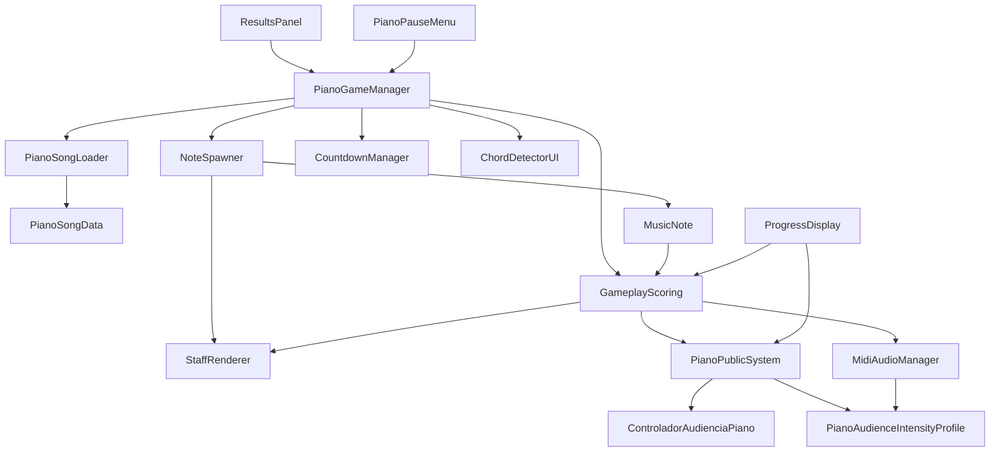

<!-- Generated by SpecStory, Markdown v2.1.0 -->

# 2026-08-05 02:34:37Z

<!-- Cursor IDE Session 113554f9-b5e8-491b-937b-a9618c2d1707 (2026-08-05 02:34:37Z) -->

_**User**_

Unity VR project at c:\Users\vic-s\Desktop\etheriavr_metaquest3. I need a detailed technical map of the PIANO MODE scripts so I can refactor them (reduce line count, modernize C# syntax) WITHOUT changing behavior.

Read these files thoroughly (they are the piano-mode core):
- Assets\Scripts\Piano\Gameplay\GameplayScoring.cs (932 lines)
- Assets\Scripts\Piano\Gameplay\NoteSpawner.cs (379)
- Assets\Scripts\Piano\Gameplay\MusicNote.cs (313)
- Assets\Scripts\Piano\Gameplay\PianoPublicSystem.cs (398)
- Assets\Scripts\Piano\Gameplay\HarmonyEngine.cs (40)
- Assets\Scripts\Piano\Gameplay\ControladorAudienciaPiano.cs (117)
- Assets\Scripts\Piano\Gameplay\PianoAudienceIntensityProfile.cs (61)
- Assets\Scripts\Piano\Gameplay\PlayerSpawnPoint.cs (54)
- Assets\Scripts\Piano\Rendering\StaffRenderer.cs (445) + StaffRenderer.Feedback.cs + StaffRenderer.LiveInputGuide.cs + StaffRenderer_HitLineFeedback.cs + HitLineRenderer.cs
- Assets\Scripts\Piano\Managers\PianoSongLoader.cs (191)
- Assets\Scripts\Piano\Data\*.cs
- Assets\Scripts\Piano\UI\CountdownManager.cs, ChordDetectorUI.cs
- Assets\Scripts\UI\PianoGameManager.cs (1040)

For each file report:
1. Public API surface: public/serialized fields (these are Unity-inspector-serialized — CRITICAL: they must NOT be renamed or have their types changed, or scene data breaks), public methods, public events, static members, coroutines.
2. What other scripts call into it.
3. Concrete refactor opportunities that are 100% behavior-preserving, e.g.: verbose null checks that could be `?.` or `??`, long if/else chains that are switch expressions, repeated code blocks, dead/commented-out code, excessive Debug.Log lines (count them), redundant comments, manual loops replaceable by LINQ (note: LINQ in Update() is a perf hazard in VR - flag if the code is on a hot path).
4. Any subtle behaviour that a naive refactor would break (e.g. float comparison order, Unity lifecycle ordering, yield return null counts in coroutines, `Invoke` by string name, serialization of private fields with [SerializeField]).

Be precise and cite line numbers. This is a large amount of reading — prioritize completeness of the API surface list and the "hazards" list over prose.

---

_**Agent (composer-2.5)**_

<think><details><summary>Thought Process</summary>
I am mapping the Piano Mode scripts to prepare a precise technical guide for refactoring.

I will read all target files in parallel and grep for external callers. The analysis will cover public APIs, call sites, behavior-preserving refactor opportunities, and subtle VR hazards such as LINQ on hot paths or string-based Unity lifecycle methods.

The scan now includes StaffRenderer partials, Data files, PianoSongLoader, CountdownManager, ChordDetectorUI, and PianoGameManager. External callers will be grepped for each file.
</details></think>

_**Agent (composer-2.5)**_

I'll map the piano-mode scripts systematically: read the core files, then trace cross-references across the project.


_**Agent (composer-2.5)**_

<tool-use data-tool-type="unknown" data-tool-name="update_current_step"><details>
<summary>Tool use: **update_current_step**</summary>
An unknown error occurred
</details></tool-use>

_**Agent (composer-2.5)**_

<tool-use data-tool-type="search" data-tool-name="glob_file_search"><details>
<summary>Tool use: **glob_file_search** • Searched codebase "" • **19** results in **1** directory</summary>

Directory: **`c:\Users\vic-s\Desktop\etheriavr_metaquest3`** (19 files)

| File |
|------|
| `../.\Assets\Scripts\Piano\UI\CountdownManager.cs` |
| `../.\Assets\Scripts\Piano\UI\ChordDetectorUI.cs` |
| `../.\Assets\Scripts\Piano\Rendering\StaffRenderer_HitLineFeedback.cs` |
| `../.\Assets\Scripts\Piano\Rendering\StaffRenderer.cs` |
| `../.\Assets\Scripts\Piano\Rendering\StaffRenderer.LiveInputGuide.cs` |
| `../.\Assets\Scripts\Piano\Rendering\StaffRenderer.Feedback.cs` |
| `../.\Assets\Scripts\Piano\Rendering\HitLineRenderer.cs` |
| `../.\Assets\Scripts\Piano\Managers\PianoSongLoader.cs` |
| `../.\Assets\Scripts\Piano\Gameplay\PlayerSpawnPoint.cs` |
| `../.\Assets\Scripts\Piano\Gameplay\PianoPublicSystem.cs` |
| `../.\Assets\Scripts\Piano\Gameplay\PianoAudienceIntensityProfile.cs` |
| `../.\Assets\Scripts\Piano\Gameplay\NoteSpawner.cs` |
| `../.\Assets\Scripts\Piano\Gameplay\MusicNote.cs` |
| `../.\Assets\Scripts\Piano\Gameplay\HarmonyEngine.cs` |
| `../.\Assets\Scripts\Piano\Gameplay\GameplayScoring.cs` |
| `../.\Assets\Scripts\Piano\Gameplay\ControladorAudienciaPiano.cs` |
| `../.\Assets\Scripts\Piano\Data\PianoSongData.cs` |
| `../.\Assets\Scripts\Piano\Data\PianoNoteData.cs` |
| `../.\Assets\Scripts\Piano\Data\PianoChordData.cs` |
</details></tool-use>

_**Agent (composer-2.5)**_

<tool-use data-tool-type="search" data-tool-name="glob_file_search"><details>
<summary>Tool use: **glob_file_search** • Searched codebase "" • **3** results in **1** directory</summary>

Directory: **`c:\Users\vic-s\Desktop\etheriavr_metaquest3`** (3 files)

| File |
|------|
| `../.\Assets\Scripts\Piano\Data\PianoSongData.cs` |
| `../.\Assets\Scripts\Piano\Data\PianoNoteData.cs` |
| `../.\Assets\Scripts\Piano\Data\PianoChordData.cs` |
</details></tool-use>

_**Agent (composer-2.5)**_

<tool-use data-tool-type="unknown" data-tool-name="ripgrep_raw_search"><details>
<summary>Tool use: **ripgrep_raw_search**</summary>

Parameters:

```json
{
  "caseInsensitive": false,
  "glob": "*.cs",
  "outputMode": "content",
  "path": "c:\\Users\\vic-s\\Desktop\\etheriavr_metaquest3\\Assets\\Scripts",
  "pattern": "GameplayScoring|NoteSpawner|MusicNote|PianoPublicSystem|HarmonyEngine|ControladorAudienciaPiano|PianoAudienceIntensityProfile|PlayerSpawnPoint|StaffRenderer|PianoSongLoader|CountdownManager|ChordDetectorUI|PianoGameManager"
}
```
Additional data:

```json
{
  "isPruned": true,
  "outputMode": "content",
  "path": "c:\\Users\\vic-s\\Desktop\\etheriavr_metaquest3\\Assets\\Scripts",
  "pattern": "GameplayScoring|NoteSpawner|MusicNote|PianoPublicSystem|HarmonyEngine|ControladorAudienciaPiano|PianoAudienceIntensityProfile|PlayerSpawnPoint|StaffRenderer|PianoSongLoader|CountdownManager|ChordDetectorUI|PianoGameManager",
  "topFiles": [
    {
      "matchCount": 4,
      "uri": "Assets\\Scripts\\Utils\\MidiAudioManager.cs"
    },
    {
      "matchCount": 2,
      "uri": "Assets\\Scripts\\UI\\ResultsPanel.cs"
    },
    {
      "matchCount": 10,
      "uri": "Assets\\Scripts\\UI\\ProgressDisplay.cs"
    },
    {
      "matchCount": 4,
      "uri": "Assets\\Scripts\\UI\\PianoPauseMenu.cs"
    },
    {
      "matchCount": 27,
      "uri": "Assets\\Scripts\\UI\\PianoGameManager.cs"
    },
    {
      "matchCount": 1,
      "uri": "Assets\\Scripts\\SingNetwork\\SingPublicSystem.cs"
    },
    {
      "matchCount": 1,
      "uri": "Assets\\Scripts\\SingNetwork\\ControladorAudienciaSing.cs"
    },
    {
      "matchCount": 1,
      "uri": "Assets\\Scripts\\Piano\\UI\\CountdownManager.cs"
    },
    {
      "matchCount": 1,
      "uri": "Assets\\Scripts\\Piano\\UI\\ChordDetectorUI.cs"
    },
    {
      "matchCount": 5,
      "uri": "Assets\\Scripts\\Piano\\Rendering\\StaffRenderer_HitLineFeedback.cs"
    },
    {
      "matchCount": 8,
      "uri": "Assets\\Scripts\\Piano\\Rendering\\StaffRenderer.cs"
    },
    {
      "matchCount": 1,
      "uri": "Assets\\Scripts\\Piano\\Rendering\\StaffRenderer.LiveInputGuide.cs"
    },
    {
      "matchCount": 2,
      "uri": "Assets\\Scripts\\Piano\\Rendering\\StaffRenderer.Feedback.cs"
    },
    {
      "matchCount": 1,
      "uri": "Assets\\Scripts\\Piano\\Managers\\PianoSongLoader.cs"
    },
    {
      "matchCount": 1,
      "uri": "Assets\\Scripts\\Piano\\Gameplay\\PlayerSpawnPoint.cs"
    },
    {
      "matchCount": 7,
      "uri": "Assets\\Scripts\\Piano\\Gameplay\\PianoPublicSystem.cs"
    },
    {
      "matchCount": 1,
      "uri": "Assets\\Scripts\\Piano\\Gameplay\\PianoAudienceIntensityProfile.cs"
    },
    {
      "matchCount": 18,
      "uri": "Assets\\Scripts\\Piano\\Gameplay\\NoteSpawner.cs"
    },
    {
      "matchCount": 8,
      "uri": "Assets\\Scripts\\Piano\\Gameplay\\MusicNote.cs"
    },
    {
      "matchCount": 1,
      "uri": "Assets\\Scripts\\Piano\\Gameplay\\HarmonyEngine.cs"
    }
  ],
  "totalFiles": 22,
  "totalMatches": 137
}
```
Status: **completed**

</details></tool-use>

_**Agent (composer-2.5)**_

<think><details><summary>Thought Process</summary>
Beginning a thorough review of the four piano-mode script files to map their APIs and behavioral hazards.

Reading the files in batches. GameplayScoring.cs appears shorter than its stated 932 lines.
</details></think>

_**Agent (composer-2.5)**_

<tool-use data-tool-type="read" data-tool-name="read_file_v2"><details>
<summary>Tool use: **read_file_v2** • Read file: c:\Users\vic-s\Desktop\etheriavr_metaquest3\Assets\Scripts\Piano\Gameplay\GameplayScoring.cs</summary>

</details></tool-use>

_**Agent (composer-2.5)**_

<tool-use data-tool-type="read" data-tool-name="read_file_v2"><details>
<summary>Tool use: **read_file_v2** • Read file: c:\Users\vic-s\Desktop\etheriavr_metaquest3\Assets\Scripts\Piano\Gameplay\NoteSpawner.cs</summary>

</details></tool-use>

_**Agent (composer-2.5)**_

<tool-use data-tool-type="read" data-tool-name="read_file_v2"><details>
<summary>Tool use: **read_file_v2** • Read file: c:\Users\vic-s\Desktop\etheriavr_metaquest3\Assets\Scripts\Piano\Gameplay\MusicNote.cs</summary>

</details></tool-use>

_**Agent (composer-2.5)**_

<tool-use data-tool-type="read" data-tool-name="read_file_v2"><details>
<summary>Tool use: **read_file_v2** • Read file: c:\Users\vic-s\Desktop\etheriavr_metaquest3\Assets\Scripts\Piano\Gameplay\PianoPublicSystem.cs</summary>

</details></tool-use>

_**Agent (composer-2.5)**_

<tool-use data-tool-type="read" data-tool-name="read_file_v2"><details>
<summary>Tool use: **read_file_v2** • Read file: c:\Users\vic-s\Desktop\etheriavr_metaquest3\Assets\Scripts\Piano\Gameplay\HarmonyEngine.cs</summary>

</details></tool-use>

_**Agent (composer-2.5)**_

<tool-use data-tool-type="read" data-tool-name="read_file_v2"><details>
<summary>Tool use: **read_file_v2** • Read file: c:\Users\vic-s\Desktop\etheriavr_metaquest3\Assets\Scripts\Piano\Gameplay\ControladorAudienciaPiano.cs</summary>

</details></tool-use>

_**Agent (composer-2.5)**_

<think><details><summary>Thought Process</summary>
Continuing to read the remaining piano-mode script files.
</details></think>

_**Agent (composer-2.5)**_

<tool-use data-tool-type="read" data-tool-name="read_file_v2"><details>
<summary>Tool use: **read_file_v2** • Read file: c:\Users\vic-s\Desktop\etheriavr_metaquest3\Assets\Scripts\Piano\Gameplay\PianoAudienceIntensityProfile.cs</summary>

</details></tool-use>

_**Agent (composer-2.5)**_

<tool-use data-tool-type="read" data-tool-name="read_file_v2"><details>
<summary>Tool use: **read_file_v2** • Read file: c:\Users\vic-s\Desktop\etheriavr_metaquest3\Assets\Scripts\Piano\Gameplay\PlayerSpawnPoint.cs</summary>

</details></tool-use>

_**Agent (composer-2.5)**_

<tool-use data-tool-type="read" data-tool-name="read_file_v2"><details>
<summary>Tool use: **read_file_v2** • Read file: c:\Users\vic-s\Desktop\etheriavr_metaquest3\Assets\Scripts\Piano\Rendering\StaffRenderer.cs</summary>

</details></tool-use>

_**Agent (composer-2.5)**_

<tool-use data-tool-type="read" data-tool-name="read_file_v2"><details>
<summary>Tool use: **read_file_v2** • Read file: c:\Users\vic-s\Desktop\etheriavr_metaquest3\Assets\Scripts\Piano\Rendering\StaffRenderer.Feedback.cs</summary>

</details></tool-use>

_**Agent (composer-2.5)**_

<tool-use data-tool-type="read" data-tool-name="read_file_v2"><details>
<summary>Tool use: **read_file_v2** • Read file: c:\Users\vic-s\Desktop\etheriavr_metaquest3\Assets\Scripts\Piano\Rendering\StaffRenderer.LiveInputGuide.cs</summary>

</details></tool-use>

_**Agent (composer-2.5)**_

<tool-use data-tool-type="read" data-tool-name="read_file_v2"><details>
<summary>Tool use: **read_file_v2** • Read file: c:\Users\vic-s\Desktop\etheriavr_metaquest3\Assets\Scripts\Piano\Rendering\StaffRenderer_HitLineFeedback.cs</summary>

</details></tool-use>

_**Agent (composer-2.5)**_

<tool-use data-tool-type="read" data-tool-name="read_file_v2"><details>
<summary>Tool use: **read_file_v2** • Read file: c:\Users\vic-s\Desktop\etheriavr_metaquest3\Assets\Scripts\Piano\Rendering\HitLineRenderer.cs</summary>

</details></tool-use>

_**Agent (composer-2.5)**_

<think><details><summary>Thought Process</summary>
The remaining piano-mode scripts still need review:

- PianoSongLoader
- Data files
- CountdownManager
- ChordDetectorUI
- PianoGameManager

Grepping for additional callers.
</details></think>

_**Agent (composer-2.5)**_

<tool-use data-tool-type="read" data-tool-name="read_file_v2"><details>
<summary>Tool use: **read_file_v2** • Read file: c:\Users\vic-s\Desktop\etheriavr_metaquest3\Assets\Scripts\Piano\Managers\PianoSongLoader.cs</summary>

</details></tool-use>

_**Agent (composer-2.5)**_

<tool-use data-tool-type="read" data-tool-name="read_file_v2"><details>
<summary>Tool use: **read_file_v2** • Read file: c:\Users\vic-s\Desktop\etheriavr_metaquest3\Assets\Scripts\Piano\Data\PianoSongData.cs</summary>

</details></tool-use>

_**Agent (composer-2.5)**_

<tool-use data-tool-type="read" data-tool-name="read_file_v2"><details>
<summary>Tool use: **read_file_v2** • Read file: c:\Users\vic-s\Desktop\etheriavr_metaquest3\Assets\Scripts\Piano\Data\PianoNoteData.cs</summary>

</details></tool-use>

_**Agent (composer-2.5)**_

<tool-use data-tool-type="read" data-tool-name="read_file_v2"><details>
<summary>Tool use: **read_file_v2** • Read file: c:\Users\vic-s\Desktop\etheriavr_metaquest3\Assets\Scripts\Piano\Data\PianoChordData.cs</summary>

</details></tool-use>

_**Agent (composer-2.5)**_

<tool-use data-tool-type="read" data-tool-name="read_file_v2"><details>
<summary>Tool use: **read_file_v2** • Read file: c:\Users\vic-s\Desktop\etheriavr_metaquest3\Assets\Scripts\Piano\UI\CountdownManager.cs</summary>

</details></tool-use>

_**Agent (composer-2.5)**_

<tool-use data-tool-type="read" data-tool-name="read_file_v2"><details>
<summary>Tool use: **read_file_v2** • Read file: c:\Users\vic-s\Desktop\etheriavr_metaquest3\Assets\Scripts\Piano\UI\ChordDetectorUI.cs</summary>

</details></tool-use>

_**Agent (composer-2.5)**_

<tool-use data-tool-type="read" data-tool-name="read_file_v2"><details>
<summary>Tool use: **read_file_v2** • Read file: c:\Users\vic-s\Desktop\etheriavr_metaquest3\Assets\Scripts\UI\PianoGameManager.cs</summary>

</details></tool-use>

_**Agent (composer-2.5)**_

<think><details><summary>Thought Process</summary>
Searching for callers of HarmonyEngine, ProgressDisplay, MidiAudioManager, and other related classes to map the full dependency graph.

Also counting Debug.Log lines in each file.
</details></think>

_**Agent (composer-2.5)**_

Searching for callers and counting Debug.Log usage across the piano scripts.


_**Agent (composer-2.5)**_

<tool-use data-tool-type="unknown" data-tool-name="ripgrep_raw_search"><details>
<summary>Tool use: **ripgrep_raw_search**</summary>

Parameters:

```json
{
  "caseInsensitive": false,
  "glob": "*.cs",
  "outputMode": "content",
  "path": "c:\\Users\\vic-s\\Desktop\\etheriavr_metaquest3\\Assets\\Scripts",
  "pattern": "\\bGameplayScoring\\b"
}
```
Additional data:

```json
{
  "isPruned": true,
  "outputMode": "content",
  "path": "c:\\Users\\vic-s\\Desktop\\etheriavr_metaquest3\\Assets\\Scripts",
  "pattern": "\\bGameplayScoring\\b",
  "topFiles": [
    {
      "matchCount": 1,
      "uri": "Assets\\Scripts\\Utils\\MidiAudioManager.cs"
    },
    {
      "matchCount": 5,
      "uri": "Assets\\Scripts\\UI\\ProgressDisplay.cs"
    },
    {
      "matchCount": 4,
      "uri": "Assets\\Scripts\\UI\\PianoGameManager.cs"
    },
    {
      "matchCount": 2,
      "uri": "Assets\\Scripts\\Piano\\Gameplay\\PianoPublicSystem.cs"
    },
    {
      "matchCount": 2,
      "uri": "Assets\\Scripts\\Piano\\Gameplay\\MusicNote.cs"
    },
    {
      "matchCount": 4,
      "uri": "Assets\\Scripts\\Piano\\Gameplay\\GameplayScoring.cs"
    }
  ],
  "totalFiles": 6,
  "totalMatches": 18
}
```
Status: **completed**

</details></tool-use>

_**Agent (composer-2.5)**_

<tool-use data-tool-type="unknown" data-tool-name="ripgrep_raw_search"><details>
<summary>Tool use: **ripgrep_raw_search**</summary>

Parameters:

```json
{
  "caseInsensitive": false,
  "glob": "*.cs",
  "outputMode": "content",
  "path": "c:\\Users\\vic-s\\Desktop\\etheriavr_metaquest3\\Assets\\Scripts",
  "pattern": "\\bHarmonyEngine\\b"
}
```
Additional data:

```json
{
  "isPruned": true,
  "outputMode": "content",
  "path": "c:\\Users\\vic-s\\Desktop\\etheriavr_metaquest3\\Assets\\Scripts",
  "pattern": "\\bHarmonyEngine\\b",
  "topFiles": [
    {
      "matchCount": 1,
      "uri": "Assets\\Scripts\\Piano\\Gameplay\\HarmonyEngine.cs"
    }
  ],
  "totalFiles": 1,
  "totalMatches": 1
}
```
Status: **completed**

</details></tool-use>

_**Agent (composer-2.5)**_

<tool-use data-tool-type="unknown" data-tool-name="ripgrep_raw_search"><details>
<summary>Tool use: **ripgrep_raw_search**</summary>

Parameters:

```json
{
  "caseInsensitive": false,
  "glob": "*.cs",
  "outputMode": "content",
  "path": "c:\\Users\\vic-s\\Desktop\\etheriavr_metaquest3",
  "pattern": "\\bHitLineRenderer\\b"
}
```
Additional data:

```json
{
  "isPruned": true,
  "outputMode": "content",
  "path": "c:\\Users\\vic-s\\Desktop\\etheriavr_metaquest3",
  "pattern": "\\bHitLineRenderer\\b",
  "topFiles": [
    {
      "matchCount": 1,
      "uri": ".\\Assets\\Scripts\\Piano\\Rendering\\HitLineRenderer.cs"
    }
  ],
  "totalFiles": 1,
  "totalMatches": 1
}
```
Status: **completed**

</details></tool-use>

_**Agent (composer-2.5)**_

<tool-use data-tool-type="unknown" data-tool-name="ripgrep_raw_search"><details>
<summary>Tool use: **ripgrep_raw_search**</summary>

Parameters:

```json
{
  "caseInsensitive": false,
  "glob": "*.cs",
  "outputMode": "content",
  "path": "c:\\Users\\vic-s\\Desktop\\etheriavr_metaquest3",
  "pattern": "\\bPlayerSpawnPoint\\b"
}
```
Additional data:

```json
{
  "isPruned": true,
  "outputMode": "content",
  "path": "c:\\Users\\vic-s\\Desktop\\etheriavr_metaquest3",
  "pattern": "\\bPlayerSpawnPoint\\b",
  "topFiles": [
    {
      "matchCount": 1,
      "uri": ".\\Assets\\Scripts\\Piano\\Gameplay\\PlayerSpawnPoint.cs"
    }
  ],
  "totalFiles": 1,
  "totalMatches": 1
}
```
Status: **completed**

</details></tool-use>

_**Agent (composer-2.5)**_

<tool-use data-tool-type="unknown" data-tool-name="ripgrep_raw_search"><details>
<summary>Tool use: **ripgrep_raw_search**</summary>

Parameters:

```json
{
  "caseInsensitive": false,
  "glob": "*.cs",
  "outputMode": "content",
  "path": "c:\\Users\\vic-s\\Desktop\\etheriavr_metaquest3\\Assets\\Scripts",
  "pattern": "\\bMusicNote\\b"
}
```
Additional data:

```json
{
  "isPruned": true,
  "outputMode": "content",
  "path": "c:\\Users\\vic-s\\Desktop\\etheriavr_metaquest3\\Assets\\Scripts",
  "pattern": "\\bMusicNote\\b",
  "topFiles": [
    {
      "matchCount": 7,
      "uri": "Assets\\Scripts\\Piano\\Gameplay\\NoteSpawner.cs"
    },
    {
      "matchCount": 3,
      "uri": "Assets\\Scripts\\Piano\\Gameplay\\MusicNote.cs"
    },
    {
      "matchCount": 1,
      "uri": "Assets\\Scripts\\Piano\\Gameplay\\GameplayScoring.cs"
    }
  ],
  "totalFiles": 3,
  "totalMatches": 11
}
```
Status: **completed**

</details></tool-use>

_**Agent (composer-2.5)**_

<tool-use data-tool-type="unknown" data-tool-name="ripgrep_raw_search"><details>
<summary>Tool use: **ripgrep_raw_search**</summary>

Parameters:

```json
{
  "caseInsensitive": false,
  "glob": "**/Piano/**/*.cs",
  "outputMode": "count",
  "path": "c:\\Users\\vic-s\\Desktop\\etheriavr_metaquest3\\Assets\\Scripts",
  "pattern": "Debug\\.(Log|LogWarning|LogError)"
}
```
Additional data:

```json
{
  "isPruned": true,
  "outputMode": "count",
  "path": "c:\\Users\\vic-s\\Desktop\\etheriavr_metaquest3\\Assets\\Scripts",
  "pattern": "Debug\\.(Log|LogWarning|LogError)",
  "topFiles": [
    {
      "matchCount": 1,
      "uri": "Assets\\Scripts\\Piano\\UI\\CountdownManager.cs"
    },
    {
      "matchCount": 7,
      "uri": "Assets\\Scripts\\Piano\\Rendering\\StaffRenderer.cs"
    },
    {
      "matchCount": 12,
      "uri": "Assets\\Scripts\\Piano\\Managers\\PianoSongLoader.cs"
    },
    {
      "matchCount": 1,
      "uri": "Assets\\Scripts\\Piano\\Gameplay\\PlayerSpawnPoint.cs"
    },
    {
      "matchCount": 2,
      "uri": "Assets\\Scripts\\Piano\\Gameplay\\PianoPublicSystem.cs"
    },
    {
      "matchCount": 6,
      "uri": "Assets\\Scripts\\Piano\\Gameplay\\NoteSpawner.cs"
    },
    {
      "matchCount": 6,
      "uri": "Assets\\Scripts\\Piano\\Gameplay\\GameplayScoring.cs"
    }
  ],
  "totalFiles": 7,
  "totalMatches": 35
}
```
Status: **completed**

</details></tool-use>

_**Agent (composer-2.5)**_

<tool-use data-tool-type="unknown" data-tool-name="ripgrep_raw_search"><details>
<summary>Tool use: **ripgrep_raw_search**</summary>

Parameters:

```json
{
  "caseInsensitive": false,
  "glob": "**/PianoGameManager.cs",
  "outputMode": "count",
  "path": "c:\\Users\\vic-s\\Desktop\\etheriavr_metaquest3\\Assets\\Scripts",
  "pattern": "Debug\\.(Log|LogWarning|LogError)"
}
```
Additional data:

```json
{
  "isPruned": true,
  "outputMode": "count",
  "path": "c:\\Users\\vic-s\\Desktop\\etheriavr_metaquest3\\Assets\\Scripts",
  "pattern": "Debug\\.(Log|LogWarning|LogError)",
  "topFiles": [
    {
      "matchCount": 21,
      "uri": "Assets\\Scripts\\UI\\PianoGameManager.cs"
    }
  ],
  "totalFiles": 1,
  "totalMatches": 21
}
```
Status: **completed**

</details></tool-use>

_**Agent (composer-2.5)**_

<think><details><summary>Thought Process</summary>
Mapping call sites for StaffRenderer, PianoPublicSystem, NoteSpawner, CountdownManager, ChordDetectorUI, PianoSongLoader, PianoAudienceIntensityProfile, and GameplayResults.
</details></think>

_**Agent (composer-2.5)**_

<tool-use data-tool-type="unknown" data-tool-name="ripgrep_raw_search"><details>
<summary>Tool use: **ripgrep_raw_search**</summary>

Parameters:

```json
{
  "caseInsensitive": false,
  "glob": "*.cs",
  "outputMode": "content",
  "path": "c:\\Users\\vic-s\\Desktop\\etheriavr_metaquest3\\Assets\\Scripts",
  "pattern": "\\bStaffRenderer\\b"
}
```
Additional data:

```json
{
  "isPruned": true,
  "outputMode": "content",
  "path": "c:\\Users\\vic-s\\Desktop\\etheriavr_metaquest3\\Assets\\Scripts",
  "pattern": "\\bStaffRenderer\\b",
  "topFiles": [
    {
      "matchCount": 3,
      "uri": "Assets\\Scripts\\UI\\PianoGameManager.cs"
    },
    {
      "matchCount": 5,
      "uri": "Assets\\Scripts\\Piano\\Rendering\\StaffRenderer_HitLineFeedback.cs"
    },
    {
      "matchCount": 8,
      "uri": "Assets\\Scripts\\Piano\\Rendering\\StaffRenderer.cs"
    },
    {
      "matchCount": 1,
      "uri": "Assets\\Scripts\\Piano\\Rendering\\StaffRenderer.LiveInputGuide.cs"
    },
    {
      "matchCount": 2,
      "uri": "Assets\\Scripts\\Piano\\Rendering\\StaffRenderer.Feedback.cs"
    },
    {
      "matchCount": 4,
      "uri": "Assets\\Scripts\\Piano\\Gameplay\\NoteSpawner.cs"
    },
    {
      "matchCount": 2,
      "uri": "Assets\\Scripts\\Piano\\Gameplay\\MusicNote.cs"
    },
    {
      "matchCount": 18,
      "uri": "Assets\\Scripts\\Piano\\Gameplay\\GameplayScoring.cs"
    }
  ],
  "totalFiles": 8,
  "totalMatches": 43
}
```
Status: **completed**

</details></tool-use>

_**Agent (composer-2.5)**_

<tool-use data-tool-type="unknown" data-tool-name="ripgrep_raw_search"><details>
<summary>Tool use: **ripgrep_raw_search**</summary>

Parameters:

```json
{
  "caseInsensitive": false,
  "glob": "*.cs",
  "outputMode": "content",
  "path": "c:\\Users\\vic-s\\Desktop\\etheriavr_metaquest3\\Assets\\Scripts",
  "pattern": "\\bPianoPublicSystem\\b"
}
```
Additional data:

```json
{
  "isPruned": true,
  "outputMode": "content",
  "path": "c:\\Users\\vic-s\\Desktop\\etheriavr_metaquest3\\Assets\\Scripts",
  "pattern": "\\bPianoPublicSystem\\b",
  "topFiles": [
    {
      "matchCount": 2,
      "uri": "Assets\\Scripts\\UI\\ProgressDisplay.cs"
    },
    {
      "matchCount": 4,
      "uri": "Assets\\Scripts\\UI\\PianoGameManager.cs"
    },
    {
      "matchCount": 1,
      "uri": "Assets\\Scripts\\SingNetwork\\SingPublicSystem.cs"
    },
    {
      "matchCount": 1,
      "uri": "Assets\\Scripts\\Piano\\Gameplay\\PianoPublicSystem.cs"
    },
    {
      "matchCount": 5,
      "uri": "Assets\\Scripts\\Piano\\Gameplay\\GameplayScoring.cs"
    },
    {
      "matchCount": 2,
      "uri": "Assets\\Scripts\\Piano\\Gameplay\\ControladorAudienciaPiano.cs"
    }
  ],
  "totalFiles": 6,
  "totalMatches": 15
}
```
Status: **completed**

</details></tool-use>

_**Agent (composer-2.5)**_

<tool-use data-tool-type="unknown" data-tool-name="ripgrep_raw_search"><details>
<summary>Tool use: **ripgrep_raw_search**</summary>

Parameters:

```json
{
  "caseInsensitive": false,
  "glob": "*.cs",
  "outputMode": "content",
  "path": "c:\\Users\\vic-s\\Desktop\\etheriavr_metaquest3\\Assets\\Scripts",
  "pattern": "\\bNoteSpawner\\b"
}
```
Additional data:

```json
{
  "isPruned": true,
  "outputMode": "content",
  "path": "c:\\Users\\vic-s\\Desktop\\etheriavr_metaquest3\\Assets\\Scripts",
  "pattern": "\\bNoteSpawner\\b",
  "topFiles": [
    {
      "matchCount": 3,
      "uri": "Assets\\Scripts\\UI\\PianoGameManager.cs"
    },
    {
      "matchCount": 7,
      "uri": "Assets\\Scripts\\Piano\\Gameplay\\NoteSpawner.cs"
    }
  ],
  "totalFiles": 2,
  "totalMatches": 10
}
```
Status: **completed**

</details></tool-use>

_**Agent (composer-2.5)**_

<tool-use data-tool-type="unknown" data-tool-name="ripgrep_raw_search"><details>
<summary>Tool use: **ripgrep_raw_search**</summary>

Parameters:

```json
{
  "caseInsensitive": false,
  "glob": "*.cs",
  "outputMode": "content",
  "path": "c:\\Users\\vic-s\\Desktop\\etheriavr_metaquest3\\Assets\\Scripts",
  "pattern": "\\bCountdownManager\\b|\\bChordDetectorUI\\b|\\bPianoSongLoader\\b|\\bGameplayResults\\b|\\bPianoAudienceIntensityProfile\\b|\\bControladorAudienciaPiano\\b"
}
```
Additional data:

```json
{
  "isPruned": true,
  "outputMode": "content",
  "path": "c:\\Users\\vic-s\\Desktop\\etheriavr_metaquest3\\Assets\\Scripts",
  "pattern": "\\bCountdownManager\\b|\\bChordDetectorUI\\b|\\bPianoSongLoader\\b|\\bGameplayResults\\b|\\bPianoAudienceIntensityProfile\\b|\\bControladorAudienciaPiano\\b",
  "topFiles": [
    {
      "matchCount": 3,
      "uri": "Assets\\Scripts\\Utils\\MidiAudioManager.cs"
    },
    {
      "matchCount": 2,
      "uri": "Assets\\Scripts\\UI\\ResultsPanel.cs"
    },
    {
      "matchCount": 9,
      "uri": "Assets\\Scripts\\UI\\PianoGameManager.cs"
    },
    {
      "matchCount": 1,
      "uri": "Assets\\Scripts\\SingNetwork\\ControladorAudienciaSing.cs"
    },
    {
      "matchCount": 1,
      "uri": "Assets\\Scripts\\Piano\\UI\\CountdownManager.cs"
    },
    {
      "matchCount": 1,
      "uri": "Assets\\Scripts\\Piano\\UI\\ChordDetectorUI.cs"
    },
    {
      "matchCount": 1,
      "uri": "Assets\\Scripts\\Piano\\Managers\\PianoSongLoader.cs"
    },
    {
      "matchCount": 5,
      "uri": "Assets\\Scripts\\Piano\\Gameplay\\PianoPublicSystem.cs"
    },
    {
      "matchCount": 1,
      "uri": "Assets\\Scripts\\Piano\\Gameplay\\PianoAudienceIntensityProfile.cs"
    },
    {
      "matchCount": 5,
      "uri": "Assets\\Scripts\\Piano\\Gameplay\\GameplayScoring.cs"
    },
    {
      "matchCount": 1,
      "uri": "Assets\\Scripts\\Piano\\Gameplay\\ControladorAudienciaPiano.cs"
    }
  ],
  "totalFiles": 11,
  "totalMatches": 30
}
```
Status: **completed**

</details></tool-use>

_**Agent (composer-2.5)**_

<tool-use data-tool-type="unknown" data-tool-name="ripgrep_raw_search"><details>
<summary>Tool use: **ripgrep_raw_search**</summary>

Parameters:

```json
{
  "caseInsensitive": false,
  "glob": "*.cs",
  "outputMode": "content",
  "path": "c:\\Users\\vic-s\\Desktop\\etheriavr_metaquest3\\Assets\\Scripts",
  "pattern": "GetActiveNotes|ShowDetectedChord|OnNoteHit|OnNoteMissed|OnNoteEvaluated|OnGameFinished|ProcessMidiNoteOn|ReportVisualFeedbackLatency"
}
```
Additional data:

```json
{
  "isPruned": true,
  "outputMode": "content",
  "path": "c:\\Users\\vic-s\\Desktop\\etheriavr_metaquest3\\Assets\\Scripts",
  "pattern": "GetActiveNotes|ShowDetectedChord|OnNoteHit|OnNoteMissed|OnNoteEvaluated|OnGameFinished|ProcessMidiNoteOn|ReportVisualFeedbackLatency",
  "topFiles": [
    {
      "matchCount": 4,
      "uri": "Assets\\Scripts\\UI\\ProgressDisplay.cs"
    },
    {
      "matchCount": 4,
      "uri": "Assets\\Scripts\\UI\\PianoGameManager.cs"
    },
    {
      "matchCount": 1,
      "uri": "Assets\\Scripts\\SingNetwork\\SingPublicSystem.cs"
    },
    {
      "matchCount": 1,
      "uri": "Assets\\Scripts\\SingNetwork\\NoteScroller.cs"
    },
    {
      "matchCount": 1,
      "uri": "Assets\\Scripts\\SingNetwork\\HitDetector.cs"
    },
    {
      "matchCount": 6,
      "uri": "Assets\\Scripts\\Piano\\Gameplay\\PianoPublicSystem.cs"
    },
    {
      "matchCount": 4,
      "uri": "Assets\\Scripts\\Piano\\Gameplay\\MusicNote.cs"
    },
    {
      "matchCount": 17,
      "uri": "Assets\\Scripts\\Piano\\Gameplay\\GameplayScoring.cs"
    }
  ],
  "totalFiles": 8,
  "totalMatches": 38
}
```
Status: **completed**

</details></tool-use>

_**Agent (composer-2.5)**_

<tool-use data-tool-type="read" data-tool-name="read_file_v2"><details>
<summary>Tool use: **read_file_v2** • Read file: c:\Users\vic-s\Desktop\etheriavr_metaquest3\Assets\Scripts\UI\ProgressDisplay.cs</summary>

</details></tool-use>

_**Agent (composer-2.5)**_

<think><details><summary>Thought Process</summary>
Checking call sites for ShowDetectedChord, SetHitLinePerfect, and SetHitLineGood. Verifying whether PianoSongData methods are invoked externally. Counting debug logs in GameplayScoring more precisely, since LogHarmonyAnalysis uses conditional Debug.Log.

Duplicate EvaluateTimingQuality exists between GameplayScoring and HarmonyEngine; the latter is dead code. TriggerHitFeedback stores a Ti dictionary but never invokes SetHitLinePerfect or SetHitLineGood, leaving hit-line feedback broken. UpdateStaffHitLineFeedback resets after 0.3 seconds without ever turning green.
</details></think>

_**Agent (composer-2.5)**_

<tool-use data-tool-type="unknown" data-tool-name="ripgrep_raw_search"><details>
<summary>Tool use: **ripgrep_raw_search**</summary>

Parameters:

```json
{
  "caseInsensitive": false,
  "glob": "*.cs",
  "outputMode": "content",
  "path": "c:\\Users\\vic-s\\Desktop\\etheriavr_metaquest3",
  "pattern": "SetHitLinePerfect|SetHitLineGood|SetHitLineError|TriggerHitEffect|ShowDetectedChord|ShowChord\\(|PianoSongData\\.|GetRightHandMelody|GetGameDuration|MidiToNoteName|GetActiveNotes\\(\\)"
}
```
Additional data:

```json
{
  "isPruned": true,
  "outputMode": "content",
  "path": "c:\\Users\\vic-s\\Desktop\\etheriavr_metaquest3",
  "pattern": "SetHitLinePerfect|SetHitLineGood|SetHitLineError|TriggerHitEffect|ShowDetectedChord|ShowChord\\(|PianoSongData\\.|GetRightHandMelody|GetGameDuration|MidiToNoteName|GetActiveNotes\\(\\)",
  "topFiles": [
    {
      "matchCount": 2,
      "uri": ".\\Assets\\Scripts\\UI\\PianoGameManager.cs"
    },
    {
      "matchCount": 2,
      "uri": ".\\Assets\\Scripts\\SingNetwork\\PlayerNoteVisualizer.cs"
    },
    {
      "matchCount": 1,
      "uri": ".\\Assets\\Scripts\\SingNetwork\\NoteScroller.cs"
    },
    {
      "matchCount": 1,
      "uri": ".\\Assets\\Scripts\\SingNetwork\\HitDetector.cs"
    },
    {
      "matchCount": 3,
      "uri": ".\\Assets\\Scripts\\Piano\\UI\\ChordDetectorUI.cs"
    },
    {
      "matchCount": 3,
      "uri": ".\\Assets\\Scripts\\Piano\\Rendering\\StaffRenderer.Feedback.cs"
    },
    {
      "matchCount": 1,
      "uri": ".\\Assets\\Scripts\\Piano\\Rendering\\HitLineRenderer.cs"
    },
    {
      "matchCount": 3,
      "uri": ".\\Assets\\Scripts\\Piano\\Gameplay\\MusicNote.cs"
    },
    {
      "matchCount": 2,
      "uri": ".\\Assets\\Scripts\\Piano\\Gameplay\\GameplayScoring.cs"
    },
    {
      "matchCount": 2,
      "uri": ".\\Assets\\Scripts\\Piano\\Data\\PianoSongData.cs"
    }
  ],
  "totalFiles": 10,
  "totalMatches": 20
}
```
Status: **completed**

</details></tool-use>

_**Agent (composer-2.5)**_

<tool-use data-tool-type="unknown" data-tool-name="ripgrep_raw_search"><details>
<summary>Tool use: **ripgrep_raw_search**</summary>

Parameters:

```json
{
  "caseInsensitive": false,
  "glob": "*.cs",
  "outputMode": "content",
  "path": "c:\\Users\\vic-s\\Desktop\\etheriavr_metaquest3\\Assets\\Scripts\\Piano\\Gameplay\\GameplayScoring.cs",
  "pattern": "Debug\\.Log"
}
```
Additional data:

```json
{
  "isPruned": true,
  "outputMode": "content",
  "path": "c:\\Users\\vic-s\\Desktop\\etheriavr_metaquest3\\Assets\\Scripts\\Piano\\Gameplay\\GameplayScoring.cs",
  "pattern": "Debug\\.Log",
  "topFiles": [
    {
      "matchCount": 6,
      "uri": "Assets\\Scripts\\Piano\\Gameplay\\GameplayScoring.cs"
    }
  ],
  "totalFiles": 1,
  "totalMatches": 6
}
```
Status: **completed**

</details></tool-use>

_**Agent (composer-2.5)**_

<tool-use data-tool-type="unknown" data-tool-name="ripgrep_raw_search"><details>
<summary>Tool use: **ripgrep_raw_search**</summary>

Parameters:

```json
{
  "caseInsensitive": false,
  "glob": "*.cs",
  "outputMode": "content",
  "path": "c:\\Users\\vic-s\\Desktop\\etheriavr_metaquest3\\Assets\\Scripts\\Piano\\Gameplay\\PianoPublicSystem.cs",
  "pattern": "Debug\\.Log"
}
```
Additional data:

```json
{
  "isPruned": true,
  "outputMode": "content",
  "path": "c:\\Users\\vic-s\\Desktop\\etheriavr_metaquest3\\Assets\\Scripts\\Piano\\Gameplay\\PianoPublicSystem.cs",
  "pattern": "Debug\\.Log",
  "topFiles": [
    {
      "matchCount": 2,
      "uri": "Assets\\Scripts\\Piano\\Gameplay\\PianoPublicSystem.cs"
    }
  ],
  "totalFiles": 1,
  "totalMatches": 2
}
```
Status: **completed**

</details></tool-use>

_**Agent (composer-2.5)**_

<tool-use data-tool-type="unknown" data-tool-name="ripgrep_raw_search"><details>
<summary>Tool use: **ripgrep_raw_search**</summary>

Parameters:

```json
{
  "caseInsensitive": false,
  "glob": "*.cs",
  "outputMode": "content",
  "path": "c:\\Users\\vic-s\\Desktop\\etheriavr_metaquest3\\Assets\\Scripts\\UI\\PianoPauseMenu.cs",
  "pattern": "PianoGameManager"
}
```
Additional data:

```json
{
  "isPruned": true,
  "outputMode": "content",
  "path": "c:\\Users\\vic-s\\Desktop\\etheriavr_metaquest3\\Assets\\Scripts\\UI\\PianoPauseMenu.cs",
  "pattern": "PianoGameManager",
  "topFiles": [
    {
      "matchCount": 4,
      "uri": "Assets\\Scripts\\UI\\PianoPauseMenu.cs"
    }
  ],
  "totalFiles": 1,
  "totalMatches": 4
}
```
Status: **completed**

</details></tool-use>

_**Agent (composer-2.5)**_

<think><details><summary>Thought Process</summary>
Checking PianoPauseMenu for PianoGameManager method calls. Verifying whether ShowDetectedChord is invoked from MidiAudioManager or other sources.
</details></think>

_**Agent (composer-2.5)**_

<tool-use data-tool-type="unknown" data-tool-name="ripgrep_raw_search"><details>
<summary>Tool use: **ripgrep_raw_search**</summary>

Parameters:

```json
{
  "caseInsensitive": false,
  "glob": "*.cs",
  "outputMode": "content",
  "path": "c:\\Users\\vic-s\\Desktop\\etheriavr_metaquest3",
  "pattern": "ShowDetectedChord"
}
```
Additional data:

```json
{
  "isPruned": true,
  "outputMode": "content",
  "path": "c:\\Users\\vic-s\\Desktop\\etheriavr_metaquest3",
  "pattern": "ShowDetectedChord",
  "topFiles": [
    {
      "matchCount": 1,
      "uri": ".\\Assets\\Scripts\\UI\\PianoGameManager.cs"
    }
  ],
  "totalFiles": 1,
  "totalMatches": 1
}
```
Status: **completed**

</details></tool-use>

_**Agent (composer-2.5)**_

<tool-use data-tool-type="read" data-tool-name="read_file_v2"><details>
<summary>Tool use: **read_file_v2** • Read file: c:\Users\vic-s\Desktop\etheriavr_metaquest3\Assets\Scripts\UI\PianoPauseMenu.cs</summary>

</details></tool-use>

_**Agent (composer-2.5)**_

<tool-use data-tool-type="unknown" data-tool-name="ripgrep_raw_search"><details>
<summary>Tool use: **ripgrep_raw_search**</summary>

Parameters:

```json
{
  "caseInsensitive": false,
  "glob": "*.cs",
  "outputMode": "content",
  "path": "c:\\Users\\vic-s\\Desktop\\etheriavr_metaquest3",
  "pattern": "PianoGameManager\\.Instance|\\.PauseGame|\\.ResumeGame|\\.StartGame|\\.PrepareForSceneExit|\\.HasGameplayStarted|\\.CanTogglePause"
}
```
Additional data:

```json
{
  "isPruned": true,
  "outputMode": "content",
  "path": "c:\\Users\\vic-s\\Desktop\\etheriavr_metaquest3",
  "pattern": "PianoGameManager\\.Instance|\\.PauseGame|\\.ResumeGame|\\.StartGame|\\.PrepareForSceneExit|\\.HasGameplayStarted|\\.CanTogglePause",
  "topFiles": [
    {
      "matchCount": 2,
      "uri": ".\\Assets\\Scripts\\UI\\ResultsPanel.cs"
    },
    {
      "matchCount": 1,
      "uri": ".\\Assets\\Scripts\\UI\\ProgressDisplay.cs"
    },
    {
      "matchCount": 6,
      "uri": ".\\Assets\\Scripts\\UI\\PianoPauseMenu.cs"
    },
    {
      "matchCount": 1,
      "uri": ".\\Assets\\Scripts\\Piano\\Gameplay\\NoteSpawner.cs"
    },
    {
      "matchCount": 1,
      "uri": ".\\Assets\\Scripts\\Piano\\Gameplay\\MusicNote.cs"
    },
    {
      "matchCount": 1,
      "uri": ".\\Assets\\Scripts\\Piano\\Gameplay\\GameplayScoring.cs"
    },
    {
      "matchCount": 3,
      "uri": ".\\Library\\PackageCache\\com.meta.xr.sdk.core@f8b4cfb2789f\\Scripts\\BuildingBlocks\\MultiplayerBlocks\\PhotonFusion\\CustomMatchmaking\\CustomMatchmakingFusion.cs"
    }
  ],
  "totalFiles": 7,
  "totalMatches": 15
}
```
Status: **completed**

</details></tool-use>

_**Agent (composer-2.5)**_

<think><details><summary>Thought Process</summary>
The full scope of the four piano-mode scripts is now clear.

Runtime clamping in GameplayScoring.Start() forces simultaneousChordGrace to a 0.12f floor, overriding any lower inspector value. HarmonyEngine is dead code. StaffRenderer_HitLineFeedback.cs is fully commented out and can be deleted. HitLineRenderer and PlayerSpawnPoint appear to be self-referencing stubs with no external callers.

TriggerHitFeedback stores timestamps but never invokes SetHitLinePerfect or SetHitLineGood, leaving the feedback path incomplete.

MusicNote contains the burn visual, yet actual hit and miss scoring lives in GameplayScoring via MIDI events.

GetActiveNotes runs LINQ ToList over FindObjectsOfType, which is expensive, though grep shows it is not called from outside.

PianoSongData getters such as GetRightHandMelody still need to be checked for usage.
</details></think>

_**Agent (composer-2.5)**_

<tool-use data-tool-type="unknown" data-tool-name="ripgrep_raw_search"><details>
<summary>Tool use: **ripgrep_raw_search**</summary>

Parameters:

```json
{
  "caseInsensitive": false,
  "glob": "*.cs",
  "outputMode": "content",
  "path": "c:\\Users\\vic-s\\Desktop\\etheriavr_metaquest3",
  "pattern": "GetRightHandMelody|GetLeftHandMelody|GetRightHandChords|GetLeftHandChords|TotalMelodyNotes|TotalChords|TotalGameNotes|GetAudioPath|beatOffsetTime|PianoSongDataWrapper"
}
```
Additional data:

```json
{
  "isPruned": true,
  "outputMode": "content",
  "path": "c:\\Users\\vic-s\\Desktop\\etheriavr_metaquest3",
  "pattern": "GetRightHandMelody|GetLeftHandMelody|GetRightHandChords|GetLeftHandChords|TotalMelodyNotes|TotalChords|TotalGameNotes|GetAudioPath|beatOffsetTime|PianoSongDataWrapper",
  "topFiles": [
    {
      "matchCount": 4,
      "uri": ".\\Assets\\Scripts\\Piano\\Managers\\PianoSongLoader.cs"
    },
    {
      "matchCount": 9,
      "uri": ".\\Assets\\Scripts\\Piano\\Data\\PianoSongData.cs"
    }
  ],
  "totalFiles": 2,
  "totalMatches": 13
}
```
Status: **completed**

</details></tool-use>

_**Agent (composer-2.5)**_

<tool-use data-tool-type="unknown" data-tool-name="ripgrep_raw_search"><details>
<summary>Tool use: **ripgrep_raw_search**</summary>

Parameters:

```json
{
  "caseInsensitive": false,
  "glob": "*.cs",
  "outputMode": "content",
  "path": "c:\\Users\\vic-s\\Desktop\\etheriavr_metaquest3",
  "pattern": "ExitPreviewMode|OnNoteRelease|ApplyVerticalScroll|ClearLedgerLines|PulseHitLine|SetHitLineColor"
}
```
Additional data:

```json
{
  "isPruned": true,
  "outputMode": "content",
  "path": "c:\\Users\\vic-s\\Desktop\\etheriavr_metaquest3",
  "pattern": "ExitPreviewMode|OnNoteRelease|ApplyVerticalScroll|ClearLedgerLines|PulseHitLine|SetHitLineColor",
  "topFiles": [
    {
      "matchCount": 2,
      "uri": ".\\Assets\\Scripts\\Piano\\Rendering\\StaffRenderer.cs"
    },
    {
      "matchCount": 4,
      "uri": ".\\Assets\\Scripts\\Piano\\Rendering\\StaffRenderer.Feedback.cs"
    },
    {
      "matchCount": 2,
      "uri": ".\\Assets\\Scripts\\Piano\\Gameplay\\MusicNote.cs"
    }
  ],
  "totalFiles": 3,
  "totalMatches": 8
}
```
Status: **completed**

</details></tool-use>

_**Agent (composer-2.5)**_

<tool-use data-tool-type="unknown" data-tool-name="ripgrep_raw_search"><details>
<summary>Tool use: **ripgrep_raw_search**</summary>

Parameters:

```json
{
  "caseInsensitive": false,
  "glob": "*.cs",
  "outputMode": "content",
  "path": "c:\\Users\\vic-s\\Desktop\\etheriavr_metaquest3\\Assets\\Scripts\\Utils\\MidiAudioManager.cs",
  "pattern": "OnMidiNoteOn|ProcessMidiNoteOn"
}
```
Additional data:

```json
{
  "isPruned": true,
  "outputMode": "content",
  "path": "c:\\Users\\vic-s\\Desktop\\etheriavr_metaquest3\\Assets\\Scripts\\Utils\\MidiAudioManager.cs",
  "pattern": "OnMidiNoteOn|ProcessMidiNoteOn",
  "topFiles": [
    {
      "matchCount": 2,
      "uri": "Assets\\Scripts\\Utils\\MidiAudioManager.cs"
    }
  ],
  "totalFiles": 1,
  "totalMatches": 2
}
```
Status: **completed**

</details></tool-use>

_**Agent (composer-2.5)**_

<think><details><summary>Thought Process</summary>
Many helper methods in PianoSongData are dead code; they are defined but never called externally.

The technical map will be organized by file, covering public API surfaces, callers, refactor opportunities, and behavioral hazards. GameplayScoring is actually 1062 lines, not 932, because it contains a separate GameplayResults class at the bottom. In GameplayScoring, three Debug.LogWarning calls run unconditionally, one Debug.Log is gated behind a serialized boolean defaulting to true, and two Debug.Log calls always execute when latency reporting is triggered.

Four gameplay call sites trigger LogHarmonyAnalysis. CountdownManager emits one LogWarning. ControladorAudienciaPiano exposes four public inspector-serializable fields that Unity auto-serializes without SerializeField attributes.

PianoGameManager exposes three public fields—currentSoaying, isPaused, and gameTime—that Unity serializes automatically. Its Awake method destroys duplicate singleton instances. NoteSpawner’s useContinuousMode is private and unserialized, so it cannot be edited in the inspector and remains false.
</details></think>

_**Agent (composer-2.5)**_

<tool-use data-tool-type="unknown" data-tool-name="update_current_step"><details>
<summary>Tool use: **update_current_step**</summary>
An unknown error occurred
</details></tool-use>

_**Agent (composer-2.5)**_

<think><details><summary>Thought Process</summary>
Preparing a structured technical map of the Piano Mode scripts. The analysis will cover the full API surface, behavioral subtleties, and performance hazards such as LINQ in Update loops.
</details></think>

_**Agent (composer-2.5)**_

# Piano Mode — Technical Refactor Map

Line counts are current on disk (some differ from your list: `GameplayScoring.cs` = **1062** incl. `GameplayResults`; `PianoGameManager.cs` = **1116**; `ControladorAudienciaPiano.cs` = **142**).

---

## Architecture Overview



**Time source of truth:** `AudioSource.time` when playing (`PianoGameManager.BackgroundMusicSource`), else `Time.time - startTime`. Used in `GameplayScoring` (L298–314), `NoteSpawner` (L231–239), `MusicNote` (L143–151).

---

## 1. `GameplayScoring.cs` (1062 lines)

### Public API surface

| Kind | Name | Lines | Notes |
|------|------|-------|-------|
| `[SerializeField]` | `hitWindow`, `minimumHoldForHit`, `perfectHoldThreshold`, `simultaneousChordGrace`, `rhythmScoringWindow`, `perfectTimingWindow`, `onsetWeightInRhythm` | 28–35 | **Do not rename/type-change** |
| `[SerializeField]` | `enableHarmonyAnalysisDebugLogs` | 38 | Default `true` |
| Properties | `TotalPlayableNoteUnits`, `HitPlayableNoteUnits`, `CurrentAccuracyPercent` | 103–105 | |
| Nested class | `GameNoteScore` (public fields) | 89–101 | |
| Delegates/events | `OnNoteHit`, `OnNoteMissed`, `OnNoteEvaluated`, `OnGameFinished` | 76–84 | |
| Methods | `InitializeForSong`, `StartScoring`, `PauseScoring`, `ResumeScoring`, `ProcessMidiNoteOn`, `ReportVisualFeedbackLatency`, `CalculateFinalScore`, `GetLiveHarmonyPercentage`, `GetLiveRhythmPercentage` | 184–828 | |
| Lifecycle | `Awake`, `Start`, `Update`, `OnDestroy` | 107–891 | |
| Coroutines | none | | |

**Also in file:** `GameplayResults` serializable class (L1042–1061) — public fields used by `ResultsPanel`, backend save.

### Callers

| Caller | Usage |
|--------|-------|
| `PianoGameManager` | Creates/ref; `InitializeForSong`, `StartScoring`, `PauseScoring`, `ResumeScoring`; subscribes `OnGameFinished` (L174–177, 381–384, 612–616, 645–647, 694–696, 829–831) |
| `MidiAudioManager` | Events → `ProcessMidiNoteOn` / `ProcessMidiNoteOff` (L148–149, 886–887) |
| `MusicNote` | `ReportVisualFeedbackLatency` (L299) |
| `PianoPublicSystem` | Subscribes `OnNoteEvaluated`, `OnGameFinished`; calls `GetLiveRhythmPercentage`, `GetLiveHarmonyPercentage` |
| `ProgressDisplay` | Subscribes `OnNoteHit`, `OnNoteMissed`; reads properties (L44–45, 99–101) |
| Self | Creates `PianoPublicSystem` if missing (L132–137) |

### Refactor opportunities (behavior-preserving)

- **Duplicate timing math** with `HarmonyEngine.EvaluarCalidadTiming` (L830–841 vs HarmonyEngine L18–29) — extract call, but verify `EvaluateTimingQuality` uses `Mathf.Max(rhythmScoringWindow, hitWindow, 0.0001f)` while HarmonyEngine only `scoringWindow`.
- **Duplicate MIDI name formatting** — `FormatMidiNoteName` (L344–350) vs `MusicNote.MidiToNoteName` (L325–332) — different octave formula (`FloorToInt(midi/12)-1` vs `(midi/12)-1`).
- **Empty else** L140–141 — delete.
- **Dead field** `hitLineOriginalColor` (L73) — never assigned.
- **`TriggerHitFeedback`** (L710–712) only writes `staffHitFeedbackTime[staff]=Time.time`; **`UpdateStaffHitLineFeedback`** (L731–747) never sets green — dead/incomplete path (see Hazards).
- **`FormatCurrentlyPressedNotes`** uses LINQ `OrderBy` (L355) — only in debug logging, not hot path.
- **`FinalizeExpectedNote`** LINQ in debug string (L669–675) — gated by `enableHarmonyAnalysisDebugLogs`.
- **Debug.Log count:** 3× `LogWarning` (L135, 153, 228); 2× unconditional in `ReportVisualFeedbackLatency` (L428, 435–437); N× via `LogHarmonyAnalysis` (L324) — 4 call sites (L378, 486, 504, 677), fires during gameplay when `enableHarmonyAnalysisDebugLogs=true`.

### Hazards

1. **`Start()` runtime clamps override inspector** (L115–119): `hitWindow ≥ 0.18`, `simultaneousChordGrace ≥ 0.12`, `rhythmScoringWindow ≥ hitWindow`. Lower serialized values are silently raised.
2. **`GetCurrentSongTime`** (L305–311): uses audio time when `isPlaying OR time > 0` — pause/unpause edge cases differ from `NoteSpawner`/`MusicNote` (require `isPlaying`).
3. **`nextExpectedNoteIndex` monotonic** — missed-note loop (L592–605) never re-evaluates earlier notes.
4. **`TrackOnsetTiming` `break`** at first matching expected note (L499) — chord members at different indices not all get onset in one pass (by design).
5. **`0.0001f` thresholds** for hold/grace (L566–567, 625) — do not replace with `== 0`.
6. **`OnDestroy` clears only `OnNoteEvaluated`** (L890) — other events rely on subscriber `OnDestroy` (OK today, fragile if refactored).
7. **`midiNotes.Contains(midiNote)`** (L469) — LINQ extension on array in scoring hot path (minor alloc per note-on).
8. **Miss feedback** calls `SetHitLineError` (L693); **hit feedback never calls `SetHitLinePerfect/Good`** — changing this would alter visible behavior.

---

## 2. `NoteSpawner.cs` (407 lines)

### Public API surface

| Kind | Name | Lines |
|------|------|-------|
| `[SerializeField]` | `notePrefab`, `trebleStaff`, `bassStaff`, `noteTravelTime`, `continuousDuration`, `noteInterval` | 11–21 |
| Methods | `LoadSong`, `StartSpawning`, `ResumeSpawning`, `StopSpawning`, `ShowPreviewNotes`, `ClearAllNotes`, `ClearPreviewNotes` | 36–400 |
| Lifecycle | `Update`, `OnDisable` | 225–405 |

`useContinuousMode` is **private, not serialized** (L19) — always `false`.

### Callers

| Caller | Usage |
|--------|-------|
| `PianoGameManager` | `LoadSong`, `ShowPreviewNotes`, `StartSpawning`, `ResumeSpawning`, `StopSpawning` |
| Self | `OnDisable` → `StopSpawning` |

### Refactor opportunities

- **`GetHandForMidiNote`** duplicated in `GameplayScoring.GetStaffForMidiNote` (midi ≥ 60 → treble).
- **`GenerateContinuousNotes`** (L123–182) — unreachable dead code (`useContinuousMode` never true).
- **Unreachable debug block** after `return note` (L367–374).
- **`currentScrollSpeed`** computed in `RecalculateScrollSpeed` (L110–116) but spawn uses per-note distance/speed in `SpawnNoteInternal` (L357–358) — field unused.
- **Debug.Log count:** 5× `LogError` (L45, 84, 201, 317, 327); 1 commented (L370).

### Hazards

1. **`ClearAllNotes`** uses `FindObjectsOfType<MusicNote>()` (L382) — destroys **preview + gameplay** notes indiscriminately.
2. **Hand routing** via string `"right"`/`"left"` (L248, 313) — case-sensitive; `PianoNoteData.IsRightHand` uses `ToLower()`.
3. **`ResumeSpawning(false)`** does not reset `nextNoteIndex` (L197–213) — pause/resume depends on this.
4. **Spawn timing:** `spawnTime = note.time - noteTravelTime` (L251) — no `beatOffsetTime` from song data.

---

## 3. `MusicNote.cs` (349 lines)

### Public API surface

| Kind | Name | Lines |
|------|------|-------|
| **Public fields (serialized)** | `midiNote`, `duration`, `spawnTime`, `hand` | 20–23 |
| `[SerializeField]` | `moveSpeed`, `destroyAfterEndDelay`, colors, `noteLabelFontSize` | 26–34 |
| Static | `GetActiveNotes()`, `MidiToNoteName(int)` | 58–61, 325–332 |
| Methods | `Initialize`, `OnNoteMissed`, `OnNoteRelease`, `SetPreviewPose`, `ExitPreviewMode` | 86–192 |
| Lifecycle | `Awake`, `Update`, `Start`, `OnDestroy`, `OnTriggerExit` | 63–347 |

### Callers

| Caller | Usage |
|--------|-------|
| `NoteSpawner` | `Instantiate`, `Initialize`, `SetPreviewPose` |
| `GameplayScoring` | `ReportVisualFeedbackLatency` (via burn segment) |
| **No external callers** | `GetActiveNotes`, `ExitPreviewMode`, `OnNoteRelease` |

### Refactor opportunities

- **`GetActiveNotes`** — LINQ `ToList()` + `FindObjectsOfType` (L60) — **never called**; safe to remove or mark obsolete.
- **`burnedLine`** created then immediately destroyed (L233–234) — dead code.
- **`staffRenderer` field** (L43) — assigned L95, never read.
- **`OnNoteRelease`** empty (L179–181).
- **`Start`** only has commented Destroy (L160–164).
- **Shader lookup** duplicated 3× (duration line, burn segment, StaffRenderer).
- **Debug.Log count:** 0.

### Hazards

1. **`Update` hot path** (L112–140): position recalc + `midiAudioManager.IsNotePressedNow` every frame per note — VR perf sensitive; no LINQ here.
2. **`DestroyImmediate` on colliders** in play mode (L231, 234, 290) — use `Destroy` in builds unless editor-only intent.
3. **`fallbackStartTime = Time.time` in `Initialize`** (L106) — if audio starts late, notes drift vs scoring until audio plays.
4. **`OnTriggerExit` + tag `"PlayArea"`** (L338–346) — scene must have collider/tag wired; parallel miss path vs `GameplayScoring`.
5. **Preview notes** never call `ExitPreviewMode` — stay frozen (`isPreviewMode=true`) until destroyed.
6. **Negative MIDI modulo** in `MidiToNoteName` (L330): `midiNumber % 12` differs from GameplayScoring's normalized modulo for negative MIDI.

---

## 4. `PianoPublicSystem.cs` (446 lines)

### Public API surface

| Kind | Name | Lines |
|------|------|-------|
| `[SerializeField]` | `performanceWindowSeconds`, `stableWindowSamples`, `periodicSampleInterval`, `reactionCurvePower`, `riseLerpSpeed`, `fallLerpSpeed`, `inertiaLerpSpeed`, `pulseDecayPerSecond`, boost/penalty floats, `liveWindowReactionMultiplier`, `enableAudienceSyncLogs` | 36–48, 73 |
| Methods | `StartGame`, `EndGame`, `OnLiveWindowMatched`, `OnWrongNoteDetected`, `GetCurrentPublicScore`, `GetCurrentPublicScoreForApplause`, `GetCurrentAudienceAnimationScore`, `GetTargetPublicScore`, `GetCurrentAudienceCap`, `LogStatistics` | 126–276 |
| Lifecycle | `Awake`, `Start`, `Update`, `OnDestroy` | 75–417 |

### Callers

| Caller | Usage |
|--------|-------|
| `GameplayScoring` | `StartGame`, `EndGame`, `LogStatistics`, `OnWrongNoteDetected`, `OnLiveWindowMatched`; reads applause volume via `GetCurrentPublicScoreForApplause` |
| `ControladorAudienciaPiano` | `GetCurrentAudienceAnimationScore` |
| `ProgressDisplay` | `GetCurrentPublicScore` |
| `PianoGameManager` | `ResolvePublicSystem` for applause on resume |
| Self | `EnsureAudienceController` wires `ControladorAudienciaPiano` |

### Refactor opportunities

- **`LogStatistics`** empty (L274–276).
- **`GetCurrentAudienceCap`** always returns 100 (L266–268).
- **`recentEvents` / `AddDebugEvent`** — populated but never read/displayed.
- **Duplicate `UpdateLivePerformanceValues` vs `BuildAudienceComputationSnapshot`** rhythm/harmony calc.
- **Debug.Log count:** 2× in `LogAudienceSync` (L326–328, 338–340), gated by `enableAudienceSyncLogs` (default true).

### Hazards

1. **`GameObject.Find("_GestorAudiencia")`** (L421) — fragile scene name coupling.
2. **Disables `ControladorAudiencia` (sing)** on same object (L427–430).
3. **`EndGame` called from both `GameplayScoring.FinishGame` and `OnGameFinishedCallback`** — idempotent today but double-stop applause possible.
4. **Lerp uses `Time.deltaTime`** while samples use `Time.time` (L118–120) — unscaled time not used (unlike audience animators).

---

## 5. `HarmonyEngine.cs` (44 lines)

### Public API surface

Static: `EvaluarCalidadTiming`, `ValidarAcierto`.

### Callers

**None** — completely unused dead code.

### Refactor opportunities

- Wire `GameplayScoring.EvaluateTimingQuality` to `EvaluarCalidadTiming` **after** reconciling `safeWindow` difference, OR delete file if keeping inline logic.
- `ValidarAcierto` unused.

### Hazards

- Naive dedup without window math alignment will change rhythm scores.

---

## 6. `ControladorAudienciaPiano.cs` (142 lines)

### Public API surface

| Kind | Name | Lines |
|------|------|-------|
| **Public (serialized)** | `puntajePiano`, `sistemaPublico`, `jugador`, `velocidadRotacion` | 18–19, 28–29 |
| `[SerializeField]` | `velocidadSeguimientoPuntaje`, `rangoOffsetCalidad`, `rangoSuavizadoAnimacion`, `intervaloRecacheo` | 22–25 |
| Lifecycle | `Start`, `Update` | 34–87 |

### Callers

| Caller | Usage |
|--------|-------|
| `PianoPublicSystem.EnsureAudienceController` | Adds component, sets `sistemaPublico`, `jugador` |
| Self | `FindObjectOfType<PianoPublicSystem>`, `FindGameObjectsWithTag("Publico")` |

### Refactor opportunities

- Empty block L138–140 in `CacheAudienceAnimators`.
- **`ResolveDependencies` every Update** (L42) — move to Start/OnEnable or null-check cache.
- **`Random.Range` on recache** (L130–132) — changing recache interval alters animator offsets timing (cosmetic only).

### Hazards

1. **`Animator.StringToHash("Calidad")`** (L14) — parameter name must match animator controller assets.
2. **Tag `"Publico"`** required on audience prefabs.
3. **`puntajePiano` public** — may be overwritten in inspector at edit time; runtime Lerp overwrites each frame.

---

## 7. `PianoAudienceIntensityProfile.cs` (76 lines)

### Public API surface

Constants: `Low`, `Medium`, `High`, score thresholds.  
Struct: `Profile`.  
Static: `ResolveCurrentProfile()`, `ResolveProfile(string)`, `Normalize(string)`.

### Callers

| Caller | Usage |
|--------|-------|
| `PianoPublicSystem` | `ResolveCurrentProfile()` |
| `MidiAudioManager` | `ResolveCurrentProfile().NormalizedIntensity` for applause clip selection |

### Refactor opportunities

- Switch expression for `ResolveProfile` / `Normalize`.
- Spanish/English alias handling (L64–71) — preserve exact strings (`"Bajo"`, etc.) — used in UI/session.

### Hazards

- **`UserSession.Instance.audienceIntensity`** null → `DefaultAudienceIntensity`.
- Return strings are **display/DB values** — do not rename constants without migration.

---

## 8. `PlayerSpawnPoint.cs` (57 lines)

### Public API surface

| `[SerializeField]` | `repositionPlayerOnStart`, `useTransformAsSpawnPoint`, `spawnPosition`, `spawnRotationY` | 10–13 |
| Lifecycle | `Start` → `PositionPlayer` | 15–56 |

### Callers

**None in C#** — scene component only (`GameObject.Find` for XR rig names).

### Refactor opportunities

- Null-coalescing chain for XR origin lookup (L31–38).
- **Debug.Log count:** 1× `LogWarning` (L54).

### Hazards

- **`repositionPlayerOnStart` default `false`** (L10) — no reposition unless enabled in inspector.
- **`using UnityEngine.XR`** unused import.

---

## 9. `StaffRenderer` (partial, ~620 effective lines)

Files: `StaffRenderer.cs` (457), `StaffRenderer.Feedback.cs` (107), `StaffRenderer.LiveInputGuide.cs` (86), `StaffRenderer_HitLineFeedback.cs` (18, **fully commented — delete candidate**).

### Public API surface

| Kind | Name | File:Lines |
|------|------|------------|
| `[SerializeField]` | `staffType`, `staffWidth`, `lineSpacing`, `lineThickness`, `lineColor`, `ledgerLineWidth`, `maxLedgerLinesAbove/Below` | StaffRenderer 10–23 |
| Enum | `StaffType.Treble`, `Bass` | 32–36 |
| Property | `Type` | 38 |
| Methods (core) | `UpdateHitLineHeight`, `GetNoteYPosition`, `GetSpawnPoint`, `GetHitPoint`, `CreateLedgerLinesForNote`, `ClearLedgerLines`, `ApplyVerticalScroll` | 242–456 |
| Methods (feedback) | `SetHitLinePerfect`, `SetHitLineGood`, `SetHitLineError`, `SetHitLineColor`, `PulseHitLine` | Feedback 12–106 |
| Methods (live guide) | `ShowLiveInputIndicator`, `HideLiveInputIndicator`, `ClearLiveInputIndicators` | LiveInput 10–67 |
| Coroutines | `ResetHitLineColor` (0.3/0.25/0.2s delays), `PulseHitLineCoroutine` | Feedback 57–106 |

### Callers

| Caller | Usage |
|--------|-------|
| `PianoGameManager` | Serialized refs; `FindObjectsOfType` fallback |
| `NoteSpawner` | `GetSpawnPoint`, `GetHitPoint`, `GetNoteYPosition`, `CreateLedgerLinesForNote` |
| `GameplayScoring` | Live guides; `SetHitLineError` on miss; auto-detect treble/bass |
| `MusicNote` | Parent ref (unused) |

**Unused public API:** `SetHitLinePerfect`, `SetHitLineGood`, `SetHitLineColor`, `PulseHitLine`, `ClearLedgerLines`, `ApplyVerticalScroll` — no C# callers.

### Refactor opportunities

- **`StaffRenderer_HitLineFeedback.cs`** — delete entire file (comment-only duplicate).
- **`IsFontSupportingSymbol` always returns true** (L196–200) — dead logic; warning at L187 still fires.
- **Shared material** `unlitMaterial` on all staff lines (L92–118) — changing one line color affects all (current behavior).
- **Debug.Log count (StaffRenderer.cs):** 6× `LogError` (L78–89, 113, 123, 127); 1× `LogWarning` (L187).

### Hazards

1. **`Awake` → `DestroyImmediate` all children** (L59–66) — destroys scene-placed children before rebuild.
2. **Coroutines on hit line** — multiple rapid hits spawn overlapping `ResetHitLineColor`; last coroutine wins on color reset.
3. **`GetChromaticStaffPosition` returns raw `midiNote`** (L284–286) — Y mapping tied to MIDI number directly.
4. **`CreateLedgerLinesForNote` never removes** old ledger lines — accumulates across song.

---

## 10. `HitLineRenderer.cs` (93 lines)

### Public API surface

`[SerializeField]` config fields; `TriggerHitEffect()`; coroutine `HitFlash` (0.15s).

### Callers

**None** — orphan/legacy (StaffRenderer owns hit line now).

### Refactor opportunities

- Safe to delete if no scene references (check `.unity` prefabs before removal).
- **Debug.Log count:** 0.

---

## 11. `PianoSongLoader.cs` (195 lines)

### Public API surface

| Kind | Name | Lines |
|------|------|-------|
| Class | `PianoSongDataWrapper` (serializable fields for JsonUtility) | 11–24 |
| Methods | `LoadSong(fileName, onSuccess, onError)`, `SongExists` | 40–193 |
| Coroutine | `LoadSongCoroutine` (private) | 45–178 |

### Callers

| Caller | Usage |
|--------|-------|
| `PianoGameManager` | `LoadSong` with selected song `file_path` |

### Refactor opportunities

- Merge wrapper→`PianoSongData` mapping into static factory on `PianoSongData`.
- **Debug.Log count:** ~12 (`LogError`/`LogWarning` throughout L65–173).

### Hazards

1. **JsonUtility** — field names must match JSON exactly (`all_notes`, `audio_file`, etc.).
2. **`SongExists` on Android always returns true** (L187–189).
3. **Audio load failure is non-fatal** (L161–164) — gameplay continues without clip.
4. **`chords` array loaded but never used** by spawner/scoring (only `all_notes` / `melody`).

---

## 12. Data layer (`Assets/Scripts/Piano/Data/`)

### `GameNoteData` (in `PianoSongData.cs` L8–20)

Public serialized: `time`, `duration`, `midi_notes`, `clef`, `is_chord`. Method: `GetMidiNote()`.

**Callers:** `GameplayScoring`, `PianoPublicSystem`, `NoteSpawner` (via `all_notes`), `ProgressDisplay`.

**Note:** `clef`, `is_chord` loaded from JSON but **ignored** — hand/staff derived from MIDI ≥ 60.

### `PianoSongData` (L26–164)

Public serialized fields: all metadata/audio/note lists (L30–73).  
Non-serialized: `backgroundAudioClip` (L78–79).  
Properties/methods: `TotalMelodyNotes`, `TotalChords`, `TotalGameNotes`, `GetAudioPath`, `GetGameDuration`, hand-filter helpers.

**Callers:** widespread via `PianoGameManager.currentSongData`.

**Dead API (no external callers):** `GetRightHandMelody`, `GetLeftHandMelody`, `GetRightHandChords`, `GetLeftHandChords`, `TotalMelodyNotes`, `TotalChords`, `TotalGameNotes`, `GetAudioPath`, `beatOffsetTime` (never applied).

### `PianoNoteData.cs` (31 lines)

Public: `time`, `midi`, `duration`, `hand`. Properties: `IsRightHand`, `IsLeftHand`.

**Callers:** `NoteSpawner` (melody format + internal list).

### `PianoChordData.cs` (39 lines)

Public: `time`, `name`, `notes`, `duration`, `hand`. Properties: `IsRightHand`, `IsLeftHand`, `NoteCount`.

**Callers:** loaded by loader; **`ChordDetectorUI.ShowChord(PianoChordData)` only** — no live caller found.

### Hazards (data)

- **`song_name` vs `song_title`** — `CalculateFinalScore` uses `song_name ?? song_title` (L783); loader sets only `song_title` until metadata merge in PGM.
- **`GetGameDuration`** priority: `duration` field → clip length → max note end (L111–126).

---

## 13. `CountdownManager.cs` (149 lines)

### Public API surface

| `[SerializeField]` | UI refs, audio clips, `countdownDuration`, `textScale`, `bipPlaybackDuration` | 12–23 |
| Event | `OnCountdownComplete` | 27–28 |
| Method | `StartCountdown()` | 50–57 |
| Coroutines | `CountdownCoroutine`, `PlayTrimmedClip` | 60–147 |

### Callers

| Caller | Usage |
|--------|-------|
| `PianoGameManager` | `StartCountdown`, subscribes `OnCountdownComplete` |

### Refactor opportunities

- `textScale` serialized but **never used**.
- **Debug.Log count:** 1× `LogWarning` (L54).

### Hazards

1. **Timing:** 3× full `countdownDuration` + 0.5× for GO (L69–84) — **3.5 × countdownDuration** total.
2. **`PlayBip` starts coroutine each step** — stops previous clip (L135–138).
3. **`isCountdownActive` guard** — second `StartCountdown` ignored (L52–55).
4. Font sizes hardcoded 150/120 (L103) — not using `textScale`.

---

## 14. `ChordDetectorUI.cs` (153 lines)

### Public API surface

| `[SerializeField]` | `chordNameText`, `chordNotesText`, `canvasGroup`, `fadeSpeed`, `displayDuration` | 11–17 |
| Methods | `ShowChord(string, string)`, `ShowChord(PianoChordData)`, `HideChord`, `IsCorrectChord` | 76–151 |
| Lifecycle | `Awake`, `Update` | 23–69 |

### Callers

| Caller | Usage |
|--------|-------|
| `PianoGameManager.ShowDetectedChord` | Delegates to `ShowChord` |

**`ShowDetectedChord` has no callers elsewhere** — UI likely dormant.

### Refactor opportunities

- `currentChord` field written but only used in `IsCorrectChord` (also uncalled).
- String concat in `NotesToString` → `StringBuilder` or `string.Join` (not hot path).

### Hazards

- Fade uses `Time.deltaTime` in `Update` — pauses if `timeScale=0`.

---

## 15. `PianoGameManager.cs` (1116 lines)

### Public API surface

| Kind | Name | Lines |
|------|------|-------|
| Static | `Instance` | 8–9 |
| Properties | `CanTogglePause`, `HasGameplayStarted`, `IsReadyToStartGameplay`, `BackgroundMusicSource` | 10–12, 19 |
| **Public fields (serialized)** | `currentSongData`, `isPlaying`, `isPaused`, `gameTime` | 46–49 |
| `[SerializeField]` | `songLoader`, `backgroundMusicSource`, MIDI refs, `gameplayScoring`, `resultsPanel`, `authService`, `countdownManager`, `trebleStaff`, `bassStaff`, `noteSpawner`, `chordDetectorUI`, VR positioning fields | 15–43 |
| Methods | `StartGame`, `PauseGame`, `ResumeGame`, `SaveAndExitToRepertorio`, `PrepareForSceneExit`, `ShowDetectedChord`, `ContinueAfterMidiReconnect` | 533–902 |
| Lifecycle | `Awake`, `Start`, `Update`, `OnDestroy` | 67–871 |

### Callers

| Caller | Usage |
|--------|-------|
| `PianoPauseMenu` | `CanTogglePause`, `isPaused`, `PauseGame`, `ResumeGame`, `PrepareForSceneExit` |
| `ResultsPanel` | `SaveAndExitToRepertorio` |
| `ProgressDisplay` | `Instance`, `currentSongData` |
| `NoteSpawner`, `MusicNote` | `Instance`, `BackgroundMusicSource` |
| `PianoCalibrator` | Static event `OnPianoConfigured` → start flow |

### Refactor opportunities

- **`UpdateStaffPositions`** (L242–325) — 80 lines commented dead code + early return.
- **`totalPausedTime`** accumulated (L687) but **never applied** to song time (dead).
- **`gameTime`** incremented in Update (L228–230) but scoring/spawner use audio time.
- **`enableFollowCanvas`** and VR follow fields unused.
- **`AdoptConfiguredReferencesFromScene`** (L1041–1086) — duplicate manager merge logic.
- **Debug.Log count:** 21× across file.

### Hazards

1. **Singleton destroy duplicate** in `Awake` (L70–74).
2. **Start order:** scoring initialized on song load; MIDI events subscribed in `GameplayScoring.Start`.
3. **`InitializeAndStartGameplay`** resets audio to 0, then starts scoring+spawn together (L601–622) — intentional sync anchor.
4. **Pause:** stops spawner (`StopSpawning`) but **does not pause scoring clock** (`isGameActive=false`) — good; resume uses `ResumeSpawning` without index reset.
5. **`OnGameFinished` resets `gameStarted=false`** — allows re-entry edge cases.
6. **MIDI gating** before start/resume — `waitingForMidiConnectionToStart` / `pausedByMidiDisconnect` flags.

---

## Cross-cutting refactor targets (safe wins)

| Target | Files | Notes |
|--------|-------|-------|
| Delete dead files | `HarmonyEngine.cs` (if unused), `StaffRenderer_HitLineFeedback.cs`, `HitLineRenderer.cs` (verify scenes) | No C# refs |
| Delete dead methods | `GenerateContinuousNotes`, `MusicNote.GetActiveNotes`, `PianoSongData` hand helpers | Zero callers |
| Consolidate MIDI naming | GS, MusicNote, ChordDetectorUI | Match GameplayScoring formula if used for display |
| Remove empty stubs | `LogStatistics`, `OnNoteRelease`, `ControladorAudienciaPiano` L138–140 | |
| Gate/remove debug logs | GS harmony logs, PPS audience logs, ProgressDisplay hit/miss logs | Toggle defaults |
| `[SerializeField]` cleanup | Document which fields scenes depend on — **never rename** |

## Cross-cutting hazards (do NOT break)

1. **Inspector-serialized names/types** on all `[SerializeField]` and public MonoBehaviour fields listed above.
2. **Audio-time sync** — three implementations with slightly different fallbacks.
3. **Coroutine delay values** in StaffRenderer feedback (0.2–0.3s) and Countdown (1s × 3 + 0.5s).
4. **`JsonUtility` + wrapper arrays** — `PianoSongDataWrapper` field names match JSON.
5. **Scene object names/tags:** `_GestorAudiencia`, `Publico`, `PlayArea`, `XR Origin`.
6. **Event subscription/unsubscription** in PGM/PPS/ProgressDisplay — preserve `-=` in `OnDestroy`.
7. **`GameplayScoring.Start()` clamps** — document or move to `[RuntimeInitialize]` only if product accepts behavior change.
8. **Incomplete hit-line success feedback** — wiring `SetHitLinePerfect` would be a **behavior change**, not refactor.

---

## Debug.Log inventory (piano core)

| File | Count (approx) |
|------|----------------|
| `GameplayScoring.cs` | 3 warnings + 2 latency + many harmony (conditional) |
| `PianoGameManager.cs` | 21 |
| `PianoSongLoader.cs` | 12 |
| `StaffRenderer.cs` | 7 |
| `NoteSpawner.cs` | 5 errors |
| `PianoPublicSystem.cs` | 2 (conditional) |
| `CountdownManager.cs` | 1 warning |
| `PlayerSpawnPoint.cs` | 1 warning |
| Others | 0 |

---

## Suggested refactor order

1. Delete commented/duplicate files (`StaffRenderer_HitLineFeedback.cs`, unreachable NoteSpawner code).
2. Extract shared utilities (MIDI name, hand/staff routing) **without changing formulas**.
3. Modernize syntax (`?.`, `??`, switch expressions) in cold paths only.
4. Leave `Update()` loops manual — flag any LINQ introduced into `Update`/`ProcessMidiNoteOn`.
5. Tackle `PianoGameManager` last — highest coupling and scene reference adoption logic.
