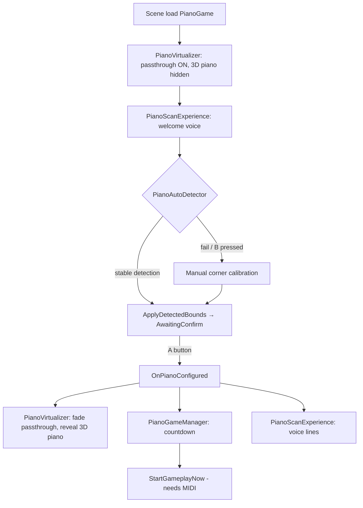

<!-- Generated by SpecStory, Markdown v2.1.0 -->

# 2026-08-18 02:42:31Z

<!-- Cursor IDE Session 1673e598-5a45-4f87-b91f-e37ffef2b777 (2026-08-18 02:42:31Z) -->

_**User**_

Explore the piano mode VR scan/virtualization flow in c:\Users\vic-s\Desktop\etheriavr_metaquest3. Read and summarize these files and related ones:

Assets/Scripts/PianoMode/VR/PianoScanExperience.cs
Assets/Scripts/PianoMode/VR/PianoAutoDetector.cs
Assets/Scripts/PianoMode/VR/PianoVirtualizer.cs
Assets/Scripts/PianoMode/VR/PianoCalibrator.cs
Assets/Scripts/PianoMode/VR/PianoScanBounds.cs
Assets/Scripts/PianoMode/VR/VrSpeechGuide.cs
Assets/Scripts/PianoMode/VR/Vision/PianoCameraCapture.cs
Assets/Scripts/PianoMode/VR/Vision/PianoKeyboardStripeDetector.cs
Assets/Scripts/PianoMode/Managers/PianoGameManager.cs
Assets/Scripts/PianoMode/Managers/PianoGameManager.Gameplay.cs
Assets/Scripts/Core/VR/QuestXRInteractionController.cs (passthrough related parts)

Return:
1. Current flow step by step
2. What controls passthrough on/off
3. How piano detection works
4. How virtual piano is placed
5. What "scan bounds" / area delimitation UI exists
6. Scene references / prefabs used
7. Key gaps vs desired flow: full passthrough scan -> MR piano overlay -> A button -> virtual stage transition -> countdown

---

_**Agent (default)**_

<think><details><summary>Thought Process</summary>
Beginning analysis of the piano mode VR scan and virtualization flow across the specified scripts and managers.

Reading the target scripts in parallel now. Searching for passthrough controls, scene prefabs, and key flow gaps.
</details></think>

_**Agent (default)**_

I'll map the piano VR scan flow by reading the listed scripts and tracing passthrough, detection, and scene references.


_**Agent (default)**_

<tool-use data-tool-type="unknown" data-tool-name="update_current_step"><details>
<summary>Tool use: **update_current_step**</summary>
An unknown error occurred
</details></tool-use>

_**Agent (default)**_

<tool-use data-tool-type="read" data-tool-name="read_file_v2"><details>
<summary>Tool use: **read_file_v2** • Read file: c:\Users\vic-s\Desktop\etheriavr_metaquest3\Assets\Scripts\PianoMode\VR\PianoScanExperience.cs</summary>

</details></tool-use>

_**Agent (default)**_

<tool-use data-tool-type="read" data-tool-name="read_file_v2"><details>
<summary>Tool use: **read_file_v2** • Read file: c:\Users\vic-s\Desktop\etheriavr_metaquest3\Assets\Scripts\PianoMode\VR\PianoAutoDetector.cs</summary>

</details></tool-use>

_**Agent (default)**_

<tool-use data-tool-type="read" data-tool-name="read_file_v2"><details>
<summary>Tool use: **read_file_v2** • Read file: c:\Users\vic-s\Desktop\etheriavr_metaquest3\Assets\Scripts\PianoMode\VR\PianoVirtualizer.cs</summary>

</details></tool-use>

_**Agent (default)**_

<tool-use data-tool-type="read" data-tool-name="read_file_v2"><details>
<summary>Tool use: **read_file_v2** • Read file: c:\Users\vic-s\Desktop\etheriavr_metaquest3\Assets\Scripts\PianoMode\VR\PianoCalibrator.cs</summary>

</details></tool-use>

_**Agent (default)**_

<tool-use data-tool-type="read" data-tool-name="read_file_v2"><details>
<summary>Tool use: **read_file_v2** • Read file: c:\Users\vic-s\Desktop\etheriavr_metaquest3\Assets\Scripts\PianoMode\VR\PianoScanBounds.cs</summary>

</details></tool-use>

_**Agent (default)**_

<tool-use data-tool-type="read" data-tool-name="read_file_v2"><details>
<summary>Tool use: **read_file_v2** • Read file: c:\Users\vic-s\Desktop\etheriavr_metaquest3\Assets\Scripts\PianoMode\VR\VrSpeechGuide.cs</summary>

</details></tool-use>

_**Agent (default)**_

<tool-use data-tool-type="read" data-tool-name="read_file_v2"><details>
<summary>Tool use: **read_file_v2** • Read file: c:\Users\vic-s\Desktop\etheriavr_metaquest3\Assets\Scripts\PianoMode\VR\Vision\PianoCameraCapture.cs</summary>

</details></tool-use>

_**Agent (default)**_

<tool-use data-tool-type="read" data-tool-name="read_file_v2"><details>
<summary>Tool use: **read_file_v2** • Read file: c:\Users\vic-s\Desktop\etheriavr_metaquest3\Assets\Scripts\PianoMode\VR\Vision\PianoKeyboardStripeDetector.cs</summary>

</details></tool-use>

_**Agent (default)**_

<tool-use data-tool-type="read" data-tool-name="read_file_v2"><details>
<summary>Tool use: **read_file_v2** • Read file: c:\Users\vic-s\Desktop\etheriavr_metaquest3\Assets\Scripts\PianoMode\Managers\PianoGameManager.cs</summary>

</details></tool-use>

_**Agent (default)**_

<tool-use data-tool-type="read" data-tool-name="read_file_v2"><details>
<summary>Tool use: **read_file_v2** • Read file: c:\Users\vic-s\Desktop\etheriavr_metaquest3\Assets\Scripts\PianoMode\Managers\PianoGameManager.Gameplay.cs</summary>

</details></tool-use>

_**Agent (default)**_

<tool-use data-tool-type="unknown" data-tool-name="ripgrep_raw_search"><details>
<summary>Tool use: **ripgrep_raw_search**</summary>

Parameters:

```json
{
  "caseInsensitive": true,
  "path": "c:\\Users\\vic-s\\Desktop\\etheriavr_metaquest3\\Assets\\Scripts\\Core\\VR\\QuestXRInteractionController.cs",
  "pattern": "passthrough|PassThrough|OVRPassthrough|Passthrough"
}
```
Additional data:

```json
{
  "isPruned": true,
  "outputMode": "content",
  "path": "c:\\Users\\vic-s\\Desktop\\etheriavr_metaquest3\\Assets\\Scripts\\Core\\VR\\QuestXRInteractionController.cs",
  "pattern": "passthrough|PassThrough|OVRPassthrough|Passthrough",
  "topFiles": [],
  "totalFiles": 0,
  "totalMatches": 0
}
```
Status: **completed**

</details></tool-use>

_**Agent (default)**_

<think><details><summary>Thought Process</summary>
The QuestXRInteractionController file contains no passthrough-related code.

Searching the project for passthrough-related code and reading PianoOnnxRuntime, CountdownManager, and PianoCalibrator references.
</details></think>

_**Agent (default)**_

<tool-use data-tool-type="unknown" data-tool-name="ripgrep_raw_search"><details>
<summary>Tool use: **ripgrep_raw_search**</summary>

Parameters:

```json
{
  "caseInsensitive": true,
  "path": "c:\\Users\\vic-s\\Desktop\\etheriavr_metaquest3\\Assets\\Scripts",
  "pattern": "passthrough|Passthrough|OVRPassthrough|RefreshHandTrackingForPianoVirtualMode"
}
```
Additional data:

```json
{
  "isPruned": true,
  "outputMode": "content",
  "path": "c:\\Users\\vic-s\\Desktop\\etheriavr_metaquest3\\Assets\\Scripts",
  "pattern": "passthrough|Passthrough|OVRPassthrough|RefreshHandTrackingForPianoVirtualMode",
  "topFiles": [
    {
      "matchCount": 18,
      "uri": "Assets/Scripts/PianoMode/VR/PianoVirtualizer.cs"
    },
    {
      "matchCount": 34,
      "uri": "Assets/Scripts/PianoMode/VR/PianoCalibrator.cs"
    },
    {
      "matchCount": 1,
      "uri": "Assets/Scripts/Core/VR/QuestXRInteractionController.cs"
    },
    {
      "matchCount": 2,
      "uri": "Assets/Scripts/PianoMode/VR/Vision/PianoCameraCapture.cs"
    }
  ],
  "totalFiles": 4,
  "totalMatches": 55
}
```
Status: **completed**

</details></tool-use>

_**Agent (default)**_

<tool-use data-tool-type="read" data-tool-name="read_file_v2"><details>
<summary>Tool use: **read_file_v2** • Read file: c:\Users\vic-s\Desktop\etheriavr_metaquest3\Assets\Scripts\Core\VR\QuestXRInteractionController.cs</summary>

</details></tool-use>

_**Agent (default)**_

<tool-use data-tool-type="unknown" data-tool-name="ripgrep_raw_search"><details>
<summary>Tool use: **ripgrep_raw_search**</summary>

Parameters:

```json
{
  "caseInsensitive": false,
  "path": "c:\\Users\\vic-s\\Desktop\\etheriavr_metaquest3",
  "pattern": "RefreshHandTrackingForPianoVirtualMode|PianoVirtualizer|PianoCalibrator|PianoScanExperience"
}
```
Additional data:

```json
{
  "isPruned": true,
  "outputMode": "content",
  "path": "c:\\Users\\vic-s\\Desktop\\etheriavr_metaquest3",
  "pattern": "RefreshHandTrackingForPianoVirtualMode|PianoVirtualizer|PianoCalibrator|PianoScanExperience",
  "topFiles": [
    {
      "matchCount": 1,
      "uri": ".specstory/history/2026-08-05_02-34-37Z-map-piano-script-internals.md"
    },
    {
      "matchCount": 13,
      "uri": "Assets/Scripts/PianoMode/VR/PianoScanExperience.cs"
    },
    {
      "matchCount": 5,
      "uri": ".specstory/history/2026-04-16_23-34-04Z-midi-integration-and-project.md"
    },
    {
      "matchCount": 13,
      "uri": ".specstory/history/2026-06-02_05-31-38Z-diagrama-de-flujo-para.md"
    },
    {
      "matchCount": 8,
      "uri": "Assets/Scripts/PianoMode/VR/PianoVirtualizer.cs"
    },
    {
      "matchCount": 15,
      "uri": ".specstory/history/2026-08-05_02-34-26Z-classify-scripts-by-mode.md"
    },
    {
      "matchCount": 100,
      "uri": ".specstory/history/2026-05-21_15-09-15Z-revisar-duracion-cancion-en.md"
    },
    {
      "matchCount": 2,
      "uri": "Assets/Scenes/PianoGame.unity"
    },
    {
      "matchCount": 1,
      "uri": ".specstory/history/2026-03-23_21-39-13Z-piano-game-synchronization-and.md"
    },
    {
      "matchCount": 47,
      "uri": ".specstory/history/2026-04-21_21-46-26Z-class-diagram-modification-request.md"
    },
    {
      "matchCount": 1,
      "uri": "Assets/Scripts/PianoMode/Managers/PianoGameManager.Gameplay.cs"
    },
    {
      "matchCount": 5,
      "uri": ".specstory/history/2026-04-26_01-58-30Z-hand-tracking-and-controller.md"
    },
    {
      "matchCount": 2,
      "uri": "Assets/Scripts/PianoMode/Managers/PianoGameManager.cs"
    },
    {
      "matchCount": 2,
      "uri": "Assets/Scripts/PianoMode/VR/PianoAutoDetector.cs"
    },
    {
      "matchCount": 4,
      "uri": "Assets/Scripts/Core/VR/QuestXRInteractionController.cs"
    },
    {
      "matchCount": 1,
      "uri": ".specstory/history/2026-03-27_15-37-02Z-revisar-problemas-de-mapeo.md"
    },
    {
      "matchCount": 100,
      "uri": ".specstory/history/2026-03-24_05-41-10Z-implementing-pause-functionality-in.md"
    },
    {
      "matchCount": 12,
      "uri": ".specstory/history/2026-08-05_02-34-50Z-map-shared-core-script.md"
    },
    {
      "matchCount": 21,
      "uri": ".specstory/history/2026-08-05_02-32-32Z-unity-project-refactor-plan.md"
    },
    {
      "matchCount": 2,
      "uri": ".specstory/history/2026-04-26_05-51-22Z-desactivar-handtracking-en-pianogame.md"
    }
  ],
  "totalFiles": 21,
  "totalMatches": 360
}
```
Status: **completed**

</details></tool-use>

_**Agent (default)**_

<tool-use data-tool-type="search" data-tool-name="glob_file_search"><details>
<summary>Tool use: **glob_file_search** • Searched codebase "" • **1** result in **1** directory</summary>

Directory: **`c:\Users\vic-s\Desktop\etheriavr_metaquest3`** (1 file)

| File |
|------|
| `../Assets/Scenes/PianoGame.unity` |
</details></tool-use>

_**Agent (default)**_

<tool-use data-tool-type="read" data-tool-name="read_file_v2"><details>
<summary>Tool use: **read_file_v2** • Read file: c:\Users\vic-s\Desktop\etheriavr_metaquest3\Assets\Scripts\PianoMode\VR\Vision\Onnx\PianoOnnxRuntime.cs</summary>

</details></tool-use>

_**Agent (default)**_

<tool-use data-tool-type="read" data-tool-name="read_file_v2"><details>
<summary>Tool use: **read_file_v2** • Read file: c:\Users\vic-s\Desktop\etheriavr_metaquest3\Assets\Scripts\PianoMode\UI\CountdownManager.cs</summary>

</details></tool-use>

_**Agent (default)**_

<think><details><summary>Thought Process</summary>
Searching the PianoGame.unity scene for references to PianoCalibrator, Passthrough_Window, OVRPassthroughLayer, and prefabs.

Grepping the scene file and reading RecenterPlayer, PlayerSpawnPoint, and the Vision README.
</details></think>

_**Agent (default)**_

<tool-use data-tool-type="unknown" data-tool-name="ripgrep_raw_search"><details>
<summary>Tool use: **ripgrep_raw_search**</summary>

Parameters:

```json
{
  "caseInsensitive": false,
  "path": "c:\\Users\\vic-s\\Desktop\\etheriavr_metaquest3\\Assets\\Scenes\\PianoGame.unity",
  "pattern": "PianoCalibrator|Passthrough_Window|Piano_SpawnPoint|OVRPassthrough|PianoVirtualizer|PianoScanExperience|confirmUI|controllerHint"
}
```
Additional data:

```json
{
  "isPruned": true,
  "outputMode": "content",
  "path": "c:\\Users\\vic-s\\Desktop\\etheriavr_metaquest3\\Assets\\Scenes\\PianoGame.unity",
  "pattern": "PianoCalibrator|Passthrough_Window|Piano_SpawnPoint|OVRPassthrough|PianoVirtualizer|PianoScanExperience|confirmUI|controllerHint",
  "topFiles": [
    {
      "matchCount": 8,
      "uri": "Assets\\Scenes\\PianoGame.unity"
    }
  ],
  "totalFiles": 1,
  "totalMatches": 8
}
```
Status: **completed**

</details></tool-use>

_**Agent (default)**_

<tool-use data-tool-type="unknown" data-tool-name="ripgrep_raw_search"><details>
<summary>Tool use: **ripgrep_raw_search**</summary>

Parameters:

```json
{
  "caseInsensitive": false,
  "glob": "*.{unity,prefab}",
  "path": "c:\\Users\\vic-s\\Desktop\\etheriavr_metaquest3\\Assets",
  "pattern": "OVRPassthroughLayer|Passthrough_Window"
}
```
Additional data:

```json
{
  "isPruned": true,
  "outputMode": "content",
  "path": "c:\\Users\\vic-s\\Desktop\\etheriavr_metaquest3\\Assets",
  "pattern": "OVRPassthroughLayer|Passthrough_Window",
  "topFiles": [
    {
      "matchCount": 1,
      "uri": "Assets\\Scenes\\TessituraScene.unity"
    },
    {
      "matchCount": 1,
      "uri": "Assets\\Scenes\\SingGame.unity"
    },
    {
      "matchCount": 2,
      "uri": "Assets\\Scenes\\PianoGame.unity"
    }
  ],
  "totalFiles": 3,
  "totalMatches": 4
}
```
Status: **completed**

</details></tool-use>

_**Agent (default)**_

<tool-use data-tool-type="read" data-tool-name="read_file_v2"><details>
<summary>Tool use: **read_file_v2** • Read file: c:\Users\vic-s\Desktop\etheriavr_metaquest3\Assets\Scripts\PianoMode\VR\Vision\README.txt</summary>

</details></tool-use>

_**Agent (default)**_

<tool-use data-tool-type="read" data-tool-name="read_file_v2"><details>
<summary>Tool use: **read_file_v2** • Read file: c:\Users\vic-s\Desktop\etheriavr_metaquest3\Assets\Scripts\PianoMode\VR\RecenterPlayer.cs</summary>

</details></tool-use>

_**Agent (default)**_

<tool-use data-tool-type="read" data-tool-name="read_file_v2"><details>
<summary>Tool use: **read_file_v2** • Read file: c:\Users\vic-s\Desktop\etheriavr_metaquest3\Assets\Scripts\PianoMode\Gameplay\PlayerSpawnPoint.cs</summary>

</details></tool-use>

_**Agent (default)**_

<tool-use data-tool-type="read" data-tool-name="read_file_v2"><details>
<summary>Tool use: **read_file_v2** • Read file: c:\Users\vic-s\Desktop\etheriavr_metaquest3\Assets\Scripts\Core\VR\QuestXRInteractionController.cs</summary>

</details></tool-use>

_**Agent (default)**_

<think><details><summary>Thought Process</summary>
Scene hierarchy details are needed next. This includes which GameObjects contain PianoCalibrator, the hierarchy structure, and the piano visual root.

Now examining the PianoGame.unity scene file around the identified line numbers.
</details></think>

_**Agent (default)**_

<tool-use data-tool-type="read" data-tool-name="read_file_v2"><details>
<summary>Tool use: **read_file_v2** • Read file: c:\Users\vic-s\Desktop\etheriavr_metaquest3\Assets\Scenes\PianoGame.unity</summary>

</details></tool-use>

_**Agent (default)**_

<tool-use data-tool-type="read" data-tool-name="read_file_v2"><details>
<summary>Tool use: **read_file_v2** • Read file: c:\Users\vic-s\Desktop\etheriavr_metaquest3\Assets\Scenes\PianoGame.unity</summary>

</details></tool-use>

_**Agent (default)**_

<tool-use data-tool-type="read" data-tool-name="read_file_v2"><details>
<summary>Tool use: **read_file_v2** • Read file: c:\Users\vic-s\Desktop\etheriavr_metaquest3\Assets\Scenes\PianoGame.unity</summary>

</details></tool-use>

_**Agent (default)**_

<tool-use data-tool-type="read" data-tool-name="read_file_v2"><details>
<summary>Tool use: **read_file_v2** • Read file: c:\Users\vic-s\Desktop\etheriavr_metaquest3\Assets\Scenes\PianoGame.unity</summary>

</details></tool-use>

_**Agent (default)**_

<tool-use data-tool-type="unknown" data-tool-name="ripgrep_raw_search"><details>
<summary>Tool use: **ripgrep_raw_search**</summary>

Parameters:

```json
{
  "caseInsensitive": false,
  "path": "c:\\Users\\vic-s\\Desktop\\etheriavr_metaquest3\\Assets\\Scenes\\PianoGame.unity",
  "pattern": "m_Name: Piano|m_Name: PianoCalibrator|m_Name: Countdown|XR Origin|QuestXR"
}
```
Additional data:

```json
{
  "isPruned": true,
  "outputMode": "content",
  "path": "c:\\Users\\vic-s\\Desktop\\etheriavr_metaquest3\\Assets\\Scenes\\PianoGame.unity",
  "pattern": "m_Name: Piano|m_Name: PianoCalibrator|m_Name: Countdown|XR Origin|QuestXR",
  "topFiles": [
    {
      "matchCount": 7,
      "uri": "Assets\\Scenes\\PianoGame.unity"
    }
  ],
  "totalFiles": 1,
  "totalMatches": 7
}
```
Status: **completed**

</details></tool-use>

_**Agent (default)**_

<tool-use data-tool-type="unknown" data-tool-name="ripgrep_raw_search"><details>
<summary>Tool use: **ripgrep_raw_search**</summary>

Parameters:

```json
{
  "caseInsensitive": false,
  "path": "c:\\Users\\vic-s\\Desktop\\etheriavr_metaquest3\\Assets\\Scenes\\PianoGame.unity",
  "pattern": "PianoGameManager|CountdownManager|RecenterPlayer"
}
```
Additional data:

```json
{
  "isPruned": true,
  "outputMode": "content",
  "path": "c:\\Users\\vic-s\\Desktop\\etheriavr_metaquest3\\Assets\\Scenes\\PianoGame.unity",
  "pattern": "PianoGameManager|CountdownManager|RecenterPlayer",
  "topFiles": [
    {
      "matchCount": 3,
      "uri": "Assets\\Scenes\\PianoGame.unity"
    }
  ],
  "totalFiles": 1,
  "totalMatches": 3
}
```
Status: **completed**

</details></tool-use>

_**Agent (default)**_

<think><details><summary>Thought Process</summary>
I am locating the prefab GUIDs for the PianoCalibrator root object and the XR rig.

Also locating the Piano child object.
</details></think>

_**Agent (default)**_

<tool-use data-tool-type="unknown" data-tool-name="ripgrep_raw_search"><details>
<summary>Tool use: **ripgrep_raw_search**</summary>

Parameters:

```json
{
  "caseInsensitive": false,
  "glob": "*.meta",
  "path": "c:\\Users\\vic-s\\Desktop\\etheriavr_metaquest3\\Assets",
  "pattern": "98ea15acd4af41342a8cb5f6a5b31077|f6336ac4ac8b4d34bc5072418cdc62a0"
}
```
Additional data:

```json
{
  "isPruned": true,
  "outputMode": "content",
  "path": "c:\\Users\\vic-s\\Desktop\\etheriavr_metaquest3\\Assets",
  "pattern": "98ea15acd4af41342a8cb5f6a5b31077|f6336ac4ac8b4d34bc5072418cdc62a0",
  "topFiles": [
    {
      "matchCount": 1,
      "uri": "Assets/Samples/XR Interaction Toolkit/3.3.0/Starter Assets/Prefabs/XR Origin (XR Rig).prefab.meta"
    },
    {
      "matchCount": 1,
      "uri": "Assets/Piano/piano.prefab.meta"
    }
  ],
  "totalFiles": 2,
  "totalMatches": 2
}
```
Status: **completed**

</details></tool-use>

_**Agent (default)**_

<tool-use data-tool-type="read" data-tool-name="read_file_v2"><details>
<summary>Tool use: **read_file_v2** • Read file: c:\Users\vic-s\Desktop\etheriavr_metaquest3\Assets\Scenes\PianoGame.unity</summary>

</details></tool-use>

_**Agent (default)**_

<tool-use data-tool-type="unknown" data-tool-name="ripgrep_raw_search"><details>
<summary>Tool use: **ripgrep_raw_search**</summary>

Parameters:

```json
{
  "caseInsensitive": false,
  "path": "c:\\Users\\vic-s\\Desktop\\etheriavr_metaquest3\\Assets\\Scenes\\PianoGame.unity",
  "pattern": "490249800|490249801|1075856485"
}
```
Additional data:

```json
{
  "isPruned": true,
  "outputMode": "content",
  "path": "c:\\Users\\vic-s\\Desktop\\etheriavr_metaquest3\\Assets\\Scenes\\PianoGame.unity",
  "pattern": "490249800|490249801|1075856485",
  "topFiles": [
    {
      "matchCount": 11,
      "uri": "Assets\\Scenes\\PianoGame.unity"
    }
  ],
  "totalFiles": 1,
  "totalMatches": 11
}
```
Status: **completed**

</details></tool-use>

_**Agent (default)**_

<tool-use data-tool-type="unknown" data-tool-name="ripgrep_raw_search"><details>
<summary>Tool use: **ripgrep_raw_search**</summary>

Parameters:

```json
{
  "caseInsensitive": false,
  "path": "c:\\Users\\vic-s\\Desktop\\etheriavr_metaquest3\\Assets\\Scenes\\PianoGame.unity",
  "pattern": "m_Name: Piano$"
}
```
Additional data:

```json
{
  "isPruned": true,
  "outputMode": "content",
  "path": "c:\\Users\\vic-s\\Desktop\\etheriavr_metaquest3\\Assets\\Scenes\\PianoGame.unity",
  "pattern": "m_Name: Piano$",
  "topFiles": [],
  "totalFiles": 0,
  "totalMatches": 0
}
```
Status: **completed**

</details></tool-use>

_**Agent (default)**_

<think><details><summary>Thought Process</summary>
Inspecting the piano prefab instance and locating the passthrough window material.

PianoVirtualizer hides the virtual piano and enables full passthrough. PianoCalibrator.Awake auto-injects the core VR managers. PianoVirtualizer.Awake disables the virtual piano renderers and sets OVRPassthroughLayer opacity to 1. PianoCalibrator.Start triggers the corner calibration UI. PianoScanExperience.Start initiates the voice-guided scan flow.

The auto-scan pipeline uses a WebCam passthrough camera with ONNX or stripe detection. Successful detection triggers the Aounds-to-calibrator phase. Pressing A fires OnPianoConfigured. PianoVirtualizer fades passthrough and reveals the 3D piano. PianoGameManager starts the countdown sequence. PianoScanExperience plays voice lines during the transition.

A timing gap exists because both the virtual transition and the countdown begin simultaneously at 2.4 seconds. During the scan, the Passthrough_Window renders as a rectangular frame that delimits the detected area; it is not the full-room passthrough layer itself. The next step is to inspect the passthrough material and the piano prefab hierarchy.
</details></think>

_**Agent (default)**_

<tool-use data-tool-type="unknown" data-tool-name="ripgrep_raw_search"><details>
<summary>Tool use: **ripgrep_raw_search**</summary>

Parameters:

```json
{
  "caseInsensitive": false,
  "glob": "*.meta",
  "path": "c:\\Users\\vic-s\\Desktop\\etheriavr_metaquest3\\Assets",
  "pattern": "4b0ff5c79b18956479ab0b76a07ef557"
}
```
Additional data:

```json
{
  "isPruned": true,
  "outputMode": "content",
  "path": "c:\\Users\\vic-s\\Desktop\\etheriavr_metaquest3\\Assets",
  "pattern": "4b0ff5c79b18956479ab0b76a07ef557",
  "topFiles": [
    {
      "matchCount": 1,
      "uri": "Assets/Mat_PassthroughPortal.mat.meta"
    }
  ],
  "totalFiles": 1,
  "totalMatches": 1
}
```
Status: **completed**

</details></tool-use>

_**Agent (default)**_

<tool-use data-tool-type="read" data-tool-name="read_file_v2"><details>
<summary>Tool use: **read_file_v2** • Read file: c:\Users\vic-s\Desktop\etheriavr_metaquest3\Assets\Scenes\PianoGame.unity</summary>

</details></tool-use>

_**Agent (default)**_

<tool-use data-tool-type="unknown" data-tool-name="ripgrep_raw_search"><details>
<summary>Tool use: **ripgrep_raw_search**</summary>

Parameters:

```json
{
  "caseInsensitive": false,
  "path": "c:\\Users\\vic-s\\Desktop\\etheriavr_metaquest3\\Assets\\Piano\\piano.prefab",
  "pattern": "m_Name:"
}
```
Additional data:

```json
{
  "isPruned": true,
  "outputMode": "content",
  "path": "c:\\Users\\vic-s\\Desktop\\etheriavr_metaquest3\\Assets\\Piano\\piano.prefab",
  "pattern": "m_Name:",
  "topFiles": [
    {
      "matchCount": 29,
      "uri": "Assets\\Piano\\piano.prefab"
    }
  ],
  "totalFiles": 1,
  "totalMatches": 29
}
```
Status: **completed**

</details></tool-use>

_**Agent (default)**_

<tool-use data-tool-type="unknown" data-tool-name="ripgrep_raw_search"><details>
<summary>Tool use: **ripgrep_raw_search**</summary>

Parameters:

```json
{
  "caseInsensitive": false,
  "path": "c:\\Users\\vic-s\\Desktop\\etheriavr_metaquest3\\Assets\\Scenes\\PianoGame.unity",
  "pattern": "741082530|504932248|confirmUI|ControllerHint"
}
```
Additional data:

```json
{
  "isPruned": true,
  "outputMode": "content",
  "path": "c:\\Users\\vic-s\\Desktop\\etheriavr_metaquest3\\Assets\\Scenes\\PianoGame.unity",
  "pattern": "741082530|504932248|confirmUI|ControllerHint",
  "topFiles": [
    {
      "matchCount": 11,
      "uri": "Assets\\Scenes\\PianoGame.unity"
    }
  ],
  "totalFiles": 1,
  "totalMatches": 11
}
```
Status: **completed**

</details></tool-use>

_**Agent (default)**_

<think><details><summary>Thought Process</summary>
Checking the Mat_PassthroughPortal material to understand the scan bounds UI. Verifying whether the virtual piano MR overlay appears before the A button press.

The virtual piano stays hidden until the PianoVirtualizer transition after the A button press. During scanning, the XR rig runs full passthrough with a quad mesh using Mat_PassthroughPortal as the delimitation frame; auto-detection updates its position via ApplyPassthroughBounds. The MR piano overlay does not appear during the scan phase. Next, I will inspect the material and confirmUI objects, and verify the piano visual root under the OVRP prefab.
</details></think>

_**Agent (default)**_

<tool-use data-tool-type="read" data-tool-name="read_file_v2"><details>
<summary>Tool use: **read_file_v2** • Read file: c:\Users\vic-s\Desktop\etheriavr_metaquest3\Assets\Mat_PassthroughPortal.mat</summary>

</details></tool-use>

_**Agent (default)**_

<tool-use data-tool-type="read" data-tool-name="read_file_v2"><details>
<summary>Tool use: **read_file_v2** • Read file: c:\Users\vic-s\Desktop\etheriavr_metaquest3\Assets\Piano\piano.prefab</summary>

</details></tool-use>

_**Agent (default)**_

<tool-use data-tool-type="read" data-tool-name="read_file_v2"><details>
<summary>Tool use: **read_file_v2** • Read file: c:\Users\vic-s\Desktop\etheriavr_metaquest3\Assets\Scenes\PianoGame.unity</summary>

</details></tool-use>

_**Agent (default)**_

<tool-use data-tool-type="unknown" data-tool-name="ripgrep_raw_search"><details>
<summary>Tool use: **ripgrep_raw_search**</summary>

Parameters:

```json
{
  "caseInsensitive": false,
  "path": "c:\\Users\\vic-s\\Desktop\\etheriavr_metaquest3\\Assets\\Scenes\\PianoGame.unity",
  "pattern": "QuestXRInteractionController|disableHandTrackingInPianoGameScene"
}
```
Additional data:

```json
{
  "isPruned": true,
  "outputMode": "content",
  "path": "c:\\Users\\vic-s\\Desktop\\etheriavr_metaquest3\\Assets\\Scenes\\PianoGame.unity",
  "pattern": "QuestXRInteractionController|disableHandTrackingInPianoGameScene",
  "topFiles": [],
  "totalFiles": 0,
  "totalMatches": 0
}
```
Status: **completed**

</details></tool-use>

_**Agent (default)**_

<think><details><summary>Thought Process</summary>
QuestXRInteractionController lives on the XR Origin prefab rather than inside the PianoGame scene itself.

The virtual piano is hidden until after OnPianoConfigured triggers the transition. During the scan phase only a Passthrough_Window rectangle frame appears; no MR piano overlay renders. The full passthrough scan and A-button confirmation are both present. The virtual stage transition and countdown are still missing.

The virtual transition and countdown both trigger from the same OnPianoConfigured event. The transition lasts 2.4 seconds while the countdown runs roughly 3.5 seconds. Hand tracking only activates once virtual mode begins. The flow stays within the same scene; passthrough fades out and the virtual piano appears without an explicit scene change. PianoScanExperience serializes pianoVirtualizer but never invokes it directly.

The scene’s PianoCalibrator still holds old serialized fields—moveSpeed and scaleSpeed—that no longer exist in the current script, suggesting the scene file is out of sync. RecenterPlayer and PlayerSpawnPoint are not wired to scan bounds. The virtualizer aligns the piano to scan bounds rather than the Piano_SpawnPoint. Auto scan uses a separate WebCam feed instead of the OVRPassthroughLayer. Decision UI remains hidden because confirmation happens through controller A/B buttons, not the panel.

HideVirtualPianoImmediate disables all renderers on pianoVisualRoot at startup. The Passthrough_Window frame is a horizontal quad scaled to the piano root, using material Mat_PassthroughPortal. Its shader needs inspection for transparency or passthrough cutout effects.
</details></think>

_**Agent (default)**_

<tool-use data-tool-type="unknown" data-tool-name="ripgrep_raw_search"><details>
<summary>Tool use: **ripgrep_raw_search**</summary>

Parameters:

```json
{
  "caseInsensitive": false,
  "glob": "*.meta",
  "path": "c:\\Users\\vic-s\\Desktop\\etheriavr_metaquest3\\Assets",
  "pattern": "613d5e49ca63e7f46a577208ec82d45a"
}
```
Additional data:

```json
{
  "isPruned": true,
  "outputMode": "content",
  "path": "c:\\Users\\vic-s\\Desktop\\etheriavr_metaquest3\\Assets",
  "pattern": "613d5e49ca63e7f46a577208ec82d45a",
  "topFiles": [
    {
      "matchCount": 1,
      "uri": "Assets/Shaders/PassthroughOcclusion.shader.meta"
    }
  ],
  "totalFiles": 1,
  "totalMatches": 1
}
```
Status: **completed**

</details></tool-use>

_**Agent (default)**_

<tool-use data-tool-type="unknown" data-tool-name="ripgrep_raw_search"><details>
<summary>Tool use: **ripgrep_raw_search**</summary>

Parameters:

```json
{
  "caseInsensitive": false,
  "path": "c:\\Users\\vic-s\\Desktop\\etheriavr_metaquest3\\Assets\\Scenes\\PianoGame.unity",
  "pattern": "1028999479|OVRCameraRig|Stage|Environment"
}
```
Additional data:

```json
{
  "isPruned": true,
  "outputMode": "content",
  "path": "c:\\Users\\vic-s\\Desktop\\etheriavr_metaquest3\\Assets\\Scenes\\PianoGame.unity",
  "pattern": "1028999479|OVRCameraRig|Stage|Environment",
  "topFiles": [
    {
      "matchCount": 18,
      "uri": "Assets\\Scenes\\PianoGame.unity"
    }
  ],
  "totalFiles": 1,
  "totalMatches": 18
}
```
Status: **completed**

</details></tool-use>

_**Agent (default)**_

<tool-use data-tool-type="read" data-tool-name="read_file_v2"><details>
<summary>Tool use: **read_file_v2** • Read file: c:\Users\vic-s\Desktop\etheriavr_metaquest3\Assets\Piano\piano.prefab</summary>

</details></tool-use>

_**Agent (default)**_

<think><details><summary>Thought Process</summary>
Checking the PassthroughOcclusion shader and the Environment object to determine whether the virtual stage corresponds to that GameObject.
</details></think>

_**Agent (default)**_

<tool-use data-tool-type="read" data-tool-name="read_file_v2"><details>
<summary>Tool use: **read_file_v2** • Read file: c:\Users\vic-s\Desktop\etheriavr_metaquest3\Assets\Shaders\PassthroughOcclusion.shader</summary>

</details></tool-use>

_**Agent (default)**_

<tool-use data-tool-type="read" data-tool-name="read_file_v2"><details>
<summary>Tool use: **read_file_v2** • Read file: c:\Users\vic-s\Desktop\etheriavr_metaquest3\Assets\Scenes\PianoGame.unity</summary>

</details></tool-use>

_**Agent (default)**_

<tool-use data-tool-type="unknown" data-tool-name="ripgrep_raw_search"><details>
<summary>Tool use: **ripgrep_raw_search**</summary>

Parameters:

```json
{
  "caseInsensitive": true,
  "path": "c:\\Users\\vic-s\\Desktop\\etheriavr_metaquest3\\Assets\\Scripts\\PianoMode",
  "pattern": "Environment|virtual.*stage|stage"
}
```
Additional data:

```json
{
  "isPruned": true,
  "outputMode": "content",
  "path": "c:\\Users\\vic-s\\Desktop\\etheriavr_metaquest3\\Assets\\Scripts\\PianoMode",
  "pattern": "Environment|virtual.*stage|stage",
  "topFiles": [
    {
      "matchCount": 7,
      "uri": "Assets/Scripts/PianoMode/VR/PianoAutoDetector.cs"
    }
  ],
  "totalFiles": 1,
  "totalMatches": 7
}
```
Status: **completed**

</details></tool-use>

_**Agent (default)**_

<think><details><summary>Thought Process</summary>
The virtual stage is always active in the scene. The concert environment is visible from the start. The passthrough overlay renders on top of it.

PassthroughOcclusion shader on Passthrough_Window writes depth to hide passthrough inside the rectangular region. PianoCalibrator positions and scales this quad via ApplyPassthroughBounds. A floating TMP text hint near the controller provides UI feedback.

Controller buttons display A and B labels. Voice guidance runs through VrSpeechGuide. The confirmUI canvas stays hidden.

The startup sequence begins with full passthrough enabled and the virtual piano hidden. PianoCalibrator initializes bounds from the default Passthrough_Window. PianoScanExperience plays a welcome voice. PianoAutoDetector then attempts an automatic scan. Success applies detected bounds and awaits the A button. Failure falls back to manual corner input and also awaits the A button.

After the A button is pressed, ContinueWithAssignedArea triggers OnPianoConfigured. This starts a 2.4-second fade-out of passthrough and a re-piano animation in PianoVirtualizer. PianoGameManager simultaneously launches StartCountdown. PianoScanExperience delivers its voice lines independently. Once the countdown finishes, StartGameplayNow waits for MIDI data. Free play mode skips the countdown entirely. PianoScanExperience does not block completion while the virtual transition plays. Auto-detection never shows the virtual piano overlay; it only updates the bounds rectangle.

The MR piano overlay is not yet implemented. The desired flow would show a semi-transparent virtual piano aligned during passthrough before the A button press, but this step is missing.

Passthrough is dual-layered. OVRPassthroughLayer renders the visual overlay, while WebCamTexture feeds vision-only detection.

Scene references include PianoGame.unity, the piano prefab root, and the XR Origin prefab from the XR Interaction Toolkit Starter Assets.
</details></think>

_**Agent (default)**_

<tool-use data-tool-type="read" data-tool-name="read_file_v2"><details>
<summary>Tool use: **read_file_v2** • Read file: c:\Users\vic-s\Desktop\etheriavr_metaquest3\Assets\Scenes\PianoGame.unity</summary>

</details></tool-use>

_**Agent (default)**_

<tool-use data-tool-type="unknown" data-tool-name="ripgrep_raw_search"><details>
<summary>Tool use: **ripgrep_raw_search**</summary>

Parameters:

```json
{
  "caseInsensitive": false,
  "path": "c:\\Users\\vic-s\\Desktop\\etheriavr_metaquest3\\Assets\\Scenes\\PianoGame.unity",
  "pattern": "m_Name: (Staff|HitLine|NoteSpawner|ProgressDisplay)"
}
```
Additional data:

```json
{
  "isPruned": true,
  "outputMode": "content",
  "path": "c:\\Users\\vic-s\\Desktop\\etheriavr_metaquest3\\Assets\\Scenes\\PianoGame.unity",
  "pattern": "m_Name: (Staff|HitLine|NoteSpawner|ProgressDisplay)",
  "topFiles": [
    {
      "matchCount": 3,
      "uri": "Assets\\Scenes\\PianoGame.unity"
    }
  ],
  "totalFiles": 1,
  "totalMatches": 3
}
```
Status: **completed**

</details></tool-use>

_**Agent (default)**_

<think><details><summary>Thought Process</summary>
I have gathered sufficient information to compile the requested summary of the piano mode VR scan flow.
</details></think>

_**Agent (default)**_

<tool-use data-tool-type="unknown" data-tool-name="update_current_step"><details>
<summary>Tool use: **update_current_step**</summary>
An unknown error occurred
</details></tool-use>

_**Agent (default)**_

<think><details><summary>Thought Process</summary>
I am preparing a structured seven-point report covering the VR scan flow, passthrough controls, detection logic, virtual piano placement, scan bounds UI, scene prefabs, and key gaps against the desired flow.
</details></think>

_**Agent (default)**_

# Piano Mode VR Scan / Virtualization Flow

## Architecture overview

The scan pipeline is orchestrated by components auto-wired on the **`piano`** prefab instance in `PianoGame.unity`. `PianoCalibrator.Awake()` adds `PianoVirtualizer`, `PianoScanExperience`, `PianoAutoDetector`, and creates `VrSpeechGuide` if missing.



---

## 1. Current flow (step by step)

| Step | What happens |
|------|----------------|
| **1. Scene entry** | `PianoGame.unity` loads. `PianoGameManager` loads the song but **does not start gameplay** until calibration completes. |
| **2. Passthrough init** | `PianoVirtualizer.Awake()` hides all renderers under the `Piano` visual root and sets `OVRPassthroughLayer` to full opacity (`textureOpacity = 1`, `hidden = false`). |
| **3. Calibrator init** | `PianoCalibrator.Start()` initializes corner preview from the existing `Passthrough_Window` transform, shows controller hints and A/B labels. |
| **4. Welcome** | `PianoScanExperience` waits 0.8s, then `VrSpeechGuide` speaks the welcome message. |
| **5. Auto-scan** | Phase → `AutoScan`. `PianoAutoDetector.DetectRoutine()` opens Quest camera via `PianoCameraCapture`, runs vision detection each frame, and live-updates bounds via `PianoCalibrator.ApplyDetectedBounds()`. Manual input is suppressed (`SuppressManualCalibration = true`). User can press **B** to abort to manual mode. |
| **6a. Auto success** | After ~24 stable frames at confidence ≥ 0.62, scan locks. Voice: *"El piano quedó alineado. Pulsa A…"* |
| **6b. Auto fail** | Voice instructs manual corner marking. User holds index triggers on left/right corners; grip triggers rotate the rectangle. **B** resets; **A** confirms when both corners are set. |
| **7. Confirm (A)** | `PianoCalibrator.ContinueWithAssignedArea()` locks calibration and fires `OnPianoConfigured`. |
| **8. Parallel reactions** | Three listeners on the same event: **`PianoVirtualizer`** starts 2.4s virtual transition; **`PianoGameManager`** starts countdown; **`PianoScanExperience`** plays transition voice lines. |
| **9. Virtual transition** | Passthrough opacity fades 1→0; 3D piano renderers enable at ~18% progress; at end, `Passthrough_Window` is deactivated and passthrough layer is hidden. Hand tracking is re-enabled via `QuestXRInteractionController.RefreshHandTrackingForPianoVirtualMode()`. |
| **10. Countdown → gameplay** | `CountdownManager` runs 3-2-1-GO (~3.5s). On complete, `StartGameplayNow()` runs (blocked until MIDI is connected unless in free-play mode). |

**Free-play mode** (no song selected): countdown is skipped; gameplay is marked ready immediately on confirm.

---

## 2. What controls passthrough on/off

| Control | Role |
|---------|------|
| **`OVRPassthroughLayer`** (on XR Origin prefab) | Global passthrough overlay. Found at runtime by `PianoVirtualizer`. |
| **`PianoVirtualizer.HideVirtualPianoImmediate()`** | On Awake: `hidden = false`, `textureOpacity = 1f` (full passthrough). |
| **`PianoVirtualizer.ApplyVirtualReveal(progress)`** | During transition: `textureOpacity = 1 - progress`. |
| **`PianoVirtualizer` end of transition** | `textureOpacity = 0`, `hidden = true`; `Passthrough_Window` GameObject deactivated. |
| **`Passthrough_Window` quad** | Not the passthrough source itself — uses `Mat_PassthroughPortal` + `PassthroughOcclusion.shader` (depth-only occluder, `ColorMask 0`) to cut a rectangular hole in passthrough rendering. |
| **`PianoCameraCapture`** | Separate `WebCamTexture` passthrough/left camera feed used **only for CV detection**, not for display. |

`QuestXRInteractionController` does **not** control passthrough. It only gates hand tracking in `PianoGame` until `PianoVirtualizer.IsVirtualModeActive` is true.

---

## 3. How piano detection works

**Pipeline** (`PianoAutoDetector`):

1. Start Quest camera (`WebCamTexture`, prefers device name containing `"passthrough"` or `"left"`).
2. Each frame, grab RGB texture.
3. **`TryReadKeyboardRect()`** — two-tier detection:
   - **Primary:** `PianoOnnxRuntime.TryDetectKeyboard()` (YOLO via Unity Sentis, only if `PIANO_HAS_SENTIS` and model assigned). Threshold ~0.47 of lock confidence.
   - **Fallback:** `PianoKeyboardStripeDetector.Detect()` — scans 160×90 luma samples for horizontal stripe band (white/black key pattern) and vertical edge density.
4. **Temporal stabilization:** IoU overlap ≥ 0.82 across frames; running rect averaged with 18% weight; requires 24 stable frames, confidence ≥ 0.62, width ≥ 42% of frame.
5. **World projection:** `RectToBounds()` raycasts viewport corners onto a horizontal plane at estimated keyboard height (~camera Y − 0.72m), producing a `PianoScanBounds` struct (center, rotation, width, depth, height).
6. Live preview: bounds applied to calibrator each frame during scan.
7. Camera stopped when scan ends.

**Manual fallback:** corner dragging with controllers when auto-scan fails or user presses B.

---

## 4. How the virtual piano is placed

After **A** confirms (`OnPianoConfigured` → `PianoVirtualizer.BeginVirtualTransition`):

1. **`AlignVirtualPiano(bounds)`** using `PianoScanBounds` from `PianoCalibrator.GetScanBounds()`:
   - Activates `pianoVisualRoot` (child named `"Piano"` under prefab root).
   - Scales X/Z to match detected width/depth (with 2%/5% padding) against combined renderer bounds of keyboard mesh.
   - Translates so keyboard center matches `bounds.center`.
   - Sets rotation to `bounds.rotation`.
2. **Reveal animation:** renderers enabled at 18% progress; passthrough fades in parallel over 2.4s.
3. **`Piano_SpawnPoint`** exists in hierarchy but is **not used** by the virtualizer — placement is entirely scan-bounds-driven.
4. **`RecenterPlayer` / `PlayerSpawnPoint`** are present but disabled by default (`autoRecenterOnStart = false`, `repositionPlayerOnStart = false`).

---

## 5. Scan bounds / area delimitation UI

| Element | Purpose |
|---------|---------|
| **`Passthrough_Window`** | Horizontal quad (default ~1.56m × 0.29m) parented under `piano` root. Scaled/rotated by `ApplyPassthroughBounds()` to frame the keyboard area. Depth-occludes passthrough in that region. |
| **`PianoScanBounds` struct** | Data model: center, rotation, width, depth, keyboardHeight. |
| **`ControllerHintUI`** | World-space TMP panel following active controller; shows drag/rotate instructions and width/depth readout. |
| **A/B button labels** | Floating TMP near controller button anchors (`continueButtonAnchor`, `modifyButtonAnchor` on XR rig); B pulses when editable. |
| **`VrSpeechGuide`** | Spanish TTS for all phase instructions and hints (8s / 18s scan hints). |
| **`confirmUI` Canvas** | OVROverlayCanvas wired in scene but **`ShowDecisionUI(false)` is always called** — decision is controller-only (A/B), not a floating panel. |
| **`ScanQuality`** | Computed in auto-detector but **not surfaced to UI**. |

There is **no MR virtual piano overlay** during scan — only the passthrough cutout rectangle and hints.

---

## 6. Scene references / prefabs

| Asset | Path | Role |
|-------|------|------|
| **Scene** | `Assets/Scenes/PianoGame.unity` | Piano mode scene |
| **Piano prefab** | `Assets/Piano/piano.prefab` | Root `piano`; child `Piano` (3D model with Keys, Stand, etc.) |
| **XR Rig** | `Assets/Samples/XR Interaction Toolkit/3.3.0/Starter Assets/Prefabs/XR Origin (XR Rig).prefab` | Contains `OVRPassthroughLayer`, controllers, `QuestXRInteractionController` |
| **Passthrough material** | `Assets/Mat_PassthroughPortal.mat` | On `Passthrough_Window` |
| **Occlusion shader** | `Assets/Shaders/PassthroughOcclusion.shader` | Depth-only cutout |
| **Scene-added under piano instance** | `Piano_SpawnPoint`, `Passthrough_Window`, `ControllerHintUI`, `Canvas` (confirmUI), `PianoCalibrator` | Added at scene level, not in prefab |
| **Environment** | `Environment` root in scene (lights, theater props) | Always active; revealed when passthrough fades |
| **Gameplay objects** | `PianoGameManager`, `CountdownManager` / `CountdownCanvas`, `NoteSpawner`, `StaffRenderer` ×2, `HitLine` ×2, `ProgressDisplay`, `PianoPauseController`, audience prefabs | Standard piano gameplay |

**Runtime-added components** (via `PianoCalibrator.EnsureScanExperienceComponents`): `PianoVirtualizer`, `PianoScanExperience`, `PianoAutoDetector`, `PianoCameraCapture`, `PianoOnnxRuntime`, `VrSpeechGuide`.

---

## 7. Key gaps vs desired flow

**Desired:** full passthrough scan → **MR piano overlay** → **A button** → **virtual stage transition** → **countdown**

| Desired step | Current state | Gap |
|--------------|---------------|-----|
| Full passthrough scan | Implemented (`OVRPassthroughLayer` + live bounds updates) | Works, but detection uses a **separate WebCam feed**, not the displayed passthrough layer |
| MR piano overlay on real keyboard | **Missing** | 3D piano is **fully hidden** until after A. No semi-transparent aligned overlay during scan/confirm |
| A button to confirm | Implemented (right controller A / `OVRInput.Button.One`) | OK |
| Virtual stage transition **then** countdown | **Parallel, not sequential** | `OnPianoConfigured` fires both at once: 2.4s passthrough fade **and** ~3.5s countdown overlap |
| Distinct "stage transition" | Partial | No scene swap or Environment toggle — passthrough fades to reveal always-on `Environment` + aligned 3D piano. No explicit stage choreography |
| Hand tracking during scan | Controllers only | By design (`disableHandTrackingInPianoGameScene` until virtual mode active) |
| Spawn point integration | Unused | `Piano_SpawnPoint` / recenter not tied to scan result |
| MR overlay confirm UI | Hidden | `confirmUI` canvas exists but is never shown |
| `PianoScanExperience.pianoVirtualizer` | Unused field | Never referenced in code |
| Scene/code drift | Scene YAML has old `PianoCalibrator` fields (`moveSpeed`, `useControllerPromptForDecision`) absent from current script | Possible inspector confusion |

**Suggested sequencing fix (conceptual):** split `OnPianoConfigured` into two events — (1) confirm → show MR piano overlay in passthrough for review; (2) A again (or separate confirm) → `PianoVirtualizer.OnVirtualModeChanged(true)` → **then** start countdown. Today everything collapses into a single A press.

---

### Key files (absolute paths)

- `c:\Users\vic-s\Desktop\etheriavr_metaquest3\Assets\Scripts\PianoMode\VR\PianoScanExperience.cs`
- `c:\Users\vic-s\Desktop\etheriavr_metaquest3\Assets\Scripts\PianoMode\VR\PianoAutoDetector.cs`
- `c:\Users\vic-s\Desktop\etheriavr_metaquest3\Assets\Scripts\PianoMode\VR\PianoVirtualizer.cs`
- `c:\Users\vic-s\Desktop\etheriavr_metaquest3\Assets\Scripts\PianoMode\VR\PianoCalibrator.cs`
- `c:\Users\vic-s\Desktop\etheriavr_metaquest3\Assets\Scripts\PianoMode\VR\PianoScanBounds.cs`
- `c:\Users\vic-s\Desktop\etheriavr_metaquest3\Assets\Scripts\PianoMode\Managers\PianoGameManager.Gameplay.cs` (countdown gate at `OnPianoConfigured_StartGame`)
- `c:\Users\vic-s\Desktop\etheriavr_metaquest3\Assets\Scripts\Core\VR\QuestXRInteractionController.cs` (lines 128–144: hand tracking gate)
