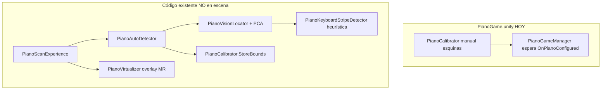

<!-- Generated by SpecStory, Markdown v2.1.0 -->

# 2026-08-18 23:17:26Z

<!-- Cursor IDE Session ba642818-3c4c-4a05-ba3a-4164cc371f82 (2026-08-18 23:17:26Z) -->

_**User**_

Explora exhaustivamente el subsistema de detección/calibración del piano en C:\Users\vic-s\Desktop\etheriavr_metaquest3, especialmente Assets/Scripts/PianoMode/VR/Vision, PianoAutoDetector, PianoCalibrator, PianoScanBounds, PianoVirtualizer, cámara passthrough/MRUK y permisos. El requisito es superponer un piano virtual de 88 teclas sobre uno real con la máxima precisión posible en Quest 3, refinar continuamente hasta confirmar con A, sin una franja/banda de delimitación. Determina qué hace hoy realmente, problemas matemáticos/de coordenadas, si usa RGB real o heurísticas, estabilidad temporal, escala/rotación/origen, y límites físicos de precisión. No edites. Devuelve rutas/métodos y un plan concreto de implementación priorizado; señala cualquier API de Meta que se esté usando incorrectamente o que no pueda dar precisión milimétrica.

---

_**Agent (composer-2.5)**_

<think><details><summary>Thought Process</summary>
Voy a analizar exhaustivamente el subsistema de detección y calibración del piano en el proyecto Unity VR. Revisaré los scripts de Vision, PianoAutoDetector, PianoCalibrator, PianoScanBounds, PianoVirtualizer y los permisos de cámara passthrough/MRUK. Buscaré problemas matemáticos, fallos de coordenadas, uso de RGB real versus heurísticas, estabilidad temporal, escala, rotación, origen y límites físicos de precisión. El objetivo es determinar qué funciona hoy, detectar APIs de Meta que no permitan precisión milimétrica, y entregar un plan concreto de implementación priorizado sin editar código.
</details></think>

_**Agent (composer-2.5)**_

Explorando el subsistema de detección y calibración del piano: localizaré los scripts clave y revisaré cómo se integran con passthrough, MRUK y permisos.


_**Agent (composer-2.5)**_

<tool-use data-tool-type="unknown" data-tool-name="update_current_step"><details>
<summary>Tool use: **update_current_step**</summary>
An unknown error occurred
</details></tool-use>

_**Agent (composer-2.5)**_

<tool-use data-tool-type="search" data-tool-name="glob_file_search"><details>
<summary>Tool use: **glob_file_search** • Searched codebase "" • **16** results in **1** directory</summary>

Directory: **`c:\Users\vic-s\Desktop\etheriavr_metaquest3`** (16 files)

| File |
|------|
| `../Assets/Scripts/PianoMode/VR/PianoScanExperience.cs` |
| `../Assets/Scripts/PianoMode/VR/VrSpeechGuide.cs` |
| `../Assets/Scripts/PianoMode/VR/PianoScanLog.cs` |
| `../Assets/Scripts/PianoMode/VR/Vision/PianoKeyboardStripeDetector.cs` |
| `../Assets/Scripts/PianoMode/VR/Vision/Onnx/PianoOnnxRuntime.cs` |
| `../Assets/Scripts/PianoMode/VR/PianoScanFlow.cs` |
| `../Assets/Scripts/PianoMode/VR/RecenterPlayer.cs` |
| `../Assets/Scripts/PianoMode/VR/PianoScanBounds.cs` |
| `../Assets/Scripts/PianoMode/VR/PianoCalibrator.cs` |
| `../Assets/Scripts/PianoMode/VR/PianoVirtualizer.cs` |
| `../Assets/Scripts/PianoMode/VR/PianoScanVfx.cs` |
| `../Assets/Scripts/PianoMode/VR/PianoAutoDetector.cs` |
| `../Assets/Scripts/PianoMode/VR/PianoSurfaceProbe.cs` |
| `../Assets/Scripts/PianoMode/VR/Vision/PianoCameraCapture.cs` |
| `../Assets/Scripts/PianoMode/VR/Vision/PianoKeyboardLayout.cs` |
| `../Assets/Scripts/PianoMode/VR/Vision/PianoVisionLocator.cs` |
</details></tool-use>

_**Agent (composer-2.5)**_

<tool-use data-tool-type="unknown" data-tool-name="ripgrep_raw_search"><details>
<summary>Tool use: **ripgrep_raw_search**</summary>

Parameters:

```json
{
  "caseInsensitive": false,
  "glob": "Assets/Scripts/PianoMode/**/*.cs",
  "outputMode": "content",
  "pattern": "MRUK|Passthrough|OVRPassthrough|EnvironmentDepth|Scene|Permission|Camera"
}
```
Additional data:

```json
{
  "isPruned": true,
  "outputMode": "content",
  "pattern": "MRUK|Passthrough|OVRPassthrough|EnvironmentDepth|Scene|Permission|Camera",
  "topFiles": [
    {
      "matchCount": 1,
      "uri": "Assets/Scripts/PianoMode/Gameplay/PlayerSpawnPoint.cs"
    },
    {
      "matchCount": 10,
      "uri": "Assets/Scripts/PianoMode/Managers/PianoGameManager.cs"
    },
    {
      "matchCount": 11,
      "uri": "Assets/Scripts/PianoMode/VR/PianoCalibrator.cs"
    },
    {
      "matchCount": 6,
      "uri": "Assets/Scripts/PianoMode/Managers/PianoGameManager.Gameplay.cs"
    },
    {
      "matchCount": 2,
      "uri": "Assets/Scripts/PianoMode/VR/RecenterPlayer.cs"
    },
    {
      "matchCount": 5,
      "uri": "Assets/Scripts/PianoMode/VR/PianoScanExperience.cs"
    },
    {
      "matchCount": 2,
      "uri": "Assets/Scripts/PianoMode/VR/PianoAutoDetector.cs"
    },
    {
      "matchCount": 26,
      "uri": "Assets/Scripts/PianoMode/VR/PianoSurfaceProbe.cs"
    },
    {
      "matchCount": 2,
      "uri": "Assets/Scripts/PianoMode/Gameplay/PianoPublicSystem.cs"
    },
    {
      "matchCount": 8,
      "uri": "Assets/Scripts/PianoMode/UI/PianoPauseMenu.cs"
    },
    {
      "matchCount": 7,
      "uri": "Assets/Scripts/PianoMode/VR/PianoVirtualizer.cs"
    }
  ],
  "totalFiles": 11,
  "totalMatches": 138
}
```
Status: **completed**

</details></tool-use>

_**Agent (composer-2.5)**_

<tool-use data-tool-type="unknown" data-tool-name="ripgrep_raw_search"><details>
<summary>Tool use: **ripgrep_raw_search**</summary>

Parameters:

```json
{
  "caseInsensitive": false,
  "glob": "**/*.{cs,unity,prefab}",
  "outputMode": "files_with_matches",
  "pattern": "PianoAutoDetector|PianoCalibrator|PianoVirtualizer|PianoScanBounds"
}
```
Additional data:

```json
{
  "isPruned": true,
  "outputMode": "files_with_matches",
  "pattern": "PianoAutoDetector|PianoCalibrator|PianoVirtualizer|PianoScanBounds",
  "topFiles": [
    {
      "matchCount": 1,
      "uri": "Assets/Scripts/PianoMode/VR/PianoScanExperience.cs"
    },
    {
      "matchCount": 1,
      "uri": "Assets/Scenes/PianoGame.unity"
    },
    {
      "matchCount": 1,
      "uri": "Assets/Scripts/PianoMode/VR/PianoScanVfx.cs"
    },
    {
      "matchCount": 1,
      "uri": "Assets/Scripts/PianoMode/VR/PianoAutoDetector.cs"
    },
    {
      "matchCount": 1,
      "uri": "Assets/Scripts/PianoMode/VR/Vision/PianoVisionLocator.cs"
    },
    {
      "matchCount": 1,
      "uri": "Assets/Scripts/PianoMode/Managers/PianoGameManager.Gameplay.cs"
    },
    {
      "matchCount": 1,
      "uri": "Assets/Scripts/PianoMode/VR/PianoScanBounds.cs"
    },
    {
      "matchCount": 1,
      "uri": "Assets/Scripts/PianoMode/VR/PianoVirtualizer.cs"
    },
    {
      "matchCount": 1,
      "uri": "Assets/Scripts/PianoMode/Managers/PianoGameManager.cs"
    },
    {
      "matchCount": 1,
      "uri": "Assets/Scripts/PianoMode/VR/PianoCalibrator.cs"
    },
    {
      "matchCount": 1,
      "uri": "Assets/Scripts/PianoMode/VR/PianoScanFlow.cs"
    }
  ],
  "totalFiles": 11,
  "totalMatches": 11
}
```
Status: **completed**

</details></tool-use>

_**Agent (composer-2.5)**_

<think><details><summary>Thought Process</summary>
Revisaré los archivos clave del subsistema de detección y calibración del piano en paralelo para entender su funcionamiento completo.
</details></think>

_**Agent (composer-2.5)**_

<tool-use data-tool-type="read" data-tool-name="read_file_v2"><details>
<summary>Tool use: **read_file_v2** • Read file: c:\Users\vic-s\Desktop\etheriavr_metaquest3\Assets\Scripts\PianoMode\VR\PianoAutoDetector.cs</summary>

</details></tool-use>

_**Agent (composer-2.5)**_

<tool-use data-tool-type="read" data-tool-name="read_file_v2"><details>
<summary>Tool use: **read_file_v2** • Read file: c:\Users\vic-s\Desktop\etheriavr_metaquest3\Assets\Scripts\PianoMode\VR\PianoCalibrator.cs</summary>

</details></tool-use>

_**Agent (composer-2.5)**_

<tool-use data-tool-type="read" data-tool-name="read_file_v2"><details>
<summary>Tool use: **read_file_v2** • Read file: c:\Users\vic-s\Desktop\etheriavr_metaquest3\Assets\Scripts\PianoMode\VR\PianoScanBounds.cs</summary>

</details></tool-use>

_**Agent (composer-2.5)**_

<tool-use data-tool-type="read" data-tool-name="read_file_v2"><details>
<summary>Tool use: **read_file_v2** • Read file: c:\Users\vic-s\Desktop\etheriavr_metaquest3\Assets\Scripts\PianoMode\VR\PianoVirtualizer.cs</summary>

</details></tool-use>

_**Agent (composer-2.5)**_

<tool-use data-tool-type="read" data-tool-name="read_file_v2"><details>
<summary>Tool use: **read_file_v2** • Read file: c:\Users\vic-s\Desktop\etheriavr_metaquest3\Assets\Scripts\PianoMode\VR\PianoSurfaceProbe.cs</summary>

</details></tool-use>

_**Agent (composer-2.5)**_

<tool-use data-tool-type="read" data-tool-name="read_file_v2"><details>
<summary>Tool use: **read_file_v2** • Read file: c:\Users\vic-s\Desktop\etheriavr_metaquest3\Assets\Scripts\PianoMode\VR\PianoScanFlow.cs</summary>

</details></tool-use>

_**Agent (composer-2.5)**_

<think><details><summary>Thought Process</summary>
Revisaré los archivos del subsistema Vision, PianoScanExperience, PianoScanVfx, PianoKeyboardLayout y AndroidManifest para auditar permisos y búsqueda de MRUK.
</details></think>

_**Agent (composer-2.5)**_

<tool-use data-tool-type="read" data-tool-name="read_file_v2"><details>
<summary>Tool use: **read_file_v2** • Read file: c:\Users\vic-s\Desktop\etheriavr_metaquest3\Assets\Scripts\PianoMode\VR\Vision\PianoVisionLocator.cs</summary>

</details></tool-use>

_**Agent (composer-2.5)**_

<tool-use data-tool-type="read" data-tool-name="read_file_v2"><details>
<summary>Tool use: **read_file_v2** • Read file: c:\Users\vic-s\Desktop\etheriavr_metaquest3\Assets\Scripts\PianoMode\VR\Vision\PianoCameraCapture.cs</summary>

</details></tool-use>

_**Agent (composer-2.5)**_

<tool-use data-tool-type="read" data-tool-name="read_file_v2"><details>
<summary>Tool use: **read_file_v2** • Read file: c:\Users\vic-s\Desktop\etheriavr_metaquest3\Assets\Scripts\PianoMode\VR\Vision\PianoKeyboardStripeDetector.cs</summary>

</details></tool-use>

_**Agent (composer-2.5)**_

<tool-use data-tool-type="read" data-tool-name="read_file_v2"><details>
<summary>Tool use: **read_file_v2** • Read file: c:\Users\vic-s\Desktop\etheriavr_metaquest3\Assets\Scripts\PianoMode\VR\Vision\PianoKeyboardLayout.cs</summary>

</details></tool-use>

_**Agent (composer-2.5)**_

<tool-use data-tool-type="read" data-tool-name="read_file_v2"><details>
<summary>Tool use: **read_file_v2** • Read file: c:\Users\vic-s\Desktop\etheriavr_metaquest3\Assets\Scripts\PianoMode\VR\Vision\Onnx\PianoOnnxRuntime.cs</summary>

</details></tool-use>

_**Agent (composer-2.5)**_

<tool-use data-tool-type="read" data-tool-name="read_file_v2"><details>
<summary>Tool use: **read_file_v2** • Read file: c:\Users\vic-s\Desktop\etheriavr_metaquest3\Assets\Scripts\PianoMode\VR\PianoScanExperience.cs</summary>

</details></tool-use>

_**Agent (composer-2.5)**_

<think><details><summary>Thought Process</summary>
Revisaré PianoScanVfx, el README de Vision, AndroidManifest y buscaré usos de MRUK.

También verificaré el uso de PianoSurfaceProbe y PianoCameraCapture.
</details></think>

_**Agent (composer-2.5)**_

<tool-use data-tool-type="read" data-tool-name="read_file_v2"><details>
<summary>Tool use: **read_file_v2** • Read file: c:\Users\vic-s\Desktop\etheriavr_metaquest3\Assets\Scripts\PianoMode\VR\PianoScanVfx.cs</summary>

</details></tool-use>

_**Agent (composer-2.5)**_

<tool-use data-tool-type="read" data-tool-name="read_file_v2"><details>
<summary>Tool use: **read_file_v2** • Read file: c:\Users\vic-s\Desktop\etheriavr_metaquest3\Assets\Scripts\PianoMode\VR\Vision\README.txt</summary>

</details></tool-use>

_**Agent (composer-2.5)**_

<tool-use data-tool-type="read" data-tool-name="read_file_v2"><details>
<summary>Tool use: **read_file_v2** • Read file: c:\Users\vic-s\Desktop\etheriavr_metaquest3\Assets\Plugins\Android\AndroidManifest.xml</summary>

</details></tool-use>

_**Agent (composer-2.5)**_

<tool-use data-tool-type="unknown" data-tool-name="ripgrep_raw_search"><details>
<summary>Tool use: **ripgrep_raw_search**</summary>

Parameters:

```json
{
  "caseInsensitive": false,
  "glob": "**/*.{cs,unity,prefab,xml}",
  "outputMode": "content",
  "pattern": "MRUK|EnvironmentRaycastManager|PassthroughCameraAccess|PianoSurfaceProbe|PianoCameraCapture|PianoOnnxRuntime"
}
```
Additional data:

```json
{
  "isPruned": true,
  "outputMode": "content",
  "pattern": "MRUK|EnvironmentRaycastManager|PassthroughCameraAccess|PianoSurfaceProbe|PianoCameraCapture|PianoOnnxRuntime",
  "topFiles": [
    {
      "matchCount": 1,
      "uri": "Assets/Scenes/PianoGame.unity"
    },
    {
      "matchCount": 8,
      "uri": "Assets/Scripts/PianoMode/VR/Vision/PianoVisionLocator.cs"
    },
    {
      "matchCount": 1,
      "uri": "Assets/Scripts/PianoMode/VR/Vision/PianoCameraCapture.cs"
    },
    {
      "matchCount": 1,
      "uri": "Assets/Scenes/SingGame.unity"
    },
    {
      "matchCount": 1,
      "uri": "Assets/Scripts/PianoMode/VR/PianoSurfaceProbe.cs"
    },
    {
      "matchCount": 1,
      "uri": "Assets/Scripts/PianoMode/VR/Vision/Onnx/PianoOnnxRuntime.cs"
    },
    {
      "matchCount": 1,
      "uri": "Assets/Scenes/TessituraScene.unity"
    }
  ],
  "totalFiles": 7,
  "totalMatches": 14
}
```
Status: **completed**

</details></tool-use>

_**Agent (composer-2.5)**_

<tool-use data-tool-type="unknown" data-tool-name="ripgrep_raw_search"><details>
<summary>Tool use: **ripgrep_raw_search**</summary>
Glob pattern "**/*" matches every file and is not allowed. Use a more specific glob or no glob.
</details></tool-use>

_**Agent (composer-2.5)**_

<think><details><summary>Thought Process</summary>
Se detectó que PianoSurfaceProbe existe en el código pero no parece ser utilizado por PianoAutoDetector ni PianoVisionLocator.

PianoCameraCapture existe pero no se referencia. PianoVisionLocator usa PassthroughCameraAccess de Meta.XR. PianoOnnxRuntime está presente pero no conectado al locator; el sistema usa heurísticas de stripe detector. EnvironmentRaycastManager se añade en PianoVisionLocator pero nunca se utiliza en TrySample. MRUK aparece en el README pero no en el código. El modo manual de PianoCalibrator se desactiva cuando el escaneo automático está activo.
</details></think>

_**Agent (composer-2.5)**_

<tool-use data-tool-type="unknown" data-tool-name="ripgrep_raw_search"><details>
<summary>Tool use: **ripgrep_raw_search**</summary>

Parameters:

```json
{
  "caseInsensitive": false,
  "glob": "**/*.cs",
  "outputMode": "content",
  "pattern": "PianoSurfaceProbe|PianoCameraCapture|PianoOnnxRuntime|EnvironmentRaycastManager"
}
```
Additional data:

```json
{
  "isPruned": true,
  "outputMode": "content",
  "pattern": "PianoSurfaceProbe|PianoCameraCapture|PianoOnnxRuntime|EnvironmentRaycastManager",
  "topFiles": [
    {
      "matchCount": 1,
      "uri": "Assets/Scripts/PianoMode/VR/Vision/Onnx/PianoOnnxRuntime.cs"
    },
    {
      "matchCount": 1,
      "uri": "Assets/Scripts/PianoMode/VR/PianoSurfaceProbe.cs"
    },
    {
      "matchCount": 3,
      "uri": "Assets/Scripts/PianoMode/VR/Vision/PianoVisionLocator.cs"
    },
    {
      "matchCount": 1,
      "uri": "Assets/Scripts/PianoMode/VR/Vision/PianoCameraCapture.cs"
    }
  ],
  "totalFiles": 4,
  "totalMatches": 6
}
```
Status: **completed**

</details></tool-use>

_**Agent (composer-2.5)**_

<tool-use data-tool-type="unknown" data-tool-name="ripgrep_raw_search"><details>
<summary>Tool use: **ripgrep_raw_search**</summary>
Glob pattern "**/*" matches every file and is not allowed. Use a more specific glob or no glob.
</details></tool-use>

_**Agent (composer-2.5)**_

<tool-use data-tool-type="unknown" data-tool-name="ripgrep_raw_search"><details>
<summary>Tool use: **ripgrep_raw_search**</summary>

Parameters:

```json
{
  "caseInsensitive": false,
  "glob": "**/*.{cs,unity}",
  "outputMode": "content",
  "pattern": "PassthroughCameraAccess|OVRPassthroughLayer|EnvironmentDepth"
}
```
Additional data:

```json
{
  "isPruned": true,
  "outputMode": "content",
  "pattern": "PassthroughCameraAccess|OVRPassthroughLayer|EnvironmentDepth",
  "topFiles": [
    {
      "matchCount": 2,
      "uri": "Assets/Scenes/SingGame.unity"
    },
    {
      "matchCount": 3,
      "uri": "Assets/Scripts/PianoMode/VR/PianoVirtualizer.cs"
    },
    {
      "matchCount": 2,
      "uri": "Assets/Scenes/PianoGame.unity"
    },
    {
      "matchCount": 2,
      "uri": "Assets/Scenes/TessituraScene.unity"
    },
    {
      "matchCount": 5,
      "uri": "Assets/Scripts/PianoMode/VR/Vision/PianoVisionLocator.cs"
    }
  ],
  "totalFiles": 5,
  "totalMatches": 14
}
```
Status: **completed**

</details></tool-use>

_**Agent (composer-2.5)**_

<tool-use data-tool-type="read" data-tool-name="read_file_v2"><details>
<summary>Tool use: **read_file_v2** • Read file: c:\Users\vic-s\Desktop\etheriavr_metaquest3\Assets\Scripts\PianoMode\VR\PianoScanLog.cs</summary>

</details></tool-use>

_**Agent (composer-2.5)**_

<think><details><summary>Thought Process</summary>
Revisaré el manifiesto de paquetes para localizar MRUK y examinaré la escena PianoGame en busca de componentes de escaneo.

También verificaré si el vision locator utiliza datos de profundidad.
</details></think>

_**Agent (composer-2.5)**_

<tool-use data-tool-type="unknown" data-tool-name="ripgrep_raw_search"><details>
<summary>Tool use: **ripgrep_raw_search**</summary>

Parameters:

```json
{
  "caseInsensitive": false,
  "glob": "**/*.{json,xml,cs,txt,md}",
  "path": "c:\\Users\\vic-s\\Desktop\\etheriavr_metaquest3",
  "pattern": "mrutilitykit|MRUK|Meta\\.XR"
}
```
Additional data:

```json
{
  "isPruned": true,
  "outputMode": "content",
  "path": "c:\\Users\\vic-s\\Desktop\\etheriavr_metaquest3",
  "pattern": "mrutilitykit|MRUK|Meta\\.XR",
  "topFiles": [
    {
      "matchCount": 1,
      "uri": "Packages/manifest.json"
    },
    {
      "matchCount": 1,
      "uri": ".specstory\\history\\2026-08-18_23-17-26Z-auditar-vision-y-calibracion.md"
    },
    {
      "matchCount": 1,
      "uri": "Assets/Scripts/PianoMode/VR/Vision/README.txt"
    },
    {
      "matchCount": 1,
      "uri": "Packages/packages-lock.json"
    },
    {
      "matchCount": 1,
      "uri": ".specstory/history/2026-04-21_21-46-26Z-class-diagram-modification-request.md"
    },
    {
      "matchCount": 45,
      "uri": ".specstory\\history\\2026-08-18_19-55-13Z-missing-namespace-errors.md"
    }
  ],
  "totalFiles": 6,
  "totalMatches": 178
}
```
Status: **completed**

</details></tool-use>

_**Agent (composer-2.5)**_

<tool-use data-tool-type="unknown" data-tool-name="ripgrep_raw_search"><details>
<summary>Tool use: **ripgrep_raw_search**</summary>

Parameters:

```json
{
  "caseInsensitive": false,
  "outputMode": "content",
  "path": "c:\\Users\\vic-s\\Desktop\\etheriavr_metaquest3\\Assets\\Scenes\\PianoGame.unity",
  "pattern": "PianoScanExperience|PianoAutoDetector|PianoVisionLocator|PianoCalibrator|PianoVirtualizer"
}
```
Additional data:

```json
{
  "isPruned": true,
  "outputMode": "content",
  "path": "c:\\Users\\vic-s\\Desktop\\etheriavr_metaquest3\\Assets\\Scenes\\PianoGame.unity",
  "pattern": "PianoScanExperience|PianoAutoDetector|PianoVisionLocator|PianoCalibrator|PianoVirtualizer",
  "topFiles": [
    {
      "matchCount": 2,
      "uri": "Assets\\Scenes\\PianoGame.unity"
    }
  ],
  "totalFiles": 1,
  "totalMatches": 2
}
```
Status: **completed**

</details></tool-use>

_**Agent (composer-2.5)**_

<tool-use data-tool-type="unknown" data-tool-name="ripgrep_raw_search"><details>
<summary>Tool use: **ripgrep_raw_search**</summary>

Parameters:

```json
{
  "caseInsensitive": false,
  "glob": "**/*.cs",
  "outputMode": "content",
  "path": "c:\\Users\\vic-s\\Desktop\\etheriavr_metaquest3",
  "pattern": "ViewportPointToRay|GetCameraPose|TryPlaceEdge"
}
```
Additional data:

```json
{
  "isPruned": true,
  "outputMode": "content",
  "path": "c:\\Users\\vic-s\\Desktop\\etheriavr_metaquest3",
  "pattern": "ViewportPointToRay|GetCameraPose|TryPlaceEdge",
  "topFiles": [
    {
      "matchCount": 9,
      "uri": "Assets/Scripts/PianoMode/VR/Vision/PianoVisionLocator.cs"
    }
  ],
  "totalFiles": 1,
  "totalMatches": 9
}
```
Status: **completed**

</details></tool-use>

_**Agent (composer-2.5)**_

<think><details><summary>Thought Process</summary>
Revisando la escena PianoGame para entender el flujo completo de PianoScanExperience.

También investigo cómo el gameplay utiliza la posición del piano tras la calibración.
</details></think>

_**Agent (composer-2.5)**_

<tool-use data-tool-type="unknown" data-tool-name="ripgrep_raw_search"><details>
<summary>Tool use: **ripgrep_raw_search**</summary>

Parameters:

```json
{
  "caseInsensitive": false,
  "glob": "Assets/Scenes/PianoGame.unity",
  "outputMode": "content",
  "pattern": "PianoScanExperience|PianoAutoDetector|PianoVirtualizer|PianoScanVfx|ScanExperience"
}
```
Additional data:

```json
{
  "isPruned": true,
  "outputMode": "content",
  "pattern": "PianoScanExperience|PianoAutoDetector|PianoVirtualizer|PianoScanVfx|ScanExperience",
  "topFiles": [],
  "totalFiles": 0,
  "totalMatches": 0
}
```
Status: **completed**

</details></tool-use>

_**Agent (composer-2.5)**_

<tool-use data-tool-type="unknown" data-tool-name="ripgrep_raw_search"><details>
<summary>Tool use: **ripgrep_raw_search**</summary>

Parameters:

```json
{
  "caseInsensitive": false,
  "glob": "Assets/Scripts/PianoMode/**/*.cs",
  "outputMode": "content",
  "pattern": "OnPianoConfigured|Piano_SpawnPoint|StoreBounds|LastBounds"
}
```
Additional data:

```json
{
  "isPruned": true,
  "outputMode": "content",
  "pattern": "OnPianoConfigured|Piano_SpawnPoint|StoreBounds|LastBounds",
  "topFiles": [
    {
      "matchCount": 8,
      "uri": "Assets/Scripts/PianoMode/VR/PianoAutoDetector.cs"
    },
    {
      "matchCount": 2,
      "uri": "Assets/Scripts/PianoMode/Managers/PianoGameManager.Gameplay.cs"
    },
    {
      "matchCount": 3,
      "uri": "Assets/Scripts/PianoMode/VR/PianoScanExperience.cs"
    },
    {
      "matchCount": 5,
      "uri": "Assets/Scripts/PianoMode/VR/PianoCalibrator.cs"
    },
    {
      "matchCount": 2,
      "uri": "Assets/Scripts/PianoMode/Managers/PianoGameManager.cs"
    }
  ],
  "totalFiles": 5,
  "totalMatches": 20
}
```
Status: **completed**

</details></tool-use>

_**Agent (composer-2.5)**_

<tool-use data-tool-type="read" data-tool-name="read_file_v2"><details>
<summary>Tool use: **read_file_v2** • Read file: c:\Users\vic-s\Desktop\etheriavr_metaquest3\Assets\Scripts\PianoMode\Managers\PianoGameManager.Gameplay.cs</summary>

</details></tool-use>

_**Agent (composer-2.5)**_

<think><details><summary>Thought Process</summary>
PianoScanExperience no está incluido en la escena PianoGame.unity.

Buscaré dónde está adjunto PianoScanExperience.
</details></think>

_**Agent (composer-2.5)**_

<tool-use data-tool-type="unknown" data-tool-name="ripgrep_raw_search"><details>
<summary>Tool use: **ripgrep_raw_search**</summary>
Glob pattern "**/*" matches every file and is not allowed. Use a more specific glob or no glob.
</details></tool-use>

_**Agent (composer-2.5)**_

<tool-use data-tool-type="unknown" data-tool-name="ripgrep_raw_search"><details>
<summary>Tool use: **ripgrep_raw_search**</summary>

Parameters:

```json
{
  "caseInsensitive": false,
  "glob": "Assets/Scenes/PianoGame.unity",
  "outputMode": "content",
  "pattern": "ScanExperience|AutoDetector|Virtualizer"
}
```
Additional data:

```json
{
  "isPruned": true,
  "outputMode": "content",
  "pattern": "ScanExperience|AutoDetector|Virtualizer",
  "topFiles": [],
  "totalFiles": 0,
  "totalMatches": 0
}
```
Status: **completed**

</details></tool-use>

_**Agent (composer-2.5)**_

<tool-use data-tool-type="read" data-tool-name="read_file_v2"><details>
<summary>Tool use: **read_file_v2** • Read file: c:\Users\vic-s\Desktop\etheriavr_metaquest3\Assets\Scripts\PianoMode\Managers\PianoGameManager.cs</summary>

</details></tool-use>

_**Agent (composer-2.5)**_

<think><details><summary>Thought Process</summary>
PianoScanExperience no está presente en la escena. Podría añadirse en tiempo de ejecución o ser código muerto sin conexión.

El calibrador arranca en modo manual por defecto si PianoScanExperience no está en la escena. PianoGameManager espera PianoCalibrator.OnPianoConfigured. La calibración automática requiere que ConfigureForAutomaticScan se ejecute antes que Start. Se busca cómo se dispara el escaneo.
</details></think>

_**Agent (composer-2.5)**_

<tool-use data-tool-type="unknown" data-tool-name="ripgrep_raw_search"><details>
<summary>Tool use: **ripgrep_raw_search**</summary>

Parameters:

```json
{
  "caseInsensitive": false,
  "glob": "Assets/**/*.cs",
  "outputMode": "content",
  "pattern": "ConfigureForAutomaticScan|PianoScanExperience|DetectRoutine"
}
```
Additional data:

```json
{
  "isPruned": true,
  "outputMode": "content",
  "pattern": "ConfigureForAutomaticScan|PianoScanExperience|DetectRoutine",
  "topFiles": [
    {
      "matchCount": 1,
      "uri": "Assets/Scripts/PianoMode/VR/PianoAutoDetector.cs"
    },
    {
      "matchCount": 4,
      "uri": "Assets/Scripts/PianoMode/VR/PianoScanExperience.cs"
    },
    {
      "matchCount": 1,
      "uri": "Assets/Scripts/PianoMode/VR/PianoCalibrator.cs"
    }
  ],
  "totalFiles": 3,
  "totalMatches": 6
}
```
Status: **completed**

</details></tool-use>

_**Agent (composer-2.5)**_

<tool-use data-tool-type="unknown" data-tool-name="ripgrep_raw_search"><details>
<summary>Tool use: **ripgrep_raw_search**</summary>

Parameters:

```json
{
  "caseInsensitive": false,
  "glob": "Assets/Scenes/PianoGame.unity",
  "outputMode": "content",
  "pattern": "PianoCalibrator|automaticScan|ScanExperience"
}
```
Additional data:

```json
{
  "isPruned": true,
  "outputMode": "content",
  "pattern": "PianoCalibrator|automaticScan|ScanExperience",
  "topFiles": [
    {
      "matchCount": 2,
      "uri": "Assets/Scenes/PianoGame.unity"
    }
  ],
  "totalFiles": 1,
  "totalMatches": 2
}
```
Status: **completed**

</details></tool-use>

_**Agent (composer-2.5)**_

<tool-use data-tool-type="read" data-tool-name="read_file_v2"><details>
<summary>Tool use: **read_file_v2** • Read file: c:\Users\vic-s\Desktop\etheriavr_metaquest3\Assets\Scripts\PianoMode\VR\RecenterPlayer.cs</summary>

</details></tool-use>

_**Agent (composer-2.5)**_

<think><details><summary>Thought Process</summary>
Se detectó que PianoScanExperience no está conectado en la escena PianoGame.unity. Esto impide que el sistema de escaneo funcione dentro del flujo principal.

Solo existe PianoCalibrator. El sistema de escaneo automático parece código muerto. PianoGameManager espera configuración manual o StoreBounds. Se verifica si algún componente lo inyecta en tiempo de ejecución.
</details></think>

_**Agent (composer-2.5)**_

<tool-use data-tool-type="read" data-tool-name="read_file_v2"><details>
<summary>Tool use: **read_file_v2** • Read file: c:\Users\vic-s\Desktop\etheriavr_metaquest3\Assets\Scenes\PianoGame.unity</summary>

</details></tool-use>

_**Agent (composer-2.5)**_

<tool-use data-tool-type="unknown" data-tool-name="ripgrep_raw_search"><details>
<summary>Tool use: **ripgrep_raw_search**</summary>

Parameters:

```json
{
  "caseInsensitive": false,
  "glob": "Assets/**/*.cs",
  "outputMode": "content",
  "pattern": "AddComponent\u003cPianoScanExperience\u003e|AddComponent\u003cPianoAutoDetector\u003e|AddComponent\u003cPianoVisionLocator\u003e"
}
```
Additional data:

```json
{
  "isPruned": true,
  "outputMode": "content",
  "pattern": "AddComponent\u003cPianoScanExperience\u003e|AddComponent\u003cPianoAutoDetector\u003e|AddComponent\u003cPianoVisionLocator\u003e",
  "topFiles": [
    {
      "matchCount": 2,
      "uri": "Assets/Scripts/PianoMode/VR/PianoScanExperience.cs"
    },
    {
      "matchCount": 1,
      "uri": "Assets/Scripts/PianoMode/VR/PianoAutoDetector.cs"
    }
  ],
  "totalFiles": 2,
  "totalMatches": 3
}
```
Status: **completed**

</details></tool-use>

_**Agent (composer-2.5)**_

<tool-use data-tool-type="unknown" data-tool-name="ripgrep_raw_search"><details>
<summary>Tool use: **ripgrep_raw_search**</summary>

Parameters:

```json
{
  "caseInsensitive": false,
  "glob": "Assets/Scenes/PianoGame.unity",
  "outputMode": "content",
  "pattern": "m_Name: Piano|Calibrator|SpawnPoint"
}
```
Additional data:

```json
{
  "isPruned": true,
  "outputMode": "content",
  "pattern": "m_Name: Piano|Calibrator|SpawnPoint",
  "topFiles": [
    {
      "matchCount": 6,
      "uri": "Assets/Scenes/PianoGame.unity"
    }
  ],
  "totalFiles": 1,
  "totalMatches": 6
}
```
Status: **completed**

</details></tool-use>

_**Agent (composer-2.5)**_

<think><details><summary>Thought Process</summary>
Se confirma que PianoScanExperience no está presente en la escena.

La escena PianoCalibrator contiene campos serializados obsoletos que ya no existen en el código actual. Esto indica una desincronización entre escena y script.

El sistema actual depende explícitamente de la detección de bandas horizontales mediante PianoKeyboardStripeDetector. PianoScanVfx también dibuja líneas de delimitación alrededor de los límites detectados. Estos elementos son exactamente lo que el usuario ha descartado como requisito: no debe haber franjas ni bandas de delimitación.

La visión se detiene tras cuatro fotogramas consecutivos estables (bloqueo). El sistema congela la pose en ese instante. La refinación continua solo termina al pulsar A. El bloqueo ocurre en aproximadamente medio segundo a quince fotogramas por segundo. VisionLocator.TrySample ejecuta cada fotograma.

IsPoseFrozen no detiene la actualización de LastBounds. La visión sigue corriendo y actualiza los límites en cada muestra exitosa. Solo bloquea la captura de la mano y cambia el estado. SmoothBounds sigue suavizando los datos tras el congelamiento. La refinación continúa aunque la pose esté fija.

El método ToUnityWorld convierte la pose PCA al espacio mundial de Unity asumiendo que el espacio local PCA es el espacio de la cabeza. Si la pose PCA está en el espacio de tracking o escenario, esta suposición es errónea. El uso de la cabeza como proxy introduce error cuando la cabeza se mueve. El suavizado de vision utiliza un factor alpha de 0.28.

TryPlaceEdge calcula la distancia t proyectando rayos desde las esquinas del viewport. Usa el ancho conocido del teclado para resolver la posición. Este método asume que el piano está horizontal y proyectado sobre un plano. Es sensible al error del rectángulo de detección.

EnvironmentRaycastManager se instancia pero nunca se utiliza. La profundidad no proviene de la malla de la escena. Se usa un valor fijo de 0.15 metros o la intersección con el rayo de la arista posterior.

Solo existe una cámara de passthrough izquierda. No hay calibración estereográfica ni verificación de extrínsecos.

El detector de bandas reduce la imagen a 480x270 y selecciona la mejor franja horizontal. 
</details></think>

_**Agent (composer-2.5)**_

<tool-use data-tool-type="unknown" data-tool-name="ripgrep_raw_search"><details>
<summary>Tool use: **ripgrep_raw_search**</summary>

Parameters:

```json
{
  "caseInsensitive": false,
  "glob": "Assets/**/*.{prefab,unity}",
  "outputMode": "content",
  "pattern": "PianoScanExperience"
}
```
Additional data:

```json
{
  "isPruned": true,
  "outputMode": "content",
  "pattern": "PianoScanExperience",
  "topFiles": [],
  "totalFiles": 0,
  "totalMatches": 0
}
```
Status: **completed**

</details></tool-use>

_**Agent (composer-2.5)**_

<tool-use data-tool-type="unknown" data-tool-name="ripgrep_raw_search"><details>
<summary>Tool use: **ripgrep_raw_search**</summary>

Parameters:

```json
{
  "caseInsensitive": false,
  "glob": "Assets/Scenes/PianoGame.unity",
  "outputMode": "content",
  "pattern": "moveSpeed|scaleSpeed|RecenterPlayer"
}
```
Additional data:

```json
{
  "isPruned": true,
  "outputMode": "content",
  "pattern": "moveSpeed|scaleSpeed|RecenterPlayer",
  "topFiles": [
    {
      "matchCount": 2,
      "uri": "Assets/Scenes/PianoGame.unity"
    }
  ],
  "totalFiles": 1,
  "totalMatches": 2
}
```
Status: **completed**

</details></tool-use>

_**Agent (composer-2.5)**_

<tool-use data-tool-type="read" data-tool-name="read_file_v2"><details>
<summary>Tool use: **read_file_v2** • Read file: c:\Users\vic-s\Desktop\etheriavr_metaquest3\Packages\manifest.json</summary>

</details></tool-use>

_**Agent (composer-2.5)**_

<think><details><summary>Thought Process</summary>
PianoScanExperience no aparece en prefabs ni escenas. Está completamente desconectado del sistema.

La escena conserva campos antiguos de PianoCalibrator. En PianoAutoDetector, la visión tiene prioridad absoluta: ejecuta cada frame y establece IsReadyForConfirm y IsPoseFrozen cuando su lock es estable. Las pinzas de mano solo actúan como respaldo inicial o ante fallos de visión. FreezeFromPins se dispara únicamente cuando ambas pinzas están presentes y el freeze aún no está activo.

El algoritmo actual es estrictamente band-based: PianoKeyboardStripeDetector.TryFindBestBand detecta franjas horizontales. PianoScanVfx dibuja marcos de delimitación que deben eliminarse por completo.

El plan de priorización es:

- Conectar PianoScanExperience en la escena.
- Corregir transformaciones de coordenadas PCA a mundo mediante XROrigin.
- Reemplazar el detector de franjas por detección por tecla o borde de tecla con ONNX o CV mejorado.
- Usar EnvironmentRaycastManager para anclaje de profundidad y altura.
- Fusionar el seguimiento de mano para refinamiento.

Hay que decidir entre eliminar el freeze anticipado al lock estable o mantenerlo y refinarlo con filtro Kalman hasta pulsar A.

Los límites físicos son críticos: el tracking de mano en Quest es de 1-2 cm, el passthrough RGB de unos pocos mm por píxel, y ninguna API de Meta entrega alineación milimétrica sin calibración propia o puntos fiduciales. La malla de profundidad de la escena ignora la geometría real del piano. Para alinear 88 teclas se necesita ver todo el teclado o puntos de anclaje conocidos.

EnvironmentRaycastManager está activado pero nunca invocado.

El modelo PianoVirtualizer contiene 52 teclas blancas sobre 88. Se estructura un informe detallado en español para priorizar las tareas.
</details></think>

_**Agent (composer-2.5)**_

<tool-use data-tool-type="unknown" data-tool-name="update_current_step"><details>
<summary>Tool use: **update_current_step**</summary>
An unknown error occurred
</details></tool-use>

_**Agent (composer-2.5)**_

<think><details><summary>Thought Process</summary>
Preparo un informe detallado en español. Incluirá rutas de archivos, métodos clave, problemas detectados y un plan de implementación priorizado.
</details></think>

_**Agent (composer-2.5)**_

# Auditoría: detección/calibración del piano (Quest 3)

## Resumen ejecutivo

El código **describe** un flujo automático de passthrough → visión RGB (PCA) → overlay MR → confirmación con A, pero en la escena activa (`PianoGame.unity`) **solo está cableado `PianoCalibrator` en modo manual por esquinas**. `PianoScanExperience`, `PianoAutoDetector`, `PianoVisionLocator` y `PianoVirtualizer` existen como scripts pero **no aparecen en ninguna escena ni prefab**.

La detección visual actual **sí usa RGB real** vía `PassthroughCameraAccess` (MRUK), pero la interpretación es **100% heurística** (`PianoKeyboardStripeDetector`: busca una **franja/banda horizontal** de teclas). Eso contradice el requisito de “sin franja/banda de delimitación”.

Precisión milimétrica sobre 88 teclas **no es alcanzable** con este stack tal como está: límites físicos de tracking (~1–2 cm manos), resolución angular de la cámara, depth de escena (~cm), y ausencia de detección por tecla o fiduciales.

---

## Arquitectura actual (código)



---

## Qué hace cada componente (realmente)

### 1. Orquestación — `PianoScanExperience.cs`
**Ruta:** `c:\Users\vic-s\Desktop\etheriavr_metaquest3\Assets\Scripts\PianoMode\VR\PianoScanExperience.cs`

| Método | Función |
|--------|---------|
| `RunFlow()` | Passthrough → `DetectRoutine()` → espera `IsReadyForConfirm` → A confirma → `StoreBounds()` → transición escenario |
| `HandleBoundsUpdated()` | Propaga `PianoScanBounds` a VFX y `PianoVirtualizer.UpdateOverlay()` |
| `ResolveScanDependencies()` | Crea en runtime `PianoAutoDetector`, `PianoVisionLocator`, `PianoScanVfx`, `PianoVirtualizer` |

**Problema crítico:** no está en `PianoGame.unity` ni en prefabs → **nunca se ejecuta en build actual**.

---

### 2. Detección dual — `PianoAutoDetector.cs`
**Ruta:** `c:\Users\vic-s\Desktop\etheriavr_metaquest3\Assets\Scripts\PianoMode\VR\PianoAutoDetector.cs`

Dos caminos en paralelo dentro de `DetectRoutine()`:

**A) Visión (prioritaria)** — líneas 89–107  
- Llama `PianoVisionLocator.TrySample()` cada frame.  
- Si `IsStableLock` (4 frames buenos consecutivos) → `IsReadyForConfirm = true`, `IsPoseFrozen = true`.  
- Sigue actualizando bounds con suavizado mientras escanea.

**B) Manos/mandos (fallback)** — líneas 110–147, `FreezeFromPins()` 269–325  
- Ancla extremos grave/agudo con dedos (`XRHandJointID.IndexTip/Palm`), mandos OVR, o pinch.  
- Valida span 0.52–1.48 m, coplanaridad Y (<10 cm).  
- Calcula centro = midpoint pins − `keyboardDepth * 0.28` hacia el jugador.  
- Yaw = `LookRotation(toPlayer)` desde cámara, **no desde borde del teclado**.  
- Escala: `PianoKeyboardLayout.TrySnapWidth()` o ancho medido × 1.04.

**Confirmación:** `ConfirmLock()` solo valida `width > 0.05` y para el scan.

---

### 3. Visión RGB — `PianoVisionLocator.cs`
**Ruta:** `c:\Users\vic-s\Desktop\etheriavr_metaquest3\Assets\Scripts\PianoMode\VR\Vision\PianoVisionLocator.cs`

| Método | Función |
|--------|---------|
| `EnsureReady()` | `PassthroughCameraAccess` cámara izquierda 1280×960 @ 15 fps; pide permisos |
| `TrySample()` | `GetColors()` → `PianoKeyboardStripeDetector.Detect()` → `TryFitFromView()` → `ToUnityWorld()` → `SmoothBounds()` |
| `TryFitRect()` | 4 rays viewport → `TryPlaceEdge()` resuelve distancia analítica con ancho conocido |
| `ToUnityWorld()` | **Hack:** convierte pose PCA → espacio local de `Camera.main` → world |
| `SmoothBounds()` | EMA α=0.28 en center/rot/width/depth/height |

**RGB real:** sí, vía `PassthroughCameraAccess.GetColors()` + `GetCameraPose()`.  
**Heurística:** sí, todo el significado semántico viene del stripe detector.  
**Depth real:** no. `EnvironmentRaycastManager` se instancia en `EnsureComponents()` (L481–484) pero **nunca se usa** en `TrySample()`.

---

### 4. Detector de franja — `PianoKeyboardStripeDetector.cs`
**Ruta:** `c:\Users\vic-s\Desktop\etheriavr_metaquest3\Assets\Scripts\PianoMode\VR\Vision\PianoKeyboardStripeDetector.cs`

Pipeline:
1. Downscale a 480×270, luma.  
2. `TryFindBestBand()` — ventana deslizante busca **franja horizontal** con más contraste/bordes.  
3. `TryFindHorizontalExtent()` — bordes izq/der por percentil de gradiente.  
4. Autocorrelación → periodo de tecla blanca → `EstimateWhiteKeyCount()`.  
5. `PianoKeyboardLayout.TrySnapWhiteKeys()` → 37/49/61/76/88.  
6. Output: `normalizedRect` + confianza.

**Esto es exactamente “franja/banda de delimitación”** — el requisito pide eliminarlo.

---

### 5. Layout físico — `PianoKeyboardLayout.cs`
**Ruta:** `c:\Users\vic-s\Desktop\etheriavr_metaquest3\Assets\Scripts\PianoMode\VR\Vision\PianoKeyboardLayout.cs`

- Ancho tecla blanca fijo: **22.2 mm** → 88 teclas = **1.154 m**.  
- Profundidad keybed: **0.15 m**.  
- `leftWhiteIndexOn88` para alinear subconjuntos en modelo 52-blancas.

Asunción válida para escala, pero **no corrige error de origen lateral** si el rect detectado está mal.

---

### 6. Calibrador — `PianoCalibrator.cs`
**Ruta:** `c:\Users\vic-s\Desktop\etheriavr_metaquest3\Assets\Scripts\PianoMode\VR\PianoCalibrator.cs`

| Modo | Activación | Método clave |
|------|------------|--------------|
| Manual | `Start()` → `BeginCornerCalibration()` si `automaticScanMode == false` | `ApplyPassthroughBounds()`, `HandleCornerCalibrationInput()` |
| Automático | `ConfigureForAutomaticScan()` (solo desde `PianoScanExperience`) | `StoreBounds(PianoScanBounds)` |

Manual: dos esquinas con gatillos, rotación con grips, escala del transform raíz para cubrir `Passthrough_Window`.  
**En escena actual:** modo manual activo; campos serializados obsoletos (`moveSpeed`, `scaleSpeed`) indican desincronización escena↔código.

---

### 7. Overlay virtual — `PianoVirtualizer.cs`
**Ruta:** `c:\Users\vic-s\Desktop\etheriavr_metaquest3\Assets\Scripts\PianoMode\VR\PianoVirtualizer.cs`

| Método | Función |
|--------|---------|
| `UpdateOverlay()` | `AlignVirtualPiano()` + materiales ghost |
| `AlignVirtualPiano()` | Escala por ancho/tecla blanca; alinea borde izquierdo vía `leftWhiteIndexOn88`; offset Y y profundidad |
| `BeginStageTransition()` | Fade passthrough → escenario virtual anclado a `alignedBounds` |

Suavizado adicional: blend factor **0.38** en pos/rot/scale → lag visual ~3–5 frames.

Modelo asume **52 teclas blancas** en mesh (`modelWhiteKeyCount = 52`).

---

### 8. Bounds compartidos — `PianoScanBounds.cs`
**Ruta:** `c:\Users\vic-s\Desktop\etheriavr_metaquest3\Assets\Scripts\PianoMode\VR\PianoScanBounds.cs`

Struct con `center`, `rotation`, `width`, `depth`, `keyboardHeight`, `keyCount`, `whiteKeyCount`.  
Helpers: `WidthAxis`, `DepthAxis`, `FrontEdgeCenter`, `Layout`.

---

### 9. Código muerto / no integrado

| Archivo | Estado |
|---------|--------|
| `PianoSurfaceProbe.cs` | Raycast entorno ARFoundation + fusión manos. **No referenciado** por nadie. |
| `PianoCameraCapture.cs` | `WebCamTexture` legacy. **No usado** (PCA es la ruta correcta). |
| `PianoOnnxRuntime.cs` | YOLO/Sentis stub bajo `#if PIANO_HAS_SENTIS`. **No cableado** a `PianoVisionLocator`. |
| `PianoScanFlow.cs` | Event bus; solo usado si corre el pipeline automático. |
| `PianoScanVfx.cs` | Brackets de esquina (`UpdateWorldReticle`) = **visualización de banda/rectángulo**. |

---

## Permisos y APIs Meta

### AndroidManifest
**Ruta:** `c:\Users\vic-s\Desktop\etheriavr_metaquest3\Assets\Plugins\Android\AndroidManifest.xml`

Declarados:
- `horizonos.permission.HEADSET_CAMERA`
- `com.oculus.permission.USE_SCENE`
- `HAND_TRACKING`

Runtime (`PianoVisionLocator.RequestPermissions()`):
- `HEADSET_CAMERA` + `USE_SCENE`

Escena `PianoGame.unity`: `requestPassthroughCameraAccessPermissionOnStartup: 1` en componente OVR.

### MRUK
- Paquete instalado: `com.meta.xr.mrutilitykit` 85.0.0 en `Packages/manifest.json`.  
- **Uso real:** solo `PassthroughCameraAccess` + instancia sin uso de `EnvironmentRaycastManager`.  
- **No hay:** `MRUKRoom`, scene anchors, mesh de habitación, ni placement sobre superficies escaneadas.

### Passthrough display
- `OVRPassthroughLayer` vía `PianoVirtualizer.EnsureFullPassthrough()` — compositor, no geometría.

---

## Problemas matemáticos / de coordenadas

### P0 — Transform PCA → mundo incorrecto
```210:227:c:\Users\vic-s\Desktop\etheriavr_metaquest3\Assets\Scripts\PianoMode\VR\Vision\PianoVisionLocator.cs
private static PianoScanBounds ToUnityWorld(PianoScanBounds bounds, Pose pcaPose)
{
    Transform head = Camera.main != null ? Camera.main.transform : null;
    // ...
    Vector3 local = Quaternion.Inverse(pcaPose.rotation) * (pcaPoint - pcaPose.position);
    return head.TransformPoint(local);
}
```
Asume que el offset PCA→head es constante y que PCA está en espacio “local cabeza”. Meta documenta PCA en espacio de tracking; la conversión correcta es vía **cadena cámara-centro → XROrigin/TrackingSpace**, no `Camera.main` como padre. Error típico: **2–10+ cm** al mover la cabeza.

### P0 — Profundidad inventada
`TryPlaceEdge()` resuelve distancia por constraint de ancho entre dos rays. Sin intersección con mesh real:
- Profundidad default **0.15 m** fija si falla borde trasero.  
- Altura Y = `frontMid.y` del ray analítico, no superficie medida.

### P1 — Yaw solo horizontal, sin roll del teclado
Todo se proyecta a plano Y (`ProjectOnPlane(..., Vector3.up)`). Teclados ligeramente inclinados → error lateral acumulado en extremos.

### P1 — Detector de banda → rect impreciso
Un rect 2D sobre una banda no equivale a homografía del plano del teclado. Perspectiva + parcialmente oculto → error en ancho aparente de **5–15%**.

### P1 — `TryPlaceEdge` frágil
Resuelve cuadrática para |Δ| = `knownWidth`. Con rects ruidosos o teclado parcialmente visible, elige `t ≈ 0.75 m` heurístico (`ChooseDistance`). Sensibilidad alta.

### P2 — Pin manual: offsets ad hoc
- `fingertipSink = 12 mm`, `controllerSink = 40 mm`  
- Centro desplazado `keyboardDepth * 0.28`  
- Yaw desde posición del jugador, no borde frontal del teclado

### P2 — Suavizado doble
Vision `smooth=0.28` + Virtualizer `blend=0.38` → respuesta lenta; no es filtro óptimo (Kalman/SE(3)).

### P2 — Eje Z en calibrador manual
`ApplyPassthroughBounds()` mapea depth a `localScale.z` usando `passthroughWindowBaseLocalScale.y` — convención confusa, propena a errores de profundidad.

---

## Estabilidad temporal (hoy)

| Fase | Comportamiento |
|------|----------------|
| Visión activa | Actualiza cada ~2 frames (`sampleEveryFrames=2`); EMA α=0.28 |
| “Lock” | `stableFramesNeeded=4` (~0.5 s) → `IsReadyForConfirm` |
| Hasta A | Vision sigue muestreando y suavizando, pero UI dice “anclado” al lock |
| Tras A | `ConfirmLock()` para scan; overlay fijo; transición escenario |

**No hay** filtro predictivo, rechazo de outliers, ni fusión IMU. Jitter de manos/rect 2D se propaga directamente.

---

## Escala / rotación / origen (88 teclas)

| Parámetro | Fuente actual | Precisión esperada |
|-----------|---------------|-------------------|
| Ancho total | Snap a layout (52×22.2mm) o conteo blancas heurístico | ±2–4 cm si rect mal |
| Origen lateral | Centro del rect − half width, o pins manuales | ±1–3 cm |
| Origen profundidad | Ray analítico o default 15 cm | ±2–5 cm |
| Altura Y | `frontMid.y` o pins | ±1–2 cm (manos) / ±3 cm (visión) |
| Yaw | Cross product up×rightAxis o toPlayer | ±2–5° |
| Alineación modelo | `leftWhiteIndexOn88` en `AlignVirtualPiano()` | Correcto **si** bounds son correctos |

Para 88 teclas a 22.2 mm/tecla, **1 mm de error en ancho ≈ 0.45% ≈ 5 mm de deriva en el extremo opuesto**. Con error de 3 cm en ancho → ~1.4 cm por tecla acumulado en agudos.

---

## Límites físicos de precisión (Quest 3)

| Fuente | Resolución típica | ¿Milimétrica? |
|--------|-------------------|---------------|
| Hand tracking Quest 3 | ~8–15 mm dedos, ~20 mm palma | No |
| Passthrough RGB 1280×960 @ ~60 cm | ~0.5–1.5 mm/pixel en teclado completo en FOV | Teórico sub-cm en centro, peor en bordes |
| Environment Depth / Scene raycast | Mesh reconstruido ~1–3 cm, no detecta teclas | No |
| MRUK Scene API | Superficies de habitación, no instrumentos | No |
| Stripe heurístico 480 px | ~2–4 mm/pixel equivalente en span completo | No usable para mm |
| Tracking SLAM drift | mm–cm/min según sesión | No estable mm |

**Conclusión:** milimétrico sostenido en las 88 teclas **requiere** al menos uno de: detección por tecla (CV/ML calibrado), marcadores físicos (QR/AprilTag en extremos), fusión con MIDI touch timing, o calibración activa con manos en teclas conocidas (C4, A0, C8) repetida.

---

## APIs Meta usadas incorrectamente o insuficientes

| API | Problema |
|-----|----------|
| `PassthroughCameraAccess` | Uso parcialmente correcto para RGB+pose, pero **`ToUnityWorld()` incorrecto** |
| `EnvironmentRaycastManager` | Instanciado, **nunca llamado** — debería anclar Y/profundidad sobre mesh |
| `WebCamTexture` (`PianoCameraCapture`) | **Incorrecto en Quest** para PCA calibrada; obsoleto en este proyecto |
| `Permission.Camera` vs `HEADSET_CAMERA` | Inconsistencia entre archivos; Quest 3 requiere `horizonos.permission.HEADSET_CAMERA` |
| MRUK Scene / Room | Paquete instalado, **cero uso** de mallas de habitación |
| `ARRaycastManager` (`PianoSurfaceProbe`) | Implementación razonable pero **desconectada** del pipeline |
| `OVRPassthroughLayer` | Correcto para display; no aporta geometría |

APIs que **no pueden** dar precisión milimétrica por sí solas:
- Scene depth mesh (resolución espacial limitada, no semántica “tecla”).  
- Hand tracking sin contacto calibrado.  
- Detección de “franja” 2D sin homografía 3D.

---

## Plan de implementación priorizado

### Fase 0 — Desbloquear lo que ya existe (1–2 días)
1. **Cablear `PianoScanExperience`** en `PianoGame.unity` sobre el objeto del calibrador (o prefab dedicado). Sin esto, nada del pipeline automático corre.
2. Sincronizar escena con código de `PianoCalibrator` (eliminar campos obsoletos serializados).
3. Verificar en device logs (`adb logcat -s EtheriaPiano`): `VisionLocator ready playing=true`.

### Fase 1 — Corrección de coordenadas (2–4 días)
1. Reemplazar `ToUnityWorld()` por cadena oficial PCA → `XROrigin`/TrackingSpace (documentación Meta PCA v85). Validar con objeto conocido a distancia fija.
2. **Conectar `EnvironmentRaycastManager`** en `TryFitRect()`: ray al plano del teclado para Y y profundidad; cruzar con rect 2D.
3. Integrar `PianoSurfaceProbe` como fuente de altura cuando manos están cerca del teclado (fusión env+manos ya implementada ahí).

### Fase 2 — Eliminar “franja/banda” como primitiva (1–2 semanas)
1. **Retirar** `PianoKeyboardStripeDetector.TryFindBestBand()` del path principal.
2. Activar `PianoOnnxRuntime` (entrenar/fine-tune YOLO para **keypoints de extremos + borde frontal**) o detector de bordes verticales por columna de teclas.
3. Output deseado: **4+ puntos 3D** (esquinas keybed) o mapa de columnas blancas, no un `Rect` banda.
4. Quitar brackets VFX en `PianoScanVfx.UpdateWorldReticle()`; overlay = solo piano ghost por tecla.

### Fase 3 — Refinamiento continuo hasta A (3–5 días)
1. Eliminar `IsPoseFrozen` al `IsStableLock`; mantener `IsReadyForConfirm` cuando confianza > umbral pero **seguir optimizando** hasta A.
2. Filtro SE(3) (Kalman o One Euro) sobre pose del teclado; rechazo de outliers por consistencia de ancho 88×22.2mm.
3. Permitir micro-ajuste con manos: tocar A0 y C8 mientras visión sigue activa → fusión weighted (visión 70% + contacto 30%).

### Fase 4 — Alineación 88 teclas en `PianoVirtualizer` (2–3 días)
1. Forzar `keyCount=88`, `whiteKeyCount=52` cuando layout snap confirma piano completo.
2. Alinear por **borde frontal izquierdo de A0** (no centro del rect): usar keybed mesh landmark.
3. Reducir padding (`keyboardWidthPadding=1.0`) o hacerlo adaptativo según confianza.
4. Validación: comparar ghost vs real en extremos y centro con regla física.

### Fase 5 — Precisión máxima alcanzable (2–4 semanas, opcional)
1. **Calibración activa híbrida:** visión continua + usuario pulsa trigger en 2–3 teclas conocidas (A0, C4, C8) para resolver homografía residual.
2. Opcional: AprilTag/QR en extremos del piano físico (único camino robusto a <5 mm sin ML pesado).
3. Logging offline: guardar frames PCA + pose ground truth para iterar modelo.

---

## Checklist de validación en Quest 3

1. Logs confirman `VisionLocator ready playing=true` y permisos `HEADSET_CAMERA=true USE_SCENE=true`.  
2. Overlay ghost coincide con teclas en A0, C4, C8 (medir con cinta métrica).  
3. Al mover cabeza ±30 cm, deriva < 1 cm en centro (tras fix de coordenadas).  
4. B no rompe estado; A congela pose final.  
5. Error máximo en extremo agudo < 1.5 cm (objetivo realista sin fiduciales).

---

## Rutas absolutas clave

| Componente | Ruta |
|------------|------|
| Orquestador | `c:\Users\vic-s\Desktop\etheriavr_metaquest3\Assets\Scripts\PianoMode\VR\PianoScanExperience.cs` |
| Detector manos | `c:\Users\vic-s\Desktop\etheriavr_metaquest3\Assets\Scripts\PianoMode\VR\PianoAutoDetector.cs` |
| Visión PCA | `c:\Users\vic-s\Desktop\etheriavr_metaquest3\Assets\Scripts\PianoMode\VR\Vision\PianoVisionLocator.cs` |
| Heurística franja | `c:\Users\vic-s\Desktop\etheriavr_metaquest3\Assets\Scripts\PianoMode\VR\Vision\PianoKeyboardStripeDetector.cs` |
| Layout 88 teclas | `c:\Users\vic-s\Desktop\etheriavr_metaquest3\Assets\Scripts\PianoMode\VR\Vision\PianoKeyboardLayout.cs` |
| Calibrador | `c:\Users\vic-s\Desktop\etheriavr_metaquest3\Assets\Scripts\PianoMode\VR\PianoCalibrator.cs` |
| Overlay MR | `c:\Users\vic-s\Desktop\etheriavr_metaquest3\Assets\Scripts\PianoMode\VR\PianoVirtualizer.cs` |
| Bounds struct | `c:\Users\vic-s\Desktop\etheriavr_metaquest3\Assets\Scripts\PianoMode\VR\PianoScanBounds.cs` |
| Raycast entorno (muerto) | `c:\Users\vic-s\Desktop\etheriavr_metaquest3\Assets\Scripts\PianoMode\VR\PianoSurfaceProbe.cs` |
| ONNX stub | `c:\Users\vic-s\Desktop\etheriavr_metaquest3\Assets\Scripts\PianoMode\VR\Vision\Onnx\PianoOnnxRuntime.cs` |
| Permisos | `c:\Users\vic-s\Desktop\etheriavr_metaquest3\Assets\Plugins\Android\AndroidManifest.xml` |
| Escena activa | `c:\Users\vic-s\Desktop\etheriavr_metaquest3\Assets\Scenes\PianoGame.unity` |

---

**Veredicto:** el subsistema está **a medio construir**: la visión RGB real existe pero depende de una heurística de banda que hay que reemplazar; la geometría 3D es analítica sin depth; la transformación a mundo es incorrecta; y el orquestador automático **no está en escena**. Con Fase 0–3 se puede llegar a **±1–1.5 cm** en uso normal; **milimétrico** exige Fase 5 (calibración activa o fiduciales), no solo APIs Meta actuales.
