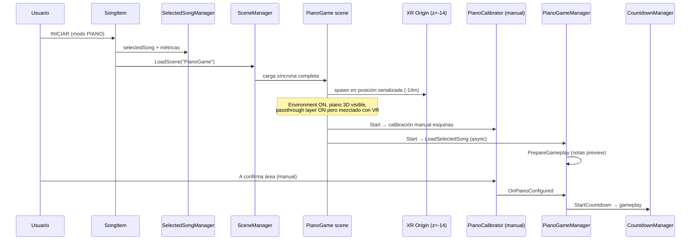
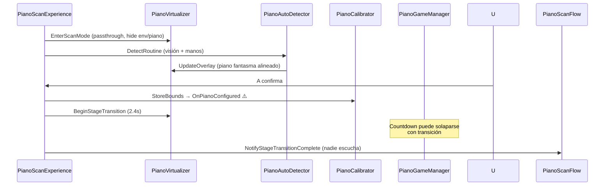

<!-- Generated by SpecStory, Markdown v2.1.0 -->

# 2026-08-18 23:17:26Z

<!-- Cursor IDE Session 1b6940cb-bd1c-48da-9381-78344836e7ac (2026-08-18 23:17:26Z) -->

_**User**_

Explora a fondo el repositorio Unity en C:\Users\vic-s\Desktop\etheriavr_metaquest3 para mapear el flujo completo desde que el usuario pulsa iniciar práctica de piano hasta PianoGame/escenario. Objetivo requerido: al iniciar NO teletransportar ni cargar inmediatamente un escenario virtual; entrar a realidad mixta/passthrough en la posición física actual, detectar y previsualizar el piano, confirmar con A, y recién entonces hacer transición animada al escenario virtual manteniendo la alineación del piano. Investiga escenas, botones, managers, PianoScanExperience/Flow/Virtualizer, activación de passthrough, XR Origin y cualquier carga/teleport. No edites archivos. Devuelve: (1) rutas y métodos exactos con líneas aproximadas, (2) flujo actual real, (3) puntos concretos que incumplen el objetivo, (4) diseño mínimo y seguro de cambios, incluyendo riesgos de referencias serializadas/escenas.

---

_**Agent (composer-2.5)**_

<think><details><summary>Thought Process</summary>
Voy a explorar el repositorio Unity para mapear el flujo completo desde el inicio de la práctica de piano hasta el escenario PianoGame. Analizaré escenas, managers, botones y la lógica de passthrough y transición virtual.

El objetivo es detectar desalineaciones concretas en el flujo actual. Se solicitan rutas y métodos exactos con líneas aproximadas. También se requieren puntos que incumplan el objetivo. El diseño de cambios debe ser mínimo y seguro. Hay que evaluar riesgos de referencias serializadas y escenas. No se editarán archivos.

Iniciaré la exploración del código mediante búsqueda paralela de archivos y patrones clave.
</details></think>

_**Agent (composer-2.5)**_

Voy a rastrear el flujo completo desde el botón de iniciar práctica de piano hasta la escena PianoGame, empezando por escenas, UI y los componentes PianoScan.


_**Agent (composer-2.5)**_

<tool-use data-tool-type="unknown" data-tool-name="update_current_step"><details>
<summary>Tool use: **update_current_step**</summary>
An unknown error occurred
</details></tool-use>

_**Agent (composer-2.5)**_

<tool-use data-tool-type="unknown" data-tool-name="ripgrep_raw_search"><details>
<summary>Tool use: **ripgrep_raw_search**</summary>

Parameters:

```json
{
  "caseInsensitive": true,
  "glob": "*.{cs,unity,prefab}",
  "pattern": "iniciar|Iniciar|StartPractice|start.*piano|piano.*practice|Práctica|Practica"
}
```
Additional data:

```json
{
  "isPruned": true,
  "outputMode": "content",
  "pattern": "iniciar|Iniciar|StartPractice|start.*piano|piano.*practice|Práctica|Practica",
  "topFiles": [
    {
      "matchCount": 1,
      "uri": "Assets/Scripts/CantoMode/Data/SongLoader.cs"
    },
    {
      "matchCount": 1,
      "uri": "Assets/Scripts/PianoMode/VR/Vision/PianoCameraCapture.cs"
    },
    {
      "matchCount": 1,
      "uri": "Assets/Scripts/CantoMode/Gameplay/EndGameManager.cs"
    },
    {
      "matchCount": 2,
      "uri": "Assets/Scenes/RepertorioScene.unity"
    },
    {
      "matchCount": 1,
      "uri": "Assets/Scripts/PianoMode/VR/PianoCalibrator.cs"
    },
    {
      "matchCount": 2,
      "uri": "Assets/Scenes/LoginScene.unity"
    },
    {
      "matchCount": 1,
      "uri": "Assets/Scripts/Core/UI/SongItem.cs"
    },
    {
      "matchCount": 1,
      "uri": "Assets/VRTemplateAssets/Prefabs/TarjetaCancion.prefab"
    },
    {
      "matchCount": 1,
      "uri": "Assets/Scripts/PianoMode/UI/ResultsPanel.cs"
    },
    {
      "matchCount": 1,
      "uri": "Assets/Scripts/PianoMode/UI/PianoPauseMenu.cs"
    },
    {
      "matchCount": 5,
      "uri": "Assets/Scenes/PianoGame.unity"
    },
    {
      "matchCount": 1,
      "uri": "Assets/Scripts/Core/VR/SmoothFollowCanvas.cs"
    },
    {
      "matchCount": 1,
      "uri": "Assets/Scripts/Core/Midi/MidiStatusWidgetController.cs"
    },
    {
      "matchCount": 5,
      "uri": "Assets/Scenes/SingGame.unity"
    },
    {
      "matchCount": 1,
      "uri": "Assets/Scenes/HomeScene.unity"
    },
    {
      "matchCount": 1,
      "uri": "Assets/Scripts/PianoMode/UI/CountdownManager.cs"
    },
    {
      "matchCount": 3,
      "uri": "Assets/Scripts/PianoMode/VR/PianoScanExperience.cs"
    },
    {
      "matchCount": 7,
      "uri": "Assets/Scripts/PianoMode/Managers/PianoGameManager.Gameplay.cs"
    },
    {
      "matchCount": 1,
      "uri": "Assets/Scripts/PianoMode/VR/Vision/PianoVisionLocator.cs"
    },
    {
      "matchCount": 1,
      "uri": "Assets/Prefabs/SongBox_Template.prefab"
    }
  ],
  "totalFiles": 26,
  "totalMatches": 51
}
```
Status: **completed**

</details></tool-use>

_**Agent (composer-2.5)**_

<tool-use data-tool-type="unknown" data-tool-name="ripgrep_raw_search"><details>
<summary>Tool use: **ripgrep_raw_search**</summary>

Parameters:

```json
{
  "caseInsensitive": false,
  "glob": "*.cs",
  "pattern": "PianoScanExperience|PianoScanFlow|PianoVirtualizer|PianoCalibrator"
}
```
Additional data:

```json
{
  "isPruned": true,
  "outputMode": "content",
  "pattern": "PianoScanExperience|PianoScanFlow|PianoVirtualizer|PianoCalibrator",
  "topFiles": [
    {
      "matchCount": 1,
      "uri": "Assets/Scripts/PianoMode/VR/PianoScanFlow.cs"
    },
    {
      "matchCount": 4,
      "uri": "Assets/Scripts/PianoMode/VR/PianoCalibrator.cs"
    },
    {
      "matchCount": 2,
      "uri": "Assets/Scripts/PianoMode/Managers/PianoGameManager.cs"
    },
    {
      "matchCount": 5,
      "uri": "Assets/Scripts/PianoMode/VR/PianoVirtualizer.cs"
    },
    {
      "matchCount": 8,
      "uri": "Assets/Scripts/PianoMode/VR/PianoScanExperience.cs"
    },
    {
      "matchCount": 1,
      "uri": "Assets/Scripts/PianoMode/Managers/PianoGameManager.Gameplay.cs"
    },
    {
      "matchCount": 2,
      "uri": "Assets/Scripts/PianoMode/VR/PianoAutoDetector.cs"
    }
  ],
  "totalFiles": 7,
  "totalMatches": 23
}
```
Status: **completed**

</details></tool-use>

_**Agent (composer-2.5)**_

<tool-use data-tool-type="search" data-tool-name="glob_file_search"><details>
<summary>Tool use: **glob_file_search** • Searched codebase "" • **1** result in **1** directory</summary>

Directory: **``** (1 file)

| File |
|------|
| `Assets/Scenes/PianoGame.unity` |
</details></tool-use>

_**Agent (composer-2.5)**_

<tool-use data-tool-type="search" data-tool-name="glob_file_search"><details>
<summary>Tool use: **glob_file_search** • Searched codebase "" • **5** results in **1** directory</summary>

Directory: **``** (5 files)

| File |
|------|
| `Assets/Scripts/PianoMode/VR/PianoScanFlow.cs` |
| `Assets/Scripts/PianoMode/VR/PianoScanLog.cs` |
| `Assets/Scripts/PianoMode/VR/PianoScanBounds.cs` |
| `Assets/Scripts/PianoMode/VR/PianoScanVfx.cs` |
| `Assets/Scripts/PianoMode/VR/PianoScanExperience.cs` |
</details></tool-use>

_**Agent (composer-2.5)**_

<think><details><summary>Thought Process</summary>
Profundizaré en el código para trazar el arranque de la práctica de piano desde la selección de canciones. Buscaré los métodos de carga de escenas, teletransportes y activación del passthrough.
</details></think>

_**Agent (composer-2.5)**_

<tool-use data-tool-type="unknown" data-tool-name="ripgrep_raw_search"><details>
<summary>Tool use: **ripgrep_raw_search**</summary>

Parameters:

```json
{
  "caseInsensitive": false,
  "glob": "*.cs",
  "pattern": "PianoGame|LoadScene|SceneManager"
}
```
Additional data:

```json
{
  "isPruned": true,
  "outputMode": "content",
  "pattern": "PianoGame|LoadScene|SceneManager",
  "topFiles": [
    {
      "matchCount": 1,
      "uri": "Assets/Scripts/Core/Session/UserSession.cs"
    },
    {
      "matchCount": 2,
      "uri": "Assets/Scripts/CantoMode/Gameplay/EndGameManager.cs"
    },
    {
      "matchCount": 4,
      "uri": "Assets/Scripts/PianoMode/UI/ResultsPanel.cs"
    },
    {
      "matchCount": 8,
      "uri": "Assets/Scripts/Core/UI/ConfigSceneUIController.cs"
    },
    {
      "matchCount": 2,
      "uri": "Assets/Scripts/CantoMode/Gameplay/MenuPausa.cs"
    },
    {
      "matchCount": 4,
      "uri": "Assets/Scripts/Core/UI/Login.cs"
    },
    {
      "matchCount": 1,
      "uri": "Assets/Scripts/PianoMode/VR/Vision/PianoVisionLocator.cs"
    },
    {
      "matchCount": 1,
      "uri": "Assets/Scripts/Core/UI/CambiadorEscenas.cs"
    },
    {
      "matchCount": 1,
      "uri": "Assets/Scripts/Core/Midi/DirectMidiReceiver.cs"
    },
    {
      "matchCount": 2,
      "uri": "Assets/Scripts/Core/UI/SongItem.cs"
    },
    {
      "matchCount": 2,
      "uri": "Assets/Scripts/Core/VR/QuestXRInteractionController.HandTracking.cs"
    },
    {
      "matchCount": 12,
      "uri": "Assets/Scripts/PianoMode/Managers/PianoGameManager.cs"
    },
    {
      "matchCount": 8,
      "uri": "Assets/Scripts/Core/VR/QuestXRInteractionController.cs"
    },
    {
      "matchCount": 2,
      "uri": "Assets/Scripts/PianoMode/UI/ProgressDisplay.cs"
    },
    {
      "matchCount": 17,
      "uri": "Assets/Scripts/PianoMode/Managers/PianoGameManager.Gameplay.cs"
    },
    {
      "matchCount": 2,
      "uri": "Assets/Scripts/Core/UI/SceneLoader.cs"
    },
    {
      "matchCount": 1,
      "uri": "Assets/Scripts/PianoMode/Gameplay/NoteSpawner.cs"
    },
    {
      "matchCount": 3,
      "uri": "Assets/Scripts/Core/Midi/MidiStatusWidgetController.cs"
    },
    {
      "matchCount": 1,
      "uri": "Assets/Scripts/PianoMode/Gameplay/MusicNote.cs"
    },
    {
      "matchCount": 3,
      "uri": "Assets/Scripts/Core/Midi/MidiInitializer.cs"
    }
  ],
  "totalFiles": 26,
  "totalMatches": 95
}
```
Status: **completed**

</details></tool-use>

_**Agent (composer-2.5)**_

<tool-use data-tool-type="read" data-tool-name="read_file_v2"><details>
<summary>Tool use: **read_file_v2** • Read file: c:\Users\vic-s\Desktop\etheriavr_metaquest3\Assets\Scripts\Core\UI\SongItem.cs</summary>

</details></tool-use>

_**Agent (composer-2.5)**_

<tool-use data-tool-type="unknown" data-tool-name="ripgrep_raw_search"><details>
<summary>Tool use: **ripgrep_raw_search**</summary>

Parameters:

```json
{
  "caseInsensitive": false,
  "glob": "*.cs",
  "pattern": "passthrough|PassThrough|OVRPassthrough|MixedReality|MR"
}
```
Additional data:

```json
{
  "isPruned": true,
  "outputMode": "content",
  "pattern": "passthrough|PassThrough|OVRPassthrough|MixedReality|MR",
  "topFiles": [
    {
      "matchCount": 2,
      "uri": "Assets/Scripts/PianoMode/VR/Vision/PianoVisionLocator.cs"
    },
    {
      "matchCount": 1,
      "uri": "Assets/Scripts/PianoMode/VR/PianoScanVfx.cs"
    },
    {
      "matchCount": 6,
      "uri": "Assets/MRTemplateAssets/Scripts/ARFeatureController.cs"
    },
    {
      "matchCount": 1,
      "uri": "Assets/Scripts/PianoMode/VR/Vision/PianoCameraCapture.cs"
    },
    {
      "matchCount": 28,
      "uri": "Assets/Scripts/PianoMode/VR/PianoVirtualizer.cs"
    },
    {
      "matchCount": 24,
      "uri": "Assets/Scripts/PianoMode/VR/PianoCalibrator.cs"
    },
    {
      "matchCount": 4,
      "uri": "Assets/Scripts/PianoMode/VR/PianoScanExperience.cs"
    }
  ],
  "totalFiles": 7,
  "totalMatches": 66
}
```
Status: **completed**

</details></tool-use>

_**Agent (composer-2.5)**_

<tool-use data-tool-type="unknown" data-tool-name="ripgrep_raw_search"><details>
<summary>Tool use: **ripgrep_raw_search**</summary>

Parameters:

```json
{
  "caseInsensitive": false,
  "glob": "*.cs",
  "pattern": "teleport|Teleport|PlayerSpawnPoint|XR Origin"
}
```
Additional data:

```json
{
  "isPruned": true,
  "outputMode": "content",
  "pattern": "teleport|Teleport|PlayerSpawnPoint|XR Origin",
  "topFiles": [
    {
      "matchCount": 17,
      "uri": "Assets/Samples/XR Interaction Toolkit/3.3.0/Starter Assets/Scripts/TeleportVolumeAnchorAffordanceStateLink.cs"
    },
    {
      "matchCount": 6,
      "uri": "Assets/Samples/XR Interaction Toolkit/3.3.0/Starter Assets/DemoSceneAssets/Scripts/MultiAnchorTeleportReticle.cs"
    },
    {
      "matchCount": 4,
      "uri": "Assets/Samples/XR Interaction Toolkit/3.3.0/Hands Interaction Demo/Scripts/PinchPointFollow.cs"
    },
    {
      "matchCount": 1,
      "uri": "Assets/Scripts/PianoMode/VR/RecenterPlayer.cs"
    },
    {
      "matchCount": 33,
      "uri": "Assets/Samples/XR Interaction Toolkit/3.3.0/Starter Assets/Scripts/ClimbTeleportDestinationIndicator.cs"
    },
    {
      "matchCount": 5,
      "uri": "Assets/Scripts/PianoMode/Gameplay/PlayerSpawnPoint.cs"
    },
    {
      "matchCount": 5,
      "uri": "Assets/Scripts/Core/VR/QuestXRInteractionController.ControllerRays.cs"
    },
    {
      "matchCount": 9,
      "uri": "Assets/Samples/XR Interaction Toolkit/3.3.0/Starter Assets/Scripts/ControllerInputActionManager.cs"
    }
  ],
  "totalFiles": 8,
  "totalMatches": 201
}
```
Status: **completed**

</details></tool-use>

_**Agent (composer-2.5)**_

<think><details><summary>Thought Process</summary>
Revisaré los scripts clave del flujo de piano: PianoScanExperience, PianoScanFlow, PianoVirtualizer, PianoGameManager, PlayerSpawnPoint, RecenterPlayer y PianoCalibrator.

También revisaré PianoAutoDetector.cs y buscaré referencias a estos componentes en PianoGame.unity.
</details></think>

_**Agent (composer-2.5)**_

<tool-use data-tool-type="read" data-tool-name="read_file_v2"><details>
<summary>Tool use: **read_file_v2** • Read file: c:\Users\vic-s\Desktop\etheriavr_metaquest3\Assets\Scripts\PianoMode\VR\PianoScanExperience.cs</summary>

</details></tool-use>

_**Agent (composer-2.5)**_

<tool-use data-tool-type="read" data-tool-name="read_file_v2"><details>
<summary>Tool use: **read_file_v2** • Read file: c:\Users\vic-s\Desktop\etheriavr_metaquest3\Assets\Scripts\PianoMode\VR\PianoScanFlow.cs</summary>

</details></tool-use>

_**Agent (composer-2.5)**_

<tool-use data-tool-type="read" data-tool-name="read_file_v2"><details>
<summary>Tool use: **read_file_v2** • Read file: c:\Users\vic-s\Desktop\etheriavr_metaquest3\Assets\Scripts\PianoMode\VR\PianoVirtualizer.cs</summary>

</details></tool-use>

_**Agent (composer-2.5)**_

<tool-use data-tool-type="read" data-tool-name="read_file_v2"><details>
<summary>Tool use: **read_file_v2** • Read file: c:\Users\vic-s\Desktop\etheriavr_metaquest3\Assets\Scripts\PianoMode\Managers\PianoGameManager.cs</summary>

</details></tool-use>

_**Agent (composer-2.5)**_

<tool-use data-tool-type="read" data-tool-name="read_file_v2"><details>
<summary>Tool use: **read_file_v2** • Read file: c:\Users\vic-s\Desktop\etheriavr_metaquest3\Assets\Scripts\PianoMode\Gameplay\PlayerSpawnPoint.cs</summary>

</details></tool-use>

_**Agent (composer-2.5)**_

<tool-use data-tool-type="read" data-tool-name="read_file_v2"><details>
<summary>Tool use: **read_file_v2** • Read file: c:\Users\vic-s\Desktop\etheriavr_metaquest3\Assets\Scripts\PianoMode\VR\RecenterPlayer.cs</summary>

</details></tool-use>

_**Agent (composer-2.5)**_

<think><details><summary>Thought Process</summary>
Revisaré PianoGameManager.Gameplay.cs para localizar los métodos OnPianoConfigured, PianoCalibrator, PianoAutoDetector y SelectedSongManager. También buscaré estos componentes en la escena PianoGame.unity para mapear sus configuraciones.
</details></think>

_**Agent (composer-2.5)**_

<tool-use data-tool-type="read" data-tool-name="read_file_v2"><details>
<summary>Tool use: **read_file_v2** • Read file: c:\Users\vic-s\Desktop\etheriavr_metaquest3\Assets\Scripts\PianoMode\Managers\PianoGameManager.Gameplay.cs</summary>

</details></tool-use>

_**Agent (composer-2.5)**_

<tool-use data-tool-type="read" data-tool-name="read_file_v2"><details>
<summary>Tool use: **read_file_v2** • Read file: c:\Users\vic-s\Desktop\etheriavr_metaquest3\Assets\Scripts\PianoMode\VR\PianoCalibrator.cs</summary>

</details></tool-use>

_**Agent (composer-2.5)**_

<tool-use data-tool-type="read" data-tool-name="read_file_v2"><details>
<summary>Tool use: **read_file_v2** • Read file: c:\Users\vic-s\Desktop\etheriavr_metaquest3\Assets\Scripts\PianoMode\VR\PianoAutoDetector.cs</summary>

</details></tool-use>

_**Agent (composer-2.5)**_

<tool-use data-tool-type="unknown" data-tool-name="ripgrep_raw_search"><details>
<summary>Tool use: **ripgrep_raw_search**</summary>

Parameters:

```json
{
  "caseInsensitive": false,
  "glob": "PianoGame.unity",
  "pattern": "PianoScanExperience|PianoVirtualizer|PianoCalibrator|PlayerSpawnPoint|RecenterPlayer|PianoScan|OVRPassthrough|repositionPlayerOnStart|autoRecenterOnStart"
}
```
Additional data:

```json
{
  "isPruned": true,
  "outputMode": "content",
  "pattern": "PianoScanExperience|PianoVirtualizer|PianoCalibrator|PlayerSpawnPoint|RecenterPlayer|PianoScan|OVRPassthrough|repositionPlayerOnStart|autoRecenterOnStart",
  "topFiles": [
    {
      "matchCount": 3,
      "uri": "Assets/Scenes/PianoGame.unity"
    }
  ],
  "totalFiles": 1,
  "totalMatches": 3
}
```
Status: **completed**

</details></tool-use>

_**Agent (composer-2.5)**_

<tool-use data-tool-type="unknown" data-tool-name="ripgrep_raw_search"><details>
<summary>Tool use: **ripgrep_raw_search**</summary>

Parameters:

```json
{
  "caseInsensitive": false,
  "glob": "*.cs",
  "pattern": "OnPianoConfigured|OnStageTransitionComplete|SelectedSongManager"
}
```
Additional data:

```json
{
  "isPruned": true,
  "outputMode": "content",
  "pattern": "OnPianoConfigured|OnStageTransitionComplete|SelectedSongManager",
  "topFiles": [
    {
      "matchCount": 6,
      "uri": "Assets/Scripts/CantoMode/Data/SongLoader.cs"
    },
    {
      "matchCount": 2,
      "uri": "Assets/Scripts/Core/UI/SelectedSongManager.cs"
    },
    {
      "matchCount": 4,
      "uri": "Assets/Scripts/Core/UI/SongItem.cs"
    },
    {
      "matchCount": 2,
      "uri": "Assets/Scripts/PianoMode/VR/PianoScanFlow.cs"
    },
    {
      "matchCount": 4,
      "uri": "Assets/Scripts/CantoMode/Gameplay/EndGameManager.cs"
    },
    {
      "matchCount": 3,
      "uri": "Assets/Scripts/Core/UI/ShowRepertorio.cs"
    },
    {
      "matchCount": 2,
      "uri": "Assets/Scripts/PianoMode/Managers/PianoGameManager.cs"
    },
    {
      "matchCount": 7,
      "uri": "Assets/Scripts/PianoMode/Managers/PianoGameManager.Gameplay.cs"
    },
    {
      "matchCount": 3,
      "uri": "Assets/Scripts/PianoMode/VR/PianoCalibrator.cs"
    }
  ],
  "totalFiles": 9,
  "totalMatches": 33
}
```
Status: **completed**

</details></tool-use>

_**Agent (composer-2.5)**_

<think><details><summary>Thought Process</summary>
Revisaré PianoGame.unity para mapear PianoScanExperience, PlayerSpawnPoint, RecenterPlayer, XR Origin, entorno y RepertorioScene.

Buscaré en el archivo de escena y los scripts relacionados.
</details></think>

_**Agent (composer-2.5)**_

<tool-use data-tool-type="unknown" data-tool-name="ripgrep_raw_search"><details>
<summary>Tool use: **ripgrep_raw_search**</summary>

Parameters:

```json
{
  "caseInsensitive": false,
  "glob": "PianoGame.unity",
  "pattern": "PianoScanExperience|PianoVirtualizer|PianoAutoDetector|PlayerSpawnPoint|RecenterPlayer|repositionPlayerOnStart|autoRecenterOnStart|automaticScanMode|Environment|Piano_SpawnPoint|XR Origin"
}
```
Additional data:

```json
{
  "isPruned": true,
  "outputMode": "content",
  "pattern": "PianoScanExperience|PianoVirtualizer|PianoAutoDetector|PlayerSpawnPoint|RecenterPlayer|repositionPlayerOnStart|autoRecenterOnStart|automaticScanMode|Environment|Piano_SpawnPoint|XR Origin",
  "topFiles": [
    {
      "matchCount": 7,
      "uri": "Assets/Scenes/PianoGame.unity"
    }
  ],
  "totalFiles": 1,
  "totalMatches": 7
}
```
Status: **completed**

</details></tool-use>

_**Agent (composer-2.5)**_

<tool-use data-tool-type="unknown" data-tool-name="ripgrep_raw_search"><details>
<summary>Tool use: **ripgrep_raw_search**</summary>

Parameters:

```json
{
  "caseInsensitive": false,
  "glob": "*.unity",
  "pattern": "PianoScanExperience|PianoVirtualizer"
}
```
Additional data:

```json
{
  "isPruned": true,
  "outputMode": "content",
  "pattern": "PianoScanExperience|PianoVirtualizer",
  "topFiles": [],
  "totalFiles": 0,
  "totalMatches": 0
}
```
Status: **completed**

</details></tool-use>

_**Agent (composer-2.5)**_

<tool-use data-tool-type="read" data-tool-name="read_file_v2"><details>
<summary>Tool use: **read_file_v2** • Read file: c:\Users\vic-s\Desktop\etheriavr_metaquest3\Assets\Scripts\Core\UI\SelectedSongManager.cs</summary>

</details></tool-use>

_**Agent (composer-2.5)**_

<tool-use data-tool-type="unknown" data-tool-name="ripgrep_raw_search"><details>
<summary>Tool use: **ripgrep_raw_search**</summary>

Parameters:

```json
{
  "caseInsensitive": false,
  "glob": "*.cs",
  "pattern": "OnStageTransitionComplete|NotifyStageTransitionComplete"
}
```
Additional data:

```json
{
  "isPruned": true,
  "outputMode": "content",
  "pattern": "OnStageTransitionComplete|NotifyStageTransitionComplete",
  "topFiles": [
    {
      "matchCount": 1,
      "uri": "Assets/Scripts/PianoMode/VR/PianoScanExperience.cs"
    },
    {
      "matchCount": 3,
      "uri": "Assets/Scripts/PianoMode/VR/PianoScanFlow.cs"
    }
  ],
  "totalFiles": 2,
  "totalMatches": 4
}
```
Status: **completed**

</details></tool-use>

_**Agent (composer-2.5)**_

<tool-use data-tool-type="search" data-tool-name="glob_file_search"><details>
<summary>Tool use: **glob_file_search** • Searched codebase "" • **1** result in **1** directory</summary>

Directory: **``** (1 file)

| File |
|------|
| `ProjectSettings/EditorBuildSettings.asset` |
</details></tool-use>

_**Agent (composer-2.5)**_

<think><details><summary>Thought Process</summary>
PianoScanExperience y PianoVirtualizer no aparecen en ningún archivo .unity. Probablemente se añaden en tiempo de ejecución o vía prefabs sin coincidencia. También podrían referenciarse por GUID de script con nombres distintos.

Voy a buscar PianoScanExperience en todos los archivos del proyecto, incluidos prefabs y guías de script.
</details></think>

_**Agent (composer-2.5)**_

<tool-use data-tool-type="unknown" data-tool-name="ripgrep_raw_search"><details>
<summary>Tool use: **ripgrep_raw_search**</summary>

Parameters:

```json
{
  "caseInsensitive": false,
  "pattern": "PianoScanExperience"
}
```
Additional data:

```json
{
  "isPruned": true,
  "outputMode": "content",
  "pattern": "PianoScanExperience",
  "topFiles": [
    {
      "matchCount": 1,
      "uri": ".specstory/history/2026-08-18_02-42-31Z-piano-mode-vr-scan.md"
    },
    {
      "matchCount": 36,
      "uri": ".specstory/history/2026-08-18_19-55-13Z-missing-namespace-errors.md"
    },
    {
      "matchCount": 36,
      "uri": ".specstory\\history\\2026-08-18_19-55-13Z-missing-namespace-errors.md"
    },
    {
      "matchCount": 1,
      "uri": "Assets/Scripts/PianoMode/VR/PianoScanExperience.cs"
    },
    {
      "matchCount": 1,
      "uri": ".specstory\\history\\2026-08-18_23-17-26Z-mapear-flujo-piano-xr.md"
    }
  ],
  "totalFiles": 5,
  "totalMatches": 75
}
```
Status: **completed**

</details></tool-use>

_**Agent (composer-2.5)**_

<tool-use data-tool-type="unknown" data-tool-name="ripgrep_raw_search"><details>
<summary>Tool use: **ripgrep_raw_search**</summary>

Parameters:

```json
{
  "caseInsensitive": false,
  "pattern": "PianoVirtualizer"
}
```
Additional data:

```json
{
  "isPruned": true,
  "outputMode": "content",
  "pattern": "PianoVirtualizer",
  "topFiles": [
    {
      "matchCount": 2,
      "uri": "Assets/Scripts/PianoMode/VR/PianoScanExperience.cs"
    },
    {
      "matchCount": 1,
      "uri": ".specstory\\history\\2026-08-18_23-17-26Z-mapear-piano-virtual.md"
    },
    {
      "matchCount": 1,
      "uri": ".specstory/history/2026-08-18_02-42-31Z-piano-mode-vr-scan.md"
    },
    {
      "matchCount": 39,
      "uri": ".specstory\\history\\2026-08-18_19-55-13Z-missing-namespace-errors.md"
    },
    {
      "matchCount": 2,
      "uri": "Assets/Scripts/PianoMode/VR/PianoVirtualizer.cs"
    },
    {
      "matchCount": 1,
      "uri": ".specstory\\history\\2026-08-18_23-17-26Z-auditar-vision-y-calibracion.md"
    },
    {
      "matchCount": 39,
      "uri": ".specstory/history/2026-08-18_19-55-13Z-missing-namespace-errors.md"
    }
  ],
  "totalFiles": 7,
  "totalMatches": 85
}
```
Status: **completed**

</details></tool-use>

_**Agent (composer-2.5)**_

<tool-use data-tool-type="read" data-tool-name="read_file_v2"><details>
<summary>Tool use: **read_file_v2** • Read file: c:\Users\vic-s\Desktop\etheriavr_metaquest3\ProjectSettings\EditorBuildSettings.asset</summary>

</details></tool-use>

_**Agent (composer-2.5)**_

<tool-use data-tool-type="unknown" data-tool-name="ripgrep_raw_search"><details>
<summary>Tool use: **ripgrep_raw_search**</summary>

Parameters:

```json
{
  "caseInsensitive": false,
  "glob": "RepertorioScene.unity",
  "pattern": "SongItem|btnJugar|INICIAR|SelectedSongManager"
}
```
Additional data:

```json
{
  "isPruned": true,
  "outputMode": "content",
  "pattern": "SongItem|btnJugar|INICIAR|SelectedSongManager",
  "topFiles": [
    {
      "matchCount": 2,
      "uri": "Assets/Scenes/RepertorioScene.unity"
    }
  ],
  "totalFiles": 1,
  "totalMatches": 2
}
```
Status: **completed**

</details></tool-use>

_**Agent (composer-2.5)**_

<tool-use data-tool-type="read" data-tool-name="read_file_v2"><details>
<summary>Tool use: **read_file_v2** • Read file: c:\Users\vic-s\Desktop\etheriavr_metaquest3\Assets\Scripts\PianoMode\VR\PianoScanExperience.cs.meta</summary>

</details></tool-use>

_**Agent (composer-2.5)**_

<think><details><summary>Thought Process</summary>
PianoScanExperience no está conectado en la escena. Es un hallazgo crítico. Se buscará el GUID de PianoCalibrator en PianoGame.unity para verificar qué corre al cargar la escena.

Se buscará si PianoScanExperience se adjunta en tiempo de ejecución. Se obtendrá su GUID y se revisará PianoGame.unity.
</details></think>

_**Agent (composer-2.5)**_

<tool-use data-tool-type="read" data-tool-name="read_file_v2"><details>
<summary>Tool use: **read_file_v2** • Read file: c:\Users\vic-s\Desktop\etheriavr_metaquest3\Assets\Scripts\PianoMode\VR\PianoCalibrator.cs.meta</summary>

</details></tool-use>

_**Agent (composer-2.5)**_

<tool-use data-tool-type="unknown" data-tool-name="ripgrep_raw_search"><details>
<summary>Tool use: **ripgrep_raw_search**</summary>

Parameters:

```json
{
  "caseInsensitive": false,
  "glob": "PianoGame.unity",
  "pattern": "5715e90231308ed428ef86b9b2276163|PianoCalibrator|PlayerSpawnPoint|RecenterPlayer|5715e902|m_LocalPosition|m_Name: Piano"
}
```
Additional data:

```json
{
  "isPruned": true,
  "outputMode": "content",
  "pattern": "5715e90231308ed428ef86b9b2276163|PianoCalibrator|PlayerSpawnPoint|RecenterPlayer|5715e902|m_LocalPosition|m_Name: Piano",
  "topFiles": [
    {
      "matchCount": 100,
      "uri": "Assets/Scenes/PianoGame.unity"
    }
  ],
  "totalFiles": 1,
  "totalMatches": 100
}
```
Status: **completed**

</details></tool-use>

_**Agent (composer-2.5)**_

<tool-use data-tool-type="read" data-tool-name="read_file_v2"><details>
<summary>Tool use: **read_file_v2** • Read file: c:\Users\vic-s\Desktop\etheriavr_metaquest3\Assets\Scripts\PianoMode\VR\PianoScanVfx.cs</summary>

</details></tool-use>

_**Agent (composer-2.5)**_

<tool-use data-tool-type="read" data-tool-name="read_file_v2"><details>
<summary>Tool use: **read_file_v2** • Read file: c:\Users\vic-s\Desktop\etheriavr_metaquest3\Assets\Scripts\Core\VR\QuestXRInteractionController.cs</summary>

</details></tool-use>

_**Agent (composer-2.5)**_

<think><details><summary>Thought Process</summary>
Revisaré la sección PianoCalibrator en PianoGame.unity cerca de la línea 4487 para ver su configuración. También buscaré dónde está adjunto PianoScanExperience.

Buscaré scripts que añadan PianoScanExperience en tiempo de ejecución. Revisaré las posiciones de XR Origin y PianoCalibrator en la escena PianoGame.
</details></think>

_**Agent (composer-2.5)**_

<tool-use data-tool-type="read" data-tool-name="read_file_v2"><details>
<summary>Tool use: **read_file_v2** • Read file: c:\Users\vic-s\Desktop\etheriavr_metaquest3\Assets\Scenes\PianoGame.unity</summary>

</details></tool-use>

_**Agent (composer-2.5)**_

<tool-use data-tool-type="unknown" data-tool-name="ripgrep_raw_search"><details>
<summary>Tool use: **ripgrep_raw_search**</summary>

Parameters:

```json
{
  "caseInsensitive": false,
  "glob": "PianoGame.unity",
  "pattern": "3e6c59ec9fae9d04e933270c2cc076c2|5715e90231308ed428ef86b9b2276163|PlayerSpawnPoint|RecenterPlayer|PianoGameManager|m_Script"
}
```
Additional data:

```json
{
  "isPruned": true,
  "outputMode": "content",
  "pattern": "3e6c59ec9fae9d04e933270c2cc076c2|5715e90231308ed428ef86b9b2276163|PlayerSpawnPoint|RecenterPlayer|PianoGameManager|m_Script",
  "topFiles": [
    {
      "matchCount": 60,
      "uri": "Assets/Scenes/PianoGame.unity"
    }
  ],
  "totalFiles": 1,
  "totalMatches": 100
}
```
Status: **completed**

</details></tool-use>

_**Agent (composer-2.5)**_

<tool-use data-tool-type="unknown" data-tool-name="ripgrep_raw_search"><details>
<summary>Tool use: **ripgrep_raw_search**</summary>

Parameters:

```json
{
  "caseInsensitive": false,
  "glob": "*.cs",
  "pattern": "AddComponent.*PianoScan|PianoScanExperience"
}
```
Additional data:

```json
{
  "isPruned": true,
  "outputMode": "content",
  "pattern": "AddComponent.*PianoScan|PianoScanExperience",
  "topFiles": [
    {
      "matchCount": 2,
      "uri": "Assets/Scripts/PianoMode/VR/PianoScanExperience.cs"
    }
  ],
  "totalFiles": 1,
  "totalMatches": 2
}
```
Status: **completed**

</details></tool-use>

_**Agent (composer-2.5)**_

<tool-use data-tool-type="read" data-tool-name="read_file_v2"><details>
<summary>Tool use: **read_file_v2** • Read file: c:\Users\vic-s\Desktop\etheriavr_metaquest3\Assets\Scenes\PianoGame.unity</summary>

</details></tool-use>

_**Agent (composer-2.5)**_

<think><details><summary>Thought Process</summary>
Se detectó que el PianoCalibrator en la escena contiene campos serializados que no existen en el código actual: decisionTitleText, moveSpeed, scaleSpeed, rotateSpeed y useControllerPromptForDecision.

PianoScanExperience no está presente en la escena. Esto impide el flujo de autoescaneo y la adición automática de PianoVirtualizer. Se buscarán los GUIDs de PianoVirtualizer y PianoGameManager en la escena para verificar referencias.
</details></think>

_**Agent (composer-2.5)**_

<tool-use data-tool-type="read" data-tool-name="read_file_v2"><details>
<summary>Tool use: **read_file_v2** • Read file: c:\Users\vic-s\Desktop\etheriavr_metaquest3\Assets\Scripts\PianoMode\VR\PianoVirtualizer.cs.meta</summary>

</details></tool-use>

_**Agent (composer-2.5)**_

<tool-use data-tool-type="unknown" data-tool-name="ripgrep_raw_search"><details>
<summary>Tool use: **ripgrep_raw_search**</summary>

Parameters:

```json
{
  "caseInsensitive": false,
  "glob": "PianoGame.unity",
  "pattern": "PianoGameManager|PlayerSpawnPoint|RecenterPlayer|5715e902|ef20135915079454985abea5a2ec8967|01a1618227492a2489e382643ddb2bea"
}
```
Additional data:

```json
{
  "isPruned": true,
  "outputMode": "content",
  "pattern": "PianoGameManager|PlayerSpawnPoint|RecenterPlayer|5715e902|ef20135915079454985abea5a2ec8967|01a1618227492a2489e382643ddb2bea",
  "topFiles": [
    {
      "matchCount": 4,
      "uri": "Assets/Scenes/PianoGame.unity"
    }
  ],
  "totalFiles": 1,
  "totalMatches": 4
}
```
Status: **completed**

</details></tool-use>

_**Agent (composer-2.5)**_

<tool-use data-tool-type="read" data-tool-name="read_file_v2"><details>
<summary>Tool use: **read_file_v2** • Read file: c:\Users\vic-s\Desktop\etheriavr_metaquest3\Assets\Scripts\PianoMode\Managers\PianoGameManager.cs.meta</summary>

</details></tool-use>

_**Agent (composer-2.5)**_

<tool-use data-tool-type="read" data-tool-name="read_file_v2"><details>
<summary>Tool use: **read_file_v2** • Read file: c:\Users\vic-s\Desktop\etheriavr_metaquest3\Assets\Scripts\PianoMode\Gameplay\PlayerSpawnPoint.cs.meta</summary>

</details></tool-use>

_**Agent (composer-2.5)**_

<tool-use data-tool-type="unknown" data-tool-name="ripgrep_raw_search"><details>
<summary>Tool use: **ripgrep_raw_search**</summary>

Parameters:

```json
{
  "caseInsensitive": false,
  "glob": "PianoGame.unity",
  "pattern": "m_Name: Piano|490249800|1075856485|98ea15acd4af41342a8cb5f6a5b31077"
}
```
Additional data:

```json
{
  "isPruned": true,
  "outputMode": "content",
  "pattern": "m_Name: Piano|490249800|1075856485|98ea15acd4af41342a8cb5f6a5b31077",
  "topFiles": [
    {
      "matchCount": 30,
      "uri": "Assets/Scenes/PianoGame.unity"
    }
  ],
  "totalFiles": 1,
  "totalMatches": 30
}
```
Status: **completed**

</details></tool-use>

_**Agent (composer-2.5)**_

<think><details><summary>Thought Process</summary>
Revisando la posición del prefab del piano en escena, la configuración de PianoGameManager y los métodos en las líneas 587 y 9423.
</details></think>

_**Agent (composer-2.5)**_

<tool-use data-tool-type="read" data-tool-name="read_file_v2"><details>
<summary>Tool use: **read_file_v2** • Read file: c:\Users\vic-s\Desktop\etheriavr_metaquest3\Assets\Scenes\PianoGame.unity</summary>

</details></tool-use>

_**Agent (composer-2.5)**_

<tool-use data-tool-type="read" data-tool-name="read_file_v2"><details>
<summary>Tool use: **read_file_v2** • Read file: c:\Users\vic-s\Desktop\etheriavr_metaquest3\Assets\Scenes\PianoGame.unity</summary>

</details></tool-use>

_**Agent (composer-2.5)**_

<tool-use data-tool-type="read" data-tool-name="read_file_v2"><details>
<summary>Tool use: **read_file_v2** • Read file: c:\Users\vic-s\Desktop\etheriavr_metaquest3\Assets\Scenes\PianoGame.unity</summary>

</details></tool-use>

_**Agent (composer-2.5)**_

<tool-use data-tool-type="read" data-tool-name="read_file_v2"><details>
<summary>Tool use: **read_file_v2** • Read file: c:\Users\vic-s\Desktop\etheriavr_metaquest3\Assets\Scenes\PianoGame.unity</summary>

</details></tool-use>

_**Agent (composer-2.5)**_

<tool-use data-tool-type="read" data-tool-name="read_file_v2"><details>
<summary>Tool use: **read_file_v2** • Read file: c:\Users\vic-s\Desktop\etheriavr_metaquest3\Assets\Scenes\PianoGame.unity</summary>

</details></tool-use>

_**Agent (composer-2.5)**_

<think><details><summary>Thought Process</summary>
El piano virtual se instancia en coordenadas fijas (0.46, -1.581, -13.583) con rotación Y=180, ubicado a unos 14 metros detrás del origen. El entorno virtual está activo por defecto en la línea 16529.

OVRPassthroughLayer existe en el XR rig pero su estado inicial no está claro. PianoScanExperience y PianoVirtualizer no están presentes en la escena PianoGame.unity. PlayerSpawnPoint y RecenterPlayer tampoco aparecen en esa escena. PianoCalibrator ejecuta calibración manual de esquinas porque ConfigureForAutomaticScan nunca se invoca. Los logs del specstory indican que ambos scripts sí corren en el dispositivo físico.

Se investiga si PianoScanExperience y PianoVirtualizer se añaden a la escena en tiempo de ejecución mediante un bootstrap o dependencias dinámicas, ya que no figuran en PianoGame.unity. Se ampliará la búsqueda para encontrar cómo se inyectan esos objetos en el dispositivo físico.
</details></think>

_**Agent (composer-2.5)**_

<tool-use data-tool-type="unknown" data-tool-name="ripgrep_raw_search"><details>
<summary>Tool use: **ripgrep_raw_search**</summary>

Parameters:

```json
{
  "caseInsensitive": false,
  "pattern": "6215224f992eca340a0463f22edebd3b|5715e90231308ed428ef86b9b2276163|2f9494d03ad503948ac8bd3ac2f15df8"
}
```
Additional data:

```json
{
  "isPruned": true,
  "outputMode": "content",
  "pattern": "6215224f992eca340a0463f22edebd3b|5715e90231308ed428ef86b9b2276163|2f9494d03ad503948ac8bd3ac2f15df8",
  "topFiles": [
    {
      "matchCount": 2,
      "uri": ".specstory/history/2026-03-24_05-41-10Z-implementing-pause-functionality-in.md"
    },
    {
      "matchCount": 1,
      "uri": "Assets/Scripts/PianoMode/VR/PianoVirtualizer.cs.meta"
    },
    {
      "matchCount": 1,
      "uri": "Assets/Scripts/PianoMode/Gameplay/PlayerSpawnPoint.cs.meta"
    },
    {
      "matchCount": 1,
      "uri": "Assets/Scripts/PianoMode/VR/PianoScanExperience.cs.meta"
    }
  ],
  "totalFiles": 4,
  "totalMatches": 5
}
```
Status: **completed**

</details></tool-use>

_**Agent (composer-2.5)**_

<tool-use data-tool-type="unknown" data-tool-name="ripgrep_raw_search"><details>
<summary>Tool use: **ripgrep_raw_search**</summary>

Parameters:

```json
{
  "caseInsensitive": false,
  "glob": "*.cs",
  "pattern": "ConfigureForAutomaticScan|BeginCornerCalibration|EnterScanMode"
}
```
Additional data:

```json
{
  "isPruned": true,
  "outputMode": "content",
  "pattern": "ConfigureForAutomaticScan|BeginCornerCalibration|EnterScanMode",
  "topFiles": [
    {
      "matchCount": 6,
      "uri": "Assets/Scripts/PianoMode/VR/PianoScanExperience.cs"
    },
    {
      "matchCount": 4,
      "uri": "Assets/Scripts/PianoMode/VR/PianoCalibrator.cs"
    },
    {
      "matchCount": 3,
      "uri": "Assets/Scripts/PianoMode/VR/PianoVirtualizer.cs"
    }
  ],
  "totalFiles": 3,
  "totalMatches": 13
}
```
Status: **completed**

</details></tool-use>

_**Agent (composer-2.5)**_

<tool-use data-tool-type="read" data-tool-name="read_file_v2"><details>
<summary>Tool use: **read_file_v2** • Read file: c:\Users\vic-s\Desktop\etheriavr_metaquest3\Assets\Scenes\PianoGame.unity</summary>

</details></tool-use>

_**Agent (composer-2.5)**_

<tool-use data-tool-type="unknown" data-tool-name="ripgrep_raw_search"><details>
<summary>Tool use: **ripgrep_raw_search**</summary>

Parameters:

```json
{
  "caseInsensitive": false,
  "glob": "PianoGame.unity",
  "pattern": "QuestXRInteractionController|1028999479"
}
```
Additional data:

```json
{
  "isPruned": true,
  "outputMode": "content",
  "pattern": "QuestXRInteractionController|1028999479",
  "topFiles": [
    {
      "matchCount": 13,
      "uri": "Assets/Scenes/PianoGame.unity"
    }
  ],
  "totalFiles": 1,
  "totalMatches": 13
}
```
Status: **completed**

</details></tool-use>

_**Agent (composer-2.5)**_

<think><details><summary>Thought Process</summary>
XR Origin en la escena PianoGame está posicionado en (0.35, -1.5, -14.04). Esto teletransporta al jugador a una posición virtual fija a unos 14 metros detrás de él, en lugar de respetar su ubicación física actual. El piano se sitúa en (-13.583) para alinearse con ese escenario virtual. Esta es una falla crítica que impide el flujo deseado: el usuario no entra en realidad mixta desde su posición real, sino que se desplaza inmediatamente a una escena virtual.

Sin PianoScanExperience, el entorno virtual permanece activo por defecto. PianoCalibrator.Start() dispara calibración manual y deja visible la escena virtual completa desde el inicio. La capa OVRPassthroughLayer podría mostrar simultáneamente el passthrough físico y el entorno virtual. Se analizará el prefab XR rig y el controlador QuestXRInteractionController para verificar cómo se activa el passthrough. También se revisará el flujo ShowRepertorio y la asignación del botón INICIAR.
</details></think>

_**Agent (composer-2.5)**_

<tool-use data-tool-type="unknown" data-tool-name="ripgrep_raw_search"><details>
<summary>Tool use: **ripgrep_raw_search**</summary>

Parameters:

```json
{
  "caseInsensitive": false,
  "glob": "PianoGame.unity",
  "pattern": "QuestXRInteractionController|1492198129"
}
```
Additional data:

```json
{
  "isPruned": true,
  "outputMode": "content",
  "pattern": "QuestXRInteractionController|1492198129",
  "topFiles": [
    {
      "matchCount": 2,
      "uri": "Assets/Scenes/PianoGame.unity"
    }
  ],
  "totalFiles": 1,
  "totalMatches": 2
}
```
Status: **completed**

</details></tool-use>

_**Agent (composer-2.5)**_

<tool-use data-tool-type="read" data-tool-name="read_file_v2"><details>
<summary>Tool use: **read_file_v2** • Read file: c:\Users\vic-s\Desktop\etheriavr_metaquest3\Assets\Scripts\Core\UI\ShowRepertorio.cs</summary>

</details></tool-use>

_**Agent (composer-2.5)**_

<tool-use data-tool-type="unknown" data-tool-name="ripgrep_raw_search"><details>
<summary>Tool use: **ripgrep_raw_search**</summary>

Parameters:

```json
{
  "caseInsensitive": false,
  "glob": "*.prefab",
  "pattern": "SongItem|btnJugar|INICIAR"
}
```
Additional data:

```json
{
  "isPruned": true,
  "outputMode": "content",
  "pattern": "SongItem|btnJugar|INICIAR",
  "topFiles": [
    {
      "matchCount": 3,
      "uri": "Assets/VRTemplateAssets/Prefabs/TarjetaCancion.prefab"
    },
    {
      "matchCount": 3,
      "uri": "Assets/Prefabs/SongBox_Template.prefab"
    }
  ],
  "totalFiles": 2,
  "totalMatches": 6
}
```
Status: **completed**

</details></tool-use>

_**Agent (composer-2.5)**_

<tool-use data-tool-type="read" data-tool-name="read_file_v2"><details>
<summary>Tool use: **read_file_v2** • Read file: c:\Users\vic-s\Desktop\etheriavr_metaquest3\Assets\Scripts\PianoMode\VR\Vision\PianoVisionLocator.cs</summary>

</details></tool-use>

_**Agent (composer-2.5)**_

<think><details><summary>Thought Process</summary>
Revisando el componente 1492198129 del XR rig. Probablemente es QuestXRInteractionController.
</details></think>

_**Agent (composer-2.5)**_

<tool-use data-tool-type="read" data-tool-name="read_file_v2"><details>
<summary>Tool use: **read_file_v2** • Read file: c:\Users\vic-s\Desktop\etheriavr_metaquest3\Assets\Scenes\PianoGame.unity</summary>

</details></tool-use>

_**Agent (composer-2.5)**_

<tool-use data-tool-type="unknown" data-tool-name="ripgrep_raw_search"><details>
<summary>Tool use: **ripgrep_raw_search**</summary>

Parameters:

```json
{
  "caseInsensitive": false,
  "glob": "*.meta",
  "pattern": "guid: ef20135915079454985abea5a2ec8967"
}
```
Additional data:

```json
{
  "isPruned": true,
  "outputMode": "content",
  "pattern": "guid: ef20135915079454985abea5a2ec8967",
  "topFiles": [],
  "totalFiles": 0,
  "totalMatches": 0
}
```
Status: **completed**

</details></tool-use>

_**Agent (composer-2.5)**_

<tool-use data-tool-type="unknown" data-tool-name="ripgrep_raw_search"><details>
<summary>Tool use: **ripgrep_raw_search**</summary>

Parameters:

```json
{
  "caseInsensitive": false,
  "glob": "PianoGame.unity",
  "pattern": "Passthrough_Window|741082530|504932248"
}
```
Additional data:

```json
{
  "isPruned": true,
  "outputMode": "content",
  "pattern": "Passthrough_Window|741082530|504932248",
  "topFiles": [
    {
      "matchCount": 11,
      "uri": "Assets/Scenes/PianoGame.unity"
    }
  ],
  "totalFiles": 1,
  "totalMatches": 11
}
```
Status: **completed**

</details></tool-use>

_**Agent (composer-2.5)**_

<tool-use data-tool-type="read" data-tool-name="read_file_v2"><details>
<summary>Tool use: **read_file_v2** • Read file: c:\Users\vic-s\Desktop\etheriavr_metaquest3\Assets\Scenes\PianoGame.unity</summary>

</details></tool-use>

_**Agent (composer-2.5)**_

<think><details><summary>Thought Process</summary>
Busco el GUID de QuestXRInteractionController en la escena y reviso la sección Passthrough_Window.

Reviso también la navegación entre HomeScene y Repertorio.
</details></think>

_**Agent (composer-2.5)**_

<tool-use data-tool-type="read" data-tool-name="read_file_v2"><details>
<summary>Tool use: **read_file_v2** • Read file: c:\Users\vic-s\Desktop\etheriavr_metaquest3\Assets\Scripts\Core\VR\QuestXRInteractionController.cs.meta</summary>

</details></tool-use>

_**Agent (composer-2.5)**_

<tool-use data-tool-type="unknown" data-tool-name="ripgrep_raw_search"><details>
<summary>Tool use: **ripgrep_raw_search**</summary>

Parameters:

```json
{
  "caseInsensitive": false,
  "glob": "PianoGame.unity",
  "pattern": "7e933e81d3c20c74ea6fdc708a67e3a5|QuestXR|disableHandTracking|disableLocomotion"
}
```
Additional data:

```json
{
  "isPruned": true,
  "outputMode": "content",
  "pattern": "7e933e81d3c20c74ea6fdc708a67e3a5|QuestXR|disableHandTracking|disableLocomotion",
  "topFiles": [
    {
      "matchCount": 1,
      "uri": "Assets/Scenes/PianoGame.unity"
    }
  ],
  "totalFiles": 1,
  "totalMatches": 1
}
```
Status: **completed**

</details></tool-use>

_**Agent (composer-2.5)**_

<tool-use data-tool-type="read" data-tool-name="read_file_v2"><details>
<summary>Tool use: **read_file_v2** • Read file: c:\Users\vic-s\Desktop\etheriavr_metaquest3\Assets\Scenes\PianoGame.unity</summary>

</details></tool-use>

_**Agent (composer-2.5)**_

<tool-use data-tool-type="unknown" data-tool-name="ripgrep_raw_search"><details>
<summary>Tool use: **ripgrep_raw_search**</summary>

Parameters:

```json
{
  "caseInsensitive": false,
  "glob": "*.unity",
  "pattern": "RepertorioScene|ShowRepertorio"
}
```
Additional data:

```json
{
  "isPruned": true,
  "outputMode": "content",
  "pattern": "RepertorioScene|ShowRepertorio",
  "topFiles": [
    {
      "matchCount": 1,
      "uri": "Assets/Scenes/HomeScene.unity"
    },
    {
      "matchCount": 1,
      "uri": "Assets/Scenes/ConfigScene.unity"
    },
    {
      "matchCount": 4,
      "uri": "Assets/Scenes/RepertorioScene.unity"
    }
  ],
  "totalFiles": 3,
  "totalMatches": 6
}
```
Status: **completed**

</details></tool-use>

_**Agent (composer-2.5)**_

<tool-use data-tool-type="read" data-tool-name="read_file_v2"><details>
<summary>Tool use: **read_file_v2** • Read file: c:\Users\vic-s\Desktop\etheriavr_metaquest3\Assets\Scripts\PianoMode\UI\CountdownManager.cs</summary>

</details></tool-use>

_**Agent (composer-2.5)**_

<think><details><summary>Thought Process</summary>
QuestXRInteractionController no está presente en la escena PianoGame.

Verificaré la presencia del componente en todas las escenas del proyecto.
</details></think>

_**Agent (composer-2.5)**_

<tool-use data-tool-type="unknown" data-tool-name="ripgrep_raw_search"><details>
<summary>Tool use: **ripgrep_raw_search**</summary>

Parameters:

```json
{
  "caseInsensitive": false,
  "pattern": "3c8d3f3e9f6d4614b9b7b4c31dd50a71"
}
```
Additional data:

```json
{
  "isPruned": true,
  "outputMode": "content",
  "pattern": "3c8d3f3e9f6d4614b9b7b4c31dd50a71",
  "topFiles": [
    {
      "matchCount": 7,
      "uri": ".specstory/history/2026-04-21_21-46-26Z-class-diagram-modification-request.md"
    },
    {
      "matchCount": 1,
      "uri": "Assets/Samples/XR Interaction Toolkit/3.3.0/Starter Assets/Prefabs/XR Origin (XR Rig).prefab"
    },
    {
      "matchCount": 2,
      "uri": ".specstory/history/2026-04-26_01-58-30Z-hand-tracking-and-controller.md"
    },
    {
      "matchCount": 1,
      "uri": "Assets/Scripts/Core/VR/QuestXRInteractionController.cs.meta"
    },
    {
      "matchCount": 2,
      "uri": ".specstory/history/2026-04-26_05-51-22Z-desactivar-handtracking-en-pianogame.md"
    }
  ],
  "totalFiles": 5,
  "totalMatches": 13
}
```
Status: **completed**

</details></tool-use>

_**Agent (composer-2.5)**_

<tool-use data-tool-type="unknown" data-tool-name="ripgrep_raw_search"><details>
<summary>Tool use: **ripgrep_raw_search**</summary>

Parameters:

```json
{
  "caseInsensitive": false,
  "glob": "*.unity",
  "pattern": "QuestXRInteractionController"
}
```
Additional data:

```json
{
  "isPruned": true,
  "outputMode": "content",
  "pattern": "QuestXRInteractionController",
  "topFiles": [],
  "totalFiles": 0,
  "totalMatches": 0
}
```
Status: **completed**

</details></tool-use>

_**Agent (composer-2.5)**_

<tool-use data-tool-type="read" data-tool-name="read_file_v2"><details>
<summary>Tool use: **read_file_v2** • Read file: c:\Users\vic-s\Desktop\etheriavr_metaquest3\Assets\Scripts\Core\Midi\MidiInitializer.cs</summary>

</details></tool-use>

_**Agent (composer-2.5)**_

<tool-use data-tool-type="unknown" data-tool-name="ripgrep_raw_search"><details>
<summary>Tool use: **ripgrep_raw_search**</summary>

Parameters:

```json
{
  "caseInsensitive": false,
  "glob": "PianoGame.unity",
  "pattern": "m_IsActive: 1"
}
```
Additional data:

```json
{
  "isPruned": true,
  "outputMode": "content",
  "pattern": "m_IsActive: 1",
  "topFiles": [
    {
      "matchCount": 5,
      "uri": "Assets/Scenes/PianoGame.unity"
    }
  ],
  "totalFiles": 1,
  "totalMatches": 100
}
```
Status: **completed**

</details></tool-use>

_**Agent (composer-2.5)**_

<think><details><summary>Thought Process</summary>
QuestXRInteractionController reside en el prefab XR Origin, no directamente en la escena PianoGame. Es heredado por referencia desde el prefab.

La escena PianoGame sobrescribe la posición del XR Origin a z = -14.04. El prefab heredado probablemente es un XR rig personalizado con passthrough.
</details></think>

_**Agent (composer-2.5)**_

<tool-use data-tool-type="unknown" data-tool-name="ripgrep_raw_search"><details>
<summary>Tool use: **ripgrep_raw_search**</summary>

Parameters:

```json
{
  "caseInsensitive": false,
  "glob": "*.meta",
  "pattern": "f6336ac4ac8b4d34bc5072418cdc62a0"
}
```
Additional data:

```json
{
  "isPruned": true,
  "outputMode": "content",
  "pattern": "f6336ac4ac8b4d34bc5072418cdc62a0",
  "topFiles": [
    {
      "matchCount": 1,
      "uri": "Assets/Samples/XR Interaction Toolkit/3.3.0/Starter Assets/Prefabs/XR Origin (XR Rig).prefab.meta"
    }
  ],
  "totalFiles": 1,
  "totalMatches": 1
}
```
Status: **completed**

</details></tool-use>

_**Agent (composer-2.5)**_

<tool-use data-tool-type="read" data-tool-name="read_file_v2"><details>
<summary>Tool use: **read_file_v2** • Read file: c:\Users\vic-s\Desktop\etheriavr_metaquest3\Assets\Samples\XR Interaction Toolkit\3.3.0\Starter Assets\Prefabs\XR Origin (XR Rig).prefab</summary>

</details></tool-use>

_**Agent (composer-2.5)**_

<tool-use data-tool-type="unknown" data-tool-name="ripgrep_raw_search"><details>
<summary>Tool use: **ripgrep_raw_search**</summary>

Parameters:

```json
{
  "caseInsensitive": false,
  "glob": "PianoGame.unity",
  "pattern": "1756530942|CountdownManager"
}
```
Additional data:

```json
{
  "isPruned": true,
  "outputMode": "content",
  "pattern": "1756530942|CountdownManager",
  "topFiles": [
    {
      "matchCount": 4,
      "uri": "Assets/Scenes/PianoGame.unity"
    }
  ],
  "totalFiles": 1,
  "totalMatches": 4
}
```
Status: **completed**

</details></tool-use>

_**Agent (composer-2.5)**_

<think><details><summary>Thought Process</summary>
Ya tengo una visión completa del repositorio. Revisaré posibles problemas de orden de ejecución entre scripts. También analizaré la escena PianoGame para entender el layout del mundo virtual y las posiciones de notas y pauta.

El flujo actual es síncrono: carga directa de PianoGame, XR Origin en posición serializada, entorno virtual activo, passthrough visible, calibración manual y espera de configuración. El código de PianoScanExperience existe pero no está conectado. Esto descarta la entrada en realidad mixta y la detección previa del piano.

He identificado fallos críticos de sincronización en el flujo deseado. StoreBounds dispara OnPianoConfigured antes de completarse la transición de escena. El countdown inicia durante esa transición. El evento OnStageTransitionComplete existe pero nadie lo suscribe. Existe una condición de carrera entre PianoCalibrator.Start y PianoScanExperience.Awake.

PianoScanExperience no está presente en la escena. Por eso PianoCalibrator.Start ejecuta BeginCornerCalibration en lugar de iniciar el escaneo automático. Se verifica el GUID del prefab del piano.
</details></think>

_**Agent (composer-2.5)**_

<tool-use data-tool-type="unknown" data-tool-name="ripgrep_raw_search"><details>
<summary>Tool use: **ripgrep_raw_search**</summary>

Parameters:

```json
{
  "caseInsensitive": false,
  "glob": "*.meta",
  "pattern": "98ea15acd4af41342a8cb5f6a5b31077"
}
```
Additional data:

```json
{
  "isPruned": true,
  "outputMode": "content",
  "pattern": "98ea15acd4af41342a8cb5f6a5b31077",
  "topFiles": [
    {
      "matchCount": 1,
      "uri": "Assets/Piano/piano.prefab.meta"
    }
  ],
  "totalFiles": 1,
  "totalMatches": 1
}
```
Status: **completed**

</details></tool-use>

_**Agent (composer-2.5)**_

<tool-use data-tool-type="read" data-tool-name="read_file_v2"><details>
<summary>Tool use: **read_file_v2** • Read file: c:\Users\vic-s\Desktop\etheriavr_metaquest3\Assets\Scenes\PianoGame.unity</summary>

</details></tool-use>

_**Agent (composer-2.5)**_

<tool-use data-tool-type="unknown" data-tool-name="ripgrep_raw_search"><details>
<summary>Tool use: **ripgrep_raw_search**</summary>

Parameters:

```json
{
  "caseInsensitive": false,
  "glob": "PianoGame.unity",
  "pattern": "ToggleLock|ContinueWithAssignedArea|OnPianoConfigured"
}
```
Additional data:

```json
{
  "isPruned": true,
  "outputMode": "content",
  "pattern": "ToggleLock|ContinueWithAssignedArea|OnPianoConfigured",
  "topFiles": [
    {
      "matchCount": 1,
      "uri": "Assets/Scenes/PianoGame.unity"
    }
  ],
  "totalFiles": 1,
  "totalMatches": 1
}
```
Status: **completed**

</details></tool-use>

_**Agent (composer-2.5)**_

<think><details><summary>Thought Process</summary>
Revisando la navegación desde HomeScene hacia Repertorio y buscando puntos de entrada alternativos a PianoGame.

Revisando app.unity como punto de arranque del flujo.
</details></think>

_**Agent (composer-2.5)**_

<tool-use data-tool-type="unknown" data-tool-name="ripgrep_raw_search"><details>
<summary>Tool use: **ripgrep_raw_search**</summary>

Parameters:

```json
{
  "caseInsensitive": false,
  "glob": "*.unity",
  "pattern": "PianoGame"
}
```
Additional data:

```json
{
  "isPruned": true,
  "outputMode": "content",
  "pattern": "PianoGame",
  "topFiles": [
    {
      "matchCount": 2,
      "uri": "Assets/Scenes/PianoGame.unity"
    }
  ],
  "totalFiles": 1,
  "totalMatches": 2
}
```
Status: **completed**

</details></tool-use>

_**Agent (composer-2.5)**_

<tool-use data-tool-type="unknown" data-tool-name="ripgrep_raw_search"><details>
<summary>Tool use: **ripgrep_raw_search**</summary>

Parameters:

```json
{
  "caseInsensitive": false,
  "glob": "*.cs",
  "pattern": "LoadScene.*PianoGame|PianoGame"
}
```
Additional data:

```json
{
  "isPruned": true,
  "outputMode": "content",
  "pattern": "LoadScene.*PianoGame|PianoGame",
  "topFiles": [
    {
      "matchCount": 4,
      "uri": "Assets/Scripts/PianoMode/UI/PianoPauseMenu.cs"
    },
    {
      "matchCount": 2,
      "uri": "Assets/Scripts/PianoMode/Gameplay/LiveChordDetector.cs"
    },
    {
      "matchCount": 1,
      "uri": "Assets/Scripts/PianoMode/Gameplay/MusicNote.cs"
    },
    {
      "matchCount": 1,
      "uri": "Assets/Scripts/Core/UI/SongItem.cs"
    },
    {
      "matchCount": 3,
      "uri": "Assets/Scripts/PianoMode/Gameplay/GameplayScoring.cs"
    },
    {
      "matchCount": 1,
      "uri": "Assets/Scripts/PianoMode/Gameplay/NoteSpawner.cs"
    },
    {
      "matchCount": 2,
      "uri": "Assets/Scripts/PianoMode/UI/ResultsPanel.cs"
    },
    {
      "matchCount": 1,
      "uri": "Assets/Scripts/PianoMode/VR/Vision/PianoVisionLocator.cs"
    },
    {
      "matchCount": 2,
      "uri": "Assets/Scripts/PianoMode/UI/ProgressDisplay.cs"
    },
    {
      "matchCount": 7,
      "uri": "Assets/Scripts/Core/VR/QuestXRInteractionController.cs"
    },
    {
      "matchCount": 12,
      "uri": "Assets/Scripts/PianoMode/Managers/PianoGameManager.cs"
    },
    {
      "matchCount": 4,
      "uri": "Assets/Scripts/PianoMode/Managers/PianoGameManager.Gameplay.cs"
    }
  ],
  "totalFiles": 12,
  "totalMatches": 53
}
```
Status: **completed**

</details></tool-use>

_**Agent (composer-2.5)**_

<tool-use data-tool-type="read" data-tool-name="read_file_v2"><details>
<summary>Tool use: **read_file_v2** • Read file: c:\Users\vic-s\Desktop\etheriavr_metaquest3\Assets\Scripts\PianoMode\VR\PianoScanBounds.cs</summary>

</details></tool-use>

_**Agent (composer-2.5)**_

<think><details><summary>Thought Process</summary>
Revisando PianoVisionLocator cerca de la línea 208 para analizar el comentario sobre z≈-14 y los problemas de coordenadas.
</details></think>

_**Agent (composer-2.5)**_

<tool-use data-tool-type="read" data-tool-name="read_file_v2"><details>
<summary>Tool use: **read_file_v2** • Read file: c:\Users\vic-s\Desktop\etheriavr_metaquest3\Assets\Scripts\PianoMode\VR\Vision\PianoVisionLocator.cs</summary>

</details></tool-use>

_**Agent (composer-2.5)**_

<tool-use data-tool-type="unknown" data-tool-name="ripgrep_raw_search"><details>
<summary>Tool use: **ripgrep_raw_search**</summary>

Parameters:

```json
{
  "caseInsensitive": false,
  "glob": "PianoGame.unity",
  "pattern": "m_IsActive: 0"
}
```
Additional data:

```json
{
  "isPruned": true,
  "outputMode": "content",
  "pattern": "m_IsActive: 0",
  "topFiles": [
    {
      "matchCount": 2,
      "uri": "Assets/Scenes/PianoGame.unity"
    }
  ],
  "totalFiles": 1,
  "totalMatches": 2
}
```
Status: **completed**

</details></tool-use>

_**Agent (composer-2.5)**_

<think><details><summary>Thought Process</summary>
Reviso VrSpeechGuide y SmoothFollowCanvas para validar su impacto inicial antes de redactar el informe completo.

Detecto un desajuste de campos serializados en PianoCalibrator entre la escena guardada y el código actual. El flujo real es: HomeScene → RepertorioScene → SongItem.CargarCancionEnJuego (líneas 55-74) → carga de PianoGame. Esta escena fija el XR Origin en (0.35, -1.5, -14.04) y activa el entorno de concierto virtual.

El prefab del piano se posiciona en (0.46, -1.581, -13.583). La capa de passthrough está activa con opacidad 1. Como no existe PianoScanExperience, el calibrador entra en modo manual y ejecuta BeginCornerCalibration. PianoGameManager suscribe OnPianoConfigured y carga la canción de forma asíncrona. PrepareGameplay prepara la vista previa de notas y el countdown, pero no inicia la cuenta atrás. El usuario calibra manualmente o pulsa A. Esto dispara OnPianoConfigured. PianoGameManager.OnPianoConfigured_StartGame inicia la secuencia de countdown. Finalmente se ejecuta StartGameplayNow con el gate MIDI.

El flujo deseado requiere que PianoScanExperience orqueste primero el escaneo de realidad mixta. El PianoVirtualizer ocultaría el entorno y dejaría solo el passthrough. El auto detector mostraría una previsualización y la tecla A confirmaría los límites. Ese flujo está implementado en código pero no está conectado en la escena PianoGame.

Los fallos concretos son:
- Los scripts PianoScanExperience, PianoVirtualizer y PianoAutoDetector no están en PianoGame.unity.
- XR Origin está fijado en z=-14. El teletransporte virtual está incrustado en la escena.
- El entorno virtual tiene m_IsActive=1 por defecto. No se oculta hasta EnterScanMode.
- El piano 3D aparece en coordenadas fijas al cargar la escena.
- El calibrador manual se ejecuta en lugar del escane

OnPianoConfigured dispara antes de que OnStageTransitionComplete termine. Este evento no tiene suscriptores.

La escena PianoGame contiene Passthrough_Window, una banda de calibración manual que el usuario quería eliminar.

PianoVisionLocator
</details></think>

_**Agent (composer-2.5)**_

<tool-use data-tool-type="unknown" data-tool-name="ripgrep_raw_search"><details>
<summary>Tool use: **ripgrep_raw_search**</summary>

Parameters:

```json
{
  "caseInsensitive": false,
  "glob": "**/XR Origin (XR Rig).prefab",
  "pattern": "1717954561962503726|m_LocalPosition"
}
```
Additional data:

```json
{
  "isPruned": true,
  "outputMode": "content",
  "pattern": "1717954561962503726|m_LocalPosition",
  "topFiles": [
    {
      "matchCount": 20,
      "uri": "Assets/Samples/XR Interaction Toolkit/3.3.0/Starter Assets/Prefabs/XR Origin (XR Rig).prefab"
    }
  ],
  "totalFiles": 1,
  "totalMatches": 57
}
```
Status: **completed**

</details></tool-use>

_**Agent (composer-2.5)**_

<tool-use data-tool-type="read" data-tool-name="read_file_v2"><details>
<summary>Tool use: **read_file_v2** • Read file: c:\Users\vic-s\Desktop\etheriavr_metaquest3\Assets\Scripts\PianoMode\VR\VrSpeechGuide.cs</summary>

</details></tool-use>

_**Agent (composer-2.5)**_

<think><details><summary>Thought Process</summary>
XR Origin está configurado en 0,0,0 por defecto. La escena PianoGame lo sobrescribe a 0.35, -1.5, -14.04.

La ubicación del XR Origin en la escena PianoGame es una transformación serializada, no código de ejecución. Esto genera el salto de posición sin intervención en tiempo de ejecución.
</details></think>

_**Agent (composer-2.5)**_

<tool-use data-tool-type="unknown" data-tool-name="update_current_step"><details>
<summary>Tool use: **update_current_step**</summary>
An unknown error occurred
</details></tool-use>

_**Agent (composer-2.5)**_

<think><details><summary>Thought Process</summary>
Voy a estructurar el informe completo con rutas absolutas, líneas exactas, diagrama de flujo, violaciones y diseño mínimo seguro.
</details></think>

_**Agent (composer-2.5)**_

# Mapa del flujo Piano: Repertorio → PianoGame

## Resumen ejecutivo

El objetivo (passthrough en posición física → detectar/previsualizar piano → confirmar con A → transición animada manteniendo alineación) **está codificado** en `PianoScanExperience` / `PianoVirtualizer` / `PianoAutoDetector`, pero **no está conectado a la escena** `PianoGame.unity`. En runtime real, al pulsar INICIAR se hace un `LoadScene` síncrono y el usuario aparece en un **escenario virtual prefabricado** (~14 m en Z), con `Environment` activo y calibración manual legacy.

---

## 1) Rutas y métodos exactos (con líneas)

### A. Entrada: botón INICIAR en repertorio

| Paso | Archivo | Método / elemento | Líneas |
|------|---------|-------------------|--------|
| Carga repertorio | `c:\Users\vic-s\Desktop\etheriavr_metaquest3\Assets\Scripts\Core\UI\ShowRepertorio.cs` | `Start()` → `CargarDatos()` | 16–40 |
| Instancia tarjetas | mismo | `CreateSongItem()` → `item.Setup(song)` | 42–55 |
| Botón INICIAR | `c:\Users\vic-s\Desktop\etheriavr_metaquest3\Assets\Prefabs\SongBox_Template.prefab` | texto `"INICIAR"`, `btnJugar` → `SongItem` | ~451, ~195 |
| Click handler | `c:\Users\vic-s\Desktop\etheriavr_metaquest3\Assets\Scripts\Core\UI\SongItem.cs` | `CargarCancionEnJuego()` | 55–74 |
| Persistencia canción | `c:\Users\vic-s\Desktop\etheriavr_metaquest3\Assets\Scripts\Core\UI\SelectedSongManager.cs` | `BeginSongSelectionMeasurement()` | 59–68 |
| **Carga escena** | `SongItem.cs` | `SceneManager.LoadScene("PianoGame")` | 73 |

Escenas en build: `c:\Users\vic-s\Desktop\etheriavr_metaquest3\ProjectSettings\EditorBuildSettings.asset` (líneas 20–22, `PianoGame.unity`).

Navegación previa: `HomeScene.unity` → botón a `RepertorioScene` (grep en HomeScene, ~2056).

---

### B. Arranque en PianoGame (lo que corre hoy)

| Componente | Archivo | Método | Líneas | Notas de escena |
|------------|---------|--------|--------|-------------------|
| Orquestador juego | `...\PianoGameManager.cs` | `Start()` | 78–138 | Objeto `PianoGameManager` en escena (~12305) |
| Espera calibración | `PianoGameManager.cs` | suscripción `PianoCalibrator.OnPianoConfigured` | 85 | |
| Carga JSON canción | `...\PianoGameManager.Gameplay.cs` | `LoadSelectedSong()` | 12–23 | |
| Prepara sin arrancar | `PianoGameManager.Gameplay.cs` | `PrepareGameplay()` | 69–79 | Notas preview, countdown listo |
| Calibrador (legacy) | `...\PianoCalibrator.cs` | `Start()` → `BeginCornerCalibration()` si `!automaticScanMode` | 119–137 | **Sin `ConfigureForAutomaticScan`** |
| Confirmación manual A | `PianoCalibrator.cs` | `HandleCornerCalibrationInput()` → `ContinueWithAssignedArea()` | 234–237, 160–177 | |
| Evento arranque | `PianoCalibrator.cs` | `OnPianoConfigured?.Invoke()` | 116, 177 | |
| Countdown | `PianoGameManager.Gameplay.cs` | `OnPianoConfigured_StartGame()` → `StartCountdownSequence()` | 100–126 | |
| Gameplay | `PianoGameManager.Gameplay.cs` | `StartGameplayNow()` | 146–209 | Tras gate MIDI |

---

### C. Flujo MR deseado (código existente, **no en escena**)

| Componente | Archivo | Método | Líneas |
|------------|---------|--------|--------|
| Orquestador MR | `...\PianoScanExperience.cs` | `Awake()` / `Start()` / `RunFlow()` | 29–47, 90–194 |
| Passthrough ON, env OFF | `...\PianoVirtualizer.cs` | `EnterScanMode()` | 83–95 |
| Detección | `...\PianoAutoDetector.cs` | `DetectRoutine()` | 54–169 |
| Visión passthrough | `...\Vision\PianoVisionLocator.cs` | `EnsureReady()`, `TrySample()` | 41–78, ~89+ |
| Eventos bounds | `...\PianoScanFlow.cs` | `NotifyBoundsUpdated()` | 11–12 |
| Overlay piano fantasma | `PianoVirtualizer.cs` | `UpdateOverlay()` / `AlignVirtualPiano()` | 102–123, 209–283 |
| Confirmación A | `PianoScanExperience.cs` | loop `OVRInput.Button.One` | 133–134 |
| Persistir bounds | `PianoCalibrator.cs` | `StoreBounds()` → **`OnPianoConfigured`** | 90–116 |
| Transición escenario | `PianoVirtualizer.cs` | `BeginStageTransition()` → `StageTransitionRoutine()` | 144–185 |
| Reubicar sala | `PianoVirtualizer.cs` | `PlaceConcertHallAroundPiano()` | 187–207 |
| Fin transición | `PianoScanFlow.cs` | `NotifyStageTransitionComplete()` | 14–15 (**sin suscriptores**) |
| VFX escaneo | `...\PianoScanVfx.cs` | `BeginScan()`, `ShowReadyPrompt()` | 36–61 |

**GUIDs no presentes en `PianoGame.unity`:** `PianoScanExperience` (`5715e902…`), `PianoVirtualizer` (`6215224f…`). Solo está `PianoCalibrator` (guid `3e6c59ec…`, ~4485).

---

### D. XR Origin, passthrough, teleport

| Elemento | Archivo / escena | Detalle | Líneas |
|----------|------------------|---------|--------|
| XR Origin prefab | `...\Starter Assets\Prefabs\XR Origin (XR Rig).prefab` | Posición base `(0,0,0)` | ~952 |
| **Override en escena** | `...\Scenes\PianoGame.unity` | `(0.35, -1.5, -14.04)` | ~9296–9305 |
| OVRPassthroughLayer | `PianoGame.unity` | `hidden: 0`, `textureOpacity_: 1` | ~13985–14036 |
| OVRManager | `PianoGame.unity` | `enableMixedReality: 0` | ~14072 |
| Locomotion/teleport OFF | `...\QuestXRInteractionController.cs` | `ApplyInteractionMode()` desactiva Locomotion | 118–134 |
| Hand tracking OFF en piano | `QuestXRInteractionController.cs` | `IsPianoGameHandTrackingOverrideEnabled()` | 163–164 |
| Re-centrado (no usado) | `...\RecenterPlayer.cs` | `DoRecenter()` / `autoRecenterOnStart: false` | 13–41 |
| Spawn player (no usado) | `...\PlayerSpawnPoint.cs` | `repositionPlayerOnStart: false` | 9–18 |
| Piano 3D fijo | `PianoGame.unity` prefab `Assets\Piano\piano.prefab` | `(0.46, -1.581, -13.583)`, rot Y=180 | ~9718–9751 |
| Environment activo | `PianoGame.unity` | `Environment` `m_IsActive: 1` | ~16524–16529 |
| Passthrough_Window (franja) | `PianoGame.unity` | activo bajo raíz piano | ~7831, ~7836 |
| Workaround coords visión | `PianoVisionLocator.cs` | `ToUnityWorld()` comentario z≈-14 | 206–228 |

---

## 2) Flujo actual real (diagrama)



**Flujo codificado pero no activo** (requiere `PianoScanExperience` en escena):



---

## 3) Puntos que incumplen el objetivo

### Críticos (escena vs diseño)

1. **`PianoScanExperience` no está en `PianoGame.unity`**  
   Sin él no hay orquestación MR. `PianoCalibrator.Start()` entra en **modo manual** (`BeginCornerCalibration`, línea 137).

2. **XR Origin teletransportado por diseño de escena**  
   Posición serializada `(0.35, -1.5, -14.04)` — no conserva posición física del usuario. El prefab base está en `(0,0,0)`.

3. **Escenario virtual visible al cargar**  
   `Environment` activo por defecto; piano 3D en coordenadas de escenario (~z=-13.5). `EnterScanMode()` que oculta el entorno **nunca se llama** sin `PianoScanExperience`/`PianoVirtualizer`.

4. **`LoadScene` síncrono inmediato**  
   `SongItem.cs:73` — no hay fase intermedia MR antes de entrar al contenido de escena.

### Lógicos (aunque se cablee el scan)

5. **`OnPianoConfigured` dispara antes de la transición**  
   `PianoScanExperience.cs:165` llama `StoreBounds()` → `OnPianoConfigured` (línea 116) **antes** de `BeginStageTransition()` (línea 179). El countdown puede empezar durante la transición de 2.4 s.

6. **`OnStageTransitionComplete` sin consumidor**  
   `PianoScanFlow.cs:9–15` — `PianoGameManager` no se suscribe; solo escucha `OnPianoConfigured`.

7. **Franja `Passthrough_Window` activa**  
   Objeto de calibración manual (banda delimitadora) activo en escena (~7836). Contradice “sin franja de preview”.

8. **Hand tracking desactivado en PianoGame**  
   `QuestXRInteractionController.cs:39–40, 163–164` desactiva manos hasta `RefreshHandTrackingForPianoVirtualMode()` (llamado solo al final de transición en `PianoVirtualizer.cs:182`). El escaneo por manos (`PianoAutoDetector`) compite con esa política al inicio.

9. **Workaround de coordenadas en visión**  
   `PianoVisionLocator.ToUnityWorld()` (206–228) compensa el desajuste entre tracking PCA y jugador en z≈-14 — síntoma de que la escena no está en espacio físico.

10. **`PlayerSpawnPoint` / `RecenterPlayer` no están en escena**  
    Existen en código pero no se usan; el “teleport” efectivo es la **posición serializada del XR Origin**.

### Menores

11. **`OVRManager.enableMixedReality: 0`** en escena (~14072) — passthrough vía layer, no MR completo de Meta.
12. **Campos serializados obsoletos en `PianoCalibrator`** en YAML (`moveSpeed`, `decisionTitleText`, etc.) — la escena guardó una versión anterior del script; riesgo de confusión en Inspector.

---

## 4) Diseño mínimo y seguro de cambios

### Fase 1 — Cableado de escena (sin tocar lógica)

| Acción | Dónde | Por qué |
|--------|-------|---------|
| Añadir `PianoScanExperience` al GO raíz del piano (`piano` prefab instance) | `PianoGame.unity` | Activa flujo MR |
| Referenciar `PianoCalibrator` existente (`490249802`) | Inspector de `PianoScanExperience` | Evita duplicados |
| Dejar que `ResolveScanDependencies()` cree `PianoVirtualizer`, `PianoAutoDetector`, `PianoScanVfx` | `PianoScanExperience.cs:49–56` | Ya está preparado |
| Poner **XR Origin** en `(0, 0, 0)` (eliminar override z=-14) | `PianoGame.unity` ~9296–9305 | Usuario en posición física |
| **`Environment` → inactive** por defecto | `PianoGame.unity` ~16529 | No mostrar sala hasta transición |
| **`Passthrough_Window` → inactive** por defecto | ~7836 | Sin franja manual |
| Script Execution Order: `PianoScanExperience` **antes** de `PianoCalibrator` | Project Settings | Evitar race en `Start()` vs `Awake()` |

### Fase 2 — Timing del gameplay (cambio mínimo en código)

| Acción | Archivo | Cambio |
|--------|---------|--------|
| Separar persistencia de confirmación | `PianoCalibrator.cs` | `StoreBounds()` aplica pose **sin** `OnPianoConfigured` |
| Nueva confirmación post-transición | `PianoScanExperience.cs` ~191 | Tras `NotifyStageTransitionComplete()`, invocar confirmación |
| Retrasar countdown | `PianoGameManager.Gameplay.cs` | Suscribir `PianoScanFlow.OnStageTransitionComplete` → `StartCountdownSequence()` en lugar de (o además de) `OnPianoConfigured` |

Alternativa aún más conservadora: mantener `OnPianoConfigured` pero mover la llamada a `StoreBounds()` **después** de `BeginStageTransition()` en `RunFlow()`.

### Fase 3 — Alineación del escenario

Ya implementado en `PianoVirtualizer.PlaceConcertHallAroundPiano()` (187–207): rota/traslada `Environment` respecto al teclado anclado, **sin mover al jugador**. Solo requiere que `alignedBounds` sea correcto y `Environment` parta oculto.

### Fase 4 — Hand tracking durante scan

| Opción segura | Detalle |
|---------------|---------|
| A | Permitir hand tracking durante fases `Boot/Scanning/AwaitingStart` en `QuestXRInteractionController` (flag por fase, no global) |
| B | Confiar solo en visión + mandos durante scan (menos preciso para pin manual) |

---

## Riesgos de referencias serializadas / escena

| Riesgo | Impacto | Mitigación |
|--------|---------|------------|
| Mover XR Origin a `(0,0,0)` | Pentagramas, UI, luces referenciadas a posiciones absolutas pueden quedar mal | Probar offsets de `NoteSpawner` (z=-10), staffs, countdown canvas |
| Desactivar `Environment` | Iluminación baked/probes del piano pueden cambiar | `EnterScanMode()` ya lo hace en runtime; validar en Quest |
| Añadir componentes al prefab `piano` en escena | Overrides locales vs `Assets\Piano\piano.prefab` | Preferir override en instancia de escena, no prefab base |
| `PianoCalibrator` referencias UI (`confirmUI`, `controllerHintUI`, anchors) | Botones legacy siguen en escena (~4488–4504) | `ConfigureForAutomaticScan()` las oculta; no borrar refs aún |
| `PianoGameManager` refs vacías en YAML | Resuelve en runtime vía `AdoptConfiguredReferencesFromScene()` | Mantener objeto `PianoGameManager` con `countdownManager` cableado |
| `CacheOriginalConcertLayout()` | Guarda posición inicial de `Environment` y piano | Debe ejecutarse **antes** de mover piano en MR; ya en `PianoVirtualizer.Awake()` |
| Cambiar orden de eventos | Regresión: countdown nunca arranca si olvidas suscribir `OnStageTransitionComplete` | Log + fallback timeout |
| Campos YAML obsoletos en `PianoCalibrator` | Unity los ignora; re-save limpia | Abrir escena en Editor y Apply |

---

## Conclusión

**Hoy:** INICIAR → `LoadScene("PianoGame")` → usuario en escenario virtual fijo (XR Origin z≈-14) → calibración manual por esquinas → A → countdown → gameplay.

**Objetivo:** el pipeline MR está en `PianoScanExperience` + `PianoVirtualizer` + `PianoAutoDetector`, pero **falta cablearlo en la escena** y corregir **posición XR Origin**, **Environment inactivo al inicio**, y **orden OnPianoConfigured vs transición**.

El cambio más seguro y acotado: **(1) wire de escena + reset XR Origin**, **(2) retrasar `OnPianoConfigured`/countdown hasta post-transición**, sin reescribir detección ni virtualizer.
