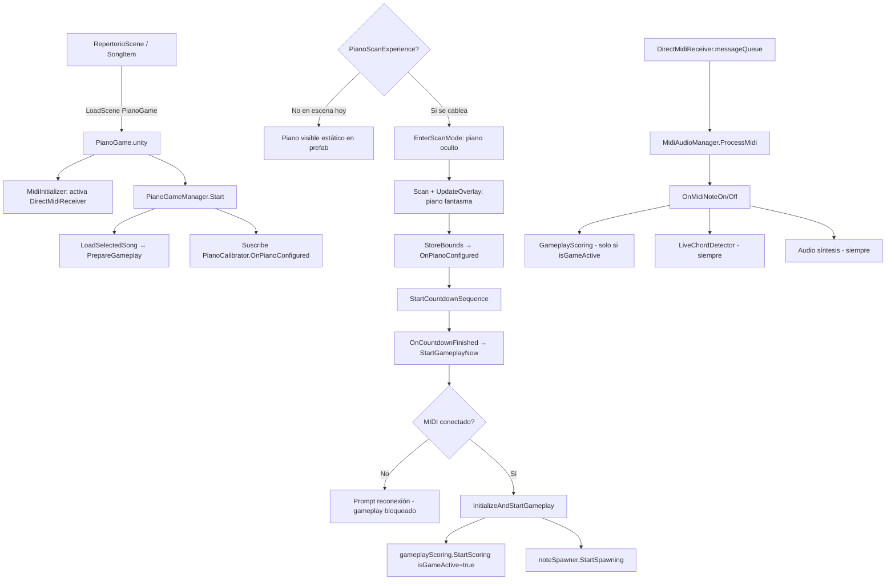

<!-- Generated by SpecStory, Markdown v2.1.0 -->

# 2026-08-18 23:17:26Z

<!-- Cursor IDE Session 36a9a5e0-9e66-46ad-af06-df0c9b3e9529 (2026-08-18 23:17:26Z) -->

_**User**_

Explora a fondo la entrada MIDI y gameplay de piano en C:\Users\vic-s\Desktop\etheriavr_metaquest3. Requisito: aunque no haya MIDI, el piano virtual debe visualizarse; cuando llegan NoteOn/NoteOff MIDI, la tecla virtual correspondiente debe bajar/subir, independientemente de la lógica de canción. Identifica managers, eventos, números de nota, puertos, lifecycle, escenas y cómo conectar una animación visual sin romper gameplay. No edites. Devuelve rutas/métodos exactos, flujo actual, oportunidades de eventos ya existentes y plan mínimo robusto.

---

_**Agent (composer-2.5)**_

<think><details><summary>Thought Process</summary>
Voy a explorar a fondo la entrada MIDI y el gameplay del piano en el proyecto Unity VR. Analizaré managers, eventos, números de nota, puertos, ciclo de vida y escenas. Buscaré métodos exactos para conectar animaciones visuales sin romper la lógica de juego. El objetivo es identificar rutas y flujos actuales junto con oportunidades de eventos existentes.

El piano virtual debe mostrarse siempre. Las notas MIDI deben mover las teclas independientemente de la canción. Solo reportaré hallazgos sin editar. Buscaré ahora en el código los managers y los métodos exactos.
</details></think>

_**Agent (composer-2.5)**_

Explorando a fondo la entrada MIDI y el gameplay de piano: buscaré managers, eventos, puertos y el flujo de visualización virtual.


_**Agent (composer-2.5)**_

<tool-use data-tool-type="unknown" data-tool-name="update_current_step"><details>
<summary>Tool use: **update_current_step**</summary>
An unknown error occurred
</details></tool-use>

_**Agent (composer-2.5)**_

<tool-use data-tool-type="search" data-tool-name="glob_file_search"><details>
<summary>Tool use: **glob_file_search** • Searched codebase "" • **53** results in **1** directory</summary>

Directory: **`C:\Users\vic-s\Desktop\etheriavr_metaquest3\Assets\Scripts`** (53 files)

| File |
|------|
| `../Assets\Scripts\PianoMode\VR\PianoVirtualizer.cs` |
| `../Assets\Scripts\PianoMode\VR\Vision\PianoVisionLocator.cs` |
| `../Assets\Scripts\PianoMode\VR\PianoAutoDetector.cs` |
| `../Assets\Scripts\PianoMode\VR\PianoScanExperience.cs` |
| `../Assets\Scripts\PianoMode\VR\Vision\PianoKeyboardStripeDetector.cs` |
| `../Assets\Scripts\PianoMode\VR\Vision\PianoKeyboardLayout.cs.meta` |
| `../Assets\Scripts\PianoMode\VR\PianoScanBounds.cs` |
| `../Assets\Scripts\PianoMode\VR\Vision\PianoKeyboardLayout.cs` |
| `../Assets\Scripts\PianoMode\Managers\PianoGameManager.Gameplay.cs` |
| `../Assets\Scripts\PianoMode\VR\PianoCalibrator.cs` |
| `../Assets\Scripts\PianoMode\Data\PianoSongData.cs` |
| `../Assets\Scripts\PianoMode\UI\PianoPauseMenu.cs` |
| `../Assets\Scripts\PianoMode\Managers\PianoSongLoader.cs` |
| `../Assets\Scripts\PianoMode\Managers\PianoGameManager.cs` |
| `../Assets\Scripts\PianoMode\Gameplay\PianoPublicSystem.cs` |
| `../Assets\Scripts\PianoMode\Gameplay\ControladorAudienciaPiano.cs` |
| `../Assets\Scripts\PianoMode\VR\Vision\PianoVisionLocator.cs.meta` |
| `../Assets\Scripts\PianoMode\VR\PianoScanVfx.cs` |
| `../Assets\Scripts\PianoMode\VR\PianoSurfaceProbe.cs` |
| `../Assets\Scripts\PianoMode\VR\PianoSurfaceProbe.cs.meta` |
| `../Assets\Scripts\PianoMode\VR\PianoScanLog.cs.meta` |
| `../Assets\Scripts\PianoMode\VR\PianoScanLog.cs` |
| `../Assets\Scripts\PianoMode\VR\Vision\PianoCameraCapture.cs` |
| `../Assets\Scripts\PianoMode\VR\PianoScanFlow.cs.meta` |
| `../Assets\Scripts\PianoMode\VR\PianoScanVfx.cs.meta` |
| `../Assets\Scripts\PianoMode\VR\PianoScanFlow.cs` |
| `../Assets\Scripts\PianoMode\Data\PianoMidiParser.cs` |
| `../Assets\Scripts\PianoMode\VR\PianoAutoDetector.cs.meta` |
| `../Assets\Scripts\PianoMode\VR\PianoScanBounds.cs.meta` |
| `../Assets\Scripts\PianoMode\VR\PianoScanExperience.cs.meta` |
| `../Assets\Scripts\PianoMode\VR\PianoVirtualizer.cs.meta` |
| `../Assets\Scripts\PianoMode\VR\Vision\PianoCameraCapture.cs.meta` |
| `../Assets\Scripts\PianoMode\VR\Vision\PianoKeyboardStripeDetector.cs.meta` |
| `../Assets\Scripts\PianoMode\VR\Vision\Onnx\PianoOnnxRuntime.cs.meta` |
| `../Assets\Scripts\PianoMode\Data\PianoMidiParser.cs.meta` |
| `../Assets\Scripts\PianoMode\VR\Vision\Onnx\PianoOnnxRuntime.cs` |
| `../Assets\Scripts\PianoMode\Managers\PianoGameManager.Gameplay.cs.meta` |
| `../Assets\Scripts\PianoMode\Managers\PianoGameManager.MidiGate.cs.meta` |
| `../Assets\Scripts\PianoMode\Managers\PianoGameManager.MidiGate.cs` |
| `../Assets\Scripts\PianoMode.meta` |
| `../Assets\Scripts\PianoMode\Gameplay\PianoAudienceIntensityProfile.cs` |
| `../Assets\Scripts\PianoMode\Data\PianoChordData.cs` |
| `../Assets\Scripts\PianoMode\Data\PianoNoteData.cs` |
| `../Assets\Scripts\PianoMode\VR\PianoCalibrator.cs.meta` |
| `../Assets\Scripts\PianoMode\UI\PianoPauseMenu.cs.meta` |
| `../Assets\Scripts\PianoMode\Managers\PianoGameManager.cs.meta` |
| `../Assets\Scripts\PianoMode\Managers\PianoSongLoader.cs.meta` |
| `../Assets\Scripts\PianoMode\Gameplay\PianoPublicSystem.cs.meta` |
| `../Assets\Scripts\PianoMode\Gameplay\PianoAudienceIntensityProfile.cs.meta` |
| `../Assets\Scripts\PianoMode\Gameplay\ControladorAudienciaPiano.cs.meta` |
| `../Assets\Scripts\PianoMode\Data\PianoSongData.cs.meta` |
| `../Assets\Scripts\PianoMode\Data\PianoNoteData.cs.meta` |
| `../Assets\Scripts\PianoMode\Data\PianoChordData.cs.meta` |
</details></tool-use>

_**Agent (composer-2.5)**_

<tool-use data-tool-type="search" data-tool-name="glob_file_search"><details>
<summary>Tool use: **glob_file_search** • Searched codebase "" • **19** results in **1** directory</summary>

Directory: **`C:\Users\vic-s\Desktop\etheriavr_metaquest3\Assets\Scripts`** (19 files)

| File |
|------|
| `../Assets\Scripts\PianoMode\Audio\MidiAudioManager.cs` |
| `../Assets\Scripts\Core\Midi\MidiStatusWidgetController.Ui.cs` |
| `../Assets\Scripts\Core\Midi\MIDIStatusReceiver.cs` |
| `../Assets\Scripts\Core\Midi\MIDIConnectionManager.cs` |
| `../Assets\Scripts\Core\Midi\DirectMidiReceiver.cs` |
| `../Assets\Scripts\PianoMode\Data\PianoMidiParser.cs` |
| `../Assets\Scripts\PianoMode\Data\PianoMidiParser.cs.meta` |
| `../Assets\Scripts\PianoMode\Managers\PianoGameManager.MidiGate.cs.meta` |
| `../Assets\Scripts\Core\Midi\MidiStatusWidgetController.Ui.cs.meta` |
| `../Assets\Scripts\Core\Midi\MidiStatusWidgetController.cs` |
| `../Assets\Scripts\Core\Midi\MidiInitializer.cs` |
| `../Assets\Scripts\PianoMode\Managers\PianoGameManager.MidiGate.cs` |
| `../Assets\Scripts\Core\Midi.meta` |
| `../Assets\Scripts\Core\Midi\MidiInitializer.cs.meta` |
| `../Assets\Scripts\PianoMode\Audio\MidiAudioManager.cs.meta` |
| `../Assets\Scripts\Core\Midi\MidiStatusWidgetController.cs.meta` |
| `../Assets\Scripts\Core\Midi\MIDIStatusReceiver.cs.meta` |
| `../Assets\Scripts\Core\Midi\MIDIConnectionManager.cs.meta` |
| `../Assets\Scripts\Core\Midi\DirectMidiReceiver.cs.meta` |
</details></tool-use>

_**Agent (composer-2.5)**_

<tool-use data-tool-type="unknown" data-tool-name="ripgrep_raw_search"><details>
<summary>Tool use: **ripgrep_raw_search**</summary>

Parameters:

```json
{
  "caseInsensitive": false,
  "outputMode": "files_with_matches",
  "path": "C:\\Users\\vic-s\\Desktop\\etheriavr_metaquest3\\Assets\\Scripts",
  "pattern": "NoteOn|NoteOff|MIDI|Midi"
}
```
Additional data:

```json
{
  "isPruned": true,
  "outputMode": "files_with_matches",
  "path": "C:\\Users\\vic-s\\Desktop\\etheriavr_metaquest3\\Assets\\Scripts",
  "pattern": "NoteOn|NoteOff|MIDI|Midi",
  "topFiles": [
    {
      "matchCount": 1,
      "uri": "Assets\\Scripts\\CantoMode\\Tessitura\\TessituraManager.cs"
    },
    {
      "matchCount": 1,
      "uri": "Assets\\Scripts\\Core\\UI\\Login.cs"
    },
    {
      "matchCount": 1,
      "uri": "Assets\\Scripts\\Core\\Session\\UserSession.cs"
    },
    {
      "matchCount": 1,
      "uri": "Assets\\Scripts\\PianoMode\\VR\\Vision\\PianoKeyboardLayout.cs"
    },
    {
      "matchCount": 1,
      "uri": "Assets\\Scripts\\PianoMode\\Managers\\PianoGameManager.Gameplay.cs"
    },
    {
      "matchCount": 1,
      "uri": "Assets\\Scripts\\PianoMode\\Data\\PianoSongData.cs"
    },
    {
      "matchCount": 1,
      "uri": "Assets\\Scripts\\PianoMode\\UI\\ProgressDisplay.cs"
    },
    {
      "matchCount": 1,
      "uri": "Assets\\Scripts\\PianoMode\\Managers\\PianoGameManager.cs"
    },
    {
      "matchCount": 1,
      "uri": "Assets\\Scripts\\PianoMode\\Gameplay\\PianoPublicSystem.cs"
    },
    {
      "matchCount": 1,
      "uri": "Assets\\Scripts\\PianoMode\\Gameplay\\NoteSpawner.cs"
    },
    {
      "matchCount": 1,
      "uri": "Assets\\Scripts\\PianoMode\\Gameplay\\MusicNote.cs"
    },
    {
      "matchCount": 1,
      "uri": "Assets\\Scripts\\PianoMode\\Gameplay\\HarmonyEngine.cs"
    },
    {
      "matchCount": 1,
      "uri": "Assets\\Scripts\\PianoMode\\Gameplay\\GameplayScoring.cs"
    },
    {
      "matchCount": 1,
      "uri": "Assets\\Scripts\\PianoMode\\Gameplay\\GameplayScoring.Input.cs"
    },
    {
      "matchCount": 1,
      "uri": "Assets\\Scripts\\PianoMode\\Gameplay\\GameplayScoring.Feedback.cs"
    },
    {
      "matchCount": 1,
      "uri": "Assets\\Scripts\\PianoMode\\Gameplay\\GameplayScoring.Evaluation.cs"
    },
    {
      "matchCount": 1,
      "uri": "Assets\\Scripts\\PianoMode\\Gameplay\\GameplayScoring.Diagnostics.cs"
    },
    {
      "matchCount": 1,
      "uri": "Assets\\Scripts\\PianoMode\\Audio\\MidiAudioManager.cs"
    },
    {
      "matchCount": 1,
      "uri": "Assets\\Scripts\\Core\\Networking\\UDPReceiver.cs"
    },
    {
      "matchCount": 1,
      "uri": "Assets\\Scripts\\Core\\Midi\\MidiStatusWidgetController.Ui.cs"
    }
  ],
  "totalFiles": 38,
  "totalMatches": 38
}
```
Status: **completed**

</details></tool-use>

_**Agent (composer-2.5)**_

<tool-use data-tool-type="unknown" data-tool-name="ripgrep_raw_search"><details>
<summary>Tool use: **ripgrep_raw_search**</summary>

Parameters:

```json
{
  "caseInsensitive": true,
  "outputMode": "files_with_matches",
  "path": "C:\\Users\\vic-s\\Desktop\\etheriavr_metaquest3\\Assets\\Scripts",
  "pattern": "virtual.*piano|VirtualKey|KeyPress|PressKey|key.*down|key.*up"
}
```
Additional data:

```json
{
  "isPruned": true,
  "outputMode": "files_with_matches",
  "path": "C:\\Users\\vic-s\\Desktop\\etheriavr_metaquest3\\Assets\\Scripts",
  "pattern": "virtual.*piano|VirtualKey|KeyPress|PressKey|key.*down|key.*up",
  "topFiles": [
    {
      "matchCount": 1,
      "uri": "Assets/Scripts/PianoMode/Gameplay/PianoAudienceIntensityProfile.cs"
    },
    {
      "matchCount": 1,
      "uri": "Assets/Scripts/PianoMode/VR/PianoVirtualizer.cs"
    },
    {
      "matchCount": 1,
      "uri": "Assets/Scripts/PianoMode/VR/PianoScanExperience.cs"
    }
  ],
  "totalFiles": 3,
  "totalMatches": 3
}
```
Status: **completed**

</details></tool-use>

_**Agent (composer-2.5)**_

<think><details><summary>Thought Process</summary>
Voy a leer los archivos clave en paralelo para entender el flujo completo: core MIDI, PianoGameManager, PianoVirtualizer, LiveChordDetector y GameplayScoring.
</details></think>

_**Agent (composer-2.5)**_

<tool-use data-tool-type="read" data-tool-name="read_file_v2"><details>
<summary>Tool use: **read_file_v2** • Read file: C:\Users\vic-s\Desktop\etheriavr_metaquest3\Assets\Scripts\Core\Midi\DirectMidiReceiver.cs</summary>

</details></tool-use>

_**Agent (composer-2.5)**_

<tool-use data-tool-type="read" data-tool-name="read_file_v2"><details>
<summary>Tool use: **read_file_v2** • Read file: C:\Users\vic-s\Desktop\etheriavr_metaquest3\Assets\Scripts\Core\Midi\MIDIConnectionManager.cs</summary>

</details></tool-use>

_**Agent (composer-2.5)**_

<tool-use data-tool-type="read" data-tool-name="read_file_v2"><details>
<summary>Tool use: **read_file_v2** • Read file: C:\Users\vic-s\Desktop\etheriavr_metaquest3\Assets\Scripts\PianoMode\Managers\PianoGameManager.cs</summary>

</details></tool-use>

_**Agent (composer-2.5)**_

<tool-use data-tool-type="read" data-tool-name="read_file_v2"><details>
<summary>Tool use: **read_file_v2** • Read file: C:\Users\vic-s\Desktop\etheriavr_metaquest3\Assets\Scripts\PianoMode\Managers\PianoGameManager.MidiGate.cs</summary>

</details></tool-use>

_**Agent (composer-2.5)**_

<tool-use data-tool-type="read" data-tool-name="read_file_v2"><details>
<summary>Tool use: **read_file_v2** • Read file: C:\Users\vic-s\Desktop\etheriavr_metaquest3\Assets\Scripts\PianoMode\VR\PianoVirtualizer.cs</summary>

</details></tool-use>

_**Agent (composer-2.5)**_

<think><details><summary>Thought Process</summary>
Revisaré los archivos clave del proyecto para mapear el flujo de gameplay y la conexión entre el piano virtual y los eventos MIDI. Los archivos a examinar son PianoGameManager.Gameplay.cs, MidiAudioManager, GameplayScoring, PianoCalibrator, MidiInitializer, LiveChordDetector, PianoKeyboardLayout y las escenas correspondientes.
</details></think>

_**Agent (composer-2.5)**_

<tool-use data-tool-type="read" data-tool-name="read_file_v2"><details>
<summary>Tool use: **read_file_v2** • Read file: C:\Users\vic-s\Desktop\etheriavr_metaquest3\Assets\Scripts\PianoMode\Managers\PianoGameManager.Gameplay.cs</summary>

</details></tool-use>

_**Agent (composer-2.5)**_

<tool-use data-tool-type="read" data-tool-name="read_file_v2"><details>
<summary>Tool use: **read_file_v2** • Read file: C:\Users\vic-s\Desktop\etheriavr_metaquest3\Assets\Scripts\PianoMode\Audio\MidiAudioManager.cs</summary>

</details></tool-use>

_**Agent (composer-2.5)**_

<tool-use data-tool-type="read" data-tool-name="read_file_v2"><details>
<summary>Tool use: **read_file_v2** • Read file: C:\Users\vic-s\Desktop\etheriavr_metaquest3\Assets\Scripts\PianoMode\Gameplay\GameplayScoring.Input.cs</summary>

</details></tool-use>

_**Agent (composer-2.5)**_

<tool-use data-tool-type="read" data-tool-name="read_file_v2"><details>
<summary>Tool use: **read_file_v2** • Read file: C:\Users\vic-s\Desktop\etheriavr_metaquest3\Assets\Scripts\Core\Midi\MidiInitializer.cs</summary>

</details></tool-use>

_**Agent (composer-2.5)**_

<tool-use data-tool-type="read" data-tool-name="read_file_v2"><details>
<summary>Tool use: **read_file_v2** • Read file: C:\Users\vic-s\Desktop\etheriavr_metaquest3\Assets\Scripts\PianoMode\VR\PianoCalibrator.cs</summary>

</details></tool-use>

_**Agent (composer-2.5)**_

<think><details><summary>Thought Process</summary>
Continúo explorando los componentes clave del proyecto. Revisaré GameplayScoring, PianoScanExperience, LiveChordDetector, PianoKeyboardLayout, las escenas y los guías de entrada para mapear la suscripción MIDI y la animación visual del piano.
</details></think>

_**Agent (composer-2.5)**_

<tool-use data-tool-type="read" data-tool-name="read_file_v2"><details>
<summary>Tool use: **read_file_v2** • Read file: C:\Users\vic-s\Desktop\etheriavr_metaquest3\Assets\Scripts\PianoMode\Gameplay\GameplayScoring.cs</summary>

</details></tool-use>

_**Agent (composer-2.5)**_

<tool-use data-tool-type="unknown" data-tool-name="ripgrep_raw_search"><details>
<summary>Tool use: **ripgrep_raw_search**</summary>

Parameters:

```json
{
  "caseInsensitive": false,
  "path": "C:\\Users\\vic-s\\Desktop\\etheriavr_metaquest3\\Assets\\Scripts",
  "pattern": "OnMidiNoteOn|OnMidiNoteOff|ShowLiveInputGuide|HideLiveInputGuide|ProcessMidiNote"
}
```
Additional data:

```json
{
  "isPruned": true,
  "outputMode": "content",
  "path": "C:\\Users\\vic-s\\Desktop\\etheriavr_metaquest3\\Assets\\Scripts",
  "pattern": "OnMidiNoteOn|OnMidiNoteOff|ShowLiveInputGuide|HideLiveInputGuide|ProcessMidiNote",
  "topFiles": [
    {
      "matchCount": 4,
      "uri": "Assets/Scripts/PianoMode/Gameplay/LiveChordDetector.cs"
    },
    {
      "matchCount": 4,
      "uri": "Assets/Scripts/PianoMode/Audio/MidiAudioManager.cs"
    },
    {
      "matchCount": 4,
      "uri": "Assets/Scripts/PianoMode/Gameplay/GameplayScoring.Input.cs"
    },
    {
      "matchCount": 4,
      "uri": "Assets/Scripts/PianoMode/Gameplay/GameplayScoring.cs"
    },
    {
      "matchCount": 2,
      "uri": "Assets/Scripts/PianoMode/Gameplay/GameplayScoring.Feedback.cs"
    }
  ],
  "totalFiles": 5,
  "totalMatches": 18
}
```
Status: **completed**

</details></tool-use>

_**Agent (composer-2.5)**_

<tool-use data-tool-type="unknown" data-tool-name="ripgrep_raw_search"><details>
<summary>Tool use: **ripgrep_raw_search**</summary>

Parameters:

```json
{
  "caseInsensitive": false,
  "glob": "*.unity",
  "outputMode": "files_with_matches",
  "pattern": "PianoGame|PianoScene|RepertorioScene|SingGame"
}
```
Additional data:

```json
{
  "isPruned": true,
  "outputMode": "files_with_matches",
  "pattern": "PianoGame|PianoScene|RepertorioScene|SingGame",
  "topFiles": [
    {
      "matchCount": 1,
      "uri": "Assets/Scenes/PianoGame.unity"
    },
    {
      "matchCount": 1,
      "uri": "Assets/Scenes/HomeScene.unity"
    },
    {
      "matchCount": 1,
      "uri": "Assets/Scenes/ConfigScene.unity"
    },
    {
      "matchCount": 1,
      "uri": "Assets/Scenes/RepertorioScene.unity"
    }
  ],
  "totalFiles": 4,
  "totalMatches": 4
}
```
Status: **completed**

</details></tool-use>

_**Agent (composer-2.5)**_

<tool-use data-tool-type="search" data-tool-name="glob_file_search"><details>
<summary>Tool use: **glob_file_search** • Searched codebase "" • **13** results in **1** directory</summary>

Directory: **`C:\Users\vic-s\Desktop\etheriavr_metaquest3\Assets`** (13 files)

| File |
|------|
| `../Assets/Plugins/DryWetMidi/strongnamekey.snk.meta` |
| `../Assets/Plugins/DryWetMidi/Core/Events/Meta/KeySignatureEvent.cs` |
| `../Assets/Editor/PianoModeConcepts/piano-design-02-dual-staff-keys.png` |
| `../Assets/Scripts/PianoMode/VR/Vision/PianoKeyboardLayout.cs` |
| `../Assets/Scripts/PianoMode/VR/Vision/PianoKeyboardStripeDetector.cs.meta` |
| `../Assets/Scripts/PianoMode/VR/Vision/PianoKeyboardStripeDetector.cs` |
| `../Assets/Editor/PianoModeConcepts/piano-design-01-key-halo.png` |
| `../Assets/Scripts/PianoMode/VR/Vision/PianoKeyboardLayout.cs.meta` |
| `../Assets/Editor/PianoModeConcepts/piano-design-01-key-halo.png.meta` |
| `../Assets/Plugins/DryWetMidi/Core/Events/Meta/KeySignatureEvent.cs.meta` |
| `../Assets/Editor/PianoModeConcepts/piano-design-02-dual-staff-keys.png.meta` |
| `../Assets/Editor/PianoModeConcepts/piano-design-05-neon-key-edge.png` |
| `../Assets/Editor/PianoModeConcepts/piano-design-05-neon-key-edge.png.meta` |
</details></tool-use>

_**Agent (composer-2.5)**_

<tool-use data-tool-type="unknown" data-tool-name="ripgrep_raw_search"><details>
<summary>Tool use: **ripgrep_raw_search**</summary>

Parameters:

```json
{
  "caseInsensitive": true,
  "path": "C:\\Users\\vic-s\\Desktop\\etheriavr_metaquest3\\Assets\\Scripts\\PianoMode",
  "pattern": "Press|Depress|KeyAnim|key.*anim|AnimateKey"
}
```
Additional data:

```json
{
  "isPruned": true,
  "outputMode": "content",
  "path": "C:\\Users\\vic-s\\Desktop\\etheriavr_metaquest3\\Assets\\Scripts\\PianoMode",
  "pattern": "Press|Depress|KeyAnim|key.*anim|AnimateKey",
  "topFiles": [
    {
      "matchCount": 6,
      "uri": "Assets/Scripts/PianoMode/UI/ResultsPanel.cs"
    },
    {
      "matchCount": 20,
      "uri": "Assets/Scripts/PianoMode/Gameplay/GameplayScoring.Input.cs"
    },
    {
      "matchCount": 1,
      "uri": "Assets/Scripts/PianoMode/VR/PianoScanExperience.cs"
    },
    {
      "matchCount": 2,
      "uri": "Assets/Scripts/PianoMode/Gameplay/GameplayScoring.Diagnostics.cs"
    },
    {
      "matchCount": 8,
      "uri": "Assets/Scripts/PianoMode/Gameplay/GameplayScoring.cs"
    },
    {
      "matchCount": 5,
      "uri": "Assets/Scripts/PianoMode/Audio/MidiAudioManager.cs"
    },
    {
      "matchCount": 7,
      "uri": "Assets/Scripts/PianoMode/UI/PianoPauseMenu.cs"
    },
    {
      "matchCount": 8,
      "uri": "Assets/Scripts/PianoMode/Gameplay/LiveChordDetector.cs"
    },
    {
      "matchCount": 2,
      "uri": "Assets/Scripts/PianoMode/Gameplay/MusicNote.cs"
    }
  ],
  "totalFiles": 9,
  "totalMatches": 59
}
```
Status: **completed**

</details></tool-use>

_**Agent (composer-2.5)**_

<think><details><summary>Thought Process</summary>
Revisaré los archivos restantes del flujo de gameplay: GameplayScoring, PianoScanExperience, PianoScanFlow, LiveChordDetector, PianoKeyboardLayout, el puente MIDI de Android y las referencias de escenas. Busco entender la suscripción de eventos, el ciclo de vida de los managers y cómo conectar la animación visual sin afectar la lógica de canciones.
</details></think>

_**Agent (composer-2.5)**_

<tool-use data-tool-type="read" data-tool-name="read_file_v2"><details>
<summary>Tool use: **read_file_v2** • Read file: C:\Users\vic-s\Desktop\etheriavr_metaquest3\Assets\Scripts\PianoMode\Gameplay\GameplayScoring.cs</summary>

</details></tool-use>

_**Agent (composer-2.5)**_

<tool-use data-tool-type="read" data-tool-name="read_file_v2"><details>
<summary>Tool use: **read_file_v2** • Read file: C:\Users\vic-s\Desktop\etheriavr_metaquest3\Assets\Scripts\PianoMode\Gameplay\GameplayScoring.Feedback.cs</summary>

</details></tool-use>

_**Agent (composer-2.5)**_

<tool-use data-tool-type="read" data-tool-name="read_file_v2"><details>
<summary>Tool use: **read_file_v2** • Read file: C:\Users\vic-s\Desktop\etheriavr_metaquest3\Assets\Scripts\PianoMode\VR\PianoScanExperience.cs</summary>

</details></tool-use>

_**Agent (composer-2.5)**_

<tool-use data-tool-type="read" data-tool-name="read_file_v2"><details>
<summary>Tool use: **read_file_v2** • Read file: C:\Users\vic-s\Desktop\etheriavr_metaquest3\Assets\Scripts\PianoMode\Gameplay\LiveChordDetector.cs</summary>

</details></tool-use>

_**Agent (composer-2.5)**_

<tool-use data-tool-type="read" data-tool-name="read_file_v2"><details>
<summary>Tool use: **read_file_v2** • Read file: C:\Users\vic-s\Desktop\etheriavr_metaquest3\Assets\Scripts\PianoMode\VR\Vision\PianoKeyboardLayout.cs</summary>

</details></tool-use>

_**Agent (composer-2.5)**_

<think><details><summary>Thought Process</summary>
El primer paso es localizar el puente MIDI de Android en Java.

Se identificaron los componentes clave del piano: PianoNoteData, PianoScanFlow, MusicNote y MIDIStatusReceiver. Se busca la jerarquía 3D de las teclas y la estructura de escenas en PianoGame. Se verificará si ya existe una animación visual para el piano.
</details></think>

_**Agent (composer-2.5)**_

<tool-use data-tool-type="search" data-tool-name="glob_file_search"><details>
<summary>Tool use: **glob_file_search** • Searched codebase "" • **2** results in **1** directory</summary>

Directory: **`C:\Users\vic-s\Desktop\etheriavr_metaquest3`** (2 files)

| File |
|------|
| `../Assets/Plugins/Android/src/com/etheriavr/midi/MidiInputBridge.java.meta` |
| `../Assets/Plugins/Android/src/com/etheriavr/midi/MidiInputBridge.java` |
</details></tool-use>

_**Agent (composer-2.5)**_

<tool-use data-tool-type="read" data-tool-name="read_file_v2"><details>
<summary>Tool use: **read_file_v2** • Read file: C:\Users\vic-s\Desktop\etheriavr_metaquest3\Assets\Scripts\PianoMode\Data\PianoNoteData.cs</summary>

</details></tool-use>

_**Agent (composer-2.5)**_

<tool-use data-tool-type="read" data-tool-name="read_file_v2"><details>
<summary>Tool use: **read_file_v2** • Read file: C:\Users\vic-s\Desktop\etheriavr_metaquest3\Assets\Scripts\PianoMode\VR\PianoScanFlow.cs</summary>

</details></tool-use>

_**Agent (composer-2.5)**_

<tool-use data-tool-type="unknown" data-tool-name="ripgrep_raw_search"><details>
<summary>Tool use: **ripgrep_raw_search**</summary>

Parameters:

```json
{
  "caseInsensitive": false,
  "path": "C:\\Users\\vic-s\\Desktop\\etheriavr_metaquest3\\Assets\\Scenes\\PianoGame.unity",
  "pattern": "PianoGameManager|PianoVirtualizer|PianoScanExperience|MidiAudioManager|DirectMidiReceiver|LiveChordDetector"
}
```
Additional data:

```json
{
  "isPruned": true,
  "outputMode": "content",
  "path": "C:\\Users\\vic-s\\Desktop\\etheriavr_metaquest3\\Assets\\Scenes\\PianoGame.unity",
  "pattern": "PianoGameManager|PianoVirtualizer|PianoScanExperience|MidiAudioManager|DirectMidiReceiver|LiveChordDetector",
  "topFiles": [
    {
      "matchCount": 3,
      "uri": "Assets\\Scenes\\PianoGame.unity"
    }
  ],
  "totalFiles": 1,
  "totalMatches": 3
}
```
Status: **completed**

</details></tool-use>

_**Agent (composer-2.5)**_

<tool-use data-tool-type="unknown" data-tool-name="ripgrep_raw_search"><details>
<summary>Tool use: **ripgrep_raw_search**</summary>

Parameters:

```json
{
  "caseInsensitive": false,
  "glob": "*.prefab",
  "path": "C:\\Users\\vic-s\\Desktop\\etheriavr_metaquest3\\Assets",
  "pattern": "Keys|WhiteKey|BlackKey|Key_"
}
```
Additional data:

```json
{
  "isPruned": true,
  "outputMode": "content",
  "path": "C:\\Users\\vic-s\\Desktop\\etheriavr_metaquest3\\Assets",
  "pattern": "Keys|WhiteKey|BlackKey|Key_",
  "topFiles": [
    {
      "matchCount": 3,
      "uri": "Assets/Piano/piano.prefab"
    },
    {
      "matchCount": 37,
      "uri": "Assets/JMO Assets/Cartoon FX Remaster/CFXR Prefabs/Impacts/CFXR Hit D 3D (Yellow).prefab"
    }
  ],
  "totalFiles": 2,
  "totalMatches": 2000
}
```
Status: **completed**

</details></tool-use>

_**Agent (composer-2.5)**_

<think><details><summary>Thought Process</summary>
Revisaré la estructura del piano.prefab para identificar los nombres de las teclas. Analizaré MidiInputBridge.java, GameNoteData y MusicNote. Buscaré componentes adicionales en la escena PianoGame.
</details></think>

_**Agent (composer-2.5)**_

<tool-use data-tool-type="read" data-tool-name="read_file_v2"><details>
<summary>Tool use: **read_file_v2** • Read file: C:\Users\vic-s\Desktop\etheriavr_metaquest3\Assets\Plugins\Android\src\com\etheriavr\midi\MidiInputBridge.java</summary>

</details></tool-use>

_**Agent (composer-2.5)**_

<tool-use data-tool-type="unknown" data-tool-name="ripgrep_raw_search"><details>
<summary>Tool use: **ripgrep_raw_search**</summary>

Parameters:

```json
{
  "caseInsensitive": false,
  "path": "C:\\Users\\vic-s\\Desktop\\etheriavr_metaquest3\\Assets\\Piano\\piano.prefab",
  "pattern": "m_Name:"
}
```
Additional data:

```json
{
  "isPruned": true,
  "outputMode": "content",
  "path": "C:\\Users\\vic-s\\Desktop\\etheriavr_metaquest3\\Assets\\Piano\\piano.prefab",
  "pattern": "m_Name:",
  "topFiles": [
    {
      "matchCount": 29,
      "uri": "Assets\\Piano\\piano.prefab"
    }
  ],
  "totalFiles": 1,
  "totalMatches": 29
}
```
Status: **completed**

</details></tool-use>

_**Agent (composer-2.5)**_

<tool-use data-tool-type="unknown" data-tool-name="ripgrep_raw_search"><details>
<summary>Tool use: **ripgrep_raw_search**</summary>

Parameters:

```json
{
  "caseInsensitive": false,
  "path": "C:\\Users\\vic-s\\Desktop\\etheriavr_metaquest3\\Assets\\Scenes\\PianoGame.unity",
  "pattern": "PianoCalibrator|PianoScan|PianoVirtualizer|LiveChord|GameplayScoring|NoteSpawner"
}
```
Additional data:

```json
{
  "isPruned": true,
  "outputMode": "content",
  "path": "C:\\Users\\vic-s\\Desktop\\etheriavr_metaquest3\\Assets\\Scenes\\PianoGame.unity",
  "pattern": "PianoCalibrator|PianoScan|PianoVirtualizer|LiveChord|GameplayScoring|NoteSpawner",
  "topFiles": [
    {
      "matchCount": 4,
      "uri": "Assets\\Scenes\\PianoGame.unity"
    }
  ],
  "totalFiles": 1,
  "totalMatches": 4
}
```
Status: **completed**

</details></tool-use>

_**Agent (composer-2.5)**_

<tool-use data-tool-type="unknown" data-tool-name="ripgrep_raw_search"><details>
<summary>Tool use: **ripgrep_raw_search**</summary>

Parameters:

```json
{
  "caseInsensitive": false,
  "path": "C:\\Users\\vic-s\\Desktop\\etheriavr_metaquest3\\Assets\\Scripts",
  "pattern": "GetMidiNote|GameNoteData"
}
```
Additional data:

```json
{
  "isPruned": true,
  "outputMode": "content",
  "path": "C:\\Users\\vic-s\\Desktop\\etheriavr_metaquest3\\Assets\\Scripts",
  "pattern": "GetMidiNote|GameNoteData",
  "topFiles": [
    {
      "matchCount": 9,
      "uri": "Assets/Scripts/PianoMode/Gameplay/GameplayScoring.cs"
    },
    {
      "matchCount": 2,
      "uri": "Assets/Scripts/PianoMode/Gameplay/GameplayScoring.Diagnostics.cs"
    },
    {
      "matchCount": 2,
      "uri": "Assets/Scripts/PianoMode/Managers/PianoSongLoader.cs"
    },
    {
      "matchCount": 5,
      "uri": "Assets/Scripts/PianoMode/Gameplay/PianoPublicSystem.cs"
    },
    {
      "matchCount": 4,
      "uri": "Assets/Scripts/PianoMode/UI/ProgressDisplay.cs"
    },
    {
      "matchCount": 5,
      "uri": "Assets/Scripts/PianoMode/Gameplay/GameplayScoring.Feedback.cs"
    },
    {
      "matchCount": 3,
      "uri": "Assets/Scripts/PianoMode/Gameplay/GameplayScoring.Input.cs"
    },
    {
      "matchCount": 3,
      "uri": "Assets/Scripts/PianoMode/Gameplay/GameplayScoring.Evaluation.cs"
    },
    {
      "matchCount": 6,
      "uri": "Assets/Scripts/PianoMode/Data/PianoMidiParser.cs"
    },
    {
      "matchCount": 2,
      "uri": "Assets/Scripts/PianoMode/Gameplay/NoteSpawner.cs"
    },
    {
      "matchCount": 4,
      "uri": "Assets/Scripts/PianoMode/Data/PianoSongData.cs"
    }
  ],
  "totalFiles": 11,
  "totalMatches": 45
}
```
Status: **completed**

</details></tool-use>

_**Agent (composer-2.5)**_

<tool-use data-tool-type="read" data-tool-name="read_file_v2"><details>
<summary>Tool use: **read_file_v2** • Read file: C:\Users\vic-s\Desktop\etheriavr_metaquest3\Assets\Scripts\PianoMode\Gameplay\MusicNote.cs</summary>

</details></tool-use>

_**Agent (composer-2.5)**_

<think><details><summary>Thought Process</summary>
Revisaré la estructura de teclas del prefab de piano, sus nombres y números MIDI. Analizaré PianoScanBounds, el flujo de escena y MIDIStatusReceiver. Verificaré si el piano se oculta sin señal MIDI.
</details></think>

_**Agent (composer-2.5)**_

<tool-use data-tool-type="read" data-tool-name="read_file_v2"><details>
<summary>Tool use: **read_file_v2** • Read file: C:\Users\vic-s\Desktop\etheriavr_metaquest3\Assets\Piano\piano.prefab</summary>

</details></tool-use>

_**Agent (composer-2.5)**_

<tool-use data-tool-type="read" data-tool-name="read_file_v2"><details>
<summary>Tool use: **read_file_v2** • Read file: C:\Users\vic-s\Desktop\etheriavr_metaquest3\Assets\Scripts\PianoMode\VR\PianoScanBounds.cs</summary>

</details></tool-use>

_**Agent (composer-2.5)**_

<tool-use data-tool-type="read" data-tool-name="read_file_v2"><details>
<summary>Tool use: **read_file_v2** • Read file: C:\Users\vic-s\Desktop\etheriavr_metaquest3\Assets\Scripts\Core\Midi\MIDIStatusReceiver.cs</summary>

</details></tool-use>

_**Agent (composer-2.5)**_

<tool-use data-tool-type="unknown" data-tool-name="ripgrep_raw_search"><details>
<summary>Tool use: **ripgrep_raw_search**</summary>

Parameters:

```json
{
  "caseInsensitive": false,
  "path": "C:\\Users\\vic-s\\Desktop\\etheriavr_metaquest3\\Assets\\Scenes\\PianoGame.unity",
  "pattern": "PianoScanExperience|PianoVirtualizer|PianoAutoDetector|LiveChord"
}
```
Additional data:

```json
{
  "isPruned": true,
  "outputMode": "content",
  "path": "C:\\Users\\vic-s\\Desktop\\etheriavr_metaquest3\\Assets\\Scenes\\PianoGame.unity",
  "pattern": "PianoScanExperience|PianoVirtualizer|PianoAutoDetector|LiveChord",
  "topFiles": [],
  "totalFiles": 0,
  "totalMatches": 0
}
```
Status: **completed**

</details></tool-use>

_**Agent (composer-2.5)**_

<tool-use data-tool-type="unknown" data-tool-name="ripgrep_raw_search"><details>
<summary>Tool use: **ripgrep_raw_search**</summary>

Parameters:

```json
{
  "caseInsensitive": false,
  "path": "C:\\Users\\vic-s\\Desktop\\etheriavr_metaquest3\\Assets\\Scripts",
  "pattern": "LoadScene.*Piano|PianoGame"
}
```
Additional data:

```json
{
  "isPruned": true,
  "outputMode": "content",
  "path": "C:\\Users\\vic-s\\Desktop\\etheriavr_metaquest3\\Assets\\Scripts",
  "pattern": "LoadScene.*Piano|PianoGame",
  "topFiles": [
    {
      "matchCount": 2,
      "uri": "Assets/Scripts/PianoMode/Gameplay/LiveChordDetector.cs"
    },
    {
      "matchCount": 1,
      "uri": "Assets/Scripts/Core/UI/SongItem.cs"
    },
    {
      "matchCount": 2,
      "uri": "Assets/Scripts/PianoMode/UI/ProgressDisplay.cs"
    },
    {
      "matchCount": 7,
      "uri": "Assets/Scripts/Core/VR/QuestXRInteractionController.cs"
    },
    {
      "matchCount": 3,
      "uri": "Assets/Scripts/PianoMode/Gameplay/GameplayScoring.cs"
    },
    {
      "matchCount": 12,
      "uri": "Assets/Scripts/PianoMode/Managers/PianoGameManager.cs"
    },
    {
      "matchCount": 1,
      "uri": "Assets/Scripts/PianoMode/Gameplay/NoteSpawner.cs"
    },
    {
      "matchCount": 4,
      "uri": "Assets/Scripts/PianoMode/UI/PianoPauseMenu.cs"
    },
    {
      "matchCount": 16,
      "uri": "Assets/Scripts/PianoMode/Managers/PianoGameManager.Gameplay.cs"
    },
    {
      "matchCount": 1,
      "uri": "Assets/Scripts/PianoMode/VR/Vision/PianoVisionLocator.cs"
    },
    {
      "matchCount": 2,
      "uri": "Assets/Scripts/PianoMode/UI/ResultsPanel.cs"
    },
    {
      "matchCount": 1,
      "uri": "Assets/Scripts/PianoMode/Gameplay/MusicNote.cs"
    },
    {
      "matchCount": 1,
      "uri": "Assets/Scripts/PianoMode/Managers/PianoGameManager.MidiGate.cs"
    }
  ],
  "totalFiles": 13,
  "totalMatches": 53
}
```
Status: **completed**

</details></tool-use>

_**Agent (composer-2.5)**_

<think><details><summary>Thought Process</summary>
El prefab del piano agrupa las teclas blancas y negras como objetos mesh únicos, no como transformaciones individuales. Esto impide controlar cada tecla por separado para la animación visual.

Para la animación se evalúan tres vías: animación por huesos, desplazamiento de shader o dividir el mesh. Se buscará PianoScanExpre y se revisará si componentes se añaden en tiempo de ejecución. También se analizarán StaffRenderer, ReportVisualFeedbackLatency y PianoSongData.
</details></think>

_**Agent (composer-2.5)**_

<tool-use data-tool-type="unknown" data-tool-name="ripgrep_raw_search"><details>
<summary>Tool use: **ripgrep_raw_search**</summary>

Parameters:

```json
{
  "caseInsensitive": false,
  "path": "C:\\Users\\vic-s\\Desktop\\etheriavr_metaquest3\\Assets\\Scenes\\PianoGame.unity",
  "pattern": "PianoScan|PianoVirtual|ScanExperience|AutoDetector"
}
```
Additional data:

```json
{
  "isPruned": true,
  "outputMode": "content",
  "path": "C:\\Users\\vic-s\\Desktop\\etheriavr_metaquest3\\Assets\\Scenes\\PianoGame.unity",
  "pattern": "PianoScan|PianoVirtual|ScanExperience|AutoDetector",
  "topFiles": [],
  "totalFiles": 0,
  "totalMatches": 0
}
```
Status: **completed**

</details></tool-use>

_**Agent (composer-2.5)**_

<tool-use data-tool-type="unknown" data-tool-name="ripgrep_raw_search"><details>
<summary>Tool use: **ripgrep_raw_search**</summary>

Parameters:

```json
{
  "caseInsensitive": false,
  "path": "C:\\Users\\vic-s\\Desktop\\etheriavr_metaquest3\\Assets\\Scripts",
  "pattern": "ReportVisualFeedbackLatency|ShowLiveInputIndicator"
}
```
Additional data:

```json
{
  "isPruned": true,
  "outputMode": "content",
  "path": "C:\\Users\\vic-s\\Desktop\\etheriavr_metaquest3\\Assets\\Scripts",
  "pattern": "ReportVisualFeedbackLatency|ShowLiveInputIndicator",
  "topFiles": [
    {
      "matchCount": 1,
      "uri": "Assets/Scripts/PianoMode/Rendering/StaffRenderer.LiveInputGuide.cs"
    },
    {
      "matchCount": 1,
      "uri": "Assets/Scripts/PianoMode/Gameplay/GameplayScoring.Feedback.cs"
    },
    {
      "matchCount": 1,
      "uri": "Assets/Scripts/PianoMode/Gameplay/MusicNote.cs"
    },
    {
      "matchCount": 1,
      "uri": "Assets/Scripts/PianoMode/Gameplay/GameplayScoring.Input.cs"
    }
  ],
  "totalFiles": 4,
  "totalMatches": 4
}
```
Status: **completed**

</details></tool-use>

_**Agent (composer-2.5)**_

<tool-use data-tool-type="read" data-tool-name="read_file_v2"><details>
<summary>Tool use: **read_file_v2** • Read file: C:\Users\vic-s\Desktop\etheriavr_metaquest3\Assets\Scripts\PianoMode\Data\PianoSongData.cs</summary>

</details></tool-use>

_**Agent (composer-2.5)**_

<tool-use data-tool-type="read" data-tool-name="read_file_v2"><details>
<summary>Tool use: **read_file_v2** • Read file: C:\Users\vic-s\Desktop\etheriavr_metaquest3\Assets\Scripts\PianoMode\Rendering\StaffRenderer.cs</summary>

</details></tool-use>

_**Agent (composer-2.5)**_

<tool-use data-tool-type="unknown" data-tool-name="ripgrep_raw_search"><details>
<summary>Tool use: **ripgrep_raw_search**</summary>

Parameters:

```json
{
  "caseInsensitive": false,
  "path": "C:\\Users\\vic-s\\Desktop\\etheriavr_metaquest3\\Assets\\Scenes\\PianoGame.unity",
  "pattern": "piano\\.prefab|PianoCalibrator|m_Name: Piano"
}
```
Additional data:

```json
{
  "isPruned": true,
  "outputMode": "content",
  "path": "C:\\Users\\vic-s\\Desktop\\etheriavr_metaquest3\\Assets\\Scenes\\PianoGame.unity",
  "pattern": "piano\\.prefab|PianoCalibrator|m_Name: Piano",
  "topFiles": [
    {
      "matchCount": 6,
      "uri": "Assets\\Scenes\\PianoGame.unity"
    }
  ],
  "totalFiles": 1,
  "totalMatches": 6
}
```
Status: **completed**

</details></tool-use>

_**Agent (composer-2.5)**_

<think><details><summary>Thought Process</summary>
PianoScanExperience no aparece en el archivo PianoGame.unity. Probablemente se añade en tiempo de ejecución mediante PianoCalibrator u otro objeto.

Ampliaré la búsqueda para localizar managers, eventos y flujos de gameplay.
</details></think>

_**Agent (composer-2.5)**_

<tool-use data-tool-type="unknown" data-tool-name="ripgrep_raw_search"><details>
<summary>Tool use: **ripgrep_raw_search**</summary>

Parameters:

```json
{
  "caseInsensitive": false,
  "glob": "*.{unity,prefab,cs}",
  "path": "C:\\Users\\vic-s\\Desktop\\etheriavr_metaquest3",
  "pattern": "PianoScanExperience|PianoVirtualizer"
}
```
Additional data:

```json
{
  "isPruned": true,
  "outputMode": "content",
  "path": "C:\\Users\\vic-s\\Desktop\\etheriavr_metaquest3",
  "pattern": "PianoScanExperience|PianoVirtualizer",
  "topFiles": [
    {
      "matchCount": 2,
      "uri": "Assets/Scripts/PianoMode/VR/PianoVirtualizer.cs"
    },
    {
      "matchCount": 3,
      "uri": "Assets/Scripts/PianoMode/VR/PianoScanExperience.cs"
    }
  ],
  "totalFiles": 2,
  "totalMatches": 5
}
```
Status: **completed**

</details></tool-use>

_**Agent (composer-2.5)**_

<tool-use data-tool-type="read" data-tool-name="read_file_v2"><details>
<summary>Tool use: **read_file_v2** • Read file: C:\Users\vic-s\Desktop\etheriavr_metaquest3\Assets\Scripts\PianoMode\Rendering\StaffRenderer.LiveInputGuide.cs</summary>

</details></tool-use>

_**Agent (composer-2.5)**_

<tool-use data-tool-type="read" data-tool-name="read_file_v2"><details>
<summary>Tool use: **read_file_v2** • Read file: C:\Users\vic-s\Desktop\etheriavr_metaquest3\Assets\Scripts\PianoMode\VR\PianoAutoDetector.cs</summary>

</details></tool-use>

_**Agent (composer-2.5)**_

<tool-use data-tool-type="unknown" data-tool-name="ripgrep_raw_search"><details>
<summary>Tool use: **ripgrep_raw_search**</summary>

Parameters:

```json
{
  "caseInsensitive": false,
  "path": "C:\\Users\\vic-s\\Desktop\\etheriavr_metaquest3\\Assets\\Scripts\\PianoMode",
  "pattern": "midiOnlyPlayback|IsMidiReady|waitingForMidi"
}
```
Additional data:

```json
{
  "isPruned": true,
  "outputMode": "content",
  "path": "C:\\Users\\vic-s\\Desktop\\etheriavr_metaquest3\\Assets\\Scripts\\PianoMode",
  "pattern": "midiOnlyPlayback|IsMidiReady|waitingForMidi",
  "topFiles": [
    {
      "matchCount": 1,
      "uri": "Assets/Scripts/PianoMode/Data/PianoSongData.cs"
    },
    {
      "matchCount": 1,
      "uri": "Assets/Scripts/PianoMode/Managers/PianoGameManager.cs"
    },
    {
      "matchCount": 1,
      "uri": "Assets/Scripts/PianoMode/Data/PianoMidiParser.cs"
    },
    {
      "matchCount": 9,
      "uri": "Assets/Scripts/PianoMode/Managers/PianoGameManager.MidiGate.cs"
    },
    {
      "matchCount": 6,
      "uri": "Assets/Scripts/PianoMode/Managers/PianoGameManager.Gameplay.cs"
    }
  ],
  "totalFiles": 5,
  "totalMatches": 18
}
```
Status: **completed**

</details></tool-use>

_**Agent (composer-2.5)**_

<think><details><summary>Thought Process</summary>
PianoScanExperience no está en el archivo de escena. Solo existe en los scripts.

Revisaré los componentes adjuntos del GameObject PianoCalibrator en la escena para verificar si PianoScanExperience se añade en tiempo de ejecución o falta en el archivo de escena.
</details></think>

_**Agent (composer-2.5)**_

<tool-use data-tool-type="read" data-tool-name="read_file_v2"><details>
<summary>Tool use: **read_file_v2** • Read file: C:\Users\vic-s\Desktop\etheriavr_metaquest3\Assets\Scenes\PianoGame.unity</summary>

</details></tool-use>

_**Agent (composer-2.5)**_

<tool-use data-tool-type="unknown" data-tool-name="ripgrep_raw_search"><details>
<summary>Tool use: **ripgrep_raw_search**</summary>

Parameters:

```json
{
  "caseInsensitive": false,
  "path": "C:\\Users\\vic-s\\Desktop\\etheriavr_metaquest3\\Assets\\Scenes\\PianoGame.unity",
  "pattern": "84036b017b309dc4091a0ae0f36c87e2|piano\\.prefab"
}
```
Additional data:

```json
{
  "isPruned": true,
  "outputMode": "content",
  "path": "C:\\Users\\vic-s\\Desktop\\etheriavr_metaquest3\\Assets\\Scenes\\PianoGame.unity",
  "pattern": "84036b017b309dc4091a0ae0f36c87e2|piano\\.prefab",
  "topFiles": [],
  "totalFiles": 0,
  "totalMatches": 0
}
```
Status: **completed**

</details></tool-use>

_**Agent (composer-2.5)**_

<tool-use data-tool-type="unknown" data-tool-name="ripgrep_raw_search"><details>
<summary>Tool use: **ripgrep_raw_search**</summary>

Parameters:

```json
{
  "caseInsensitive": false,
  "path": "C:\\Users\\vic-s\\Desktop\\etheriavr_metaquest3\\Assets\\Scenes\\PianoGame.unity",
  "pattern": "m_Name: Environment|m_Name: Piano\\b"
}
```
Additional data:

```json
{
  "isPruned": true,
  "outputMode": "content",
  "path": "C:\\Users\\vic-s\\Desktop\\etheriavr_metaquest3\\Assets\\Scenes\\PianoGame.unity",
  "pattern": "m_Name: Environment|m_Name: Piano\\b",
  "topFiles": [
    {
      "matchCount": 1,
      "uri": "Assets\\Scenes\\PianoGame.unity"
    }
  ],
  "totalFiles": 1,
  "totalMatches": 1
}
```
Status: **completed**

</details></tool-use>

_**Agent (composer-2.5)**_

<tool-use data-tool-type="read" data-tool-name="read_file_v2"><details>
<summary>Tool use: **read_file_v2** • Read file: C:\Users\vic-s\Desktop\etheriavr_metaquest3\Assets\Scripts\PianoMode\Gameplay\NoteSpawner.cs</summary>

</details></tool-use>

_**Agent (composer-2.5)**_

<think><details><summary>Thought Process</summary>
Busco el GUID del prefab del piano y dónde se instancia en la escena.
</details></think>

_**Agent (composer-2.5)**_

<tool-use data-tool-type="read" data-tool-name="read_file_v2"><details>
<summary>Tool use: **read_file_v2** • Read file: C:\Users\vic-s\Desktop\etheriavr_metaquest3\Assets\Piano\piano.prefab.meta</summary>

</details></tool-use>

_**Agent (composer-2.5)**_

<tool-use data-tool-type="unknown" data-tool-name="ripgrep_raw_search"><details>
<summary>Tool use: **ripgrep_raw_search**</summary>

Parameters:

```json
{
  "caseInsensitive": false,
  "path": "C:\\Users\\vic-s\\Desktop\\etheriavr_metaquest3\\Assets\\Scenes\\PianoGame.unity",
  "pattern": "98ea15acd4af41342a8cb5f6a5b31077|f6336ac4ac8b4d34bc5072418cdc62a0"
}
```
Additional data:

```json
{
  "isPruned": true,
  "outputMode": "content",
  "path": "C:\\Users\\vic-s\\Desktop\\etheriavr_metaquest3\\Assets\\Scenes\\PianoGame.unity",
  "pattern": "98ea15acd4af41342a8cb5f6a5b31077|f6336ac4ac8b4d34bc5072418cdc62a0",
  "topFiles": [
    {
      "matchCount": 71,
      "uri": "Assets\\Scenes\\PianoGame.unity"
    }
  ],
  "totalFiles": 1,
  "totalMatches": 71
}
```
Status: **completed**

</details></tool-use>

_**Agent (composer-2.5)**_

<tool-use data-tool-type="unknown" data-tool-name="ripgrep_raw_search"><details>
<summary>Tool use: **ripgrep_raw_search**</summary>

Parameters:

```json
{
  "caseInsensitive": false,
  "path": "C:\\Users\\vic-s\\Desktop\\etheriavr_metaquest3\\Assets\\Scenes\\PianoGame.unity",
  "pattern": "LiveChord|GameplayScoring|DirectMidi"
}
```
Additional data:

```json
{
  "isPruned": true,
  "outputMode": "content",
  "path": "C:\\Users\\vic-s\\Desktop\\etheriavr_metaquest3\\Assets\\Scenes\\PianoGame.unity",
  "pattern": "LiveChord|GameplayScoring|DirectMidi",
  "topFiles": [],
  "totalFiles": 0,
  "totalMatches": 0
}
```
Status: **completed**

</details></tool-use>

_**Agent (composer-2.5)**_

<tool-use data-tool-type="read" data-tool-name="read_file_v2"><details>
<summary>Tool use: **read_file_v2** • Read file: C:\Users\vic-s\Desktop\etheriavr_metaquest3\Assets\Scripts\Core\Midi\MidiStatusWidgetController.cs</summary>

</details></tool-use>

_**Agent (composer-2.5)**_

<think><details><summary>Thought Process</summary>
PianoScanExperience y PianoVirtualizer no están conectados en PianoGame. Esto explica por qué el piano virtual no se visualiza ni responde a notas MIDI.

El prefab del piano ya está en la escena y attached al objeto PianoCalibrator. Falta verificar si PianoVirtualizer está en ese mismo GameObject o si debe agregarse manualmente. También se investiga el comportamiento runtime del prefab f6336ac4.
</details></think>

_**Agent (composer-2.5)**_

<tool-use data-tool-type="search" data-tool-name="glob_file_search"><details>
<summary>Tool use: **glob_file_search** • Searched codebase "" • **232** results in **1** directory</summary>

Directory: **`C:\Users\vic-s\Desktop\etheriavr_metaquest3\Assets`** (232 files)

| File |
|------|
| `../Assets/JMO Assets/Cartoon FX Remaster/CFXR Prefabs/Explosions/CFXR3 Fire Explosion B.prefab.meta` |
| `../Assets/MRTemplateAssets/Prefabs/UI/Dropdown.prefab.meta` |
| `../Assets/JMO Assets/Cartoon FX Remaster/CFXR Prefabs/Fire/CFXR Fire Breath.prefab.meta` |
| `../Assets/Samples/XR Interaction Toolkit/3.3.0/Hands Interaction Demo/HandsDemoSceneAssets/Prefabs/Arrow.prefab.meta` |
| `../Assets/MRTemplateAssets/Prefabs/TotemKinetic.prefab.meta` |
| `../Assets/JMO Assets/Cartoon FX Remaster/CFXR Prefabs/Eerie/CFXR2 Skull Head Alt.prefab.meta` |
| `../Assets/Samples/XR Interaction Toolkit/3.3.0/Starter Assets/Prefabs/Interactors/Poke Interactor.prefab.meta` |
| `../Assets/JMO Assets/Cartoon FX Remaster/CFXR Prefabs/Sword Trails/Plain/CFXR4 Sword Trail PLAIN (360 Spiral).prefab.meta` |
| `../Assets/Samples/XR Interaction Toolkit/3.3.0/Hands Interaction Demo/HandsDemoSceneAssets/Prefabs/Cylinder.prefab.meta` |
| `../Assets/Samples/XR Interaction Toolkit/3.3.0/Hands Interaction Demo/Prefabs/HandPokeInteractorAffordances.prefab.meta` |
| `../Assets/Samples/XR Interaction Toolkit/3.3.0/Starter Assets/DemoSceneAssets/Prefabs/UI/Interactive Controls.prefab.meta` |
| `../Assets/Samples/XR Interaction Toolkit/3.3.0/Starter Assets/Prefabs/Affordances/HighlightInteractionAffordance.prefab.meta` |
| `../Assets/MRTemplateAssets/Prefabs/UI/Toggle_MRTemplate.prefab.meta` |
| `../Assets/JMO Assets/Cartoon FX Remaster/CFXR Prefabs/Sword Trails/Ice/Fire/CFXR4 Sword Trail FIRE (360 Thin Spiral).prefab.meta` |
| `../Assets/Samples/XR Interaction Toolkit/3.3.0/Starter Assets/DemoSceneAssets/Prefabs/Interactables/Cube.prefab.meta` |
| `../Assets/Samples/XR Interaction Toolkit/3.3.0/AR Starter Assets/ARDemoSceneAssets/Prefabs/Cube.prefab.meta` |
| `../Assets/Samples/XR Interaction Toolkit/3.3.0/Hands Interaction Demo/HandsDemoSceneAssets/Prefabs/DiscController.prefab.meta` |
| `../Assets/Samples/XR Interaction Toolkit/3.3.0/Starter Assets/Prefabs/Interactors/Direct Interactor.prefab.meta` |
| `../Assets/JMO Assets/Cartoon FX Remaster/CFXR Prefabs/Texts/CFXR _SLASH_.prefab.meta` |
| `../Assets/Samples/XR Interaction Toolkit/3.3.0/Starter Assets/DemoSceneAssets/Prefabs/UI/Icon Button.prefab.meta` |
| `../Assets/HotelRoom-Mavi3D/Prefabs/URP/Carpet.prefab.meta` |
| `../Assets/JMO Assets/Cartoon FX Remaster/CFXR Prefabs/Eerie/CFXR2 Souls Escape.prefab.meta` |
| `../Assets/VRTemplateAssets/Prefabs/Affordance/Affordance Callout.prefab.meta` |
| `../Assets/JMO Assets/Cartoon FX Remaster/CFXR Prefabs/Explosions/CFXR4 Firework HDR Shoot Single (Random Color).prefab.meta` |
| `../Assets/JMO Assets/Cartoon FX Remaster/CFXR Prefabs/Electric/CFXR3 Hit Electric C (Air).prefab.meta` |
| `../Assets/JMO Assets/Cartoon FX Remaster/CFXR Prefabs/Misc/CFXR2 Poison Cloud.prefab.meta` |
| `../Assets/Samples/XR Interaction Toolkit/3.3.0/Starter Assets/Prefabs/Interactors/Gaze Interactor.prefab.meta` |
| `../Assets/MRTemplateAssets/Prefabs/AR/ARAnchor.prefab.meta` |
| `../Assets/Samples/XR Interaction Toolkit/3.3.0/Hands Interaction Demo/HandsDemoSceneAssets/Prefabs/TableHandle.prefab.meta` |
| `../Assets/Samples/XR Interaction Toolkit/3.3.0/Starter Assets/DemoSceneAssets/Prefabs/UI/TextButton.prefab.meta` |
| `../Assets/MRTemplateAssets/Prefabs/AR/ARBoundingBox.prefab.meta` |
| `../Assets/JMO Assets/Cartoon FX Remaster/CFXR Prefabs/Liquids/CFXR Water Splash (Smaller).prefab.meta` |
| `../Assets/Samples/XR Interaction Toolkit/3.3.0/AR Starter Assets/ARDemoSceneAssets/Prefabs/Wedge.prefab.meta` |
| `../Assets/JMO Assets/Cartoon FX Remaster/CFXR Prefabs/Eerie/CFXR2 WW Enemy Explosion.prefab.meta` |
| `../Assets/Prefabs/Cube.prefab.meta` |
| `../Assets/JMO Assets/Cartoon FX Remaster/CFXR Prefabs/Texts/CFXR2 _WHAM_ 3.prefab.meta` |
| `../Assets/Samples/XR Interaction Toolkit/3.3.0/Starter Assets/DemoSceneAssets/Prefabs/Interactables/Confetti.prefab.meta` |
| `../Assets/JMO Assets/Cartoon FX Remaster/CFXR Prefabs/Liquids/CFXR4 Bubbles Breath Underwater Loop.prefab.meta` |
| `../Assets/JMO Assets/Cartoon FX Remaster/CFXR Prefabs/Fire/CFXR4 Sun.prefab.meta` |
| `../Assets/Samples/XR Interaction Toolkit/3.3.0/Starter Assets/Prefabs/XR Origin (XR Rig).prefab.meta` |
| `../Assets/Samples/XR Interaction Toolkit/3.3.0/Starter Assets/Prefabs/Teleport/Climb Teleport Arrow.prefab.meta` |
| `../Assets/JMO Assets/Cartoon FX Remaster/CFXR Prefabs/Impacts/CFXR2 Ground Hit.prefab.meta` |
| `../Assets/JMO Assets/Cartoon FX Remaster/CFXR Prefabs/Electric/CFXR2 Sparks Rain.prefab.meta` |
| `../Assets/JMO Assets/Cartoon FX Remaster/CFXR Prefabs/Fire/CFXR Fire.prefab.meta` |
| `../Assets/Samples/XR Interaction Toolkit/3.3.0/Starter Assets/Prefabs/Teleport/Blocking Teleport Reticle.prefab.meta` |
| `../Assets/Samples/XR Interaction Toolkit/3.3.0/AR Starter Assets/ARDemoSceneAssets/Prefabs/Debug Cube.prefab.meta` |
| `../Assets/Samples/XR Interaction Toolkit/3.3.0/Starter Assets/DemoSceneAssets/Prefabs/Teleport/Teleport Area.prefab.meta` |
| `../Assets/JMO Assets/Cartoon FX Remaster/CFXR Prefabs/Light/CFXR3 Hit Light B (Air).prefab.meta` |
| `../Assets/Samples/XR Interaction Toolkit/3.3.0/Hands Interaction Demo/Prefabs/HandMenuRig.prefab.meta` |
| `../Assets/Samples/XR Interaction Toolkit/3.3.0/Starter Assets/DemoSceneAssets/Prefabs/Teleport/Snap Teleport Anchor.prefab.meta` |
| `../Assets/JMO Assets/Cartoon FX Remaster/CFXR Prefabs/Impacts/CFXR Hit D 3D (Yellow).prefab.meta` |
| `../Assets/VRTemplateAssets/Prefabs/Setup/Affordance Callouts Left.prefab.meta` |
| `../Assets/DenysAlmaral/CityPeople/Prefabs/city/casual_Female_G.prefab.meta` |
| `../Assets/Samples/XR Interaction Toolkit/3.3.0/Starter Assets/TunnelingVignette/TunnelingVignette.prefab.meta` |
| `../Assets/Samples/XR Interaction Toolkit/3.3.0/Starter Assets/Prefabs/Controllers/XR Controller Right.prefab.meta` |
| `../Assets/Gwangju_3D asset/26_GwangjuTheater/Prefabs/GwangjuTheater_Interior.prefab.meta` |
| `../Assets/JMO Assets/Cartoon FX Remaster/CFXR Prefabs/Misc/CFXR Flash.prefab.meta` |
| `../Assets/JMO Assets/Cartoon FX Remaster/CFXR Prefabs/Texts/CFXR3 _WOW_.prefab.meta` |
| `../Assets/MRTemplateAssets/Prefabs/UI/ListItemSlider.prefab.meta` |
| `../Assets/MRTemplateAssets/Prefabs/TotemFloatingTorus.prefab.meta` |
| `../Assets/MRTemplateAssets/Prefabs/UI/IndexTipPrefab.prefab.meta` |
| `../Assets/JMO Assets/Cartoon FX Remaster/CFXR Prefabs/Sword Trails/Plain/CFXR4 Sword Trail PLAIN (360 Thin Spiral).prefab.meta` |
| `../Assets/Samples/XR Interaction Toolkit/3.3.0/AR Starter Assets/Prefabs/Screen Space Ray Interactor.prefab.meta` |
| `../Assets/Samples/XR Interaction Toolkit/3.3.0/Hands Interaction Demo/Prefabs/XR Origin Hands (XR Rig).prefab.meta` |
| `../Assets/HotelRoom-Mavi3D/Prefabs/URP/TVremote.prefab.meta` |
| `../Assets/Samples/XR Interaction Toolkit/3.3.0/Starter Assets/DemoSceneAssets/Prefabs/Far Grab Samples.prefab.meta` |
| `../Assets/Samples/XR Interaction Toolkit/3.3.0/Starter Assets/Prefabs/Interactors/Left_NearFarInteractor.prefab.meta` |
| `../Assets/Piano/piano.prefab.meta` |
| `../Assets/Samples/XR Interaction Toolkit/3.3.0/Hands Interaction Demo/HandsDemoSceneAssets/Prefabs/UI/ButtonHandMenu.prefab.meta` |
| `../Assets/JMO Assets/Cartoon FX Remaster/CFXR Prefabs/Texts/CFXR _BOING_.prefab.meta` |
| `../Assets/MRTemplateAssets/Prefabs/UI/ListItemButton.prefab.meta` |
| `../Assets/Samples/XR Interaction Toolkit/3.3.0/Hands Interaction Demo/HandsDemoSceneAssets/Prefabs/PokeButton.prefab.meta` |
| `../Assets/HotelRoom-Mavi3D/Prefabs/URP/RoomStructure.prefab.meta` |
| `../Assets/JMO Assets/Cartoon FX Remaster/CFXR Prefabs/Magic Misc/CFXR4 Falling Stars.prefab.meta` |
| `../Assets/Samples/XR Interaction Toolkit/3.3.0/Hands Interaction Demo/HandsDemoSceneAssets/Prefabs/SimpleSocketShape.prefab.meta` |
| `../Assets/MRTemplateAssets/Prefabs/TestObject.prefab.meta` |
| `../Assets/JMO Assets/Cartoon FX Remaster/CFXR Prefabs/Misc/CFXR3 Ambient Glows.prefab.meta` |
| `../Assets/Samples/XR Interaction Toolkit/3.3.0/AR Starter Assets/Prefabs/XR Origin (AR Rig).prefab.meta` |
| `../Assets/JMO Assets/Cartoon FX Remaster/CFXR Prefabs/Nature/CFXR3 Shield Leaves A (Lit).prefab.meta` |
| `../Assets/VRTemplateAssets/Prefabs/TarjetaCancion.prefab.meta` |
| `../Assets/HotelRoom-Mavi3D/Prefabs/URP/Furniture.prefab.meta` |
| `../Assets/JMO Assets/Cartoon FX Remaster/CFXR Prefabs/Explosions/CFXR Explosion Smoke 2 Solo (HDR).prefab.meta` |
| `../Assets/Samples/XR Interaction Toolkit/3.3.0/Starter Assets/DemoSceneAssets/Prefabs/Climb/Climbing Wall.prefab.meta` |
| `../Assets/Prefabs/SessionItemPrefab.prefab.meta` |
| `../Assets/HotelRoom-Mavi3D/Prefabs/URP/Windows.prefab.meta` |
| `../Assets/DenysAlmaral/CityPeople/Prefabs/little_kids/little_boy_B.prefab.meta` |
| `../Assets/Samples/XR Hands/1.7.1/HandVisualizer/Prefabs/Right Hand Tracking.prefab.meta` |
| `../Assets/MRTemplateAssets/Prefabs/UI/SpatialPanelScroll.prefab.meta` |
| `../Assets/MRTemplateAssets/Prefabs/Permissions Manager Variant.prefab.meta` |
| `../Assets/HotelRoom-Mavi3D/Prefabs/URP/Curtains.prefab.meta` |
| `../Assets/JMO Assets/Cartoon FX Remaster/CFXR Prefabs/Misc/CFXR3 Hit Misc F Smoke.prefab.meta` |
| `../Assets/MRTemplateAssets/Prefabs/UI/ListItemToggle.prefab.meta` |
| `../Assets/Samples/XR Interaction Toolkit/3.3.0/Starter Assets/Prefabs/Permissions Manager.prefab.meta` |
| `../Assets/Samples/XR Interaction Toolkit/3.3.0/Starter Assets/DemoSceneAssets/Prefabs/Poke Interactions Sample.prefab.meta` |
| `../Assets/Samples/XR Interaction Toolkit/3.3.0/Starter Assets/DemoSceneAssets/Prefabs/Climb/Single Floor Ladder.prefab.meta` |
| `../Assets/HotelRoom-Mavi3D/Prefabs/URP/FlowerPot.prefab.meta` |
| `../Assets/MRTemplateAssets/Prefabs/AR/SmallTriAxes.prefab.meta` |
| `../Assets/JMO Assets/Cartoon FX Remaster/CFXR Prefabs/Explosions/CFXR2 WW Explosion.prefab.meta` |
| `../Assets/HotelRoom-Mavi3D/Prefabs/URP/Table02.prefab.meta` |
| `../Assets/MRTemplateAssets/Prefabs/UI/ListItemBooleanToggle.prefab.meta` |
| `../Assets/Samples/XR Hands/1.7.1/HandVisualizer/Prefabs/VelocityPrefab.prefab.meta` |
| `../Assets/Samples/XR Interaction Toolkit/3.3.0/Hands Interaction Demo/Prefabs/HandInteractorAffordances.prefab.meta` |
| `../Assets/Samples/XR Interaction Toolkit/3.3.0/Starter Assets/DemoSceneAssets/Prefabs/Climb/Climb Sample.prefab.meta` |
| `../Assets/JMO Assets/Cartoon FX Remaster/CFXR Prefabs/Explosions/CFXR Explosion 1.prefab.meta` |
| `../Assets/Samples/XR Interaction Toolkit/3.3.0/AR Starter Assets/Prefabs/AR Feathered Plane.prefab.meta` |
| `../Assets/Samples/XR Interaction Toolkit/3.3.0/Starter Assets/Prefabs/Interactors/Ray Interactor.prefab.meta` |
| `../Assets/VRTemplateAssets/Prefabs/Setup/Hands Permissions Manager.prefab.meta` |
| `../Assets/JMO Assets/Cartoon FX Remaster/CFXR Prefabs/Texts/CFXR2 _CURSED_.prefab.meta` |
| `../Assets/Samples/XR Interaction Toolkit/3.3.0/Starter Assets/DemoSceneAssets/Prefabs/UI/ModalSingleButton.prefab.meta` |
| `../Assets/DenysAlmaral/CityPeople/Prefabs/disabilities/prostheticLeg_girl.prefab.meta` |
| `../Assets/Samples/XR Interaction Toolkit/3.3.0/Starter Assets/DemoSceneAssets/Prefabs/UI/Dropdown.prefab.meta` |
| `../Assets/Samples/XR Interaction Toolkit/3.3.0/Starter Assets/DemoSceneAssets/Prefabs/Interactables/Torus.prefab.meta` |
| `../Assets/Prefabs/FilaHorizontal.prefab.meta` |
| `../Assets/JMO Assets/Cartoon FX Remaster/CFXR Prefabs/Misc/CFXR2 Broken Heart.prefab.meta` |
| `../Assets/Samples/XR Interaction Toolkit/3.3.0/Starter Assets/DemoSceneAssets/Prefabs/Interactables/Pot.prefab.meta` |
| `../Assets/JMO Assets/Cartoon FX Remaster/CFXR Prefabs/Nature/CFXR3 Hit Leaves A (Lit).prefab.meta` |
| `../Assets/Samples/XR Interaction Toolkit/3.3.0/Starter Assets/DemoSceneAssets/Prefabs/UI/Text Toggle.prefab.meta` |
| `../Assets/Samples/XR Interaction Toolkit/3.3.0/AR Starter Assets/ARDemoSceneAssets/Prefabs/Cylinder.prefab.meta` |
| `../Assets/MRTemplateAssets/Prefabs/AR/ARPlane.prefab.meta` |
| `../Assets/DenysAlmaral/CityPeople/Prefabs/downtown/casual_Male_K.prefab.meta` |
| `../Assets/JMO Assets/Cartoon FX Remaster/CFXR Prefabs/Sword Trails/Ice/CFXR4 Sword Trail ICE (360 Thin Spiral).prefab.meta` |
| `../Assets/Samples/XR Interaction Toolkit/3.3.0/Hands Interaction Demo/HandsDemoSceneAssets/Prefabs/Cube.prefab.meta` |
| `../Assets/HotelRoom-Mavi3D/Prefabs/URP/Door.prefab.meta` |
| `../Assets/JMO Assets/Cartoon FX Remaster/CFXR Prefabs/Misc/CFXR2 Cartoon Fight (Loop).prefab.meta` |
| `../Assets/JMO Assets/Cartoon FX Remaster/CFXR Prefabs/Texts/CFXR4 _FROZEN_.prefab.meta` |
| `../Assets/Samples/XR Interaction Toolkit/3.3.0/Starter Assets/DemoSceneAssets/Prefabs/Climb/Multi Floor Ladder.prefab.meta` |
| `../Assets/Gwangju_3D asset/26_GwangjuTheater/Prefabs/Gt_Ground.prefab.meta` |
| `../Assets/Samples/XR Interaction Toolkit/3.3.0/Starter Assets/DemoSceneAssets/Prefabs/InteractionAffordance.prefab.meta` |
| `../Assets/JMO Assets/Cartoon FX Remaster/CFXR Prefabs/Liquids/CFXR2 Blood (Directional).prefab.meta` |
| `../Assets/Samples/XR Interaction Toolkit/3.3.0/Starter Assets/DemoSceneAssets/Prefabs/Gaze Interactables.prefab.meta` |
| `../Assets/JMO Assets/Cartoon FX Remaster/CFXR Prefabs/Misc/CFXR Magic Poof.prefab.meta` |
| `../Assets/JMO Assets/Cartoon FX Remaster/CFXR Prefabs/Magic Misc/CFXR4 Bouncing Glows Bubble (Blue Purple).prefab.meta` |
| `../Assets/MRTemplateAssets/Prefabs/TutorialPlayer/TutorialPlayer.prefab.meta` |
| `../Assets/HotelRoom-Mavi3D/Prefabs/URP/Stereo.prefab.meta` |
| `../Assets/Samples/XR Interaction Toolkit/3.3.0/Starter Assets/DemoSceneAssets/Prefabs/Interactables Sample.prefab.meta` |
| `../Assets/JMO Assets/Cartoon FX Remaster/CFXR Prefabs/Nature/CFXR4 Rain Splashes.prefab.meta` |
| `../Assets/Prefabs/NotePrefab.prefab.meta` |
| `../Assets/JMO Assets/Cartoon FX Remaster/CFXR Prefabs/Light/CFXR3 LightGlow A (Loop).prefab.meta` |
| `../Assets/VRTemplateAssets/Prefabs/Setup/Affordance Callouts Right.prefab.meta` |
| `../Assets/Samples/XR Interaction Toolkit/3.3.0/Hands Interaction Demo/HandsDemoSceneAssets/Prefabs/UI/TouchPadButton.prefab.meta` |
| `../Assets/JMO Assets/Cartoon FX Remaster/CFXR Prefabs/Nature/CFXR4 Wind Trails.prefab.meta` |
| `../Assets/MRTemplateAssets/Prefabs/UI/HandMenuSetupVariant_MRTemplate.prefab.meta` |
| `../Assets/JMO Assets/Cartoon FX Remaster/CFXR Prefabs/Misc/CFXR Smoke Source 3D.prefab.meta` |
| `../Assets/Samples/XR Interaction Toolkit/3.3.0/Starter Assets/DemoSceneAssets/Prefabs/Interactables/Blaser-Long.prefab.meta` |
| `../Assets/Samples/XR Interaction Toolkit/3.3.0/Starter Assets/DemoSceneAssets/Prefabs/Climb/ClimbTeleportReticle.prefab.meta` |
| `../Assets/MRTemplateAssets/Prefabs/UI/Tooltip.prefab.meta` |
| `../Assets/Samples/XR Interaction Toolkit/3.3.0/AR Starter Assets/ARDemoSceneAssets/Prefabs/Arch.prefab.meta` |
| `../Assets/JMO Assets/Cartoon FX Remaster/CFXR Prefabs/Texts/CFXR _POW_.prefab.meta` |
| `../Assets/JMO Assets/Cartoon FX Remaster/CFXR Prefabs/Sword Trails/Ice/Fire/CFXR4 Sword Hit FIRE (Cross).prefab.meta` |
| `../Assets/JMO Assets/Cartoon FX Remaster/CFXR Prefabs/Texts/CFXR _BOOM_.prefab.meta` |
| `../Assets/HotelRoom-Mavi3D/Prefabs/URP/Couch02.prefab.meta` |
| `../Assets/MRTemplateAssets/Prefabs/OcclusionPrefabs/TotemFloatingTorus - Occlusion.prefab.meta` |
| `../Assets/Samples/XR Interaction Toolkit/3.3.0/Hands Interaction Demo/Prefabs/LeftHandQuestVisual.prefab.meta` |
| `../Assets/HotelRoom-Mavi3D/Prefabs/URP/Lights.prefab.meta` |
| `../Assets/Samples/XR Interaction Toolkit/3.3.0/Starter Assets/Prefabs/Interactors/Teleport Interactor.prefab.meta` |
| `../Assets/MRTemplateAssets/Prefabs/Controller/LeftController.prefab.meta` |
| `../Assets/Samples/XR Interaction Toolkit/3.3.0/Hands Interaction Demo/HandsDemoSceneAssets/Prefabs/Disc.prefab.meta` |
| `../Assets/Samples/XR Interaction Toolkit/3.3.0/Starter Assets/DemoSceneAssets/Prefabs/UI/MinMaxSlider.prefab.meta` |
| `../Assets/Samples/XR Interaction Toolkit/3.3.0/Starter Assets/DemoSceneAssets/Prefabs/UI/Icon Toggle.prefab.meta` |
| `../Assets/DenysAlmaral/CityPeople/Prefabs/professions/police_Female_A.prefab.meta` |
| `../Assets/JMO Assets/Cartoon FX Remaster/CFXR Prefabs/Sword Trails/Plain/CFXR4 Sword Hit PLAIN (Cross).prefab.meta` |
| `../Assets/MRTemplateAssets/Prefabs/SittingCylinder.prefab.meta` |
| `../Assets/HotelRoom-Mavi3D/Prefabs/URP/TV.prefab.meta` |
| `../Assets/JMO Assets/Cartoon FX Remaster/CFXR Prefabs/Electric/CFXR Electrified 3.prefab.meta` |
| `../Assets/Samples/XR Interaction Toolkit/3.3.0/Starter Assets/DemoSceneAssets/Prefabs/Interactables/Blaser.prefab.meta` |
| `../Assets/Samples/XR Interaction Toolkit/3.3.0/Hands Interaction Demo/HandsDemoSceneAssets/Prefabs/AudioAffordance.prefab.meta` |
| `../Assets/JMO Assets/Cartoon FX Remaster/CFXR Prefabs/Misc/CFXR2 Shiny Item (Loop).prefab.meta` |
| `../Assets/JMO Assets/Cartoon FX Remaster/CFXR Prefabs/Fire/CFXR2 Firewall A.prefab.meta` |
| `../Assets/MRTemplateAssets/Prefabs/Controller/RightController.prefab.meta` |
| `../Assets/Samples/XR Interaction Toolkit/3.3.0/Hands Interaction Demo/Prefabs/LeftHandAndroidXRVisual.prefab.meta` |
| `../Assets/Samples/XR Interaction Toolkit/3.3.0/Starter Assets/DemoSceneAssets/Prefabs/Interactables/Cylinder.prefab.meta` |
| `../Assets/MRTemplateAssets/Prefabs/Blaster/Confetti.prefab.meta` |
| `../Assets/Samples/XR Interaction Toolkit/3.3.0/Hands Interaction Demo/HandsDemoSceneAssets/Prefabs/UI/ScrollViewItem.prefab.meta` |
| `../Assets/Samples/XR Interaction Toolkit/3.3.0/Hands Interaction Demo/Prefabs/PinchPointStabilized.prefab.meta` |
| `../Assets/JMO Assets/Cartoon FX Remaster/CFXR Prefabs/Liquids/CFXR2 Blood Shape Splash.prefab.meta` |
| `../Assets/JMO Assets/Cartoon FX Remaster/CFXR Prefabs/Liquids/CFXR Water Ripples.prefab.meta` |
| `../Assets/Samples/XR Interaction Toolkit/3.3.0/Starter Assets/Prefabs/Affordances/PokePointerAffordance.prefab.meta` |
| `../Assets/Samples/XR Interaction Toolkit/3.3.0/Starter Assets/DemoSceneAssets/Prefabs/Teleport/Teleport Anchor.prefab.meta` |
| `../Assets/JMO Assets/Cartoon FX Remaster/CFXR Prefabs/Explosions/CFXR4 Firework 1 Cyan-Purple (HDR).prefab.meta` |
| `../Assets/Samples/XR Interaction Toolkit/3.3.0/Hands Interaction Demo/Prefabs/InteractionAffordance.prefab.meta` |
| `../Assets/DenysAlmaral/CityPeople/Prefabs/city/casual_Male_G.prefab.meta` |
| `../Assets/MRTemplateAssets/Prefabs/AR/TriAxes.prefab.meta` |
| `../Assets/MRTemplateAssets/Prefabs/SittingCylinderOffset.prefab.meta` |
| `../Assets/MRTemplateAssets/Prefabs/MR Interaction Setup.prefab.meta` |
| `../Assets/Samples/XR Interaction Toolkit/3.3.0/Starter Assets/DemoSceneAssets/Prefabs/Interactables/Push Button.prefab.meta` |
| `../Assets/JMO Assets/Cartoon FX Remaster/CFXR Prefabs/Texts/CFXR4 _POISONED_.prefab.meta` |
| `../Assets/HotelRoom-Mavi3D/Prefabs/Hotel Room URP.prefab.meta` |
| `../Assets/Samples/XR Interaction Toolkit/3.3.0/Starter Assets/DemoSceneAssets/Prefabs/GazeActivationZone.prefab.meta` |
| `../Assets/Samples/XR Interaction Toolkit/3.3.0/Hands Interaction Demo/HandsDemoSceneAssets/Prefabs/UI/ScrollHandMenu.prefab.meta` |
| `../Assets/JMO Assets/Cartoon FX Remaster/CFXR Prefabs/Sword Trails/Ice/CFXR4 Sword Trail ICE (360 Spiral).prefab.meta` |
| `../Assets/MRTemplateAssets/Prefabs/OcclusionPrefabs/TotemKinetic - Occlusion.prefab.meta` |
| `../Assets/Prefabs/SongBox_Template.prefab.meta` |
| `../Assets/HotelRoom-Mavi3D/Prefabs/URP/Couch01.prefab.meta` |
| `../Assets/VRTemplateAssets/Prefabs/Setup/Complete XR Origin Set Up Hands Variant.prefab.meta` |
| `../Assets/Samples/XR Interaction Toolkit/3.3.0/Starter Assets/DemoSceneAssets/Prefabs/UI Sample.prefab.meta` |
| `../Assets/Samples/XR Interaction Toolkit/3.3.0/Starter Assets/DemoSceneAssets/Prefabs/Climb/Ladder.prefab.meta` |
| `../Assets/Samples/XR Interaction Toolkit/3.3.0/Starter Assets/DemoSceneAssets/Prefabs/Interactables/Torus-Cut.prefab.meta` |
| `../Assets/Samples/XR Interaction Toolkit/3.3.0/AR Starter Assets/ARDemoSceneAssets/Prefabs/Pyramid.prefab.meta` |
| `../Assets/MRTemplateAssets/Prefabs/UI/ListItemDropdown.prefab.meta` |
| `../Assets/JMO Assets/Cartoon FX Remaster/CFXR Prefabs/Sword Trails/Ice/CFXR4 Sword Hit ICE (Cross).prefab.meta` |
| `../Assets/HotelRoom-Mavi3D/Prefabs/URP/Table01.prefab.meta` |
| `../Assets/Samples/XR Interaction Toolkit/3.3.0/Starter Assets/Prefabs/Interactors/Right_NearFarInteractor.prefab.meta` |
| `../Assets/MRTemplateAssets/Prefabs/UI/TooltipWorldspace.prefab.meta` |
| `../Assets/Samples/XR Interaction Toolkit/3.3.0/Hands Interaction Demo/HandsDemoSceneAssets/Prefabs/SimpleSocket.prefab.meta` |
| `../Assets/JMO Assets/Cartoon FX Remaster/CFXR Prefabs/Impacts/CFXR Hit A (Red).prefab.meta` |
| `../Assets/MRTemplateAssets/Prefabs/UI/CoachingUI.prefab.meta` |
| `../Assets/JMO Assets/Cartoon FX Remaster/CFXR Prefabs/Fire/CFXR3 Hit Fire B (Air).prefab.meta` |
| `../Assets/HotelRoom-Mavi3D/Prefabs/URP/Frame.prefab.meta` |
| `../Assets/JMO Assets/Cartoon FX Remaster/CFXR Prefabs/Misc/CFXR3 Hit Misc A.prefab.meta` |
| `../Assets/MRTemplateAssets/Prefabs/TotemBlaster.prefab.meta` |
| `../Assets/Prefabs/Piano/MusicNotePrefab.prefab.meta` |
| `../Assets/JMO Assets/Cartoon FX Remaster/CFXR Prefabs/Nature/CFXR4 Rain Falling.prefab.meta` |
| `../Assets/Samples/XR Interaction Toolkit/3.3.0/Hands Interaction Demo/Prefabs/RightHandAndroidXRVisual.prefab.meta` |
| `../Assets/Samples/XR Interaction Toolkit/3.3.0/Starter Assets/DemoSceneAssets/Prefabs/Teleportation Environment.prefab.meta` |
| `../Assets/Samples/XR Interaction Toolkit/3.3.0/Starter Assets/DemoSceneAssets/Prefabs/UI/Scroll UI Sample.prefab.meta` |
| `../Assets/MRTemplateAssets/Prefabs/ContactSpawnTrigger.prefab.meta` |
| `../Assets/Samples/XR Hands/1.7.1/HandVisualizer/Prefabs/Joint.prefab.meta` |
| `../Assets/MRTemplateAssets/Prefabs/UI/TapVisualization.prefab.meta` |
| `../Assets/DenysAlmaral/CityPeople/Prefabs/downtown/casual_Female_K.prefab.meta` |
| `../Assets/DenysAlmaral/CityPeople/Prefabs/professions/Doctor_Male_B.prefab.meta` |
| `../Assets/Samples/XR Interaction Toolkit/3.3.0/AR Starter Assets/ARDemoSceneAssets/Prefabs/Torus.prefab.meta` |
| `../Assets/JMO Assets/Cartoon FX Remaster/CFXR Prefabs/Magic Misc/CFXR3 Magic Aura A (Runic).prefab.meta` |
| `../Assets/JMO Assets/Cartoon FX Remaster/CFXR Prefabs/Sword Trails/Ice/Fire/CFXR4 Sword Trail FIRE (360 Spiral).prefab.meta` |
| `../Assets/DenysAlmaral/CityPeople/Prefabs/elder/elder_Female_A.prefab.meta` |
| `../Assets/Samples/XR Interaction Toolkit/3.3.0/Hands Interaction Demo/HandsDemoSceneAssets/Prefabs/UI/ScrollView.prefab.meta` |
| `../Assets/Samples/XR Hands/1.7.1/HandVisualizer/Prefabs/Left Hand Tracking.prefab.meta` |
| `../Assets/Samples/XR Interaction Toolkit/3.3.0/Starter Assets/Prefabs/Controllers/XR Controller Left.prefab.meta` |
| `../Assets/Samples/XR Interaction Toolkit/3.3.0/Starter Assets/Prefabs/Teleport/Directional Teleport Reticle.prefab.meta` |
| `../Assets/JMO Assets/Cartoon FX Remaster/CFXR Prefabs/Impacts/CFXR Impact Glowing HDR (Blue).prefab.meta` |
| `../Assets/Samples/XR Interaction Toolkit/3.3.0/Hands Interaction Demo/Prefabs/RightHandQuestVisual.prefab.meta` |
| `../Assets/Samples/XR Interaction Toolkit/3.3.0/Hands Interaction Demo/HandsDemoSceneAssets/Prefabs/PawnController.prefab.meta` |
| `../Assets/JMO Assets/Cartoon FX Remaster/CFXR Prefabs/Ice/CFXR3 Hit Ice B (Air).prefab.meta` |
</details></tool-use>

_**Agent (composer-2.5)**_

<tool-use data-tool-type="unknown" data-tool-name="ripgrep_raw_search"><details>
<summary>Tool use: **ripgrep_raw_search**</summary>

Parameters:

```json
{
  "caseInsensitive": false,
  "glob": "*.meta",
  "path": "C:\\Users\\vic-s\\Desktop\\etheriavr_metaquest3\\Assets",
  "pattern": "guid: f6336ac4ac8b4d34bc5072418cdc62a0"
}
```
Additional data:

```json
{
  "isPruned": true,
  "outputMode": "content",
  "path": "C:\\Users\\vic-s\\Desktop\\etheriavr_metaquest3\\Assets",
  "pattern": "guid: f6336ac4ac8b4d34bc5072418cdc62a0",
  "topFiles": [
    {
      "matchCount": 1,
      "uri": "Assets/Samples/XR Interaction Toolkit/3.3.0/Starter Assets/Prefabs/XR Origin (XR Rig).prefab.meta"
    }
  ],
  "totalFiles": 1,
  "totalMatches": 1
}
```
Status: **completed**

</details></tool-use>

_**Agent (composer-2.5)**_

<tool-use data-tool-type="read" data-tool-name="read_file_v2"><details>
<summary>Tool use: **read_file_v2** • Read file: C:\Users\vic-s\Desktop\etheriavr_metaquest3\Assets\Scenes\PianoGame.unity</summary>

</details></tool-use>

_**Agent (composer-2.5)**_

<tool-use data-tool-type="unknown" data-tool-name="ripgrep_raw_search"><details>
<summary>Tool use: **ripgrep_raw_search**</summary>

Parameters:

```json
{
  "caseInsensitive": false,
  "path": "C:\\Users\\vic-s\\Desktop\\etheriavr_metaquest3\\Assets\\Scripts\\PianoMode\\Rendering",
  "pattern": "GetNoteYPosition|midiNote.*60|21.*108"
}
```
Additional data:

```json
{
  "isPruned": true,
  "outputMode": "content",
  "path": "C:\\Users\\vic-s\\Desktop\\etheriavr_metaquest3\\Assets\\Scripts\\PianoMode\\Rendering",
  "pattern": "GetNoteYPosition|midiNote.*60|21.*108",
  "topFiles": [
    {
      "matchCount": 1,
      "uri": "Assets/Scripts/PianoMode/Rendering/StaffRenderer.LiveInputGuide.cs"
    },
    {
      "matchCount": 1,
      "uri": "Assets/Scripts/PianoMode/Rendering/StaffRenderer.cs"
    }
  ],
  "totalFiles": 2,
  "totalMatches": 2
}
```
Status: **completed**

</details></tool-use>

_**Agent (composer-2.5)**_

<think><details><summary>Thought Process</summary>
Revisaré StaffRenderer.GetNoteYPosition para mapear notas MIDI. Verificaré las referencias de PianoGameManager a MidiAudioManager.

El piano está fijado en la escena como instancia estática, fuera del flujo PianoVirtualizer. PianoScanExperience no está presente, así que la visualización depende de su configuración. PianoCalibrator reside en otro objeto de la jerarquía, probablemente del XR rig. Revisaré la jerarquía completa del prefab y del calificador.
</details></think>

_**Agent (composer-2.5)**_

<tool-use data-tool-type="read" data-tool-name="read_file_v2"><details>
<summary>Tool use: **read_file_v2** • Read file: C:\Users\vic-s\Desktop\etheriavr_metaquest3\Assets\Scenes\PianoGame.unity</summary>

</details></tool-use>

_**Agent (composer-2.5)**_

<tool-use data-tool-type="read" data-tool-name="read_file_v2"><details>
<summary>Tool use: **read_file_v2** • Read file: C:\Users\vic-s\Desktop\etheriavr_metaquest3\Assets\Scripts\PianoMode\Rendering\StaffRenderer.cs</summary>

</details></tool-use>

_**Agent (composer-2.5)**_

<tool-use data-tool-type="read" data-tool-name="read_file_v2"><details>
<summary>Tool use: **read_file_v2** • Read file: C:\Users\vic-s\Desktop\etheriavr_metaquest3\Assets\Scenes\PianoGame.unity</summary>

</details></tool-use>

_**Agent (composer-2.5)**_

<tool-use data-tool-type="unknown" data-tool-name="ripgrep_raw_search"><details>
<summary>Tool use: **ripgrep_raw_search**</summary>

Parameters:

```json
{
  "caseInsensitive": false,
  "glob": "*.unity",
  "outputMode": "files_with_matches",
  "path": "C:\\Users\\vic-s\\Desktop\\etheriavr_metaquest3\\Assets\\Scenes",
  "pattern": "PianoGame|SingGame|LoginScene|RepertorioScene"
}
```
Additional data:

```json
{
  "isPruned": true,
  "outputMode": "files_with_matches",
  "path": "C:\\Users\\vic-s\\Desktop\\etheriavr_metaquest3\\Assets\\Scenes",
  "pattern": "PianoGame|SingGame|LoginScene|RepertorioScene",
  "topFiles": [
    {
      "matchCount": 1,
      "uri": "Assets/Scenes/RepertorioScene.unity"
    },
    {
      "matchCount": 1,
      "uri": "Assets/Scenes/HomeScene.unity"
    },
    {
      "matchCount": 1,
      "uri": "Assets/Scenes/PianoGame.unity"
    },
    {
      "matchCount": 1,
      "uri": "Assets/Scenes/ConfigScene.unity"
    },
    {
      "matchCount": 1,
      "uri": "Assets/Scenes/RegisterScene.unity"
    }
  ],
  "totalFiles": 5,
  "totalMatches": 5
}
```
Status: **completed**

</details></tool-use>

_**Agent (composer-2.5)**_

<think><details><summary>Thought Process</summary>
Reviso si LiveChordDetector y GameplayScoring están activos en la escena mediante PianoGameManager. Analizo el diagrama de ciclo de vida completo para mapear la conexión entre los componentes.

Reviso PianoPublicSystem y HarmonyEngine brevemente. Detecto tres brechas clave: PianoVirtualizer y PianoScanExperience existen pero no están conectados en la escena, por lo que el flujo de escaneo MR no se ejecuta. Sin MIDI, el modelo del piano permanece visible pero MidiGate bloquea el inicio del gameplay y la reproducción de audio. No existe animación de presión de teclas 3D; solo hay guías de entrada y segmentos de nota.

El prefab del piano es monolítico con mallas blancas y negras integradas. El mejor gancho para la animación es MidiAudioManager.OnMidiNoteOn/Off, ya consumido por LiveChordDetector y GameplayScoring. El plan es crear PianoKeyVisualizer que se suscriba a esos eventos, mapear notas MIDI a teclas virtuales usando PianoKeyboardLayout y ajustar el offset de 88 teclas. Se usará procedural key caps o shader para evitar modificar la malla original. La lógica debe desacoplarse de isGameActive. DirectMidiReceiver.OnMidiNoteActivity es demasiado grueso porque solo detecta cualquier nota activa.

Busco lógica de mapeo de teclas existente y reviso la lista de componentes de PianoGameManager en scenetector.
</details></think>

_**Agent (composer-2.5)**_

<tool-use data-tool-type="unknown" data-tool-name="ripgrep_raw_search"><details>
<summary>Tool use: **ripgrep_raw_search**</summary>

Parameters:

```json
{
  "caseInsensitive": false,
  "path": "C:\\Users\\vic-s\\Desktop\\etheriavr_metaquest3\\Assets\\Scripts",
  "pattern": "lowestMidi|leftWhiteIndex|whiteKeyCount|midi.*21|A0|C4.*60"
}
```
Additional data:

```json
{
  "isPruned": true,
  "outputMode": "content",
  "path": "C:\\Users\\vic-s\\Desktop\\etheriavr_metaquest3\\Assets\\Scripts",
  "pattern": "lowestMidi|leftWhiteIndex|whiteKeyCount|midi.*21|A0|C4.*60",
  "topFiles": [
    {
      "matchCount": 1,
      "uri": "Assets/Scripts/PianoMode/VR/PianoScanBounds.cs"
    },
    {
      "matchCount": 11,
      "uri": "Assets/Scripts/PianoMode/VR/Vision/PianoKeyboardLayout.cs"
    },
    {
      "matchCount": 6,
      "uri": "Assets/Scripts/PianoMode/VR/Vision/PianoVisionLocator.cs"
    },
    {
      "matchCount": 1,
      "uri": "Assets/Scripts/PianoMode/VR/PianoAutoDetector.cs"
    },
    {
      "matchCount": 2,
      "uri": "Assets/Scripts/PianoMode/VR/PianoVirtualizer.cs"
    }
  ],
  "totalFiles": 5,
  "totalMatches": 21
}
```
Status: **completed**

</details></tool-use>

_**Agent (composer-2.5)**_

<tool-use data-tool-type="read" data-tool-name="read_file_v2"><details>
<summary>Tool use: **read_file_v2**</summary>
Offset 12290 is beyond file length (266 lines)
</details></tool-use>

_**Agent (composer-2.5)**_

<tool-use data-tool-type="unknown" data-tool-name="ripgrep_raw_search"><details>
<summary>Tool use: **ripgrep_raw_search**</summary>

Parameters:

```json
{
  "caseInsensitive": false,
  "path": "C:\\Users\\vic-s\\Desktop\\etheriavr_metaquest3\\Assets\\Scenes\\PianoGame.unity",
  "pattern": "GameplayScoring|LiveChord|PianoPublic"
}
```
Additional data:

```json
{
  "isPruned": true,
  "outputMode": "content",
  "path": "C:\\Users\\vic-s\\Desktop\\etheriavr_metaquest3\\Assets\\Scenes\\PianoGame.unity",
  "pattern": "GameplayScoring|LiveChord|PianoPublic",
  "topFiles": [],
  "totalFiles": 0,
  "totalMatches": 0
}
```
Status: **completed**

</details></tool-use>

_**Agent (composer-2.5)**_

<tool-use data-tool-type="read" data-tool-name="read_file_v2"><details>
<summary>Tool use: **read_file_v2** • Read file: C:\Users\vic-s\Desktop\etheriavr_metaquest3\Assets\Scripts\PianoMode\Gameplay\PianoPublicSystem.cs</summary>

</details></tool-use>

_**Agent (composer-2.5)**_

<think><details><summary>Thought Process</summary>
Revisaré los campos serializados de PianoGameManager y la escena PianoGame para entender el puntaje del gameplay.
</details></think>

_**Agent (composer-2.5)**_

<tool-use data-tool-type="read" data-tool-name="read_file_v2"><details>
<summary>Tool use: **read_file_v2** • Read file: C:\Users\vic-s\Desktop\etheriavr_metaquest3\Assets\Scenes\PianoGame.unity</summary>

</details></tool-use>

_**Agent (composer-2.5)**_

<tool-use data-tool-type="unknown" data-tool-name="ripgrep_raw_search"><details>
<summary>Tool use: **ripgrep_raw_search**</summary>

Parameters:

```json
{
  "caseInsensitive": false,
  "path": "C:\\Users\\vic-s\\Desktop\\etheriavr_metaquest3\\Assets\\Scenes\\PianoGame.unity",
  "pattern": "fb0e5c4dd7c3e5e41970dd7159785ad1|9c82d03f80847f7408f1b5b4d4bbd69b|GameplayScoring"
}
```
Additional data:

```json
{
  "isPruned": true,
  "outputMode": "content",
  "path": "C:\\Users\\vic-s\\Desktop\\etheriavr_metaquest3\\Assets\\Scenes\\PianoGame.unity",
  "pattern": "fb0e5c4dd7c3e5e41970dd7159785ad1|9c82d03f80847f7408f1b5b4d4bbd69b|GameplayScoring",
  "topFiles": [
    {
      "matchCount": 2,
      "uri": "Assets\\Scenes\\PianoGame.unity"
    }
  ],
  "totalFiles": 1,
  "totalMatches": 2
}
```
Status: **completed**

</details></tool-use>

_**Agent (composer-2.5)**_

<tool-use data-tool-type="unknown" data-tool-name="ripgrep_raw_search"><details>
<summary>Tool use: **ripgrep_raw_search**</summary>

Parameters:

```json
{
  "caseInsensitive": false,
  "glob": "*.cs.meta",
  "path": "C:\\Users\\vic-s\\Desktop\\etheriavr_metaquest3\\Assets\\Scripts\\PianoMode",
  "pattern": "\\.meta"
}
```
Additional data:

```json
{
  "isPruned": true,
  "outputMode": "content",
  "path": "C:\\Users\\vic-s\\Desktop\\etheriavr_metaquest3\\Assets\\Scripts\\PianoMode",
  "pattern": "\\.meta",
  "topFiles": [],
  "totalFiles": 0,
  "totalMatches": 0
}
```
Status: **completed**

</details></tool-use>

_**Agent (composer-2.5)**_

<tool-use data-tool-type="search" data-tool-name="glob_file_search"><details>
<summary>Tool use: **glob_file_search** • Searched codebase "" • **5** results in **1** directory</summary>

Directory: **`C:\Users\vic-s\Desktop\etheriavr_metaquest3\Assets\Scripts\PianoMode`** (5 files)

| File |
|------|
| `../Assets/Scripts/PianoMode/Gameplay/GameplayScoring.cs.meta` |
| `../Assets/Scripts/PianoMode/Gameplay/GameplayScoring.Feedback.cs.meta` |
| `../Assets/Scripts/PianoMode/Gameplay/GameplayScoring.Evaluation.cs.meta` |
| `../Assets/Scripts/PianoMode/Gameplay/GameplayScoring.Diagnostics.cs.meta` |
| `../Assets/Scripts/PianoMode/Gameplay/GameplayScoring.Input.cs.meta` |
</details></tool-use>

_**Agent (composer-2.5)**_

<think><details><summary>Thought Process</summary>
Reviso los componentes del objeto PianoGameManager para identificar managers y eventos MIDI.
</details></think>

_**Agent (composer-2.5)**_

<tool-use data-tool-type="read" data-tool-name="read_file_v2"><details>
<summary>Tool use: **read_file_v2** • Read file: C:\Users\vic-s\Desktop\etheriavr_metaquest3\Assets\Scenes\PianoGame.unity</summary>

</details></tool-use>

_**Agent (composer-2.5)**_

<tool-use data-tool-type="unknown" data-tool-name="ripgrep_raw_search"><details>
<summary>Tool use: **ripgrep_raw_search**</summary>

Parameters:

```json
{
  "caseInsensitive": false,
  "path": "C:\\Users\\vic-s\\Desktop\\etheriavr_metaquest3\\Assets\\Scenes\\PianoGame.unity",
  "pattern": "LiveChordDetector|ChordDetector"
}
```
Additional data:

```json
{
  "isPruned": true,
  "outputMode": "content",
  "path": "C:\\Users\\vic-s\\Desktop\\etheriavr_metaquest3\\Assets\\Scenes\\PianoGame.unity",
  "pattern": "LiveChordDetector|ChordDetector",
  "topFiles": [],
  "totalFiles": 0,
  "totalMatches": 0
}
```
Status: **completed**

</details></tool-use>

_**Agent (composer-2.5)**_

<tool-use data-tool-type="read" data-tool-name="read_file_v2"><details>
<summary>Tool use: **read_file_v2** • Read file: C:\Users\vic-s\Desktop\etheriavr_metaquest3\Assets\Scripts\PianoMode\VR\Vision\PianoVisionLocator.cs</summary>

</details></tool-use>

_**Agent (composer-2.5)**_

<think><details><summary>Thought Process</summary>
GameplayScoring no está en la escena como componente de PianoGameManager. Se instancia en tiempo de ejecución mediante gameObject.

LiveChordDetector no existe en la escena y habría que añadirlo. La visibilidad del piano sin MIDI es solo del modelo 3D, no del procesamiento MIDI. Los eventos de MidiAudioManager se disparan siempre que llegue un mensaje MIDI, incluso fuera del gameplay activo, porque ProcessMidi no verifica isGameActive.

GameplayScoring.ProcessMidiNoteOn sí verifica isGameActive, por lo que el puntaje se bloquea pero la síntesis de audio no. MidiAudioManager.Update nunca comprueba el estado de juego, así que los mensajes MIDI se procesan siempre que lleguen.

El piano virtual permanece visible en la escena actual. PianoVirtualizer.EnterScanMode() oculta el modelo, pero PianoScanExperience no está presente en la escena, así que ese mecanismo no se ejecuta. Si se añade ese componente, el piano arrancaría oculto hasta completar el escaneo.

Se prepara la documentación de la convención de números de nota MIDI.

La convención de notas MIDI abarca 0-127. El piano físico usa 88 teclas desde A0 (21) hasta C8 (108). PianoKeyboardLayout asigna el rango más bajo según el layout: 88 teclas empiezan en 21, 61 en 36, etc. GameplayScoring y NoteSpawner dividen las notas por encima de 60 para la mano derecha. MidiAudioManager mapea nombres de muestra como c2 a la fórmula (octava+1)*12 + offset. El controlador de pedal usa CC64 con umbral de 64. Los canales MIDI no se filtran actualmente. DirectMidiReceiver ejecuta primero (-1000) y MidiAudioManager después (-900).

El plan mínimo para la animación del piano sin MIDI es el siguiente:

- Crear un PianoKeyVisualController sobre el prefab del piano o dentro de PianoVirtualizer.
- Suscribirse a los eventos MidiAudioManager.OnMidiNoteOn y OnMidiNoteOff durante OnEnable, replicando el patrón usado por LiveChordDetector.
- Mapear las notas MIDI 21-108 al índice de cada tecla usando el layout Keys88.
- Como el mesh del piano es monolítico, la solución temporal es crear transformaciones invisibles de tapas de tecla alineadas por los bounds del mesh o usar un vertex shader.
- En el largo plazo, dividir el mesh del
</details></think>

_**Agent (composer-2.5)**_

<tool-use data-tool-type="unknown" data-tool-name="ripgrep_raw_search"><details>
<summary>Tool use: **ripgrep_raw_search**</summary>

Parameters:

```json
{
  "caseInsensitive": false,
  "path": "C:\\Users\\vic-s\\Desktop\\etheriavr_metaquest3\\Assets\\Scripts",
  "pattern": "LoadScene\\("
}
```
Additional data:

```json
{
  "isPruned": true,
  "outputMode": "content",
  "path": "C:\\Users\\vic-s\\Desktop\\etheriavr_metaquest3\\Assets\\Scripts",
  "pattern": "LoadScene\\(",
  "topFiles": [
    {
      "matchCount": 3,
      "uri": "Assets/Scripts/Core/UI/Login.cs"
    },
    {
      "matchCount": 1,
      "uri": "Assets/Scripts/Core/UI/CambiadorEscenas.cs"
    },
    {
      "matchCount": 1,
      "uri": "Assets/Scripts/Core/UI/Register.cs"
    },
    {
      "matchCount": 2,
      "uri": "Assets/Scripts/Core/UI/SceneLoader.cs"
    },
    {
      "matchCount": 2,
      "uri": "Assets/Scripts/CantoMode/Gameplay/MenuPausa.cs"
    },
    {
      "matchCount": 1,
      "uri": "Assets/Scripts/PianoMode/Managers/PianoGameManager.Gameplay.cs"
    },
    {
      "matchCount": 2,
      "uri": "Assets/Scripts/PianoMode/UI/PianoPauseMenu.cs"
    },
    {
      "matchCount": 2,
      "uri": "Assets/Scripts/PianoMode/UI/ResultsPanel.cs"
    },
    {
      "matchCount": 1,
      "uri": "Assets/Scripts/Core/UI/SongItem.cs"
    },
    {
      "matchCount": 2,
      "uri": "Assets/Scripts/CantoMode/Gameplay/EndGameManager.cs"
    },
    {
      "matchCount": 2,
      "uri": "Assets/Scripts/Core/UI/ConfigSceneUIController.cs"
    },
    {
      "matchCount": 1,
      "uri": "Assets/Scripts/Core/Session/UserSession.cs"
    }
  ],
  "totalFiles": 12,
  "totalMatches": 20
}
```
Status: **completed**

</details></tool-use>

_**Agent (composer-2.5)**_

<tool-use data-tool-type="read" data-tool-name="read_file_v2"><details>
<summary>Tool use: **read_file_v2** • Read file: C:\Users\vic-s\Desktop\etheriavr_metaquest3\Assets\Scripts\PianoMode\VR\Vision\PianoKeyboardStripeDetector.cs</summary>

</details></tool-use>

_**Agent (composer-2.5)**_

<think><details><summary>Thought Process</summary>
Ya tengo toda la información necesaria para elaborar el informe completo.
</details></think>

_**Agent (composer-2.5)**_

<tool-use data-tool-type="unknown" data-tool-name="update_current_step"><details>
<summary>Tool use: **update_current_step**</summary>
An unknown error occurred
</details></tool-use>

_**Agent (composer-2.5)**_

<think><details><summary>Thought Process</summary>
Voy a explorar a fondo la entrada MIDI y el gameplay del piano en el proyecto indicado. Analizaré managers, eventos, números de nota, puertos, ciclo de vida, escenas y cómo conectar animaciones visuales sin romper la lógica de juego. El objetivo es identificar métodos y rutas exactas, evaluar el flujo actual, aprovechar eventos ya existentes y proponer un plan mínimo robusto. Todo se presentará en español.
</details></think>

_**Agent (composer-2.5)**_

# Exploración: MIDI + gameplay piano + piano virtual

## Resumen ejecutivo

El pipeline MIDI está bien separado en capas (Android → cola → audio → eventos). **No existe hoy animación 3D de teclas** en el prefab del piano: solo feedback en pentagrama (`StaffRenderer`) y “burn” en notas de gameplay (`MusicNote`). El piano 3D **sí está en escena** (`Assets/Piano/piano.prefab`), pero el flujo MR (`PianoVirtualizer` / `PianoScanExperience`) **no está cableado** en `PianoGame.unity`. El gameplay **requiere MIDI conectado** (`PianoGameManager.MidiGate`), aunque la síntesis de audio MIDI **no depende** de que la partida haya empezado.

---

## 1. Pipeline MIDI (puertos, bytes, números de nota)

### Capa nativa Android
| Ruta | Rol |
|------|-----|
| `C:\Users\vic-s\Desktop\etheriavr_metaquest3\Assets\Plugins\Android\src\com\etheriavr\midi\MidiInputBridge.java` | Singleton JNI; ring buffer 32 eventos × 3 bytes |
| Puerto físico | `openOutputPort(0)` — primer output port del primer dispositivo con input ports |
| API | `android.media.midi.MidiManager` |

**Formato de evento:** `[status, data1, data2]`
- `0x90` + vel>0 → Note On (`data1` = número MIDI 0–127)
- `0x90` + vel=0 o `0x80` → Note Off
- `0xB0` → Control Change (pedal sustain, típicamente CC64, vel≥64 = pedal abajo)

**Canal MIDI:** nibble bajo de `status` (0–15); **no se filtra** en C#.

### Capa Unity — recepción
| Clase | Ruta | Métodos clave |
|-------|------|---------------|
| `DirectMidiReceiver` | `Assets\Scripts\Core\Midi\DirectMidiReceiver.cs` | `Start()` → `InitializeJavaBridge()`; `Update()` → `PollConnectionState()`, `DrainPendingEvents()`; `messageQueue.Enqueue()` |
| `MIDIConnectionManager` | `Assets\Scripts\Core\Midi\MIDIConnectionManager.cs` | `GetReceiver()`, `OnMidiConnectionChanged`, sync con `UserSession` |
| `MIDIStatusReceiver` | `Assets\Scripts\Core\Midi\MIDIStatusReceiver.cs` | Puente a `DirectMidiReceiver.OnConnectionStatusChanged` |
| `MidiInitializer` | `Assets\Scripts\Core\Midi\MidiInitializer.cs` | `[RuntimeInitializeOnLoadMethod]` crea `MIDI Runtime`, `MIDI Connection Manager`, `MIDI Status Widget` |

**Escenas con MIDI desactivado:** `LoginScene`, `RegisterScene`, `SingGame` (`MidiInitializer.MidiDisabledScenes`).

**Orden de ejecución:** `DirectMidiReceiver` = -1000, `MidiAudioManager` = -900.

### Capa Unity — procesamiento y eventos (punto de enganche principal)
| Clase | Ruta | Métodos / eventos |
|-------|------|-------------------|
| `MidiAudioManager` | `Assets\Scripts\PianoMode\Audio\MidiAudioManager.cs` | `Update()` drena `messageQueue`; `ProcessMidi(byte[])`; **`OnMidiNoteOn(int midiNote, int velocity)`**, **`OnMidiNoteOff(int midiNote, int velocity)`**; `IsNotePressedNow(int)`; pedal en `ReleaseSustain()` |

**Mapeo de nota → sample:** `LoadPianoSamples()` — nombre `"c2"`, `"c#2"`, … → `midiNum = (octave + 1) * 12 + offset` (convención estándar: C4 = 60, A0 = 21 en piano 88 teclas).

**Evento secundario (no por tecla):** `DirectMidiReceiver.OnMidiNoteActivity` — solo pulso genérico en Note On.

---

## 2. Managers y gameplay

### Orquestador principal
**`PianoGameManager`** — `Assets\Scripts\PianoMode\Managers\`
- `PianoGameManager.cs` — referencias, `Start()`, resolución MIDI
- `PianoGameManager.Gameplay.cs` — carga canción, countdown, `StartGameplayNow()`, pausa
- `PianoGameManager.MidiGate.cs` — **bloqueo por MIDI**

| Método | Comportamiento |
|--------|----------------|
| `StartGameplayNow()` | Si `!IsMidiReadyForGameplay()` → `waitingForMidiConnectionToStart = true`, prompt UI, **no inicia partida** |
| `IsMidiReadyForGameplay()` | `MIDIConnectionManager.IsMidiConnected` o `DirectMidiReceiver.IsMidiConnected` |
| `ContinueAfterMidiReconnect()` | Reanuda tras reconexión |
| `HandleMidiConnectionChanged()` | Pausa si se desconecta en plena partida |

### Scoring (acoplado a partida activa)
**`GameplayScoring`** — `Assets\Scripts\PianoMode\Gameplay\GameplayScoring*.cs`

Suscripción en `Start()`:
```csharp
midiAudioManager.OnMidiNoteOn += ProcessMidiNoteOn;
midiAudioManager.OnMidiNoteOff += ProcessMidiNoteOff;
```

| Método | Gate | Efecto visual actual |
|--------|------|----------------------|
| `ProcessMidiNoteOn()` | **`if (!isGameActive) return;`** | `ShowLiveInputGuide(midiNote)` → esfera en pentagrama |
| `ProcessMidiNoteOff()` | implícito (solo limpia si hubo on) | `HideLiveInputGuide(midiNote)` |
| `ReportVisualFeedbackLatency()` | Instrumentación | Usado por `MusicNote` para medir latencia |

**No tocar scoring** para animación de teclas 3D: escucha en paralelo como `LiveChordDetector`.

### Otros consumidores MIDI
| Clase | Ruta | Suscripción |
|-------|------|-------------|
| `LiveChordDetector` | `Assets\Scripts\PianoMode\Gameplay\LiveChordDetector.cs` | `OnMidiNoteOn/Off` → UI acordes vía `PianoGameManager.ShowDetectedChord()` — **sin gate de partida** |
| `MusicNote` | `Assets\Scripts\PianoMode\Gameplay\MusicNote.cs` | `IsNotePressedNow(midiNote)` en ventana playable → segmentos “burn” |
| `PianoPublicSystem` | `Assets\Scripts\PianoMode\Gameplay\PianoPublicSystem.cs` | Reacción de audiencia vía scoring, no MIDI directo |

### Spawn y datos de canción
| Clase | Ruta |
|-------|------|
| `PianoSongLoader` | `Assets\Scripts\PianoMode\Managers\PianoSongLoader.cs` |
| `PianoSongData` / `GameNoteData` | `Assets\Scripts\PianoMode\Data\PianoSongData.cs` — `midi_notes[]`, split mano en `NoteSpawner` con **umbral MIDI 60** |
| `NoteSpawner` | `Assets\Scripts\PianoMode\Gameplay\NoteSpawner.cs` |
| `PianoMidiParser` | `Assets\Scripts\PianoMode\Data\PianoMidiParser.cs` — import MIDI → JSON |

---

## 3. Piano virtual 3D (visualización sin MIDI)

### Prefab y jerarquía
| Asset | Ruta | Estructura relevante |
|-------|------|----------------------|
| Prefab piano | `C:\Users\vic-s\Desktop\etheriavr_metaquest3\Assets\Piano\piano.prefab` | `Piano` → `Keys` → **`White Keys`** + **`Black Keys`** (meshes únicos, **no hay Transform por tecla**) |
| Escena | `Assets\Scenes\PianoGame.unity` | Instancia `piano` en posición fija (~z=-13.58); `PianoCalibrator` añadido al prefab |

### Sistema MR / alineación (código presente, escena incompleta)
| Clase | Ruta | Métodos |
|-------|------|---------|
| `PianoVirtualizer` | `Assets\Scripts\PianoMode\VR\PianoVirtualizer.cs` | `EnterScanMode()` **oculta piano**; `UpdateOverlay()` / `ShowPreview()` **muestra**; `BeginStageTransition()` → escenario; `OnVirtualModeChanged` |
| `PianoScanExperience` | `Assets\Scripts\PianoMode\VR\PianoScanExperience.cs` | Orquesta scan → A → transición → `PianoCalibrator.StoreBounds()` → `OnPianoConfigured` |
| `PianoCalibrator` | `Assets\Scripts\PianoMode\VR\PianoCalibrator.cs` | `StoreBounds()`, evento estático **`OnPianoConfigured`** |
| `PianoAutoDetector` | `Assets\Scripts\PianoMode\VR\PianoAutoDetector.cs` | `DetectRoutine()`, emite bounds vía `PianoScanFlow` |
| `PianoScanFlow` | `Assets\Scripts\PianoMode\VR\PianoScanFlow.cs` | `OnScanBoundsUpdated`, `OnStageTransitionComplete` |
| `PianoKeyboardLayout` | `Assets\Scripts\PianoMode\VR\Vision\PianoKeyboardLayout.cs` | Layouts 37/49/61/76/88 teclas con `lowestMidi`, `leftWhiteIndexOn88` |

**Gap crítico:** `PianoScanExperience` y `PianoVirtualizer` **no aparecen** en `PianoGame.unity`. Hoy el piano se ve por instancia estática del prefab; el flujo MR no corre salvo que se añadan componentes.

### Layout MIDI ↔ teclado físico
`PianoKeyboardLayout.Keys88`: `lowestMidi=21` (A0), `whiteKeyCount=52`, `leftWhiteIndexOn88=0`.  
`PianoVirtualizer.AlignVirtualPiano()` usa `leftWhiteIndexOn88` para alinear modelo 52 teclas blancas con teclado real detectado.

---

## 4. Lifecycle y escenas



### Escenas del proyecto
| Escena | MIDI | Piano |
|--------|------|-------|
| `PianoGame.unity` | Activo | Prefab 3D + pentagramas + gameplay |
| `RepertorioScene.unity` | Activo (widget) | — |
| `HomeScene`, `ConfigScene` | Activo | — |
| `LoginScene`, `RegisterScene` | Desactivado | — |
| `SingGame` (canto) | Desactivado | — |

**Entrada a piano:** `SongItem.cs` → `SceneManager.LoadScene("PianoGame")` si `mode == "PIANO"`.

---

## 5. Estado actual vs requisito

| Requisito | Estado actual |
|-----------|---------------|
| Piano virtual visible **sin MIDI** | Parcial: prefab en escena sí; si se activa `PianoScanExperience`, `EnterScanMode()` **oculta** el piano hasta overlay |
| Tecla baja/sube con NoteOn/Off **independiente de canción** | **No implementado en 3D**. Audio MIDI y `LiveChordDetector` sí funcionan sin partida; scoring/pentagrama no |
| Sin romper gameplay | Posible: escuchar `MidiAudioManager` en componente nuevo, no modificar `ProcessMidiNoteOn` gate |

### Limitación del modelo 3D
`White Keys` y `Black Keys` son **un mesh cada uno**. No hay transforms individuales ni animación existente. Opciones realistas:
1. **Corto plazo:** caps procedurales (cubos) alineados por `PianoKeyboardLayout` + `PianoVirtualizer` bounds
2. **Medio plazo:** shader con desplazamiento por índice de tecla
3. **Largo plazo:** reimportar modelo con 88 transforms o rig

---

## 6. Oportunidades de eventos ya existentes

| Evento | Emisor | Consumidores actuales | Ideal para teclas 3D |
|--------|--------|----------------------|----------------------|
| **`MidiAudioManager.OnMidiNoteOn/Off`** | `ProcessMidi()` | `GameplayScoring`, `LiveChordDetector` | **Sí — patrón de `LiveChordDetector`** |
| `MidiAudioManager.IsNotePressedNow(int)` | estado interno | `MusicNote` | Polling de respaldo |
| `DirectMidiReceiver.OnConnectionStatusChanged` | conexión USB/BT | `MIDIConnectionManager`, widget | Mostrar piano igual; opcional indicador “sin MIDI” |
| `DirectMidiReceiver.OnMidiNoteActivity` | cualquier Note On | widget pulso | Demasiado grueso |
| `PianoCalibrator.OnPianoConfigured` | fin calibración/scan | `PianoGameManager` countdown | Inicializar mapa tecla↔posición 3D |
| `PianoVirtualizer.OnVirtualModeChanged` | post-transición MR | hand tracking | Refrescar referencias de teclado |
| `PianoScanFlow.OnScanBoundsUpdated` | durante scan | `PianoScanExperience` | Recalcular layout al mover overlay |
| `GameplayScoring.ShowLiveInputGuide` | solo gameplay | `StaffRenderer` | Referencia de UX, no reutilizar para 3D |

---

## 7. Plan mínimo robusto (sin editar código ahora)

### A. Visualización del piano sin MIDI
1. **Cablear en escena** `PianoScanExperience` + `PianoVirtualizer` en el GO del calibrador/piano, o
2. **Fallback:** si no hay scan, llamar `PianoVirtualizer.UpdateOverlay(defaultBounds)` con bounds por defecto (88 teclas, posición del prefab) para no depender de dispositivo MIDI ni de confirmación A.
3. **Separar** visibilidad del piano de `IsMidiReadyForGameplay()` — el MidiGate solo debe bloquear scoring/spawn, no el render del piano.

### B. Animación de teclas desacoplada del gameplay
1. Crear **`PianoKeyVisualController`** (nuevo, en `Assets\Scripts\PianoMode\VR\` o `Rendering\`):
   - `Awake`: resolver `MidiAudioManager` (`FindObjectOfType`)
   - `OnEnable`/`OnDisable`: suscribir **`OnMidiNoteOn` / `OnMidiNoteOff`** (copiar patrón exacto de `LiveChordDetector.cs:38-52`)
   - **Sin** chequeo de `isGameActive`, `PianoGameManager`, ni canción

2. **Mapeo MIDI → índice de tecla:**
   - Asumir modelo 88 teclas → `PianoKeyboardLayout.Keys88` (`lowestMidi=21`)
   - `if (midiNote < 21 || midiNote > 108) ignore`
   - Posición X: semitonos desde `lowestMidi`, ancho = `bounds.width / keyCount` tras scan, o ancho fijo del mesh
   - Aplicar offset `leftWhiteIndexOn88` si el teclado detectado es subconjunto (61/49 teclas)

3. **Animación mínima:**
   - Por cada `midiNote`, Transform hijo bajo `Keys` con `localPosition.y` rest pos / pressed pos (~3–5 mm)
   - NoteOn → Lerp down (~20–40 ms); NoteOff → Lerp up
   - Contador de polyphony por nota (varios NoteOn antes de Off con sustain)

4. **Pedal sustain:** opcional escuchar CC en `MidiAudioManager` (ya maneja `isPedalDown`); el visual puede mantener tecla abajo hasta NoteOff real (coherente con audio).

5. **Inicialización:** en `PianoCalibrator.OnPianoConfigured` o `PianoVirtualizer.OnVirtualModeChanged(true)`, reconstruir mapa de posiciones desde `alignedBounds` + `pianoVisualRoot`.

### C. Qué no tocar
- `GameplayScoring.ProcessMidiNoteOn` y su gate `isGameActive`
- `PianoGameManager.MidiGate` (salvo producto quiera “modo libre” sin scoring)
- `DirectMidiReceiver.messageQueue` / orden de ejecución
- `MusicNote` / `NoteSpawner` (gameplay rail)

### D. Verificación en Quest
1. Entrar `PianoGame` **sin MIDI** → piano 3D visible (posición correcta)
2. Conectar MIDI → tocar teclas **antes** de countdown → teclas bajan/suben + audio (`MidiAudioManager`); scoring sin efecto
3. Iniciar partida → scoring + teclas 3D en paralelo
4. Desconectar MIDI en partida → pausa gameplay; teclas 3D dejan de recibir eventos (cola vacía), piano sigue visible
5. Acordes/polyfonía + pedal sustain

---

## 8. Rutas absolutas de referencia rápida

| Área | Ruta |
|------|------|
| Bridge Java | `C:\Users\vic-s\Desktop\etheriavr_metaquest3\Assets\Plugins\Android\src\com\etheriavr\midi\MidiInputBridge.java` |
| Receptor | `C:\Users\vic-s\Desktop\etheriavr_metaquest3\Assets\Scripts\Core\Midi\DirectMidiReceiver.cs` |
| Audio + eventos | `C:\Users\vic-s\Desktop\etheriavr_metaquest3\Assets\Scripts\PianoMode\Audio\MidiAudioManager.cs` |
| Gate gameplay | `C:\Users\vic-s\Desktop\etheriavr_metaquest3\Assets\Scripts\PianoMode\Managers\PianoGameManager.MidiGate.cs` |
| Flujo partida | `C:\Users\vic-s\Desktop\etheriavr_metaquest3\Assets\Scripts\PianoMode\Managers\PianoGameManager.Gameplay.cs` |
| Scoring input | `C:\Users\vic-s\Desktop\etheriavr_metaquest3\Assets\Scripts\PianoMode\Gameplay\GameplayScoring.Input.cs` |
| Ejemplo suscripción limpia | `C:\Users\vic-s\Desktop\etheriavr_metaquest3\Assets\Scripts\PianoMode\Gameplay\LiveChordDetector.cs` |
| Piano 3D + MR | `C:\Users\vic-s\Desktop\etheriavr_metaquest3\Assets\Scripts\PianoMode\VR\PianoVirtualizer.cs` |
| Layout teclas | `C:\Users\vic-s\Desktop\etheriavr_metaquest3\Assets\Scripts\PianoMode\VR\Vision\PianoKeyboardLayout.cs` |
| Prefab | `C:\Users\vic-s\Desktop\etheriavr_metaquest3\Assets\Piano\piano.prefab` |
| Escena | `C:\Users\vic-s\Desktop\etheriavr_metaquest3\Assets\Scenes\PianoGame.unity` |

---

**Conclusión:** el hook correcto y ya probado en el proyecto es **`MidiAudioManager.OnMidiNoteOn/Off`**. La visualización 3D del piano es independiente del MIDI a nivel de escena (prefab presente), pero el flujo MR nuevo lo ocultaría hasta scan si no se cablea con fallback. La animación por tecla requiere capa nueva porque el asset actual no tiene teclas individuales animables.
