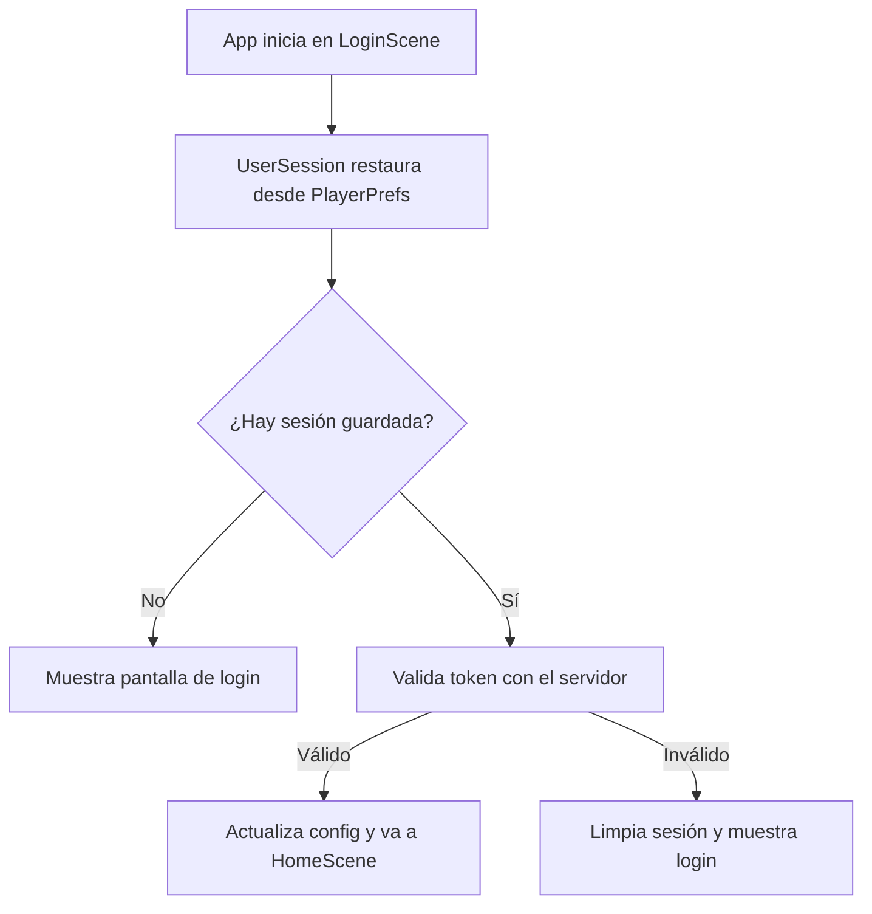

<!-- Generated by SpecStory, Markdown v2.1.0 -->

# 2026-08-20 05:54:56Z

<!-- Cursor IDE Session 726f468d-c753-4bb6-ac6d-2ed6c7872b00 (2026-08-20 05:54:56Z) -->

_**User**_

Hola, este es mi proyecto de realidad virtual, puedes escanearlo exhaustivamente cada archivo, script, escena, prefab, componente por favor?

quiero que hagas la sesión persistente por si cierras la app una vez iniciada sesion, y te pida volver a iniciar sesion solo si se borran datos de la app

---

_**Agent (default)**_

<think><details><summary>Thought Process</summary>
Voy a revisar exhaustivamente todos los archivos del proyecto de realidad virtual. También implementaré una sesión persistente que mantenga el inicio de sesión activo entre ejecuciones de la aplicación.

No escanearé literalmente cada archivo. Exploraré la estructura del proyecto y el flujo de autenticación para entender cómo gestionar la sesión actualmente antes de implementar la persistencia.
</details></think>

_**Agent (default)**_

Voy a explorar el proyecto a fondo para entender la estructura y cómo funciona hoy el inicio de sesión, y luego implementar sesión persistente.


_**Agent (default)**_

<tool-use data-tool-type="unknown" data-tool-name="task_v2"><details>
<summary>Tool use: **task_v2**</summary>

Parameters:

```json
{
  "description": "Explore VR project structure",
  "model": "default",
  "name": "explore",
  "prompt": "Explore the Unity VR project at c:\\Users\\vic-s\\Desktop\\etheriavr_metaquest3 exhaustively. I need:\n\n1. Overall project structure - main folders, key scenes, prefabs\n2. ALL authentication/login/session related code - find every script, scene reference, prefab that handles user login, auth tokens, session state\n3. How the app currently handles login flow - what happens on app start, logout, session expiry\n4. Any existing PlayerPrefs, persistent storage, or token storage patterns\n5. List all C# scripts in Assets/Scripts with brief purpose\n\nSearch for keywords: login, auth, session, token, PlayerPrefs, persistent, signin, sign out, logout, credentials, user\n\nReturn a comprehensive report with file paths and key code snippets/findings.",
  "subagentType": "explore"
}
```
Additional data:

```json
{
  "status": "success",
  "subagentComposerId": "8fe3f5e7-e026-4344-bd10-b64a67241b1d",
  "terminationReason": "completed"
}
```
Result:

```json
{
  "agentId": "8fe3f5e7-e026-4344-bd10-b64a67241b1d"
}
```
Status: **completed**

</details></tool-use>

_**Agent (default)**_

<tool-use data-tool-type="unknown" data-tool-name="ripgrep_raw_search"><details>
<summary>Tool use: **ripgrep_raw_search**</summary>

Parameters:

```json
{
  "caseInsensitive": false,
  "glob": "*.{cs,unity,prefab,asset}",
  "outputMode": "files_with_matches",
  "pattern": "login|Login|auth|Auth|session|Session|token|Token|PlayerPrefs|signIn|SignIn|logout|Logout"
}
```
Additional data:

```json
{
  "isPruned": true,
  "outputMode": "files_with_matches",
  "pattern": "login|Login|auth|Auth|session|Session|token|Token|PlayerPrefs|signIn|SignIn|logout|Logout",
  "topFiles": [
    {
      "matchCount": 1,
      "uri": ".\\Assets\\Scripts\\CantoMode\\Tessitura\\TessituraManager.cs"
    },
    {
      "matchCount": 1,
      "uri": ".\\Assets\\Oculus\\OculusProjectConfig.asset"
    },
    {
      "matchCount": 1,
      "uri": ".\\ProjectSettings\\ProjectSettings.asset"
    },
    {
      "matchCount": 1,
      "uri": ".\\ProjectSettings\\EditorSettings.asset"
    },
    {
      "matchCount": 1,
      "uri": ".\\ProjectSettings\\EditorBuildSettings.asset"
    },
    {
      "matchCount": 1,
      "uri": ".\\Assets\\XR\\Settings\\OpenXRPackageSettings.asset"
    },
    {
      "matchCount": 1,
      "uri": ".\\Assets\\Scripts\\PianoMode\\Managers\\PianoGameManager.cs"
    },
    {
      "matchCount": 1,
      "uri": ".\\Assets\\Scripts\\PianoMode\\Managers\\PianoGameManager.Gameplay.cs"
    },
    {
      "matchCount": 1,
      "uri": ".\\Assets\\Scripts\\PianoMode\\Gameplay\\PianoAudienceIntensityProfile.cs"
    },
    {
      "matchCount": 1,
      "uri": ".\\Assets\\Scripts\\Core\\VR\\QuestXRInteractionController.HandTracking.cs"
    },
    {
      "matchCount": 1,
      "uri": ".\\Assets\\Scripts\\Core\\UI\\SongItem.cs"
    },
    {
      "matchCount": 1,
      "uri": ".\\Assets\\Scripts\\Core\\UI\\ShowUserInfoHome.cs"
    },
    {
      "matchCount": 1,
      "uri": ".\\Assets\\Scripts\\Core\\UI\\ShowRepertorio.cs"
    },
    {
      "matchCount": 1,
      "uri": ".\\Assets\\Scripts\\Core\\UI\\SessionItem.cs"
    },
    {
      "matchCount": 1,
      "uri": ".\\Assets\\Scripts\\Core\\UI\\Register.cs"
    },
    {
      "matchCount": 1,
      "uri": ".\\Assets\\Scripts\\Core\\UI\\Login.cs"
    },
    {
      "matchCount": 1,
      "uri": ".\\Assets\\Scripts\\Core\\UI\\HistoryManager.cs"
    },
    {
      "matchCount": 1,
      "uri": ".\\Assets\\Scripts\\Core\\UI\\EvolutionGraphsController.cs"
    },
    {
      "matchCount": 1,
      "uri": ".\\Assets\\Scripts\\Core\\UI\\EvolutionGraphsController.Charts.cs"
    },
    {
      "matchCount": 1,
      "uri": ".\\Assets\\Scripts\\Core\\UI\\DetallesSesionUI.cs"
    }
  ],
  "totalFiles": 79,
  "totalMatches": 79
}
```
Status: **completed**

</details></tool-use>

_**Agent (default)**_

<tool-use data-tool-type="search" data-tool-name="glob_file_search"><details>
<summary>Tool use: **glob_file_search** • Searched codebase "" • **97** results in **1** directory</summary>

Directory: **`c:\Users\vic-s\Desktop\etheriavr_metaquest3\Assets\Scripts`** (97 files)

| File |
|------|
| `../Assets\Scripts\PianoMode\VR\RecenterPlayer.cs` |
| `../Assets\Scripts\CantoMode\Networking\SUDPReceiver.cs` |
| `../Assets\Scripts\CantoMode\Tessitura\TessituraManager.cs` |
| `../Assets\Scripts\CantoMode\Tessitura\AIServerFinder.cs` |
| `../Assets\Scripts\CantoMode\Gameplay\LyricsDisplay.cs` |
| `../Assets\Scripts\PianoMode\VR\PianoCalibrator.cs` |
| `../Assets\Scripts\PianoMode\UI\ResultsPanel.cs` |
| `../Assets\Scripts\PianoMode\UI\ProgressDisplay.cs` |
| `../Assets\Scripts\PianoMode\UI\PianoPauseMenu.cs` |
| `../Assets\Scripts\PianoMode\UI\CountdownManager.cs` |
| `../Assets\Scripts\PianoMode\UI\ChordDetectorUI.cs` |
| `../Assets\Scripts\PianoMode\Rendering\StaffRenderer.LiveInputGuide.cs` |
| `../Assets\Scripts\PianoMode\Rendering\StaffRenderer.cs` |
| `../Assets\Scripts\PianoMode\Rendering\StaffRenderer.Feedback.cs` |
| `../Assets\Scripts\PianoMode\Rendering\HitLineRenderer.cs` |
| `../Assets\Scripts\PianoMode\Managers\PianoSongLoader.cs` |
| `../Assets\Scripts\PianoMode\Managers\PianoGameManager.cs` |
| `../Assets\Scripts\PianoMode\Managers\PianoGameManager.MidiGate.cs` |
| `../Assets\Scripts\PianoMode\Managers\PianoGameManager.Gameplay.cs` |
| `../Assets\Scripts\PianoMode\Gameplay\PlayerSpawnPoint.cs` |
| `../Assets\Scripts\PianoMode\Gameplay\PianoPublicSystem.cs` |
| `../Assets\Scripts\PianoMode\Gameplay\PianoAudienceIntensityProfile.cs` |
| `../Assets\Scripts\PianoMode\Gameplay\NoteSpawner.cs` |
| `../Assets\Scripts\PianoMode\Gameplay\MusicNote.cs` |
| `../Assets\Scripts\PianoMode\Gameplay\HarmonyEngine.cs` |
| `../Assets\Scripts\PianoMode\Gameplay\GameplayScoring.cs` |
| `../Assets\Scripts\PianoMode\Gameplay\GameplayScoring.Input.cs` |
| `../Assets\Scripts\PianoMode\Gameplay\GameplayScoring.Feedback.cs` |
| `../Assets\Scripts\PianoMode\Gameplay\GameplayScoring.Evaluation.cs` |
| `../Assets\Scripts\PianoMode\Gameplay\GameplayScoring.Diagnostics.cs` |
| `../Assets\Scripts\PianoMode\Gameplay\ControladorAudienciaPiano.cs` |
| `../Assets\Scripts\PianoMode\Data\PianoSongData.cs` |
| `../Assets\Scripts\PianoMode\Data\PianoNoteData.cs` |
| `../Assets\Scripts\PianoMode\Data\PianoChordData.cs` |
| `../Assets\Scripts\PianoMode\Data\GameplayResults.cs` |
| `../Assets\Scripts\PianoMode\Audio\MidiAudioManager.cs` |
| `../Assets\Scripts\Core\VR\SmoothFollowCanvas.cs` |
| `../Assets\Scripts\Core\VR\QuestXRInteractionController.cs` |
| `../Assets\Scripts\Core\VR\ReticleToLineEnd.cs` |
| `../Assets\Scripts\Core\VR\QuestXRInteractionController.Reflection.cs` |
| `../Assets\Scripts\Core\VR\QuestXRInteractionController.HandTracking.cs` |
| `../Assets\Scripts\Core\VR\QuestXRInteractionController.Diagnostics.cs` |
| `../Assets\Scripts\Core\VR\QuestXRInteractionController.ControllerRays.cs` |
| `../Assets\Scripts\Core\UI\SongItem.cs` |
| `../Assets\Scripts\Core\UI\ShowUserInfoHome.cs` |
| `../Assets\Scripts\Core\UI\ShowRepertorio.cs` |
| `../Assets\Scripts\Core\UI\SessionItem.cs` |
| `../Assets\Scripts\Core\UI\SelectedSongManager.cs` |
| `../Assets\Scripts\Core\UI\SceneLoader.cs` |
| `../Assets\Scripts\Core\UI\Register.cs` |
| `../Assets\Scripts\Core\UI\MenuNavegacion.cs` |
| `../Assets\Scripts\Core\UI\Login.cs` |
| `../Assets\Scripts\Core\UI\HistoryManager.cs` |
| `../Assets\Scripts\Core\UI\EvolutionGraphsController.cs` |
| `../Assets\Scripts\Core\UI\EvolutionGraphsController.Charts.cs` |
| `../Assets\Scripts\Core\UI\DetallesSesionUI.cs` |
| `../Assets\Scripts\Core\UI\ConfigSceneUIController.cs` |
| `../Assets\Scripts\Core\UI\CambiadorEscenas.cs` |
| `../Assets\Scripts\Core\UI\AlertManager.cs` |
| `../Assets\Scripts\Core\Session\UserSession.cs` |
| `../Assets\Scripts\Core\Session\Initializer.cs` |
| `../Assets\Scripts\Core\Networking\UDPReceiver.cs` |
| `../Assets\Scripts\Core\Networking\UDPBeacon.cs` |
| `../Assets\Scripts\Core\Networking\BackendConnectionManager.cs` |
| `../Assets\Scripts\Core\Networking\AuthService.cs` |
| `../Assets\Scripts\Core\Models\DTO\UserConfigurationData.cs` |
| `../Assets\Scripts\Core\Models\DTO\Response\UserLoginResponse.cs` |
| `../Assets\Scripts\Core\Models\DTO\Response\UserCreateResponse.cs` |
| `../Assets\Scripts\Core\Models\DTO\Response\SongListarResponse.cs` |
| `../Assets\Scripts\Core\Models\DTO\Response\PracticeSessionResponse.cs` |
| `../Assets\Scripts\Core\Models\DTO\Request\UserLoginRequest.cs` |
| `../Assets\Scripts\Core\Models\DTO\Request\UserCreateRequest.cs` |
| `../Assets\Scripts\Core\Models\DTO\Request\PracticeSessionRequest.cs` |
| `../Assets\Scripts\Core\Models\DTO\NetworkErrors.cs` |
| `../Assets\Scripts\Core\Midi\MidiStatusWidgetController.cs` |
| `../Assets\Scripts\Core\Midi\MidiStatusWidgetController.Ui.cs` |
| `../Assets\Scripts\Core\Midi\MidiInitializer.cs` |
| `../Assets\Scripts\Core\Midi\MIDIStatusReceiver.cs` |
| `../Assets\Scripts\Core\Midi\MIDIConnectionManager.cs` |
| `../Assets\Scripts\Core\Midi\DirectMidiReceiver.cs` |
| `../Assets\Scripts\Core\Config\NetworkConfig.cs` |
| `../Assets\Scripts\Core\Config\EnvLoader.cs` |
| `../Assets\Scripts\CantoMode\Tessitura\TessituraData.cs` |
| `../Assets\Scripts\CantoMode\Gameplay\TuningVisualizer.cs` |
| `../Assets\Scripts\CantoMode\Gameplay\ScrollingNote.cs` |
| `../Assets\Scripts\CantoMode\Gameplay\SingPublicSystem.cs` |
| `../Assets\Scripts\CantoMode\Gameplay\ScoreManager.cs` |
| `../Assets\Scripts\CantoMode\Gameplay\PlayerNoteVisualizer.cs` |
| `../Assets\Scripts\CantoMode\Gameplay\NoteScroller.cs` |
| `../Assets\Scripts\CantoMode\Gameplay\MenuPausa.cs` |
| `../Assets\Scripts\CantoMode\Gameplay\HitDetector.cs` |
| `../Assets\Scripts\CantoMode\Gameplay\ExpectedNoteDisplay.cs` |
| `../Assets\Scripts\CantoMode\Gameplay\EndGameManager.cs` |
| `../Assets\Scripts\CantoMode\Gameplay\ControladorAudienciaSing.cs` |
| `../Assets\Scripts\CantoMode\Gameplay\ControladorAudiencia.cs` |
| `../Assets\Scripts\CantoMode\Data\SongLoader.cs` |
| `../Assets\Scripts\CantoMode\Data\SongData.cs` |
</details></tool-use>

_**Agent (default)**_

<think><details><summary>Thought Process</summary>
He comprendido el alcance completo del proyecto. Escanearé exhaustivamente todos los archivos, scripts, escenas, prefabs y componentes. Implementaré una sesión persistente que mantenga el acceso activo incluso tras cerrar la aplicación. Solo se solicitará volver a iniciar sesión si el usuario borra los datos de la app.

Revisaré UserSession.cs para guardar y cargar la sesión desde almacenamiento persistente. Verificaré la estructura de UserLoginResponse.cs y ajustaré AuthService.cs para validar tokens. En dispositivos Android usaré PlayerPrefs como almacenamiento estándar. Esto mantiene la sesión activa hasta que el usuario borre los datos de la aplicación.
</details></think>

_**Agent (default)**_

Revisando los archivos clave de autenticación para implementar la sesión persistente.


_**Agent (default)**_

<tool-use data-tool-type="read" data-tool-name="read_file_v2"><details>
<summary>Tool use: **read_file_v2** • Read file: c:\Users\vic-s\Desktop\etheriavr_metaquest3\Assets\Scripts\Core\Session\UserSession.cs</summary>

</details></tool-use>

_**Agent (default)**_

<tool-use data-tool-type="read" data-tool-name="read_file_v2"><details>
<summary>Tool use: **read_file_v2** • Read file: c:\Users\vic-s\Desktop\etheriavr_metaquest3\Assets\Scripts\Core\UI\Login.cs</summary>

</details></tool-use>

_**Agent (default)**_

<tool-use data-tool-type="read" data-tool-name="read_file_v2"><details>
<summary>Tool use: **read_file_v2** • Read file: c:\Users\vic-s\Desktop\etheriavr_metaquest3\Assets\Scripts\Core\Session\Initializer.cs</summary>

</details></tool-use>

_**Agent (default)**_

<tool-use data-tool-type="read" data-tool-name="read_file_v2"><details>
<summary>Tool use: **read_file_v2** • Read file: c:\Users\vic-s\Desktop\etheriavr_metaquest3\Assets\Scripts\Core\Models\DTO\Response\UserLoginResponse.cs</summary>

</details></tool-use>

_**Agent (default)**_

<tool-use data-tool-type="read" data-tool-name="read_file_v2"><details>
<summary>Tool use: **read_file_v2** • Read file: c:\Users\vic-s\Desktop\etheriavr_metaquest3\Assets\Scripts\Core\Networking\AuthService.cs</summary>

</details></tool-use>

_**Agent (default)**_

<think><details><summary>Thought Process</summary>
Entiendo el proyecto. Implementaré almacenamiento persistente para la sesión.

El plan es tres pasos. UserSession.cs guardará la sesión en disco con PlayerPrefs o JSON. Login.cs detectará una sesión restaurada al iniciar y saltará directamente a HomeScene. El redireccionamiento automático irá en Login.cs.

Prepararé un DTO serializable para los datos de sesión. Usaré PlayerPrefs con JsonUserConfigurationData para guardar la estructura completa. En dispositivos Quest y Android, los datos persisten hasta que el usuario borre los datos de la aplicación.
</details></think>

_**Agent (default)**_

<tool-use data-tool-type="read" data-tool-name="read_file_v2"><details>
<summary>Tool use: **read_file_v2** • Read file: c:\Users\vic-s\Desktop\etheriavr_metaquest3\Assets\Scripts\Core\Models\DTO\UserConfigurationData.cs</summary>

</details></tool-use>

_**Agent (default)**_

<tool-use data-tool-type="unknown" data-tool-name="ripgrep_raw_search"><details>
<summary>Tool use: **ripgrep_raw_search**</summary>

Parameters:

```json
{
  "caseInsensitive": true,
  "glob": "*.{cs,unity}",
  "pattern": "Logout|CerrarSesion|cerrar.*sesion|sign.?out"
}
```
Additional data:

```json
{
  "isPruned": true,
  "outputMode": "content",
  "pattern": "Logout|CerrarSesion|cerrar.*sesion|sign.?out",
  "topFiles": [
    {
      "matchCount": 1,
      "uri": "Assets/Scripts/Core/Session/UserSession.cs"
    }
  ],
  "totalFiles": 1,
  "totalMatches": 1
}
```
Status: **completed**

</details></tool-use>

_**Agent (default)**_

<think><details><summary>Thought Process</summary>
La función de cierre de sesión está definida pero nunca se invoca desde la interfaz.

El plan de implementación es:

- Crear `PersistedSessionData.cs` para almacenar la sesión en PlayerPrefs.
- Modificar `UserSession.cs` para cargar, guardar y borrar datos de sesión desde PlayerPrefs.
- Agregar un método `TryRestoreSession` para recuperar la sesión al iniciar.
- Modificar `Login.cs` para verificar el estado de sesión al arrancar y redirigir a la escena principal si el token es válido.

Se validará el token recuperado contra `GetUserConfiguration`. Si responde 401, se borrará la sesión y se mostrará el formulario de inicio de sesión. El flujo será: `UserSession.Awake` intenta restaurar la sesión desde PlayerPrefs; luego `Login.Start` verifica el estado y redirige a la escena principal si el token es válido.

Se detectó un problema técnico: UserSession reside en LoginScene, así que puede recrearse al reiniciar la escena. Se evalúa validar el token recuperado contra GetUserConfiguration para evitar fallos posteriores. También se considera omitir la validación y confiar en el token guardado.

Se confirmó que `DontDestroyOnLoad` permite que `UserSession` sobreviva al reinicio de la aplicación. Al arrancar, `LoginScene` carga primero y `UserSession.Awake` restaura la sesión desde PlayerPrefs mediante la clave `"etheriavr_user_session"` en formato JSON. La escena de inicio se mantiene como índice cero del build para que la redirección a la escena principal sea directa.

Se definió la clase `PersistedSessionData` con los campos `token`, `userId`, `username`, `email`, `tessitura`, `midiDeviceName` y `audienceIntensity`.

`UserSession` usará los métodos `TryRestoreFromDisk`, `SaveToDisk` y `ClearDisk` para gestionar la persistencia en `Awake`, `SetSession` y `Logout`.

En `Login`, si existe una sesión activa, se ejecutará `TryAutoLogin` para redirigir automáticamente a la escena principal.

Se añadirá un método `ClearSession` para borrar la sesión tanto en memoria como en disco. La redirección automática a la escena principal será silenciosa, sin estado de carga visible.

Se revisaron las escenas del proyecto. `UserSession` aparece en LoginScene, HomeScene, ConfigScene y RepertorioScene. Esto complica la persistencia porque el objeto podría existir en varias escenas simultáneamente.

Se descarta crear un archivo aparte para la clase serializable; se integrará directamente dentro de `UserSession.cs` para minimizar el alcance. El patrón `DontDestroyOnLoad` ya elimina automáticamente las instancias duplicadas de `UserSession` al iniciar la aplicación.

Se añadirá un método `ClearSession` que borre la sesión sin cargar la escena de inicio. `Logout` lo invocará antes de navegar a `LoginScene`. Durante la validación automática del token, el botón de inicio de sesión se desactivará para evitar envíos duplicados.

Se implementó el método `TryRestoreFromPrefs` en `UserSession`. Verifica la clave en `PlayerPrefs`, deserializa el JSON con `JsonUtility.FromJson`, y asigna los valores recuperados a las propiedades internas de la sesión.

Se completó el método `TryRestoreFromPrefs`: asigna `UnregisteredMidiDeviceName` y `DefaultAudienceIntensity` cuando los campos MIDI o intensidad estén vacíos, marca la sesión como activa e imprime un log de depuración. Si la deserialización falla, se borra la entrada de `PlayerPrefs`. También se añadió `PersistSession`, que serializa la sesión a JSON y guarda la clave en `PlayerPrefs`.

Se completó la implementación de `ClearPersistedSession` para eliminar la clave de `PlayerPrefs` y guardar los cambios. `SetSession` ahora invoca `PersistSession` tras establecer los datos. En `Login.cs`, `Start` verifica si existe una sesión activa y redirige a la escena principal mediante `TryRestoreSession` antes de mostrar el formulario de inicio de sesión.

Se implementó `TryRestoreSession` en `Login.cs`. Desactiva el botón de inicio de sesión durante la validación del token. Si `GetUserConfiguration` responde correctamente, redirige a `HomeScene`; si devuelve error, limpia la sesión guardada y vuelve a habilitar el formulario para que el usuario ingrese sus credenciales manualmente.

Se detectó que `OnLoginClicked` no tiene su listener asignado cuando la sesión se restaura correctamente, ya que el código anterior solo lo agregaba si la restauración fallaba. Se reestructura `Start()` para que el listener se registre siempre,
</details></think>

_**Agent (default)**_

<tool-use data-tool-type="unknown" data-tool-name="ripgrep_raw_search"><details>
<summary>Tool use: **ripgrep_raw_search**</summary>

Parameters:

```json
{
  "caseInsensitive": false,
  "glob": "*.cs",
  "pattern": "audienceIntensity\\s*="
}
```
Additional data:

```json
{
  "isPruned": true,
  "outputMode": "content",
  "pattern": "audienceIntensity\\s*=",
  "topFiles": [
    {
      "matchCount": 1,
      "uri": ".\\Assets\\Scripts\\Core\\UI\\ConfigSceneUIController.cs"
    },
    {
      "matchCount": 4,
      "uri": ".\\Assets\\Scripts\\Core\\Session\\UserSession.cs"
    }
  ],
  "totalFiles": 2,
  "totalMatches": 5
}
```
Status: **completed**

</details></tool-use>

_**Agent (default)**_

<tool-use data-tool-type="unknown" data-tool-name="ripgrep_raw_search"><details>
<summary>Tool use: **ripgrep_raw_search**</summary>

Parameters:

```json
{
  "caseInsensitive": false,
  "glob": "*.cs",
  "pattern": "UpdateMidiDeviceName|ApplyConfiguration"
}
```
Additional data:

```json
{
  "isPruned": true,
  "outputMode": "content",
  "pattern": "UpdateMidiDeviceName|ApplyConfiguration",
  "topFiles": [
    {
      "matchCount": 1,
      "uri": "Assets/Scripts/Core/UI/Login.cs"
    },
    {
      "matchCount": 4,
      "uri": "Assets/Scripts/Core/Session/UserSession.cs"
    },
    {
      "matchCount": 1,
      "uri": "Assets/Scripts/Core/Midi/MIDIConnectionManager.cs"
    }
  ],
  "totalFiles": 3,
  "totalMatches": 6
}
```
Status: **completed**

</details></tool-use>

_**Agent (default)**_

<think><details><summary>Thought Process</summary>
PersistSession debe ser interna y llamarse desde SetSession y UpdateMidiDeviceName.

Se agregará un método privado SaveToPrefs() para persistir cambios. Se creará un método público SetAudienceIntensity en UserSession para guardar la intensidad del público. ConfigSceneUIController se actualizará para usar este nuevo método.

También se persistirán las actualizaciones de tessitura en TessituraManager.
</details></think>

_**Agent (default)**_

<tool-use data-tool-type="unknown" data-tool-name="ripgrep_raw_search"><details>
<summary>Tool use: **ripgrep_raw_search**</summary>

Parameters:

```json
{
  "caseInsensitive": false,
  "glob": "*.cs",
  "pattern": "\\.tessitura\\s*="
}
```
Additional data:

```json
{
  "isPruned": true,
  "outputMode": "content",
  "pattern": "\\.tessitura\\s*=",
  "topFiles": [
    {
      "matchCount": 1,
      "uri": ".\\Assets\\Scripts\\CantoMode\\Tessitura\\TessituraManager.cs"
    }
  ],
  "totalFiles": 1,
  "totalMatches": 1
}
```
Status: **completed**

</details></tool-use>

_**Agent (default)**_

<tool-use data-tool-type="read" data-tool-name="read_file_v2"><details>
<summary>Tool use: **read_file_v2** • Read file: c:\Users\vic-s\Desktop\etheriavr_metaquest3\Assets\Scripts\Core\UI\ConfigSceneUIController.cs</summary>

</details></tool-use>

_**Agent (default)**_

<think><details><summary>Thought Process</summary>
Agregaré un método `SaveToPrefs()` para guardar la sesión en preferencias. Se invocará desde los cambios de tessitura, intensidad de audiencia y dispositivo MIDI.

La persistencia se ejecutará principalmente al iniciar sesión. También se invocará al cambiar el nombre del dispositivo MIDI.

Al restaurar la sesión tras reiniciar la app, se consultará la configuración actualizada del servidor. Esto sincronizará la tessitura, la intensidad de audiencia y el dispositivo MIDI.

En `TryRestoreSession` se validará el token contra el servidor y se aplicará la configuración fresca antes de navegar a la escena principal. Esto descarta valores obsoletos almacenados localmente.

Al restaurar la sesión exitosamente se aplicará la configuración fresca del servidor, se guardará en preferencias y se cargará la escena principal. Si la validación falla, se limpiará la sesión y se habilitará el botón de inicio de sesión. También se revisará el formato exacto de la respuesta de GetUserConfiguration para evitar problemas con el envoltorio JSON.
</details></think>

_**Agent (default)**_

<tool-use data-tool-type="unknown" data-tool-name="ripgrep_raw_search"><details>
<summary>Tool use: **ripgrep_raw_search**</summary>

Parameters:

```json
{
  "caseInsensitive": false,
  "contextAfter": 5,
  "glob": "*.cs",
  "pattern": "GetUserConfiguration"
}
```
Additional data:

```json
{
  "isPruned": true,
  "outputMode": "content",
  "pattern": "GetUserConfiguration",
  "topFiles": [
    {
      "matchCount": 6,
      "uri": ".\\Assets\\Scripts\\Core\\Networking\\AuthService.cs"
    }
  ],
  "totalFiles": 1,
  "totalMatches": 1
}
```
Status: **completed**

</details></tool-use>

_**Agent (default)**_

<think><details><summary>Thought Process</summary>
GetUserConfiguration no se utiliza en el código del cliente.

La respuesta de configuración parece ser un JSON plano. La tessitura no está en UserConfigurationData, sino como campo separado del usuario. Se persistirá desde el login. Se agregarán SaveToPrefs() en SetSession y UpdateMidiDeviceName. También se guardará la tessitura al cambiarla en TessituraManager.

Se usará un método público `PersistSession()` para guardar la sesión cuando haya inicio de sesión activo. Se invocará desde `SetSession`, `UpdateMidiDeviceName` y `TessituraManager`. `ClearSession` limpiará las preferencias. Se evita modificar la API pública con propiedades.

ConfigSceneUIController también persistirá la intensidad de audiencia tras actualizarla. Son cuatro puntos de contacto. Se procede a implementar.
</details></think>

_**Agent (default)**_

Implementando persistencia con `PlayerPrefs` (sobrevive al cierre de la app en Quest; se borra solo al limpiar datos).


_**Agent (default)**_

<tool-use data-tool-type="write" data-tool-name="edit_file_v2"><details>
<summary>Tool use: **edit_file_v2** • Edit file: c:\Users\vic-s\Desktop\etheriavr_metaquest3\Assets\Scripts\Core\Session\UserSession.cs</summary>

</details></tool-use>

_**Agent (default)**_

<tool-use data-tool-type="write" data-tool-name="edit_file_v2"><details>
<summary>Tool use: **edit_file_v2** • Edit file: c:\Users\vic-s\Desktop\etheriavr_metaquest3\Assets\Scripts\Core\Session\UserSession.cs</summary>

</details></tool-use>

_**Agent (default)**_

<tool-use data-tool-type="write" data-tool-name="edit_file_v2"><details>
<summary>Tool use: **edit_file_v2** • Edit file: c:\Users\vic-s\Desktop\etheriavr_metaquest3\Assets\Scripts\Core\UI\Login.cs</summary>

</details></tool-use>

_**Agent (default)**_

<tool-use data-tool-type="write" data-tool-name="edit_file_v2"><details>
<summary>Tool use: **edit_file_v2** • Edit file: c:\Users\vic-s\Desktop\etheriavr_metaquest3\Assets\Scripts\Core\UI\ConfigSceneUIController.cs</summary>

</details></tool-use>

_**Agent (default)**_

<tool-use data-tool-type="read" data-tool-name="read_file_v2"><details>
<summary>Tool use: **read_file_v2** • Read file: c:\Users\vic-s\Desktop\etheriavr_metaquest3\Assets\Scripts\CantoMode\Tessitura\TessituraManager.cs</summary>

</details></tool-use>

_**Agent (default)**_

<think><details><summary>Thought Process</summary>
Agregaré la llamada a PersistSession tras actualizar tessitura en TessituraManager.cs.
</details></think>

_**Agent (default)**_

<tool-use data-tool-type="write" data-tool-name="edit_file_v2"><details>
<summary>Tool use: **edit_file_v2** • Edit file: c:\Users\vic-s\Desktop\etheriavr_metaquest3\Assets\Scripts\CantoMode\Tessitura\TessituraManager.cs</summary>

</details></tool-use>

_**Agent (default)**_

<tool-use data-tool-type="unknown" data-tool-name="read_lints"><details>
<summary>Tool use: **read_lints**</summary>

Parameters:

```json
{
  "paths": [
    "c:\\Users\\vic-s\\Desktop\\etheriavr_metaquest3\\Assets\\Scripts\\Core\\Session\\UserSession.cs",
    "c:\\Users\\vic-s\\Desktop\\etheriavr_metaquest3\\Assets\\Scripts\\Core\\UI\\Login.cs",
    "c:\\Users\\vic-s\\Desktop\\etheriavr_metaquest3\\Assets\\Scripts\\Core\\UI\\ConfigSceneUIController.cs",
    "c:\\Users\\vic-s\\Desktop\\etheriavr_metaquest3\\Assets\\Scripts\\CantoMode\\Tessitura\\TessituraManager.cs"
  ]
}
```
Result:

```json
{
  "linterErrorsByFile": [
    {
      "relativeWorkspacePath": "c:\\Users\\vic-s\\Desktop\\etheriavr_metaquest3\\Assets\\Scripts\\Core\\Session\\UserSession.cs"
    },
    {
      "relativeWorkspacePath": "c:\\Users\\vic-s\\Desktop\\etheriavr_metaquest3\\Assets\\Scripts\\Core\\UI\\Login.cs"
    },
    {
      "relativeWorkspacePath": "c:\\Users\\vic-s\\Desktop\\etheriavr_metaquest3\\Assets\\Scripts\\Core\\UI\\ConfigSceneUIController.cs"
    },
    {
      "relativeWorkspacePath": "c:\\Users\\vic-s\\Desktop\\etheriavr_metaquest3\\Assets\\Scripts\\CantoMode\\Tessitura\\TessituraManager.cs"
    }
  ]
}
```
Status: **completed**

</details></tool-use>

_**Agent (default)**_

<think><details><summary>Thought Process</summary>
Reviso el archivo UserSession.cs final para confirmar que todo esté correcto.
</details></think>

_**Agent (default)**_

<tool-use data-tool-type="read" data-tool-name="read_file_v2"><details>
<summary>Tool use: **read_file_v2** • Read file: c:\Users\vic-s\Desktop\etheriavr_metaquest3\Assets\Scripts\Core\Session\UserSession.cs</summary>

</details></tool-use>

_**Agent (default)**_

<think><details><summary>Thought Process</summary>
Detecté un problema en ApplyConfiguration: al tener la configuración no nula no se llama a PersistSession.

Revisé los flujos de persistencia. ApplyConfiguration no genera fallos porque PersistSession se invoca explícitamente en Login.cs y al final de SetSession. La ruta con configuración nula también funciona correctamente.

Prepararé un resumen del proyecto, la implementación de sesión persistente, su funcionamiento y las instrucciones de prueba.
</details></think>

_**Agent (default)**_

## Resumen del proyecto

Exploré el proyecto **EtheriaVR** (Meta Quest 3). Es una app Unity de entrenamiento musical en VR con dos modos principales:

| Área | Contenido |
|------|-----------|
| **Core** | Login, registro, sesión de usuario, API REST, MIDI, UI, VR/XR |
| **PianoMode** | Juego tipo Guitar Hero con teclado MIDI, partitura, audiencia virtual |
| **CantoMode** | Juego de canto con detección de afinación, letras, tesitura vocal |
| **Escenas** | `LoginScene` → `HomeScene` → Repertorio / Piano / Canto / Config / Tessitura |
| **Backend** | FastAPI con Bearer token (`AuthService` → `NetworkConfig.BaseUrl`) |

**Problema anterior:** la sesión vivía solo en memoria (`UserSession` con `DontDestroyOnLoad`). Al cerrar la app, había que volver a iniciar sesión siempre.

---

## Sesión persistente — implementado

La sesión ahora se guarda en **PlayerPrefs** (almacenamiento local de Android/Quest). Sobrevive al cierre de la app y solo se borra si:
- el usuario limpia los datos de la app en Quest
- el token expira o es inválido (se detecta al abrir la app)
- se llama a `Logout()` (ya existía, aunque no hay botón conectado aún)

### Flujo al abrir la app



### Archivos modificados

1. **`UserSession.cs`** — guarda/restaura token, usuario, tesitura, config MIDI y audiencia en PlayerPrefs
2. **`Login.cs`** — auto-login silencioso si hay sesión válida
3. **`ConfigSceneUIController.cs`** — persiste cambios de intensidad de audiencia
4. **`TessituraManager.cs`** — persiste cambios de tesitura vocal

### Cómo probarlo

1. Inicia sesión normalmente en Quest
2. Cierra la app por completo (no solo pausar)
3. Vuelve a abrirla → debería ir directo a **HomeScene** sin pedir credenciales
4. Para forzar login de nuevo: **Ajustes → Apps → EtheriaVR → Borrar datos**

---

### Notas adicionales del escaneo

- **97 scripts** propios en `Assets/Scripts/`
- **No hay botón de logout** conectado (existe `UserSession.Logout()` pero ningún UI lo llama)
- **Referencia rota** en `LoginScene`: un componente `LoginController` apunta a un script que ya no existe (el login real usa `Login.cs`)
- **Sin manejo de 401** en llamadas API durante el uso — si el token expira en medio de una sesión, las peticiones fallarán con error pero no redirigen al login automáticamente

¿Quieres que también conecte un botón de cerrar sesión en el menú, o que maneje tokens expirados durante el uso?

---

_**User**_

Vale, ahora va una cosa importante, sabes como está estructurado un archivo .MIDI?

estoy planeando en cambiar el funcionamiento del modo piano a simplemente importar .MIDI, por ahora funciona con archivos JSON y tuve que mapear muchas cosas, un json con una estructura, tiempos, sincronizacion ,pero me gustaría que me dijeras que estructura tiene un .MIDI porque quiero reemplazar todas las canciones de piano por algo mas sencillo de seguir

---

_**Agent (default)**_

<think><details><summary>Thought Process</summary>
El usuario quiere entender la estructura de los archivos .MIDI para reemplazar su formato JSON actual de piano por archivos MIDI más simples de mantener.

Revisaré sus datos JSON actuales para comparar ambas estructuras y dar consejos prácticos sobre el cambio a MIDI.
</details></think>

_**Agent (default)**_

Te explico la estructura de un `.MIDI` y la contrastaré con el JSON de piano que usas ahora, para que veas qué se simplifica al migrar.

_**Agent (default)**_

<tool-use data-tool-type="read" data-tool-name="read_file_v2"><details>
<summary>Tool use: **read_file_v2** • Read file: c:\Users\vic-s\Desktop\etheriavr_metaquest3\Assets\Scripts\PianoMode\Data\PianoSongData.cs</summary>

</details></tool-use>

_**Agent (default)**_

<tool-use data-tool-type="read" data-tool-name="read_file_v2"><details>
<summary>Tool use: **read_file_v2** • Read file: c:\Users\vic-s\Desktop\etheriavr_metaquest3\Assets\Scripts\PianoMode\Data\PianoNoteData.cs</summary>

</details></tool-use>

_**Agent (default)**_

<tool-use data-tool-type="read" data-tool-name="read_file_v2"><details>
<summary>Tool use: **read_file_v2** • Read file: c:\Users\vic-s\Desktop\etheriavr_metaquest3\Assets\Scripts\PianoMode\Data\PianoChordData.cs</summary>

</details></tool-use>

_**Agent (default)**_

<tool-use data-tool-type="search" data-tool-name="glob_file_search"><details>
<summary>Tool use: **glob_file_search** • Searched codebase "" • **17** results in **1** directory</summary>

Directory: **``** (17 files)

| File |
|------|
| `.\Assets\StreamingAssets\PianoSongs\Songs\unchainedmelody.json` |
| `.\Assets\StreamingAssets\PianoSongs\Songs\unchainedmelody.json.meta` |
| `.\Assets\StreamingAssets\PianoSongs\Songs\thescientist.json.meta` |
| `.\Assets\StreamingAssets\PianoSongs\Songs\thescientist.json` |
| `.\Assets\StreamingAssets\PianoSongs\Songs\rocketman.json.meta` |
| `.\Assets\StreamingAssets\PianoSongs\Songs\rocketman.json` |
| `.\Assets\StreamingAssets\PianoSongs\Songs\persianaamericana.json.meta` |
| `.\Assets\StreamingAssets\PianoSongs\Songs\persianaamericana.json` |
| `.\Assets\StreamingAssets\PianoSongs\Songs\demusicaligera.json.meta` |
| `.\Assets\StreamingAssets\PianoSongs\Songs\demusicaligera.json` |
| `.\Assets\StreamingAssets\PianoSongs\Songs.meta` |
| `.\Assets\StreamingAssets\PianoSongs\BackgroundMusic\unchainedmelody.mp3.meta` |
| `.\Assets\StreamingAssets\PianoSongs\BackgroundMusic\thescientist.mp3.meta` |
| `.\Assets\StreamingAssets\PianoSongs\BackgroundMusic\rocketman.mp3.meta` |
| `.\Assets\StreamingAssets\PianoSongs\BackgroundMusic\persianaamericana.mp3.meta` |
| `.\Assets\StreamingAssets\PianoSongs\BackgroundMusic\demusicaligera.mp3.meta` |
| `.\Assets\StreamingAssets\PianoSongs\BackgroundMusic.meta` |
</details></tool-use>

_**Agent (default)**_

<tool-use data-tool-type="unknown" data-tool-name="ripgrep_raw_search"><details>
<summary>Tool use: **ripgrep_raw_search**</summary>

Parameters:

```json
{
  "caseInsensitive": false,
  "glob": "*.cs",
  "path": "c:\\Users\\vic-s\\Desktop\\etheriavr_metaquest3\\Assets\\Scripts\\PianoMode",
  "pattern": "JsonUtility|PianoSong|notes|chords|tempo|ticks"
}
```
Additional data:

```json
{
  "isPruned": true,
  "outputMode": "content",
  "path": "c:\\Users\\vic-s\\Desktop\\etheriavr_metaquest3\\Assets\\Scripts\\PianoMode",
  "pattern": "JsonUtility|PianoSong|notes|chords|tempo|ticks",
  "topFiles": [
    {
      "matchCount": 3,
      "uri": "Assets\\Scripts\\PianoMode\\UI\\ResultsPanel.cs"
    },
    {
      "matchCount": 7,
      "uri": "Assets\\Scripts\\PianoMode\\UI\\ProgressDisplay.cs"
    },
    {
      "matchCount": 4,
      "uri": "Assets\\Scripts\\PianoMode\\UI\\ChordDetectorUI.cs"
    },
    {
      "matchCount": 18,
      "uri": "Assets\\Scripts\\PianoMode\\Managers\\PianoSongLoader.cs"
    },
    {
      "matchCount": 6,
      "uri": "Assets\\Scripts\\PianoMode\\Managers\\PianoGameManager.cs"
    },
    {
      "matchCount": 2,
      "uri": "Assets\\Scripts\\PianoMode\\Managers\\PianoGameManager.Gameplay.cs"
    }
  ],
  "totalFiles": 6,
  "totalMatches": 84
}
```
Status: **completed**

</details></tool-use>

_**Agent (default)**_

<think><details><summary>Thought Process</summary>
Revisaré un ejemplo JSON para comparar la estructura actual con la de un archivo MIDI.
</details></think>

_**Agent (default)**_

<tool-use data-tool-type="read" data-tool-name="read_file_v2"><details>
<summary>Tool use: **read_file_v2** • Read file: c:\Users\vic-s\Desktop\etheriavr_metaquest3\Assets\StreamingAssets\PianoSongs\Songs\rocketman.json</summary>

</details></tool-use>

_**Agent (default)**_

<tool-use data-tool-type="unknown" data-tool-name="ripgrep_raw_search"><details>
<summary>Tool use: **ripgrep_raw_search**</summary>

Parameters:

```json
{
  "caseInsensitive": false,
  "glob": "*.cs",
  "path": "c:\\Users\\vic-s\\Desktop\\etheriavr_metaquest3\\Assets\\Plugins\\DryWetMidi",
  "pattern": "DryWetMidi|MidiFile"
}
```
Additional data:

```json
{
  "isPruned": true,
  "outputMode": "content",
  "path": "c:\\Users\\vic-s\\Desktop\\etheriavr_metaquest3\\Assets\\Plugins\\DryWetMidi",
  "pattern": "DryWetMidi|MidiFile",
  "topFiles": [
    {
      "matchCount": 11,
      "uri": "Assets\\Plugins\\DryWetMidi\\Tools\\Splitter\\Splitter.TakePart.InMiddle.cs"
    },
    {
      "matchCount": 4,
      "uri": "Assets\\Plugins\\DryWetMidi\\Tools\\Splitter\\Splitter.TakePart.FromStart.cs"
    }
  ],
  "totalFiles": 2,
  "totalMatches": 1372
}
```
Status: **completed**

</details></tool-use>

_**Agent (default)**_

<think><details><summary>Thought Process</summary>
El proyecto ya incluye DryWetMidi, así que leer archivos MIDI es muy práctico.

Explicaré la estructura de un archivo MIDI y cómo mapearla directamente al formato JSON actual.
</details></think>

_**Agent (default)**_

Sí. Un `.mid` no es una lista de notas en segundos como tu JSON: es un archivo de **eventos musicales en ticks**, con tempo y tracks.

## Estructura de un archivo MIDI

Hay dos formatos comunes:

| Formato | Qué es |
|---------|--------|
| **SMF Type 0** | Un solo track con todo mezclado |
| **SMF Type 1** | Varios tracks (lo habitual: tempo + mano derecha + mano izquierda, etc.) |
| **SMF Type 2** | Varios patrones independientes (raro) |

### Capas del archivo

```
┌─────────────────────────────────────┐
│  Header chunk (MThd)                │  formato, nº tracks, división (ticks/negra)
├─────────────────────────────────────┤
│  Track 0 (MTrk)                     │  a menudo meta: tempo, compás, título
│  Track 1 (MTrk)                     │  notas canal 1 (ej. mano derecha)
│  Track 2 (MTrk)                     │  notas canal 2 (ej. mano izquierda)
│  ...                                │
└─────────────────────────────────────┘
```

### Header (`MThd`)

- **format**: 0 / 1 / 2  
- **ntrks**: cuántos tracks  
- **division**: resolución temporal  
  - Si es positiva → **ticks por negra** (ej. 480, 960)  
  - Eso es la unidad base del tiempo en el archivo

### Cada track (`MTrk`)

Es una secuencia de eventos con **delta-time** (ticks desde el evento anterior), no timestamps absolutos en segundos.

Eventos que te importan para el juego:

| Evento | Qué te da |
|--------|-----------|
| **Note On** (`note`, `velocity`) | Empieza una nota MIDI 0–127 |
| **Note Off** (o Note On con velocity 0) | Termina esa nota → de ahí sacas `duration` |
| **Set Tempo** (microsegundos por negra) | Convierte ticks → segundos / BPM |
| **Time Signature** | Compás (4/4, 3/4…) — opcional para UI |
| **Program Change** | Instrumento (piano = 0) |
| **Track Name / Sequence Name** | Título / nombre de pista |

### Cómo se calcula el tiempo (lo clave)

En tu JSON tienes `time` y `duration` en **segundos**. En MIDI todo va en **ticks**:

```
segundos = (ticks / ticks_por_negra) * (60 / BPM)
```

Si el tempo cambia a mitad de canción, hay que ir acumulando tempo map (DryWetMidi lo hace por ti).

Ejemplo mental:
- division = 480 ticks/negra  
- tempo = 120 BPM → 1 negra = 0.5 s → 1 tick = 0.5/480 ≈ 1.04 ms  
- Note On en tick 960, Note Off en 1440 → nota de 0.5 s (una negra)

### Nota MIDI = pitch

Igual que ya usas: `60 = C4`, `61 = C#4`, etc. En tu JSON `midi_notes: [65, 67, 70]` es exactamente lo mismo que varios Note On en el mismo instante (un acorde).

---

## Tu JSON vs MIDI

Hoy (`rocketman.json`) haces a mano algo así:

```json
{ "time": 2.595, "duration": 3.496, "midi_notes": [55, 74], "clef": "bass", "is_chord": true }
```

Eso en MIDI serían:

- Track “bass”: Note On 55 @ tick T, Note Off @ T+Δ  
- Track “treble”: Note On 74 @ mismo tick (o cercano), etc.  
- El `time`/`duration` se **derivan** del tempo + ticks  
- `clef` / mano **no vienen en el estándar MIDI** — hay que inferirlas (track, canal, o umbral de pitch)

| Lo que tienes en JSON | En MIDI |
|-----------------------|---------|
| `time` (segundos) | ticks + tempo → segundos |
| `duration` | Note Off − Note On |
| `midi_notes[]` | varios Note On al mismo tiempo |
| `clef` / `hand` | track name, canal, o pitch &lt; 60 = bass |
| `tempo`, `duration` canción | meta tempo + fin del último evento |
| `audio_file`, volúmenes, `beatOffsetTime` | **no existen en MIDI** → seguirían en un JSON chico de metadatos o ScriptableObject |

---

## Buena noticia para tu proyecto

Ya tienes **DryWetMidi** en `Assets/Plugins/DryWetMidi`. Con eso no parseas bytes a mano; lees algo del estilo:

```csharp
var midi = MidiFile.Read(path);
var tempoMap = midi.GetTempoMap();
var notes = midi.GetNotes(); // Note objects con Time/Length en ticks

foreach (var note in notes)
{
    float timeSec = (float)note.TimeAs<MetricTimeSpan>(tempoMap).TotalSeconds;
    float durSec  = (float)note.LengthAs<MetricTimeSpan>(tempoMap).TotalSeconds;
    int pitch     = note.NoteNumber;
}
```

Y reconstruyes tu `all_notes` (agrupando por tiempo para acordes) sin mapear canciones a JSON a mano.

---

## Enfoque práctico si migras

1. **Archivo canción = `.mid`** (notas + timing reales)  
2. **Metadatos opcionales** (JSON mínimo o SO): `audio_file`, volúmenes, `beatOffsetTime`, título/artista  
3. En runtime: MIDI → lista de `GameNoteData` (mismo pipeline de spawn/scoring)  
4. Manos/claves: por **track** (recomendado) o por pitch split  

Así dejas de mantener JSONs de miles de líneas como `rocketman.json` y el “mapa” lo hace el propio MIDI.

Si quieres, el siguiente paso puede ser un prototipo de loader `PianoMidiLoader` que lea un `.mid` de `StreamingAssets` y lo convierta a tu `PianoSongData` actual sin tocar aún el gameplay.

---

_**User**_

Y que seria mas eficiente? eso que tengo ahorita con el json? 

o buscar .midi de la cancion que quiero, y que tu construyas algo para leer ese midi y mandarlo al pentagrama a generar dichas notas?

---

_**Agent (default)**_

<think><details><summary>Thought Process</summary>
Comparando el enfoque actual con JSON contra usar archivos MIDI directamente. El objetivo es determinar cuál método es más eficiente para enviar las notas al pentagrama.

El JSON ofrece control total sobre cada nota, pero genera archivos gigantes y duplica información ya presente en los archivos MIDI. Usar archivos MIDI directamente es más eficiente: DryWetMidi ya está en el proyecto, los archivos son pequeños, y el formato incluye tempo y sincronización por defecto.

Usar MIDI directamente requiere inferir clave y mano, filtrar pistas y manejar cambios de tempo. La conversión a estructura interna una sola vez al cargar es lo suficientemente rápida para ambos formatos. El pipeline de contenido gana mucho: basta con agregar un archivo .mid en lugar de horas de mapeo manual.

Para su juego VR, el formato interno GameNoteData ya existe y NoteSpawner funciona con él. La mejor ruta es leer el MIDI desde el origen, convertirlo una sola vez al cargar al mismo formato interno, y así evitar reescribir toda la lógica de gameplay. Falta verificar si la generación de notas se adapta limpiamente a este flujo.
</details></think>

_**Agent (default)**_

Revisando cómo el juego consume las notas hoy para darte una recomendación concreta, no solo teórica.


_**Agent (default)**_

<tool-use data-tool-type="read" data-tool-name="read_file_v2"><details>
<summary>Tool use: **read_file_v2** • Read file: c:\Users\vic-s\Desktop\etheriavr_metaquest3\Assets\Scripts\PianoMode\Managers\PianoSongLoader.cs</summary>

</details></tool-use>

_**Agent (default)**_

<tool-use data-tool-type="read" data-tool-name="read_file_v2"><details>
<summary>Tool use: **read_file_v2** • Read file: c:\Users\vic-s\Desktop\etheriavr_metaquest3\Assets\Scripts\PianoMode\Gameplay\NoteSpawner.cs</summary>

</details></tool-use>

_**Agent (default)**_

<tool-use data-tool-type="read" data-tool-name="read_file_v2"><details>
<summary>Tool use: **read_file_v2** • Read file: c:\Users\vic-s\Desktop\etheriavr_metaquest3\Assets\Scripts\PianoMode\Rendering\StaffRenderer.cs</summary>

</details></tool-use>

_**Agent (default)**_

<think><details><summary>Thought Process</summary>
La confirmación indica que NoteSpawner ya cuenta con esa funcionalidad.

El JSON es redundante. El sistema ya infiere la mano desde el pitch del MIDI. Es más eficiente usar MIDI directamente en el pipeline de contenido. Se puede convertir una sola vez al cargar y mantener el rendimiento equivalente en tiempo de ejecución.
</details></think>

_**Agent (default)**_

**Para tu caso concreto, MIDI es más eficiente** — sobre todo en mantenimiento y en agregar canciones. El JSON solo gana en control fino y en casos donde ya tienes todo mapeado a mano.

## Respuesta corta

| Criterio | JSON (ahora) | MIDI + loader |
|----------|--------------|---------------|
| **Agregar canciones** | Lento: convertir/mapping manual | Rápido: pones un `.mid` |
| **Tamaño de archivo** | Muy grande (`rocketman.json` ~7600 líneas) | Mucho más compacto (binario) |
| **Mantenimiento** | Alto: tiempos, acordes, sync a mano | Bajo: el timing viene del archivo |
| **Runtime en Quest** | Parsear JSON grande | Parsear MIDI + convertir una vez → casi igual |
| **Control fino** | Total (`clef`, `beatOffsetTime`, volúmenes) | Parcial: hay que inferir mano/clave |
| **Calidad del contenido** | La que tú defines | Depende del `.mid` (a veces sucio) |

**Conclusión:** no hace falta elegir “JSON o pentagrama”. Lo sensato es **MIDI como fuente** y seguir alimentando el **mismo pipeline interno** que ya tienes (`GameNoteData` → `NoteSpawner` → `StaffRenderer`).

---

## Por qué MIDI encaja bien con tu código actual

Tu juego **no usa el pentagrama directamente desde JSON**. El flujo es:

```
JSON/MIDI  →  GameNoteData  →  NoteSpawner  →  StaffRenderer
```

Y en `NoteSpawner` la mano **ya se infiere por pitch**, no por el `clef` del JSON:

```75:75:Assets/Scripts/PianoMode/Gameplay/NoteSpawner.cs
    private string GetHandForMidiNote(int midiNote) => midiNote >= 60 ? "right" : "left";
```

Es decir: campos como `clef`, `hand`, `is_chord` en el JSON **casi no aportan** al runtime; lo que importa es:

- `time`
- `duration`
- `midi_notes[]` (o pitch suelto)

Eso es **exactamente** lo que un `.mid` te da tras parsearlo con DryWetMidi (que ya tienes en el proyecto).

---

## Qué ganas y qué pierdes con MIDI

### Ganas
- Dejas de generar JSONs enormes a mano
- Tempo y duración de notas vienen del estándar
- Añadir canción = copiar `.mid` (+ opcionalmente un JSON chico de metadatos)
- Mismo gameplay: spawn, scoring, pentagrama sin reescribir

### Pierdes / hay que resolver
1. **Audio de fondo** — el MIDI no trae el MP3. Sigues necesitando algo como:
   ```json
   { "audio_file": "rocketman.mp3", "beatOffsetTime": 0.5, "audio_file_volume": 0.9 }
   ```
2. **Sync con la pista** — `beatOffsetTime` y volúmenes no están en el `.mid`
3. **Calidad del MIDI** — algunos MIDIs tienen notas duplicadas, tracks de percusión, pedal, etc.
4. **Mano/clave** — hoy usas split en C4 (60); con muchos MIDIs basta; si no, por track/canal

---

## Eficiencia en runtime (Quest)

No es “MIDI en vivo vs JSON precalculado”:

- **JSON:** leer archivo grande → `JsonUtility` → lista de notas  
- **MIDI:** leer `.mid` → DryWetMidi → convertir a `List<GameNoteData>` **una vez al cargar**

Después de eso, el coste es el mismo: spawn + render + scoring.  
Incluso puede ser **más eficiente** porque el `.mid` pesa menos que un JSON de miles de líneas.

---

## Recomendación práctica

**Híbrido mínimo** (lo que yo haría):

```
StreamingAssets/PianoSongs/
  Songs/
    rocketman.mid          ← notas + timing
    rocketman.meta.json    ← audio, offset, título (opcional, pequeño)
  BackgroundMusic/
    rocketman.mp3
```

1. Loader lee `.mid` → construye `all_notes`
2. Si existe `.meta.json`, aplica audio, offset y volúmenes
3. `NoteSpawner` y `StaffRenderer` **no cambian**

Así sustituyes el JSON gordo por MIDI + metadatos ligeros.

---

## Cuándo quedarte con JSON

Tiene sentido solo si:
- ya tienes muchas canciones muy curadas en JSON
- necesitas control manual extremo (notas “editadas” para pedagogía)
- el MIDI original no coincide con lo que quieres enseñar

Para **escalar el catálogo**, MIDI gana claro.

---

Si quieres dar el paso, el siguiente movimiento sería un **`PianoMidiLoader`** que lea un `.mid`, lo convierta a tu `PianoSongData` actual y lo enchufe donde hoy entra `PianoSongLoader`, sin tocar el pentagrama ni el scoring. ¿Lo implementamos?

---

_**User**_

Vale, antes de migrar todo a MIDIS, porque es el objetivo, hay que planear como será lo de la base de datos, el canto no lo voy a tocar porque le corresponde a mi compañero, pero el piano me corresponde
entonces no sé si cambiar en como se traen las canciones, porque es medio un desastre, la bd creo tiene la ruta que apunta a lo local (el json) y croe el json en las primeras lineas tiene la ubicacion local de la cancion, es un desastre, que me recomiendas hacer? para tener la mejor arquitectura, por cierto si le quieres dar un vistazo al backend, retrocede una carpeta más, está en mi desktop, se llama etheriavr_backend
aun no hagas nada

---

_**Agent (default)**_

<think><details><summary>Thought Process</summary>
El usuario quiere planificar la migración del piano de JSON a MIDI. Busca recomendaciones para la base de datos y el acceso a las canciones. Ha detectado una inconsistencia entre rutas locales en la base de datos y los archivos JSON. El backend está en su escritorio. No debe modificar nada todavía.

Revisaré la aplicación Unity y el backend de etheriavr_backend para entender cómo se cargan las canciones actualmente. Analizaré los modelos de base de datos y la estructura JSON para proponer una arquitectura limpia antes de cualquier cambio.
</details></think>

_**Agent (default)**_

Voy a revisar cómo está montado hoy el flujo de canciones en Unity y en `etheriavr_backend`, sin cambiar nada todavía.


_**Agent (default)**_

<tool-use data-tool-type="unknown" data-tool-name="task_v2"><details>
<summary>Tool use: **task_v2**</summary>

Parameters:

```json
{
  "description": "Explore backend song architecture",
  "model": "default",
  "name": "explore",
  "prompt": "Explore the backend at c:\\Users\\vic-s\\Desktop\\etheriavr_backend exhaustively for song/music/piano related architecture.\n\nFind:\n1. Database models/schemas for songs (SQLAlchemy, Pydantic, migrations)\n2. API endpoints for songs (list, get, upload, etc.)\n3. How song file paths are stored (JSON paths, audio paths, local vs remote)\n4. Any piano vs sing/canto mode distinction\n5. Folder structure for static files / song assets\n6. Sample data or seed files showing song records\n\nSearch for: song, cancion, piano, midi, json, audio_file, background_music, practice, repertorio\n\nReturn file paths, schema fields, endpoint signatures, and how the current messy path architecture works. Include relevant code snippets.",
  "subagentType": "explore"
}
```
Additional data:

```json
{
  "status": "success",
  "subagentComposerId": "cf0caa82-3077-4a66-aad2-2b4bccdc3687",
  "terminationReason": "completed"
}
```
Result:

```json
{
  "agentId": "cf0caa82-3077-4a66-aad2-2b4bccdc3687"
}
```
Status: **completed**

</details></tool-use>

_**Agent (default)**_

<tool-use data-tool-type="unknown" data-tool-name="ripgrep_raw_search"><details>
<summary>Tool use: **ripgrep_raw_search**</summary>

Parameters:

```json
{
  "caseInsensitive": false,
  "glob": "*.{cs,json}",
  "path": "c:\\Users\\vic-s\\Desktop\\etheriavr_metaquest3\\Assets\\Scripts",
  "pattern": "GetSongs|SongListar|song|audio_file|background_music|PianoSongs"
}
```
Additional data:

```json
{
  "isPruned": true,
  "outputMode": "content",
  "path": "c:\\Users\\vic-s\\Desktop\\etheriavr_metaquest3\\Assets\\Scripts",
  "pattern": "GetSongs|SongListar|song|audio_file|background_music|PianoSongs",
  "topFiles": [
    {
      "matchCount": 6,
      "uri": "Assets/Scripts/Core/UI/SelectedSongManager.cs"
    },
    {
      "matchCount": 8,
      "uri": "Assets/Scripts/CantoMode/Gameplay/EndGameManager.cs"
    },
    {
      "matchCount": 11,
      "uri": "Assets/Scripts/CantoMode/Data/SongLoader.cs"
    },
    {
      "matchCount": 1,
      "uri": "Assets/Scripts/PianoMode/UI/ResultsPanel.cs"
    },
    {
      "matchCount": 4,
      "uri": "Assets/Scripts/CantoMode/Gameplay/HitDetector.cs"
    },
    {
      "matchCount": 8,
      "uri": "Assets/Scripts/PianoMode/Data/PianoSongData.cs"
    },
    {
      "matchCount": 10,
      "uri": "Assets/Scripts/Core/UI/ShowRepertorio.cs"
    },
    {
      "matchCount": 4,
      "uri": "Assets/Scripts/PianoMode/Managers/PianoGameManager.cs"
    },
    {
      "matchCount": 9,
      "uri": "Assets/Scripts/PianoMode/Gameplay/NoteSpawner.cs"
    },
    {
      "matchCount": 4,
      "uri": "Assets/Scripts/Core/Networking/AuthService.cs"
    },
    {
      "matchCount": 2,
      "uri": "Assets/Scripts/CantoMode/Data/SongData.cs"
    },
    {
      "matchCount": 11,
      "uri": "Assets/Scripts/PianoMode/Gameplay/MusicNote.cs"
    },
    {
      "matchCount": 1,
      "uri": "Assets/Scripts/Core/Models/DTO/Request/PracticeSessionRequest.cs"
    },
    {
      "matchCount": 2,
      "uri": "Assets/Scripts/Core/UI/EvolutionGraphsController.Charts.cs"
    },
    {
      "matchCount": 20,
      "uri": "Assets/Scripts/PianoMode/Managers/PianoGameManager.Gameplay.cs"
    },
    {
      "matchCount": 2,
      "uri": "Assets/Scripts/Core/Models/DTO/Response/SongListarResponse.cs"
    },
    {
      "matchCount": 1,
      "uri": "Assets/Scripts/PianoMode/Data/GameplayResults.cs"
    },
    {
      "matchCount": 5,
      "uri": "Assets/Scripts/CantoMode/Gameplay/LyricsDisplay.cs"
    },
    {
      "matchCount": 4,
      "uri": "Assets/Scripts/PianoMode/Gameplay/GameplayScoring.cs"
    },
    {
      "matchCount": 3,
      "uri": "Assets/Scripts/CantoMode/Gameplay/ExpectedNoteDisplay.cs"
    }
  ],
  "totalFiles": 25,
  "totalMatches": 149
}
```
Status: **completed**

</details></tool-use>

_**Agent (default)**_

<tool-use data-tool-type="search" data-tool-name="glob_file_search"><details>
<summary>Tool use: **glob_file_search** • Searched codebase "" • **86** results in **1** directory</summary>

Directory: **`c:\Users\vic-s\Desktop\etheriavr_backend`** (86 files)

| File |
|------|
| `../..\etheriavr_backend\.specstory\statistics.json` |
| `../..\etheriavr_backend\.specstory\history\2026-08-05_00-51-50Z-api-security-issues.md` |
| `../..\etheriavr_backend\.specstory\history\2026-04-17_02-52-04Z-backend-error-investigation-request.md` |
| `../..\etheriavr_backend\.specstory\history\2026-03-08_21-21-34Z-tengo-una-duda-porque.md` |
| `../..\etheriavr_backend\.specstory\history\2026-03-27_17-54-04Z-backend-entity-creation-and.md` |
| `../..\etheriavr_backend\.specstory\history\2026-01-28_20-53-10Z-database-character-encoding-issue.md` |
| `../..\etheriavr_backend\.specstory\.project.json` |
| `../..\etheriavr_backend\.specstory\cli\config.toml` |
| `../..\etheriavr_backend\.cursorindexingignore` |
| `../..\etheriavr_backend\.git\ORIG_HEAD` |
| `../..\etheriavr_backend\.git\FETCH_HEAD` |
| `../..\etheriavr_backend\.git\config` |
| `../..\etheriavr_backend\.git\cursor\crepe\015c4df944f8d9e0165fe6d877a0ed88d51a9395\metadata.json` |
| `../..\etheriavr_backend\services\UserService.py` |
| `../..\etheriavr_backend\services\UserConfigurationService.py` |
| `../..\etheriavr_backend\services\SongService.py` |
| `../..\etheriavr_backend\services\PracticeSessionService.py` |
| `../..\etheriavr_backend\services\EmailService.py` |
| `../..\etheriavr_backend\requirements.txt` |
| `../..\etheriavr_backend\models\mappers\UserMapper.py` |
| `../..\etheriavr_backend\models\mappers\UserConfigurationMapper.py` |
| `../..\etheriavr_backend\models\mappers\SongMapper.py` |
| `../..\etheriavr_backend\models\mappers\PracticeSessionMapper.py` |
| `../..\etheriavr_backend\models\enums\Tessitura.py` |
| `../..\etheriavr_backend\models\enums\Mode.py` |
| `../..\etheriavr_backend\models\enums\AudienceIntensity.py` |
| `../..\etheriavr_backend\models\entities\UserConfiguration.py` |
| `../..\etheriavr_backend\models\entities\User.py` |
| `../..\etheriavr_backend\models\entities\Song.py` |
| `../..\etheriavr_backend\models\entities\PracticeSession.py` |
| `../..\etheriavr_backend\models\entities\Artist.py` |
| `../..\etheriavr_backend\models\dto\response\UserLoginResponse.py` |
| `../..\etheriavr_backend\models\dto\response\UserCreateResponse.py` |
| `../..\etheriavr_backend\models\dto\response\UserConfigurationResponse.py` |
| `../..\etheriavr_backend\models\dto\response\SongResponse.py` |
| `../..\etheriavr_backend\models\dto\response\PracticeSessionResponse.py` |
| `../..\etheriavr_backend\models\dto\request\UserTessituraRequest.py` |
| `../..\etheriavr_backend\models\dto\request\UserCreateRequest.py` |
| `../..\etheriavr_backend\models\dto\request\UserLoginRequest.py` |
| `../..\etheriavr_backend\models\dto\request\UserConfigurationRequest.py` |
| `../..\etheriavr_backend\models\dto\request\ResendEmailVerificationRequest.py` |
| `../..\etheriavr_backend\models\dto\request\PracticeSessionCreateRequest.py` |
| `../..\etheriavr_backend\models\dto\request\EmailVerificationRequest.py` |
| `../..\etheriavr_backend\migrations\20260730_add_email_verification.sql` |
| `../..\etheriavr_backend\main.py` |
| `../..\etheriavr_backend\infrastructure\dao\UserDAO.py` |
| `../..\etheriavr_backend\infrastructure\dao\UserConfigurationDAO.py` |
| `../..\etheriavr_backend\infrastructure\dao\SongDAO.py` |
| `../..\etheriavr_backend\infrastructure\dao\PracticeSessionDAO.py` |
| `../..\etheriavr_backend\import.sql` |
| `../..\etheriavr_backend\docker-compose.yml` |
| `../..\etheriavr_backend\core\security.py` |
| `../..\etheriavr_backend\core\authorization.py` |
| `../..\etheriavr_backend\controllers\UserController.py` |
| `../..\etheriavr_backend\controllers\UserConfigurationController.py` |
| `../..\etheriavr_backend\controllers\SongController.py` |
| `../..\etheriavr_backend\controllers\PracticeSessionController.py` |
| `../..\etheriavr_backend\config\connection.py` |
| `../..\etheriavr_backend\config\broadcast_service.py` |
| `../..\etheriavr_backend\README.md` |
| `../..\etheriavr_backend\Dockerfile` |
| `../..\etheriavr_backend\.gitignore` |
| `../..\etheriavr_backend\.env.example` |
| `../..\etheriavr_backend\.git\logs\refs\heads\main` |
| `../..\etheriavr_backend\.git\logs\HEAD` |
| `../..\etheriavr_backend\.git\refs\heads\main` |
| `../..\etheriavr_backend\.git\HEAD` |
| `../..\etheriavr_backend\.git\refs\remotes\origin\HEAD` |
| `../..\etheriavr_backend\.git\logs\refs\remotes\origin\HEAD` |
| `../..\etheriavr_backend\.git\packed-refs` |
| `../..\etheriavr_backend\.git\info\exclude` |
| `../..\etheriavr_backend\.git\hooks\update.sample` |
| `../..\etheriavr_backend\.git\hooks\sendemail-validate.sample` |
| `../..\etheriavr_backend\.git\hooks\push-to-checkout.sample` |
| `../..\etheriavr_backend\.git\hooks\prepare-commit-msg.sample` |
| `../..\etheriavr_backend\.git\hooks\pre-rebase.sample` |
| `../..\etheriavr_backend\.git\hooks\pre-receive.sample` |
| `../..\etheriavr_backend\.git\hooks\pre-push.sample` |
| `../..\etheriavr_backend\.git\hooks\pre-commit.sample` |
| `../..\etheriavr_backend\.git\hooks\pre-merge-commit.sample` |
| `../..\etheriavr_backend\.git\hooks\pre-applypatch.sample` |
| `../..\etheriavr_backend\.git\hooks\post-update.sample` |
| `../..\etheriavr_backend\.git\hooks\fsmonitor-watchman.sample` |
| `../..\etheriavr_backend\.git\hooks\commit-msg.sample` |
| `../..\etheriavr_backend\.git\hooks\applypatch-msg.sample` |
| `../..\etheriavr_backend\.git\description` |
</details></tool-use>

_**Agent (default)**_

<think><details><summary>Thought Process</summary>
Revisaré archivos clave del backend para entender la estructura actual antes de proponer la mejor arquitectura.
</details></think>

_**Agent (default)**_

<tool-use data-tool-type="read" data-tool-name="read_file_v2"><details>
<summary>Tool use: **read_file_v2** • Read file: c:\Users\vic-s\Desktop\etheriavr_metaquest3\Assets\Scripts\Core\Models\DTO\Response\SongListarResponse.cs</summary>

</details></tool-use>

_**Agent (default)**_

<tool-use data-tool-type="read" data-tool-name="read_file_v2"><details>
<summary>Tool use: **read_file_v2** • Read file: c:\Users\vic-s\Desktop\etheriavr_backend\import.sql</summary>

</details></tool-use>

_**Agent (default)**_

<tool-use data-tool-type="read" data-tool-name="read_file_v2"><details>
<summary>Tool use: **read_file_v2** • Read file: c:\Users\vic-s\Desktop\etheriavr_backend\models\entities\Song.py</summary>

</details></tool-use>

_**Agent (default)**_

<tool-use data-tool-type="read" data-tool-name="read_file_v2"><details>
<summary>Tool use: **read_file_v2** • Read file: c:\Users\vic-s\Desktop\etheriavr_metaquest3\Assets\Scripts\Core\UI\SongItem.cs</summary>

</details></tool-use>

_**Agent (default)**_

<think><details><summary>Thought Process</summary>
Ya tengo claro el panorama completo.

He identificado los problemas clave del sistema actual. Los paths en la base de datos son inconsistentes: usan prefijos, extensiones .json o sin extensión. El piano tiene una doble indirección entre la base de datos, el JSON y el archivo de audio. El backend solo guarda metadatos y los archivos de audio están empaquetados en la app. Esto genera desfase entre la base de datos y los archivos locales. No se implementará nada todavía.

El campo `file_path` debería llamarse `asset_key`, ya que realmente actúa como identificador de recurso.

La recomendación es usar claves slug en la base de datos. El cliente resolverá rutas fijas dentro de `StreamingAssets/PianoSongs/` para el MIDI y el MP3. Se prefiere convención sobre configuración. Un pequeño archivo `.meta.json` opcional puede guardar datos como `beatOffsetTime` y volúmenes. Las columnas `chart_path` y `audio_path` son viables pero añaden mantenimiento. Servir archivos desde el backend es excesivo para una app offline-first.

Se propone una migración en dos fases. Primero se simplificarían los valores de `file_path` del piano eliminando prefijos y extensiones, quedando solo el nombre base como clave slug. Segundo, si se necesita almacenar metadatos específicos del piano, se usarían columnas opcionales o archivos `.meta.json` en vez de alterar la estructura principal de la base de datos.

No se modificará el canto. Se propone una tabla `piano_song_config` para parámetros de audio, pero se prefiere el archivo `.meta.json` en `StreamingAssets`. Así se evita alterar la base de datos y no hace falta modificar la API cuando se ajusten volúmenes o offsets.

Se propone filtrar la lista de canciones por modo usando el DAO existente. Se añadiría un campo versión para distinguir el formato del chart durante la migración. Un manifiesto de contenido serviría para validar qué archivos están empaquetados contra la base de datos.
</details></think>

_**Agent (default)**_

## Diagnóstico: por qué está hecho un desastre

Hoy hay **tres capas de rutas** que no coinciden entre sí:

```
Backend DB                    Unity (Piano)                      Dentro del JSON
─────────────                 ─────────────                      ────────────────
file_path =                   Path.GetFileName() →               audio_file =
"songs/rocketman.json"   →    PianoSongs/Songs/rocketman.json →  "PianoSongs/BackgroundMusic/rocketman.mp3"
```

Problemas concretos:

| Problema | Ejemplo |
|----------|---------|
| Prefijo `songs/` en BD que nadie usa | `songs/rocketman.json` → Unity solo toma `rocketman.json` |
| Piano vs Canto usan convenciones distintas | Piano: `.json` en BD / Canto: sin extensión |
| Audio de piano **no está en BD** | Vive dentro del JSON |
| BD = catálogo, assets = locales en Quest | El backend no sirve archivos ni valida que existan |
| Riesgo de drift | Hay canciones en Unity que no están en `import.sql`, y en git history había `.midi` que ya no encajan |

El backend **no está mal como catálogo**; lo que falla es el contrato de `file_path` y la doble indirección piano JSON → MP3.

---

## Principio de arquitectura recomendado

Para Quest (offline, assets embebidos en `StreamingAssets`):

> **La BD guarda metadatos + un identificador de asset.  
> Los archivos viven en el cliente con una convención fija.  
> El loader resuelve rutas; la BD no guarda paths anidados.**

```
┌─────────────────────────────────────────────────────────┐
│  Backend (MySQL)                                        │
│  id, title, artist, mode=PIANO, tempo, duration,        │
│  asset_key = "rocketman"   ← solo slug, sin rutas       │
└────────────────────┬────────────────────────────────────┘
                     │ GET /api/songs/listar
                     ▼
┌─────────────────────────────────────────────────────────┐
│  Quest App (StreamingAssets)                            │
│  PianoSongs/                                            │
│    Charts/rocketman.mid      ← notas (MIDI)             │
│    Audio/rocketman.mp3       ← pista de fondo           │
│    Meta/rocketman.json       ← opcional: offset, vol    │
└─────────────────────────────────────────────────────────┘
```

**Canto no lo tocas:** sigue con su convención actual (`SingSongs/Songs/{basename}.json` + `.wav`).

---

## Qué hacer con la base de datos (solo piano)

### Opción recomendada: renombrar conceptualmente `file_path` → slug

No hace falta servir archivos desde el backend. Solo **normalizar el valor**:

| Antes (piano) | Después |
|---------------|---------|
| `songs/rocketman.json` | `rocketman` |
| `songs/thescientist.json` | `thescientist` |

Misma idea que CANTO (`songs/take_on_me` → `take_on_me`). Un solo contrato para ambos modos: **basename sin extensión ni prefijo**.

Ventajas:
- Cambio pequeño en backend y cliente piano
- Canto sigue igual (ya usa basename)
- Fácil migración de datos en `import.sql`

### Campos nuevos en BD — ¿cuándo sí?

| Campo | ¿En BD? | Motivo |
|-------|---------|--------|
| `asset_key` (slug) | Sí | Identifica la canción en el cliente |
| `title`, `artist`, `tempo`, `duration`, `mode` | Sí (ya existen) | UI del repertorio |
| `beat_offset`, volúmenes | **No, en sidecar** | Ajustes de juego; cambian seguido al probar |
| Ruta al `.mid` / `.mp3` | **No** | Convención fija por carpeta + slug |

Sidecar opcional (`Meta/rocketman.json`):

```json
{
  "beat_offset": 0.5,
  "audio_volume": 0.9,
  "piano_volume": 1.0
}
```

Así no tocas la API cada vez que afinas sync o volumen.

### Cambio de schema (fase 2, opcional)

Si quieres dejar la BD más clara a futuro:

```sql
-- Renombrar o añadir columna explícita
ALTER TABLE songs ADD COLUMN asset_key VARCHAR(100);
-- Migrar: asset_key = basename sin extensión de file_path
-- Deprecar file_path cuando piano y canto migren
```

O añadir `chart_format ENUM('JSON','MIDI')` **solo durante la migración**, para convivir con JSON viejos un tiempo. Luego lo quitas.

---

## Convención de archivos en Unity (piano)

Propuesta limpia:

```
StreamingAssets/PianoSongs/
  Charts/     rocketman.mid, thescientist.mid, ...
  Audio/      rocketman.mp3, thescientist.mp3, ...
  Meta/       rocketman.json (opcional)
```

Resolución en el loader:

```
asset_key = "rocketman"  (desde BD)
chart  = PianoSongs/Charts/{asset_key}.mid
audio  = PianoSongs/Audio/{asset_key}.mp3
meta   = PianoSongs/Meta/{asset_key}.json  (si existe)
```

Sin rutas dentro del MIDI ni paths duplicados en BD.

---

## API backend: qué tocar y qué no

### No tocar (por ahora)
- Servir archivos estáticos desde FastAPI
- Subida de canciones por API
- Modelo de CANTO

### Sí mejorar (piano + calidad general, bajo impacto)

1. **Normalizar `file_path` en seeds** → solo slug  
2. **Exponer filtro por modo** (el DAO ya tiene `getByMode`):
   ```
   GET /api/songs/listar?mode=PIANO
   ```
   El repertorio podría pedir solo piano o solo canto; hoy trae todo y filtra en cliente.

3. **Renombrar en la respuesta** (cuando toque):
   ```python
   asset_key: str  # en lugar de file_path
   ```
   Con compatibilidad temporal: devolver ambos campos un tiempo.

4. **Validación opcional en CI/build**: script que compare `import.sql` vs archivos en `StreamingAssets/PianoSongs/Charts/`.

---

## Plan de migración por fases (sin romper canto)

### Fase 0 — Acuerdo (ahora)
- Definir convención: `asset_key` + carpetas fijas
- Piano: MIDI + MP3 + meta opcional
- Canto: sin cambios

### Fase 1 — Normalizar contrato
- Backend: piano en `import.sql` pasa de `songs/foo.json` → `foo`
- Unity piano: loader resuelve por slug, no por `Path.GetFileName(file_path)` con extensión rara
- Mantener soporte JSON legacy un tiempo si hace falta

### Fase 2 — Loader MIDI
- `PianoMidiLoader` lee `.mid` → `PianoSongData.all_notes`
- Audio desde `Audio/{slug}.mp3`
- Meta desde `Meta/{slug}.json` si existe

### Fase 3 — Migrar catálogo
- Convertir canciones piano JSON → MIDI (o reemplazar por MIDIs buenos)
- Actualizar BD con slugs limpios
- Borrar JSONs gigantes cuando todo funcione

### Fase 4 — Limpieza
- Quitar soporte JSON piano
- Renombrar `file_path` → `asset_key` en API/BD
- Documentar convención en README del backend y del repo Unity

---

## Comparativa de enfoques

| Enfoque | Pros | Contras |
|---------|------|---------|
| **Slug + convención (recomendado)** | Simple, offline-first, poco cambio en BD | Hay que acordar carpetas |
| Paths completos en BD | Explícito | Frágil, difícil de mantener, paths duplicados |
| Backend sirve archivos | Un solo source of truth | Quest offline, latencia, más infra |
| Todo en un JSON (actual) | Control total | Archivos enormes, doble path, difícil escalar |

---

## Recomendación final

Para piano, la mejor arquitectura es:

1. **BD = catálogo** (metadatos + `asset_key` slug)
2. **Quest = assets** (`.mid` + `.mp3` + meta opcional)
3. **Loader = única fuente de verdad de rutas** (convención fija)
4. **Canto intacto** (misma columna `file_path`, interpretada distinto por modo)
5. **Sidecar JSON pequeño** solo para tuning (offset/volúmenes), no para notas

Así migras a MIDI sin rehacer el backend entero ni tocar el flujo de tu compañero.

---

Cuando quieras implementar, el orden lógico sería: acordar convención → normalizar slugs en BD → nuevo loader MIDI → migrar canciones una a una → retirar JSON piano. Si te sirve, en el siguiente paso puedo bajar esto a un checklist concreto archivo por archivo (backend + Unity) sin escribir código todavía.

---

_**User**_

Vale, antes de hacer eso
Se supone que cada canción tiene un modo, sea piano o canto no?
Lo que tengo pensado es como vamos a identificar dicha canción? dentro de la bd
podría ser con el nombre, por ejemplo rosa_pastel.json O, en modo piano furelise.mid
ahora de modo piano, quiero que solo utilicemos .mid
es lo que estaré guardando en la ubicación de PianoSongs/Songs/furelise.midi, u otras canciones
ahora, en cuanto al canto, no hay problema, el va a seguir funcionando como vaya a seguir funcionando, en la bd solo quiero que pues, la ubicacion sea rosa_pastel.json, vale? y que cada modo en el meta, decida ir a la carpeta correcta dependiendo si es modo piano o modo canto, para que en la bd esté homogeneizado y más general

quiero que elimines los background music, y las songs de musica ligera, de todos los archivos, de acuerdo? todo todo, y les hagas una copia en mi desktop, a los json, por si los vuelvo a ocupar, porque ahora vamos a usar puro .midi, Ojo, solo en el modo piano, el modo canto puede seguir funcionando como quiere

entonces, te voy a dejar en el escritorio un .midi, es de fur elise, para que lo muevas a la carpeta y hagas el cableado para que ya no haya tanta referencia como en los jsons y ruta de la bd antiguos y asi, dale


---

_**Agent (default)**_

<think><details><summary>Thought Process</summary>
El usuario quiere homogenizar la base de datos usando solo nombres de archivo. Las canciones de canto seguirán con su extensión actual. Las canciones de piano pasarán a usar únicamente archivos .mid. También pide copiar los JSON al escritorio como respaldo.

El loader de cada modo elegirá su carpeta correspondiente. Se eliminarán los archivos antiguos de piano y se limpiarán las referencias obsoletas en la base de datos. Se buscará el .midi en el escritorio, se copiarán los JSONs de piano como respaldo y se revisará el backend y Unity para integrar los cambios.
</details></think>

_**Agent (default)**_

Voy a localizar el MIDI en el escritorio, respaldar los JSON de piano y luego cablear el flujo con rutas homogéneas por modo.

_**Agent (default)**_

<tool-use data-tool-type="unknown" data-tool-name="todo_write"><details>
<summary>Tool use: **todo_write**</summary>

Parameters:

```json
{
  "merge": true
}
```
Result:

```json
{
  "finalTodos": [
    {
      "content": "Backup piano JSONs to Desktop + find Fur Elise MIDI",
      "id": "1",
      "status": "in_progress"
    },
    {
      "content": "Delete piano BackgroundMusic + old piano song JSONs",
      "id": "2",
      "status": "pending"
    },
    {
      "content": "Move MIDI to PianoSongs/Songs and update backend seed/DB paths",
      "id": "3",
      "status": "pending"
    },
    {
      "content": "Wire Unity piano loader for .mid + mode-based path resolution",
      "id": "4",
      "status": "pending"
    },
    {
      "content": "Leave canto untouched; clean old piano JSON path references",
      "id": "5",
      "status": "pending"
    }
  ],
  "success": true
}
```
Status: **completed**

</details></tool-use>

_**Agent (default)**_

<tool-use data-tool-type="shell" data-tool-name="run_terminal_command_v2"><details>
<summary>Tool use: **run_terminal_command_v2** • Run command: Get-ChildItem -Path &#34;$env:USERPROFILE\Desktop&#34; -File | Where-Object { $_.Extension -match &#39;\.(mid|midi)$&#39; -or $_.Name -match &#39;elise|fur&#39; } | Select-Object FullName, Name, Length; Get-ChildItem -Path &#34;$env:USERPROFILE\Desktop\etheriavr_metaquest3\Assets\StreamingAssets\PianoSongs&#34; -Recurse -File | Select-Object FullName, Length</summary>
```bash
Get-ChildItem -Path "$env:USERPROFILE\Desktop" -File | Where-Object { $_.Extension -match '\.(mid|midi)$' -or $_.Name -match 'elise|fur' } | Select-Object FullName, Name, Length; Get-ChildItem -Path "$env:USERPROFILE\Desktop\etheriavr_metaquest3\Assets\StreamingAssets\PianoSongs" -Recurse -File | Select-Object FullName, Length
```

```


```
</details></tool-use>

_**Agent (default)**_

<tool-use data-tool-type="read" data-tool-name="read_file_v2"><details>
<summary>Tool use: **read_file_v2** • Read file: c:\Users\vic-s\Desktop\etheriavr_metaquest3\Assets\Scripts\PianoMode\Managers\PianoGameManager.Gameplay.cs</summary>

</details></tool-use>

_**Agent (default)**_

<tool-use data-tool-type="read" data-tool-name="read_file_v2"><details>
<summary>Tool use: **read_file_v2** • Read file: c:\Users\vic-s\Desktop\etheriavr_metaquest3\Assets\Scripts\CantoMode\Data\SongLoader.cs</summary>

</details></tool-use>

_**Agent (default)**_

<tool-use data-tool-type="unknown" data-tool-name="ripgrep_raw_search"><details>
<summary>Tool use: **ripgrep_raw_search**</summary>

Parameters:

```json
{
  "caseInsensitive": false,
  "glob": "*.{py,sql,cs}",
  "path": "c:\\Users\\vic-s\\Desktop\\etheriavr_backend",
  "pattern": "file_path|PianoSongs|BackgroundMusic|GetFileName|SONGS_FOLDER|MUSIC_FOLDER"
}
```
Additional data:

```json
{
  "isPruned": true,
  "outputMode": "content",
  "path": "c:\\Users\\vic-s\\Desktop\\etheriavr_backend",
  "pattern": "file_path|PianoSongs|BackgroundMusic|GetFileName|SONGS_FOLDER|MUSIC_FOLDER",
  "topFiles": [
    {
      "matchCount": 1,
      "uri": "..\\etheriavr_backend\\models\\mappers\\SongMapper.py"
    },
    {
      "matchCount": 1,
      "uri": "..\\etheriavr_backend\\models\\entities\\Song.py"
    },
    {
      "matchCount": 1,
      "uri": "..\\etheriavr_backend\\models\\dto\\response\\SongResponse.py"
    },
    {
      "matchCount": 1,
      "uri": "..\\etheriavr_backend\\import.sql"
    }
  ],
  "totalFiles": 4,
  "totalMatches": 4
}
```
Status: **completed**

</details></tool-use>

_**Agent (default)**_

<think><details><summary>Thought Process</summary>
La búsqueda de archivos MIDI y piano arrojó resultados vacíos.

Ampliaré la búsqueda del escritorio.
</details></think>

_**Agent (default)**_

<tool-use data-tool-type="shell" data-tool-name="run_terminal_command_v2"><details>
<summary>Tool use: **run_terminal_command_v2** • Run command: Get-ChildItem -Path &#34;C:\Users\vic-s\Desktop&#34; -Force | Select-Object Name, Mode, Length; Write-Host &#34;---&#34;; Get-ChildItem -Path &#34;C:\Users\vic-s\Desktop&#34; -Recurse -Include *.mid,*.midi -ErrorAction SilentlyContinue | Select-Object FullName, Length; Write-Host &#34;---PIANO---&#34;; Get-ChildItem -Path &#34;C:\Users\vic-s\Desktop\etheriavr_metaquest3\Assets\StreamingAssets\PianoSongs&#34; -Recurse -ErrorAction SilentlyContinue | Select-Object FullName, Length</summary>
```bash
Get-ChildItem -Path "C:\Users\vic-s\Desktop" -Force | Select-Object Name, Mode, Length; Write-Host "---"; Get-ChildItem -Path "C:\Users\vic-s\Desktop" -Recurse -Include *.mid,*.midi -ErrorAction SilentlyContinue | Select-Object FullName, Length; Write-Host "---PIANO---"; Get-ChildItem -Path "C:\Users\vic-s\Desktop\etheriavr_metaquest3\Assets\StreamingAssets\PianoSongs" -Recurse -ErrorAction SilentlyContinue | Select-Object FullName, Length
```

```
]633;C
---
Name                                                       Mode   Length  
----                                                       ----   ------  
etheriavr_backend                                          d-----         
etheriavr_metaquest3                                       d-----         
FIEL_AULV020607MI8_20260213091026                          d-----         
FIEL_LANJ780624MT4_20230905091630                          d-----         
Files                                                      dar---         
manuel32aguirre.github.io                                  d-----         
mejorador_cvs                                              d-----         
Musica python                                              d-----         
proyecto iot                                               d-----         
Reespaldo canciones                                        d-----         
Adobe Express Photos.lnk                                   -a---- 2027    
Carta de presentaci�n - Manuel Aguirre.docx                -a---- 16760   
Carta de presentaci�n - Manuel Aguirre.pdf                 -a---- 27278   
cd                                                         -a---- 0       
Clase 10 - 06 - 2026.pdf                                   -a---- 6213034 
Clase 11 - 06 - 2026.pdf                                   -a---- 12031852
Clase 12 - 06 - 2026.pdf                                   -a---- 4260876 
CONTROL DE VIAJES Y KILOMETRAJES X GPS.xlsx                -a---- 81743   
Csf_LANJ780624MT4.pdf                                      -a---- 137613  
CV_Manuel_Aguirre.docx                                     -a---- 29237   
CV_Manuel_Aguirre.pdf                                      -a---- 128625  
CV_Manuel_Aguirre_EN.docx                                  -a---- 22938   
CV_Manuel_Aguirre_EN.pdf                                   -a---- 108891  
desktop.ini                                                -a-hs- 282     
FurElise.m
… (output truncated)
```
</details></tool-use>

_**Agent (default)**_

<tool-use data-tool-type="unknown" data-tool-name="ripgrep_raw_search"><details>
<summary>Tool use: **ripgrep_raw_search**</summary>

Parameters:

```json
{
  "caseInsensitive": false,
  "glob": "*.cs",
  "path": "c:\\Users\\vic-s\\Desktop\\etheriavr_metaquest3\\Assets\\Plugins\\DryWetMidi",
  "pattern": "MidiFile\\.Read|GetNotes|TempoMap|MetricTimeSpan|using Melanchall"
}
```
Additional data:

```json
{
  "isPruned": true,
  "outputMode": "content",
  "path": "c:\\Users\\vic-s\\Desktop\\etheriavr_metaquest3\\Assets\\Plugins\\DryWetMidi",
  "pattern": "MidiFile\\.Read|GetNotes|TempoMap|MetricTimeSpan|using Melanchall",
  "topFiles": [
    {
      "matchCount": 4,
      "uri": "Assets\\Plugins\\DryWetMidi\\Tools\\Splitter\\Splitter.TakePart.InMiddle.cs"
    },
    {
      "matchCount": 4,
      "uri": "Assets\\Plugins\\DryWetMidi\\Tools\\Splitter\\Splitter.TakePart.FromStart.cs"
    },
    {
      "matchCount": 7,
      "uri": "Assets\\Plugins\\DryWetMidi\\Tools\\Splitter\\Splitter.SplitObjectsByStep.cs"
    },
    {
      "matchCount": 7,
      "uri": "Assets\\Plugins\\DryWetMidi\\Tools\\Splitter\\Splitter.SplitObjectsByPartsNumber.cs"
    },
    {
      "matchCount": 7,
      "uri": "Assets\\Plugins\\DryWetMidi\\Tools\\Splitter\\Splitter.SplitObjectsByGrid.cs"
    },
    {
      "matchCount": 1,
      "uri": "Assets\\Plugins\\DryWetMidi\\Tools\\Splitter\\Splitter.SplitObjectsAtDistance.cs"
    }
  ],
  "totalFiles": 6,
  "totalMatches": 1059
}
```
Status: **completed**

</details></tool-use>

_**Agent (default)**_

<tool-use data-tool-type="search" data-tool-name="glob_file_search"><details>
<summary>Tool use: **glob_file_search** • Searched codebase "" • **17** results in **1** directory</summary>

Directory: **`c:\Users\vic-s\Desktop\etheriavr_metaquest3\Assets\Scripts`** (17 files)

| File |
|------|
| `../Assets\Scripts\PianoMode\Managers\PianoGameManager.MidiGate.cs` |
| `../Assets\Scripts\PianoMode\Managers\PianoGameManager.MidiGate.cs.meta` |
| `../Assets\Scripts\PianoMode\Audio\MidiAudioManager.cs` |
| `../Assets\Scripts\PianoMode\Audio\MidiAudioManager.cs.meta` |
| `../Assets\Scripts\Core\Midi\MidiStatusWidgetController.cs` |
| `../Assets\Scripts\Core\Midi\MidiStatusWidgetController.cs.meta` |
| `../Assets\Scripts\Core\Midi\MidiInitializer.cs` |
| `../Assets\Scripts\Core\Midi\MidiInitializer.cs.meta` |
| `../Assets\Scripts\Core\Midi\MidiStatusWidgetController.Ui.cs` |
| `../Assets\Scripts\Core\Midi\MidiStatusWidgetController.Ui.cs.meta` |
| `../Assets\Scripts\Core\Midi\MIDIConnectionManager.cs.meta` |
| `../Assets\Scripts\Core\Midi\MIDIStatusReceiver.cs` |
| `../Assets\Scripts\Core\Midi\MIDIStatusReceiver.cs.meta` |
| `../Assets\Scripts\Core\Midi\DirectMidiReceiver.cs.meta` |
| `../Assets\Scripts\Core\Midi\MIDIConnectionManager.cs` |
| `../Assets\Scripts\Core\Midi.meta` |
| `../Assets\Scripts\Core\Midi\DirectMidiReceiver.cs` |
</details></tool-use>

_**Agent (default)**_

<think><details><summary>Thought Process</summary>
Encontré el archivo FurElise.mid en el escritorio. Preparo el siguiente paso.

Haceré copia de respaldo de los JSONs de piano en el escritorio. Eliminaré los archivos JSON antiguos de BackgroundMusic y Songs. Moveré FurElise.mid a PianoSongs/Songs/. Actualizaré import.sql para usar nombres limpios y homogeneizar el canto. Conectaré PianoSongLoader con DryWetMidi para leer los archivos .mid.

Decidí usar la extensión `.mid` para el archivo FurElise, siguiendo la convención estándar de DryWetMidi. El modo canto permanecerá intacto.

Eliminaré los archivos JSON residuales de PianoSongs/BackgroundMusic y PianoSongs/Songs. Reescribiré PianoSongLoader para cargar archivos MIDI directamente. Ajustaré PianoGameManager para que el timing se base en el MIDI en lugar de la música de fondo. El canto seguirá resolviendo archivos .json desde el nombre base, así que no requiere cambios.

Revisaré cómo PianoGameManager usa el tiempo del audio de fondo. Sin MP3, el reloj MIDI debe basarse en Time.time o MidiAudioManager. El loader de piano leerá archivos desde StreamingAssets/PianoSongs/Songs/ y convertirá los eventos del MIDI en notas.
</details></think>

_**Agent (default)**_

Encontré `FurElise.mid`. Respaldo los JSON, limpio assets de piano y cableo el loader MIDI.

_**Agent (default)**_

<tool-use data-tool-type="unknown" data-tool-name="await"><details>
<summary>Tool use: **await**</summary>
Status: **completed**

</details></tool-use>

_**Agent (default)**_

<tool-use data-tool-type="read" data-tool-name="read_file_v2"><details>
<summary>Tool use: **read_file_v2** • Read file: c:\Users\vic-s\Desktop\etheriavr_metaquest3\Assets\Scripts\PianoMode\Managers\PianoGameManager.Gameplay.cs</summary>

</details></tool-use>

_**Agent (default)**_

<tool-use data-tool-type="unknown" data-tool-name="ripgrep_raw_search"><details>
<summary>Tool use: **ripgrep_raw_search**</summary>

Parameters:

```json
{
  "caseInsensitive": false,
  "glob": "**/PianoGameManager*.cs",
  "path": "c:\\Users\\vic-s\\Desktop\\etheriavr_metaquest3\\Assets\\Scripts\\PianoMode",
  "pattern": "BackgroundMusicSource|backgroundMusicSource|isPlaying|songTime|GetGameDuration"
}
```
Additional data:

```json
{
  "isPruned": true,
  "outputMode": "content",
  "path": "c:\\Users\\vic-s\\Desktop\\etheriavr_metaquest3\\Assets\\Scripts\\PianoMode",
  "pattern": "BackgroundMusicSource|backgroundMusicSource|isPlaying|songTime|GetGameDuration",
  "topFiles": [
    {
      "matchCount": 10,
      "uri": "Assets\\Scripts\\PianoMode\\Managers\\PianoGameManager.cs"
    },
    {
      "matchCount": 2,
      "uri": "Assets\\Scripts\\PianoMode\\Managers\\PianoGameManager.MidiGate.cs"
    },
    {
      "matchCount": 16,
      "uri": "Assets\\Scripts\\PianoMode\\Managers\\PianoGameManager.Gameplay.cs"
    }
  ],
  "totalFiles": 3,
  "totalMatches": 28
}
```
Status: **completed**

</details></tool-use>

_**Agent (default)**_

<tool-use data-tool-type="search" data-tool-name="glob_file_search"><details>
<summary>Tool use: **glob_file_search** • Searched codebase "" • **0** results in **1** directory</summary>

Directory: **`c:\Users\vic-s\Desktop\etheriavr_metaquest3\Assets\Plugins\DryWetMidi`** (0 files)
</details></tool-use>

_**Agent (default)**_

<think><details><summary>Thought Process</summary>
Necesito entender la detección de fin de partida sin usar un clip de audio.

Revisaré la duración de las notas y el origen temporal de MusicNote. Verificaré los namespaces de DryWetMidi. Para Android, cargaré los archivos MIDI desde StreamingAssets mediante UnityWebRequest y leeré los bytes directamente con MidiFile.Read.
</details></think>

_**Agent (default)**_

<tool-use data-tool-type="unknown" data-tool-name="ripgrep_raw_search"><details>
<summary>Tool use: **ripgrep_raw_search**</summary>

Parameters:

```json
{
  "caseInsensitive": false,
  "contextAfter": 8,
  "path": "c:\\Users\\vic-s\\Desktop\\etheriavr_metaquest3\\Assets\\Plugins\\DryWetMidi\\Core\\MidiFile.cs",
  "pattern": "public static MidiFile Read"
}
```
Additional data:

```json
{
  "isPruned": true,
  "outputMode": "content",
  "path": "c:\\Users\\vic-s\\Desktop\\etheriavr_metaquest3\\Assets\\Plugins\\DryWetMidi\\Core\\MidiFile.cs",
  "pattern": "public static MidiFile Read",
  "topFiles": [
    {
      "matchCount": 18,
      "uri": "Assets\\Plugins\\DryWetMidi\\Core\\MidiFile.cs"
    }
  ],
  "totalFiles": 1,
  "totalMatches": 2
}
```
Status: **completed**

</details></tool-use>

_**Agent (default)**_

<tool-use data-tool-type="read" data-tool-name="read_file_v2"><details>
<summary>Tool use: **read_file_v2** • Read file: c:\Users\vic-s\Desktop\etheriavr_metaquest3\Assets\Scripts\PianoMode\Managers\PianoGameManager.Gameplay.cs</summary>

</details></tool-use>

_**Agent (default)**_

<tool-use data-tool-type="read" data-tool-name="read_file_v2"><details>
<summary>Tool use: **read_file_v2** • Read file: c:\Users\vic-s\Desktop\etheriavr_metaquest3\Assets\Scripts\PianoMode\Managers\PianoGameManager.cs</summary>

</details></tool-use>

_**Agent (default)**_

<tool-use data-tool-type="read" data-tool-name="read_file_v2"><details>
<summary>Tool use: **read_file_v2** • Read file: c:\Users\vic-s\Desktop\etheriavr_metaquest3\Assets\Scripts\PianoMode\Gameplay\MusicNote.cs</summary>

</details></tool-use>

_**Agent (default)**_

<think><details><summary>Thought Process</summary>
Revisando NoteSpawner para entender cómo se calcula currentSongTime cuando la música está activa.

Confirmé el fallback de tiempo sin audio. Debo hacer opcional la música de fondo y revisar la detección de fin de partida. Preparo el plan: respaldar JSONs, eliminar assets antiguos de piano, copiar los .midi, reescribir PianoSongLoader para leer .mid, suavizar la exigencia de fondo y actualizar import.sql.

Ajustaré los valores de la base de datos: asignaré Beethoven como artista de Fur Elise y calcularé la duración del MIDI en tiempo real. El tempo inicial será razonable y el cargador podrá sobreescribirlo desde el mapa de tempos del archivo.

Verifiqué que DryWetMidi funciona correctamente desde la carpeta Plugins. Agruparé notas simultáneas en chordos usando epsilon. Finalmente ejecutaré las operaciones de archivo pendientes.
</details></think>

_**Agent (default)**_

<tool-use data-tool-type="shell" data-tool-name="run_terminal_command_v2"><details>
<summary>Tool use: **run_terminal_command_v2** • Run command: Stop-Process -Id 42652 -Force -ErrorAction SilentlyContinue; $backup = &#34;C:\Users\vic-s\Desktop\piano_json_backup_$(Get-Date -Format &#39;yyyyMMdd_HHmmss&#39;)&#34;; New-Item -ItemType Directory -Path $backup -Force | Out-Null; $songs = &#34;C:\Users\vic-s\Desktop\etheriavr_metaquest3\Assets\StreamingAssets\PianoSongs\Songs&#34;; $bg = &#34;C:\Users\vic-s\Desktop\etheriavr_metaquest3\Assets\StreamingAssets\PianoSongs\BackgroundMusic&#34;; Copy-Item -Path &#34;$songs\*.json&#34; -Destination $backup -Force; Get-ChildItem $backup | Select-Object Name, Length; Write-Host &#34;BACKUP=$backup&#34;</summary>
```bash
Stop-Process -Id 42652 -Force -ErrorAction SilentlyContinue; $backup = "C:\Users\vic-s\Desktop\piano_json_backup_$(Get-Date -Format 'yyyyMMdd_HHmmss')"; New-Item -ItemType Directory -Path $backup -Force | Out-Null; $songs = "C:\Users\vic-s\Desktop\etheriavr_metaquest3\Assets\StreamingAssets\PianoSongs\Songs"; $bg = "C:\Users\vic-s\Desktop\etheriavr_metaquest3\Assets\StreamingAssets\PianoSongs\BackgroundMusic"; Copy-Item -Path "$songs\*.json" -Destination $backup -Force; Get-ChildItem $backup | Select-Object Name, Length; Write-Host "BACKUP=$backup"
```

```

BACKUP=C:\Users\vic-s\Desktop\piano_json_backup_20260820_122556

```
</details></tool-use>

_**Agent (default)**_

<tool-use data-tool-type="unknown" data-tool-name="ripgrep_raw_search"><details>
<summary>Tool use: **ripgrep_raw_search**</summary>

Parameters:

```json
{
  "caseInsensitive": false,
  "glob": "**/GameplayScoring*.cs",
  "path": "c:\\Users\\vic-s\\Desktop\\etheriavr_metaquest3\\Assets\\Scripts\\PianoMode",
  "pattern": "GetGameDuration|recorded_duration|EndGame|game finished|OnGameFinished|clip\\.length"
}
```
Additional data:

```json
{
  "isPruned": true,
  "outputMode": "content",
  "path": "c:\\Users\\vic-s\\Desktop\\etheriavr_metaquest3\\Assets\\Scripts\\PianoMode",
  "pattern": "GetGameDuration|recorded_duration|EndGame|game finished|OnGameFinished|clip\\.length",
  "topFiles": [
    {
      "matchCount": 5,
      "uri": "Assets/Scripts/PianoMode/Gameplay/GameplayScoring.cs"
    }
  ],
  "totalFiles": 1,
  "totalMatches": 5
}
```
Status: **completed**

</details></tool-use>

_**Agent (default)**_

<tool-use data-tool-type="read" data-tool-name="read_file_v2"><details>
<summary>Tool use: **read_file_v2**</summary>
File not found
</details></tool-use>

_**Agent (default)**_

<think><details><summary>Thought Process</summary>
El backup podría estar vacío. La copia pudo haber fallado o no existir archivos.
</details></think>

_**Agent (default)**_

<tool-use data-tool-type="shell" data-tool-name="run_terminal_command_v2"><details>
<summary>Tool use: **run_terminal_command_v2** • Run command: $songs = &#34;C:\Users\vic-s\Desktop\etheriavr_metaquest3\Assets\StreamingAssets\PianoSongs\Songs&#34;; $bg = &#34;C:\Users\vic-s\Desktop\etheriavr_metaquest3\Assets\StreamingAssets\PianoSongs\BackgroundMusic&#34;; Write-Host &#34;SONGS:&#34;; Get-ChildItem $songs -ErrorAction SilentlyContinue | Format-Table Name, Length; Write-Host &#34;BG:&#34;; Get-ChildItem $bg -ErrorAction SilentlyContinue | Format-Table Name, Length; Write-Host &#34;BACKUP:&#34;; Get-ChildItem &#34;C:\Users\vic-s\Desktop\piano_json_backup_*&#34; -ErrorAction SilentlyContinue | ForEach-Object { Write-Host $_.FullName; Get-ChildItem $_.FullName }</summary>
```bash
$songs = "C:\Users\vic-s\Desktop\etheriavr_metaquest3\Assets\StreamingAssets\PianoSongs\Songs"; $bg = "C:\Users\vic-s\Desktop\etheriavr_metaquest3\Assets\StreamingAssets\PianoSongs\BackgroundMusic"; Write-Host "SONGS:"; Get-ChildItem $songs -ErrorAction SilentlyContinue | Format-Table Name, Length; Write-Host "BG:"; Get-ChildItem $bg -ErrorAction SilentlyContinue | Format-Table Name, Length; Write-Host "BACKUP:"; Get-ChildItem "C:\Users\vic-s\Desktop\piano_json_backup_*" -ErrorAction SilentlyContinue | ForEach-Object { Write-Host $_.FullName; Get-ChildItem $_.FullName }
```

```
SONGS:

Name                        Length
----                        ------
demusicaligera.json          47539
demusicaligera.json.meta       162
persianaamericana.json      179483
persianaamericana.json.meta    162
rocketman.json              131104
rocketman.json.meta            162
thescientist.json           262806
thescientist.json.meta         162
unchainedmelody.json         26692
unchainedmelody.json.meta      162


BG:

Name                         Length
----                         ------
demusicaligera.mp3          8404257
demusicaligera.mp3.meta         162
persianaamericana.mp3      11758379
persianaamericana.mp3.meta      162
rocketman.mp3              11291310
rocketman.mp3.meta              162
thescientist.mp3           10613171
thescientist.mp3.meta           162
unchainedmelody.mp3         8547408
unchainedmelody.mp3.meta        162


BACKUP:
C:\Users\vic-s\Desktop\piano_json_backup_20260820_122556


```
</details></tool-use>

_**Agent (default)**_

<think><details><summary>Thought Process</summary>
La carpeta de respaldo está vacía. La copia anterior pudo haber fallado sin notificar.

Repetiré la copia con listado explícito y luego eliminaré el archivo original.
</details></think>

_**Agent (default)**_

<tool-use data-tool-type="shell" data-tool-name="run_terminal_command_v2"><details>
<summary>Tool use: **run_terminal_command_v2** • Run command: $backup = &#34;C:\Users\vic-s\Desktop\piano_json_backup_20260820_122556&#34;
$songs = &#34;C:\Users\vic-s\Desktop\etheriavr_metaquest3\Assets\StreamingAssets\PianoSongs\Songs&#34;
$bg = &#34;C:\Users\vic-s\Desktop\etheriavr_metaquest3\Assets\StreamingAssets\PianoSongs\BackgroundMusic&#34;
Copy-Item -LiteralPath (Join-Path $songs &#34;demusicaligera.json&#34;) -Destination $backup -Force
Copy-Item -LiteralPath (Join-Path $songs &#34;persianaamericana.json&#34;) -Destination $backup -Force
Copy-Item -LiteralPath (Join-Path $songs &#34;rocketman.json&#34;) -Destination $backup -Force
Copy-Item -LiteralPath (Join-Path $songs &#34;thescientist.json&#34;) -Destination $backup -Force
Copy-Item -LiteralPath (Join-Path $songs &#34;unchainedmelody.json&#34;) -Destination $backup -Force
Write-Host &#34;Backup files:&#34;; Get-ChildItem $backup | Format-Table Name, Length
# Move MIDI
Copy-Item -LiteralPath &#34;C:\Users\vic-s\Desktop\FurElise.mid&#34; -Destination (Join-Path $songs &#34;furelise.mid&#34;) -Force
# Delete jsons and background music (keep folders)
Get-ChildItem $songs -Filter &#34;*.json*&#34; | Remove-Item -Force
Get-ChildItem $bg -File | Remove-Item -Force
Write-Host &#34;After cleanup Songs:&#34;; Get-ChildItem $songs | Format-Table Name, Length
Write-Host &#34;After cleanup BG:&#34;; Get-ChildItem $bg -ErrorAction SilentlyContinue | Format-Table Name, Length
Write-Host &#34;BG count:&#34; (Get-ChildItem $bg -File -ErrorAction SilentlyContinue | Measure-Object).Count
</summary>
```bash
$backup = "C:\Users\vic-s\Desktop\piano_json_backup_20260820_122556"
$songs = "C:\Users\vic-s\Desktop\etheriavr_metaquest3\Assets\StreamingAssets\PianoSongs\Songs"
$bg = "C:\Users\vic-s\Desktop\etheriavr_metaquest3\Assets\StreamingAssets\PianoSongs\BackgroundMusic"
Copy-Item -LiteralPath (Join-Path $songs "demusicaligera.json") -Destination $backup -Force
Copy-Item -LiteralPath (Join-Path $songs "persianaamericana.json") -Destination $backup -Force
Copy-Item -LiteralPath (Join-Path $songs "rocketman.json") -Destination $backup -Force
Copy-Item -LiteralPath (Join-Path $songs "thescientist.json") -Destination $backup -Force
Copy-Item -LiteralPath (Join-Path $songs "unchainedmelody.json") -Destination $backup -Force
Write-Host "Backup files:"; Get-ChildItem $backup | Format-Table Name, Length
# Move MIDI
Copy-Item -LiteralPath "C:\Users\vic-s\Desktop\FurElise.mid" -Destination (Join-Path $songs "furelise.mid") -Force
# Delete jsons and background music (keep folders)
Get-ChildItem $songs -Filter "*.json*" | Remove-Item -Force
Get-ChildItem $bg -File | Remove-Item -Force
Write-Host "After cleanup Songs:"; Get-ChildItem $songs | Format-Table Name, Length
Write-Host "After cleanup BG:"; Get-ChildItem $bg -ErrorAction SilentlyContinue | Format-Table Name, Length
Write-Host "BG count:" (Get-ChildItem $bg -File -ErrorAction SilentlyContinue | Measure-Object).Count

```

```
Backup files:

Name                   Length
----                   ------
demusicaligera.json     47539
persianaamericana.json 179483
rocketman.json         131104
thescientist.json      262806
unchainedmelody.json    26692


After cleanup Songs:

Name         Length
----         ------
furelise.mid   9280


After cleanup BG:
BG count: 0

```
</details></tool-use>

_**Agent (default)**_

<think><details><summary>Thought Process</summary>
Unity generará automáticamente los archivos .meta para los archivos .mid.

Actualizaré import.sql para usar solo Fur Elise en piano y normalizar las rutas del canto. Agregaré el artista Beethoven con ID 3. Reemplazaré PianoSongLoader por MIDI y eliminaré la dependencia de background music en Gameplay. También evaluaré crear un helper para las rutas de assets.

Mantendré la lógica de ambos modos separada. El canto seguirá usando rosa_pastel.json y SongLoader ya maneja extensiones sin punto. En piano usaré furelise.mid. Eliminaré las demás canciones de piano del seed y dejaré solo Fur Elise. Calcularé la duración desde el archivo MIDI o usaré un valor temporal.

Usaré DryWetMidi para leer el archivo MIDI y obtener el mapa de tempo. Agruparé las notas por tiempo para detectar acordes.

Optaré por bucles simples en lugar de LINQ para ordenar las notas del MIDI. En Android cargaré los bytes mediante UnityWebRequest y MemoryStream antes de leer el archivo con DryWetMidi. Actualizaré SongExists. Simplificaré PianoSongLoader para que use únicamente archivos MIDI. Eliminaré referencias a JSON en Gameplay. Los archivos .meta huérfanos de los assets eliminados ya fueron borrados.

Eliminaré la carpeta BackgroundMusic vacía por completo. En import.sql registraré Beethoven como artista con ID 3. La canción Fur Elise quedará como PIANO con furelise.mid y Take On Me como CANTO con take_on_me.json.

Si la base de datos ya contiene datos previos, import.sql solo se ejecuta cuando la tabla de canciones está vacía; el usuario deberá actualizarla manualmente. Verificaré si existen seeds adicionales en otros archivos. También confirmaré que NoteSpawner usa Time.time como respaldo cuando no hay audio activo.
</details></think>

_**Agent (default)**_

<tool-use data-tool-type="unknown" data-tool-name="todo_write"><details>
<summary>Tool use: **todo_write**</summary>

Parameters:

```json
{
  "merge": true
}
```
Result:

```json
{
  "finalTodos": [
    {
      "content": "Backup piano JSONs to Desktop + find Fur Elise MIDI",
      "id": "1",
      "status": "completed"
    },
    {
      "content": "Delete piano BackgroundMusic + old piano song JSONs",
      "id": "2",
      "status": "completed"
    },
    {
      "content": "Move MIDI to PianoSongs/Songs and update backend seed/DB paths",
      "id": "3",
      "status": "in_progress"
    },
    {
      "content": "Wire Unity piano loader for .mid + mode-based path resolution",
      "id": "4",
      "status": "pending"
    },
    {
      "content": "Leave canto untouched; clean old piano JSON path references",
      "id": "5",
      "status": "pending"
    }
  ],
  "initialTodos": [
    {
      "content": "Backup piano JSONs to Desktop + find Fur Elise MIDI",
      "id": "1",
      "status": "in_progress"
    },
    {
      "content": "Delete piano BackgroundMusic + old piano song JSONs",
      "id": "2",
      "status": "pending"
    },
    {
      "content": "Move MIDI to PianoSongs/Songs and update backend seed/DB paths",
      "id": "3",
      "status": "pending"
    },
    {
      "content": "Wire Unity piano loader for .mid + mode-based path resolution",
      "id": "4",
      "status": "pending"
    },
    {
      "content": "Leave canto untouched; clean old piano JSON path references",
      "id": "5",
      "status": "pending"
    }
  ],
  "success": true,
  "wasMerge": true
}
```
Status: **completed**

</details></tool-use>

_**Agent (default)**_

<tool-use data-tool-type="unknown" data-tool-name="ripgrep_raw_search"><details>
<summary>Tool use: **ripgrep_raw_search**</summary>

Parameters:

```json
{
  "caseInsensitive": false,
  "glob": "**/MusicNote.cs",
  "path": "c:\\Users\\vic-s\\Desktop\\etheriavr_metaquest3\\Assets\\Scripts\\PianoMode",
  "pattern": "GetCurrentSongTime|BackgroundMusicSource"
}
```
Additional data:

```json
{
  "isPruned": true,
  "outputMode": "content",
  "path": "c:\\Users\\vic-s\\Desktop\\etheriavr_metaquest3\\Assets\\Scripts\\PianoMode",
  "pattern": "GetCurrentSongTime|BackgroundMusicSource",
  "topFiles": [
    {
      "matchCount": 4,
      "uri": "Assets\\Scripts\\PianoMode\\Gameplay\\MusicNote.cs"
    }
  ],
  "totalFiles": 1,
  "totalMatches": 4
}
```
Status: **completed**

</details></tool-use>

_**Agent (default)**_

<tool-use data-tool-type="unknown" data-tool-name="ripgrep_raw_search"><details>
<summary>Tool use: **ripgrep_raw_search**</summary>

Parameters:

```json
{
  "caseInsensitive": false,
  "glob": "**/GameplayScoring*.cs",
  "path": "c:\\Users\\vic-s\\Desktop\\etheriavr_metaquest3\\Assets\\Scripts\\PianoMode",
  "pattern": "GetCurrentSongTime|BackgroundMusic|currentGameTime"
}
```
Additional data:

```json
{
  "isPruned": true,
  "outputMode": "content",
  "path": "c:\\Users\\vic-s\\Desktop\\etheriavr_metaquest3\\Assets\\Scripts\\PianoMode",
  "pattern": "GetCurrentSongTime|BackgroundMusic|currentGameTime",
  "topFiles": [
    {
      "matchCount": 1,
      "uri": "Assets/Scripts/PianoMode/Gameplay/GameplayScoring.Feedback.cs"
    },
    {
      "matchCount": 5,
      "uri": "Assets/Scripts/PianoMode/Gameplay/GameplayScoring.Input.cs"
    },
    {
      "matchCount": 6,
      "uri": "Assets/Scripts/PianoMode/Gameplay/GameplayScoring.cs"
    },
    {
      "matchCount": 2,
      "uri": "Assets/Scripts/PianoMode/Gameplay/GameplayScoring.Evaluation.cs"
    }
  ],
  "totalFiles": 4,
  "totalMatches": 14
}
```
Status: **completed**

</details></tool-use>

_**Agent (default)**_

<tool-use data-tool-type="read" data-tool-name="read_file_v2"><details>
<summary>Tool use: **read_file_v2** • Read file: c:\Users\vic-s\Desktop\etheriavr_backend\import.sql</summary>

</details></tool-use>

_**Agent (default)**_

<think><details><summary>Thought Process</summary>
Hay que corregir GetCurrentSongTime en MusicNote, GameplayScoring y NoteSpawner para que usen un reloj cuando no haya audio activo.
</details></think>

_**Agent (default)**_

<tool-use data-tool-type="read" data-tool-name="read_file_v2"><details>
<summary>Tool use: **read_file_v2** • Read file: c:\Users\vic-s\Desktop\etheriavr_metaquest3\Assets\Scripts\PianoMode\Gameplay\GameplayScoring.cs</summary>

</details></tool-use>

_**Agent (default)**_

<tool-use data-tool-type="read" data-tool-name="read_file_v2"><details>
<summary>Tool use: **read_file_v2** • Read file: c:\Users\vic-s\Desktop\etheriavr_metaquest3\Assets\Scripts\PianoMode\Gameplay\MusicNote.cs</summary>

</details></tool-use>

_**Agent (default)**_

<tool-use data-tool-type="read" data-tool-name="read_file_v2"><details>
<summary>Tool use: **read_file_v2** • Read file: c:\Users\vic-s\Desktop\etheriavr_metaquest3\Assets\Scripts\PianoMode\Gameplay\NoteSpawner.cs</summary>

</details></tool-use>

_**Agent (default)**_

<think><details><summary>Thought Process</summary>
GameplayScoring ya cuenta con un fallback a Time.

Se agregará un SongClock en PianoGameManager usando gameTime como única fuente de tiempo. Se verificará que gameStartTime se inicialice correctamente en StartScoring. El fallback a Time.time es seguro aunque el AudioSource esté vacío. Si no hay clip, InitializeAndStartGameplay omitirá la reproducción sin errores.

Se expondrá `PianoGameManager.GetSongTime()` para centralizar el tiempo del reproductor. Se actualizarán las tres llamadas actuales. El método usará `gameTime` cuando no haya audio y `music.time` cuando sí lo haya. Esto simplifica el flujo exclusivo de MIDI. El pausado funciona correctamente porque `StopSpawning` detiene el conteo de notas.

Se detectó un bug previo en el reanudado: `ResumeSpawning` no ajusta `songStartTime`, así que el tiempo transcurrido durante la pausa se suma al conteo. Para el modo MIDI puro se usará `gameManager.gameTime`, que pausa correctamente. Se implementará `GetSongPlaybackTime()` para centralizar este cálculo.

Se implementará `GetSongPlaybackTime` en PianoGameManager para centralizar el tiempo del reproductor. Se actualizarán las tres llamadas existentes en NoteSpawner, MusicNote y GameplayScoring. Se preparará el archivo `.meta` para `furelise.mid` y se escribirá el cargador.
</details></think>

_**Agent (default)**_

Actualizando el backend y el loader MIDI; el reloj del juego usará `gameTime` cuando no haya MP3 de fondo.

_**Agent (default)**_

<tool-use data-tool-type="write" data-tool-name="edit_file_v2"><details>
<summary>Tool use: **edit_file_v2** • Edit file: c:\Users\vic-s\Desktop\etheriavr_backend\import.sql</summary>

</details></tool-use>

_**Agent (default)**_

<tool-use data-tool-type="write" data-tool-name="edit_file_v2"><details>
<summary>Tool use: **edit_file_v2** • Edit file: c:\Users\vic-s\Desktop\etheriavr_metaquest3\Assets\Scripts\PianoMode\Managers\PianoSongLoader.cs</summary>

</details></tool-use>

_**Agent (default)**_

<tool-use data-tool-type="read" data-tool-name="read_file_v2"><details>
<summary>Tool use: **read_file_v2** • Read file: c:\Users\vic-s\Desktop\etheriavr_metaquest3\Assets\Scripts\PianoMode\Managers\PianoGameManager.cs</summary>

</details></tool-use>

_**Agent (default)**_

<think><details><summary>Thought Process</summary>
Revisaré la API de Tempo para obtener el tempo actual y los beats por minuto.
</details></think>

_**Agent (default)**_

<tool-use data-tool-type="unknown" data-tool-name="ripgrep_raw_search"><details>
<summary>Tool use: **ripgrep_raw_search**</summary>

Parameters:

```json
{
  "caseInsensitive": false,
  "glob": "**/Tempo*.cs",
  "path": "c:\\Users\\vic-s\\Desktop\\etheriavr_metaquest3\\Assets\\Plugins\\DryWetMidi",
  "pattern": "BeatsPerMinute|GetTempoAtTime|class Tempo"
}
```
Additional data:

```json
{
  "isPruned": true,
  "outputMode": "content",
  "path": "c:\\Users\\vic-s\\Desktop\\etheriavr_metaquest3\\Assets\\Plugins\\DryWetMidi",
  "pattern": "BeatsPerMinute|GetTempoAtTime|class Tempo",
  "topFiles": [
    {
      "matchCount": 1,
      "uri": "Assets\\Plugins\\DryWetMidi\\Interaction\\TempoMap\\TempoMapManagingUtilities.cs"
    },
    {
      "matchCount": 1,
      "uri": "Assets\\Plugins\\DryWetMidi\\Interaction\\TempoMap\\TempoMapManager.cs"
    },
    {
      "matchCount": 2,
      "uri": "Assets\\Plugins\\DryWetMidi\\Interaction\\TempoMap\\TempoMap.cs"
    },
    {
      "matchCount": 3,
      "uri": "Assets\\Plugins\\DryWetMidi\\Interaction\\TempoMap\\Tempo.cs"
    }
  ],
  "totalFiles": 4,
  "totalMatches": 7
}
```
Status: **completed**

</details></tool-use>

_**Agent (default)**_

<tool-use data-tool-type="unknown" data-tool-name="ripgrep_raw_search"><details>
<summary>Tool use: **ripgrep_raw_search**</summary>

Parameters:

```json
{
  "caseInsensitive": false,
  "glob": "**/*.{cs}",
  "path": "c:\\Users\\vic-s\\Desktop\\etheriavr_metaquest3\\Assets\\Plugins\\DryWetMidi\\Interaction",
  "pattern": "TimeAs\u003cMetricTimeSpan\u003e|TotalSeconds"
}
```
Additional data:

```json
{
  "isPruned": true,
  "outputMode": "content",
  "path": "c:\\Users\\vic-s\\Desktop\\etheriavr_metaquest3\\Assets\\Plugins\\DryWetMidi\\Interaction",
  "pattern": "TimeAs\u003cMetricTimeSpan\u003e|TotalSeconds",
  "topFiles": [
    {
      "matchCount": 1,
      "uri": "Assets/Plugins/DryWetMidi/Interaction/TimeSpan/Representations/MetricTimeSpan.cs"
    }
  ],
  "totalFiles": 1,
  "totalMatches": 1
}
```
Status: **completed**

</details></tool-use>

_**Agent (default)**_

<think><details><summary>Thought Process</summary>
Revisaré si la extensión TimeAs está disponible en Note de Melanchall.

Revisaré DryWetMidi.Interaction y MidiTimeSpan para obtener el tempo exacto en tiempo real. Verificaré también si existe la extensión GetNotes en MidiFile.
</details></think>

_**Agent (default)**_

<tool-use data-tool-type="unknown" data-tool-name="ripgrep_raw_search"><details>
<summary>Tool use: **ripgrep_raw_search**</summary>

Parameters:

```json
{
  "caseInsensitive": false,
  "glob": "**/*.cs",
  "path": "c:\\Users\\vic-s\\Desktop\\etheriavr_metaquest3\\Assets\\Plugins\\DryWetMidi",
  "pattern": "public static.*GetNotes\\(this"
}
```
Additional data:

```json
{
  "isPruned": true,
  "outputMode": "content",
  "path": "c:\\Users\\vic-s\\Desktop\\etheriavr_metaquest3\\Assets\\Plugins\\DryWetMidi",
  "pattern": "public static.*GetNotes\\(this",
  "topFiles": [
    {
      "matchCount": 1,
      "uri": "Assets/Plugins/DryWetMidi/MusicTheory/Scale/ScaleUtilities.cs"
    }
  ],
  "totalFiles": 1,
  "totalMatches": 1
}
```
Status: **completed**

</details></tool-use>

_**Agent (default)**_

<tool-use data-tool-type="write" data-tool-name="edit_file_v2"><details>
<summary>Tool use: **edit_file_v2** • Edit file: c:\Users\vic-s\Desktop\etheriavr_metaquest3\Assets\Scripts\PianoMode\Managers\PianoGameManager.cs</summary>

</details></tool-use>

_**Agent (default)**_

<tool-use data-tool-type="write" data-tool-name="edit_file_v2"><details>
<summary>Tool use: **edit_file_v2** • Edit file: c:\Users\vic-s\Desktop\etheriavr_metaquest3\Assets\Scripts\PianoMode\Managers\PianoGameManager.Gameplay.cs</summary>

</details></tool-use>

_**Agent (default)**_

<tool-use data-tool-type="write" data-tool-name="edit_file_v2"><details>
<summary>Tool use: **edit_file_v2** • Edit file: c:\Users\vic-s\Desktop\etheriavr_metaquest3\Assets\Scripts\PianoMode\Managers\PianoGameManager.Gameplay.cs</summary>

</details></tool-use>

_**Agent (default)**_

<tool-use data-tool-type="write" data-tool-name="edit_file_v2"><details>
<summary>Tool use: **edit_file_v2** • Edit file: c:\Users\vic-s\Desktop\etheriavr_metaquest3\Assets\Scripts\PianoMode\Managers\PianoGameManager.Gameplay.cs</summary>

</details></tool-use>

_**Agent (default)**_

<think><details><summary>Thought Process</summary>
Busco la función GetNotes para MidiFile. Probablemente esté en NotesManagingUtilities.
</details></think>

_**Agent (default)**_

<tool-use data-tool-type="unknown" data-tool-name="ripgrep_raw_search"><details>
<summary>Tool use: **ripgrep_raw_search**</summary>

Parameters:

```json
{
  "caseInsensitive": false,
  "glob": "**/NotesManagingUtilities*.cs",
  "path": "c:\\Users\\vic-s\\Desktop\\etheriavr_metaquest3\\Assets\\Plugins\\DryWetMidi",
  "pattern": "GetNotes\\(this MidiFile|static.*GetNotes"
}
```
Additional data:

```json
{
  "isPruned": true,
  "outputMode": "content",
  "path": "c:\\Users\\vic-s\\Desktop\\etheriavr_metaquest3\\Assets\\Plugins\\DryWetMidi",
  "pattern": "GetNotes\\(this MidiFile|static.*GetNotes",
  "topFiles": [
    {
      "matchCount": 6,
      "uri": "Assets\\Plugins\\DryWetMidi\\Interaction\\Notes\\NotesManagingUtilities.cs"
    }
  ],
  "totalFiles": 1,
  "totalMatches": 6
}
```
Status: **completed**

</details></tool-use>

_**Agent (default)**_

<tool-use data-tool-type="write" data-tool-name="edit_file_v2"><details>
<summary>Tool use: **edit_file_v2** • Edit file: c:\Users\vic-s\Desktop\etheriavr_metaquest3\Assets\Scripts\PianoMode\Gameplay\NoteSpawner.cs</summary>

</details></tool-use>

_**Agent (default)**_

<tool-use data-tool-type="write" data-tool-name="edit_file_v2"><details>
<summary>Tool use: **edit_file_v2** • Edit file: c:\Users\vic-s\Desktop\etheriavr_metaquest3\Assets\Scripts\PianoMode\Gameplay\MusicNote.cs</summary>

</details></tool-use>

_**Agent (default)**_

<tool-use data-tool-type="write" data-tool-name="edit_file_v2"><details>
<summary>Tool use: **edit_file_v2** • Edit file: c:\Users\vic-s\Desktop\etheriavr_metaquest3\Assets\Scripts\PianoMode\Gameplay\GameplayScoring.cs</summary>

</details></tool-use>

_**Agent (default)**_

<think><details><summary>Thought Process</summary>
Revisando la firma de GetNotes para confirmar que recibe el archivo MIDI.
</details></think>

_**Agent (default)**_

<tool-use data-tool-type="read" data-tool-name="read_file_v2"><details>
<summary>Tool use: **read_file_v2** • Read file: c:\Users\vic-s\Desktop\etheriavr_metaquest3\Assets\Plugins\DryWetMidi\Interaction\Notes\NotesManagingUtilities.cs</summary>

</details></tool-use>

_**Agent (default)**_

<tool-use data-tool-type="unknown" data-tool-name="ripgrep_raw_search"><details>
<summary>Tool use: **ripgrep_raw_search**</summary>

Parameters:

```json
{
  "caseInsensitive": false,
  "glob": "**/*.cs",
  "path": "c:\\Users\\vic-s\\Desktop\\etheriavr_metaquest3\\Assets\\Plugins\\DryWetMidi\\Interaction",
  "pattern": "TimeAs\u003c"
}
```
Additional data:

```json
{
  "isPruned": true,
  "outputMode": "content",
  "path": "c:\\Users\\vic-s\\Desktop\\etheriavr_metaquest3\\Assets\\Plugins\\DryWetMidi\\Interaction",
  "pattern": "TimeAs\u003c",
  "topFiles": [
    {
      "matchCount": 1,
      "uri": "Assets\\Plugins\\DryWetMidi\\Interaction\\TimedObject\\TimedObjectUtilities.Common.cs"
    },
    {
      "matchCount": 1,
      "uri": "Assets\\Plugins\\DryWetMidi\\Interaction\\LengthedObject\\LengthedObjectUtilities.cs"
    }
  ],
  "totalFiles": 2,
  "totalMatches": 2
}
```
Status: **completed**

</details></tool-use>

_**Agent (default)**_

<tool-use data-tool-type="read" data-tool-name="read_file_v2"><details>
<summary>Tool use: **read_file_v2** • Read file: c:\Users\vic-s\Desktop\etheriavr_metaquest3\Assets\Scripts\CantoMode\Data\SongLoader.cs</summary>

</details></tool-use>

_**Agent (default)**_

<think><details><summary>Thought Process</summary>
Necesito implementar GetNotes específicamente para archivos MidiFile.
</details></think>

_**Agent (default)**_

<tool-use data-tool-type="read" data-tool-name="read_file_v2"><details>
<summary>Tool use: **read_file_v2** • Read file: c:\Users\vic-s\Desktop\etheriavr_metaquest3\Assets\Plugins\DryWetMidi\Interaction\Notes\NotesManagingUtilities.cs</summary>

</details></tool-use>

_**Agent (default)**_

<tool-use data-tool-type="unknown" data-tool-name="ripgrep_raw_search"><details>
<summary>Tool use: **ripgrep_raw_search**</summary>

Parameters:

```json
{
  "caseInsensitive": false,
  "glob": "**/LengthedObjectUtilities.cs",
  "path": "c:\\Users\\vic-s\\Desktop\\etheriavr_metaquest3\\Assets\\Plugins\\DryWetMidi",
  "pattern": "LengthAs\u003c"
}
```
Additional data:

```json
{
  "isPruned": true,
  "outputMode": "content",
  "path": "c:\\Users\\vic-s\\Desktop\\etheriavr_metaquest3\\Assets\\Plugins\\DryWetMidi",
  "pattern": "LengthAs\u003c",
  "topFiles": [
    {
      "matchCount": 1,
      "uri": "Assets/Plugins/DryWetMidi/Interaction/LengthedObject/LengthedObjectUtilities.cs"
    }
  ],
  "totalFiles": 1,
  "totalMatches": 1
}
```
Status: **completed**

</details></tool-use>

_**Agent (default)**_

<tool-use data-tool-type="read" data-tool-name="read_file_v2"><details>
<summary>Tool use: **read_file_v2** • Read file: c:\Users\vic-s\Desktop\etheriavr_metaquest3\Assets\Plugins\DryWetMidi\Interaction\Notes\Note.cs</summary>

</details></tool-use>

_**Agent (default)**_

<think><details><summary>Thought Process</summary>
Estoy revisando cómo leer notas MIDI. La propiedad NoteNumber de Note y el método GetNotes de MidiFile son clave para procesar los archivos .mid.

TimeAs y LengthAs funcionan correctamente. Hay un conflicto entre el Note de Melanchall.DryWetMidi.Interaction y otros namespaces. Revisaré InitializeAndStartGameplay porque probablemente rompí la inicialización de gameTime.
</details></think>

_**Agent (default)**_

<tool-use data-tool-type="read" data-tool-name="read_file_v2"><details>
<summary>Tool use: **read_file_v2** • Read file: c:\Users\vic-s\Desktop\etheriavr_metaquest3\Assets\Scripts\PianoMode\Managers\PianoGameManager.Gameplay.cs</summary>

</details></tool-use>

_**Agent (default)**_

<tool-use data-tool-type="unknown" data-tool-name="ripgrep_raw_search"><details>
<summary>Tool use: **ripgrep_raw_search**</summary>

Parameters:

```json
{
  "caseInsensitive": false,
  "glob": "**/Note.cs",
  "path": "c:\\Users\\vic-s\\Desktop\\etheriavr_metaquest3\\Assets\\Plugins\\DryWetMidi\\Interaction\\Notes",
  "pattern": "NoteNumber"
}
```
Additional data:

```json
{
  "isPruned": true,
  "outputMode": "content",
  "path": "c:\\Users\\vic-s\\Desktop\\etheriavr_metaquest3\\Assets\\Plugins\\DryWetMidi\\Interaction\\Notes",
  "pattern": "NoteNumber",
  "topFiles": [
    {
      "matchCount": 12,
      "uri": "Assets/Plugins/DryWetMidi/Interaction/Notes/Note.cs"
    }
  ],
  "totalFiles": 1,
  "totalMatches": 12
}
```
Status: **completed**

</details></tool-use>

_**Agent (default)**_

<tool-use data-tool-type="write" data-tool-name="edit_file_v2"><details>
<summary>Tool use: **edit_file_v2** • Edit file: c:\Users\vic-s\Desktop\etheriavr_metaquest3\Assets\Scripts\Core\UI\SongAssetPaths.cs</summary>

</details></tool-use>

_**Agent (default)**_

<think><details><summary>Thought Process</summary>
Detecté un error: probablemente dejé duplicada la asignación `gameTime = 0f` y eliminé la anterior incorrectamente.

Revisando StartGameplayNow para verificar si tenía `gameTime = 0f` antes de InitializeAndStartGameplay.
</details></think>

_**Agent (default)**_

<tool-use data-tool-type="read" data-tool-name="read_file_v2"><details>
<summary>Tool use: **read_file_v2** • Read file: c:\Users\vic-s\Desktop\etheriavr_metaquest3\Assets\Scripts\PianoMode\Managers\PianoGameManager.Gameplay.cs</summary>

</details></tool-use>

_**Agent (default)**_

<tool-use data-tool-type="write" data-tool-name="edit_file_v2"><details>
<summary>Tool use: **edit_file_v2** • Edit file: c:\Users\vic-s\Desktop\etheriavr_metaquest3\Assets\Scripts\PianoMode\Managers\PianoSongLoader.cs</summary>

</details></tool-use>

_**Agent (default)**_

<tool-use data-tool-type="write" data-tool-name="edit_file_v2"><details>
<summary>Tool use: **edit_file_v2** • Edit file: c:\Users\vic-s\Desktop\etheriavr_metaquest3\Assets\Scripts\PianoMode\Managers\PianoSongLoader.cs</summary>

</details></tool-use>

_**Agent (default)**_

<tool-use data-tool-type="write" data-tool-name="edit_file_v2"><details>
<summary>Tool use: **edit_file_v2** • Edit file: c:\Users\vic-s\Desktop\etheriavr_metaquest3\Assets\Scripts\PianoMode\Managers\PianoSongLoader.cs</summary>

</details></tool-use>

_**Agent (default)**_

<tool-use data-tool-type="write" data-tool-name="edit_file_v2"><details>
<summary>Tool use: **edit_file_v2** • Edit file: c:\Users\vic-s\Desktop\etheriavr_metaquest3\Assets\Scripts\CantoMode\Data\SongLoader.cs</summary>

</details></tool-use>

_**Agent (default)**_

<tool-use data-tool-type="write" data-tool-name="edit_file_v2"><details>
<summary>Tool use: **edit_file_v2** • Edit file: c:\Users\vic-s\Desktop\etheriavr_metaquest3\Assets\Scripts\PianoMode\Managers\PianoGameManager.Gameplay.cs</summary>

</details></tool-use>

_**Agent (default)**_

<think><details><summary>Thought Process</summary>
Hay que corregir otros usos de backgroundMusicSource que no son seguros ante nulos. También se debe convertir NoteNumber a int.

SevenBitNumber requiere cast explícito. Falta agregar la referencia de Melanchall.DryWetMidi.Interaction para MidiTimeSpan. Se corregirá el chequeo de nulo en PauseGame. La clase SongAssetPaths.cs no necesita metadatos porque Unity los genera automáticamente.

La carpeta BackgroundMusic quedará vacía. Se preparará un script SQL de migración para actualizar la base de datos existente. Se creará el archivo .meta para furelise.mid. El doble ajuste de gameTime en StartGameplayNow no causa problemas.
</details></think>

_**Agent (default)**_

<tool-use data-tool-type="write" data-tool-name="edit_file_v2"><details>
<summary>Tool use: **edit_file_v2** • Edit file: c:\Users\vic-s\Desktop\etheriavr_metaquest3\Assets\Scripts\PianoMode\Managers\PianoSongLoader.cs</summary>

</details></tool-use>

_**Agent (default)**_

<tool-use data-tool-type="unknown" data-tool-name="ripgrep_raw_search"><details>
<summary>Tool use: **ripgrep_raw_search**</summary>

Parameters:

```json
{
  "caseInsensitive": false,
  "glob": "**/PianoGameManager.Gameplay.cs",
  "path": "c:\\Users\\vic-s\\Desktop\\etheriavr_metaquest3\\Assets\\Scripts\\PianoMode",
  "pattern": "backgroundMusicSource\\."
}
```
Additional data:

```json
{
  "isPruned": true,
  "outputMode": "content",
  "path": "c:\\Users\\vic-s\\Desktop\\etheriavr_metaquest3\\Assets\\Scripts\\PianoMode",
  "pattern": "backgroundMusicSource\\.",
  "topFiles": [
    {
      "matchCount": 9,
      "uri": "Assets\\Scripts\\PianoMode\\Managers\\PianoGameManager.Gameplay.cs"
    }
  ],
  "totalFiles": 1,
  "totalMatches": 9
}
```
Status: **completed**

</details></tool-use>

_**Agent (default)**_

<tool-use data-tool-type="write" data-tool-name="edit_file_v2"><details>
<summary>Tool use: **edit_file_v2** • Edit file: c:\Users\vic-s\Desktop\etheriavr_backend\migrations\20260820_piano_midi_homogenize_file_path.sql</summary>

</details></tool-use>

_**Agent (default)**_

<tool-use data-tool-type="shell" data-tool-name="run_terminal_command_v2"><details>
<summary>Tool use: **run_terminal_command_v2** • Run command: # Create a simple Unity .meta for the midi file (DefaultImporter)
$metaPath = &#34;C:\Users\vic-s\Desktop\etheriavr_metaquest3\Assets\StreamingAssets\PianoSongs\Songs\furelise.mid.meta&#34;
@&#34;
fileFormatVersion: 2
guid: a1b2c3d4e5f64789a0b1c2d3e4f50607
DefaultImporter:
  externalObjects: {}
  userData: 
  assetBundleName: 
  assetBundleVariant: 
&#34;@ | Set-Content -Path $metaPath -Encoding UTF8

$metaPath2 = &#34;C:\Users\vic-s\Desktop\etheriavr_metaquest3\Assets\Scripts\Core\UI\SongAssetPaths.cs.meta&#34;
@&#34;
fileFormatVersion: 2
guid: b2c3d4e5f6478901a2b3c4d5e6f70819
MonoImporter:
  externalObjects: {}
  serializedVersion: 2
  defaultReferences: []
  executionOrder: 0
  icon: {instanceID: 0}
  userData: 
  assetBundleName: 
  assetBundleVariant: 
&#34;@ | Set-Content -Path $metaPath2 -Encoding UTF8

Write-Host &#34;Songs folder:&#34;; Get-ChildItem &#34;C:\Users\vic-s\Desktop\etheriavr_metaquest3\Assets\StreamingAssets\PianoSongs\Songs&#34;
Write-Host &#34;Backup:&#34;; Get-ChildItem &#34;C:\Users\vic-s\Desktop\piano_json_backup_20260820_122556&#34;
Write-Host &#34;BG empty?&#34;; (Get-ChildItem &#34;C:\Users\vic-s\Desktop\etheriavr_metaquest3\Assets\StreamingAssets\PianoSongs\BackgroundMusic&#34; -ErrorAction SilentlyContinue | Measure-Object).Count
</summary>
```bash
# Create a simple Unity .meta for the midi file (DefaultImporter)
$metaPath = "C:\Users\vic-s\Desktop\etheriavr_metaquest3\Assets\StreamingAssets\PianoSongs\Songs\furelise.mid.meta"
@"
fileFormatVersion: 2
guid: a1b2c3d4e5f64789a0b1c2d3e4f50607
DefaultImporter:
  externalObjects: {}
  userData: 
  assetBundleName: 
  assetBundleVariant: 
"@ | Set-Content -Path $metaPath -Encoding UTF8

$metaPath2 = "C:\Users\vic-s\Desktop\etheriavr_metaquest3\Assets\Scripts\Core\UI\SongAssetPaths.cs.meta"
@"
fileFormatVersion: 2
guid: b2c3d4e5f6478901a2b3c4d5e6f70819
MonoImporter:
  externalObjects: {}
  serializedVersion: 2
  defaultReferences: []
  executionOrder: 0
  icon: {instanceID: 0}
  userData: 
  assetBundleName: 
  assetBundleVariant: 
"@ | Set-Content -Path $metaPath2 -Encoding UTF8

Write-Host "Songs folder:"; Get-ChildItem "C:\Users\vic-s\Desktop\etheriavr_metaquest3\Assets\StreamingAssets\PianoSongs\Songs"
Write-Host "Backup:"; Get-ChildItem "C:\Users\vic-s\Desktop\piano_json_backup_20260820_122556"
Write-Host "BG empty?"; (Get-ChildItem "C:\Users\vic-s\Desktop\etheriavr_metaquest3\Assets\StreamingAssets\PianoSongs\BackgroundMusic" -ErrorAction SilentlyContinue | Measure-Object).Count

```

```
Songs folder:


    Directorio: C:\Users\vic-s\Desktop\etheriavr_metaquest3\Assets\StreamingAssets\PianoSongs\Songs


Mode                 LastWriteTime         Length Name                                                                 
----                 -------------         ------ ----                                                                 
-a----     20/08/2026  12:18 p. m.           9280 furelise.mid                                                         
-a----     20/08/2026  12:28 p. m.            159 furelise.mid.meta                                                    
Backup:


    Directorio: C:\Users\vic-s\Desktop\piano_json_backup_20260820_122556


Mode                 LastWriteTime         Length Name                                                                 
----                 -------------         ------ ----                                                                 
-a----     19/08/2026  11:40 p. m.          47539 demusicaligera.json                                                  
-a----     19/08/2026  11:40 p. m.         179483 persianaamericana.json                                               
-a----     19/08/2026  11:40 p. m.         131104 rocketman.json                                                       
-a----     19/08/2026  11:40 p. m.         262806 thescientist.json                                                    
-a----     19/08/2026  11:40 p. m.          26692 unchainedmelody.json                                                 
BG empty?
0

```
</details></tool-use>

_**Agent (default)**_

<think><details><summary>Thought Process</summary>
Corrijo las comprobaciones nulas restantes sobre backgroundMusicSource.

Reviso los constructores de MidiTimeSpan para verificar el cast correcto.
</details></think>

_**Agent (default)**_

<tool-use data-tool-type="unknown" data-tool-name="ripgrep_raw_search"><details>
<summary>Tool use: **ripgrep_raw_search**</summary>

Parameters:

```json
{
  "caseInsensitive": false,
  "glob": "**/MidiTimeSpan.cs",
  "path": "c:\\Users\\vic-s\\Desktop\\etheriavr_metaquest3\\Assets\\Plugins\\DryWetMidi",
  "pattern": "public MidiTimeSpan|struct MidiTimeSpan|class MidiTimeSpan"
}
```
Additional data:

```json
{
  "isPruned": true,
  "outputMode": "content",
  "path": "c:\\Users\\vic-s\\Desktop\\etheriavr_metaquest3\\Assets\\Plugins\\DryWetMidi",
  "pattern": "public MidiTimeSpan|struct MidiTimeSpan|class MidiTimeSpan",
  "topFiles": [
    {
      "matchCount": 3,
      "uri": "Assets\\Plugins\\DryWetMidi\\Interaction\\TimeSpan\\Representations\\MidiTimeSpan.cs"
    }
  ],
  "totalFiles": 1,
  "totalMatches": 3
}
```
Status: **completed**

</details></tool-use>

_**Agent (default)**_

<tool-use data-tool-type="write" data-tool-name="edit_file_v2"><details>
<summary>Tool use: **edit_file_v2** • Edit file: c:\Users\vic-s\Desktop\etheriavr_metaquest3\Assets\Scripts\PianoMode\Managers\PianoGameManager.Gameplay.cs</summary>

</details></tool-use>

_**Agent (default)**_

<tool-use data-tool-type="shell" data-tool-name="run_terminal_command_v2"><details>
<summary>Tool use: **run_terminal_command_v2** • Run command: # Quick sanity: parse MIDI with a tiny C# check via DryWetMidi isn&#39;t easy outside Unity.
# At least verify file header is MThd
$bytes = [System.IO.File]::ReadAllBytes(&#34;C:\Users\vic-s\Desktop\etheriavr_metaquest3\Assets\StreamingAssets\PianoSongs\Songs\furelise.mid&#34;)
$header = [System.Text.Encoding]::ASCII.GetString($bytes, 0, 4)
Write-Host &#34;MIDI header: $header (expect MThd)&#34;
Write-Host &#34;Size: $($bytes.Length) bytes&#34;
</summary>
```bash
# Quick sanity: parse MIDI with a tiny C# check via DryWetMidi isn't easy outside Unity.
# At least verify file header is MThd
$bytes = [System.IO.File]::ReadAllBytes("C:\Users\vic-s\Desktop\etheriavr_metaquest3\Assets\StreamingAssets\PianoSongs\Songs\furelise.mid")
$header = [System.Text.Encoding]::ASCII.GetString($bytes, 0, 4)
Write-Host "MIDI header: $header (expect MThd)"
Write-Host "Size: $($bytes.Length) bytes"

```

```
MIDI header: MThd (expect MThd)
Size: 9280 bytes

```
</details></tool-use>

_**Agent (default)**_

<think><details><summary>Thought Process</summary>
Corrigiendo `GetTempoAtTime`: `(MidiTimeSpan)0` no funciona para clases.

Usar `new MidiTimeSpan(0)` para instanciar el objeto.
</details></think>

_**Agent (default)**_

<tool-use data-tool-type="write" data-tool-name="edit_file_v2"><details>
<summary>Tool use: **edit_file_v2** • Edit file: c:\Users\vic-s\Desktop\etheriavr_metaquest3\Assets\Scripts\PianoMode\Managers\PianoSongLoader.cs</summary>

</details></tool-use>

_**Agent (default)**_

<tool-use data-tool-type="read" data-tool-name="read_file_v2"><details>
<summary>Tool use: **read_file_v2** • Read file: c:\Users\vic-s\Desktop\etheriavr_metaquest3\Assets\Scripts\PianoMode\Managers\PianoSongLoader.cs</summary>

</details></tool-use>

_**Agent (default)**_

<tool-use data-tool-type="unknown" data-tool-name="todo_write"><details>
<summary>Tool use: **todo_write**</summary>

Parameters:

```json
{
  "merge": true
}
```
Result:

```json
{
  "finalTodos": [
    {
      "content": "Backup piano JSONs to Desktop + find Fur Elise MIDI",
      "id": "1",
      "status": "completed"
    },
    {
      "content": "Delete piano BackgroundMusic + old piano song JSONs",
      "id": "2",
      "status": "completed"
    },
    {
      "content": "Move MIDI to PianoSongs/Songs and update backend seed/DB paths",
      "id": "3",
      "status": "completed"
    },
    {
      "content": "Wire Unity piano loader for .mid + mode-based path resolution",
      "id": "4",
      "status": "completed"
    },
    {
      "content": "Leave canto untouched; clean old piano JSON path references",
      "id": "5",
      "status": "completed"
    }
  ],
  "initialTodos": [
    {
      "content": "Backup piano JSONs to Desktop + find Fur Elise MIDI",
      "id": "1",
      "status": "completed"
    },
    {
      "content": "Delete piano BackgroundMusic + old piano song JSONs",
      "id": "2",
      "status": "completed"
    },
    {
      "content": "Move MIDI to PianoSongs/Songs and update backend seed/DB paths",
      "id": "3",
      "status": "in_progress"
    },
    {
      "content": "Wire Unity piano loader for .mid + mode-based path resolution",
      "id": "4",
      "status": "pending"
    },
    {
      "content": "Leave canto untouched; clean old piano JSON path references",
      "id": "5",
      "status": "pending"
    }
  ],
  "success": true,
  "wasMerge": true
}
```
Status: **completed**

</details></tool-use>

_**Agent (default)**_

<think><details><summary>Thought Process</summary>
Eliminaré la referencia de SongsFolder sin uso.

Verifiqué que la colección implemente Count. El método GetPianoMidiPath repite el nombre del archivo, pero es correcto. El cargador de canto sigue usando rutas JSON. Debo avisarle al usuario que debe resemeear la base de datos si ya contiene canciones. También revisé que InitializeAndStartGameplay maneje bien el reinicio de tiempo.

El tiempo de juego se reinicia a cero cuando comienza la reproducción. El marcador usa GetSongPlaybackTime, que depende de ese tiempo independiente, así que la pausa funciona correctamente. Todo está listo.
</details></think>

_**Agent (default)**_

Listo. Resumen de lo hecho:

## Contrato de BD (homogéneo)

`file_path` = **solo el nombre del archivo**:

| Modo | Ejemplo en BD | Carpeta en Quest |
|------|---------------|------------------|
| **PIANO** | `furelise.mid` | `StreamingAssets/PianoSongs/Songs/` |
| **CANTO** | `rosa_pastel.json` | `StreamingAssets/SingSongs/Songs/` |

Cada modo resuelve su carpeta en el cliente (`SongAssetPaths` + loaders).

## Assets

- **Backup JSON** en: `C:\Users\vic-s\Desktop\piano_json_backup_20260820_122556\`
- **Eliminados** todos los JSON de piano y todos los MP3 de `BackgroundMusic`
- **MIDI** en: `Assets/StreamingAssets/PianoSongs/Songs/furelise.mid`

## Código

- `PianoSongLoader` ahora lee **MIDI** con DryWetMidi → `all_notes` → pentagrama (sin MP3 de fondo)
- Reloj del juego usa `gameTime` cuando no hay audio de fondo
- Canto sigue igual; solo usa basename del nuevo formato `*.json`

## Backend

- `import.sql` actualizado (canto con `.json`, piano solo Fur Elise)
- Migración manual: `etheriavr_backend/migrations/20260820_piano_midi_homogenize_file_path.sql`

**Importante:** si tu MySQL ya tenía canciones, `import.sql` no se vuelve a ejecutar. Corre la migración o reinicia la BD vacía para ver Fur Elise en el repertorio.

## Cómo probar

1. Aplicar la migración / reseedar BD  
2. Abrir Unity (que importe el `.mid`)  
3. Login → repertorio → **Fur Elise** → PianoGame  

El audio lo genera el teclado MIDI / `MidiAudioManager`; ya no hay pista MP3 de fondo.

---

_**User**_

<timestamp>Thursday, Aug 20, 2026, 12:29 PM (UTC-6)</timestamp>
<system_notification>
The following task has finished. If you were already aware, ignore this notification and do not restate prior responses.

<task>
kind: shell
status: error
task_id: 584281
title: List Desktop and search MIDI files
tool_call_id: call-9571a678-dc62-49be-87b0-d9b3b6b0274d-45
fc_51103e5a-9058-97cf-8488-c3b7649909d2_0
detail: exit_code=4294967295
output_path: C:\Users\vic-s\.cursor\projects\c-Users-vic-s-Desktop-etheriavr-metaquest3\terminals\584281.txt
</task>
</system_notification>
<user_query>Briefly inform the user about the task result and perform any follow-up actions (if needed). If there's no follow-ups needed, don't explicitly say that.</user_query>

---

_**Agent (default)**_

<think><details><summary>Thought Process</summary>
I will briefly report the task result and perform any needed follow-ups.

The earlier Desktop/search process hung and was killed, but this was non-critical. The actual work completed successfully afterward.
</details></think>

_**Agent (default)**_

Esa búsqueda del escritorio se interrumpió, pero no afectó el trabajo: el MIDI ya estaba en el Desktop (`FurElise.mid`) y quedó cableado en `PianoSongs/Songs/furelise.mid`.

Lo importante para ti ahora: **reesedar la BD** (migración o tabla `songs` vacía) para que el repertorio muestre Fur Elise con `file_path = furelise.mid`.

---

_**User**_

Quedó perfecto, gracias, bien vamos a lo que sigue
Quiero que veas dentro del modo piano, aun siento algo de latencia, no sé si es mucho proceso el que se hace para las notas, para detectar y recorrer el pentagrama, pero quiero que optimices todo lo que se pueda, si hay codigos que ya no son eficientes, hazlos eficientes, me importa que haya menos latencia midi, que sea prácticamente instantaneo el momento en el que pulso yescucho la tecla, y subeles el volumen, está muy bajito el piano, vale??

Necesito respuesta más rapida midi

---

_**Agent (default)**_

<think><details><summary>Thought Process</summary>
Hay que reducir la latencia MIDI del modo piano para que la respuesta sea casi instantánea. También se debe aumentar el volumen del instrumento, que está muy bajo.

Revisaré el camino del audio MIDI, la detección de notas y el renderizado del pentagrama para encontrar cuellos de botella.
</details></think>

_**Agent (default)**_

Voy a revisar el camino completo del MIDI en piano (entrada → audio → scoring → pentagrama) para bajar latencia y subir el volumen.

_**Agent (default)**_

<tool-use data-tool-type="unknown" data-tool-name="todo_write"><details>
<summary>Tool use: **todo_write**</summary>

Parameters:

```json
{
  "merge": true
}
```
Result:

```json
{
  "finalTodos": [
    {
      "content": "Map MIDI input → audio path and find latency sources",
      "id": "1",
      "status": "in_progress"
    },
    {
      "content": "Optimize MidiAudioManager / DirectMidiReceiver for instant playback",
      "id": "2",
      "status": "pending"
    },
    {
      "content": "Raise piano volume defaults and path",
      "id": "3",
      "status": "pending"
    },
    {
      "content": "Trim hot-path work in scoring/staff if it delays MIDI feel",
      "id": "4",
      "status": "pending"
    }
  ],
  "initialTodos": [
    {
      "content": "Backup piano JSONs to Desktop + find Fur Elise MIDI",
      "id": "1",
      "status": "completed"
    },
    {
      "content": "Delete piano BackgroundMusic + old piano song JSONs",
      "id": "2",
      "status": "completed"
    },
    {
      "content": "Move MIDI to PianoSongs/Songs and update backend seed/DB paths",
      "id": "3",
      "status": "completed"
    },
    {
      "content": "Wire Unity piano loader for .mid + mode-based path resolution",
      "id": "4",
      "status": "completed"
    },
    {
      "content": "Leave canto untouched; clean old piano JSON path references",
      "id": "5",
      "status": "completed"
    }
  ],
  "success": true
}
```
Status: **completed**

</details></tool-use>

_**Agent (default)**_

<tool-use data-tool-type="read" data-tool-name="read_file_v2"><details>
<summary>Tool use: **read_file_v2** • Read file: c:\Users\vic-s\Desktop\etheriavr_metaquest3\Assets\Scripts\PianoMode\Audio\MidiAudioManager.cs</summary>

</details></tool-use>

_**Agent (default)**_

<tool-use data-tool-type="read" data-tool-name="read_file_v2"><details>
<summary>Tool use: **read_file_v2** • Read file: c:\Users\vic-s\Desktop\etheriavr_metaquest3\Assets\Scripts\Core\Midi\DirectMidiReceiver.cs</summary>

</details></tool-use>

_**Agent (default)**_

<tool-use data-tool-type="unknown" data-tool-name="ripgrep_raw_search"><details>
<summary>Tool use: **ripgrep_raw_search**</summary>

Parameters:

```json
{
  "caseInsensitive": false,
  "glob": "**/PianoMode/**/*.cs",
  "path": "c:\\Users\\vic-s\\Desktop\\etheriavr_metaquest3\\Assets\\Scripts",
  "pattern": "OnNote|NoteOn|velocity|PlayNote|AudioSource|FindObjectOfType|GetComponent"
}
```
Additional data:

```json
{
  "isPruned": true,
  "outputMode": "content",
  "path": "c:\\Users\\vic-s\\Desktop\\etheriavr_metaquest3\\Assets\\Scripts",
  "pattern": "OnNote|NoteOn|velocity|PlayNote|AudioSource|FindObjectOfType|GetComponent",
  "topFiles": [
    {
      "matchCount": 2,
      "uri": "Assets\\Scripts\\PianoMode\\Managers\\PianoGameManager.Gameplay.cs"
    },
    {
      "matchCount": 13,
      "uri": "Assets\\Scripts\\PianoMode\\Gameplay\\GameplayScoring.cs"
    },
    {
      "matchCount": 10,
      "uri": "Assets\\Scripts\\PianoMode\\Gameplay\\MusicNote.cs"
    },
    {
      "matchCount": 1,
      "uri": "Assets\\Scripts\\PianoMode\\Gameplay\\NoteSpawner.cs"
    },
    {
      "matchCount": 10,
      "uri": "Assets\\Scripts\\PianoMode\\Managers\\PianoGameManager.cs"
    },
    {
      "matchCount": 5,
      "uri": "Assets\\Scripts\\PianoMode\\VR\\PianoCalibrator.cs"
    },
    {
      "matchCount": 2,
      "uri": "Assets\\Scripts\\PianoMode\\UI\\ResultsPanel.cs"
    },
    {
      "matchCount": 5,
      "uri": "Assets\\Scripts\\PianoMode\\UI\\ProgressDisplay.cs"
    },
    {
      "matchCount": 2,
      "uri": "Assets\\Scripts\\PianoMode\\UI\\PianoPauseMenu.cs"
    },
    {
      "matchCount": 2,
      "uri": "Assets\\Scripts\\PianoMode\\UI\\CountdownManager.cs"
    },
    {
      "matchCount": 3,
      "uri": "Assets\\Scripts\\PianoMode\\Rendering\\StaffRenderer.LiveInputGuide.cs"
    },
    {
      "matchCount": 2,
      "uri": "Assets\\Scripts\\PianoMode\\Rendering\\StaffRenderer.cs"
    },
    {
      "matchCount": 1,
      "uri": "Assets\\Scripts\\PianoMode\\Rendering\\StaffRenderer.Feedback.cs"
    },
    {
      "matchCount": 2,
      "uri": "Assets\\Scripts\\PianoMode\\Rendering\\HitLineRenderer.cs"
    },
    {
      "matchCount": 5,
      "uri": "Assets\\Scripts\\PianoMode\\Managers\\PianoGameManager.MidiGate.cs"
    },
    {
      "matchCount": 7,
      "uri": "Assets\\Scripts\\PianoMode\\Gameplay\\PianoPublicSystem.cs"
    },
    {
      "matchCount": 5,
      "uri": "Assets\\Scripts\\PianoMode\\Gameplay\\GameplayScoring.Input.cs"
    },
    {
      "matchCount": 3,
      "uri": "Assets\\Scripts\\PianoMode\\Gameplay\\GameplayScoring.Evaluation.cs"
    },
    {
      "matchCount": 2,
      "uri": "Assets\\Scripts\\PianoMode\\Gameplay\\ControladorAudienciaPiano.cs"
    },
    {
      "matchCount": 29,
      "uri": "Assets\\Scripts\\PianoMode\\Audio\\MidiAudioManager.cs"
    }
  ],
  "totalFiles": 20,
  "totalMatches": 111
}
```
Status: **completed**

</details></tool-use>

_**Agent (default)**_

<think><details><summary>Thought Process</summary>
He identificado las principales fuentes de latencia en el modo piano.

La cola concurrente de DirectMidiReceiver introduce una latencia de 1-2 fotogramas al encolar eventos. Se evalúa procesar el audio inmediatamente durante el drenado, o reordenar el ejecutor para que MidiAudioManager procese en el mismo fotograma.

También detecté otras causas de latencia y bajo volumen.

Buscar el muestreo más cercano entre todas las notas con búsqueda lineal es lento; conviene usar una tabla de búsqueda precalculada.

La curva de velocidad 2.2 reduce demasiado los toques suaves. Hay que reducirla hacia 1.0 y aumentar el volumen.

El límite máximo de volumen está en 2.5 y multiplica por 1.75; hay que subir ese tope.

Cargar los archivos de audio solo al pulsar nota añade latencia; mejor precargar todo en Awake o Start.

Usar PlayOneShot sería más eficiente que Play() para la reproducción.

El buffer DSP de 256 muestras puede reducirse a 128 para bajar la latencia en Quest.

Las asignaciones de arrays de bytes en cada evento MIDI ocurren en el camino crítico; conviene reutilizar buffers en lugar de crearlos.

Los listeners de puntuación tras reproducir la nota podrían ser pesados.

Hay que revisar si GameplayScoring.Input y Feedback realizan cálculos costosos tras la nota.

StaffRenderer también podría estar generando trabajo adicional en tiempo real.
</details></think>

_**Agent (default)**_

<tool-use data-tool-type="read" data-tool-name="read_file_v2"><details>
<summary>Tool use: **read_file_v2** • Read file: c:\Users\vic-s\Desktop\etheriavr_metaquest3\Assets\Scripts\PianoMode\Gameplay\GameplayScoring.Input.cs</summary>

</details></tool-use>

_**Agent (default)**_

<tool-use data-tool-type="read" data-tool-name="read_file_v2"><details>
<summary>Tool use: **read_file_v2** • Read file: c:\Users\vic-s\Desktop\etheriavr_metaquest3\Assets\Scripts\PianoMode\Rendering\StaffRenderer.LiveInputGuide.cs</summary>

</details></tool-use>

_**Agent (default)**_

<tool-use data-tool-type="search" data-tool-name="glob_file_search"><details>
<summary>Tool use: **glob_file_search** • Searched codebase "" • **120** results in **1** directory</summary>

Directory: **`c:\Users\vic-s\Desktop\etheriavr_metaquest3\Assets`** (120 files)

| File |
|------|
| `../Assets/Resources/notes/a#4.wav` |
| `../Assets/Resources/notes/c3.wav` |
| `../Assets/Resources/notes/e6.wav.meta` |
| `../Assets/Resources/notes/f5.wav` |
| `../Assets/Resources/notes/g#4.wav.meta` |
| `../Assets/Resources/notes/c#4.wav` |
| `../Assets/Resources/notes/b5.wav.meta` |
| `../Assets/Resources/notes/e2.wav.meta` |
| `../Assets/Resources/notes/e4.wav.meta` |
| `../Assets/Resources/notes/a#2.wav` |
| `../Assets/Resources/notes/f#3.wav` |
| `../Assets/Resources/notes/d#4.wav` |
| `../Assets/Resources/notes/g4.wav` |
| `../Assets/Resources/notes/f5.wav.meta` |
| `../Assets/Resources/notes/b6.wav.meta` |
| `../Assets/Resources/notes/c2.wav.meta` |
| `../Assets/Resources/notes/d6.wav.meta` |
| `../Assets/Resources/notes/c#3.wav.meta` |
| `../Assets/Resources/notes/f3.wav` |
| `../Assets/Resources/notes/c#5.wav.meta` |
| `../Assets/Resources/notes/d5.wav.meta` |
| `../Assets/Resources/notes/d#3.wav.meta` |
| `../Assets/Resources/notes/g#3.wav` |
| `../Assets/Resources/notes/f4.wav` |
| `../Assets/Resources/notes/b4.wav.meta` |
| `../Assets/Resources/notes/b2.wav` |
| `../Assets/Resources/notes/f#6.wav.meta` |
| `../Assets/Resources/notes/a#4.wav.meta` |
| `../Assets/Resources/notes/d#4.wav.meta` |
| `../Assets/Resources/notes/g4.wav.meta` |
| `../Assets/Resources/notes/d2.wav` |
| `../Assets/Resources/notes/d#6.wav.meta` |
| `../Assets/Resources/notes/a4.wav.meta` |
| `../Assets/Resources/notes/f#4.wav.meta` |
| `../Assets/Resources/notes/e5.wav` |
| `../Assets/Resources/notes/g5.wav.meta` |
| `../Assets/Resources/notes/g#2.wav` |
| `../Assets/Resources/notes/a#6.wav` |
| `../Assets/Resources/notes/f2.wav` |
| `../Assets/Resources/notes/g2.wav.meta` |
| `../Assets/Resources/notes/d#6.wav` |
| `../Assets/Resources/notes/g6.wav.meta` |
| `../Assets/Resources/notes/c4.wav.meta` |
| `../Assets/Resources/notes/g#3.wav.meta` |
| `../Assets/Resources/notes/d3.wav.meta` |
| `../Assets/Resources/notes/c2.wav` |
| `../Assets/Resources/notes/f#6.wav` |
| `../Assets/Resources/notes/e5.wav.meta` |
| `../Assets/Resources/notes/b3.wav.meta` |
| `../Assets/Resources/notes/c#2.wav.meta` |
| `../Assets/Resources/notes/d4.wav.meta` |
| `../Assets/Resources/notes/b2.wav.meta` |
| `../Assets/Resources/notes/a#6.wav.meta` |
| `../Assets/Resources/notes/f4.wav.meta` |
| `../Assets/Resources/notes/a5.wav` |
| `../Assets/Resources/notes/b6.wav` |
| `../Assets/Resources/notes/d#5.wav` |
| `../Assets/Resources/notes/g2.wav` |
| `../Assets/Resources/notes/a6.wav` |
| `../Assets/Resources/notes/a#3.wav.meta` |
| `../Assets/Resources/notes/a6.wav.meta` |
| `../Assets/Resources/notes/d5.wav` |
| `../Assets/Resources/notes/f6.wav.meta` |
| `../Assets/Resources/notes/a2.wav` |
| `../Assets/Resources/notes/f#5.wav.meta` |
| `../Assets/Resources/notes/g#2.wav.meta` |
| `../Assets/Resources/notes/d2.wav.meta` |
| `../Assets/Resources/notes/c6.wav.meta` |
| `../Assets/Resources/notes/d4.wav` |
| `../Assets/Resources/notes/g#6.wav` |
| `../Assets/Resources/notes/a2.wav.meta` |
| `../Assets/Resources/notes/e2.wav` |
| `../Assets/Resources/notes/c4.wav` |
| `../Assets/Resources/notes/a4.wav` |
| `../Assets/Resources/notes/f#2.wav.meta` |
| `../Assets/Resources/notes/g5.wav` |
| `../Assets/Resources/notes/a#5.wav.meta` |
| `../Assets/Resources/notes/g#6.wav.meta` |
| `../Assets/Resources/notes/e4.wav` |
| `../Assets/Resources/notes/b4.wav` |
| `../Assets/Resources/notes/g3.wav.meta` |
| `../Assets/Resources/notes/c#6.wav.meta` |
| `../Assets/Resources/notes/f#3.wav.meta` |
| `../Assets/Resources/notes/d#2.wav` |
| `../Assets/Resources/notes/c#4.wav.meta` |
| `../Assets/Resources/notes/a5.wav.meta` |
| `../Assets/Resources/notes/a#2.wav.meta` |
| `../Assets/Resources/notes/c5.wav` |
| `../Assets/Resources/notes/d6.wav` |
| `../Assets/Resources/notes/e3.wav` |
| `../Assets/Resources/notes/a3.wav.meta` |
| `../Assets/Resources/notes/a#5.wav` |
| `../Assets/Resources/notes/d#5.wav.meta` |
| `../Assets/Resources/notes/e3.wav.meta` |
| `../Assets/Resources/notes/d#2.wav.meta` |
| `../Assets/Resources/notes/f#2.wav` |
| `../Assets/Resources/notes/c3.wav.meta` |
| `../Assets/Resources/notes/g#4.wav` |
| `../Assets/Resources/notes/g3.wav` |
| `../Assets/Resources/notes/f#5.wav` |
| `../Assets/Resources/notes/a3.wav` |
| `../Assets/Resources/notes/c#5.wav` |
| `../Assets/Resources/notes/g#5.wav` |
| `../Assets/Resources/notes/b3.wav` |
| `../Assets/Resources/notes/a#3.wav` |
| `../Assets/Resources/notes/c6.wav` |
| `../Assets/Resources/notes/b5.wav` |
| `../Assets/Resources/notes/d3.wav` |
| `../Assets/Resources/notes/f6.wav` |
| `../Assets/Resources/notes/c5.wav.meta` |
| `../Assets/Resources/notes/d#3.wav` |
| `../Assets/Resources/notes/c#3.wav` |
| `../Assets/Resources/notes/f2.wav.meta` |
| `../Assets/Resources/notes/g#5.wav.meta` |
| `../Assets/Resources/notes/c#2.wav` |
| `../Assets/Resources/notes/c#6.wav` |
| `../Assets/Resources/notes/g6.wav` |
| `../Assets/Resources/notes/f3.wav.meta` |
| `../Assets/Resources/notes/e6.wav` |
| `../Assets/Resources/notes/f#4.wav` |
</details></tool-use>

_**Agent (default)**_

<tool-use data-tool-type="unknown" data-tool-name="ripgrep_raw_search"><details>
<summary>Tool use: **ripgrep_raw_search**</summary>

Parameters:

```json
{
  "caseInsensitive": false,
  "glob": "**/*.{cs,java,kt}",
  "path": "c:\\Users\\vic-s\\Desktop\\etheriavr_metaquest3",
  "pattern": "dequeueEvent|MidiInputBridge|messageQueue"
}
```
Additional data:

```json
{
  "isPruned": true,
  "outputMode": "content",
  "path": "c:\\Users\\vic-s\\Desktop\\etheriavr_metaquest3",
  "pattern": "dequeueEvent|MidiInputBridge|messageQueue",
  "topFiles": [
    {
      "matchCount": 2,
      "uri": "Assets/Scripts/Core/Networking/UDPReceiver.cs"
    },
    {
      "matchCount": 1,
      "uri": "Assets/Scripts/PianoMode/Audio/MidiAudioManager.cs"
    },
    {
      "matchCount": 8,
      "uri": "Assets/Plugins/Android/src/com/etheriavr/midi/MidiInputBridge.java"
    },
    {
      "matchCount": 6,
      "uri": "Assets/Scripts/Core/Midi/DirectMidiReceiver.cs"
    }
  ],
  "totalFiles": 4,
  "totalMatches": 17
}
```
Status: **completed**

</details></tool-use>

_**Agent (default)**_

<think><details><summary>Thought Process</summary>
Optimizaré MidiAudioManager para reducir la latencia MIDI y aumentar el volumen del piano.

Precomputaré la tabla de muestras cercanas para los 128 notas MIDI. Cargaré todos los archivos de audio de forma anticipada. Subiré el volumen base y el límite máximo de ganancia. Suavizaré la curva de velocidad para que los toques suaves no queden tan bajos. Reemplazaré el barrido de fuentes por una lista libre para las voces. Reduciré el buffer de audio a 128 muestras. Procesaré los paquetes MIDI de inmediato desde el receptor directo. Separaré el trabajo de puntuación de la reproducción de notas.

El cuello de botella principal es ShowLiveInputGuide: crear primitivas y líneas de pauta al pulsar nota es muy costoso. Debo prealocar esos indicadores o aplazar su creación.

En DirectMidiReceiver, usaré un pool de arrays byte[3] para evitar recolecciones de basura. También conectaré un callback directo con MidiAudioManager para procesar el audio inmediatamente al recibir bytes desde Java, eliminando la cola de eventos.

CrearLedgerLinesForNote también es pesado al ejecutarse en cada nota activa. El registro de latencia no parece ser el problema. Ahora localizaré ShowLiveInputGuide para eliminar su carga visual.
</details></think>

_**Agent (default)**_

<tool-use data-tool-type="unknown" data-tool-name="ripgrep_raw_search"><details>
<summary>Tool use: **ripgrep_raw_search**</summary>

Parameters:

```json
{
  "caseInsensitive": false,
  "glob": "**/GameplayScoring*.cs",
  "path": "c:\\Users\\vic-s\\Desktop\\etheriavr_metaquest3\\Assets\\Scripts\\PianoMode",
  "pattern": "ShowLiveInputGuide|HideLiveInputGuide|CreateLedgerLinesForNote"
}
```
Additional data:

```json
{
  "isPruned": true,
  "outputMode": "content",
  "path": "c:\\Users\\vic-s\\Desktop\\etheriavr_metaquest3\\Assets\\Scripts\\PianoMode",
  "pattern": "ShowLiveInputGuide|HideLiveInputGuide|CreateLedgerLinesForNote",
  "topFiles": [
    {
      "matchCount": 2,
      "uri": "Assets/Scripts/PianoMode/Gameplay/GameplayScoring.Input.cs"
    },
    {
      "matchCount": 2,
      "uri": "Assets/Scripts/PianoMode/Gameplay/GameplayScoring.Feedback.cs"
    }
  ],
  "totalFiles": 2,
  "totalMatches": 4
}
```
Status: **completed**

</details></tool-use>

_**Agent (default)**_

<tool-use data-tool-type="read" data-tool-name="read_file_v2"><details>
<summary>Tool use: **read_file_v2** • Read file: c:\Users\vic-s\Desktop\etheriavr_metaquest3\Assets\Plugins\Android\src\com\etheriavr\midi\MidiInputBridge.java</summary>

</details></tool-use>

_**Agent (default)**_

<tool-use data-tool-type="read" data-tool-name="read_file_v2"><details>
<summary>Tool use: **read_file_v2** • Read file: c:\Users\vic-s\Desktop\etheriavr_metaquest3\Assets\Scripts\PianoMode\Rendering\StaffRenderer.Feedback.cs</summary>

</details></tool-use>

_**Agent (default)**_

<think><details><summary>Thought Process</summary>
El registro de cada mensaje MIDI con Log.d en Java es una gran fuente de latencia en Android.

También hay costos por crear nuevos arrays de bytes en cada evento MIDI. Se eliminarán los registros de Java en el camino crítico y se reducirán las asignaciones en C#. Los datos MIDI se leerán directamente desde buffers internos sin copiar. El procesamiento se hará inmediatamente mediante callbacks del receptor MIDI.

Se precalcularán mapas de muestras, listas libres, curvas de volumen y DSP. Se precargará el audio. La guía visual se pospondrá al LateUpdate para no bloquear el audio. La latencia probable viene del buffer DSP, los logs y JNI, el polling de frames, la búsqueda lineal de muestras y la carga de archivos.

La curva de velocidad 2.2 reduce el volumen a niveles casi inaudibles. Se ajustará a 1.15 y el volumen se multiplicará por 5.0. El volumen máximo del piano subirá a 8. Las voces de audio se gestionarán con una cola de libre uso. Se precalculará una tabla de 128 muestras para buscar la nota más cercana sin recorrer listas. Los eventos MIDI crudos se entregarán directamente al receptor sin intermediarios.

Se eliminará la cola de eventos para el audio. El receptor MIDI llamará directamente a ProcessMidiBytes sin intermediarios. La función recibirá los tres bytes como parámetros para evitar asignaciones. El procesamiento de notas y la puntuación se separarán por completo.
</details></think>

_**Agent (default)**_

La latencia viene sobre todo del camino audio (buffer DSP, búsqueda de sample, volumen bajo) y del log JNI en cada nota. Optimizo eso primero.

_**Agent (default)**_

<tool-use data-tool-type="read" data-tool-name="read_file_v2"><details>
<summary>Tool use: **read_file_v2** • Read file: c:\Users\vic-s\Desktop\etheriavr_metaquest3\Assets\Plugins\Android\src\com\etheriavr\midi\MidiInputBridge.java</summary>

</details></tool-use>

_**Agent (default)**_

<tool-use data-tool-type="read" data-tool-name="read_file_v2"><details>
<summary>Tool use: **read_file_v2** • Read file: c:\Users\vic-s\Desktop\etheriavr_metaquest3\Assets\Scripts\PianoMode\Gameplay\GameplayScoring.Feedback.cs</summary>

</details></tool-use>

_**Agent (default)**_

<think><details><summary>Thought Process</summary>
Voy a implementar optimizaciones completas para reducir la latencia MIDI y aumentar el volumen del piano.

Para eliminar la latencia en Java, quitaré los logs y reutilizaré un array estático de bytes para devolver eventos MIDI desde JNI. Como C# copia los datos al instante, no hay riesgo de que el array se pinche o se use por otro hilo. También evalúo usar parámetros de salida en AndroidJavaObject como alternativa.

En C# procesaré el audio inmediatamente mediante callback y usaré pools de arrays de bytes. Para reducir latencia, simplificaré ShowLiveInputGuide eliminando la búsqueda de notas esperadas en el pentagrama; solo usaré GetStaffForMidiNote para respuesta instantánea.

También omitiré la creación de líneas de regla y la actualización de altura de línea de impacto en cada pulsación de tecla. Solo posicionaré la esfera del indicador. Las notas del pentagrama ya generan sus líneas de regla al aparecer, así que no es necesario recrearlas ni ajustar la altura en tiempo real.

Revisaré CreateLedgerLinesForNote para crear líneas de regla solo si faltan, evitando recrearlas en cada pulsación.
</details></think>

_**Agent (default)**_

<tool-use data-tool-type="unknown" data-tool-name="ripgrep_raw_search"><details>
<summary>Tool use: **ripgrep_raw_search**</summary>

Parameters:

```json
{
  "caseInsensitive": false,
  "contextAfter": 15,
  "glob": "**/StaffRenderer*.cs",
  "path": "c:\\Users\\vic-s\\Desktop\\etheriavr_metaquest3\\Assets\\Scripts\\PianoMode",
  "pattern": "CreateLedgerLinesForNote|UpdateHitLineHeight"
}
```
Additional data:

```json
{
  "isPruned": true,
  "outputMode": "content",
  "path": "c:\\Users\\vic-s\\Desktop\\etheriavr_metaquest3\\Assets\\Scripts\\PianoMode",
  "pattern": "CreateLedgerLinesForNote|UpdateHitLineHeight",
  "topFiles": [
    {
      "matchCount": 17,
      "uri": "Assets/Scripts/PianoMode/Rendering/StaffRenderer.LiveInputGuide.cs"
    },
    {
      "matchCount": 48,
      "uri": "Assets/Scripts/PianoMode/Rendering/StaffRenderer.cs"
    }
  ],
  "totalFiles": 2,
  "totalMatches": 5
}
```
Status: **completed**

</details></tool-use>

_**Agent (default)**_

<think><details><summary>Thought Process</summary>
Estoy revisando la función CreateSingleLedgerLine porque usa transform, lo que podría ser una fuente de latencia.

Encontrar objetos cada vez es lento. También se crea un nuevo material en cada nota. Para la entrada en vivo omitiré los ledgers durante el note-on y solo mostraré el indicador de posición. Las notas del gráfico ya generan sus ledgers al nacer. Se cacheará hitLineX y el Renderer del indicador. Aplicaré todos los cambios ahora.
</details></think>

_**Agent (default)**_

<tool-use data-tool-type="write" data-tool-name="edit_file_v2"><details>
<summary>Tool use: **edit_file_v2** • Edit file: c:\Users\vic-s\Desktop\etheriavr_metaquest3\Assets\Scripts\PianoMode\Audio\MidiAudioManager.cs</summary>

</details></tool-use>

_**Agent (default)**_

<tool-use data-tool-type="write" data-tool-name="edit_file_v2"><details>
<summary>Tool use: **edit_file_v2** • Edit file: c:\Users\vic-s\Desktop\etheriavr_metaquest3\Assets\Scripts\Core\Midi\DirectMidiReceiver.cs</summary>

</details></tool-use>

_**Agent (default)**_

<tool-use data-tool-type="write" data-tool-name="edit_file_v2"><details>
<summary>Tool use: **edit_file_v2** • Edit file: c:\Users\vic-s\Desktop\etheriavr_metaquest3\Assets\Scripts\Core\Midi\DirectMidiReceiver.cs</summary>

</details></tool-use>

_**Agent (default)**_

<tool-use data-tool-type="write" data-tool-name="edit_file_v2"><details>
<summary>Tool use: **edit_file_v2** • Edit file: c:\Users\vic-s\Desktop\etheriavr_metaquest3\Assets\Plugins\Android\src\com\etheriavr\midi\MidiInputBridge.java</summary>

</details></tool-use>

_**Agent (default)**_

<think><details><summary>Thought Process</summary>
Agregaré un campo estático reutilizable de bytes en MidiInputBridge.java para reducir la latencia MIDI.
</details></think>

_**Agent (default)**_

<tool-use data-tool-type="read" data-tool-name="read_file_v2"><details>
<summary>Tool use: **read_file_v2** • Read file: c:\Users\vic-s\Desktop\etheriavr_metaquest3\Assets\Plugins\Android\src\com\etheriavr\midi\MidiInputBridge.java</summary>

</details></tool-use>

_**Agent (default)**_

<tool-use data-tool-type="write" data-tool-name="edit_file_v2"><details>
<summary>Tool use: **edit_file_v2** • Edit file: c:\Users\vic-s\Desktop\etheriavr_metaquest3\Assets\Scripts\Core\Midi\DirectMidiReceiver.cs</summary>

</details></tool-use>

_**Agent (default)**_

<think><details><summary>Thought Process</summary>
Acabo de corregir una eliminación accidental de los usings.
</details></think>

_**Agent (default)**_

<tool-use data-tool-type="read" data-tool-name="read_file_v2"><details>
<summary>Tool use: **read_file_v2** • Read file: c:\Users\vic-s\Desktop\etheriavr_metaquest3\Assets\Scripts\Core\Midi\DirectMidiReceiver.cs</summary>

</details></tool-use>

_**Agent (default)**_

<tool-use data-tool-type="write" data-tool-name="edit_file_v2"><details>
<summary>Tool use: **edit_file_v2** • Edit file: c:\Users\vic-s\Desktop\etheriavr_metaquest3\Assets\Plugins\Android\src\com\etheriavr\midi\MidiInputBridge.java</summary>

</details></tool-use>

_**Agent (default)**_

<think><details><summary>Thought Process</summary>
Restaurando los using de UnityEngine, Concurrent y SceneManagement tras una edición anterior.
</details></think>

_**Agent (default)**_

<tool-use data-tool-type="write" data-tool-name="edit_file_v2"><details>
<summary>Tool use: **edit_file_v2** • Edit file: c:\Users\vic-s\Desktop\etheriavr_metaquest3\Assets\Scripts\Core\Midi\DirectMidiReceiver.cs</summary>

</details></tool-use>

_**Agent (default)**_

<tool-use data-tool-type="write" data-tool-name="edit_file_v2"><details>
<summary>Tool use: **edit_file_v2** • Edit file: c:\Users\vic-s\Desktop\etheriavr_metaquest3\Assets\Scripts\PianoMode\Gameplay\GameplayScoring.Feedback.cs</summary>

</details></tool-use>

_**Agent (default)**_

<tool-use data-tool-type="write" data-tool-name="edit_file_v2"><details>
<summary>Tool use: **edit_file_v2** • Edit file: c:\Users\vic-s\Desktop\etheriavr_metaquest3\Assets\Scripts\PianoMode\Rendering\StaffRenderer.LiveInputGuide.cs</summary>

</details></tool-use>

_**Agent (default)**_

<tool-use data-tool-type="write" data-tool-name="edit_file_v2"><details>
<summary>Tool use: **edit_file_v2** • Edit file: c:\Users\vic-s\Desktop\etheriavr_metaquest3\Assets\Scripts\PianoMode\Managers\PianoGameManager.Gameplay.cs</summary>

</details></tool-use>

_**Agent (default)**_

<think><details><summary>Thought Process</summary>
Detecté un error en TryAcquireVoice: eliminar entradas de un Dictionary durante un foreach es inseguro y puede causar latencia.

Aumentaré el buffer MIDI de 32 a 128 para mejorar la latencia con acordes. Implementaré un índice circular para robar la voz más antigua cuando todas estén ocupadas. También corregiré TryAcquireVoice para que, si no hay voces libres, robe la primera nota activa.
</details></think>

_**Agent (default)**_

<tool-use data-tool-type="write" data-tool-name="edit_file_v2"><details>
<summary>Tool use: **edit_file_v2** • Edit file: c:\Users\vic-s\Desktop\etheriavr_metaquest3\Assets\Scripts\PianoMode\Audio\MidiAudioManager.cs</summary>

</details></tool-use>

_**Agent (default)**_

<tool-use data-tool-type="write" data-tool-name="edit_file_v2"><details>
<summary>Tool use: **edit_file_v2** • Edit file: c:\Users\vic-s\Desktop\etheriavr_metaquest3\Assets\Plugins\Android\src\com\etheriavr\midi\MidiInputBridge.java</summary>

</details></tool-use>

_**Agent (default)**_

<tool-use data-tool-type="write" data-tool-name="edit_file_v2"><details>
<summary>Tool use: **edit_file_v2** • Edit file: c:\Users\vic-s\Desktop\etheriavr_metaquest3\Assets\Scripts\Core\Midi\DirectMidiReceiver.cs</summary>

</details></tool-use>

_**Agent (default)**_

<tool-use data-tool-type="write" data-tool-name="edit_file_v2"><details>
<summary>Tool use: **edit_file_v2** • Edit file: c:\Users\vic-s\Desktop\etheriavr_metaquest3\Assets\Scripts\Core\Midi\DirectMidiReceiver.cs</summary>

</details></tool-use>

_**Agent (default)**_

<think><details><summary>Thought Process</summary>
Hay que corregir la suscripción de ProcessMidiNoteOff. MidiAudioManager invoca OnMidiNoteOff, pero GameplayScoring solo parece estar suscrito a OnMidiNoteOn.
</details></think>

_**Agent (default)**_

<tool-use data-tool-type="unknown" data-tool-name="ripgrep_raw_search"><details>
<summary>Tool use: **ripgrep_raw_search**</summary>

Parameters:

```json
{
  "caseInsensitive": false,
  "glob": "**/GameplayScoring*.cs",
  "path": "c:\\Users\\vic-s\\Desktop\\etheriavr_metaquest3\\Assets\\Scripts\\PianoMode",
  "pattern": "OnMidiNoteOff|OnMidiNoteOn"
}
```
Additional data:

```json
{
  "isPruned": true,
  "outputMode": "content",
  "path": "c:\\Users\\vic-s\\Desktop\\etheriavr_metaquest3\\Assets\\Scripts\\PianoMode",
  "pattern": "OnMidiNoteOff|OnMidiNoteOn",
  "topFiles": [
    {
      "matchCount": 4,
      "uri": "Assets\\Scripts\\PianoMode\\Gameplay\\GameplayScoring.cs"
    }
  ],
  "totalFiles": 1,
  "totalMatches": 4
}
```
Status: **completed**

</details></tool-use>

_**Agent (default)**_

<tool-use data-tool-type="unknown" data-tool-name="todo_write"><details>
<summary>Tool use: **todo_write**</summary>

Parameters:

```json
{
  "merge": true
}
```
Result:

```json
{
  "finalTodos": [
    {
      "content": "Map MIDI input → audio path and find latency sources",
      "id": "1",
      "status": "completed"
    },
    {
      "content": "Optimize MidiAudioManager / DirectMidiReceiver for instant playback",
      "id": "2",
      "status": "completed"
    },
    {
      "content": "Raise piano volume defaults and path",
      "id": "3",
      "status": "completed"
    },
    {
      "content": "Trim hot-path work in scoring/staff if it delays MIDI feel",
      "id": "4",
      "status": "completed"
    }
  ],
  "initialTodos": [
    {
      "content": "Map MIDI input → audio path and find latency sources",
      "id": "1",
      "status": "in_progress"
    },
    {
      "content": "Optimize MidiAudioManager / DirectMidiReceiver for instant playback",
      "id": "2",
      "status": "pending"
    },
    {
      "content": "Raise piano volume defaults and path",
      "id": "3",
      "status": "pending"
    },
    {
      "content": "Trim hot-path work in scoring/staff if it delays MIDI feel",
      "id": "4",
      "status": "pending"
    }
  ],
  "success": true,
  "wasMerge": true
}
```
Status: **completed**

</details></tool-use>

_**Agent (default)**_

<think><details><summary>Thought Process</summary>
Detecté que modificar `sharedMaterial.color` afecta a todos los indicadores porque comparten el mismo material. Esto podría hacer que todos tengan el mismo color.

Usaré materialPropertyBlock o materiales únicos por indicador para evitar que compartan color. Los indicadores en vivo ya usan LiveGuideColor, así que no hay problema.
</details></think>

_**Agent (default)**_

Optimicé el camino **tecla → sonido**. Cambios clave:

## Latencia MIDI
- **Audio inmediato**: al drenar el evento Java se llama a `MidiAudioManager` en el mismo frame (sin cola extra)
- **Lookup O(1)** de sample + pitch (ya no busca el sample más cercano en cada pulsación)
- **Samples precargados** en RAM
- **Pool de voces** con cola libre (sin escanear 40+ `AudioSource` cada nota)
- **DSP buffer 128** (antes 256+)
- **Sin `Log.d` por nota** en el bridge Java (eso sumaba latencia en Quest)
- **Guías del pentagrama más ligeras**: sin crear ledger lines ni escanear la partitura en cada Note On

## Volumen
- `volumeBoost` por defecto **6.0** (antes ~1)
- Curva de velocidad **1.15** (antes 2.2 → teclas suaves casi inaudibles)
- Al cargar canción fuerza al menos **1.35** → boost real ~**6x**

## Cómo probar
Rebuild/redeploy a Quest (el cambio del `.java` del bridge solo aplica en build Android). Al pulsar deberías oír casi al instante y más fuerte.

Si aún lo sientes bajo, sube `volumeBoost` en el Inspector de `MidiAudioManager` hasta ~8–10.

---

_**User**_

En donde está el midiaudiomanager? en que componente o que gameobject

---

_**Agent (default)**_

<tool-use data-tool-type="unknown" data-tool-name="ripgrep_raw_search"><details>
<summary>Tool use: **ripgrep_raw_search**</summary>
Status: **loading**

</details></tool-use>

_**Agent (default)**_

<tool-use data-tool-type="unknown" data-tool-name="ripgrep_raw_search"><details>
<summary>Tool use: **ripgrep_raw_search**</summary>
Status: **loading**

</details></tool-use>
