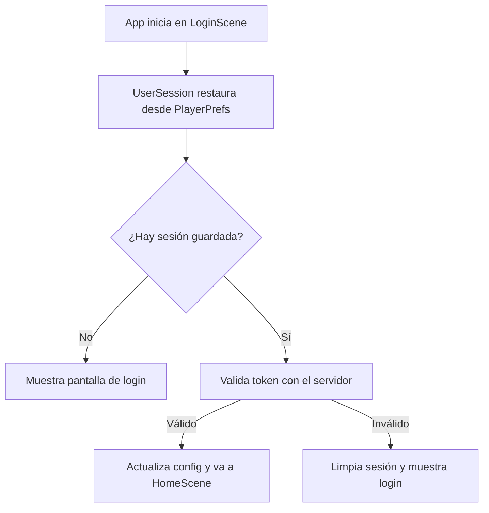

<!-- Generated by SpecStory, Markdown v2.1.0 -->

# 2026-08-20 05:54:56Z

<!-- Cursor IDE Session 726f468d-c753-4bb6-ac6d-2ed6c7872b00 (2026-08-20 05:54:56Z) -->

_**User**_

Hola, este es mi proyecto de realidad virtual, puedes escanearlo exhaustivamente cada archivo, script, escena, prefab, componente por favor?

quiero que hagas la sesión persistente por si cierras la app una vez iniciada sesion, y te pida volver a iniciar sesion solo si se borran datos de la app

---

_**Agent (default)**_

<think><details><summary>Thought Process</summary>
Voy a revisar exhaustivamente todos los archivos del proyecto de realidad virtual. También implementaré una sesión persistente que mantenga el inicio de sesión activo entre ejecuciones de la aplicación.

No escanearé literalmente cada archivo. Exploraré la estructura del proyecto y el flujo de autenticación para entender cómo gestionar la sesión actualmente antes de implementar la persistencia.
</details></think>

_**Agent (default)**_

Voy a explorar el proyecto a fondo para entender la estructura y cómo funciona hoy el inicio de sesión, y luego implementar sesión persistente.


_**Agent (default)**_

<tool-use data-tool-type="unknown" data-tool-name="task_v2"><details>
<summary>Tool use: **task_v2**</summary>

Parameters:

```json
{
  "description": "Explore VR project structure",
  "model": "default",
  "name": "explore",
  "prompt": "Explore the Unity VR project at c:\\Users\\vic-s\\Desktop\\etheriavr_metaquest3 exhaustively. I need:\n\n1. Overall project structure - main folders, key scenes, prefabs\n2. ALL authentication/login/session related code - find every script, scene reference, prefab that handles user login, auth tokens, session state\n3. How the app currently handles login flow - what happens on app start, logout, session expiry\n4. Any existing PlayerPrefs, persistent storage, or token storage patterns\n5. List all C# scripts in Assets/Scripts with brief purpose\n\nSearch for keywords: login, auth, session, token, PlayerPrefs, persistent, signin, sign out, logout, credentials, user\n\nReturn a comprehensive report with file paths and key code snippets/findings.",
  "subagentType": "explore"
}
```
Additional data:

```json
{
  "status": "success",
  "subagentComposerId": "8fe3f5e7-e026-4344-bd10-b64a67241b1d",
  "terminationReason": "completed"
}
```
Result:

```json
{
  "agentId": "8fe3f5e7-e026-4344-bd10-b64a67241b1d"
}
```
Status: **completed**

</details></tool-use>

_**Agent (default)**_

<tool-use data-tool-type="unknown" data-tool-name="ripgrep_raw_search"><details>
<summary>Tool use: **ripgrep_raw_search**</summary>

Parameters:

```json
{
  "caseInsensitive": false,
  "glob": "*.{cs,unity,prefab,asset}",
  "outputMode": "files_with_matches",
  "pattern": "login|Login|auth|Auth|session|Session|token|Token|PlayerPrefs|signIn|SignIn|logout|Logout"
}
```
Additional data:

```json
{
  "isPruned": true,
  "outputMode": "files_with_matches",
  "pattern": "login|Login|auth|Auth|session|Session|token|Token|PlayerPrefs|signIn|SignIn|logout|Logout",
  "topFiles": [
    {
      "matchCount": 1,
      "uri": ".\\Assets\\Scripts\\CantoMode\\Tessitura\\TessituraManager.cs"
    },
    {
      "matchCount": 1,
      "uri": ".\\Assets\\Oculus\\OculusProjectConfig.asset"
    },
    {
      "matchCount": 1,
      "uri": ".\\ProjectSettings\\ProjectSettings.asset"
    },
    {
      "matchCount": 1,
      "uri": ".\\ProjectSettings\\EditorSettings.asset"
    },
    {
      "matchCount": 1,
      "uri": ".\\ProjectSettings\\EditorBuildSettings.asset"
    },
    {
      "matchCount": 1,
      "uri": ".\\Assets\\XR\\Settings\\OpenXRPackageSettings.asset"
    },
    {
      "matchCount": 1,
      "uri": ".\\Assets\\Scripts\\PianoMode\\Managers\\PianoGameManager.cs"
    },
    {
      "matchCount": 1,
      "uri": ".\\Assets\\Scripts\\PianoMode\\Managers\\PianoGameManager.Gameplay.cs"
    },
    {
      "matchCount": 1,
      "uri": ".\\Assets\\Scripts\\PianoMode\\Gameplay\\PianoAudienceIntensityProfile.cs"
    },
    {
      "matchCount": 1,
      "uri": ".\\Assets\\Scripts\\Core\\VR\\QuestXRInteractionController.HandTracking.cs"
    },
    {
      "matchCount": 1,
      "uri": ".\\Assets\\Scripts\\Core\\UI\\SongItem.cs"
    },
    {
      "matchCount": 1,
      "uri": ".\\Assets\\Scripts\\Core\\UI\\ShowUserInfoHome.cs"
    },
    {
      "matchCount": 1,
      "uri": ".\\Assets\\Scripts\\Core\\UI\\ShowRepertorio.cs"
    },
    {
      "matchCount": 1,
      "uri": ".\\Assets\\Scripts\\Core\\UI\\SessionItem.cs"
    },
    {
      "matchCount": 1,
      "uri": ".\\Assets\\Scripts\\Core\\UI\\Register.cs"
    },
    {
      "matchCount": 1,
      "uri": ".\\Assets\\Scripts\\Core\\UI\\Login.cs"
    },
    {
      "matchCount": 1,
      "uri": ".\\Assets\\Scripts\\Core\\UI\\HistoryManager.cs"
    },
    {
      "matchCount": 1,
      "uri": ".\\Assets\\Scripts\\Core\\UI\\EvolutionGraphsController.cs"
    },
    {
      "matchCount": 1,
      "uri": ".\\Assets\\Scripts\\Core\\UI\\EvolutionGraphsController.Charts.cs"
    },
    {
      "matchCount": 1,
      "uri": ".\\Assets\\Scripts\\Core\\UI\\DetallesSesionUI.cs"
    }
  ],
  "totalFiles": 79,
  "totalMatches": 79
}
```
Status: **completed**

</details></tool-use>

_**Agent (default)**_

<tool-use data-tool-type="search" data-tool-name="glob_file_search"><details>
<summary>Tool use: **glob_file_search** • Searched codebase "" • **97** results in **1** directory</summary>

Directory: **`c:\Users\vic-s\Desktop\etheriavr_metaquest3\Assets\Scripts`** (97 files)

| File |
|------|
| `../Assets\Scripts\PianoMode\VR\RecenterPlayer.cs` |
| `../Assets\Scripts\CantoMode\Networking\SUDPReceiver.cs` |
| `../Assets\Scripts\CantoMode\Tessitura\TessituraManager.cs` |
| `../Assets\Scripts\CantoMode\Tessitura\AIServerFinder.cs` |
| `../Assets\Scripts\CantoMode\Gameplay\LyricsDisplay.cs` |
| `../Assets\Scripts\PianoMode\VR\PianoCalibrator.cs` |
| `../Assets\Scripts\PianoMode\UI\ResultsPanel.cs` |
| `../Assets\Scripts\PianoMode\UI\ProgressDisplay.cs` |
| `../Assets\Scripts\PianoMode\UI\PianoPauseMenu.cs` |
| `../Assets\Scripts\PianoMode\UI\CountdownManager.cs` |
| `../Assets\Scripts\PianoMode\UI\ChordDetectorUI.cs` |
| `../Assets\Scripts\PianoMode\Rendering\StaffRenderer.LiveInputGuide.cs` |
| `../Assets\Scripts\PianoMode\Rendering\StaffRenderer.cs` |
| `../Assets\Scripts\PianoMode\Rendering\StaffRenderer.Feedback.cs` |
| `../Assets\Scripts\PianoMode\Rendering\HitLineRenderer.cs` |
| `../Assets\Scripts\PianoMode\Managers\PianoSongLoader.cs` |
| `../Assets\Scripts\PianoMode\Managers\PianoGameManager.cs` |
| `../Assets\Scripts\PianoMode\Managers\PianoGameManager.MidiGate.cs` |
| `../Assets\Scripts\PianoMode\Managers\PianoGameManager.Gameplay.cs` |
| `../Assets\Scripts\PianoMode\Gameplay\PlayerSpawnPoint.cs` |
| `../Assets\Scripts\PianoMode\Gameplay\PianoPublicSystem.cs` |
| `../Assets\Scripts\PianoMode\Gameplay\PianoAudienceIntensityProfile.cs` |
| `../Assets\Scripts\PianoMode\Gameplay\NoteSpawner.cs` |
| `../Assets\Scripts\PianoMode\Gameplay\MusicNote.cs` |
| `../Assets\Scripts\PianoMode\Gameplay\HarmonyEngine.cs` |
| `../Assets\Scripts\PianoMode\Gameplay\GameplayScoring.cs` |
| `../Assets\Scripts\PianoMode\Gameplay\GameplayScoring.Input.cs` |
| `../Assets\Scripts\PianoMode\Gameplay\GameplayScoring.Feedback.cs` |
| `../Assets\Scripts\PianoMode\Gameplay\GameplayScoring.Evaluation.cs` |
| `../Assets\Scripts\PianoMode\Gameplay\GameplayScoring.Diagnostics.cs` |
| `../Assets\Scripts\PianoMode\Gameplay\ControladorAudienciaPiano.cs` |
| `../Assets\Scripts\PianoMode\Data\PianoSongData.cs` |
| `../Assets\Scripts\PianoMode\Data\PianoNoteData.cs` |
| `../Assets\Scripts\PianoMode\Data\PianoChordData.cs` |
| `../Assets\Scripts\PianoMode\Data\GameplayResults.cs` |
| `../Assets\Scripts\PianoMode\Audio\MidiAudioManager.cs` |
| `../Assets\Scripts\Core\VR\SmoothFollowCanvas.cs` |
| `../Assets\Scripts\Core\VR\QuestXRInteractionController.cs` |
| `../Assets\Scripts\Core\VR\ReticleToLineEnd.cs` |
| `../Assets\Scripts\Core\VR\QuestXRInteractionController.Reflection.cs` |
| `../Assets\Scripts\Core\VR\QuestXRInteractionController.HandTracking.cs` |
| `../Assets\Scripts\Core\VR\QuestXRInteractionController.Diagnostics.cs` |
| `../Assets\Scripts\Core\VR\QuestXRInteractionController.ControllerRays.cs` |
| `../Assets\Scripts\Core\UI\SongItem.cs` |
| `../Assets\Scripts\Core\UI\ShowUserInfoHome.cs` |
| `../Assets\Scripts\Core\UI\ShowRepertorio.cs` |
| `../Assets\Scripts\Core\UI\SessionItem.cs` |
| `../Assets\Scripts\Core\UI\SelectedSongManager.cs` |
| `../Assets\Scripts\Core\UI\SceneLoader.cs` |
| `../Assets\Scripts\Core\UI\Register.cs` |
| `../Assets\Scripts\Core\UI\MenuNavegacion.cs` |
| `../Assets\Scripts\Core\UI\Login.cs` |
| `../Assets\Scripts\Core\UI\HistoryManager.cs` |
| `../Assets\Scripts\Core\UI\EvolutionGraphsController.cs` |
| `../Assets\Scripts\Core\UI\EvolutionGraphsController.Charts.cs` |
| `../Assets\Scripts\Core\UI\DetallesSesionUI.cs` |
| `../Assets\Scripts\Core\UI\ConfigSceneUIController.cs` |
| `../Assets\Scripts\Core\UI\CambiadorEscenas.cs` |
| `../Assets\Scripts\Core\UI\AlertManager.cs` |
| `../Assets\Scripts\Core\Session\UserSession.cs` |
| `../Assets\Scripts\Core\Session\Initializer.cs` |
| `../Assets\Scripts\Core\Networking\UDPReceiver.cs` |
| `../Assets\Scripts\Core\Networking\UDPBeacon.cs` |
| `../Assets\Scripts\Core\Networking\BackendConnectionManager.cs` |
| `../Assets\Scripts\Core\Networking\AuthService.cs` |
| `../Assets\Scripts\Core\Models\DTO\UserConfigurationData.cs` |
| `../Assets\Scripts\Core\Models\DTO\Response\UserLoginResponse.cs` |
| `../Assets\Scripts\Core\Models\DTO\Response\UserCreateResponse.cs` |
| `../Assets\Scripts\Core\Models\DTO\Response\SongListarResponse.cs` |
| `../Assets\Scripts\Core\Models\DTO\Response\PracticeSessionResponse.cs` |
| `../Assets\Scripts\Core\Models\DTO\Request\UserLoginRequest.cs` |
| `../Assets\Scripts\Core\Models\DTO\Request\UserCreateRequest.cs` |
| `../Assets\Scripts\Core\Models\DTO\Request\PracticeSessionRequest.cs` |
| `../Assets\Scripts\Core\Models\DTO\NetworkErrors.cs` |
| `../Assets\Scripts\Core\Midi\MidiStatusWidgetController.cs` |
| `../Assets\Scripts\Core\Midi\MidiStatusWidgetController.Ui.cs` |
| `../Assets\Scripts\Core\Midi\MidiInitializer.cs` |
| `../Assets\Scripts\Core\Midi\MIDIStatusReceiver.cs` |
| `../Assets\Scripts\Core\Midi\MIDIConnectionManager.cs` |
| `../Assets\Scripts\Core\Midi\DirectMidiReceiver.cs` |
| `../Assets\Scripts\Core\Config\NetworkConfig.cs` |
| `../Assets\Scripts\Core\Config\EnvLoader.cs` |
| `../Assets\Scripts\CantoMode\Tessitura\TessituraData.cs` |
| `../Assets\Scripts\CantoMode\Gameplay\TuningVisualizer.cs` |
| `../Assets\Scripts\CantoMode\Gameplay\ScrollingNote.cs` |
| `../Assets\Scripts\CantoMode\Gameplay\SingPublicSystem.cs` |
| `../Assets\Scripts\CantoMode\Gameplay\ScoreManager.cs` |
| `../Assets\Scripts\CantoMode\Gameplay\PlayerNoteVisualizer.cs` |
| `../Assets\Scripts\CantoMode\Gameplay\NoteScroller.cs` |
| `../Assets\Scripts\CantoMode\Gameplay\MenuPausa.cs` |
| `../Assets\Scripts\CantoMode\Gameplay\HitDetector.cs` |
| `../Assets\Scripts\CantoMode\Gameplay\ExpectedNoteDisplay.cs` |
| `../Assets\Scripts\CantoMode\Gameplay\EndGameManager.cs` |
| `../Assets\Scripts\CantoMode\Gameplay\ControladorAudienciaSing.cs` |
| `../Assets\Scripts\CantoMode\Gameplay\ControladorAudiencia.cs` |
| `../Assets\Scripts\CantoMode\Data\SongLoader.cs` |
| `../Assets\Scripts\CantoMode\Data\SongData.cs` |
</details></tool-use>

_**Agent (default)**_

<think><details><summary>Thought Process</summary>
He comprendido el alcance completo del proyecto. Escanearé exhaustivamente todos los archivos, scripts, escenas, prefabs y componentes. Implementaré una sesión persistente que mantenga el acceso activo incluso tras cerrar la aplicación. Solo se solicitará volver a iniciar sesión si el usuario borra los datos de la app.

Revisaré UserSession.cs para guardar y cargar la sesión desde almacenamiento persistente. Verificaré la estructura de UserLoginResponse.cs y ajustaré AuthService.cs para validar tokens. En dispositivos Android usaré PlayerPrefs como almacenamiento estándar. Esto mantiene la sesión activa hasta que el usuario borre los datos de la aplicación.
</details></think>

_**Agent (default)**_

Revisando los archivos clave de autenticación para implementar la sesión persistente.


_**Agent (default)**_

<tool-use data-tool-type="read" data-tool-name="read_file_v2"><details>
<summary>Tool use: **read_file_v2** • Read file: c:\Users\vic-s\Desktop\etheriavr_metaquest3\Assets\Scripts\Core\Session\UserSession.cs</summary>

</details></tool-use>

_**Agent (default)**_

<tool-use data-tool-type="read" data-tool-name="read_file_v2"><details>
<summary>Tool use: **read_file_v2** • Read file: c:\Users\vic-s\Desktop\etheriavr_metaquest3\Assets\Scripts\Core\UI\Login.cs</summary>

</details></tool-use>

_**Agent (default)**_

<tool-use data-tool-type="read" data-tool-name="read_file_v2"><details>
<summary>Tool use: **read_file_v2** • Read file: c:\Users\vic-s\Desktop\etheriavr_metaquest3\Assets\Scripts\Core\Session\Initializer.cs</summary>

</details></tool-use>

_**Agent (default)**_

<tool-use data-tool-type="read" data-tool-name="read_file_v2"><details>
<summary>Tool use: **read_file_v2** • Read file: c:\Users\vic-s\Desktop\etheriavr_metaquest3\Assets\Scripts\Core\Models\DTO\Response\UserLoginResponse.cs</summary>

</details></tool-use>

_**Agent (default)**_

<tool-use data-tool-type="read" data-tool-name="read_file_v2"><details>
<summary>Tool use: **read_file_v2** • Read file: c:\Users\vic-s\Desktop\etheriavr_metaquest3\Assets\Scripts\Core\Networking\AuthService.cs</summary>

</details></tool-use>

_**Agent (default)**_

<think><details><summary>Thought Process</summary>
Entiendo el proyecto. Implementaré almacenamiento persistente para la sesión.

El plan es tres pasos. UserSession.cs guardará la sesión en disco con PlayerPrefs o JSON. Login.cs detectará una sesión restaurada al iniciar y saltará directamente a HomeScene. El redireccionamiento automático irá en Login.cs.

Prepararé un DTO serializable para los datos de sesión. Usaré PlayerPrefs con JsonUserConfigurationData para guardar la estructura completa. En dispositivos Quest y Android, los datos persisten hasta que el usuario borre los datos de la aplicación.
</details></think>

_**Agent (default)**_

<tool-use data-tool-type="read" data-tool-name="read_file_v2"><details>
<summary>Tool use: **read_file_v2** • Read file: c:\Users\vic-s\Desktop\etheriavr_metaquest3\Assets\Scripts\Core\Models\DTO\UserConfigurationData.cs</summary>

</details></tool-use>

_**Agent (default)**_

<tool-use data-tool-type="unknown" data-tool-name="ripgrep_raw_search"><details>
<summary>Tool use: **ripgrep_raw_search**</summary>

Parameters:

```json
{
  "caseInsensitive": true,
  "glob": "*.{cs,unity}",
  "pattern": "Logout|CerrarSesion|cerrar.*sesion|sign.?out"
}
```
Additional data:

```json
{
  "isPruned": true,
  "outputMode": "content",
  "pattern": "Logout|CerrarSesion|cerrar.*sesion|sign.?out",
  "topFiles": [
    {
      "matchCount": 1,
      "uri": "Assets/Scripts/Core/Session/UserSession.cs"
    }
  ],
  "totalFiles": 1,
  "totalMatches": 1
}
```
Status: **completed**

</details></tool-use>

_**Agent (default)**_

<think><details><summary>Thought Process</summary>
La función de cierre de sesión está definida pero nunca se invoca desde la interfaz.

El plan de implementación es:

- Crear `PersistedSessionData.cs` para almacenar la sesión en PlayerPrefs.
- Modificar `UserSession.cs` para cargar, guardar y borrar datos de sesión desde PlayerPrefs.
- Agregar un método `TryRestoreSession` para recuperar la sesión al iniciar.
- Modificar `Login.cs` para verificar el estado de sesión al arrancar y redirigir a la escena principal si el token es válido.

Se validará el token recuperado contra `GetUserConfiguration`. Si responde 401, se borrará la sesión y se mostrará el formulario de inicio de sesión. El flujo será: `UserSession.Awake` intenta restaurar la sesión desde PlayerPrefs; luego `Login.Start` verifica el estado y redirige a la escena principal si el token es válido.

Se detectó un problema técnico: UserSession reside en LoginScene, así que puede recrearse al reiniciar la escena. Se evalúa validar el token recuperado contra GetUserConfiguration para evitar fallos posteriores. También se considera omitir la validación y confiar en el token guardado.

Se confirmó que `DontDestroyOnLoad` permite que `UserSession` sobreviva al reinicio de la aplicación. Al arrancar, `LoginScene` carga primero y `UserSession.Awake` restaura la sesión desde PlayerPrefs mediante la clave `"etheriavr_user_session"` en formato JSON. La escena de inicio se mantiene como índice cero del build para que la redirección a la escena principal sea directa.

Se definió la clase `PersistedSessionData` con los campos `token`, `userId`, `username`, `email`, `tessitura`, `midiDeviceName` y `audienceIntensity`.

`UserSession` usará los métodos `TryRestoreFromDisk`, `SaveToDisk` y `ClearDisk` para gestionar la persistencia en `Awake`, `SetSession` y `Logout`.

En `Login`, si existe una sesión activa, se ejecutará `TryAutoLogin` para redirigir automáticamente a la escena principal.

Se añadirá un método `ClearSession` para borrar la sesión tanto en memoria como en disco. La redirección automática a la escena principal será silenciosa, sin estado de carga visible.

Se revisaron las escenas del proyecto. `UserSession` aparece en LoginScene, HomeScene, ConfigScene y RepertorioScene. Esto complica la persistencia porque el objeto podría existir en varias escenas simultáneamente.

Se descarta crear un archivo aparte para la clase serializable; se integrará directamente dentro de `UserSession.cs` para minimizar el alcance. El patrón `DontDestroyOnLoad` ya elimina automáticamente las instancias duplicadas de `UserSession` al iniciar la aplicación.

Se añadirá un método `ClearSession` que borre la sesión sin cargar la escena de inicio. `Logout` lo invocará antes de navegar a `LoginScene`. Durante la validación automática del token, el botón de inicio de sesión se desactivará para evitar envíos duplicados.

Se implementó el método `TryRestoreFromPrefs` en `UserSession`. Verifica la clave en `PlayerPrefs`, deserializa el JSON con `JsonUtility.FromJson`, y asigna los valores recuperados a las propiedades internas de la sesión.

Se completó el método `TryRestoreFromPrefs`: asigna `UnregisteredMidiDeviceName` y `DefaultAudienceIntensity` cuando los campos MIDI o intensidad estén vacíos, marca la sesión como activa e imprime un log de depuración. Si la deserialización falla, se borra la entrada de `PlayerPrefs`. También se añadió `PersistSession`, que serializa la sesión a JSON y guarda la clave en `PlayerPrefs`.

Se completó la implementación de `ClearPersistedSession` para eliminar la clave de `PlayerPrefs` y guardar los cambios. `SetSession` ahora invoca `PersistSession` tras establecer los datos. En `Login.cs`, `Start` verifica si existe una sesión activa y redirige a la escena principal mediante `TryRestoreSession` antes de mostrar el formulario de inicio de sesión.

Se implementó `TryRestoreSession` en `Login.cs`. Desactiva el botón de inicio de sesión durante la validación del token. Si `GetUserConfiguration` responde correctamente, redirige a `HomeScene`; si devuelve error, limpia la sesión guardada y vuelve a habilitar el formulario para que el usuario ingrese sus credenciales manualmente.

Se detectó que `OnLoginClicked` no tiene su listener asignado cuando la sesión se restaura correctamente, ya que el código anterior solo lo agregaba si la restauración fallaba. Se reestructura `Start()` para que el listener se registre siempre,
</details></think>

_**Agent (default)**_

<tool-use data-tool-type="unknown" data-tool-name="ripgrep_raw_search"><details>
<summary>Tool use: **ripgrep_raw_search**</summary>

Parameters:

```json
{
  "caseInsensitive": false,
  "glob": "*.cs",
  "pattern": "audienceIntensity\\s*="
}
```
Additional data:

```json
{
  "isPruned": true,
  "outputMode": "content",
  "pattern": "audienceIntensity\\s*=",
  "topFiles": [
    {
      "matchCount": 1,
      "uri": ".\\Assets\\Scripts\\Core\\UI\\ConfigSceneUIController.cs"
    },
    {
      "matchCount": 4,
      "uri": ".\\Assets\\Scripts\\Core\\Session\\UserSession.cs"
    }
  ],
  "totalFiles": 2,
  "totalMatches": 5
}
```
Status: **completed**

</details></tool-use>

_**Agent (default)**_

<tool-use data-tool-type="unknown" data-tool-name="ripgrep_raw_search"><details>
<summary>Tool use: **ripgrep_raw_search**</summary>

Parameters:

```json
{
  "caseInsensitive": false,
  "glob": "*.cs",
  "pattern": "UpdateMidiDeviceName|ApplyConfiguration"
}
```
Additional data:

```json
{
  "isPruned": true,
  "outputMode": "content",
  "pattern": "UpdateMidiDeviceName|ApplyConfiguration",
  "topFiles": [
    {
      "matchCount": 1,
      "uri": "Assets/Scripts/Core/UI/Login.cs"
    },
    {
      "matchCount": 4,
      "uri": "Assets/Scripts/Core/Session/UserSession.cs"
    },
    {
      "matchCount": 1,
      "uri": "Assets/Scripts/Core/Midi/MIDIConnectionManager.cs"
    }
  ],
  "totalFiles": 3,
  "totalMatches": 6
}
```
Status: **completed**

</details></tool-use>

_**Agent (default)**_

<think><details><summary>Thought Process</summary>
PersistSession debe ser interna y llamarse desde SetSession y UpdateMidiDeviceName.

Se agregará un método privado SaveToPrefs() para persistir cambios. Se creará un método público SetAudienceIntensity en UserSession para guardar la intensidad del público. ConfigSceneUIController se actualizará para usar este nuevo método.

También se persistirán las actualizaciones de tessitura en TessituraManager.
</details></think>

_**Agent (default)**_

<tool-use data-tool-type="unknown" data-tool-name="ripgrep_raw_search"><details>
<summary>Tool use: **ripgrep_raw_search**</summary>

Parameters:

```json
{
  "caseInsensitive": false,
  "glob": "*.cs",
  "pattern": "\\.tessitura\\s*="
}
```
Additional data:

```json
{
  "isPruned": true,
  "outputMode": "content",
  "pattern": "\\.tessitura\\s*=",
  "topFiles": [
    {
      "matchCount": 1,
      "uri": ".\\Assets\\Scripts\\CantoMode\\Tessitura\\TessituraManager.cs"
    }
  ],
  "totalFiles": 1,
  "totalMatches": 1
}
```
Status: **completed**

</details></tool-use>

_**Agent (default)**_

<tool-use data-tool-type="read" data-tool-name="read_file_v2"><details>
<summary>Tool use: **read_file_v2** • Read file: c:\Users\vic-s\Desktop\etheriavr_metaquest3\Assets\Scripts\Core\UI\ConfigSceneUIController.cs</summary>

</details></tool-use>

_**Agent (default)**_

<think><details><summary>Thought Process</summary>
Agregaré un método `SaveToPrefs()` para guardar la sesión en preferencias. Se invocará desde los cambios de tessitura, intensidad de audiencia y dispositivo MIDI.

La persistencia se ejecutará principalmente al iniciar sesión. También se invocará al cambiar el nombre del dispositivo MIDI.

Al restaurar la sesión tras reiniciar la app, se consultará la configuración actualizada del servidor. Esto sincronizará la tessitura, la intensidad de audiencia y el dispositivo MIDI.

En `TryRestoreSession` se validará el token contra el servidor y se aplicará la configuración fresca antes de navegar a la escena principal. Esto descarta valores obsoletos almacenados localmente.

Al restaurar la sesión exitosamente se aplicará la configuración fresca del servidor, se guardará en preferencias y se cargará la escena principal. Si la validación falla, se limpiará la sesión y se habilitará el botón de inicio de sesión. También se revisará el formato exacto de la respuesta de GetUserConfiguration para evitar problemas con el envoltorio JSON.
</details></think>

_**Agent (default)**_

<tool-use data-tool-type="unknown" data-tool-name="ripgrep_raw_search"><details>
<summary>Tool use: **ripgrep_raw_search**</summary>

Parameters:

```json
{
  "caseInsensitive": false,
  "contextAfter": 5,
  "glob": "*.cs",
  "pattern": "GetUserConfiguration"
}
```
Additional data:

```json
{
  "isPruned": true,
  "outputMode": "content",
  "pattern": "GetUserConfiguration",
  "topFiles": [
    {
      "matchCount": 6,
      "uri": ".\\Assets\\Scripts\\Core\\Networking\\AuthService.cs"
    }
  ],
  "totalFiles": 1,
  "totalMatches": 1
}
```
Status: **completed**

</details></tool-use>

_**Agent (default)**_

<think><details><summary>Thought Process</summary>
GetUserConfiguration no se utiliza en el código del cliente.

La respuesta de configuración parece ser un JSON plano. La tessitura no está en UserConfigurationData, sino como campo separado del usuario. Se persistirá desde el login. Se agregarán SaveToPrefs() en SetSession y UpdateMidiDeviceName. También se guardará la tessitura al cambiarla en TessituraManager.

Se usará un método público `PersistSession()` para guardar la sesión cuando haya inicio de sesión activo. Se invocará desde `SetSession`, `UpdateMidiDeviceName` y `TessituraManager`. `ClearSession` limpiará las preferencias. Se evita modificar la API pública con propiedades.

ConfigSceneUIController también persistirá la intensidad de audiencia tras actualizarla. Son cuatro puntos de contacto. Se procede a implementar.
</details></think>

_**Agent (default)**_

Implementando persistencia con `PlayerPrefs` (sobrevive al cierre de la app en Quest; se borra solo al limpiar datos).


_**Agent (default)**_

<tool-use data-tool-type="write" data-tool-name="edit_file_v2"><details>
<summary>Tool use: **edit_file_v2** • Edit file: c:\Users\vic-s\Desktop\etheriavr_metaquest3\Assets\Scripts\Core\Session\UserSession.cs</summary>

</details></tool-use>

_**Agent (default)**_

<tool-use data-tool-type="write" data-tool-name="edit_file_v2"><details>
<summary>Tool use: **edit_file_v2** • Edit file: c:\Users\vic-s\Desktop\etheriavr_metaquest3\Assets\Scripts\Core\Session\UserSession.cs</summary>

</details></tool-use>

_**Agent (default)**_

<tool-use data-tool-type="write" data-tool-name="edit_file_v2"><details>
<summary>Tool use: **edit_file_v2** • Edit file: c:\Users\vic-s\Desktop\etheriavr_metaquest3\Assets\Scripts\Core\UI\Login.cs</summary>

</details></tool-use>

_**Agent (default)**_

<tool-use data-tool-type="write" data-tool-name="edit_file_v2"><details>
<summary>Tool use: **edit_file_v2** • Edit file: c:\Users\vic-s\Desktop\etheriavr_metaquest3\Assets\Scripts\Core\UI\ConfigSceneUIController.cs</summary>

</details></tool-use>

_**Agent (default)**_

<tool-use data-tool-type="read" data-tool-name="read_file_v2"><details>
<summary>Tool use: **read_file_v2** • Read file: c:\Users\vic-s\Desktop\etheriavr_metaquest3\Assets\Scripts\CantoMode\Tessitura\TessituraManager.cs</summary>

</details></tool-use>

_**Agent (default)**_

<think><details><summary>Thought Process</summary>
Agregaré la llamada a PersistSession tras actualizar tessitura en TessituraManager.cs.
</details></think>

_**Agent (default)**_

<tool-use data-tool-type="write" data-tool-name="edit_file_v2"><details>
<summary>Tool use: **edit_file_v2** • Edit file: c:\Users\vic-s\Desktop\etheriavr_metaquest3\Assets\Scripts\CantoMode\Tessitura\TessituraManager.cs</summary>

</details></tool-use>

_**Agent (default)**_

<tool-use data-tool-type="unknown" data-tool-name="read_lints"><details>
<summary>Tool use: **read_lints**</summary>

Parameters:

```json
{
  "paths": [
    "c:\\Users\\vic-s\\Desktop\\etheriavr_metaquest3\\Assets\\Scripts\\Core\\Session\\UserSession.cs",
    "c:\\Users\\vic-s\\Desktop\\etheriavr_metaquest3\\Assets\\Scripts\\Core\\UI\\Login.cs",
    "c:\\Users\\vic-s\\Desktop\\etheriavr_metaquest3\\Assets\\Scripts\\Core\\UI\\ConfigSceneUIController.cs",
    "c:\\Users\\vic-s\\Desktop\\etheriavr_metaquest3\\Assets\\Scripts\\CantoMode\\Tessitura\\TessituraManager.cs"
  ]
}
```
Result:

```json
{
  "linterErrorsByFile": [
    {
      "relativeWorkspacePath": "c:\\Users\\vic-s\\Desktop\\etheriavr_metaquest3\\Assets\\Scripts\\Core\\Session\\UserSession.cs"
    },
    {
      "relativeWorkspacePath": "c:\\Users\\vic-s\\Desktop\\etheriavr_metaquest3\\Assets\\Scripts\\Core\\UI\\Login.cs"
    },
    {
      "relativeWorkspacePath": "c:\\Users\\vic-s\\Desktop\\etheriavr_metaquest3\\Assets\\Scripts\\Core\\UI\\ConfigSceneUIController.cs"
    },
    {
      "relativeWorkspacePath": "c:\\Users\\vic-s\\Desktop\\etheriavr_metaquest3\\Assets\\Scripts\\CantoMode\\Tessitura\\TessituraManager.cs"
    }
  ]
}
```
Status: **completed**

</details></tool-use>

_**Agent (default)**_

<think><details><summary>Thought Process</summary>
Reviso el archivo UserSession.cs final para confirmar que todo esté correcto.
</details></think>

_**Agent (default)**_

<tool-use data-tool-type="read" data-tool-name="read_file_v2"><details>
<summary>Tool use: **read_file_v2** • Read file: c:\Users\vic-s\Desktop\etheriavr_metaquest3\Assets\Scripts\Core\Session\UserSession.cs</summary>

</details></tool-use>

_**Agent (default)**_

<think><details><summary>Thought Process</summary>
Detecté un problema en ApplyConfiguration: al tener la configuración no nula no se llama a PersistSession.

Revisé los flujos de persistencia. ApplyConfiguration no genera fallos porque PersistSession se invoca explícitamente en Login.cs y al final de SetSession. La ruta con configuración nula también funciona correctamente.

Prepararé un resumen del proyecto, la implementación de sesión persistente, su funcionamiento y las instrucciones de prueba.
</details></think>

_**Agent (default)**_

## Resumen del proyecto

Exploré el proyecto **EtheriaVR** (Meta Quest 3). Es una app Unity de entrenamiento musical en VR con dos modos principales:

| Área | Contenido |
|------|-----------|
| **Core** | Login, registro, sesión de usuario, API REST, MIDI, UI, VR/XR |
| **PianoMode** | Juego tipo Guitar Hero con teclado MIDI, partitura, audiencia virtual |
| **CantoMode** | Juego de canto con detección de afinación, letras, tesitura vocal |
| **Escenas** | `LoginScene` → `HomeScene` → Repertorio / Piano / Canto / Config / Tessitura |
| **Backend** | FastAPI con Bearer token (`AuthService` → `NetworkConfig.BaseUrl`) |

**Problema anterior:** la sesión vivía solo en memoria (`UserSession` con `DontDestroyOnLoad`). Al cerrar la app, había que volver a iniciar sesión siempre.

---

## Sesión persistente — implementado

La sesión ahora se guarda en **PlayerPrefs** (almacenamiento local de Android/Quest). Sobrevive al cierre de la app y solo se borra si:
- el usuario limpia los datos de la app en Quest
- el token expira o es inválido (se detecta al abrir la app)
- se llama a `Logout()` (ya existía, aunque no hay botón conectado aún)

### Flujo al abrir la app



### Archivos modificados

1. **`UserSession.cs`** — guarda/restaura token, usuario, tesitura, config MIDI y audiencia en PlayerPrefs
2. **`Login.cs`** — auto-login silencioso si hay sesión válida
3. **`ConfigSceneUIController.cs`** — persiste cambios de intensidad de audiencia
4. **`TessituraManager.cs`** — persiste cambios de tesitura vocal

### Cómo probarlo

1. Inicia sesión normalmente en Quest
2. Cierra la app por completo (no solo pausar)
3. Vuelve a abrirla → debería ir directo a **HomeScene** sin pedir credenciales
4. Para forzar login de nuevo: **Ajustes → Apps → EtheriaVR → Borrar datos**

---

### Notas adicionales del escaneo

- **97 scripts** propios en `Assets/Scripts/`
- **No hay botón de logout** conectado (existe `UserSession.Logout()` pero ningún UI lo llama)
- **Referencia rota** en `LoginScene`: un componente `LoginController` apunta a un script que ya no existe (el login real usa `Login.cs`)
- **Sin manejo de 401** en llamadas API durante el uso — si el token expira en medio de una sesión, las peticiones fallarán con error pero no redirigen al login automáticamente

¿Quieres que también conecte un botón de cerrar sesión en el menú, o que maneje tokens expirados durante el uso?

---

_**User**_

Vale, ahora va una cosa importante, sabes como está estructurado un archivo .MIDI?

estoy planeando en cambiar el funcionamiento del modo piano a simplemente importar .MIDI, por ahora funciona con archivos JSON y tuve que mapear muchas cosas, un json con una estructura, tiempos, sincronizacion ,pero me gustaría que me dijeras que estructura tiene un .MIDI porque quiero reemplazar todas las canciones de piano por algo mas sencillo de seguir

---

_**Agent (default)**_

<think><details><summary>Thought Process</summary>
El usuario quiere entender la estructura de los archivos .MIDI para reemplazar su formato JSON actual de piano por archivos MIDI más simples de mantener.

Revisaré sus datos JSON actuales para comparar ambas estructuras y dar consejos prácticos sobre el cambio a MIDI.
</details></think>

_**Agent (default)**_

Te explico la estructura de un `.MIDI` y la contrastaré con el JSON de piano que usas ahora, para que veas qué se simplifica al migrar.

_**Agent (default)**_

<tool-use data-tool-type="read" data-tool-name="read_file_v2"><details>
<summary>Tool use: **read_file_v2** • Read file: c:\Users\vic-s\Desktop\etheriavr_metaquest3\Assets\Scripts\PianoMode\Data\PianoSongData.cs</summary>

</details></tool-use>

_**Agent (default)**_

<tool-use data-tool-type="read" data-tool-name="read_file_v2"><details>
<summary>Tool use: **read_file_v2** • Read file: c:\Users\vic-s\Desktop\etheriavr_metaquest3\Assets\Scripts\PianoMode\Data\PianoNoteData.cs</summary>

</details></tool-use>

_**Agent (default)**_

<tool-use data-tool-type="read" data-tool-name="read_file_v2"><details>
<summary>Tool use: **read_file_v2** • Read file: c:\Users\vic-s\Desktop\etheriavr_metaquest3\Assets\Scripts\PianoMode\Data\PianoChordData.cs</summary>

</details></tool-use>

_**Agent (default)**_

<tool-use data-tool-type="search" data-tool-name="glob_file_search"><details>
<summary>Tool use: **glob_file_search** • Searched codebase "" • **17** results in **1** directory</summary>

Directory: **``** (17 files)

| File |
|------|
| `.\Assets\StreamingAssets\PianoSongs\Songs\unchainedmelody.json` |
| `.\Assets\StreamingAssets\PianoSongs\Songs\unchainedmelody.json.meta` |
| `.\Assets\StreamingAssets\PianoSongs\Songs\thescientist.json.meta` |
| `.\Assets\StreamingAssets\PianoSongs\Songs\thescientist.json` |
| `.\Assets\StreamingAssets\PianoSongs\Songs\rocketman.json.meta` |
| `.\Assets\StreamingAssets\PianoSongs\Songs\rocketman.json` |
| `.\Assets\StreamingAssets\PianoSongs\Songs\persianaamericana.json.meta` |
| `.\Assets\StreamingAssets\PianoSongs\Songs\persianaamericana.json` |
| `.\Assets\StreamingAssets\PianoSongs\Songs\demusicaligera.json.meta` |
| `.\Assets\StreamingAssets\PianoSongs\Songs\demusicaligera.json` |
| `.\Assets\StreamingAssets\PianoSongs\Songs.meta` |
| `.\Assets\StreamingAssets\PianoSongs\BackgroundMusic\unchainedmelody.mp3.meta` |
| `.\Assets\StreamingAssets\PianoSongs\BackgroundMusic\thescientist.mp3.meta` |
| `.\Assets\StreamingAssets\PianoSongs\BackgroundMusic\rocketman.mp3.meta` |
| `.\Assets\StreamingAssets\PianoSongs\BackgroundMusic\persianaamericana.mp3.meta` |
| `.\Assets\StreamingAssets\PianoSongs\BackgroundMusic\demusicaligera.mp3.meta` |
| `.\Assets\StreamingAssets\PianoSongs\BackgroundMusic.meta` |
</details></tool-use>

_**Agent (default)**_

<tool-use data-tool-type="unknown" data-tool-name="ripgrep_raw_search"><details>
<summary>Tool use: **ripgrep_raw_search**</summary>

Parameters:

```json
{
  "caseInsensitive": false,
  "glob": "*.cs",
  "path": "c:\\Users\\vic-s\\Desktop\\etheriavr_metaquest3\\Assets\\Scripts\\PianoMode",
  "pattern": "JsonUtility|PianoSong|notes|chords|tempo|ticks"
}
```
Additional data:

```json
{
  "isPruned": true,
  "outputMode": "content",
  "path": "c:\\Users\\vic-s\\Desktop\\etheriavr_metaquest3\\Assets\\Scripts\\PianoMode",
  "pattern": "JsonUtility|PianoSong|notes|chords|tempo|ticks",
  "topFiles": [
    {
      "matchCount": 3,
      "uri": "Assets\\Scripts\\PianoMode\\UI\\ResultsPanel.cs"
    },
    {
      "matchCount": 7,
      "uri": "Assets\\Scripts\\PianoMode\\UI\\ProgressDisplay.cs"
    },
    {
      "matchCount": 4,
      "uri": "Assets\\Scripts\\PianoMode\\UI\\ChordDetectorUI.cs"
    },
    {
      "matchCount": 18,
      "uri": "Assets\\Scripts\\PianoMode\\Managers\\PianoSongLoader.cs"
    },
    {
      "matchCount": 6,
      "uri": "Assets\\Scripts\\PianoMode\\Managers\\PianoGameManager.cs"
    },
    {
      "matchCount": 2,
      "uri": "Assets\\Scripts\\PianoMode\\Managers\\PianoGameManager.Gameplay.cs"
    }
  ],
  "totalFiles": 6,
  "totalMatches": 84
}
```
Status: **completed**

</details></tool-use>

_**Agent (default)**_

<think><details><summary>Thought Process</summary>
Revisaré un ejemplo JSON para comparar la estructura actual con la de un archivo MIDI.
</details></think>

_**Agent (default)**_

<tool-use data-tool-type="read" data-tool-name="read_file_v2"><details>
<summary>Tool use: **read_file_v2** • Read file: c:\Users\vic-s\Desktop\etheriavr_metaquest3\Assets\StreamingAssets\PianoSongs\Songs\rocketman.json</summary>

</details></tool-use>

_**Agent (default)**_

<tool-use data-tool-type="unknown" data-tool-name="ripgrep_raw_search"><details>
<summary>Tool use: **ripgrep_raw_search**</summary>

Parameters:

```json
{
  "caseInsensitive": false,
  "glob": "*.cs",
  "path": "c:\\Users\\vic-s\\Desktop\\etheriavr_metaquest3\\Assets\\Plugins\\DryWetMidi",
  "pattern": "DryWetMidi|MidiFile"
}
```
Additional data:

```json
{
  "isPruned": true,
  "outputMode": "content",
  "path": "c:\\Users\\vic-s\\Desktop\\etheriavr_metaquest3\\Assets\\Plugins\\DryWetMidi",
  "pattern": "DryWetMidi|MidiFile",
  "topFiles": [
    {
      "matchCount": 11,
      "uri": "Assets\\Plugins\\DryWetMidi\\Tools\\Splitter\\Splitter.TakePart.InMiddle.cs"
    },
    {
      "matchCount": 4,
      "uri": "Assets\\Plugins\\DryWetMidi\\Tools\\Splitter\\Splitter.TakePart.FromStart.cs"
    }
  ],
  "totalFiles": 2,
  "totalMatches": 1372
}
```
Status: **completed**

</details></tool-use>

_**Agent (default)**_

<think><details><summary>Thought Process</summary>
El proyecto ya incluye DryWetMidi, así que leer archivos MIDI es muy práctico.

Explicaré la estructura de un archivo MIDI y cómo mapearla directamente al formato JSON actual.
</details></think>

_**Agent (default)**_

Sí. Un `.mid` no es una lista de notas en segundos como tu JSON: es un archivo de **eventos musicales en ticks**, con tempo y tracks.

## Estructura de un archivo MIDI

Hay dos formatos comunes:

| Formato | Qué es |
|---------|--------|
| **SMF Type 0** | Un solo track con todo mezclado |
| **SMF Type 1** | Varios tracks (lo habitual: tempo + mano derecha + mano izquierda, etc.) |
| **SMF Type 2** | Varios patrones independientes (raro) |

### Capas del archivo

```
┌─────────────────────────────────────┐
│  Header chunk (MThd)                │  formato, nº tracks, división (ticks/negra)
├─────────────────────────────────────┤
│  Track 0 (MTrk)                     │  a menudo meta: tempo, compás, título
│  Track 1 (MTrk)                     │  notas canal 1 (ej. mano derecha)
│  Track 2 (MTrk)                     │  notas canal 2 (ej. mano izquierda)
│  ...                                │
└─────────────────────────────────────┘
```

### Header (`MThd`)

- **format**: 0 / 1 / 2  
- **ntrks**: cuántos tracks  
- **division**: resolución temporal  
  - Si es positiva → **ticks por negra** (ej. 480, 960)  
  - Eso es la unidad base del tiempo en el archivo

### Cada track (`MTrk`)

Es una secuencia de eventos con **delta-time** (ticks desde el evento anterior), no timestamps absolutos en segundos.

Eventos que te importan para el juego:

| Evento | Qué te da |
|--------|-----------|
| **Note On** (`note`, `velocity`) | Empieza una nota MIDI 0–127 |
| **Note Off** (o Note On con velocity 0) | Termina esa nota → de ahí sacas `duration` |
| **Set Tempo** (microsegundos por negra) | Convierte ticks → segundos / BPM |
| **Time Signature** | Compás (4/4, 3/4…) — opcional para UI |
| **Program Change** | Instrumento (piano = 0) |
| **Track Name / Sequence Name** | Título / nombre de pista |

### Cómo se calcula el tiempo (lo clave)

En tu JSON tienes `time` y `duration` en **segundos**. En MIDI todo va en **ticks**:

```
segundos = (ticks / ticks_por_negra) * (60 / BPM)
```

Si el tempo cambia a mitad de canción, hay que ir acumulando tempo map (DryWetMidi lo hace por ti).

Ejemplo mental:
- division = 480 ticks/negra  
- tempo = 120 BPM → 1 negra = 0.5 s → 1 tick = 0.5/480 ≈ 1.04 ms  
- Note On en tick 960, Note Off en 1440 → nota de 0.5 s (una negra)

### Nota MIDI = pitch

Igual que ya usas: `60 = C4`, `61 = C#4`, etc. En tu JSON `midi_notes: [65, 67, 70]` es exactamente lo mismo que varios Note On en el mismo instante (un acorde).

---

## Tu JSON vs MIDI

Hoy (`rocketman.json`) haces a mano algo así:

```json
{ "time": 2.595, "duration": 3.496, "midi_notes": [55, 74], "clef": "bass", "is_chord": true }
```

Eso en MIDI serían:

- Track “bass”: Note On 55 @ tick T, Note Off @ T+Δ  
- Track “treble”: Note On 74 @ mismo tick (o cercano), etc.  
- El `time`/`duration` se **derivan** del tempo + ticks  
- `clef` / mano **no vienen en el estándar MIDI** — hay que inferirlas (track, canal, o umbral de pitch)

| Lo que tienes en JSON | En MIDI |
|-----------------------|---------|
| `time` (segundos) | ticks + tempo → segundos |
| `duration` | Note Off − Note On |
| `midi_notes[]` | varios Note On al mismo tiempo |
| `clef` / `hand` | track name, canal, o pitch &lt; 60 = bass |
| `tempo`, `duration` canción | meta tempo + fin del último evento |
| `audio_file`, volúmenes, `beatOffsetTime` | **no existen en MIDI** → seguirían en un JSON chico de metadatos o ScriptableObject |

---

## Buena noticia para tu proyecto

Ya tienes **DryWetMidi** en `Assets/Plugins/DryWetMidi`. Con eso no parseas bytes a mano; lees algo del estilo:

```csharp
var midi = MidiFile.Read(path);
var tempoMap = midi.GetTempoMap();
var notes = midi.GetNotes(); // Note objects con Time/Length en ticks

foreach (var note in notes)
{
    float timeSec = (float)note.TimeAs<MetricTimeSpan>(tempoMap).TotalSeconds;
    float durSec  = (float)note.LengthAs<MetricTimeSpan>(tempoMap).TotalSeconds;
    int pitch     = note.NoteNumber;
}
```

Y reconstruyes tu `all_notes` (agrupando por tiempo para acordes) sin mapear canciones a JSON a mano.

---

## Enfoque práctico si migras

1. **Archivo canción = `.mid`** (notas + timing reales)  
2. **Metadatos opcionales** (JSON mínimo o SO): `audio_file`, volúmenes, `beatOffsetTime`, título/artista  
3. En runtime: MIDI → lista de `GameNoteData` (mismo pipeline de spawn/scoring)  
4. Manos/claves: por **track** (recomendado) o por pitch split  

Así dejas de mantener JSONs de miles de líneas como `rocketman.json` y el “mapa” lo hace el propio MIDI.

Si quieres, el siguiente paso puede ser un prototipo de loader `PianoMidiLoader` que lea un `.mid` de `StreamingAssets` y lo convierta a tu `PianoSongData` actual sin tocar aún el gameplay.

---

_**User**_

Y que seria mas eficiente? eso que tengo ahorita con el json? 

o buscar .midi de la cancion que quiero, y que tu construyas algo para leer ese midi y mandarlo al pentagrama a generar dichas notas?

---

_**Agent (default)**_

<think><details><summary>Thought Process</summary>
Comparando el enfoque actual con JSON contra usar archivos MIDI directamente. El objetivo es determinar cuál método es más eficiente para enviar las notas al pentagrama.

El JSON ofrece control total sobre cada nota, pero genera archivos gigantes y duplica información ya presente en los archivos MIDI. Usar archivos MIDI directamente es más eficiente: DryWetMidi ya está en el proyecto, los archivos son pequeños, y el formato incluye tempo y sincronización por defecto.

Usar MIDI directamente requiere inferir clave y mano, filtrar pistas y manejar cambios de tempo. La conversión a estructura interna una sola vez al cargar es lo suficientemente rápida para ambos formatos. El pipeline de contenido gana mucho: basta con agregar un archivo .mid en lugar de horas de mapeo manual.

Para su juego VR, el formato interno GameNoteData ya existe y NoteSpawner funciona con él. La mejor ruta es leer el MIDI desde el origen, convertirlo una sola vez al cargar al mismo formato interno, y así evitar reescribir toda la lógica de gameplay. Falta verificar si la generación de notas se adapta limpiamente a este flujo.
</details></think>

_**Agent (default)**_

Revisando cómo el juego consume las notas hoy para darte una recomendación concreta, no solo teórica.


_**Agent (default)**_

<tool-use data-tool-type="read" data-tool-name="read_file_v2"><details>
<summary>Tool use: **read_file_v2** • Read file: c:\Users\vic-s\Desktop\etheriavr_metaquest3\Assets\Scripts\PianoMode\Managers\PianoSongLoader.cs</summary>

</details></tool-use>

_**Agent (default)**_

<tool-use data-tool-type="read" data-tool-name="read_file_v2"><details>
<summary>Tool use: **read_file_v2** • Read file: c:\Users\vic-s\Desktop\etheriavr_metaquest3\Assets\Scripts\PianoMode\Gameplay\NoteSpawner.cs</summary>

</details></tool-use>

_**Agent (default)**_

<tool-use data-tool-type="read" data-tool-name="read_file_v2"><details>
<summary>Tool use: **read_file_v2** • Read file: c:\Users\vic-s\Desktop\etheriavr_metaquest3\Assets\Scripts\PianoMode\Rendering\StaffRenderer.cs</summary>

</details></tool-use>

_**Agent (default)**_

<think><details><summary>Thought Process</summary>
La confirmación indica que NoteSpawner ya cuenta con esa funcionalidad.

El JSON es redundante. El sistema ya infiere la mano desde el pitch del MIDI. Es más eficiente usar MIDI directamente en el pipeline de contenido. Se puede convertir una sola vez al cargar y mantener el rendimiento equivalente en tiempo de ejecución.
</details></think>

_**Agent (default)**_

**Para tu caso concreto, MIDI es más eficiente** — sobre todo en mantenimiento y en agregar canciones. El JSON solo gana en control fino y en casos donde ya tienes todo mapeado a mano.

## Respuesta corta

| Criterio | JSON (ahora) | MIDI + loader |
|----------|--------------|---------------|
| **Agregar canciones** | Lento: convertir/mapping manual | Rápido: pones un `.mid` |
| **Tamaño de archivo** | Muy grande (`rocketman.json` ~7600 líneas) | Mucho más compacto (binario) |
| **Mantenimiento** | Alto: tiempos, acordes, sync a mano | Bajo: el timing viene del archivo |
| **Runtime en Quest** | Parsear JSON grande | Parsear MIDI + convertir una vez → casi igual |
| **Control fino** | Total (`clef`, `beatOffsetTime`, volúmenes) | Parcial: hay que inferir mano/clave |
| **Calidad del contenido** | La que tú defines | Depende del `.mid` (a veces sucio) |

**Conclusión:** no hace falta elegir “JSON o pentagrama”. Lo sensato es **MIDI como fuente** y seguir alimentando el **mismo pipeline interno** que ya tienes (`GameNoteData` → `NoteSpawner` → `StaffRenderer`).

---

## Por qué MIDI encaja bien con tu código actual

Tu juego **no usa el pentagrama directamente desde JSON**. El flujo es:

```
JSON/MIDI  →  GameNoteData  →  NoteSpawner  →  StaffRenderer
```

Y en `NoteSpawner` la mano **ya se infiere por pitch**, no por el `clef` del JSON:

```75:75:Assets/Scripts/PianoMode/Gameplay/NoteSpawner.cs
    private string GetHandForMidiNote(int midiNote) => midiNote >= 60 ? "right" : "left";
```

Es decir: campos como `clef`, `hand`, `is_chord` en el JSON **casi no aportan** al runtime; lo que importa es:

- `time`
- `duration`
- `midi_notes[]` (o pitch suelto)

Eso es **exactamente** lo que un `.mid` te da tras parsearlo con DryWetMidi (que ya tienes en el proyecto).

---

## Qué ganas y qué pierdes con MIDI

### Ganas
- Dejas de generar JSONs enormes a mano
- Tempo y duración de notas vienen del estándar
- Añadir canción = copiar `.mid` (+ opcionalmente un JSON chico de metadatos)
- Mismo gameplay: spawn, scoring, pentagrama sin reescribir

### Pierdes / hay que resolver
1. **Audio de fondo** — el MIDI no trae el MP3. Sigues necesitando algo como:
   ```json
   { "audio_file": "rocketman.mp3", "beatOffsetTime": 0.5, "audio_file_volume": 0.9 }
   ```
2. **Sync con la pista** — `beatOffsetTime` y volúmenes no están en el `.mid`
3. **Calidad del MIDI** — algunos MIDIs tienen notas duplicadas, tracks de percusión, pedal, etc.
4. **Mano/clave** — hoy usas split en C4 (60); con muchos MIDIs basta; si no, por track/canal

---

## Eficiencia en runtime (Quest)

No es “MIDI en vivo vs JSON precalculado”:

- **JSON:** leer archivo grande → `JsonUtility` → lista de notas  
- **MIDI:** leer `.mid` → DryWetMidi → convertir a `List<GameNoteData>` **una vez al cargar**

Después de eso, el coste es el mismo: spawn + render + scoring.  
Incluso puede ser **más eficiente** porque el `.mid` pesa menos que un JSON de miles de líneas.

---

## Recomendación práctica

**Híbrido mínimo** (lo que yo haría):

```
StreamingAssets/PianoSongs/
  Songs/
    rocketman.mid          ← notas + timing
    rocketman.meta.json    ← audio, offset, título (opcional, pequeño)
  BackgroundMusic/
    rocketman.mp3
```

1. Loader lee `.mid` → construye `all_notes`
2. Si existe `.meta.json`, aplica audio, offset y volúmenes
3. `NoteSpawner` y `StaffRenderer` **no cambian**

Así sustituyes el JSON gordo por MIDI + metadatos ligeros.

---

## Cuándo quedarte con JSON

Tiene sentido solo si:
- ya tienes muchas canciones muy curadas en JSON
- necesitas control manual extremo (notas “editadas” para pedagogía)
- el MIDI original no coincide con lo que quieres enseñar

Para **escalar el catálogo**, MIDI gana claro.

---

Si quieres dar el paso, el siguiente movimiento sería un **`PianoMidiLoader`** que lea un `.mid`, lo convierta a tu `PianoSongData` actual y lo enchufe donde hoy entra `PianoSongLoader`, sin tocar el pentagrama ni el scoring. ¿Lo implementamos?

---

_**User**_

Vale, antes de migrar todo a MIDIS, porque es el objetivo, hay que planear como será lo de la base de datos, el canto no lo voy a tocar porque le corresponde a mi compañero, pero el piano me corresponde
entonces no sé si cambiar en como se traen las canciones, porque es medio un desastre, la bd creo tiene la ruta que apunta a lo local (el json) y croe el json en las primeras lineas tiene la ubicacion local de la cancion, es un desastre, que me recomiendas hacer? para tener la mejor arquitectura, por cierto si le quieres dar un vistazo al backend, retrocede una carpeta más, está en mi desktop, se llama etheriavr_backend
aun no hagas nada

---

_**Agent (default)**_

<think><details><summary>Thought Process</summary>
El usuario quiere planificar la migración del piano de JSON a MIDI. Busca recomendaciones para la base de datos y el acceso a las canciones. Ha detectado una inconsistencia entre rutas locales en la base de datos y los archivos JSON. El backend está en su escritorio. No debe modificar nada todavía.

Revisaré la aplicación Unity y el backend de etheriavr_backend para entender cómo se cargan las canciones actualmente. Analizaré los modelos de base de datos y la estructura JSON para proponer una arquitectura limpia antes de cualquier cambio.
</details></think>

_**Agent (default)**_

Voy a revisar cómo está montado hoy el flujo de canciones en Unity y en `etheriavr_backend`, sin cambiar nada todavía.


_**Agent (default)**_

<tool-use data-tool-type="unknown" data-tool-name="task_v2"><details>
<summary>Tool use: **task_v2**</summary>

Parameters:

```json
{
  "description": "Explore backend song architecture",
  "model": "default",
  "name": "explore",
  "prompt": "Explore the backend at c:\\Users\\vic-s\\Desktop\\etheriavr_backend exhaustively for song/music/piano related architecture.\n\nFind:\n1. Database models/schemas for songs (SQLAlchemy, Pydantic, migrations)\n2. API endpoints for songs (list, get, upload, etc.)\n3. How song file paths are stored (JSON paths, audio paths, local vs remote)\n4. Any piano vs sing/canto mode distinction\n5. Folder structure for static files / song assets\n6. Sample data or seed files showing song records\n\nSearch for: song, cancion, piano, midi, json, audio_file, background_music, practice, repertorio\n\nReturn file paths, schema fields, endpoint signatures, and how the current messy path architecture works. Include relevant code snippets.",
  "subagentType": "explore"
}
```
Additional data:

```json
{
  "status": "success",
  "subagentComposerId": "cf0caa82-3077-4a66-aad2-2b4bccdc3687",
  "terminationReason": "completed"
}
```
Result:

```json
{
  "agentId": "cf0caa82-3077-4a66-aad2-2b4bccdc3687"
}
```
Status: **completed**

</details></tool-use>

_**Agent (default)**_

<tool-use data-tool-type="unknown" data-tool-name="ripgrep_raw_search"><details>
<summary>Tool use: **ripgrep_raw_search**</summary>

Parameters:

```json
{
  "caseInsensitive": false,
  "glob": "*.{cs,json}",
  "path": "c:\\Users\\vic-s\\Desktop\\etheriavr_metaquest3\\Assets\\Scripts",
  "pattern": "GetSongs|SongListar|song|audio_file|background_music|PianoSongs"
}
```
Additional data:

```json
{
  "isPruned": true,
  "outputMode": "content",
  "path": "c:\\Users\\vic-s\\Desktop\\etheriavr_metaquest3\\Assets\\Scripts",
  "pattern": "GetSongs|SongListar|song|audio_file|background_music|PianoSongs",
  "topFiles": [
    {
      "matchCount": 6,
      "uri": "Assets/Scripts/Core/UI/SelectedSongManager.cs"
    },
    {
      "matchCount": 8,
      "uri": "Assets/Scripts/CantoMode/Gameplay/EndGameManager.cs"
    },
    {
      "matchCount": 11,
      "uri": "Assets/Scripts/CantoMode/Data/SongLoader.cs"
    },
    {
      "matchCount": 1,
      "uri": "Assets/Scripts/PianoMode/UI/ResultsPanel.cs"
    },
    {
      "matchCount": 4,
      "uri": "Assets/Scripts/CantoMode/Gameplay/HitDetector.cs"
    },
    {
      "matchCount": 8,
      "uri": "Assets/Scripts/PianoMode/Data/PianoSongData.cs"
    },
    {
      "matchCount": 10,
      "uri": "Assets/Scripts/Core/UI/ShowRepertorio.cs"
    },
    {
      "matchCount": 4,
      "uri": "Assets/Scripts/PianoMode/Managers/PianoGameManager.cs"
    },
    {
      "matchCount": 9,
      "uri": "Assets/Scripts/PianoMode/Gameplay/NoteSpawner.cs"
    },
    {
      "matchCount": 4,
      "uri": "Assets/Scripts/Core/Networking/AuthService.cs"
    },
    {
      "matchCount": 2,
      "uri": "Assets/Scripts/CantoMode/Data/SongData.cs"
    },
    {
      "matchCount": 11,
      "uri": "Assets/Scripts/PianoMode/Gameplay/MusicNote.cs"
    },
    {
      "matchCount": 1,
      "uri": "Assets/Scripts/Core/Models/DTO/Request/PracticeSessionRequest.cs"
    },
    {
      "matchCount": 2,
      "uri": "Assets/Scripts/Core/UI/EvolutionGraphsController.Charts.cs"
    },
    {
      "matchCount": 20,
      "uri": "Assets/Scripts/PianoMode/Managers/PianoGameManager.Gameplay.cs"
    },
    {
      "matchCount": 2,
      "uri": "Assets/Scripts/Core/Models/DTO/Response/SongListarResponse.cs"
    },
    {
      "matchCount": 1,
      "uri": "Assets/Scripts/PianoMode/Data/GameplayResults.cs"
    },
    {
      "matchCount": 5,
      "uri": "Assets/Scripts/CantoMode/Gameplay/LyricsDisplay.cs"
    },
    {
      "matchCount": 4,
      "uri": "Assets/Scripts/PianoMode/Gameplay/GameplayScoring.cs"
    },
    {
      "matchCount": 3,
      "uri": "Assets/Scripts/CantoMode/Gameplay/ExpectedNoteDisplay.cs"
    }
  ],
  "totalFiles": 25,
  "totalMatches": 149
}
```
Status: **completed**

</details></tool-use>

_**Agent (default)**_

<tool-use data-tool-type="search" data-tool-name="glob_file_search"><details>
<summary>Tool use: **glob_file_search** • Searched codebase "" • **86** results in **1** directory</summary>

Directory: **`c:\Users\vic-s\Desktop\etheriavr_backend`** (86 files)

| File |
|------|
| `../..\etheriavr_backend\.specstory\statistics.json` |
| `../..\etheriavr_backend\.specstory\history\2026-08-05_00-51-50Z-api-security-issues.md` |
| `../..\etheriavr_backend\.specstory\history\2026-04-17_02-52-04Z-backend-error-investigation-request.md` |
| `../..\etheriavr_backend\.specstory\history\2026-03-08_21-21-34Z-tengo-una-duda-porque.md` |
| `../..\etheriavr_backend\.specstory\history\2026-03-27_17-54-04Z-backend-entity-creation-and.md` |
| `../..\etheriavr_backend\.specstory\history\2026-01-28_20-53-10Z-database-character-encoding-issue.md` |
| `../..\etheriavr_backend\.specstory\.project.json` |
| `../..\etheriavr_backend\.specstory\cli\config.toml` |
| `../..\etheriavr_backend\.cursorindexingignore` |
| `../..\etheriavr_backend\.git\ORIG_HEAD` |
| `../..\etheriavr_backend\.git\FETCH_HEAD` |
| `../..\etheriavr_backend\.git\config` |
| `../..\etheriavr_backend\.git\cursor\crepe\015c4df944f8d9e0165fe6d877a0ed88d51a9395\metadata.json` |
| `../..\etheriavr_backend\services\UserService.py` |
| `../..\etheriavr_backend\services\UserConfigurationService.py` |
| `../..\etheriavr_backend\services\SongService.py` |
| `../..\etheriavr_backend\services\PracticeSessionService.py` |
| `../..\etheriavr_backend\services\EmailService.py` |
| `../..\etheriavr_backend\requirements.txt` |
| `../..\etheriavr_backend\models\mappers\UserMapper.py` |
| `../..\etheriavr_backend\models\mappers\UserConfigurationMapper.py` |
| `../..\etheriavr_backend\models\mappers\SongMapper.py` |
| `../..\etheriavr_backend\models\mappers\PracticeSessionMapper.py` |
| `../..\etheriavr_backend\models\enums\Tessitura.py` |
| `../..\etheriavr_backend\models\enums\Mode.py` |
| `../..\etheriavr_backend\models\enums\AudienceIntensity.py` |
| `../..\etheriavr_backend\models\entities\UserConfiguration.py` |
| `../..\etheriavr_backend\models\entities\User.py` |
| `../..\etheriavr_backend\models\entities\Song.py` |
| `../..\etheriavr_backend\models\entities\PracticeSession.py` |
| `../..\etheriavr_backend\models\entities\Artist.py` |
| `../..\etheriavr_backend\models\dto\response\UserLoginResponse.py` |
| `../..\etheriavr_backend\models\dto\response\UserCreateResponse.py` |
| `../..\etheriavr_backend\models\dto\response\UserConfigurationResponse.py` |
| `../..\etheriavr_backend\models\dto\response\SongResponse.py` |
| `../..\etheriavr_backend\models\dto\response\PracticeSessionResponse.py` |
| `../..\etheriavr_backend\models\dto\request\UserTessituraRequest.py` |
| `../..\etheriavr_backend\models\dto\request\UserCreateRequest.py` |
| `../..\etheriavr_backend\models\dto\request\UserLoginRequest.py` |
| `../..\etheriavr_backend\models\dto\request\UserConfigurationRequest.py` |
| `../..\etheriavr_backend\models\dto\request\ResendEmailVerificationRequest.py` |
| `../..\etheriavr_backend\models\dto\request\PracticeSessionCreateRequest.py` |
| `../..\etheriavr_backend\models\dto\request\EmailVerificationRequest.py` |
| `../..\etheriavr_backend\migrations\20260730_add_email_verification.sql` |
| `../..\etheriavr_backend\main.py` |
| `../..\etheriavr_backend\infrastructure\dao\UserDAO.py` |
| `../..\etheriavr_backend\infrastructure\dao\UserConfigurationDAO.py` |
| `../..\etheriavr_backend\infrastructure\dao\SongDAO.py` |
| `../..\etheriavr_backend\infrastructure\dao\PracticeSessionDAO.py` |
| `../..\etheriavr_backend\import.sql` |
| `../..\etheriavr_backend\docker-compose.yml` |
| `../..\etheriavr_backend\core\security.py` |
| `../..\etheriavr_backend\core\authorization.py` |
| `../..\etheriavr_backend\controllers\UserController.py` |
| `../..\etheriavr_backend\controllers\UserConfigurationController.py` |
| `../..\etheriavr_backend\controllers\SongController.py` |
| `../..\etheriavr_backend\controllers\PracticeSessionController.py` |
| `../..\etheriavr_backend\config\connection.py` |
| `../..\etheriavr_backend\config\broadcast_service.py` |
| `../..\etheriavr_backend\README.md` |
| `../..\etheriavr_backend\Dockerfile` |
| `../..\etheriavr_backend\.gitignore` |
| `../..\etheriavr_backend\.env.example` |
| `../..\etheriavr_backend\.git\logs\refs\heads\main` |
| `../..\etheriavr_backend\.git\logs\HEAD` |
| `../..\etheriavr_backend\.git\refs\heads\main` |
| `../..\etheriavr_backend\.git\HEAD` |
| `../..\etheriavr_backend\.git\refs\remotes\origin\HEAD` |
| `../..\etheriavr_backend\.git\logs\refs\remotes\origin\HEAD` |
| `../..\etheriavr_backend\.git\packed-refs` |
| `../..\etheriavr_backend\.git\info\exclude` |
| `../..\etheriavr_backend\.git\hooks\update.sample` |
| `../..\etheriavr_backend\.git\hooks\sendemail-validate.sample` |
| `../..\etheriavr_backend\.git\hooks\push-to-checkout.sample` |
| `../..\etheriavr_backend\.git\hooks\prepare-commit-msg.sample` |
| `../..\etheriavr_backend\.git\hooks\pre-rebase.sample` |
| `../..\etheriavr_backend\.git\hooks\pre-receive.sample` |
| `../..\etheriavr_backend\.git\hooks\pre-push.sample` |
| `../..\etheriavr_backend\.git\hooks\pre-commit.sample` |
| `../..\etheriavr_backend\.git\hooks\pre-merge-commit.sample` |
| `../..\etheriavr_backend\.git\hooks\pre-applypatch.sample` |
| `../..\etheriavr_backend\.git\hooks\post-update.sample` |
| `../..\etheriavr_backend\.git\hooks\fsmonitor-watchman.sample` |
| `../..\etheriavr_backend\.git\hooks\commit-msg.sample` |
| `../..\etheriavr_backend\.git\hooks\applypatch-msg.sample` |
| `../..\etheriavr_backend\.git\description` |
</details></tool-use>

_**Agent (default)**_

<think><details><summary>Thought Process</summary>
Revisaré archivos clave del backend para entender la estructura actual antes de proponer la mejor arquitectura.
</details></think>

_**Agent (default)**_

<tool-use data-tool-type="read" data-tool-name="read_file_v2"><details>
<summary>Tool use: **read_file_v2** • Read file: c:\Users\vic-s\Desktop\etheriavr_metaquest3\Assets\Scripts\Core\Models\DTO\Response\SongListarResponse.cs</summary>

</details></tool-use>

_**Agent (default)**_

<tool-use data-tool-type="read" data-tool-name="read_file_v2"><details>
<summary>Tool use: **read_file_v2** • Read file: c:\Users\vic-s\Desktop\etheriavr_backend\import.sql</summary>

</details></tool-use>

_**Agent (default)**_

<tool-use data-tool-type="read" data-tool-name="read_file_v2"><details>
<summary>Tool use: **read_file_v2** • Read file: c:\Users\vic-s\Desktop\etheriavr_backend\models\entities\Song.py</summary>

</details></tool-use>

_**Agent (default)**_

<tool-use data-tool-type="read" data-tool-name="read_file_v2"><details>
<summary>Tool use: **read_file_v2** • Read file: c:\Users\vic-s\Desktop\etheriavr_metaquest3\Assets\Scripts\Core\UI\SongItem.cs</summary>

</details></tool-use>

_**Agent (default)**_

<think><details><summary>Thought Process</summary>
Ya tengo claro el panorama completo.

He identificado los problemas clave del sistema actual. Los paths en la base de datos son inconsistentes: usan prefijos, extensiones .json o sin extensión. El piano tiene una doble indirección entre la base de datos, el JSON y el archivo de audio. El backend solo guarda metadatos y los archivos de audio están empaquetados en la app. Esto genera desfase entre la base de datos y los archivos locales. No se implementará nada todavía.

El campo `file_path` debería llamarse `asset_key`, ya que realmente actúa como identificador de recurso.

La recomendación es usar claves slug en la base de datos. El cliente resolverá rutas fijas dentro de `StreamingAssets/PianoSongs/` para el MIDI y el MP3. Se prefiere convención sobre configuración. Un pequeño archivo `.meta.json` opcional puede guardar datos como `beatOffsetTime` y volúmenes. Las columnas `chart_path` y `audio_path` son viables pero añaden mantenimiento. Servir archivos desde el backend es excesivo para una app offline-first.

Se propone una migración en dos fases. Primero se simplificarían los valores de `file_path` del piano eliminando prefijos y extensiones, quedando solo el nombre base como clave slug. Segundo, si se necesita almacenar metadatos específicos del piano, se usarían columnas opcionales o archivos `.meta.json` en vez de alterar la estructura principal de la base de datos.

No se modificará el canto. Se propone una tabla `piano_song_config` para parámetros de audio, pero se prefiere el archivo `.meta.json` en `StreamingAssets`. Así se evita alterar la base de datos y no hace falta modificar la API cuando se ajusten volúmenes o offsets.

Se propone filtrar la lista de canciones por modo usando el DAO existente. Se añadiría un campo versión para distinguir el formato del chart durante la migración. Un manifiesto de contenido serviría para validar qué archivos están empaquetados contra la base de datos.
</details></think>

_**Agent (default)**_

## Diagnóstico: por qué está hecho un desastre

Hoy hay **tres capas de rutas** que no coinciden entre sí:

```
Backend DB                    Unity (Piano)                      Dentro del JSON
─────────────                 ─────────────                      ────────────────
file_path =                   Path.GetFileName() →               audio_file =
"songs/rocketman.json"   →    PianoSongs/Songs/rocketman.json →  "PianoSongs/BackgroundMusic/rocketman.mp3"
```

Problemas concretos:

| Problema | Ejemplo |
|----------|---------|
| Prefijo `songs/` en BD que nadie usa | `songs/rocketman.json` → Unity solo toma `rocketman.json` |
| Piano vs Canto usan convenciones distintas | Piano: `.json` en BD / Canto: sin extensión |
| Audio de piano **no está en BD** | Vive dentro del JSON |
| BD = catálogo, assets = locales en Quest | El backend no sirve archivos ni valida que existan |
| Riesgo de drift | Hay canciones en Unity que no están en `import.sql`, y en git history había `.midi` que ya no encajan |

El backend **no está mal como catálogo**; lo que falla es el contrato de `file_path` y la doble indirección piano JSON → MP3.

---

## Principio de arquitectura recomendado

Para Quest (offline, assets embebidos en `StreamingAssets`):

> **La BD guarda metadatos + un identificador de asset.  
> Los archivos viven en el cliente con una convención fija.  
> El loader resuelve rutas; la BD no guarda paths anidados.**

```
┌─────────────────────────────────────────────────────────┐
│  Backend (MySQL)                                        │
│  id, title, artist, mode=PIANO, tempo, duration,        │
│  asset_key = "rocketman"   ← solo slug, sin rutas       │
└────────────────────┬────────────────────────────────────┘
                     │ GET /api/songs/listar
                     ▼
┌─────────────────────────────────────────────────────────┐
│  Quest App (StreamingAssets)                            │
│  PianoSongs/                                            │
│    Charts/rocketman.mid      ← notas (MIDI)             │
│    Audio/rocketman.mp3       ← pista de fondo           │
│    Meta/rocketman.json       ← opcional: offset, vol    │
└─────────────────────────────────────────────────────────┘
```

**Canto no lo tocas:** sigue con su convención actual (`SingSongs/Songs/{basename}.json` + `.wav`).

---

## Qué hacer con la base de datos (solo piano)

### Opción recomendada: renombrar conceptualmente `file_path` → slug

No hace falta servir archivos desde el backend. Solo **normalizar el valor**:

| Antes (piano) | Después |
|---------------|---------|
| `songs/rocketman.json` | `rocketman` |
| `songs/thescientist.json` | `thescientist` |

Misma idea que CANTO (`songs/take_on_me` → `take_on_me`). Un solo contrato para ambos modos: **basename sin extensión ni prefijo**.

Ventajas:
- Cambio pequeño en backend y cliente piano
- Canto sigue igual (ya usa basename)
- Fácil migración de datos en `import.sql`

### Campos nuevos en BD — ¿cuándo sí?

| Campo | ¿En BD? | Motivo |
|-------|---------|--------|
| `asset_key` (slug) | Sí | Identifica la canción en el cliente |
| `title`, `artist`, `tempo`, `duration`, `mode` | Sí (ya existen) | UI del repertorio |
| `beat_offset`, volúmenes | **No, en sidecar** | Ajustes de juego; cambian seguido al probar |
| Ruta al `.mid` / `.mp3` | **No** | Convención fija por carpeta + slug |

Sidecar opcional (`Meta/rocketman.json`):

```json
{
  "beat_offset": 0.5,
  "audio_volume": 0.9,
  "piano_volume": 1.0
}
```

Así no tocas la API cada vez que afinas sync o volumen.

### Cambio de schema (fase 2, opcional)

Si quieres dejar la BD más clara a futuro:

```sql
-- Renombrar o añadir columna explícita
ALTER TABLE songs ADD COLUMN asset_key VARCHAR(100);
-- Migrar: asset_key = basename sin extensión de file_path
-- Deprecar file_path cuando piano y canto migren
```

O añadir `chart_format ENUM('JSON','MIDI')` **solo durante la migración**, para convivir con JSON viejos un tiempo. Luego lo quitas.

---

## Convención de archivos en Unity (piano)

Propuesta limpia:

```
StreamingAssets/PianoSongs/
  Charts/     rocketman.mid, thescientist.mid, ...
  Audio/      rocketman.mp3, thescientist.mp3, ...
  Meta/       rocketman.json (opcional)
```

Resolución en el loader:

```
asset_key = "rocketman"  (desde BD)
chart  = PianoSongs/Charts/{asset_key}.mid
audio  = PianoSongs/Audio/{asset_key}.mp3
meta   = PianoSongs/Meta/{asset_key}.json  (si existe)
```

Sin rutas dentro del MIDI ni paths duplicados en BD.

---

## API backend: qué tocar y qué no

### No tocar (por ahora)
- Servir archivos estáticos desde FastAPI
- Subida de canciones por API
- Modelo de CANTO

### Sí mejorar (piano + calidad general, bajo impacto)

1. **Normalizar `file_path` en seeds** → solo slug  
2. **Exponer filtro por modo** (el DAO ya tiene `getByMode`):
   ```
   GET /api/songs/listar?mode=PIANO
   ```
   El repertorio podría pedir solo piano o solo canto; hoy trae todo y filtra en cliente.

3. **Renombrar en la respuesta** (cuando toque):
   ```python
   asset_key: str  # en lugar de file_path
   ```
   Con compatibilidad temporal: devolver ambos campos un tiempo.

4. **Validación opcional en CI/build**: script que compare `import.sql` vs archivos en `StreamingAssets/PianoSongs/Charts/`.

---

## Plan de migración por fases (sin romper canto)

### Fase 0 — Acuerdo (ahora)
- Definir convención: `asset_key` + carpetas fijas
- Piano: MIDI + MP3 + meta opcional
- Canto: sin cambios

### Fase 1 — Normalizar contrato
- Backend: piano en `import.sql` pasa de `songs/foo.json` → `foo`
- Unity piano: loader resuelve por slug, no por `Path.GetFileName(file_path)` con extensión rara
- Mantener soporte JSON legacy un tiempo si hace falta

### Fase 2 — Loader MIDI
- `PianoMidiLoader` lee `.mid` → `PianoSongData.all_notes`
- Audio desde `Audio/{slug}.mp3`
- Meta desde `Meta/{slug}.json` si existe

### Fase 3 — Migrar catálogo
- Convertir canciones piano JSON → MIDI (o reemplazar por MIDIs buenos)
- Actualizar BD con slugs limpios
- Borrar JSONs gigantes cuando todo funcione

### Fase 4 — Limpieza
- Quitar soporte JSON piano
- Renombrar `file_path` → `asset_key` en API/BD
- Documentar convención en README del backend y del repo Unity

---

## Comparativa de enfoques

| Enfoque | Pros | Contras |
|---------|------|---------|
| **Slug + convención (recomendado)** | Simple, offline-first, poco cambio en BD | Hay que acordar carpetas |
| Paths completos en BD | Explícito | Frágil, difícil de mantener, paths duplicados |
| Backend sirve archivos | Un solo source of truth | Quest offline, latencia, más infra |
| Todo en un JSON (actual) | Control total | Archivos enormes, doble path, difícil escalar |

---

## Recomendación final

Para piano, la mejor arquitectura es:

1. **BD = catálogo** (metadatos + `asset_key` slug)
2. **Quest = assets** (`.mid` + `.mp3` + meta opcional)
3. **Loader = única fuente de verdad de rutas** (convención fija)
4. **Canto intacto** (misma columna `file_path`, interpretada distinto por modo)
5. **Sidecar JSON pequeño** solo para tuning (offset/volúmenes), no para notas

Así migras a MIDI sin rehacer el backend entero ni tocar el flujo de tu compañero.

---

Cuando quieras implementar, el orden lógico sería: acordar convención → normalizar slugs en BD → nuevo loader MIDI → migrar canciones una a una → retirar JSON piano. Si te sirve, en el siguiente paso puedo bajar esto a un checklist concreto archivo por archivo (backend + Unity) sin escribir código todavía.

---

_**User**_

Vale, antes de hacer eso
Se supone que cada canción tiene un modo, sea piano o canto no?
Lo que tengo pensado es como vamos a identificar dicha canción? dentro de la bd
podría ser con el nombre, por ejemplo rosa_pastel.json O, en modo piano furelise.mid
ahora de modo piano, quiero que solo utilicemos .mid
es lo que estaré guardando en la ubicación de PianoSongs/Songs/furelise.midi, u otras canciones
ahora, en cuanto al canto, no hay problema, el va a seguir funcionando como vaya a seguir funcionando, en la bd solo quiero que pues, la ubicacion sea rosa_pastel.json, vale? y que cada modo en el meta, decida ir a la carpeta correcta dependiendo si es modo piano o modo canto, para que en la bd esté homogeneizado y más general

quiero que elimines los background music, y las songs de musica ligera, de todos los archivos, de acuerdo? todo todo, y les hagas una copia en mi desktop, a los json, por si los vuelvo a ocupar, porque ahora vamos a usar puro .midi, Ojo, solo en el modo piano, el modo canto puede seguir funcionando como quiere

entonces, te voy a dejar en el escritorio un .midi, es de fur elise, para que lo muevas a la carpeta y hagas el cableado para que ya no haya tanta referencia como en los jsons y ruta de la bd antiguos y asi, dale


---

_**Agent (default)**_

<think><details><summary>Thought Process</summary>
El usuario quiere homogenizar la base de datos usando solo nombres de archivo. Las canciones de canto seguirán con su extensión actual. Las canciones de piano pasarán a usar únicamente archivos .mid. También pide copiar los JSON al escritorio como respaldo.

El loader de cada modo elegirá su carpeta correspondiente. Se eliminarán los archivos antiguos de piano y se limpiarán las referencias obsoletas en la base de datos. Se buscará el .midi en el escritorio, se copiarán los JSONs de piano como respaldo y se revisará el backend y Unity para integrar los cambios.
</details></think>

_**Agent (default)**_

Voy a localizar el MIDI en el escritorio, respaldar los JSON de piano y luego cablear el flujo con rutas homogéneas por modo.

_**Agent (default)**_

<tool-use data-tool-type="unknown" data-tool-name="todo_write"><details>
<summary>Tool use: **todo_write**</summary>

Parameters:

```json
{
  "merge": true
}
```
Result:

```json
{
  "finalTodos": [
    {
      "content": "Backup piano JSONs to Desktop + find Fur Elise MIDI",
      "id": "1",
      "status": "in_progress"
    },
    {
      "content": "Delete piano BackgroundMusic + old piano song JSONs",
      "id": "2",
      "status": "pending"
    },
    {
      "content": "Move MIDI to PianoSongs/Songs and update backend seed/DB paths",
      "id": "3",
      "status": "pending"
    },
    {
      "content": "Wire Unity piano loader for .mid + mode-based path resolution",
      "id": "4",
      "status": "pending"
    },
    {
      "content": "Leave canto untouched; clean old piano JSON path references",
      "id": "5",
      "status": "pending"
    }
  ],
  "success": true
}
```
Status: **completed**

</details></tool-use>

_**Agent (default)**_

<tool-use data-tool-type="shell" data-tool-name="run_terminal_command_v2"><details>
<summary>Tool use: **run_terminal_command_v2** • Run command: Get-ChildItem -Path &#34;$env:USERPROFILE\Desktop&#34; -File | Where-Object { $_.Extension -match &#39;\.(mid|midi)$&#39; -or $_.Name -match &#39;elise|fur&#39; } | Select-Object FullName, Name, Length; Get-ChildItem -Path &#34;$env:USERPROFILE\Desktop\etheriavr_metaquest3\Assets\StreamingAssets\PianoSongs&#34; -Recurse -File | Select-Object FullName, Length</summary>
```bash
Get-ChildItem -Path "$env:USERPROFILE\Desktop" -File | Where-Object { $_.Extension -match '\.(mid|midi)$' -or $_.Name -match 'elise|fur' } | Select-Object FullName, Name, Length; Get-ChildItem -Path "$env:USERPROFILE\Desktop\etheriavr_metaquest3\Assets\StreamingAssets\PianoSongs" -Recurse -File | Select-Object FullName, Length
```

```


```
</details></tool-use>

_**Agent (default)**_

<tool-use data-tool-type="read" data-tool-name="read_file_v2"><details>
<summary>Tool use: **read_file_v2** • Read file: c:\Users\vic-s\Desktop\etheriavr_metaquest3\Assets\Scripts\PianoMode\Managers\PianoGameManager.Gameplay.cs</summary>

</details></tool-use>

_**Agent (default)**_

<tool-use data-tool-type="read" data-tool-name="read_file_v2"><details>
<summary>Tool use: **read_file_v2** • Read file: c:\Users\vic-s\Desktop\etheriavr_metaquest3\Assets\Scripts\CantoMode\Data\SongLoader.cs</summary>

</details></tool-use>

_**Agent (default)**_

<tool-use data-tool-type="unknown" data-tool-name="ripgrep_raw_search"><details>
<summary>Tool use: **ripgrep_raw_search**</summary>

Parameters:

```json
{
  "caseInsensitive": false,
  "glob": "*.{py,sql,cs}",
  "path": "c:\\Users\\vic-s\\Desktop\\etheriavr_backend",
  "pattern": "file_path|PianoSongs|BackgroundMusic|GetFileName|SONGS_FOLDER|MUSIC_FOLDER"
}
```
Additional data:

```json
{
  "isPruned": true,
  "outputMode": "content",
  "path": "c:\\Users\\vic-s\\Desktop\\etheriavr_backend",
  "pattern": "file_path|PianoSongs|BackgroundMusic|GetFileName|SONGS_FOLDER|MUSIC_FOLDER",
  "topFiles": [
    {
      "matchCount": 1,
      "uri": "..\\etheriavr_backend\\models\\mappers\\SongMapper.py"
    },
    {
      "matchCount": 1,
      "uri": "..\\etheriavr_backend\\models\\entities\\Song.py"
    },
    {
      "matchCount": 1,
      "uri": "..\\etheriavr_backend\\models\\dto\\response\\SongResponse.py"
    },
    {
      "matchCount": 1,
      "uri": "..\\etheriavr_backend\\import.sql"
    }
  ],
  "totalFiles": 4,
  "totalMatches": 4
}
```
Status: **completed**

</details></tool-use>

_**Agent (default)**_

<think><details><summary>Thought Process</summary>
La búsqueda de archivos MIDI y piano arrojó resultados vacíos.

Ampliaré la búsqueda del escritorio.
</details></think>

_**Agent (default)**_

<tool-use data-tool-type="shell" data-tool-name="run_terminal_command_v2"><details>
<summary>Tool use: **run_terminal_command_v2** • Run command: Get-ChildItem -Path &#34;C:\Users\vic-s\Desktop&#34; -Force | Select-Object Name, Mode, Length; Write-Host &#34;---&#34;; Get-ChildItem -Path &#34;C:\Users\vic-s\Desktop&#34; -Recurse -Include *.mid,*.midi -ErrorAction SilentlyContinue | Select-Object FullName, Length; Write-Host &#34;---PIANO---&#34;; Get-ChildItem -Path &#34;C:\Users\vic-s\Desktop\etheriavr_metaquest3\Assets\StreamingAssets\PianoSongs&#34; -Recurse -ErrorAction SilentlyContinue | Select-Object FullName, Length</summary>
```bash
Get-ChildItem -Path "C:\Users\vic-s\Desktop" -Force | Select-Object Name, Mode, Length; Write-Host "---"; Get-ChildItem -Path "C:\Users\vic-s\Desktop" -Recurse -Include *.mid,*.midi -ErrorAction SilentlyContinue | Select-Object FullName, Length; Write-Host "---PIANO---"; Get-ChildItem -Path "C:\Users\vic-s\Desktop\etheriavr_metaquest3\Assets\StreamingAssets\PianoSongs" -Recurse -ErrorAction SilentlyContinue | Select-Object FullName, Length
```

```
]633;C
---
Name                                                       Mode   Length  
----                                                       ----   ------  
etheriavr_backend                                          d-----         
etheriavr_metaquest3                                       d-----         
FIEL_AULV020607MI8_20260213091026                          d-----         
FIEL_LANJ780624MT4_20230905091630                          d-----         
Files                                                      dar---         
manuel32aguirre.github.io                                  d-----         
mejorador_cvs                                              d-----         
Musica python                                              d-----         
proyecto iot                                               d-----         
Reespaldo canciones                                        d-----         
Adobe Express Photos.lnk                                   -a---- 2027    
Carta de presentaci�n - Manuel Aguirre.docx                -a---- 16760   
Carta de presentaci�n - Manuel Aguirre.pdf                 -a---- 27278   
cd                                                         -a---- 0       
Clase 10 - 06 - 2026.pdf                                   -a---- 6213034 
Clase 11 - 06 - 2026.pdf                                   -a---- 12031852
Clase 12 - 06 - 2026.pdf                                   -a---- 4260876 
CONTROL DE VIAJES Y KILOMETRAJES X GPS.xlsx                -a---- 81743   
Csf_LANJ780624MT4.pdf                                      -a---- 137613  
CV_Manuel_Aguirre.docx                                     -a---- 29237   
CV_Manuel_Aguirre.pdf                                      -a---- 128625  
CV_Manuel_Aguirre_EN.docx                                  -a---- 22938   
CV_Manuel_Aguirre_EN.pdf                                   -a---- 108891  
desktop.ini                                                -a-hs- 282     
FurElise.m
… (output truncated)
```
</details></tool-use>

_**Agent (default)**_

<tool-use data-tool-type="unknown" data-tool-name="ripgrep_raw_search"><details>
<summary>Tool use: **ripgrep_raw_search**</summary>

Parameters:

```json
{
  "caseInsensitive": false,
  "glob": "*.cs",
  "path": "c:\\Users\\vic-s\\Desktop\\etheriavr_metaquest3\\Assets\\Plugins\\DryWetMidi",
  "pattern": "MidiFile\\.Read|GetNotes|TempoMap|MetricTimeSpan|using Melanchall"
}
```
Additional data:

```json
{
  "isPruned": true,
  "outputMode": "content",
  "path": "c:\\Users\\vic-s\\Desktop\\etheriavr_metaquest3\\Assets\\Plugins\\DryWetMidi",
  "pattern": "MidiFile\\.Read|GetNotes|TempoMap|MetricTimeSpan|using Melanchall",
  "topFiles": [
    {
      "matchCount": 4,
      "uri": "Assets\\Plugins\\DryWetMidi\\Tools\\Splitter\\Splitter.TakePart.InMiddle.cs"
    },
    {
      "matchCount": 4,
      "uri": "Assets\\Plugins\\DryWetMidi\\Tools\\Splitter\\Splitter.TakePart.FromStart.cs"
    },
    {
      "matchCount": 7,
      "uri": "Assets\\Plugins\\DryWetMidi\\Tools\\Splitter\\Splitter.SplitObjectsByStep.cs"
    },
    {
      "matchCount": 7,
      "uri": "Assets\\Plugins\\DryWetMidi\\Tools\\Splitter\\Splitter.SplitObjectsByPartsNumber.cs"
    },
    {
      "matchCount": 7,
      "uri": "Assets\\Plugins\\DryWetMidi\\Tools\\Splitter\\Splitter.SplitObjectsByGrid.cs"
    },
    {
      "matchCount": 1,
      "uri": "Assets\\Plugins\\DryWetMidi\\Tools\\Splitter\\Splitter.SplitObjectsAtDistance.cs"
    }
  ],
  "totalFiles": 6,
  "totalMatches": 1059
}
```
Status: **completed**

</details></tool-use>

_**Agent (default)**_

<tool-use data-tool-type="search" data-tool-name="glob_file_search"><details>
<summary>Tool use: **glob_file_search** • Searched codebase "" • **17** results in **1** directory</summary>

Directory: **`c:\Users\vic-s\Desktop\etheriavr_metaquest3\Assets\Scripts`** (17 files)

| File |
|------|
| `../Assets\Scripts\PianoMode\Managers\PianoGameManager.MidiGate.cs` |
| `../Assets\Scripts\PianoMode\Managers\PianoGameManager.MidiGate.cs.meta` |
| `../Assets\Scripts\PianoMode\Audio\MidiAudioManager.cs` |
| `../Assets\Scripts\PianoMode\Audio\MidiAudioManager.cs.meta` |
| `../Assets\Scripts\Core\Midi\MidiStatusWidgetController.cs` |
| `../Assets\Scripts\Core\Midi\MidiStatusWidgetController.cs.meta` |
| `../Assets\Scripts\Core\Midi\MidiInitializer.cs` |
| `../Assets\Scripts\Core\Midi\MidiInitializer.cs.meta` |
| `../Assets\Scripts\Core\Midi\MidiStatusWidgetController.Ui.cs` |
| `../Assets\Scripts\Core\Midi\MidiStatusWidgetController.Ui.cs.meta` |
| `../Assets\Scripts\Core\Midi\MIDIConnectionManager.cs.meta` |
| `../Assets\Scripts\Core\Midi\MIDIStatusReceiver.cs` |
| `../Assets\Scripts\Core\Midi\MIDIStatusReceiver.cs.meta` |
| `../Assets\Scripts\Core\Midi\DirectMidiReceiver.cs.meta` |
| `../Assets\Scripts\Core\Midi\MIDIConnectionManager.cs` |
| `../Assets\Scripts\Core\Midi.meta` |
| `../Assets\Scripts\Core\Midi\DirectMidiReceiver.cs` |
</details></tool-use>

_**Agent (default)**_

<think><details><summary>Thought Process</summary>
Encontré el archivo FurElise.mid en el escritorio. Preparo el siguiente paso.

Haceré copia de respaldo de los JSONs de piano en el escritorio. Eliminaré los archivos JSON antiguos de BackgroundMusic y Songs. Moveré FurElise.mid a PianoSongs/Songs/. Actualizaré import.sql para usar nombres limpios y homogeneizar el canto. Conectaré PianoSongLoader con DryWetMidi para leer los archivos .mid.

Decidí usar la extensión `.mid` para el archivo FurElise, siguiendo la convención estándar de DryWetMidi. El modo canto permanecerá intacto.

Eliminaré los archivos JSON residuales de PianoSongs/BackgroundMusic y PianoSongs/Songs. Reescribiré PianoSongLoader para cargar archivos MIDI directamente. Ajustaré PianoGameManager para que el timing se base en el MIDI en lugar de la música de fondo. El canto seguirá resolviendo archivos .json desde el nombre base, así que no requiere cambios.

Revisaré cómo PianoGameManager usa el tiempo del audio de fondo. Sin MP3, el reloj MIDI debe basarse en Time.time o MidiAudioManager. El loader de piano leerá archivos desde StreamingAssets/PianoSongs/Songs/ y convertirá los eventos del MIDI en notas.
</details></think>

_**Agent (default)**_

Encontré `FurElise.mid`. Respaldo los JSON, limpio assets de piano y cableo el loader MIDI.

_**Agent (default)**_

<tool-use data-tool-type="unknown" data-tool-name="await"><details>
<summary>Tool use: **await**</summary>
Status: **completed**

</details></tool-use>

_**Agent (default)**_

<tool-use data-tool-type="read" data-tool-name="read_file_v2"><details>
<summary>Tool use: **read_file_v2** • Read file: c:\Users\vic-s\Desktop\etheriavr_metaquest3\Assets\Scripts\PianoMode\Managers\PianoGameManager.Gameplay.cs</summary>

</details></tool-use>

_**Agent (default)**_

<tool-use data-tool-type="unknown" data-tool-name="ripgrep_raw_search"><details>
<summary>Tool use: **ripgrep_raw_search**</summary>

Parameters:

```json
{
  "caseInsensitive": false,
  "glob": "**/PianoGameManager*.cs",
  "path": "c:\\Users\\vic-s\\Desktop\\etheriavr_metaquest3\\Assets\\Scripts\\PianoMode",
  "pattern": "BackgroundMusicSource|backgroundMusicSource|isPlaying|songTime|GetGameDuration"
}
```
Additional data:

```json
{
  "isPruned": true,
  "outputMode": "content",
  "path": "c:\\Users\\vic-s\\Desktop\\etheriavr_metaquest3\\Assets\\Scripts\\PianoMode",
  "pattern": "BackgroundMusicSource|backgroundMusicSource|isPlaying|songTime|GetGameDuration",
  "topFiles": [
    {
      "matchCount": 10,
      "uri": "Assets\\Scripts\\PianoMode\\Managers\\PianoGameManager.cs"
    },
    {
      "matchCount": 2,
      "uri": "Assets\\Scripts\\PianoMode\\Managers\\PianoGameManager.MidiGate.cs"
    },
    {
      "matchCount": 16,
      "uri": "Assets\\Scripts\\PianoMode\\Managers\\PianoGameManager.Gameplay.cs"
    }
  ],
  "totalFiles": 3,
  "totalMatches": 28
}
```
Status: **completed**

</details></tool-use>

_**Agent (default)**_

<tool-use data-tool-type="search" data-tool-name="glob_file_search"><details>
<summary>Tool use: **glob_file_search** • Searched codebase "" • **0** results in **1** directory</summary>

Directory: **`c:\Users\vic-s\Desktop\etheriavr_metaquest3\Assets\Plugins\DryWetMidi`** (0 files)
</details></tool-use>

_**Agent (default)**_

<think><details><summary>Thought Process</summary>
Necesito entender la detección de fin de partida sin usar un clip de audio.

Revisaré la duración de las notas y el origen temporal de MusicNote. Verificaré los namespaces de DryWetMidi. Para Android, cargaré los archivos MIDI desde StreamingAssets mediante UnityWebRequest y leeré los bytes directamente con MidiFile.Read.
</details></think>

_**Agent (default)**_

<tool-use data-tool-type="unknown" data-tool-name="ripgrep_raw_search"><details>
<summary>Tool use: **ripgrep_raw_search**</summary>

Parameters:

```json
{
  "caseInsensitive": false,
  "contextAfter": 8,
  "path": "c:\\Users\\vic-s\\Desktop\\etheriavr_metaquest3\\Assets\\Plugins\\DryWetMidi\\Core\\MidiFile.cs",
  "pattern": "public static MidiFile Read"
}
```
Additional data:

```json
{
  "isPruned": true,
  "outputMode": "content",
  "path": "c:\\Users\\vic-s\\Desktop\\etheriavr_metaquest3\\Assets\\Plugins\\DryWetMidi\\Core\\MidiFile.cs",
  "pattern": "public static MidiFile Read",
  "topFiles": [
    {
      "matchCount": 18,
      "uri": "Assets\\Plugins\\DryWetMidi\\Core\\MidiFile.cs"
    }
  ],
  "totalFiles": 1,
  "totalMatches": 2
}
```
Status: **completed**

</details></tool-use>

_**Agent (default)**_

<tool-use data-tool-type="read" data-tool-name="read_file_v2"><details>
<summary>Tool use: **read_file_v2** • Read file: c:\Users\vic-s\Desktop\etheriavr_metaquest3\Assets\Scripts\PianoMode\Managers\PianoGameManager.Gameplay.cs</summary>

</details></tool-use>

_**Agent (default)**_

<tool-use data-tool-type="read" data-tool-name="read_file_v2"><details>
<summary>Tool use: **read_file_v2** • Read file: c:\Users\vic-s\Desktop\etheriavr_metaquest3\Assets\Scripts\PianoMode\Managers\PianoGameManager.cs</summary>

</details></tool-use>

_**Agent (default)**_

<tool-use data-tool-type="read" data-tool-name="read_file_v2"><details>
<summary>Tool use: **read_file_v2** • Read file: c:\Users\vic-s\Desktop\etheriavr_metaquest3\Assets\Scripts\PianoMode\Gameplay\MusicNote.cs</summary>

</details></tool-use>

_**Agent (default)**_

<think><details><summary>Thought Process</summary>
Revisando NoteSpawner para entender cómo se calcula currentSongTime cuando la música está activa.

Confirmé el fallback de tiempo sin audio. Debo hacer opcional la música de fondo y revisar la detección de fin de partida. Preparo el plan: respaldar JSONs, eliminar assets antiguos de piano, copiar los .midi, reescribir PianoSongLoader para leer .mid, suavizar la exigencia de fondo y actualizar import.sql.

Ajustaré los valores de la base de datos: asignaré Beethoven como artista de Fur Elise y calcularé la duración del MIDI en tiempo real. El tempo inicial será razonable y el cargador podrá sobreescribirlo desde el mapa de tempos del archivo.

Verifiqué que DryWetMidi funciona correctamente desde la carpeta Plugins. Agruparé notas simultáneas en chordos usando epsilon. Finalmente ejecutaré las operaciones de archivo pendientes.
</details></think>

_**Agent (default)**_

<tool-use data-tool-type="shell" data-tool-name="run_terminal_command_v2"><details>
<summary>Tool use: **run_terminal_command_v2** • Run command: Stop-Process -Id 42652 -Force -ErrorAction SilentlyContinue; $backup = &#34;C:\Users\vic-s\Desktop\piano_json_backup_$(Get-Date -Format &#39;yyyyMMdd_HHmmss&#39;)&#34;; New-Item -ItemType Directory -Path $backup -Force | Out-Null; $songs = &#34;C:\Users\vic-s\Desktop\etheriavr_metaquest3\Assets\StreamingAssets\PianoSongs\Songs&#34;; $bg = &#34;C:\Users\vic-s\Desktop\etheriavr_metaquest3\Assets\StreamingAssets\PianoSongs\BackgroundMusic&#34;; Copy-Item -Path &#34;$songs\*.json&#34; -Destination $backup -Force; Get-ChildItem $backup | Select-Object Name, Length; Write-Host &#34;BACKUP=$backup&#34;</summary>
```bash
Stop-Process -Id 42652 -Force -ErrorAction SilentlyContinue; $backup = "C:\Users\vic-s\Desktop\piano_json_backup_$(Get-Date -Format 'yyyyMMdd_HHmmss')"; New-Item -ItemType Directory -Path $backup -Force | Out-Null; $songs = "C:\Users\vic-s\Desktop\etheriavr_metaquest3\Assets\StreamingAssets\PianoSongs\Songs"; $bg = "C:\Users\vic-s\Desktop\etheriavr_metaquest3\Assets\StreamingAssets\PianoSongs\BackgroundMusic"; Copy-Item -Path "$songs\*.json" -Destination $backup -Force; Get-ChildItem $backup | Select-Object Name, Length; Write-Host "BACKUP=$backup"
```

```

BACKUP=C:\Users\vic-s\Desktop\piano_json_backup_20260820_122556

```
</details></tool-use>

_**Agent (default)**_

<tool-use data-tool-type="unknown" data-tool-name="ripgrep_raw_search"><details>
<summary>Tool use: **ripgrep_raw_search**</summary>

Parameters:

```json
{
  "caseInsensitive": false,
  "glob": "**/GameplayScoring*.cs",
  "path": "c:\\Users\\vic-s\\Desktop\\etheriavr_metaquest3\\Assets\\Scripts\\PianoMode",
  "pattern": "GetGameDuration|recorded_duration|EndGame|game finished|OnGameFinished|clip\\.length"
}
```
Additional data:

```json
{
  "isPruned": true,
  "outputMode": "content",
  "path": "c:\\Users\\vic-s\\Desktop\\etheriavr_metaquest3\\Assets\\Scripts\\PianoMode",
  "pattern": "GetGameDuration|recorded_duration|EndGame|game finished|OnGameFinished|clip\\.length",
  "topFiles": [
    {
      "matchCount": 5,
      "uri": "Assets/Scripts/PianoMode/Gameplay/GameplayScoring.cs"
    }
  ],
  "totalFiles": 1,
  "totalMatches": 5
}
```
Status: **completed**

</details></tool-use>

_**Agent (default)**_

<tool-use data-tool-type="read" data-tool-name="read_file_v2"><details>
<summary>Tool use: **read_file_v2**</summary>
File not found
</details></tool-use>

_**Agent (default)**_

<think><details><summary>Thought Process</summary>
El backup podría estar vacío. La copia pudo haber fallado o no existir archivos.
</details></think>

_**Agent (default)**_

<tool-use data-tool-type="shell" data-tool-name="run_terminal_command_v2"><details>
<summary>Tool use: **run_terminal_command_v2** • Run command: $songs = &#34;C:\Users\vic-s\Desktop\etheriavr_metaquest3\Assets\StreamingAssets\PianoSongs\Songs&#34;; $bg = &#34;C:\Users\vic-s\Desktop\etheriavr_metaquest3\Assets\StreamingAssets\PianoSongs\BackgroundMusic&#34;; Write-Host &#34;SONGS:&#34;; Get-ChildItem $songs -ErrorAction SilentlyContinue | Format-Table Name, Length; Write-Host &#34;BG:&#34;; Get-ChildItem $bg -ErrorAction SilentlyContinue | Format-Table Name, Length; Write-Host &#34;BACKUP:&#34;; Get-ChildItem &#34;C:\Users\vic-s\Desktop\piano_json_backup_*&#34; -ErrorAction SilentlyContinue | ForEach-Object { Write-Host $_.FullName; Get-ChildItem $_.FullName }</summary>
```bash
$songs = "C:\Users\vic-s\Desktop\etheriavr_metaquest3\Assets\StreamingAssets\PianoSongs\Songs"; $bg = "C:\Users\vic-s\Desktop\etheriavr_metaquest3\Assets\StreamingAssets\PianoSongs\BackgroundMusic"; Write-Host "SONGS:"; Get-ChildItem $songs -ErrorAction SilentlyContinue | Format-Table Name, Length; Write-Host "BG:"; Get-ChildItem $bg -ErrorAction SilentlyContinue | Format-Table Name, Length; Write-Host "BACKUP:"; Get-ChildItem "C:\Users\vic-s\Desktop\piano_json_backup_*" -ErrorAction SilentlyContinue | ForEach-Object { Write-Host $_.FullName; Get-ChildItem $_.FullName }
```

```
SONGS:

Name                        Length
----                        ------
demusicaligera.json          47539
demusicaligera.json.meta       162
persianaamericana.json      179483
persianaamericana.json.meta    162
rocketman.json              131104
rocketman.json.meta            162
thescientist.json           262806
thescientist.json.meta         162
unchainedmelody.json         26692
unchainedmelody.json.meta      162


BG:

Name                         Length
----                         ------
demusicaligera.mp3          8404257
demusicaligera.mp3.meta         162
persianaamericana.mp3      11758379
persianaamericana.mp3.meta      162
rocketman.mp3              11291310
rocketman.mp3.meta              162
thescientist.mp3           10613171
thescientist.mp3.meta           162
unchainedmelody.mp3         8547408
unchainedmelody.mp3.meta        162


BACKUP:
C:\Users\vic-s\Desktop\piano_json_backup_20260820_122556


```
</details></tool-use>

_**Agent (default)**_

<think><details><summary>Thought Process</summary>
La carpeta de respaldo está vacía. La copia anterior pudo haber fallado sin notificar.

Repetiré la copia con listado explícito y luego eliminaré el archivo original.
</details></think>

_**Agent (default)**_

<tool-use data-tool-type="shell" data-tool-name="run_terminal_command_v2"><details>
<summary>Tool use: **run_terminal_command_v2** • Run command: $backup = &#34;C:\Users\vic-s\Desktop\piano_json_backup_20260820_122556&#34;
$songs = &#34;C:\Users\vic-s\Desktop\etheriavr_metaquest3\Assets\StreamingAssets\PianoSongs\Songs&#34;
$bg = &#34;C:\Users\vic-s\Desktop\etheriavr_metaquest3\Assets\StreamingAssets\PianoSongs\BackgroundMusic&#34;
Copy-Item -LiteralPath (Join-Path $songs &#34;demusicaligera.json&#34;) -Destination $backup -Force
Copy-Item -LiteralPath (Join-Path $songs &#34;persianaamericana.json&#34;) -Destination $backup -Force
Copy-Item -LiteralPath (Join-Path $songs &#34;rocketman.json&#34;) -Destination $backup -Force
Copy-Item -LiteralPath (Join-Path $songs &#34;thescientist.json&#34;) -Destination $backup -Force
Copy-Item -LiteralPath (Join-Path $songs &#34;unchainedmelody.json&#34;) -Destination $backup -Force
Write-Host &#34;Backup files:&#34;; Get-ChildItem $backup | Format-Table Name, Length
# Move MIDI
Copy-Item -LiteralPath &#34;C:\Users\vic-s\Desktop\FurElise.mid&#34; -Destination (Join-Path $songs &#34;furelise.mid&#34;) -Force
# Delete jsons and background music (keep folders)
Get-ChildItem $songs -Filter &#34;*.json*&#34; | Remove-Item -Force
Get-ChildItem $bg -File | Remove-Item -Force
Write-Host &#34;After cleanup Songs:&#34;; Get-ChildItem $songs | Format-Table Name, Length
Write-Host &#34;After cleanup BG:&#34;; Get-ChildItem $bg -ErrorAction SilentlyContinue | Format-Table Name, Length
Write-Host &#34;BG count:&#34; (Get-ChildItem $bg -File -ErrorAction SilentlyContinue | Measure-Object).Count
</summary>
```bash
$backup = "C:\Users\vic-s\Desktop\piano_json_backup_20260820_122556"
$songs = "C:\Users\vic-s\Desktop\etheriavr_metaquest3\Assets\StreamingAssets\PianoSongs\Songs"
$bg = "C:\Users\vic-s\Desktop\etheriavr_metaquest3\Assets\StreamingAssets\PianoSongs\BackgroundMusic"
Copy-Item -LiteralPath (Join-Path $songs "demusicaligera.json") -Destination $backup -Force
Copy-Item -LiteralPath (Join-Path $songs "persianaamericana.json") -Destination $backup -Force
Copy-Item -LiteralPath (Join-Path $songs "rocketman.json") -Destination $backup -Force
Copy-Item -LiteralPath (Join-Path $songs "thescientist.json") -Destination $backup -Force
Copy-Item -LiteralPath (Join-Path $songs "unchainedmelody.json") -Destination $backup -Force
Write-Host "Backup files:"; Get-ChildItem $backup | Format-Table Name, Length
# Move MIDI
Copy-Item -LiteralPath "C:\Users\vic-s\Desktop\FurElise.mid" -Destination (Join-Path $songs "furelise.mid") -Force
# Delete jsons and background music (keep folders)
Get-ChildItem $songs -Filter "*.json*" | Remove-Item -Force
Get-ChildItem $bg -File | Remove-Item -Force
Write-Host "After cleanup Songs:"; Get-ChildItem $songs | Format-Table Name, Length
Write-Host "After cleanup BG:"; Get-ChildItem $bg -ErrorAction SilentlyContinue | Format-Table Name, Length
Write-Host "BG count:" (Get-ChildItem $bg -File -ErrorAction SilentlyContinue | Measure-Object).Count

```

```
Backup files:

Name                   Length
----                   ------
demusicaligera.json     47539
persianaamericana.json 179483
rocketman.json         131104
thescientist.json      262806
unchainedmelody.json    26692


After cleanup Songs:

Name         Length
----         ------
furelise.mid   9280


After cleanup BG:
BG count: 0

```
</details></tool-use>

_**Agent (default)**_

<think><details><summary>Thought Process</summary>
Unity generará automáticamente los archivos .meta para los archivos .mid.

Actualizaré import.sql para usar solo Fur Elise en piano y normalizar las rutas del canto. Agregaré el artista Beethoven con ID 3. Reemplazaré PianoSongLoader por MIDI y eliminaré la dependencia de background music en Gameplay. También evaluaré crear un helper para las rutas de assets.

Mantendré la lógica de ambos modos separada. El canto seguirá usando rosa_pastel.json y SongLoader ya maneja extensiones sin punto. En piano usaré furelise.mid. Eliminaré las demás canciones de piano del seed y dejaré solo Fur Elise. Calcularé la duración desde el archivo MIDI o usaré un valor temporal.

Usaré DryWetMidi para leer el archivo MIDI y obtener el mapa de tempo. Agruparé las notas por tiempo para detectar acordes.

Optaré por bucles simples en lugar de LINQ para ordenar las notas del MIDI. En Android cargaré los bytes mediante UnityWebRequest y MemoryStream antes de leer el archivo con DryWetMidi. Actualizaré SongExists. Simplificaré PianoSongLoader para que use únicamente archivos MIDI. Eliminaré referencias a JSON en Gameplay. Los archivos .meta huérfanos de los assets eliminados ya fueron borrados.

Eliminaré la carpeta BackgroundMusic vacía por completo. En import.sql registraré Beethoven como artista con ID 3. La canción Fur Elise quedará como PIANO con furelise.mid y Take On Me como CANTO con take_on_me.json.

Si la base de datos ya contiene datos previos, import.sql solo se ejecuta cuando la tabla de canciones está vacía; el usuario deberá actualizarla manualmente. Verificaré si existen seeds adicionales en otros archivos. También confirmaré que NoteSpawner usa Time.time como respaldo cuando no hay audio activo.
</details></think>

_**Agent (default)**_

<tool-use data-tool-type="unknown" data-tool-name="todo_write"><details>
<summary>Tool use: **todo_write**</summary>

Parameters:

```json
{
  "merge": true
}
```
Result:

```json
{
  "finalTodos": [
    {
      "content": "Backup piano JSONs to Desktop + find Fur Elise MIDI",
      "id": "1",
      "status": "completed"
    },
    {
      "content": "Delete piano BackgroundMusic + old piano song JSONs",
      "id": "2",
      "status": "completed"
    },
    {
      "content": "Move MIDI to PianoSongs/Songs and update backend seed/DB paths",
      "id": "3",
      "status": "in_progress"
    },
    {
      "content": "Wire Unity piano loader for .mid + mode-based path resolution",
      "id": "4",
      "status": "pending"
    },
    {
      "content": "Leave canto untouched; clean old piano JSON path references",
      "id": "5",
      "status": "pending"
    }
  ],
  "initialTodos": [
    {
      "content": "Backup piano JSONs to Desktop + find Fur Elise MIDI",
      "id": "1",
      "status": "in_progress"
    },
    {
      "content": "Delete piano BackgroundMusic + old piano song JSONs",
      "id": "2",
      "status": "pending"
    },
    {
      "content": "Move MIDI to PianoSongs/Songs and update backend seed/DB paths",
      "id": "3",
      "status": "pending"
    },
    {
      "content": "Wire Unity piano loader for .mid + mode-based path resolution",
      "id": "4",
      "status": "pending"
    },
    {
      "content": "Leave canto untouched; clean old piano JSON path references",
      "id": "5",
      "status": "pending"
    }
  ],
  "success": true,
  "wasMerge": true
}
```
Status: **completed**

</details></tool-use>

_**Agent (default)**_

<tool-use data-tool-type="unknown" data-tool-name="ripgrep_raw_search"><details>
<summary>Tool use: **ripgrep_raw_search**</summary>

Parameters:

```json
{
  "caseInsensitive": false,
  "glob": "**/MusicNote.cs",
  "path": "c:\\Users\\vic-s\\Desktop\\etheriavr_metaquest3\\Assets\\Scripts\\PianoMode",
  "pattern": "GetCurrentSongTime|BackgroundMusicSource"
}
```
Additional data:

```json
{
  "isPruned": true,
  "outputMode": "content",
  "path": "c:\\Users\\vic-s\\Desktop\\etheriavr_metaquest3\\Assets\\Scripts\\PianoMode",
  "pattern": "GetCurrentSongTime|BackgroundMusicSource",
  "topFiles": [
    {
      "matchCount": 4,
      "uri": "Assets\\Scripts\\PianoMode\\Gameplay\\MusicNote.cs"
    }
  ],
  "totalFiles": 1,
  "totalMatches": 4
}
```
Status: **completed**

</details></tool-use>

_**Agent (default)**_

<tool-use data-tool-type="unknown" data-tool-name="ripgrep_raw_search"><details>
<summary>Tool use: **ripgrep_raw_search**</summary>

Parameters:

```json
{
  "caseInsensitive": false,
  "glob": "**/GameplayScoring*.cs",
  "path": "c:\\Users\\vic-s\\Desktop\\etheriavr_metaquest3\\Assets\\Scripts\\PianoMode",
  "pattern": "GetCurrentSongTime|BackgroundMusic|currentGameTime"
}
```
Additional data:

```json
{
  "isPruned": true,
  "outputMode": "content",
  "path": "c:\\Users\\vic-s\\Desktop\\etheriavr_metaquest3\\Assets\\Scripts\\PianoMode",
  "pattern": "GetCurrentSongTime|BackgroundMusic|currentGameTime",
  "topFiles": [
    {
      "matchCount": 1,
      "uri": "Assets/Scripts/PianoMode/Gameplay/GameplayScoring.Feedback.cs"
    },
    {
      "matchCount": 5,
      "uri": "Assets/Scripts/PianoMode/Gameplay/GameplayScoring.Input.cs"
    },
    {
      "matchCount": 6,
      "uri": "Assets/Scripts/PianoMode/Gameplay/GameplayScoring.cs"
    },
    {
      "matchCount": 2,
      "uri": "Assets/Scripts/PianoMode/Gameplay/GameplayScoring.Evaluation.cs"
    }
  ],
  "totalFiles": 4,
  "totalMatches": 14
}
```
Status: **completed**

</details></tool-use>

_**Agent (default)**_

<tool-use data-tool-type="read" data-tool-name="read_file_v2"><details>
<summary>Tool use: **read_file_v2** • Read file: c:\Users\vic-s\Desktop\etheriavr_backend\import.sql</summary>

</details></tool-use>

_**Agent (default)**_

<think><details><summary>Thought Process</summary>
Hay que corregir GetCurrentSongTime en MusicNote, GameplayScoring y NoteSpawner para que usen un reloj cuando no haya audio activo.
</details></think>

_**Agent (default)**_

<tool-use data-tool-type="read" data-tool-name="read_file_v2"><details>
<summary>Tool use: **read_file_v2** • Read file: c:\Users\vic-s\Desktop\etheriavr_metaquest3\Assets\Scripts\PianoMode\Gameplay\GameplayScoring.cs</summary>

</details></tool-use>

_**Agent (default)**_

<tool-use data-tool-type="read" data-tool-name="read_file_v2"><details>
<summary>Tool use: **read_file_v2** • Read file: c:\Users\vic-s\Desktop\etheriavr_metaquest3\Assets\Scripts\PianoMode\Gameplay\MusicNote.cs</summary>

</details></tool-use>

_**Agent (default)**_

<tool-use data-tool-type="read" data-tool-name="read_file_v2"><details>
<summary>Tool use: **read_file_v2** • Read file: c:\Users\vic-s\Desktop\etheriavr_metaquest3\Assets\Scripts\PianoMode\Gameplay\NoteSpawner.cs</summary>

</details></tool-use>

_**Agent (default)**_

<think><details><summary>Thought Process</summary>
GameplayScoring ya cuenta con un fallback a Time.

Se agregará un SongClock en PianoGameManager usando gameTime como única fuente de tiempo. Se verificará que gameStartTime se inicialice correctamente en StartScoring. El fallback a Time.time es seguro aunque el AudioSource esté vacío. Si no hay clip, InitializeAndStartGameplay omitirá la reproducción sin errores.

Se expondrá `PianoGameManager.GetSongTime()` para centralizar el tiempo del reproductor. Se actualizarán las tres llamadas actuales. El método usará `gameTime` cuando no haya audio y `music.time` cuando sí lo haya. Esto simplifica el flujo exclusivo de MIDI. El pausado funciona correctamente porque `StopSpawning` detiene el conteo de notas.

Se detectó un bug previo en el reanudado: `ResumeSpawning` no ajusta `songStartTime`, así que el tiempo transcurrido durante la pausa se suma al conteo. Para el modo MIDI puro se usará `gameManager.gameTime`, que pausa correctamente. Se implementará `GetSongPlaybackTime()` para centralizar este cálculo.

Se implementará `GetSongPlaybackTime` en PianoGameManager para centralizar el tiempo del reproductor. Se actualizarán las tres llamadas existentes en NoteSpawner, MusicNote y GameplayScoring. Se preparará el archivo `.meta` para `furelise.mid` y se escribirá el cargador.
</details></think>

_**Agent (default)**_

Actualizando el backend y el loader MIDI; el reloj del juego usará `gameTime` cuando no haya MP3 de fondo.

_**Agent (default)**_

<tool-use data-tool-type="write" data-tool-name="edit_file_v2"><details>
<summary>Tool use: **edit_file_v2** • Edit file: c:\Users\vic-s\Desktop\etheriavr_backend\import.sql</summary>

</details></tool-use>

_**Agent (default)**_

<tool-use data-tool-type="write" data-tool-name="edit_file_v2"><details>
<summary>Tool use: **edit_file_v2** • Edit file: c:\Users\vic-s\Desktop\etheriavr_metaquest3\Assets\Scripts\PianoMode\Managers\PianoSongLoader.cs</summary>

</details></tool-use>

_**Agent (default)**_

<tool-use data-tool-type="read" data-tool-name="read_file_v2"><details>
<summary>Tool use: **read_file_v2** • Read file: c:\Users\vic-s\Desktop\etheriavr_metaquest3\Assets\Scripts\PianoMode\Managers\PianoGameManager.cs</summary>

</details></tool-use>

_**Agent (default)**_

<think><details><summary>Thought Process</summary>
Revisaré la API de Tempo para obtener el tempo actual y los beats por minuto.
</details></think>

_**Agent (default)**_

<tool-use data-tool-type="unknown" data-tool-name="ripgrep_raw_search"><details>
<summary>Tool use: **ripgrep_raw_search**</summary>

Parameters:

```json
{
  "caseInsensitive": false,
  "glob": "**/Tempo*.cs",
  "path": "c:\\Users\\vic-s\\Desktop\\etheriavr_metaquest3\\Assets\\Plugins\\DryWetMidi",
  "pattern": "BeatsPerMinute|GetTempoAtTime|class Tempo"
}
```
Additional data:

```json
{
  "isPruned": true,
  "outputMode": "content",
  "path": "c:\\Users\\vic-s\\Desktop\\etheriavr_metaquest3\\Assets\\Plugins\\DryWetMidi",
  "pattern": "BeatsPerMinute|GetTempoAtTime|class Tempo",
  "topFiles": [
    {
      "matchCount": 1,
      "uri": "Assets\\Plugins\\DryWetMidi\\Interaction\\TempoMap\\TempoMapManagingUtilities.cs"
    },
    {
      "matchCount": 1,
      "uri": "Assets\\Plugins\\DryWetMidi\\Interaction\\TempoMap\\TempoMapManager.cs"
    },
    {
      "matchCount": 2,
      "uri": "Assets\\Plugins\\DryWetMidi\\Interaction\\TempoMap\\TempoMap.cs"
    },
    {
      "matchCount": 3,
      "uri": "Assets\\Plugins\\DryWetMidi\\Interaction\\TempoMap\\Tempo.cs"
    }
  ],
  "totalFiles": 4,
  "totalMatches": 7
}
```
Status: **completed**

</details></tool-use>

_**Agent (default)**_

<tool-use data-tool-type="unknown" data-tool-name="ripgrep_raw_search"><details>
<summary>Tool use: **ripgrep_raw_search**</summary>

Parameters:

```json
{
  "caseInsensitive": false,
  "glob": "**/*.{cs}",
  "path": "c:\\Users\\vic-s\\Desktop\\etheriavr_metaquest3\\Assets\\Plugins\\DryWetMidi\\Interaction",
  "pattern": "TimeAs\u003cMetricTimeSpan\u003e|TotalSeconds"
}
```
Additional data:

```json
{
  "isPruned": true,
  "outputMode": "content",
  "path": "c:\\Users\\vic-s\\Desktop\\etheriavr_metaquest3\\Assets\\Plugins\\DryWetMidi\\Interaction",
  "pattern": "TimeAs\u003cMetricTimeSpan\u003e|TotalSeconds",
  "topFiles": [
    {
      "matchCount": 1,
      "uri": "Assets/Plugins/DryWetMidi/Interaction/TimeSpan/Representations/MetricTimeSpan.cs"
    }
  ],
  "totalFiles": 1,
  "totalMatches": 1
}
```
Status: **completed**

</details></tool-use>

_**Agent (default)**_

<think><details><summary>Thought Process</summary>
Revisaré si la extensión TimeAs está disponible en Note de Melanchall.

Revisaré DryWetMidi.Interaction y MidiTimeSpan para obtener el tempo exacto en tiempo real. Verificaré también si existe la extensión GetNotes en MidiFile.
</details></think>

_**Agent (default)**_

<tool-use data-tool-type="unknown" data-tool-name="ripgrep_raw_search"><details>
<summary>Tool use: **ripgrep_raw_search**</summary>

Parameters:

```json
{
  "caseInsensitive": false,
  "glob": "**/*.cs",
  "path": "c:\\Users\\vic-s\\Desktop\\etheriavr_metaquest3\\Assets\\Plugins\\DryWetMidi",
  "pattern": "public static.*GetNotes\\(this"
}
```
Additional data:

```json
{
  "isPruned": true,
  "outputMode": "content",
  "path": "c:\\Users\\vic-s\\Desktop\\etheriavr_metaquest3\\Assets\\Plugins\\DryWetMidi",
  "pattern": "public static.*GetNotes\\(this",
  "topFiles": [
    {
      "matchCount": 1,
      "uri": "Assets/Plugins/DryWetMidi/MusicTheory/Scale/ScaleUtilities.cs"
    }
  ],
  "totalFiles": 1,
  "totalMatches": 1
}
```
Status: **completed**

</details></tool-use>

_**Agent (default)**_

<tool-use data-tool-type="write" data-tool-name="edit_file_v2"><details>
<summary>Tool use: **edit_file_v2** • Edit file: c:\Users\vic-s\Desktop\etheriavr_metaquest3\Assets\Scripts\PianoMode\Managers\PianoGameManager.cs</summary>

</details></tool-use>

_**Agent (default)**_

<tool-use data-tool-type="write" data-tool-name="edit_file_v2"><details>
<summary>Tool use: **edit_file_v2** • Edit file: c:\Users\vic-s\Desktop\etheriavr_metaquest3\Assets\Scripts\PianoMode\Managers\PianoGameManager.Gameplay.cs</summary>

</details></tool-use>

_**Agent (default)**_

<tool-use data-tool-type="write" data-tool-name="edit_file_v2"><details>
<summary>Tool use: **edit_file_v2** • Edit file: c:\Users\vic-s\Desktop\etheriavr_metaquest3\Assets\Scripts\PianoMode\Managers\PianoGameManager.Gameplay.cs</summary>

</details></tool-use>

_**Agent (default)**_

<tool-use data-tool-type="write" data-tool-name="edit_file_v2"><details>
<summary>Tool use: **edit_file_v2** • Edit file: c:\Users\vic-s\Desktop\etheriavr_metaquest3\Assets\Scripts\PianoMode\Managers\PianoGameManager.Gameplay.cs</summary>

</details></tool-use>

_**Agent (default)**_

<think><details><summary>Thought Process</summary>
Busco la función GetNotes para MidiFile. Probablemente esté en NotesManagingUtilities.
</details></think>

_**Agent (default)**_

<tool-use data-tool-type="unknown" data-tool-name="ripgrep_raw_search"><details>
<summary>Tool use: **ripgrep_raw_search**</summary>

Parameters:

```json
{
  "caseInsensitive": false,
  "glob": "**/NotesManagingUtilities*.cs",
  "path": "c:\\Users\\vic-s\\Desktop\\etheriavr_metaquest3\\Assets\\Plugins\\DryWetMidi",
  "pattern": "GetNotes\\(this MidiFile|static.*GetNotes"
}
```
Additional data:

```json
{
  "isPruned": true,
  "outputMode": "content",
  "path": "c:\\Users\\vic-s\\Desktop\\etheriavr_metaquest3\\Assets\\Plugins\\DryWetMidi",
  "pattern": "GetNotes\\(this MidiFile|static.*GetNotes",
  "topFiles": [
    {
      "matchCount": 6,
      "uri": "Assets\\Plugins\\DryWetMidi\\Interaction\\Notes\\NotesManagingUtilities.cs"
    }
  ],
  "totalFiles": 1,
  "totalMatches": 6
}
```
Status: **completed**

</details></tool-use>

_**Agent (default)**_

<tool-use data-tool-type="write" data-tool-name="edit_file_v2"><details>
<summary>Tool use: **edit_file_v2** • Edit file: c:\Users\vic-s\Desktop\etheriavr_metaquest3\Assets\Scripts\PianoMode\Gameplay\NoteSpawner.cs</summary>

</details></tool-use>

_**Agent (default)**_

<tool-use data-tool-type="write" data-tool-name="edit_file_v2"><details>
<summary>Tool use: **edit_file_v2** • Edit file: c:\Users\vic-s\Desktop\etheriavr_metaquest3\Assets\Scripts\PianoMode\Gameplay\MusicNote.cs</summary>

</details></tool-use>

_**Agent (default)**_

<tool-use data-tool-type="write" data-tool-name="edit_file_v2"><details>
<summary>Tool use: **edit_file_v2** • Edit file: c:\Users\vic-s\Desktop\etheriavr_metaquest3\Assets\Scripts\PianoMode\Gameplay\GameplayScoring.cs</summary>

</details></tool-use>

_**Agent (default)**_

<think><details><summary>Thought Process</summary>
Revisando la firma de GetNotes para confirmar que recibe el archivo MIDI.
</details></think>

_**Agent (default)**_

<tool-use data-tool-type="read" data-tool-name="read_file_v2"><details>
<summary>Tool use: **read_file_v2** • Read file: c:\Users\vic-s\Desktop\etheriavr_metaquest3\Assets\Plugins\DryWetMidi\Interaction\Notes\NotesManagingUtilities.cs</summary>

</details></tool-use>

_**Agent (default)**_

<tool-use data-tool-type="unknown" data-tool-name="ripgrep_raw_search"><details>
<summary>Tool use: **ripgrep_raw_search**</summary>

Parameters:

```json
{
  "caseInsensitive": false,
  "glob": "**/*.cs",
  "path": "c:\\Users\\vic-s\\Desktop\\etheriavr_metaquest3\\Assets\\Plugins\\DryWetMidi\\Interaction",
  "pattern": "TimeAs\u003c"
}
```
Additional data:

```json
{
  "isPruned": true,
  "outputMode": "content",
  "path": "c:\\Users\\vic-s\\Desktop\\etheriavr_metaquest3\\Assets\\Plugins\\DryWetMidi\\Interaction",
  "pattern": "TimeAs\u003c",
  "topFiles": [
    {
      "matchCount": 1,
      "uri": "Assets\\Plugins\\DryWetMidi\\Interaction\\TimedObject\\TimedObjectUtilities.Common.cs"
    },
    {
      "matchCount": 1,
      "uri": "Assets\\Plugins\\DryWetMidi\\Interaction\\LengthedObject\\LengthedObjectUtilities.cs"
    }
  ],
  "totalFiles": 2,
  "totalMatches": 2
}
```
Status: **completed**

</details></tool-use>

_**Agent (default)**_

<tool-use data-tool-type="read" data-tool-name="read_file_v2"><details>
<summary>Tool use: **read_file_v2** • Read file: c:\Users\vic-s\Desktop\etheriavr_metaquest3\Assets\Scripts\CantoMode\Data\SongLoader.cs</summary>

</details></tool-use>

_**Agent (default)**_

<think><details><summary>Thought Process</summary>
Necesito implementar GetNotes específicamente para archivos MidiFile.
</details></think>

_**Agent (default)**_

<tool-use data-tool-type="read" data-tool-name="read_file_v2"><details>
<summary>Tool use: **read_file_v2** • Read file: c:\Users\vic-s\Desktop\etheriavr_metaquest3\Assets\Plugins\DryWetMidi\Interaction\Notes\NotesManagingUtilities.cs</summary>

</details></tool-use>

_**Agent (default)**_

<tool-use data-tool-type="unknown" data-tool-name="ripgrep_raw_search"><details>
<summary>Tool use: **ripgrep_raw_search**</summary>

Parameters:

```json
{
  "caseInsensitive": false,
  "glob": "**/LengthedObjectUtilities.cs",
  "path": "c:\\Users\\vic-s\\Desktop\\etheriavr_metaquest3\\Assets\\Plugins\\DryWetMidi",
  "pattern": "LengthAs\u003c"
}
```
Additional data:

```json
{
  "isPruned": true,
  "outputMode": "content",
  "path": "c:\\Users\\vic-s\\Desktop\\etheriavr_metaquest3\\Assets\\Plugins\\DryWetMidi",
  "pattern": "LengthAs\u003c",
  "topFiles": [
    {
      "matchCount": 1,
      "uri": "Assets/Plugins/DryWetMidi/Interaction/LengthedObject/LengthedObjectUtilities.cs"
    }
  ],
  "totalFiles": 1,
  "totalMatches": 1
}
```
Status: **completed**

</details></tool-use>

_**Agent (default)**_

<tool-use data-tool-type="read" data-tool-name="read_file_v2"><details>
<summary>Tool use: **read_file_v2** • Read file: c:\Users\vic-s\Desktop\etheriavr_metaquest3\Assets\Plugins\DryWetMidi\Interaction\Notes\Note.cs</summary>

</details></tool-use>

_**Agent (default)**_

<think><details><summary>Thought Process</summary>
Estoy revisando cómo leer notas MIDI. La propiedad NoteNumber de Note y el método GetNotes de MidiFile son clave para procesar los archivos .mid.

TimeAs y LengthAs funcionan correctamente. Hay un conflicto entre el Note de Melanchall.DryWetMidi.Interaction y otros namespaces. Revisaré InitializeAndStartGameplay porque probablemente rompí la inicialización de gameTime.
</details></think>

_**Agent (default)**_

<tool-use data-tool-type="read" data-tool-name="read_file_v2"><details>
<summary>Tool use: **read_file_v2** • Read file: c:\Users\vic-s\Desktop\etheriavr_metaquest3\Assets\Scripts\PianoMode\Managers\PianoGameManager.Gameplay.cs</summary>

</details></tool-use>

_**Agent (default)**_

<tool-use data-tool-type="unknown" data-tool-name="ripgrep_raw_search"><details>
<summary>Tool use: **ripgrep_raw_search**</summary>

Parameters:

```json
{
  "caseInsensitive": false,
  "glob": "**/Note.cs",
  "path": "c:\\Users\\vic-s\\Desktop\\etheriavr_metaquest3\\Assets\\Plugins\\DryWetMidi\\Interaction\\Notes",
  "pattern": "NoteNumber"
}
```
Additional data:

```json
{
  "isPruned": true,
  "outputMode": "content",
  "path": "c:\\Users\\vic-s\\Desktop\\etheriavr_metaquest3\\Assets\\Plugins\\DryWetMidi\\Interaction\\Notes",
  "pattern": "NoteNumber",
  "topFiles": [
    {
      "matchCount": 12,
      "uri": "Assets/Plugins/DryWetMidi/Interaction/Notes/Note.cs"
    }
  ],
  "totalFiles": 1,
  "totalMatches": 12
}
```
Status: **completed**

</details></tool-use>

_**Agent (default)**_

<tool-use data-tool-type="write" data-tool-name="edit_file_v2"><details>
<summary>Tool use: **edit_file_v2** • Edit file: c:\Users\vic-s\Desktop\etheriavr_metaquest3\Assets\Scripts\Core\UI\SongAssetPaths.cs</summary>

</details></tool-use>

_**Agent (default)**_

<think><details><summary>Thought Process</summary>
Detecté un error: probablemente dejé duplicada la asignación `gameTime = 0f` y eliminé la anterior incorrectamente.

Revisando StartGameplayNow para verificar si tenía `gameTime = 0f` antes de InitializeAndStartGameplay.
</details></think>

_**Agent (default)**_

<tool-use data-tool-type="read" data-tool-name="read_file_v2"><details>
<summary>Tool use: **read_file_v2** • Read file: c:\Users\vic-s\Desktop\etheriavr_metaquest3\Assets\Scripts\PianoMode\Managers\PianoGameManager.Gameplay.cs</summary>

</details></tool-use>

_**Agent (default)**_

<tool-use data-tool-type="write" data-tool-name="edit_file_v2"><details>
<summary>Tool use: **edit_file_v2** • Edit file: c:\Users\vic-s\Desktop\etheriavr_metaquest3\Assets\Scripts\PianoMode\Managers\PianoSongLoader.cs</summary>

</details></tool-use>

_**Agent (default)**_

<tool-use data-tool-type="write" data-tool-name="edit_file_v2"><details>
<summary>Tool use: **edit_file_v2** • Edit file: c:\Users\vic-s\Desktop\etheriavr_metaquest3\Assets\Scripts\PianoMode\Managers\PianoSongLoader.cs</summary>

</details></tool-use>

_**Agent (default)**_

<tool-use data-tool-type="write" data-tool-name="edit_file_v2"><details>
<summary>Tool use: **edit_file_v2** • Edit file: c:\Users\vic-s\Desktop\etheriavr_metaquest3\Assets\Scripts\PianoMode\Managers\PianoSongLoader.cs</summary>

</details></tool-use>

_**Agent (default)**_

<tool-use data-tool-type="write" data-tool-name="edit_file_v2"><details>
<summary>Tool use: **edit_file_v2** • Edit file: c:\Users\vic-s\Desktop\etheriavr_metaquest3\Assets\Scripts\CantoMode\Data\SongLoader.cs</summary>

</details></tool-use>

_**Agent (default)**_

<tool-use data-tool-type="write" data-tool-name="edit_file_v2"><details>
<summary>Tool use: **edit_file_v2** • Edit file: c:\Users\vic-s\Desktop\etheriavr_metaquest3\Assets\Scripts\PianoMode\Managers\PianoGameManager.Gameplay.cs</summary>

</details></tool-use>

_**Agent (default)**_

<think><details><summary>Thought Process</summary>
Hay que corregir otros usos de backgroundMusicSource que no son seguros ante nulos. También se debe convertir NoteNumber a int.

SevenBitNumber requiere cast explícito. Falta agregar la referencia de Melanchall.DryWetMidi.Interaction para MidiTimeSpan. Se corregirá el chequeo de nulo en PauseGame. La clase SongAssetPaths.cs no necesita metadatos porque Unity los genera automáticamente.

La carpeta BackgroundMusic quedará vacía. Se preparará un script SQL de migración para actualizar la base de datos existente. Se creará el archivo .meta para furelise.mid. El doble ajuste de gameTime en StartGameplayNow no causa problemas.
</details></think>

_**Agent (default)**_

<tool-use data-tool-type="write" data-tool-name="edit_file_v2"><details>
<summary>Tool use: **edit_file_v2** • Edit file: c:\Users\vic-s\Desktop\etheriavr_metaquest3\Assets\Scripts\PianoMode\Managers\PianoSongLoader.cs</summary>

</details></tool-use>

_**Agent (default)**_

<tool-use data-tool-type="unknown" data-tool-name="ripgrep_raw_search"><details>
<summary>Tool use: **ripgrep_raw_search**</summary>

Parameters:

```json
{
  "caseInsensitive": false,
  "glob": "**/PianoGameManager.Gameplay.cs",
  "path": "c:\\Users\\vic-s\\Desktop\\etheriavr_metaquest3\\Assets\\Scripts\\PianoMode",
  "pattern": "backgroundMusicSource\\."
}
```
Additional data:

```json
{
  "isPruned": true,
  "outputMode": "content",
  "path": "c:\\Users\\vic-s\\Desktop\\etheriavr_metaquest3\\Assets\\Scripts\\PianoMode",
  "pattern": "backgroundMusicSource\\.",
  "topFiles": [
    {
      "matchCount": 9,
      "uri": "Assets\\Scripts\\PianoMode\\Managers\\PianoGameManager.Gameplay.cs"
    }
  ],
  "totalFiles": 1,
  "totalMatches": 9
}
```
Status: **completed**

</details></tool-use>

_**Agent (default)**_

<tool-use data-tool-type="write" data-tool-name="edit_file_v2"><details>
<summary>Tool use: **edit_file_v2** • Edit file: c:\Users\vic-s\Desktop\etheriavr_backend\migrations\20260820_piano_midi_homogenize_file_path.sql</summary>

</details></tool-use>

_**Agent (default)**_

<tool-use data-tool-type="shell" data-tool-name="run_terminal_command_v2"><details>
<summary>Tool use: **run_terminal_command_v2** • Run command: # Create a simple Unity .meta for the midi file (DefaultImporter)
$metaPath = &#34;C:\Users\vic-s\Desktop\etheriavr_metaquest3\Assets\StreamingAssets\PianoSongs\Songs\furelise.mid.meta&#34;
@&#34;
fileFormatVersion: 2
guid: a1b2c3d4e5f64789a0b1c2d3e4f50607
DefaultImporter:
  externalObjects: {}
  userData: 
  assetBundleName: 
  assetBundleVariant: 
&#34;@ | Set-Content -Path $metaPath -Encoding UTF8

$metaPath2 = &#34;C:\Users\vic-s\Desktop\etheriavr_metaquest3\Assets\Scripts\Core\UI\SongAssetPaths.cs.meta&#34;
@&#34;
fileFormatVersion: 2
guid: b2c3d4e5f6478901a2b3c4d5e6f70819
MonoImporter:
  externalObjects: {}
  serializedVersion: 2
  defaultReferences: []
  executionOrder: 0
  icon: {instanceID: 0}
  userData: 
  assetBundleName: 
  assetBundleVariant: 
&#34;@ | Set-Content -Path $metaPath2 -Encoding UTF8

Write-Host &#34;Songs folder:&#34;; Get-ChildItem &#34;C:\Users\vic-s\Desktop\etheriavr_metaquest3\Assets\StreamingAssets\PianoSongs\Songs&#34;
Write-Host &#34;Backup:&#34;; Get-ChildItem &#34;C:\Users\vic-s\Desktop\piano_json_backup_20260820_122556&#34;
Write-Host &#34;BG empty?&#34;; (Get-ChildItem &#34;C:\Users\vic-s\Desktop\etheriavr_metaquest3\Assets\StreamingAssets\PianoSongs\BackgroundMusic&#34; -ErrorAction SilentlyContinue | Measure-Object).Count
</summary>
```bash
# Create a simple Unity .meta for the midi file (DefaultImporter)
$metaPath = "C:\Users\vic-s\Desktop\etheriavr_metaquest3\Assets\StreamingAssets\PianoSongs\Songs\furelise.mid.meta"
@"
fileFormatVersion: 2
guid: a1b2c3d4e5f64789a0b1c2d3e4f50607
DefaultImporter:
  externalObjects: {}
  userData: 
  assetBundleName: 
  assetBundleVariant: 
"@ | Set-Content -Path $metaPath -Encoding UTF8

$metaPath2 = "C:\Users\vic-s\Desktop\etheriavr_metaquest3\Assets\Scripts\Core\UI\SongAssetPaths.cs.meta"
@"
fileFormatVersion: 2
guid: b2c3d4e5f6478901a2b3c4d5e6f70819
MonoImporter:
  externalObjects: {}
  serializedVersion: 2
  defaultReferences: []
  executionOrder: 0
  icon: {instanceID: 0}
  userData: 
  assetBundleName: 
  assetBundleVariant: 
"@ | Set-Content -Path $metaPath2 -Encoding UTF8

Write-Host "Songs folder:"; Get-ChildItem "C:\Users\vic-s\Desktop\etheriavr_metaquest3\Assets\StreamingAssets\PianoSongs\Songs"
Write-Host "Backup:"; Get-ChildItem "C:\Users\vic-s\Desktop\piano_json_backup_20260820_122556"
Write-Host "BG empty?"; (Get-ChildItem "C:\Users\vic-s\Desktop\etheriavr_metaquest3\Assets\StreamingAssets\PianoSongs\BackgroundMusic" -ErrorAction SilentlyContinue | Measure-Object).Count

```

```
Songs folder:


    Directorio: C:\Users\vic-s\Desktop\etheriavr_metaquest3\Assets\StreamingAssets\PianoSongs\Songs


Mode                 LastWriteTime         Length Name                                                                 
----                 -------------         ------ ----                                                                 
-a----     20/08/2026  12:18 p. m.           9280 furelise.mid                                                         
-a----     20/08/2026  12:28 p. m.            159 furelise.mid.meta                                                    
Backup:


    Directorio: C:\Users\vic-s\Desktop\piano_json_backup_20260820_122556


Mode                 LastWriteTime         Length Name                                                                 
----                 -------------         ------ ----                                                                 
-a----     19/08/2026  11:40 p. m.          47539 demusicaligera.json                                                  
-a----     19/08/2026  11:40 p. m.         179483 persianaamericana.json                                               
-a----     19/08/2026  11:40 p. m.         131104 rocketman.json                                                       
-a----     19/08/2026  11:40 p. m.         262806 thescientist.json                                                    
-a----     19/08/2026  11:40 p. m.          26692 unchainedmelody.json                                                 
BG empty?
0

```
</details></tool-use>

_**Agent (default)**_

<think><details><summary>Thought Process</summary>
Corrijo las comprobaciones nulas restantes sobre backgroundMusicSource.

Reviso los constructores de MidiTimeSpan para verificar el cast correcto.
</details></think>

_**Agent (default)**_

<tool-use data-tool-type="unknown" data-tool-name="ripgrep_raw_search"><details>
<summary>Tool use: **ripgrep_raw_search**</summary>

Parameters:

```json
{
  "caseInsensitive": false,
  "glob": "**/MidiTimeSpan.cs",
  "path": "c:\\Users\\vic-s\\Desktop\\etheriavr_metaquest3\\Assets\\Plugins\\DryWetMidi",
  "pattern": "public MidiTimeSpan|struct MidiTimeSpan|class MidiTimeSpan"
}
```
Additional data:

```json
{
  "isPruned": true,
  "outputMode": "content",
  "path": "c:\\Users\\vic-s\\Desktop\\etheriavr_metaquest3\\Assets\\Plugins\\DryWetMidi",
  "pattern": "public MidiTimeSpan|struct MidiTimeSpan|class MidiTimeSpan",
  "topFiles": [
    {
      "matchCount": 3,
      "uri": "Assets\\Plugins\\DryWetMidi\\Interaction\\TimeSpan\\Representations\\MidiTimeSpan.cs"
    }
  ],
  "totalFiles": 1,
  "totalMatches": 3
}
```
Status: **completed**

</details></tool-use>

_**Agent (default)**_

<tool-use data-tool-type="write" data-tool-name="edit_file_v2"><details>
<summary>Tool use: **edit_file_v2** • Edit file: c:\Users\vic-s\Desktop\etheriavr_metaquest3\Assets\Scripts\PianoMode\Managers\PianoGameManager.Gameplay.cs</summary>

</details></tool-use>

_**Agent (default)**_

<tool-use data-tool-type="shell" data-tool-name="run_terminal_command_v2"><details>
<summary>Tool use: **run_terminal_command_v2** • Run command: # Quick sanity: parse MIDI with a tiny C# check via DryWetMidi isn&#39;t easy outside Unity.
# At least verify file header is MThd
$bytes = [System.IO.File]::ReadAllBytes(&#34;C:\Users\vic-s\Desktop\etheriavr_metaquest3\Assets\StreamingAssets\PianoSongs\Songs\furelise.mid&#34;)
$header = [System.Text.Encoding]::ASCII.GetString($bytes, 0, 4)
Write-Host &#34;MIDI header: $header (expect MThd)&#34;
Write-Host &#34;Size: $($bytes.Length) bytes&#34;
</summary>
```bash
# Quick sanity: parse MIDI with a tiny C# check via DryWetMidi isn't easy outside Unity.
# At least verify file header is MThd
$bytes = [System.IO.File]::ReadAllBytes("C:\Users\vic-s\Desktop\etheriavr_metaquest3\Assets\StreamingAssets\PianoSongs\Songs\furelise.mid")
$header = [System.Text.Encoding]::ASCII.GetString($bytes, 0, 4)
Write-Host "MIDI header: $header (expect MThd)"
Write-Host "Size: $($bytes.Length) bytes"

```

```
MIDI header: MThd (expect MThd)
Size: 9280 bytes

```
</details></tool-use>

_**Agent (default)**_

<think><details><summary>Thought Process</summary>
Corrigiendo `GetTempoAtTime`: `(MidiTimeSpan)0` no funciona para clases.

Usar `new MidiTimeSpan(0)` para instanciar el objeto.
</details></think>

_**Agent (default)**_

<tool-use data-tool-type="write" data-tool-name="edit_file_v2"><details>
<summary>Tool use: **edit_file_v2** • Edit file: c:\Users\vic-s\Desktop\etheriavr_metaquest3\Assets\Scripts\PianoMode\Managers\PianoSongLoader.cs</summary>

</details></tool-use>

_**Agent (default)**_

<tool-use data-tool-type="read" data-tool-name="read_file_v2"><details>
<summary>Tool use: **read_file_v2** • Read file: c:\Users\vic-s\Desktop\etheriavr_metaquest3\Assets\Scripts\PianoMode\Managers\PianoSongLoader.cs</summary>

</details></tool-use>

_**Agent (default)**_

<tool-use data-tool-type="unknown" data-tool-name="todo_write"><details>
<summary>Tool use: **todo_write**</summary>

Parameters:

```json
{
  "merge": true
}
```
Result:

```json
{
  "finalTodos": [
    {
      "content": "Backup piano JSONs to Desktop + find Fur Elise MIDI",
      "id": "1",
      "status": "completed"
    },
    {
      "content": "Delete piano BackgroundMusic + old piano song JSONs",
      "id": "2",
      "status": "completed"
    },
    {
      "content": "Move MIDI to PianoSongs/Songs and update backend seed/DB paths",
      "id": "3",
      "status": "completed"
    },
    {
      "content": "Wire Unity piano loader for .mid + mode-based path resolution",
      "id": "4",
      "status": "completed"
    },
    {
      "content": "Leave canto untouched; clean old piano JSON path references",
      "id": "5",
      "status": "completed"
    }
  ],
  "initialTodos": [
    {
      "content": "Backup piano JSONs to Desktop + find Fur Elise MIDI",
      "id": "1",
      "status": "completed"
    },
    {
      "content": "Delete piano BackgroundMusic + old piano song JSONs",
      "id": "2",
      "status": "completed"
    },
    {
      "content": "Move MIDI to PianoSongs/Songs and update backend seed/DB paths",
      "id": "3",
      "status": "in_progress"
    },
    {
      "content": "Wire Unity piano loader for .mid + mode-based path resolution",
      "id": "4",
      "status": "pending"
    },
    {
      "content": "Leave canto untouched; clean old piano JSON path references",
      "id": "5",
      "status": "pending"
    }
  ],
  "success": true,
  "wasMerge": true
}
```
Status: **completed**

</details></tool-use>

_**Agent (default)**_

<think><details><summary>Thought Process</summary>
Eliminaré la referencia de SongsFolder sin uso.

Verifiqué que la colección implemente Count. El método GetPianoMidiPath repite el nombre del archivo, pero es correcto. El cargador de canto sigue usando rutas JSON. Debo avisarle al usuario que debe resemeear la base de datos si ya contiene canciones. También revisé que InitializeAndStartGameplay maneje bien el reinicio de tiempo.

El tiempo de juego se reinicia a cero cuando comienza la reproducción. El marcador usa GetSongPlaybackTime, que depende de ese tiempo independiente, así que la pausa funciona correctamente. Todo está listo.
</details></think>

_**Agent (default)**_

Listo. Resumen de lo hecho:

## Contrato de BD (homogéneo)

`file_path` = **solo el nombre del archivo**:

| Modo | Ejemplo en BD | Carpeta en Quest |
|------|---------------|------------------|
| **PIANO** | `furelise.mid` | `StreamingAssets/PianoSongs/Songs/` |
| **CANTO** | `rosa_pastel.json` | `StreamingAssets/SingSongs/Songs/` |

Cada modo resuelve su carpeta en el cliente (`SongAssetPaths` + loaders).

## Assets

- **Backup JSON** en: `C:\Users\vic-s\Desktop\piano_json_backup_20260820_122556\`
- **Eliminados** todos los JSON de piano y todos los MP3 de `BackgroundMusic`
- **MIDI** en: `Assets/StreamingAssets/PianoSongs/Songs/furelise.mid`

## Código

- `PianoSongLoader` ahora lee **MIDI** con DryWetMidi → `all_notes` → pentagrama (sin MP3 de fondo)
- Reloj del juego usa `gameTime` cuando no hay audio de fondo
- Canto sigue igual; solo usa basename del nuevo formato `*.json`

## Backend

- `import.sql` actualizado (canto con `.json`, piano solo Fur Elise)
- Migración manual: `etheriavr_backend/migrations/20260820_piano_midi_homogenize_file_path.sql`

**Importante:** si tu MySQL ya tenía canciones, `import.sql` no se vuelve a ejecutar. Corre la migración o reinicia la BD vacía para ver Fur Elise en el repertorio.

## Cómo probar

1. Aplicar la migración / reseedar BD  
2. Abrir Unity (que importe el `.mid`)  
3. Login → repertorio → **Fur Elise** → PianoGame  

El audio lo genera el teclado MIDI / `MidiAudioManager`; ya no hay pista MP3 de fondo.

---

_**User**_

<timestamp>Thursday, Aug 20, 2026, 12:29 PM (UTC-6)</timestamp>
<system_notification>
The following task has finished. If you were already aware, ignore this notification and do not restate prior responses.

<task>
kind: shell
status: error
task_id: 584281
title: List Desktop and search MIDI files
tool_call_id: call-9571a678-dc62-49be-87b0-d9b3b6b0274d-45
fc_51103e5a-9058-97cf-8488-c3b7649909d2_0
detail: exit_code=4294967295
output_path: C:\Users\vic-s\.cursor\projects\c-Users-vic-s-Desktop-etheriavr-metaquest3\terminals\584281.txt
</task>
</system_notification>
<user_query>Briefly inform the user about the task result and perform any follow-up actions (if needed). If there's no follow-ups needed, don't explicitly say that.</user_query>

---

_**Agent (default)**_

<think><details><summary>Thought Process</summary>
I will briefly report the task result and perform any needed follow-ups.

The earlier Desktop/search process hung and was killed, but this was non-critical. The actual work completed successfully afterward.
</details></think>

_**Agent (default)**_

Esa búsqueda del escritorio se interrumpió, pero no afectó el trabajo: el MIDI ya estaba en el Desktop (`FurElise.mid`) y quedó cableado en `PianoSongs/Songs/furelise.mid`.

Lo importante para ti ahora: **reesedar la BD** (migración o tabla `songs` vacía) para que el repertorio muestre Fur Elise con `file_path = furelise.mid`.

---

_**User**_

Quedó perfecto, gracias, bien vamos a lo que sigue
Quiero que veas dentro del modo piano, aun siento algo de latencia, no sé si es mucho proceso el que se hace para las notas, para detectar y recorrer el pentagrama, pero quiero que optimices todo lo que se pueda, si hay codigos que ya no son eficientes, hazlos eficientes, me importa que haya menos latencia midi, que sea prácticamente instantaneo el momento en el que pulso yescucho la tecla, y subeles el volumen, está muy bajito el piano, vale??

Necesito respuesta más rapida midi

---

_**Agent (default)**_

<think><details><summary>Thought Process</summary>
Hay que reducir la latencia MIDI del modo piano para que la respuesta sea casi instantánea. También se debe aumentar el volumen del instrumento, que está muy bajo.

Revisaré el camino del audio MIDI, la detección de notas y el renderizado del pentagrama para encontrar cuellos de botella.
</details></think>

_**Agent (default)**_

Voy a revisar el camino completo del MIDI en piano (entrada → audio → scoring → pentagrama) para bajar latencia y subir el volumen.

_**Agent (default)**_

<tool-use data-tool-type="unknown" data-tool-name="todo_write"><details>
<summary>Tool use: **todo_write**</summary>

Parameters:

```json
{
  "merge": true
}
```
Result:

```json
{
  "finalTodos": [
    {
      "content": "Map MIDI input → audio path and find latency sources",
      "id": "1",
      "status": "in_progress"
    },
    {
      "content": "Optimize MidiAudioManager / DirectMidiReceiver for instant playback",
      "id": "2",
      "status": "pending"
    },
    {
      "content": "Raise piano volume defaults and path",
      "id": "3",
      "status": "pending"
    },
    {
      "content": "Trim hot-path work in scoring/staff if it delays MIDI feel",
      "id": "4",
      "status": "pending"
    }
  ],
  "initialTodos": [
    {
      "content": "Backup piano JSONs to Desktop + find Fur Elise MIDI",
      "id": "1",
      "status": "completed"
    },
    {
      "content": "Delete piano BackgroundMusic + old piano song JSONs",
      "id": "2",
      "status": "completed"
    },
    {
      "content": "Move MIDI to PianoSongs/Songs and update backend seed/DB paths",
      "id": "3",
      "status": "completed"
    },
    {
      "content": "Wire Unity piano loader for .mid + mode-based path resolution",
      "id": "4",
      "status": "completed"
    },
    {
      "content": "Leave canto untouched; clean old piano JSON path references",
      "id": "5",
      "status": "completed"
    }
  ],
  "success": true
}
```
Status: **completed**

</details></tool-use>

_**Agent (default)**_

<tool-use data-tool-type="read" data-tool-name="read_file_v2"><details>
<summary>Tool use: **read_file_v2** • Read file: c:\Users\vic-s\Desktop\etheriavr_metaquest3\Assets\Scripts\PianoMode\Audio\MidiAudioManager.cs</summary>

</details></tool-use>

_**Agent (default)**_

<tool-use data-tool-type="read" data-tool-name="read_file_v2"><details>
<summary>Tool use: **read_file_v2** • Read file: c:\Users\vic-s\Desktop\etheriavr_metaquest3\Assets\Scripts\Core\Midi\DirectMidiReceiver.cs</summary>

</details></tool-use>

_**Agent (default)**_

<tool-use data-tool-type="unknown" data-tool-name="ripgrep_raw_search"><details>
<summary>Tool use: **ripgrep_raw_search**</summary>

Parameters:

```json
{
  "caseInsensitive": false,
  "glob": "**/PianoMode/**/*.cs",
  "path": "c:\\Users\\vic-s\\Desktop\\etheriavr_metaquest3\\Assets\\Scripts",
  "pattern": "OnNote|NoteOn|velocity|PlayNote|AudioSource|FindObjectOfType|GetComponent"
}
```
Additional data:

```json
{
  "isPruned": true,
  "outputMode": "content",
  "path": "c:\\Users\\vic-s\\Desktop\\etheriavr_metaquest3\\Assets\\Scripts",
  "pattern": "OnNote|NoteOn|velocity|PlayNote|AudioSource|FindObjectOfType|GetComponent",
  "topFiles": [
    {
      "matchCount": 2,
      "uri": "Assets\\Scripts\\PianoMode\\Managers\\PianoGameManager.Gameplay.cs"
    },
    {
      "matchCount": 13,
      "uri": "Assets\\Scripts\\PianoMode\\Gameplay\\GameplayScoring.cs"
    },
    {
      "matchCount": 10,
      "uri": "Assets\\Scripts\\PianoMode\\Gameplay\\MusicNote.cs"
    },
    {
      "matchCount": 1,
      "uri": "Assets\\Scripts\\PianoMode\\Gameplay\\NoteSpawner.cs"
    },
    {
      "matchCount": 10,
      "uri": "Assets\\Scripts\\PianoMode\\Managers\\PianoGameManager.cs"
    },
    {
      "matchCount": 5,
      "uri": "Assets\\Scripts\\PianoMode\\VR\\PianoCalibrator.cs"
    },
    {
      "matchCount": 2,
      "uri": "Assets\\Scripts\\PianoMode\\UI\\ResultsPanel.cs"
    },
    {
      "matchCount": 5,
      "uri": "Assets\\Scripts\\PianoMode\\UI\\ProgressDisplay.cs"
    },
    {
      "matchCount": 2,
      "uri": "Assets\\Scripts\\PianoMode\\UI\\PianoPauseMenu.cs"
    },
    {
      "matchCount": 2,
      "uri": "Assets\\Scripts\\PianoMode\\UI\\CountdownManager.cs"
    },
    {
      "matchCount": 3,
      "uri": "Assets\\Scripts\\PianoMode\\Rendering\\StaffRenderer.LiveInputGuide.cs"
    },
    {
      "matchCount": 2,
      "uri": "Assets\\Scripts\\PianoMode\\Rendering\\StaffRenderer.cs"
    },
    {
      "matchCount": 1,
      "uri": "Assets\\Scripts\\PianoMode\\Rendering\\StaffRenderer.Feedback.cs"
    },
    {
      "matchCount": 2,
      "uri": "Assets\\Scripts\\PianoMode\\Rendering\\HitLineRenderer.cs"
    },
    {
      "matchCount": 5,
      "uri": "Assets\\Scripts\\PianoMode\\Managers\\PianoGameManager.MidiGate.cs"
    },
    {
      "matchCount": 7,
      "uri": "Assets\\Scripts\\PianoMode\\Gameplay\\PianoPublicSystem.cs"
    },
    {
      "matchCount": 5,
      "uri": "Assets\\Scripts\\PianoMode\\Gameplay\\GameplayScoring.Input.cs"
    },
    {
      "matchCount": 3,
      "uri": "Assets\\Scripts\\PianoMode\\Gameplay\\GameplayScoring.Evaluation.cs"
    },
    {
      "matchCount": 2,
      "uri": "Assets\\Scripts\\PianoMode\\Gameplay\\ControladorAudienciaPiano.cs"
    },
    {
      "matchCount": 29,
      "uri": "Assets\\Scripts\\PianoMode\\Audio\\MidiAudioManager.cs"
    }
  ],
  "totalFiles": 20,
  "totalMatches": 111
}
```
Status: **completed**

</details></tool-use>

_**Agent (default)**_

<think><details><summary>Thought Process</summary>
He identificado las principales fuentes de latencia en el modo piano.

La cola concurrente de DirectMidiReceiver introduce una latencia de 1-2 fotogramas al encolar eventos. Se evalúa procesar el audio inmediatamente durante el drenado, o reordenar el ejecutor para que MidiAudioManager procese en el mismo fotograma.

También detecté otras causas de latencia y bajo volumen.

Buscar el muestreo más cercano entre todas las notas con búsqueda lineal es lento; conviene usar una tabla de búsqueda precalculada.

La curva de velocidad 2.2 reduce demasiado los toques suaves. Hay que reducirla hacia 1.0 y aumentar el volumen.

El límite máximo de volumen está en 2.5 y multiplica por 1.75; hay que subir ese tope.

Cargar los archivos de audio solo al pulsar nota añade latencia; mejor precargar todo en Awake o Start.

Usar PlayOneShot sería más eficiente que Play() para la reproducción.

El buffer DSP de 256 muestras puede reducirse a 128 para bajar la latencia en Quest.

Las asignaciones de arrays de bytes en cada evento MIDI ocurren en el camino crítico; conviene reutilizar buffers en lugar de crearlos.

Los listeners de puntuación tras reproducir la nota podrían ser pesados.

Hay que revisar si GameplayScoring.Input y Feedback realizan cálculos costosos tras la nota.

StaffRenderer también podría estar generando trabajo adicional en tiempo real.
</details></think>

_**Agent (default)**_

<tool-use data-tool-type="read" data-tool-name="read_file_v2"><details>
<summary>Tool use: **read_file_v2** • Read file: c:\Users\vic-s\Desktop\etheriavr_metaquest3\Assets\Scripts\PianoMode\Gameplay\GameplayScoring.Input.cs</summary>

</details></tool-use>

_**Agent (default)**_

<tool-use data-tool-type="read" data-tool-name="read_file_v2"><details>
<summary>Tool use: **read_file_v2** • Read file: c:\Users\vic-s\Desktop\etheriavr_metaquest3\Assets\Scripts\PianoMode\Rendering\StaffRenderer.LiveInputGuide.cs</summary>

</details></tool-use>

_**Agent (default)**_

<tool-use data-tool-type="search" data-tool-name="glob_file_search"><details>
<summary>Tool use: **glob_file_search** • Searched codebase "" • **120** results in **1** directory</summary>

Directory: **`c:\Users\vic-s\Desktop\etheriavr_metaquest3\Assets`** (120 files)

| File |
|------|
| `../Assets/Resources/notes/a#4.wav` |
| `../Assets/Resources/notes/c3.wav` |
| `../Assets/Resources/notes/e6.wav.meta` |
| `../Assets/Resources/notes/f5.wav` |
| `../Assets/Resources/notes/g#4.wav.meta` |
| `../Assets/Resources/notes/c#4.wav` |
| `../Assets/Resources/notes/b5.wav.meta` |
| `../Assets/Resources/notes/e2.wav.meta` |
| `../Assets/Resources/notes/e4.wav.meta` |
| `../Assets/Resources/notes/a#2.wav` |
| `../Assets/Resources/notes/f#3.wav` |
| `../Assets/Resources/notes/d#4.wav` |
| `../Assets/Resources/notes/g4.wav` |
| `../Assets/Resources/notes/f5.wav.meta` |
| `../Assets/Resources/notes/b6.wav.meta` |
| `../Assets/Resources/notes/c2.wav.meta` |
| `../Assets/Resources/notes/d6.wav.meta` |
| `../Assets/Resources/notes/c#3.wav.meta` |
| `../Assets/Resources/notes/f3.wav` |
| `../Assets/Resources/notes/c#5.wav.meta` |
| `../Assets/Resources/notes/d5.wav.meta` |
| `../Assets/Resources/notes/d#3.wav.meta` |
| `../Assets/Resources/notes/g#3.wav` |
| `../Assets/Resources/notes/f4.wav` |
| `../Assets/Resources/notes/b4.wav.meta` |
| `../Assets/Resources/notes/b2.wav` |
| `../Assets/Resources/notes/f#6.wav.meta` |
| `../Assets/Resources/notes/a#4.wav.meta` |
| `../Assets/Resources/notes/d#4.wav.meta` |
| `../Assets/Resources/notes/g4.wav.meta` |
| `../Assets/Resources/notes/d2.wav` |
| `../Assets/Resources/notes/d#6.wav.meta` |
| `../Assets/Resources/notes/a4.wav.meta` |
| `../Assets/Resources/notes/f#4.wav.meta` |
| `../Assets/Resources/notes/e5.wav` |
| `../Assets/Resources/notes/g5.wav.meta` |
| `../Assets/Resources/notes/g#2.wav` |
| `../Assets/Resources/notes/a#6.wav` |
| `../Assets/Resources/notes/f2.wav` |
| `../Assets/Resources/notes/g2.wav.meta` |
| `../Assets/Resources/notes/d#6.wav` |
| `../Assets/Resources/notes/g6.wav.meta` |
| `../Assets/Resources/notes/c4.wav.meta` |
| `../Assets/Resources/notes/g#3.wav.meta` |
| `../Assets/Resources/notes/d3.wav.meta` |
| `../Assets/Resources/notes/c2.wav` |
| `../Assets/Resources/notes/f#6.wav` |
| `../Assets/Resources/notes/e5.wav.meta` |
| `../Assets/Resources/notes/b3.wav.meta` |
| `../Assets/Resources/notes/c#2.wav.meta` |
| `../Assets/Resources/notes/d4.wav.meta` |
| `../Assets/Resources/notes/b2.wav.meta` |
| `../Assets/Resources/notes/a#6.wav.meta` |
| `../Assets/Resources/notes/f4.wav.meta` |
| `../Assets/Resources/notes/a5.wav` |
| `../Assets/Resources/notes/b6.wav` |
| `../Assets/Resources/notes/d#5.wav` |
| `../Assets/Resources/notes/g2.wav` |
| `../Assets/Resources/notes/a6.wav` |
| `../Assets/Resources/notes/a#3.wav.meta` |
| `../Assets/Resources/notes/a6.wav.meta` |
| `../Assets/Resources/notes/d5.wav` |
| `../Assets/Resources/notes/f6.wav.meta` |
| `../Assets/Resources/notes/a2.wav` |
| `../Assets/Resources/notes/f#5.wav.meta` |
| `../Assets/Resources/notes/g#2.wav.meta` |
| `../Assets/Resources/notes/d2.wav.meta` |
| `../Assets/Resources/notes/c6.wav.meta` |
| `../Assets/Resources/notes/d4.wav` |
| `../Assets/Resources/notes/g#6.wav` |
| `../Assets/Resources/notes/a2.wav.meta` |
| `../Assets/Resources/notes/e2.wav` |
| `../Assets/Resources/notes/c4.wav` |
| `../Assets/Resources/notes/a4.wav` |
| `../Assets/Resources/notes/f#2.wav.meta` |
| `../Assets/Resources/notes/g5.wav` |
| `../Assets/Resources/notes/a#5.wav.meta` |
| `../Assets/Resources/notes/g#6.wav.meta` |
| `../Assets/Resources/notes/e4.wav` |
| `../Assets/Resources/notes/b4.wav` |
| `../Assets/Resources/notes/g3.wav.meta` |
| `../Assets/Resources/notes/c#6.wav.meta` |
| `../Assets/Resources/notes/f#3.wav.meta` |
| `../Assets/Resources/notes/d#2.wav` |
| `../Assets/Resources/notes/c#4.wav.meta` |
| `../Assets/Resources/notes/a5.wav.meta` |
| `../Assets/Resources/notes/a#2.wav.meta` |
| `../Assets/Resources/notes/c5.wav` |
| `../Assets/Resources/notes/d6.wav` |
| `../Assets/Resources/notes/e3.wav` |
| `../Assets/Resources/notes/a3.wav.meta` |
| `../Assets/Resources/notes/a#5.wav` |
| `../Assets/Resources/notes/d#5.wav.meta` |
| `../Assets/Resources/notes/e3.wav.meta` |
| `../Assets/Resources/notes/d#2.wav.meta` |
| `../Assets/Resources/notes/f#2.wav` |
| `../Assets/Resources/notes/c3.wav.meta` |
| `../Assets/Resources/notes/g#4.wav` |
| `../Assets/Resources/notes/g3.wav` |
| `../Assets/Resources/notes/f#5.wav` |
| `../Assets/Resources/notes/a3.wav` |
| `../Assets/Resources/notes/c#5.wav` |
| `../Assets/Resources/notes/g#5.wav` |
| `../Assets/Resources/notes/b3.wav` |
| `../Assets/Resources/notes/a#3.wav` |
| `../Assets/Resources/notes/c6.wav` |
| `../Assets/Resources/notes/b5.wav` |
| `../Assets/Resources/notes/d3.wav` |
| `../Assets/Resources/notes/f6.wav` |
| `../Assets/Resources/notes/c5.wav.meta` |
| `../Assets/Resources/notes/d#3.wav` |
| `../Assets/Resources/notes/c#3.wav` |
| `../Assets/Resources/notes/f2.wav.meta` |
| `../Assets/Resources/notes/g#5.wav.meta` |
| `../Assets/Resources/notes/c#2.wav` |
| `../Assets/Resources/notes/c#6.wav` |
| `../Assets/Resources/notes/g6.wav` |
| `../Assets/Resources/notes/f3.wav.meta` |
| `../Assets/Resources/notes/e6.wav` |
| `../Assets/Resources/notes/f#4.wav` |
</details></tool-use>

_**Agent (default)**_

<tool-use data-tool-type="unknown" data-tool-name="ripgrep_raw_search"><details>
<summary>Tool use: **ripgrep_raw_search**</summary>

Parameters:

```json
{
  "caseInsensitive": false,
  "glob": "**/*.{cs,java,kt}",
  "path": "c:\\Users\\vic-s\\Desktop\\etheriavr_metaquest3",
  "pattern": "dequeueEvent|MidiInputBridge|messageQueue"
}
```
Additional data:

```json
{
  "isPruned": true,
  "outputMode": "content",
  "path": "c:\\Users\\vic-s\\Desktop\\etheriavr_metaquest3",
  "pattern": "dequeueEvent|MidiInputBridge|messageQueue",
  "topFiles": [
    {
      "matchCount": 2,
      "uri": "Assets/Scripts/Core/Networking/UDPReceiver.cs"
    },
    {
      "matchCount": 1,
      "uri": "Assets/Scripts/PianoMode/Audio/MidiAudioManager.cs"
    },
    {
      "matchCount": 8,
      "uri": "Assets/Plugins/Android/src/com/etheriavr/midi/MidiInputBridge.java"
    },
    {
      "matchCount": 6,
      "uri": "Assets/Scripts/Core/Midi/DirectMidiReceiver.cs"
    }
  ],
  "totalFiles": 4,
  "totalMatches": 17
}
```
Status: **completed**

</details></tool-use>

_**Agent (default)**_

<think><details><summary>Thought Process</summary>
Optimizaré MidiAudioManager para reducir la latencia MIDI y aumentar el volumen del piano.

Precomputaré la tabla de muestras cercanas para los 128 notas MIDI. Cargaré todos los archivos de audio de forma anticipada. Subiré el volumen base y el límite máximo de ganancia. Suavizaré la curva de velocidad para que los toques suaves no queden tan bajos. Reemplazaré el barrido de fuentes por una lista libre para las voces. Reduciré el buffer de audio a 128 muestras. Procesaré los paquetes MIDI de inmediato desde el receptor directo. Separaré el trabajo de puntuación de la reproducción de notas.

El cuello de botella principal es ShowLiveInputGuide: crear primitivas y líneas de pauta al pulsar nota es muy costoso. Debo prealocar esos indicadores o aplazar su creación.

En DirectMidiReceiver, usaré un pool de arrays byte[3] para evitar recolecciones de basura. También conectaré un callback directo con MidiAudioManager para procesar el audio inmediatamente al recibir bytes desde Java, eliminando la cola de eventos.

CrearLedgerLinesForNote también es pesado al ejecutarse en cada nota activa. El registro de latencia no parece ser el problema. Ahora localizaré ShowLiveInputGuide para eliminar su carga visual.
</details></think>

_**Agent (default)**_

<tool-use data-tool-type="unknown" data-tool-name="ripgrep_raw_search"><details>
<summary>Tool use: **ripgrep_raw_search**</summary>

Parameters:

```json
{
  "caseInsensitive": false,
  "glob": "**/GameplayScoring*.cs",
  "path": "c:\\Users\\vic-s\\Desktop\\etheriavr_metaquest3\\Assets\\Scripts\\PianoMode",
  "pattern": "ShowLiveInputGuide|HideLiveInputGuide|CreateLedgerLinesForNote"
}
```
Additional data:

```json
{
  "isPruned": true,
  "outputMode": "content",
  "path": "c:\\Users\\vic-s\\Desktop\\etheriavr_metaquest3\\Assets\\Scripts\\PianoMode",
  "pattern": "ShowLiveInputGuide|HideLiveInputGuide|CreateLedgerLinesForNote",
  "topFiles": [
    {
      "matchCount": 2,
      "uri": "Assets/Scripts/PianoMode/Gameplay/GameplayScoring.Input.cs"
    },
    {
      "matchCount": 2,
      "uri": "Assets/Scripts/PianoMode/Gameplay/GameplayScoring.Feedback.cs"
    }
  ],
  "totalFiles": 2,
  "totalMatches": 4
}
```
Status: **completed**

</details></tool-use>

_**Agent (default)**_

<tool-use data-tool-type="read" data-tool-name="read_file_v2"><details>
<summary>Tool use: **read_file_v2** • Read file: c:\Users\vic-s\Desktop\etheriavr_metaquest3\Assets\Plugins\Android\src\com\etheriavr\midi\MidiInputBridge.java</summary>

</details></tool-use>

_**Agent (default)**_

<tool-use data-tool-type="read" data-tool-name="read_file_v2"><details>
<summary>Tool use: **read_file_v2** • Read file: c:\Users\vic-s\Desktop\etheriavr_metaquest3\Assets\Scripts\PianoMode\Rendering\StaffRenderer.Feedback.cs</summary>

</details></tool-use>

_**Agent (default)**_

<think><details><summary>Thought Process</summary>
El registro de cada mensaje MIDI con Log.d en Java es una gran fuente de latencia en Android.

También hay costos por crear nuevos arrays de bytes en cada evento MIDI. Se eliminarán los registros de Java en el camino crítico y se reducirán las asignaciones en C#. Los datos MIDI se leerán directamente desde buffers internos sin copiar. El procesamiento se hará inmediatamente mediante callbacks del receptor MIDI.

Se precalcularán mapas de muestras, listas libres, curvas de volumen y DSP. Se precargará el audio. La guía visual se pospondrá al LateUpdate para no bloquear el audio. La latencia probable viene del buffer DSP, los logs y JNI, el polling de frames, la búsqueda lineal de muestras y la carga de archivos.

La curva de velocidad 2.2 reduce el volumen a niveles casi inaudibles. Se ajustará a 1.15 y el volumen se multiplicará por 5.0. El volumen máximo del piano subirá a 8. Las voces de audio se gestionarán con una cola de libre uso. Se precalculará una tabla de 128 muestras para buscar la nota más cercana sin recorrer listas. Los eventos MIDI crudos se entregarán directamente al receptor sin intermediarios.

Se eliminará la cola de eventos para el audio. El receptor MIDI llamará directamente a ProcessMidiBytes sin intermediarios. La función recibirá los tres bytes como parámetros para evitar asignaciones. El procesamiento de notas y la puntuación se separarán por completo.
</details></think>

_**Agent (default)**_

La latencia viene sobre todo del camino audio (buffer DSP, búsqueda de sample, volumen bajo) y del log JNI en cada nota. Optimizo eso primero.

_**Agent (default)**_

<tool-use data-tool-type="read" data-tool-name="read_file_v2"><details>
<summary>Tool use: **read_file_v2** • Read file: c:\Users\vic-s\Desktop\etheriavr_metaquest3\Assets\Plugins\Android\src\com\etheriavr\midi\MidiInputBridge.java</summary>

</details></tool-use>

_**Agent (default)**_

<tool-use data-tool-type="read" data-tool-name="read_file_v2"><details>
<summary>Tool use: **read_file_v2** • Read file: c:\Users\vic-s\Desktop\etheriavr_metaquest3\Assets\Scripts\PianoMode\Gameplay\GameplayScoring.Feedback.cs</summary>

</details></tool-use>

_**Agent (default)**_

<think><details><summary>Thought Process</summary>
Voy a implementar optimizaciones completas para reducir la latencia MIDI y aumentar el volumen del piano.

Para eliminar la latencia en Java, quitaré los logs y reutilizaré un array estático de bytes para devolver eventos MIDI desde JNI. Como C# copia los datos al instante, no hay riesgo de que el array se pinche o se use por otro hilo. También evalúo usar parámetros de salida en AndroidJavaObject como alternativa.

En C# procesaré el audio inmediatamente mediante callback y usaré pools de arrays de bytes. Para reducir latencia, simplificaré ShowLiveInputGuide eliminando la búsqueda de notas esperadas en el pentagrama; solo usaré GetStaffForMidiNote para respuesta instantánea.

También omitiré la creación de líneas de regla y la actualización de altura de línea de impacto en cada pulsación de tecla. Solo posicionaré la esfera del indicador. Las notas del pentagrama ya generan sus líneas de regla al aparecer, así que no es necesario recrearlas ni ajustar la altura en tiempo real.

Revisaré CreateLedgerLinesForNote para crear líneas de regla solo si faltan, evitando recrearlas en cada pulsación.
</details></think>

_**Agent (default)**_

<tool-use data-tool-type="unknown" data-tool-name="ripgrep_raw_search"><details>
<summary>Tool use: **ripgrep_raw_search**</summary>

Parameters:

```json
{
  "caseInsensitive": false,
  "contextAfter": 15,
  "glob": "**/StaffRenderer*.cs",
  "path": "c:\\Users\\vic-s\\Desktop\\etheriavr_metaquest3\\Assets\\Scripts\\PianoMode",
  "pattern": "CreateLedgerLinesForNote|UpdateHitLineHeight"
}
```
Additional data:

```json
{
  "isPruned": true,
  "outputMode": "content",
  "path": "c:\\Users\\vic-s\\Desktop\\etheriavr_metaquest3\\Assets\\Scripts\\PianoMode",
  "pattern": "CreateLedgerLinesForNote|UpdateHitLineHeight",
  "topFiles": [
    {
      "matchCount": 17,
      "uri": "Assets/Scripts/PianoMode/Rendering/StaffRenderer.LiveInputGuide.cs"
    },
    {
      "matchCount": 48,
      "uri": "Assets/Scripts/PianoMode/Rendering/StaffRenderer.cs"
    }
  ],
  "totalFiles": 2,
  "totalMatches": 5
}
```
Status: **completed**

</details></tool-use>

_**Agent (default)**_

<think><details><summary>Thought Process</summary>
Estoy revisando la función CreateSingleLedgerLine porque usa transform, lo que podría ser una fuente de latencia.

Encontrar objetos cada vez es lento. También se crea un nuevo material en cada nota. Para la entrada en vivo omitiré los ledgers durante el note-on y solo mostraré el indicador de posición. Las notas del gráfico ya generan sus ledgers al nacer. Se cacheará hitLineX y el Renderer del indicador. Aplicaré todos los cambios ahora.
</details></think>

_**Agent (default)**_

<tool-use data-tool-type="write" data-tool-name="edit_file_v2"><details>
<summary>Tool use: **edit_file_v2** • Edit file: c:\Users\vic-s\Desktop\etheriavr_metaquest3\Assets\Scripts\PianoMode\Audio\MidiAudioManager.cs</summary>

</details></tool-use>

_**Agent (default)**_

<tool-use data-tool-type="write" data-tool-name="edit_file_v2"><details>
<summary>Tool use: **edit_file_v2** • Edit file: c:\Users\vic-s\Desktop\etheriavr_metaquest3\Assets\Scripts\Core\Midi\DirectMidiReceiver.cs</summary>

</details></tool-use>

_**Agent (default)**_

<tool-use data-tool-type="write" data-tool-name="edit_file_v2"><details>
<summary>Tool use: **edit_file_v2** • Edit file: c:\Users\vic-s\Desktop\etheriavr_metaquest3\Assets\Scripts\Core\Midi\DirectMidiReceiver.cs</summary>

</details></tool-use>

_**Agent (default)**_

<tool-use data-tool-type="write" data-tool-name="edit_file_v2"><details>
<summary>Tool use: **edit_file_v2** • Edit file: c:\Users\vic-s\Desktop\etheriavr_metaquest3\Assets\Plugins\Android\src\com\etheriavr\midi\MidiInputBridge.java</summary>

</details></tool-use>

_**Agent (default)**_

<think><details><summary>Thought Process</summary>
Agregaré un campo estático reutilizable de bytes en MidiInputBridge.java para reducir la latencia MIDI.
</details></think>

_**Agent (default)**_

<tool-use data-tool-type="read" data-tool-name="read_file_v2"><details>
<summary>Tool use: **read_file_v2** • Read file: c:\Users\vic-s\Desktop\etheriavr_metaquest3\Assets\Plugins\Android\src\com\etheriavr\midi\MidiInputBridge.java</summary>

</details></tool-use>

_**Agent (default)**_

<tool-use data-tool-type="write" data-tool-name="edit_file_v2"><details>
<summary>Tool use: **edit_file_v2** • Edit file: c:\Users\vic-s\Desktop\etheriavr_metaquest3\Assets\Scripts\Core\Midi\DirectMidiReceiver.cs</summary>

</details></tool-use>

_**Agent (default)**_

<think><details><summary>Thought Process</summary>
Acabo de corregir una eliminación accidental de los usings.
</details></think>

_**Agent (default)**_

<tool-use data-tool-type="read" data-tool-name="read_file_v2"><details>
<summary>Tool use: **read_file_v2** • Read file: c:\Users\vic-s\Desktop\etheriavr_metaquest3\Assets\Scripts\Core\Midi\DirectMidiReceiver.cs</summary>

</details></tool-use>

_**Agent (default)**_

<tool-use data-tool-type="write" data-tool-name="edit_file_v2"><details>
<summary>Tool use: **edit_file_v2** • Edit file: c:\Users\vic-s\Desktop\etheriavr_metaquest3\Assets\Plugins\Android\src\com\etheriavr\midi\MidiInputBridge.java</summary>

</details></tool-use>

_**Agent (default)**_

<think><details><summary>Thought Process</summary>
Restaurando los using de UnityEngine, Concurrent y SceneManagement tras una edición anterior.
</details></think>

_**Agent (default)**_

<tool-use data-tool-type="write" data-tool-name="edit_file_v2"><details>
<summary>Tool use: **edit_file_v2** • Edit file: c:\Users\vic-s\Desktop\etheriavr_metaquest3\Assets\Scripts\Core\Midi\DirectMidiReceiver.cs</summary>

</details></tool-use>

_**Agent (default)**_

<tool-use data-tool-type="write" data-tool-name="edit_file_v2"><details>
<summary>Tool use: **edit_file_v2** • Edit file: c:\Users\vic-s\Desktop\etheriavr_metaquest3\Assets\Scripts\PianoMode\Gameplay\GameplayScoring.Feedback.cs</summary>

</details></tool-use>

_**Agent (default)**_

<tool-use data-tool-type="write" data-tool-name="edit_file_v2"><details>
<summary>Tool use: **edit_file_v2** • Edit file: c:\Users\vic-s\Desktop\etheriavr_metaquest3\Assets\Scripts\PianoMode\Rendering\StaffRenderer.LiveInputGuide.cs</summary>

</details></tool-use>

_**Agent (default)**_

<tool-use data-tool-type="write" data-tool-name="edit_file_v2"><details>
<summary>Tool use: **edit_file_v2** • Edit file: c:\Users\vic-s\Desktop\etheriavr_metaquest3\Assets\Scripts\PianoMode\Managers\PianoGameManager.Gameplay.cs</summary>

</details></tool-use>

_**Agent (default)**_

<think><details><summary>Thought Process</summary>
Detecté un error en TryAcquireVoice: eliminar entradas de un Dictionary durante un foreach es inseguro y puede causar latencia.

Aumentaré el buffer MIDI de 32 a 128 para mejorar la latencia con acordes. Implementaré un índice circular para robar la voz más antigua cuando todas estén ocupadas. También corregiré TryAcquireVoice para que, si no hay voces libres, robe la primera nota activa.
</details></think>

_**Agent (default)**_

<tool-use data-tool-type="write" data-tool-name="edit_file_v2"><details>
<summary>Tool use: **edit_file_v2** • Edit file: c:\Users\vic-s\Desktop\etheriavr_metaquest3\Assets\Scripts\PianoMode\Audio\MidiAudioManager.cs</summary>

</details></tool-use>

_**Agent (default)**_

<tool-use data-tool-type="write" data-tool-name="edit_file_v2"><details>
<summary>Tool use: **edit_file_v2** • Edit file: c:\Users\vic-s\Desktop\etheriavr_metaquest3\Assets\Plugins\Android\src\com\etheriavr\midi\MidiInputBridge.java</summary>

</details></tool-use>

_**Agent (default)**_

<tool-use data-tool-type="write" data-tool-name="edit_file_v2"><details>
<summary>Tool use: **edit_file_v2** • Edit file: c:\Users\vic-s\Desktop\etheriavr_metaquest3\Assets\Scripts\Core\Midi\DirectMidiReceiver.cs</summary>

</details></tool-use>

_**Agent (default)**_

<tool-use data-tool-type="write" data-tool-name="edit_file_v2"><details>
<summary>Tool use: **edit_file_v2** • Edit file: c:\Users\vic-s\Desktop\etheriavr_metaquest3\Assets\Scripts\Core\Midi\DirectMidiReceiver.cs</summary>

</details></tool-use>

_**Agent (default)**_

<think><details><summary>Thought Process</summary>
Hay que corregir la suscripción de ProcessMidiNoteOff. MidiAudioManager invoca OnMidiNoteOff, pero GameplayScoring solo parece estar suscrito a OnMidiNoteOn.
</details></think>

_**Agent (default)**_

<tool-use data-tool-type="unknown" data-tool-name="ripgrep_raw_search"><details>
<summary>Tool use: **ripgrep_raw_search**</summary>

Parameters:

```json
{
  "caseInsensitive": false,
  "glob": "**/GameplayScoring*.cs",
  "path": "c:\\Users\\vic-s\\Desktop\\etheriavr_metaquest3\\Assets\\Scripts\\PianoMode",
  "pattern": "OnMidiNoteOff|OnMidiNoteOn"
}
```
Additional data:

```json
{
  "isPruned": true,
  "outputMode": "content",
  "path": "c:\\Users\\vic-s\\Desktop\\etheriavr_metaquest3\\Assets\\Scripts\\PianoMode",
  "pattern": "OnMidiNoteOff|OnMidiNoteOn",
  "topFiles": [
    {
      "matchCount": 4,
      "uri": "Assets\\Scripts\\PianoMode\\Gameplay\\GameplayScoring.cs"
    }
  ],
  "totalFiles": 1,
  "totalMatches": 4
}
```
Status: **completed**

</details></tool-use>

_**Agent (default)**_

<tool-use data-tool-type="unknown" data-tool-name="todo_write"><details>
<summary>Tool use: **todo_write**</summary>

Parameters:

```json
{
  "merge": true
}
```
Result:

```json
{
  "finalTodos": [
    {
      "content": "Map MIDI input → audio path and find latency sources",
      "id": "1",
      "status": "completed"
    },
    {
      "content": "Optimize MidiAudioManager / DirectMidiReceiver for instant playback",
      "id": "2",
      "status": "completed"
    },
    {
      "content": "Raise piano volume defaults and path",
      "id": "3",
      "status": "completed"
    },
    {
      "content": "Trim hot-path work in scoring/staff if it delays MIDI feel",
      "id": "4",
      "status": "completed"
    }
  ],
  "initialTodos": [
    {
      "content": "Map MIDI input → audio path and find latency sources",
      "id": "1",
      "status": "in_progress"
    },
    {
      "content": "Optimize MidiAudioManager / DirectMidiReceiver for instant playback",
      "id": "2",
      "status": "pending"
    },
    {
      "content": "Raise piano volume defaults and path",
      "id": "3",
      "status": "pending"
    },
    {
      "content": "Trim hot-path work in scoring/staff if it delays MIDI feel",
      "id": "4",
      "status": "pending"
    }
  ],
  "success": true,
  "wasMerge": true
}
```
Status: **completed**

</details></tool-use>

_**Agent (default)**_

<think><details><summary>Thought Process</summary>
Detecté que modificar `sharedMaterial.color` afecta a todos los indicadores porque comparten el mismo material. Esto podría hacer que todos tengan el mismo color.

Usaré materialPropertyBlock o materiales únicos por indicador para evitar que compartan color. Los indicadores en vivo ya usan LiveGuideColor, así que no hay problema.
</details></think>

_**Agent (default)**_

Optimicé el camino **tecla → sonido**. Cambios clave:

## Latencia MIDI
- **Audio inmediato**: al drenar el evento Java se llama a `MidiAudioManager` en el mismo frame (sin cola extra)
- **Lookup O(1)** de sample + pitch (ya no busca el sample más cercano en cada pulsación)
- **Samples precargados** en RAM
- **Pool de voces** con cola libre (sin escanear 40+ `AudioSource` cada nota)
- **DSP buffer 128** (antes 256+)
- **Sin `Log.d` por nota** en el bridge Java (eso sumaba latencia en Quest)
- **Guías del pentagrama más ligeras**: sin crear ledger lines ni escanear la partitura en cada Note On

## Volumen
- `volumeBoost` por defecto **6.0** (antes ~1)
- Curva de velocidad **1.15** (antes 2.2 → teclas suaves casi inaudibles)
- Al cargar canción fuerza al menos **1.35** → boost real ~**6x**

## Cómo probar
Rebuild/redeploy a Quest (el cambio del `.java` del bridge solo aplica en build Android). Al pulsar deberías oír casi al instante y más fuerte.

Si aún lo sientes bajo, sube `volumeBoost` en el Inspector de `MidiAudioManager` hasta ~8–10.

---

_**User**_

En donde está el midiaudiomanager? en que componente o que gameobject

---

_**Agent (default)**_

<think><details><summary>Thought Process</summary>
Busco dónde está el objeto o componente MidiAudioManager en las escenas.
</details></think>

_**Agent (default)**_

<tool-use data-tool-type="unknown" data-tool-name="ripgrep_raw_search"><details>
<summary>Tool use: **ripgrep_raw_search**</summary>

Parameters:

```json
{
  "caseInsensitive": false,
  "glob": "*.{unity,prefab,cs}",
  "path": "c:\\Users\\vic-s\\Desktop\\etheriavr_metaquest3\\Assets",
  "pattern": "MidiAudioManager"
}
```
Additional data:

```json
{
  "isPruned": true,
  "outputMode": "content",
  "path": "c:\\Users\\vic-s\\Desktop\\etheriavr_metaquest3\\Assets",
  "pattern": "MidiAudioManager",
  "topFiles": [
    {
      "matchCount": 1,
      "uri": "Assets\\Scripts\\Core\\Midi\\DirectMidiReceiver.cs"
    },
    {
      "matchCount": 2,
      "uri": "Assets\\Scripts\\PianoMode\\Audio\\MidiAudioManager.cs"
    },
    {
      "matchCount": 3,
      "uri": "Assets\\Scripts\\PianoMode\\Managers\\PianoGameManager.Gameplay.cs"
    },
    {
      "matchCount": 2,
      "uri": "Assets\\Scripts\\PianoMode\\Gameplay\\MusicNote.cs"
    },
    {
      "matchCount": 3,
      "uri": "Assets\\Scripts\\PianoMode\\Gameplay\\GameplayScoring.cs"
    },
    {
      "matchCount": 4,
      "uri": "Assets\\Scripts\\PianoMode\\Managers\\PianoGameManager.cs"
    },
    {
      "matchCount": 2,
      "uri": "Assets\\Scripts\\PianoMode\\Managers\\PianoGameManager.MidiGate.cs"
    },
    {
      "matchCount": 2,
      "uri": "Assets\\Scripts\\PianoMode\\Gameplay\\PianoPublicSystem.cs"
    },
    {
      "matchCount": 1,
      "uri": "Assets\\Scenes\\PianoGame.unity"
    }
  ],
  "totalFiles": 9,
  "totalMatches": 20
}
```
Status: **completed**

</details></tool-use>

_**Agent (default)**_

<tool-use data-tool-type="unknown" data-tool-name="ripgrep_raw_search"><details>
<summary>Tool use: **ripgrep_raw_search**</summary>

Parameters:

```json
{
  "caseInsensitive": false,
  "glob": "**/MidiInitializer.cs",
  "path": "c:\\Users\\vic-s\\Desktop\\etheriavr_metaquest3\\Assets\\Scripts",
  "pattern": "MidiAudioManager|AddComponent.*Midi"
}
```
Additional data:

```json
{
  "isPruned": true,
  "outputMode": "content",
  "path": "c:\\Users\\vic-s\\Desktop\\etheriavr_metaquest3\\Assets\\Scripts",
  "pattern": "MidiAudioManager|AddComponent.*Midi",
  "topFiles": [
    {
      "matchCount": 2,
      "uri": "Assets/Scripts/Core/Midi/MidiInitializer.cs"
    }
  ],
  "totalFiles": 1,
  "totalMatches": 2
}
```
Status: **completed**

</details></tool-use>

_**Agent (default)**_

<think><details><summary>Thought Process</summary>
Encontré el MediaAudioManager en el archivo PianoGame.unity. Ahora busco el nombre del GameObject correspondiente.
</details></think>

_**Agent (default)**_

<tool-use data-tool-type="read" data-tool-name="read_file_v2"><details>
<summary>Tool use: **read_file_v2** • Read file: c:\Users\vic-s\Desktop\etheriavr_metaquest3\Assets\Scenes\PianoGame.unity</summary>

</details></tool-use>

_**Agent (default)**_

<think><details><summary>Thought Process</summary>
MidiAudioManager está en el GameObject "NetworkManager" dentro del componente PianoGame.

Los valores guardados en la escena prevalecen sobre los defaults del código. El inspector aún tiene velocityCurve 2.2, lo que mantiene las notas suaves muy bajas.
</details></think>

_**Agent (default)**_

Está en la escena **`PianoGame`**, en el GameObject **`NetworkManager`**.

Ahí convive con:
- `MidiAudioManager`
- `UDPReceiver`
- `UDPBeacon`

En el Hierarchy: abre `PianoGame` → busca **NetworkManager** → Inspector → componente **MidiAudioManager**.

Nota: en la escena todavía tiene valores serializados viejos (`velocityCurve: 2.2`, `targetDspBufferSize: 256`). Esos **pisan** los defaults del script. Si quieres el volumen/latencia nuevos, súbelos ahí en el Inspector (`volumeBoost` alto, `velocityCurve` ~1.15, `targetDspBufferSize` 128).

---

_**User**_

Va, otro detalle, al darle a iniciar o jugar la práctica de piano, se traba un poco en lo que hace el cambio de escenario, puedes hacer un cambio con animación bonito? para que no parezca que se trabo?

y otro detalle, se puede poner el área del piano de forma mas facil? la ventana de passtrough? no se puede amm, hacer algo como abrir la cámara passtrough y con las funciones nativas de meta, de reconocimiento de objetos y así, que se reconozca el área del piano? o necesitarías un modelo de IA o imagenes para reconocer y delimitar automatico?

---

_**Agent (default)**_

<think><details><summary>Thought Process</summary>
El usuario solicita dos cambios. Primero, una animación suave para evitar que el cambio de escenario parezca un bloqueo al iniciar la práctica de piano. Segundo, una forma más sencilla de delimitar el área del piano, posiblemente usando reconocimiento de objetos nativo de Meta.

Revisaré la carga de escenas y el calibrador del piano para proponer una transición fluida. También evaluaré si el reconocimiento de objetos nativo de Meta puede delimitar automáticamente el área del instrumento sin modelos propios.
</details></think>

_**Agent (default)**_

Voy a revisar cómo cargan la escena de piano y cómo está el calibrador/passthrough, para proponer una transición suave y responder lo del reconocimiento del piano.

_**Agent (default)**_

<tool-use data-tool-type="read" data-tool-name="read_file_v2"><details>
<summary>Tool use: **read_file_v2** • Read file: c:\Users\vic-s\Desktop\etheriavr_metaquest3\Assets\Scripts\Core\UI\SongItem.cs</summary>

</details></tool-use>

_**Agent (default)**_

<tool-use data-tool-type="read" data-tool-name="read_file_v2"><details>
<summary>Tool use: **read_file_v2** • Read file: c:\Users\vic-s\Desktop\etheriavr_metaquest3\Assets\Scripts\PianoMode\VR\PianoCalibrator.cs</summary>

</details></tool-use>

_**Agent (default)**_

<tool-use data-tool-type="unknown" data-tool-name="ripgrep_raw_search"><details>
<summary>Tool use: **ripgrep_raw_search**</summary>

Parameters:

```json
{
  "caseInsensitive": false,
  "glob": "*.{cs,unity}",
  "path": "c:\\Users\\vic-s\\Desktop\\etheriavr_metaquest3\\Assets",
  "pattern": "passthrough|Passthrough|LoadScene|SceneManager|PianoCalibrator|SceneLoader|fade|Fade"
}
```
Additional data:

```json
{
  "isPruned": true,
  "outputMode": "content",
  "path": "c:\\Users\\vic-s\\Desktop\\etheriavr_metaquest3\\Assets",
  "pattern": "passthrough|Passthrough|LoadScene|SceneManager|PianoCalibrator|SceneLoader|fade|Fade",
  "topFiles": [
    {
      "matchCount": 8,
      "uri": "Assets/MRTemplateAssets/Scripts/ARFeatureController.cs"
    },
    {
      "matchCount": 1,
      "uri": "Assets/Piano/SampleScene.unity"
    },
    {
      "matchCount": 7,
      "uri": "Assets/Scripts/PianoMode/UI/ResultsPanel.cs"
    },
    {
      "matchCount": 10,
      "uri": "Assets/Scenes/ConfigScene.unity"
    },
    {
      "matchCount": 1,
      "uri": "Assets/StarfieldMaterials/Scenes/DemoScene.unity"
    },
    {
      "matchCount": 1,
      "uri": "Assets/Samples/XR Interaction Toolkit/3.3.0/Hands Interaction Demo/HandsDemoScene.unity"
    },
    {
      "matchCount": 1,
      "uri": "Assets/Scripts/Core/UI/CambiadorEscenas.cs"
    },
    {
      "matchCount": 12,
      "uri": "Assets/MRTemplateAssets/Scripts/FadeMaterial.cs"
    },
    {
      "matchCount": 11,
      "uri": "Assets/Scenes/LoginScene.unity"
    },
    {
      "matchCount": 1,
      "uri": "Assets/app.unity"
    },
    {
      "matchCount": 3,
      "uri": "Assets/Scripts/Core/UI/SceneLoader.cs"
    },
    {
      "matchCount": 1,
      "uri": "Assets/MRTemplateAssets/Scripts/BooleanToggleVisualsController.cs"
    },
    {
      "matchCount": 3,
      "uri": "Assets/Scripts/PianoMode/UI/ChordDetectorUI.cs"
    }
  ],
  "totalFiles": 13,
  "totalMatches": 283
}
```
Status: **completed**

</details></tool-use>

_**Agent (default)**_

<tool-use data-tool-type="unknown" data-tool-name="web_search"><details>
<summary>Tool use: **web_search**</summary>

Parameters:

```json
{
  "searchTerm": "Meta Quest Scene API object detection furniture piano surface 2025 2026"
}
```
Result:

```json
{
  "isFinal": true,
  "references": [
    {
      "chunk": "Links:\n1. [https://developers.meta.com/horizon/documentation/unity/unity-scene-overview/](https://developers.meta.com/horizon/documentation/unity/unity-scene-overview/)\n2. [Using the Scene Model | Meta Horizon OS Developers](https://alpha.developers.meta.com/horizon/documentation/unity/unity-scene-build-mixed-reality/)\n3. [](https://developers.meta.com/horizon/documentation/unity/unity-scene-build-mixed-reality/)\n4. [https://developers.meta.com/horizon/documentation/spatial-sdk/spatial-sdk-mruk/](https://developers.meta.com/horizon/documentation/spatial-sdk/spatial-sdk-mruk/)\n5. [](https://developers.meta.com/horizon/documentation/unity/unity-scene-ovranchor/)\n\nSynthesis:\nTo detect furniture and surfaces like pianos on Meta Quest, you can use the built-in Scene API or custom machine learning models.\n\nThe Scene API [1] is the primary method for scene-aware experiences. It relies on Space Setup [2] to provide semantic labels for detected furniture (e.g., table, couch) and surfaces (e.g., floor, wall) [3]. You can access this via the Mixed Reality Utility Kit (MRUK) [4] or low-level OVRAnchor components [5].\n\nFor specific objects like a piano that the system might not label, use the Passthrough Camera API combined with the Unity Inference Engine [6]. The Multi-Object Detection sample [7] demonstrates how to run models like YOLOv9 on device to detect specific objects and anchor them to 3D world space using depth raycasting [7].\n\nTo implement, use OVRAnchor.FetchAnchorsAsync to query scene elements [5] or the MRUKFeature class for environment raycasting and entity management [4].\n\nHighlights:\n\u003cresult id=\"1\"\u003e\n\u003ctitle\u003ehttps://developers.meta.com/horizon/documentation/unity/unity-scene-overview/\u003c/title\u003e\n\u003curl\u003ehttps://developers.meta.com/horizon/documentation/unity/unity-scene-overview/\u003c/url\u003e\n\u003ccontent\u003emodel is a comprehensive, current r
… (output truncated)
```
User decision: **accepted**

Status: **completed**

</details></tool-use>

_**Agent (default)**_

<think><details><summary>Thought Process</summary>
El usuario quiere una transición animada entre escenarios al iniciar la práctica de piano. También pregunta si se puede usar la cámara passthrough de Meta para detectar automáticamente el área del instrumento sin necesidad de modelos de IA.

Implementaré una transición de fade entre escenarios usando DontDestroyOnLoad para que sea suave. Actualizaré SongItem para cargar la escena de forma asíncrona con ese efecto. Revisaré CambiadorEscenas y SceneLoader. Para detectar el piano automáticamente, la API de Meta no etiqueta objetos como "piano"; clasificaría el instrumento como mesa u otro objeto. Se necesitaría un modelo personalizado de visión artificial sobre la cámara passthrough.

Para detectar el área del piano usaré la API de escenas como pista inicial y mantendré la calibración manual de esquinas como refinamiento. El controlador de transición será un overlay negro fijo en la cámara para VR Quest. Aplicaré el fade a SongItem y posiblemente a SceneLoader.

Reutilizaré el FadeMaterial existente en MRTemplateAssets o crearé uno nuevo en Core/UI. Mantendré la medición de esquinas ya presente en SelectedSongManager. El singleton SceneTransition.cs ejecutará FadeAndLoad(sceneName). Para el fade en VR evitaré problemas de XR Interaction Toolkit usando un canvas en pantalla o una malla simple frente a la cámara.

Definí la clase SceneTransition como singleton con un CanvasGroup para controlar el fade. El método LoadScene inicia una corutina que primero oscurece la escena actual, luego carga la nueva de forma asíncrona, y finalmente vuelve a iluminarla. El canvas del overlay debe sobrevivir al cambio de escena para que el efecto sea continuo.

Desactivaré el botón durante la transición para evitar clics duplicados. El estancamiento al iniciar la práctica proviene del cargado de archivos MIDI y del análisis de la escena; el fade cubre ese tiempo de espera. Agregaré un texto indicativo como "Cargando práctica..." mientras se procesa. Revisaré si el proyecto ya incluye una solución de fade de cámara de Oculus.
</details></think>

_**Agent (default)**_

<tool-use data-tool-type="unknown" data-tool-name="ripgrep_raw_search"><details>
<summary>Tool use: **ripgrep_raw_search**</summary>

Parameters:

```json
{
  "caseInsensitive": false,
  "glob": "*.{cs,prefab}",
  "path": "c:\\Users\\vic-s\\Desktop\\etheriavr_metaquest3\\Assets",
  "pattern": "OVRScreenFade|ScreenFade|FadeOut|XRScreen"
}
```
Additional data:

```json
{
  "isPruned": true,
  "outputMode": "content",
  "path": "c:\\Users\\vic-s\\Desktop\\etheriavr_metaquest3\\Assets",
  "pattern": "OVRScreenFade|ScreenFade|FadeOut|XRScreen",
  "topFiles": [
    {
      "matchCount": 5,
      "uri": "Assets\\JMO Assets\\Cartoon FX Remaster\\CFXR Assets\\Scripts\\CFXR_Effect.cs"
    }
  ],
  "totalFiles": 1,
  "totalMatches": 5
}
```
Status: **completed**

</details></tool-use>

_**Agent (default)**_

<tool-use data-tool-type="read" data-tool-name="read_file_v2"><details>
<summary>Tool use: **read_file_v2** • Read file: c:\Users\vic-s\Desktop\etheriavr_metaquest3\Assets\Scripts\Core\UI\SceneLoader.cs</summary>

</details></tool-use>

_**Agent (default)**_

<tool-use data-tool-type="read" data-tool-name="read_file_v2"><details>
<summary>Tool use: **read_file_v2** • Read file: c:\Users\vic-s\Desktop\etheriavr_metaquest3\Assets\Scripts\Core\UI\SelectedSongManager.cs</summary>

</details></tool-use>

_**Agent (default)**_

<think><details><summary>Thought Process</summary>
Implementaré una transición de escena con fade VR. Usaré un overlay oscuro y texto de estado sutil. Conectaré esta animación a SongItem y SceneLoader.

También responderé claramente la duda sobre la detección automática del piano. Actualizaré los botones de carga de escena en ResultsPanel y CambiadorEscenas para que usen SceneLoader. El código de SceneTransition se generará automáticamente en Unity.
</details></think>

_**Agent (default)**_

Implemento una transición con fade para el cambio de escena, y te respondo lo del reconocimiento del piano con lo que Meta soporta nativamente.

_**Agent (default)**_

<tool-use data-tool-type="write" data-tool-name="edit_file_v2"><details>
<summary>Tool use: **edit_file_v2** • Edit file: c:\Users\vic-s\Desktop\etheriavr_metaquest3\Assets\Scripts\Core\UI\SceneTransition.cs</summary>

</details></tool-use>

_**Agent (default)**_

<tool-use data-tool-type="write" data-tool-name="edit_file_v2"><details>
<summary>Tool use: **edit_file_v2** • Edit file: c:\Users\vic-s\Desktop\etheriavr_metaquest3\Assets\Scripts\Core\UI\SongItem.cs</summary>

</details></tool-use>

_**Agent (default)**_

<tool-use data-tool-type="write" data-tool-name="edit_file_v2"><details>
<summary>Tool use: **edit_file_v2** • Edit file: c:\Users\vic-s\Desktop\etheriavr_metaquest3\Assets\Scripts\Core\UI\SceneLoader.cs</summary>

</details></tool-use>

_**Agent (default)**_

<tool-use data-tool-type="read" data-tool-name="read_file_v2"><details>
<summary>Tool use: **read_file_v2** • Read file: c:\Users\vic-s\Desktop\etheriavr_metaquest3\Assets\Scripts\Core\UI\CambiadorEscenas.cs</summary>

</details></tool-use>

_**Agent (default)**_

<think><details><summary>Thought Process</summary>
Ajustando la carga de escenas en CambiadorEscenas y ResultsPanel para mantener consistencia.

Revisando si SongItem aún necesita la importación de SceneManagement o si solo requiere SceneTransition.
</details></think>

_**Agent (default)**_

<tool-use data-tool-type="write" data-tool-name="edit_file_v2"><details>
<summary>Tool use: **edit_file_v2**</summary>
Invalid arguments:
old_string: Required
</details></tool-use>

_**Agent (default)**_

<tool-use data-tool-type="unknown" data-tool-name="ripgrep_raw_search"><details>
<summary>Tool use: **ripgrep_raw_search**</summary>

Parameters:

```json
{
  "caseInsensitive": false,
  "glob": "**/ResultsPanel.cs",
  "path": "c:\\Users\\vic-s\\Desktop\\etheriavr_metaquest3\\Assets\\Scripts",
  "pattern": "SceneManager\\.LoadScene"
}
```
Additional data:

```json
{
  "isPruned": true,
  "outputMode": "content",
  "path": "c:\\Users\\vic-s\\Desktop\\etheriavr_metaquest3\\Assets\\Scripts",
  "pattern": "SceneManager\\.LoadScene",
  "topFiles": [
    {
      "matchCount": 2,
      "uri": "Assets\\Scripts\\PianoMode\\UI\\ResultsPanel.cs"
    }
  ],
  "totalFiles": 1,
  "totalMatches": 2
}
```
Status: **completed**

</details></tool-use>

_**Agent (default)**_

<tool-use data-tool-type="unknown" data-tool-name="ripgrep_raw_search"><details>
<summary>Tool use: **ripgrep_raw_search**</summary>

Parameters:

```json
{
  "caseInsensitive": false,
  "glob": "**/PianoGameManager.Gameplay.cs",
  "path": "c:\\Users\\vic-s\\Desktop\\etheriavr_metaquest3\\Assets\\Scripts",
  "pattern": "SceneManager\\.LoadScene"
}
```
Additional data:

```json
{
  "isPruned": true,
  "outputMode": "content",
  "path": "c:\\Users\\vic-s\\Desktop\\etheriavr_metaquest3\\Assets\\Scripts",
  "pattern": "SceneManager\\.LoadScene",
  "topFiles": [
    {
      "matchCount": 1,
      "uri": "Assets/Scripts/PianoMode/Managers/PianoGameManager.Gameplay.cs"
    }
  ],
  "totalFiles": 1,
  "totalMatches": 1
}
```
Status: **completed**

</details></tool-use>

_**Agent (default)**_

<tool-use data-tool-type="write" data-tool-name="edit_file_v2"><details>
<summary>Tool use: **edit_file_v2** • Edit file: c:\Users\vic-s\Desktop\etheriavr_metaquest3\Assets\Scripts\Core\UI\SongItem.cs</summary>

</details></tool-use>

_**Agent (default)**_

<think><details><summary>Thought Process</summary>
El cambio de escena falló por falta de permisos de escritura. Se requiere la herramienta Write para aplicar la animación.

También hay que actualizar ResultsPanel y PianoGameManager para regresar al repertorio.
</details></think>

_**Agent (default)**_

<tool-use data-tool-type="write" data-tool-name="edit_file_v2"><details>
<summary>Tool use: **edit_file_v2** • Edit file: c:\Users\vic-s\Desktop\etheriavr_metaquest3\Assets\Scripts\Core\UI\CambiadorEscenas.cs</summary>

</details></tool-use>

_**Agent (default)**_

<tool-use data-tool-type="write" data-tool-name="edit_file_v2"><details>
<summary>Tool use: **edit_file_v2**</summary>
Invalid arguments:
old_string: Required
</details></tool-use>

_**Agent (default)**_

<tool-use data-tool-type="read" data-tool-name="read_file_v2"><details>
<summary>Tool use: **read_file_v2** • Read file: c:\Users\vic-s\Desktop\etheriavr_metaquest3\Assets\Scripts\PianoMode\UI\ResultsPanel.cs</summary>

</details></tool-use>

_**Agent (default)**_

<tool-use data-tool-type="read" data-tool-name="read_file_v2"><details>
<summary>Tool use: **read_file_v2** • Read file: c:\Users\vic-s\Desktop\etheriavr_metaquest3\Assets\Scripts\PianoMode\Managers\PianoGameManager.Gameplay.cs</summary>

</details></tool-use>

_**Agent (default)**_

<think><details><summary>Thought Process</summary>
Corrijo el panel de resultados y la carga de escena del repertorio en el gestor del piano.
</details></think>

_**Agent (default)**_

<tool-use data-tool-type="write" data-tool-name="edit_file_v2"><details>
<summary>Tool use: **edit_file_v2** • Edit file: c:\Users\vic-s\Desktop\etheriavr_metaquest3\Assets\Scripts\PianoMode\UI\ResultsPanel.cs</summary>

</details></tool-use>

_**Agent (default)**_

<tool-use data-tool-type="write" data-tool-name="edit_file_v2"><details>
<summary>Tool use: **edit_file_v2** • Edit file: c:\Users\vic-s\Desktop\etheriavr_metaquest3\Assets\Scripts\PianoMode\Managers\PianoGameManager.Gameplay.cs</summary>

</details></tool-use>

_**Agent (default)**_

<tool-use data-tool-type="write" data-tool-name="edit_file_v2"><details>
<summary>Tool use: **edit_file_v2** • Edit file: c:\Users\vic-s\Desktop\etheriavr_metaquest3\Assets\Scripts\Core\UI\SceneTransition.cs.meta</summary>

</details></tool-use>

_**Agent (default)**_

<think><details><summary>Thought Process</summary>
Voy a responder ambos puntos: la animación de transición entre escenarios y el reconocimiento automático del área del piano.
</details></think>

_**Agent (default)**_

## 1. Transición de escena

Ya no hace `LoadScene` en seco. Al pulsar **Jugar**:

1. Fade a negro suave  
2. Carga async con texto (`Preparando práctica de piano...` + %)  
3. Fade de entrada en `PianoGame`

Cubierto en repertorio, `SceneLoader`, `CambiadorEscenas`, volver al repertorio y reintentar.

---

## 2. ¿Se puede reconocer el piano solo con Meta?

**No de forma nativa como “piano”.**

Meta Scene API / Space Setup etiqueta cosas como:

- `TABLE`, `COUCH`, `BED`, `STORAGE`, `FLOOR`, `WALL`…  
- **No existe** la etiqueta `PIANO`

| Enfoque | ¿Funciona para tu caso? |
|---------|-------------------------|
| **Scene API / MRUK** (nativo) | Parcial: un piano digital a veces sale como `TABLE` u `OTHER`. Sirve de **pista**, no de calibración fina del teclado. |
| **Passthrough + modelo CV propio** (YOLO, etc.) | Sí, pero necesitas **entrenar/usar un modelo** con imágenes de pianos y anclar con profundidad. Más trabajo. |
| **Calibración manual** (la que tienes) | La más fiable para delimitar el teclado real. |

**Recomendación práctica:**  
mantener tu calibración por esquinas (precisa) y, si quieres hacerlo más fácil después, **sugerir** la mesa/superficie del Scene API como rectángulo inicial y que el usuario solo afine. Eso no requiere IA propia; el reconocimiento “piano exacto” sí la necesitaría.

Si quieres, el siguiente paso puede ser: “sugerir área desde `TABLE` del Scene API + confirmar con A”.

---

_**User**_

si pero lo que quiero que me entiendas es que, una persona le da flojera estar delimitando todo el tiempo
debe haber algo más pro

si necesita entrenamiento de IA de teclados, puedo bajarte
mira aqui hay un dataset, no sé si eso sería la solucion

---

_**Agent (default)**_

<think><details><summary>Thought Process</summary>
El usuario busca evitar calibrar manualmente el área del piano en Quest. Sugiere usar un dataset de pianos con bounding boxes para detectar automáticamente la zona del teclado mediante IA de teclados.

Recomendaré una arquitectura con inferencia on-device usando la API de cámara de Passthrough de Meta Quest. Señalaré los riesgos técnicos: el desajuste entre el dataset y la cámara de Quest, y la conversión de bounding boxes 2D a posición 3D. También definiré el pipeline práctico y qué datos necesito para descargar.
</details></think>

_**Agent (default)**_

Sí, te entiendo: **delimitar a mano cada vez no es producto pro**. El dataset que muestras **sí apunta a la solución correcta**, pero no es “bajar el ZIP y ya”.

## Qué es ese dataset (y para qué sirve)

Parece detección de **teclado/piano con bounding box** (vista cenital + algunos ángulos). Eso sirve para entrenar un modelo que diga:

> “aquí está el teclado” → caja 2D en la imagen

Eso es exactamente el paso 1 de un flujo automático.

## Lo que Meta **no** te da gratis

Meta Scene API **no** etiqueta “piano/teclado”.  
Abrir passthrough nativo **tampoco** te delinea el teclado solo.

Para lo que quieres hace falta:

1. **Cámara passthrough** (Passthrough Camera Access en Quest)
2. **Modelo de detección** (YOLO u similar) entrenado con teclados
3. **Proyectar la caja 2D → mundo 3D** (depth / raycast / Scene mesh)
4. **Colocar tu ventana passthrough** ahí
5. (Opcional) **1 toque de confirmar** si quedó chueco

## ¿Ese dataset es la solución?

**Es una base buena**, con matices:

| Punto | Realidad |
|-------|----------|
| Bounding boxes de teclado | Sí, útil |
| Fotos tipo web/cenital | Bien, pero **no son la cámara del Quest** (FOV, distorsión, iluminación MR) |
| Solo 2D | Detecta en imagen; aún hay que anclar en VR |
| Manos / partitura / Synthesia en el set | Ayuda a no confundir “teclas vs UI”, pero no sustituye datos Quest |

Conclusión: **sí baja el dataset**, pero lo pro de verdad es:

> dataset genérico + **un poco de fine-tune** con fotos desde Quest (aunque sean 50–100) mirando tu piano real.

Sin ese fine-tune, a veces falla: piano digital negro, teclado parcial, ángulo desde el headset, etc.

## Arquitectura “pro” que te recomiendo

```
Usuario entra a PianoGame
        ↓
Passthrough ON
        ↓
1–2 frames de cámara → YOLO “keyboard”
        ↓
Caja 2D → raycast/depth → rectángulo 3D
        ↓
Coloca passthrough window automáticamente
        ↓
UI: [Confirmar] [Ajustar]   ← solo si hace falta
        ↓
Guardar ancla espacial (Spatial Anchor)
        ↓
Próximas sesiones: reusa el área sin recalibrar
```

Eso es lo pro: **una vez bien, casi nunca vuelves a delimitar**.

La calibración manual queda como **fallback**, no como flujo principal.

## ¿Necesitas IA sí o sí?

- **Solo Scene API (`TABLE`)** → más fácil, menos preciso, no es “teclado”.
- **Dataset + detección** → lo que quieres (reconocer teclado de verdad).
- **Sin modelo** → no hay magia nativa de Meta para esto.

## Qué haría yo en tu proyecto

1. Bajas el dataset (Roboflow/YOLO format ideal).
2. Entrenamos un detector liviano (YOLOv8/v9 nano).
3. Lo corremos en Quest (Unity Inference Engine / Sentis o similar).
4. Anclamos el área y **persistimos** con Spatial Anchor.

Si quieres seguir, baja el dataset y dime:
- link / formato (YOLO, COCO, Roboflow)
- si es piano digital, cola, o ambos

Con eso te digo si sirve tal cual o si hay que complementar con capturas Quest.

---

_**User**_

Mmm bueno, vamos a dejar la autodetección, porque pues tienes razón, es meterme en pedos
pero, si quiero hacer algo importante

a la hora de delimitar, si tantito pulso el otro gatillo y no estaba pulsando el otro, o quiero soltarlos al mismo tiempo, se cierra la ventana o se encoje a veces, necesito que se vaya anclando, o estirando, no spawneando exactamente en donde están mis manos, o no sé si haya una forma mas amigable para delimitar el área, y necesito que se vean mis manos en el pianogame, asi como se ven en el singgame, pero sin lag, que se vean lo más fluidas posibles

---

_**Agent (default)**_

<think><details><summary>Thought Process</summary>
El usuario quiere mejorar la calibración del área del piano. Actualmente la ventana se cierra o se reduce al soltar un gatillo o ambos simultáneamente. Prefiere que se ancle o estire la delimitación en lugar de reaparecer exactamente donde están las manos.

También necesita mostrar las manos en PianoGame como en SingGame, sin lag y con la mayor fluidez posible. Revisaré PianoCalibrator y cómo SingGame habilita el seguimiento de manos para replicarlo en PianoGame.
</details></think>

_**Agent (default)**_

Voy a revisar el calibrador del piano y cómo SingGame muestra las manos, para estabilizar el delimitar y activar hand tracking fluido en PianoGame.

_**Agent (default)**_

<tool-use data-tool-type="read" data-tool-name="read_file_v2"><details>
<summary>Tool use: **read_file_v2** • Read file: c:\Users\vic-s\Desktop\etheriavr_metaquest3\Assets\Scripts\PianoMode\VR\PianoCalibrator.cs</summary>

</details></tool-use>

_**Agent (default)**_

<tool-use data-tool-type="unknown" data-tool-name="ripgrep_raw_search"><details>
<summary>Tool use: **ripgrep_raw_search**</summary>

Parameters:

```json
{
  "caseInsensitive": false,
  "glob": "**/*.{cs,unity}",
  "path": "c:\\Users\\vic-s\\Desktop\\etheriavr_metaquest3\\Assets",
  "pattern": "HandTracking|hand tracking|XRHand|OVRHand|QuestXRInteraction|m_TrackingOrigin|Hand Visualizer"
}
```
Additional data:

```json
{
  "isPruned": true,
  "outputMode": "content",
  "path": "c:\\Users\\vic-s\\Desktop\\etheriavr_metaquest3\\Assets",
  "pattern": "HandTracking|hand tracking|XRHand|OVRHand|QuestXRInteraction|m_TrackingOrigin|Hand Visualizer",
  "topFiles": [
    {
      "matchCount": 11,
      "uri": "Assets/MRTemplateAssets/Scripts/HandSubsystemManager.cs"
    },
    {
      "matchCount": 1,
      "uri": "Assets/Scripts/Core/VR/QuestXRInteractionController.ControllerRays.cs"
    },
    {
      "matchCount": 1,
      "uri": "Assets/Samples/XR Hands/1.7.1/HandVisualizer/HandVisualizer.unity"
    },
    {
      "matchCount": 1,
      "uri": "Assets/Scripts/Core/VR/QuestXRInteractionController.Reflection.cs"
    },
    {
      "matchCount": 36,
      "uri": "Assets/Scripts/Core/VR/QuestXRInteractionController.HandTracking.cs"
    }
  ],
  "totalFiles": 5,
  "totalMatches": 154
}
```
Status: **completed**

</details></tool-use>

_**Agent (default)**_

<tool-use data-tool-type="unknown" data-tool-name="task_v2"><details>
<summary>Tool use: **task_v2**</summary>

Parameters:

```json
{
  "description": "Compare hand tracking setup",
  "model": "default",
  "name": "explore",
  "prompt": "Compare how hand tracking / hands visibility is configured in SingGame vs PianoGame in c:\\Users\\vic-s\\Desktop\\etheriavr_metaquest3.\n\nSearch:\n1. Assets/Scenes/SingGame.unity and PianoGame.unity for hand-related components (XR Hand, OVRHand, Hand Tracking, Interaction Manager, Controllers, Passthrough)\n2. QuestXRInteractionController and related scripts\n3. Any scene differences that would hide hands in PianoGame\n\nReturn: exact GameObject names, component types, key serialized settings differences, and what to change in PianoGame to match SingGame hands fluidity.",
  "subagentType": "explore"
}
```
Additional data:

```json
{
  "status": "success",
  "subagentComposerId": "58c54003-ca75-4e39-8763-32c85d0b5229",
  "terminationReason": "completed"
}
```
Result:

```json
{
  "agentId": "58c54003-ca75-4e39-8763-32c85d0b5229"
}
```
Status: **completed**

</details></tool-use>

_**Agent (default)**_

<think><details><summary>Thought Process</summary>
Reescribiré PianoCalibrator con una UX más estable. Los bordes se anclarán al soltar los gatillos. Solo actualizaré mientras se mantengan presionados. Usaré histéresis en los gatillos. Evaluaré entre colocar al pulsar o arrastrar continuamente.

Revisé el código. El anclaje debería funcionar correctamente al liberar los gatillos. Buscaré otra causa para el cierre o encogimiento.

El umbral de 0.15 en los gatillos probablemente causa liberaciones accidentales. Si ambos se sueltan simultáneamente, uno puede perderse primero y provocar un parpadeo diagonal. También sospecho que `ApplyCornerPairPreview` usa valores absolutos de diagonal, lo que haría que la ventana se encoga si las manos se acercan accidentalmente al soltar.

El problema concreto es que pulsar ligeramente el otro gatillo teletransporta ese borde a la mano, colapsando la ventana. Subiré el umbral de activación a 0.55 y de liberación a 0.25. Solo arrastraré un borde tras confirmar un descenso deliberado, y lo fijaré al soltar. Requeriré un breve retardo para evitar saltos accidentales.

Agregaré marcadores visuales para distinguir los bordes bloqueados de los que se arrastran. Evaluaré dos modos de interacción: pulsar cada gatillo para fijar un borde y estirar entre ellos, o sostener para arrastrar solo el borde activo. Al soltar, el borde se bloqueará permanentemente hasta que se vuelva a pulsar para regrabarlo.

Añadiré un retardo de 80 milisegundos para evitar arrastres accidentales. Al iniciar un arrastre, el borde se moverá desde su posición bloqueada actual en lugar de teletransportarse a la mano. Se priorizará el borde más cercano a la mano para regrabarlo. También evalúo añadir esferas visuales como identificadores de esquinas para facilitar la interacción.

Definí un modo simple sin esferas visuales: cada gatillo arrastra su esquina asignada y se bloquea al soltar. La rotación del agarre también se usará para rotar la ventana. Aumentaré levemente el tamaño mínimo para evitar que la ventana colapse por accidente. Activaré el seguimiento de manos en el escenario del piano para que se vean las palmas sin lag.
</details></think>

_**Agent (default)**_

<tool-use data-tool-type="read" data-tool-name="read_file_v2"><details>
<summary>Tool use: **read_file_v2** • Read file: c:\Users\vic-s\Desktop\etheriavr_metaquest3\Assets\Scripts\Core\VR\QuestXRInteractionController.cs</summary>

</details></tool-use>

_**Agent (default)**_

<tool-use data-tool-type="read" data-tool-name="read_file_v2"><details>
<summary>Tool use: **read_file_v2** • Read file: c:\Users\vic-s\Desktop\etheriavr_metaquest3\Assets\Scripts\Core\VR\QuestXRInteractionController.HandTracking.cs</summary>

</details></tool-use>

_**Agent (default)**_

<tool-use data-tool-type="unknown" data-tool-name="todo_write"><details>
<summary>Tool use: **todo_write**</summary>

Parameters:

```json
{
  "merge": true
}
```
Result:

```json
{
  "finalTodos": [
    {
      "content": "Stabilize piano calibrator: sticky corners + hysteresis",
      "id": "1",
      "status": "in_progress"
    },
    {
      "content": "Enable fluid hand tracking in PianoGame",
      "id": "2",
      "status": "pending"
    }
  ],
  "initialTodos": [
    {
      "content": "Map MIDI input → audio path and find latency sources",
      "id": "1",
      "status": "completed"
    },
    {
      "content": "Optimize MidiAudioManager / DirectMidiReceiver for instant playback",
      "id": "2",
      "status": "completed"
    },
    {
      "content": "Raise piano volume defaults and path",
      "id": "3",
      "status": "completed"
    },
    {
      "content": "Trim hot-path work in scoring/staff if it delays MIDI feel",
      "id": "4",
      "status": "completed"
    }
  ],
  "success": true
}
```
Status: **completed**

</details></tool-use>

_**Agent (default)**_

<think><details><summary>Thought Process</summary>
Reescribiré el manejo de calibración con esquinas fijas y histéresis. Activaré las manos en el piano game.

Configuro umbrales de histéresis para los gatillos izquierdo y derecho. Agrego delay de arrastre y estados de presión candidata para evitar saltos al soltar ambos gatillos.

Defino la lógica de estado de gatillo con umbrales de histéresis. Al pulsar un gatillo se activa un candidato de arrastre tras el delay de brazo; mientras se arrastra, la posición de la mano actualiza la esquina. Al soltar, la esquina se bloquea. Un gatillo soltado no afecta la otra esquina. Se mostrará en la interfaz cuáles esquinas están bloqueadas y cuáles arrastrándose.

Agregaré marcadores visuales simples en las esquinas. Configuraré flags para habilitar las manos en el piano game y verificaré que el prefab los guarde correctamente. Revisaré también la opción de ver manos junto a los controladores en la calibración.

Meta oculta las manos cuando detecta controladores. Como el usuario usará un teclado físico para el piano, los controladores probablemente queden en el bolsillo. Habilitar el seguimiento de manos debería bastar para que se vean sobre el passthrough.

El usuario quiere ver las manos como en el singgame. Esto probablemente significa sobreposiciones de malla XR. Las manos reales ya se ven a través del passthrough. Verificaré si hay que activar simultaneidad en OVRManager.
</details></think>

_**Agent (default)**_

Reescribiendo el calibrador para que las esquinas se anclen de forma estable, y activando el hand tracking fluido en PianoGame.

_**Agent (default)**_

<tool-use data-tool-type="write" data-tool-name="edit_file_v2"><details>
<summary>Tool use: **edit_file_v2** • Edit file: c:\Users\vic-s\Desktop\etheriavr_metaquest3\Assets\Scripts\PianoMode\VR\PianoCalibrator.cs</summary>

</details></tool-use>

_**Agent (default)**_

<tool-use data-tool-type="write" data-tool-name="edit_file_v2"><details>
<summary>Tool use: **edit_file_v2** • Edit file: c:\Users\vic-s\Desktop\etheriavr_metaquest3\Assets\Scripts\PianoMode\VR\PianoCalibrator.cs</summary>

</details></tool-use>

_**Agent (default)**_

<tool-use data-tool-type="write" data-tool-name="edit_file_v2"><details>
<summary>Tool use: **edit_file_v2** • Edit file: c:\Users\vic-s\Desktop\etheriavr_metaquest3\Assets\Scripts\PianoMode\VR\PianoCalibrator.cs</summary>

</details></tool-use>

_**Agent (default)**_

<tool-use data-tool-type="write" data-tool-name="edit_file_v2"><details>
<summary>Tool use: **edit_file_v2** • Edit file: c:\Users\vic-s\Desktop\etheriavr_metaquest3\Assets\Scripts\PianoMode\VR\PianoCalibrator.cs</summary>

</details></tool-use>

_**Agent (default)**_

<tool-use data-tool-type="write" data-tool-name="edit_file_v2"><details>
<summary>Tool use: **edit_file_v2** • Edit file: c:\Users\vic-s\Desktop\etheriavr_metaquest3\Assets\Scripts\Core\VR\QuestXRInteractionController.cs</summary>

</details></tool-use>

_**Agent (default)**_

<think><details><summary>Thought Process</summary>
Revisaré si los flags de las manos están serializados en el prefab. Si es así, actualizaré el prefab.
</details></think>

_**Agent (default)**_

<tool-use data-tool-type="unknown" data-tool-name="ripgrep_raw_search"><details>
<summary>Tool use: **ripgrep_raw_search**</summary>

Parameters:

```json
{
  "caseInsensitive": false,
  "glob": "**/*.{prefab,unity}",
  "path": "c:\\Users\\vic-s\\Desktop\\etheriavr_metaquest3\\Assets",
  "pattern": "disableHandTrackingInPianoGameScene|forceControllerOnlyModeInPianoGameScene"
}
```
Additional data:

```json
{
  "isPruned": true,
  "outputMode": "content",
  "path": "c:\\Users\\vic-s\\Desktop\\etheriavr_metaquest3\\Assets",
  "pattern": "disableHandTrackingInPianoGameScene|forceControllerOnlyModeInPianoGameScene",
  "topFiles": [],
  "totalFiles": 0,
  "totalMatches": 0
}
```
Status: **completed**

</details></tool-use>

_**Agent (default)**_

<tool-use data-tool-type="unknown" data-tool-name="ripgrep_raw_search"><details>
<summary>Tool use: **ripgrep_raw_search**</summary>

Parameters:

```json
{
  "caseInsensitive": false,
  "glob": "**/QuestXRInteractionController*.cs",
  "path": "c:\\Users\\vic-s\\Desktop\\etheriavr_metaquest3\\Assets\\Scripts\\Core\\VR",
  "pattern": "HandsSmoothing|FilterMinCutoff|m_Filter"
}
```
Additional data:

```json
{
  "isPruned": true,
  "outputMode": "content",
  "path": "c:\\Users\\vic-s\\Desktop\\etheriavr_metaquest3\\Assets\\Scripts\\Core\\VR",
  "pattern": "HandsSmoothing|FilterMinCutoff|m_Filter",
  "topFiles": [],
  "totalFiles": 0,
  "totalMatches": 0
}
```
Status: **completed**

</details></tool-use>

_**Agent (default)**_

<tool-use data-tool-type="unknown" data-tool-name="todo_write"><details>
<summary>Tool use: **todo_write**</summary>

Parameters:

```json
{
  "merge": true
}
```
Result:

```json
{
  "finalTodos": [
    {
      "content": "Stabilize piano calibrator: sticky corners + hysteresis",
      "id": "1",
      "status": "completed"
    },
    {
      "content": "Enable fluid hand tracking in PianoGame",
      "id": "2",
      "status": "completed"
    }
  ],
  "initialTodos": [
    {
      "content": "Stabilize piano calibrator: sticky corners + hysteresis",
      "id": "1",
      "status": "in_progress"
    },
    {
      "content": "Enable fluid hand tracking in PianoGame",
      "id": "2",
      "status": "pending"
    }
  ],
  "success": true,
  "wasMerge": true
}
```
Status: **completed**

</details></tool-use>

_**Agent (default)**_

<think><details><summary>Thought Process</summary>
Los prefabs no serializan esas banderas, así que el código aplica los valores por defecto.

Voy a detallar la experiencia de calibración y cómo mostrar las manos en el pianogame sin lag.
</details></think>

_**Agent (default)**_

Listo. Dos cambios:

## 1. Delimitación más amigable (ya no se “encoge”)

El problema era que **cualquier toque ligero del gatillo teletransportaba esa esquina a tu mano** y deformaba el rectángulo.

Ahora:
- **Mantén ~0.1s** el gatillo para empezar a mover **solo esa** esquina
- **Al soltar → se ancla** y ya no se mueve
- La otra esquina **no se toca**
- **Histéresis** anti micro-sueltes (no corta el drag por un temblor)
- Markers: esfera **azul** (izq) / **naranja** (der); más grande mientras arrastras
- **A** confirma · **B** reinicia · agarre gira

Flujo: mueve una esquina → suelta (queda fija) → mueve la otra → suelta → A.

## 2. Manos en PianoGame

Estaban **apagadas a propósito** (`disableHandTrackingInPianoGameScene` / `forceControllerOnlyMode`).

Ya van **activadas** con el mismo path que SingGame (incluye smoothing).

Nota Meta: si los mandos siguen trackeados cerca, a veces prioriza mandos sobre manos. Para ver manos fluidas al tocar el piano físico, deja los controles a un lado o fuera del tracking.

Prueba en Quest y dime si el anclado de esquinas se siente bien o quieres otro gesto (por ejemplo, “clic” en vez de mantener).

---

_**User**_

Como que mis manos querian aparecer, pero se quitaron y no salen en pianogame

y no, escucha, el desvanecido de carga para cambiar entre escena no lo quiero para cambiar en todas las escenas, solo cuando sea de repertorio a pianogame, o de pianogame a cuando terminas una rola y toca volver, nada más!

pero lo del handtracking aun no veo que funcione


---

_**Agent (default)**_

<think><details><summary>Thought Process</summary>
El usuario reporta dos problemas. Primero, el seguimiento de manos en PianoGame intenta aparecer brevemente pero luego desaparece; aún no funciona correctamente.

El segundo problema es el desvanecido entre escenas. Solo debe aplicarse al cambiar de Repertorio a PianoGame y viceversa tras terminar una canción. Se revertirán los cambios en SceneLoader, CambiadorEscenas, SongItem y ResultsPanel para mantener ese efecto solo en esos flujos. También investigaré por qué las manos desaparecen en PianoGame.
</details></think>

_**Agent (default)**_

Voy a limitar el fade solo a Repertorio↔PianoGame y a revisar por qué el hand tracking se apaga en PianoGame.

_**Agent (default)**_

<tool-use data-tool-type="unknown" data-tool-name="ripgrep_raw_search"><details>
<summary>Tool use: **ripgrep_raw_search**</summary>

Parameters:

```json
{
  "caseInsensitive": false,
  "glob": "**/QuestXRInteractionController*.cs",
  "path": "c:\\Users\\vic-s\\Desktop\\etheriavr_metaquest3\\Assets\\Scripts\\Core\\VR",
  "pattern": "IsHandTrackingEnabledForActiveScene|IsControllerOnlyMode|forceControllerOnly|disableHandTracking|PianoGame|leftShouldShowHand|RefreshTrackedInteractionState"
}
```
Additional data:

```json
{
  "isPruned": true,
  "outputMode": "content",
  "path": "c:\\Users\\vic-s\\Desktop\\etheriavr_metaquest3\\Assets\\Scripts\\Core\\VR",
  "pattern": "IsHandTrackingEnabledForActiveScene|IsControllerOnlyMode|forceControllerOnly|disableHandTracking|PianoGame|leftShouldShowHand|RefreshTrackedInteractionState",
  "topFiles": [
    {
      "matchCount": 18,
      "uri": "Assets/Scripts/Core/VR/QuestXRInteractionController.cs"
    },
    {
      "matchCount": 2,
      "uri": "Assets/Scripts/Core/VR/QuestXRInteractionController.HandTracking.cs"
    }
  ],
  "totalFiles": 2,
  "totalMatches": 20
}
```
Status: **completed**

</details></tool-use>

_**Agent (default)**_

<tool-use data-tool-type="read" data-tool-name="read_file_v2"><details>
<summary>Tool use: **read_file_v2** • Read file: c:\Users\vic-s\Desktop\etheriavr_metaquest3\Assets\Scripts\Core\UI\SongItem.cs</summary>

</details></tool-use>

_**Agent (default)**_

<tool-use data-tool-type="unknown" data-tool-name="ripgrep_raw_search"><details>
<summary>Tool use: **ripgrep_raw_search**</summary>

Parameters:

```json
{
  "caseInsensitive": false,
  "glob": "*.{cs,unity,prefab}",
  "path": "c:\\Users\\vic-s\\Desktop\\etheriavr_metaquest3\\Assets",
  "pattern": "SceneTransition\\.Load|disableHandTracking|forceControllerOnly|SimultaneousHands"
}
```
Additional data:

```json
{
  "isPruned": true,
  "outputMode": "content",
  "path": "c:\\Users\\vic-s\\Desktop\\etheriavr_metaquest3\\Assets",
  "pattern": "SceneTransition\\.Load|disableHandTracking|forceControllerOnly|SimultaneousHands",
  "topFiles": [
    {
      "matchCount": 4,
      "uri": "Assets\\Scripts\\Core\\VR\\QuestXRInteractionController.cs"
    },
    {
      "matchCount": 1,
      "uri": "Assets\\Scripts\\PianoMode\\Managers\\PianoGameManager.Gameplay.cs"
    },
    {
      "matchCount": 2,
      "uri": "Assets\\Scripts\\PianoMode\\UI\\ResultsPanel.cs"
    },
    {
      "matchCount": 1,
      "uri": "Assets\\Scripts\\Core\\UI\\CambiadorEscenas.cs"
    },
    {
      "matchCount": 1,
      "uri": "Assets\\Scripts\\Core\\UI\\SongItem.cs"
    },
    {
      "matchCount": 1,
      "uri": "Assets\\Scripts\\Core\\UI\\SceneLoader.cs"
    },
    {
      "matchCount": 2,
      "uri": "Assets\\Scenes\\TessituraScene.unity"
    },
    {
      "matchCount": 2,
      "uri": "Assets\\Scenes\\SingGame.unity"
    },
    {
      "matchCount": 2,
      "uri": "Assets\\Scenes\\PianoGame.unity"
    }
  ],
  "totalFiles": 9,
  "totalMatches": 16
}
```
Status: **completed**

</details></tool-use>

_**Agent (default)**_

<think><details><summary>Thought Process</summary>
Revisando RefreshTrackedInteractionState para diagnosticar por qué las manos no aparecen en PianoGame.

Las manos se ocultan porque los controladores están rastreados y tienen prioridad. Se necesita un ajuste específico para PianoGame.

Para PianoGame se priorizarán las manos sobre los controladores. Si hay rastreo de mano, se mostrará la mano aunque el controlador esté presente. Los modelos de controlador se ocultarán mientras las manos estén rastreadas, pero su entrada seguirá activa para calibración.

Revisando si OVRManager permite mostrar controladores y manos simultáneamente mediante la configuración de Meta. También se analizará la lógica completa de RefreshTrackedInteractionState.
</details></think>

_**Agent (default)**_

<tool-use data-tool-type="read" data-tool-name="read_file_v2"><details>
<summary>Tool use: **read_file_v2** • Read file: c:\Users\vic-s\Desktop\etheriavr_metaquest3\Assets\Scripts\Core\VR\QuestXRInteractionController.cs</summary>

</details></tool-use>

_**Agent (default)**_

<tool-use data-tool-type="unknown" data-tool-name="ripgrep_raw_search"><details>
<summary>Tool use: **ripgrep_raw_search**</summary>

Parameters:

```json
{
  "caseInsensitive": false,
  "glob": "**/QuestXRInteractionController*.cs",
  "path": "c:\\Users\\vic-s\\Desktop\\etheriavr_metaquest3\\Assets\\Scripts\\Core\\VR",
  "pattern": "SetActiveIfNeeded|Hand Visualizer|AssignHandsToModality"
}
```
Additional data:

```json
{
  "isPruned": true,
  "outputMode": "content",
  "path": "c:\\Users\\vic-s\\Desktop\\etheriavr_metaquest3\\Assets\\Scripts\\Core\\VR",
  "pattern": "SetActiveIfNeeded|Hand Visualizer|AssignHandsToModality",
  "topFiles": [
    {
      "matchCount": 6,
      "uri": "Assets/Scripts/Core/VR/QuestXRInteractionController.HandTracking.cs"
    },
    {
      "matchCount": 6,
      "uri": "Assets/Scripts/Core/VR/QuestXRInteractionController.cs"
    }
  ],
  "totalFiles": 2,
  "totalMatches": 12
}
```
Status: **completed**

</details></tool-use>

_**Agent (default)**_

<think><details><summary>Thought Process</summary>
Las manos se ocultan porque el sistema detecta los controladores como rastreados. Esto ocurre al calibrar o mantenerlos cerca, incluso cuando el usuario no los usa.

Se propone activar `SimultaneousHandsAndControllers` en la escena de PianoGame. También se agregará una preferencia para mostrar siempre las manos rastreadas en esa escena, dejando de lado la lógica actual que oculta las manos cuando hay controladores cerca.

En PianoGame se priorizarán las manos rastreadas sobre los controladores. Los controladores seguirán visibles para los botones A/B durante la calibración. Se implementará esto en `SyncTrackedInteractionVisibility` con una condición específica para la escena de PianoGame.

Se descarta mostrar ambas interacciones a la vez, ya que resultaría extraño. La solución más simple es dejar las manos siempre visibles cuando estén rastreadas en PianoGame, sin importar si los controladores también están presentes.

Se agregará una condición específica para la escena de PianoGame. Las manos rastreadas se mostrarán siempre que estén activas. Los controladores permanecerán visibles para la calibración y la interfaz. Se verificará que el Hand Visualizer no se desactive por separado.

Se revisará si el Hand Visualizer se desactiva al cambiar de modalidad. Se habilitará `SimultaneousHandsAndControllers` y `launchSimultaneousHandsControllersOnStartup` directamente en el `OVRManager` de la escena PianoGame. Para las transiciones de escena, se usará `SceneTransition` solo desde PianoGame y `LoadScene` para SingGame.

Se revertirá `LoadScene` en `SceneLoader` y `CambiarEscenas`. `ResultsPanel` usará `LoadScene` para reintentar y volver al repertorio. Solo `PianoGameManager` mantendrá `SceneTransition` al cargar el repertorio. El reintento de resultados será piano a piano sin desvanecimiento.
</details></think>

_**Agent (default)**_

<tool-use data-tool-type="write" data-tool-name="edit_file_v2"><details>
<summary>Tool use: **edit_file_v2** • Edit file: c:\Users\vic-s\Desktop\etheriavr_metaquest3\Assets\Scripts\Core\VR\QuestXRInteractionController.cs</summary>

</details></tool-use>

_**Agent (default)**_

<tool-use data-tool-type="unknown" data-tool-name="ripgrep_raw_search"><details>
<summary>Tool use: **ripgrep_raw_search**</summary>

Parameters:

```json
{
  "caseInsensitive": false,
  "path": "c:\\Users\\vic-s\\Desktop\\etheriavr_metaquest3\\Assets\\Scripts\\Core\\VR\\QuestXRInteractionController.cs",
  "pattern": "FindChildObject"
}
```
Additional data:

```json
{
  "isPruned": true,
  "outputMode": "content",
  "path": "c:\\Users\\vic-s\\Desktop\\etheriavr_metaquest3\\Assets\\Scripts\\Core\\VR\\QuestXRInteractionController.cs",
  "pattern": "FindChildObject",
  "topFiles": [
    {
      "matchCount": 2,
      "uri": "Assets\\Scripts\\Core\\VR\\QuestXRInteractionController.cs"
    }
  ],
  "totalFiles": 1,
  "totalMatches": 2
}
```
Status: **completed**

</details></tool-use>

_**Agent (default)**_

<tool-use data-tool-type="write" data-tool-name="edit_file_v2"><details>
<summary>Tool use: **edit_file_v2** • Edit file: c:\Users\vic-s\Desktop\etheriavr_metaquest3\Assets\Scripts\Core\UI\SongItem.cs</summary>

</details></tool-use>

_**Agent (default)**_

<tool-use data-tool-type="write" data-tool-name="edit_file_v2"><details>
<summary>Tool use: **edit_file_v2** • Edit file: c:\Users\vic-s\Desktop\etheriavr_metaquest3\Assets\Scripts\Core\UI\SongItem.cs</summary>

</details></tool-use>

_**Agent (default)**_

<tool-use data-tool-type="write" data-tool-name="edit_file_v2"><details>
<summary>Tool use: **edit_file_v2** • Edit file: c:\Users\vic-s\Desktop\etheriavr_metaquest3\Assets\Scripts\Core\UI\SceneLoader.cs</summary>

</details></tool-use>

_**Agent (default)**_

<tool-use data-tool-type="write" data-tool-name="edit_file_v2"><details>
<summary>Tool use: **edit_file_v2** • Edit file: c:\Users\vic-s\Desktop\etheriavr_metaquest3\Assets\Scripts\Core\UI\CambiadorEscenas.cs</summary>

</details></tool-use>

_**Agent (default)**_

<tool-use data-tool-type="write" data-tool-name="edit_file_v2"><details>
<summary>Tool use: **edit_file_v2** • Edit file: c:\Users\vic-s\Desktop\etheriavr_metaquest3\Assets\Scripts\PianoMode\UI\ResultsPanel.cs</summary>

</details></tool-use>

_**Agent (default)**_

<think><details><summary>Thought Process</summary>
Confirmé que FindChildObject está en la misma clase parcial.

Voy a activar el modo simultáneo de manos y controladores en la escena de PianoGame. Revisaré si HandVisualizer necesita dibujar mallas. También buscaré cómo habilitarlo desde código con OVRPlugin.
</details></think>

_**Agent (default)**_

<tool-use data-tool-type="write" data-tool-name="edit_file_v2"><details>
<summary>Tool use: **edit_file_v2**</summary>
The string to replace was not found in the file.
</details></tool-use>

_**Agent (default)**_

<tool-use data-tool-type="read" data-tool-name="read_file_v2"><details>
<summary>Tool use: **read_file_v2** • Read file: c:\Users\vic-s\Desktop\etheriavr_metaquest3\Assets\Scripts\Core\VR\QuestXRInteractionController.HandTracking.cs</summary>

</details></tool-use>

_**Agent (default)**_

<tool-use data-tool-type="unknown" data-tool-name="ripgrep_raw_search"><details>
<summary>Tool use: **ripgrep_raw_search**</summary>

Parameters:

```json
{
  "caseInsensitive": false,
  "glob": "**/*.{cs}",
  "path": "c:\\Users\\vic-s\\Desktop\\etheriavr_metaquest3\\Assets",
  "pattern": "SimultaneousHandsAndControllers|SetControllerDrivenHandPoses"
}
```
Additional data:

```json
{
  "isPruned": true,
  "outputMode": "content",
  "path": "c:\\Users\\vic-s\\Desktop\\etheriavr_metaquest3\\Assets",
  "pattern": "SimultaneousHandsAndControllers|SetControllerDrivenHandPoses",
  "topFiles": [],
  "totalFiles": 0,
  "totalMatches": 0
}
```
Status: **completed**

</details></tool-use>

_**Agent (default)**_

<think><details><summary>Thought Process</summary>
Revisando los campos OVRManager en PianoGame.unity. No están adyacentes como pensaba.
</details></think>

_**Agent (default)**_

<tool-use data-tool-type="read" data-tool-name="read_file_v2"><details>
<summary>Tool use: **read_file_v2** • Read file: c:\Users\vic-s\Desktop\etheriavr_metaquest3\Assets\Scenes\PianoGame.unity</summary>

</details></tool-use>

_**Agent (default)**_

<tool-use data-tool-type="unknown" data-tool-name="ripgrep_raw_search"><details>
<summary>Tool use: **ripgrep_raw_search**</summary>

Parameters:

```json
{
  "caseInsensitive": false,
  "glob": "**/OVRManager.cs",
  "path": "c:\\Users\\vic-s\\Desktop\\etheriavr_metaquest3\\Assets",
  "pattern": "SimultaneousHandsAndControllers|EnableSimultaneous"
}
```
Additional data:

```json
{
  "isPruned": true,
  "outputMode": "content",
  "path": "c:\\Users\\vic-s\\Desktop\\etheriavr_metaquest3\\Assets",
  "pattern": "SimultaneousHandsAndControllers|EnableSimultaneous",
  "topFiles": [],
  "totalFiles": 0,
  "totalMatches": 0
}
```
Status: **completed**

</details></tool-use>

_**Agent (default)**_

<think><details><summary>Thought Process</summary>
Actualizaré el YAML de la escena. Activaré en tiempo real los controles simultáneos de manos y controladores en QuestXRInteractionController durante PianoGame.
</details></think>

_**Agent (default)**_

<tool-use data-tool-type="write" data-tool-name="edit_file_v2"><details>
<summary>Tool use: **edit_file_v2** • Edit file: c:\Users\vic-s\Desktop\etheriavr_metaquest3\Assets\Scenes\PianoGame.unity</summary>

</details></tool-use>

_**Agent (default)**_

<tool-use data-tool-type="write" data-tool-name="edit_file_v2"><details>
<summary>Tool use: **edit_file_v2** • Edit file: c:\Users\vic-s\Desktop\etheriavr_metaquest3\Assets\Scripts\Core\VR\QuestXRInteractionController.HandTracking.cs</summary>

</details></tool-use>

_**Agent (default)**_

<tool-use data-tool-type="read" data-tool-name="read_file_v2"><details>
<summary>Tool use: **read_file_v2** • Read file: c:\Users\vic-s\Desktop\etheriavr_metaquest3\Assets\Scripts\Core\VR\QuestXRInteractionController.HandTracking.cs</summary>

</details></tool-use>

_**Agent (default)**_

<think><details><summary>Thought Process</summary>
Agregaré un método para habilitar simultáneamente los dedos y los controladores mediante reflexión de OVRPlugin u OVRManager. Esto debería resolver el problema del handtracking.
</details></think>

_**Agent (default)**_

<tool-use data-tool-type="write" data-tool-name="edit_file_v2"><details>
<summary>Tool use: **edit_file_v2** • Edit file: c:\Users\vic-s\Desktop\etheriavr_metaquest3\Assets\Scripts\Core\VR\QuestXRInteractionController.HandTracking.cs</summary>

</details></tool-use>

_**Agent (default)**_

<tool-use data-tool-type="unknown" data-tool-name="ripgrep_raw_search"><details>
<summary>Tool use: **ripgrep_raw_search**</summary>

Parameters:

```json
{
  "caseInsensitive": false,
  "glob": "**/OVRPlugin*.cs",
  "path": "c:\\Users\\vic-s\\Desktop\\etheriavr_metaquest3\\Assets",
  "pattern": "SetSimultaneousHandsAndControllersEnabled|SimultaneousHandsAndControllersEnabled"
}
```
Additional data:

```json
{
  "isPruned": true,
  "outputMode": "content",
  "path": "c:\\Users\\vic-s\\Desktop\\etheriavr_metaquest3\\Assets",
  "pattern": "SetSimultaneousHandsAndControllersEnabled|SimultaneousHandsAndControllersEnabled",
  "topFiles": [],
  "totalFiles": 0,
  "totalMatches": 0
}
```
Status: **completed**

</details></tool-use>

_**Agent (default)**_

<think><details><summary>Thought Process</summary>
El método OVRPlugin.SetSimultaneousHandsAndControllersEnabled podría no existir en esta versión del SDK.

Probaré buscar la propiedad directamente en OVRManager o usar reflexión como alternativa.
</details></think>

_**Agent (default)**_

<tool-use data-tool-type="unknown" data-tool-name="ripgrep_raw_search"><details>
<summary>Tool use: **ripgrep_raw_search**</summary>

Parameters:

```json
{
  "caseInsensitive": false,
  "glob": "**/*.{cs}",
  "path": "c:\\Users\\vic-s\\Desktop\\etheriavr_metaquest3",
  "pattern": "SimultaneousHands"
}
```
Additional data:

```json
{
  "isPruned": true,
  "outputMode": "content",
  "path": "c:\\Users\\vic-s\\Desktop\\etheriavr_metaquest3",
  "pattern": "SimultaneousHands",
  "topFiles": [
    {
      "matchCount": 7,
      "uri": ".\\Assets\\Scripts\\Core\\VR\\QuestXRInteractionController.HandTracking.cs"
    }
  ],
  "totalFiles": 1,
  "totalMatches": 7
}
```
Status: **completed**

</details></tool-use>

_**Agent (default)**_

<tool-use data-tool-type="search" data-tool-name="glob_file_search"><details>
<summary>Tool use: **glob_file_search** • Searched codebase "" • **0** results in **1** directory</summary>

Directory: **`c:\Users\vic-s\Desktop\etheriavr_metaquest3`** (0 files)
</details></tool-use>

_**Agent (default)**_

<think><details><summary>Thought Process</summary>
OVRManager podría estar dentro de un paquete.

Es mejor usar solo reflexión para activar los controles simultáneos. La compilación directa podría fallar.
</details></think>

_**Agent (default)**_

<tool-use data-tool-type="write" data-tool-name="edit_file_v2"><details>
<summary>Tool use: **edit_file_v2** • Edit file: c:\Users\vic-s\Desktop\etheriavr_metaquest3\Assets\Scripts\Core\VR\QuestXRInteractionController.HandTracking.cs</summary>

</details></tool-use>

_**Agent (default)**_

<tool-use data-tool-type="read" data-tool-name="read_file_v2"><details>
<summary>Tool use: **read_file_v2** • Read file: c:\Users\vic-s\Desktop\etheriavr_metaquest3\Assets\Scripts\Core\VR\QuestXRInteractionController.cs</summary>

</details></tool-use>

_**Agent (default)**_

<think><details><summary>Thought Process</summary>
Verifiqué que PianoGameManager aún usa SceneTransition para el repertorio.
</details></think>

_**Agent (default)**_

Corregido. Había dos causas distintas:

## Fade
Solo queda en:
- **Repertorio → PianoGame**
- **PianoGame → Repertorio** (al terminar / salir)

El resto de escenas vuelve a `LoadScene` normal (canto, menús, etc.).

## Manos (por qué aparecían y se iban)
Meta/XRI **apagaba las manos en cuanto detectaba los mandos** (aunque estuvieran en la mesa). Por eso “querían salir” y se cortaban.

Cambios:
1. En **PianoGame**, si la mano está trackeada → **se muestra**, aunque el mando también lo esté  
2. **Hand Visualizer** se mantiene activo  
3. Activado **Simultaneous Hands + Controllers** en `PianoGame` (escena + runtime)

### Cómo probarlo
1. Rebuild a Quest  
2. Entra a PianoGame  
3. Deja los mandos a un lado y pon las manos a la vista (o mantén mandos pero las manos deberían verse igual)  
4. Concede permiso de hand tracking si lo pide  

Si aún no salen, dime si en el log de Quest aparece `XRHandsDebug` / `Resolved modality` y qué dice de `leftHandTracked` / `leftControllerTracked`.

---

_**User**_

Hay otro detalle, revisa
El sonido que yo escucho exactamente, creo que está una octava debajo de donde debería de estar
Por ejemplo, si toco un Do5, siento que lo que escucho en mis cascos es un Do4, sabes? porque en mi piano, al escuchar, suena un Do5, y debería de coincidir con lo que escucho en mis cascos meta

Otro detalle, fijate que al hacer este cambio (la verdad nunca presté atencion), las notas se generen a la altura correcta que corresponderían a un pentagrama musical
recuerda que si la nota empieza muy arriba, se añaden lineas ledger, pero el pentagrama tanto clave de fa como sol, pues son fijas, vale?

a trabajar por favor

---

_**Agent (default)**_

<think><details><summary>Thought Process</summary>
El usuario reporta dos problemas. El sonido de los cascos Meta está una octava más bajo que el del piano. También debe corregirse la altura de las notas para que coincidan con el pentagrama musical.

Revisaré el mapeo de notas en MidiAudioManager2. La altura correcta en el pentagrama requiere líneas ledger cuando sea necesario. El pentagrama es fijo.
</details></think>

_**Agent (default)**_

Voy a revisar el mapeo de pitch de los samples y la altura de las notas en el pentagrama (clave de Sol/Fa + ledger lines).

_**Agent (default)**_

<tool-use data-tool-type="read" data-tool-name="read_file_v2"><details>
<summary>Tool use: **read_file_v2** • Read file: c:\Users\vic-s\Desktop\etheriavr_metaquest3\Assets\Scripts\PianoMode\Audio\MidiAudioManager.cs</summary>

</details></tool-use>

_**Agent (default)**_

<tool-use data-tool-type="unknown" data-tool-name="ripgrep_raw_search"><details>
<summary>Tool use: **ripgrep_raw_search**</summary>

Parameters:

```json
{
  "caseInsensitive": false,
  "glob": "**/StaffRenderer*.cs",
  "path": "c:\\Users\\vic-s\\Desktop\\etheriavr_metaquest3\\Assets\\Scripts\\PianoMode",
  "pattern": "GetNoteYPosition|midi|MidiTo|clef|ledger|NoteY|staffType"
}
```
Additional data:

```json
{
  "isPruned": true,
  "outputMode": "content",
  "path": "c:\\Users\\vic-s\\Desktop\\etheriavr_metaquest3\\Assets\\Scripts\\PianoMode",
  "pattern": "GetNoteYPosition|midi|MidiTo|clef|ledger|NoteY|staffType",
  "topFiles": [
    {
      "matchCount": 7,
      "uri": "Assets\\Scripts\\PianoMode\\Rendering\\StaffRenderer.LiveInputGuide.cs"
    },
    {
      "matchCount": 24,
      "uri": "Assets\\Scripts\\PianoMode\\Rendering\\StaffRenderer.cs"
    }
  ],
  "totalFiles": 2,
  "totalMatches": 31
}
```
Status: **completed**

</details></tool-use>

_**Agent (default)**_

<tool-use data-tool-type="unknown" data-tool-name="ripgrep_raw_search"><details>
<summary>Tool use: **ripgrep_raw_search**</summary>

Parameters:

```json
{
  "caseInsensitive": false,
  "glob": "**/MusicNote.cs",
  "path": "c:\\Users\\vic-s\\Desktop\\etheriavr_metaquest3\\Assets\\Scripts\\PianoMode",
  "pattern": "GetNoteYPosition|midiNote|Spawn|Initialize|clef"
}
```
Additional data:

```json
{
  "isPruned": true,
  "outputMode": "content",
  "path": "c:\\Users\\vic-s\\Desktop\\etheriavr_metaquest3\\Assets\\Scripts\\PianoMode",
  "pattern": "GetNoteYPosition|midiNote|Spawn|Initialize|clef",
  "topFiles": [
    {
      "matchCount": 8,
      "uri": "Assets/Scripts/PianoMode/Gameplay/MusicNote.cs"
    }
  ],
  "totalFiles": 1,
  "totalMatches": 8
}
```
Status: **completed**

</details></tool-use>

_**Agent (default)**_

<tool-use data-tool-type="shell" data-tool-name="run_terminal_command_v2"><details>
<summary>Tool use: **run_terminal_command_v2** • Run command: Get-ChildItem &#34;C:\Users\vic-s\Desktop\etheriavr_metaquest3\Assets\Resources\notes&#34; -Filter &#34;*.wav&#34; | Select-Object -ExpandProperty Name | Sort-Object</summary>
```bash
Get-ChildItem "C:\Users\vic-s\Desktop\etheriavr_metaquest3\Assets\Resources\notes" -Filter "*.wav" | Select-Object -ExpandProperty Name | Sort-Object
```

```
a#2.wav
a#3.wav
a#4.wav
a#5.wav
a#6.wav
a2.wav
a3.wav
a4.wav
a5.wav
a6.wav
b2.wav
b3.wav
b4.wav
b5.wav
b6.wav
c#2.wav
c#3.wav
c#4.wav
c#5.wav
c#6.wav
c2.wav
c3.wav
c4.wav
c5.wav
c6.wav
d#2.wav
d#3.wav
d#4.wav
d#5.wav
d#6.wav
d2.wav
d3.wav
d4.wav
d5.wav
d6.wav
e2.wav
e3.wav
e4.wav
e5.wav
e6.wav
f#2.wav
f#3.wav
f#4.wav
f#5.wav
f#6.wav
f2.wav
f3.wav
f4.wav
f5.wav
f6.wav
g#2.wav
g#3.wav
g#4.wav
g#5.wav
g#6.wav
g2.wav
g3.wav
g4.wav
g5.wav
g6.wav

```
</details></tool-use>

_**Agent (default)**_

<think><details><summary>Thought Process</summary>
Encontré el problema de octava en el MidiAudioManager. Las notas se reproducen una octava más baja de lo esperado.

Revisé la fórmula de conversión MIDI y es matemáticamente correcta. El error probablemente está en los archivos de audio: las muestras podrían estar grabadas una octava más baja de lo que indican sus nombres.

Investigo si la convención de nomenclatura de las muestras difiere del sistema científico. Algunas bibliotecas usan C3 como referencia central, lo que cambiaría la conversión MIDI y explicaría la octava de diferencia.

La fórmula actual asigna a "c4" el MIDI 60. Si las muestras usan convención Yamaha, ese archivo sería C5 y el usuario escucharía C4. La solución más directa es desplazar la reproducción una octava hacia arriba.

El desplazamiento de octava hacia arriba requiere ajustar la fórmula de conversión. Si las muestras realmente contienen C3 pero se nombran como C4, el mapeo debe usar `octave * 12 + offset` para que el pitch-shift suba la muestra 12 semitonos y coincida con la nota MIDI correcta.

La solución más directa es aplicar un desplazamiento de 12 semitonos al calcular el pitch de reproducción. También se puede ajustar las claves del diccionario de muestras restando 12, ya que cada archivo suena una octava más baja de lo que indica su nombre.

Confirmo que la fórmula correcta es `octave * 12 + offset`. Si un archivo c5 contiene audio de C4, debe almacenarse bajo la clave MIDI 60. Así, al reproducir el nota MIDI 72, el pitch-shift de 2x arrojará el tono correcto de C5. Esto resuelve la octava de diferencia sin depender de convenciones de nomenclatura específicas.

Descarto problemas de importación de audio en Unity. El teclado envía correctamente la nota C5, así que el fallo está en la síntesis del audio.

Revisé `GetChromaticStaffPosition`. El método devuelve `midiNote` directamente, lo que asigna posiciones de pentagrama según notas cromáticas en vez de pasos diatónicos. Las líneas base del pentagrama son correctas, pero la posición vertical de cada nota debe calcularse desde las notas diatónicas.

El mapeo cromático asigna una mitad de espacio entre cada semitono. Esto desplaza incorrectamente los accidentales sobre el pentagrama. La distancia entre notas diatónicas también se calcula mal. Por ejemplo, el salto de E4 a F4 equivale a un semitono, pero el código lo divide entre dos. Eso altera la posición vertical de cada nota.

El cálculo numérico confirma el error. E4 a F4 genera 0,25 espacios en lugar de 0,5. E4 a G4 genera 1,5 espacios en lugar de 1. El mapeo cromático distorsiona la altura vertical de todo el pentagrama.

Definí la función `GetDiatonicStaffPosition`. Convierte cada nota MIDI a un paso diatónico usando una tabla de equivalencia semitonal. E4 queda en posición 37 y G2 en 25. La altura vertical del pentagrama se calculará restando la posición de referencia y multiplicando por la mitad del espaciado de líneas.

Las líneas ledger deben calcularse según la posición relativa de cada nota respecto al rango del pentagrama. Revisaré los métodos GetNoteYPosition, CreateLedgerLinesForNote y la asignación manual en NoteSpawner para corregir la altura vertical.
</details></think>

_**Agent (default)**_

Encontré dos bugs claros: el mapeo cromático en el pentagrama (debería ser diatónico) y el pitch de los samples. Revisando el resto del staff y aplicando las correcciones.

_**Agent (default)**_

<tool-use data-tool-type="read" data-tool-name="read_file_v2"><details>
<summary>Tool use: **read_file_v2** • Read file: c:\Users\vic-s\Desktop\etheriavr_metaquest3\Assets\Scripts\PianoMode\Rendering\StaffRenderer.cs</summary>

</details></tool-use>

_**Agent (default)**_

<tool-use data-tool-type="read" data-tool-name="read_file_v2"><details>
<summary>Tool use: **read_file_v2** • Read file: c:\Users\vic-s\Desktop\etheriavr_metaquest3\Assets\Scripts\PianoMode\Gameplay\NoteSpawner.cs</summary>

</details></tool-use>

_**Agent (default)**_

<tool-use data-tool-type="unknown" data-tool-name="ripgrep_raw_search"><details>
<summary>Tool use: **ripgrep_raw_search**</summary>

Parameters:

```json
{
  "caseInsensitive": false,
  "glob": "**/MusicNote.cs",
  "path": "c:\\Users\\vic-s\\Desktop\\etheriavr_metaquest3\\Assets\\Scripts\\PianoMode",
  "pattern": "MidiToNoteName|octave|GetNoteY"
}
```
Additional data:

```json
{
  "isPruned": true,
  "outputMode": "content",
  "path": "c:\\Users\\vic-s\\Desktop\\etheriavr_metaquest3\\Assets\\Scripts\\PianoMode",
  "pattern": "MidiToNoteName|octave|GetNoteY",
  "topFiles": [
    {
      "matchCount": 2,
      "uri": "Assets\\Scripts\\PianoMode\\Gameplay\\MusicNote.cs"
    }
  ],
  "totalFiles": 1,
  "totalMatches": 2
}
```
Status: **completed**

</details></tool-use>

_**Agent (default)**_

<think><details><summary>Thought Process</summary>
Confirmado: el mapeo de muestras aplica `(octave+1)*12+offset`, lo que desplaza la octava hacia abajo respecto al pentagrama.

La solución es trasponer +12 semitones al reproducir o ajustar el mapeo de muestras para que cada archivo corresponda a su nota MIDI exacta. El usuario percibe la octava inferior porque los nombres de archivo probablemente usan una referencia distinta al sistema de notación.

Revisando el mapeo: si los archivos usan notación científica pero los registros resultan una octava baja, el ajuste sería restar 12 semitones a cada clave. Se propone un parámetro `sampleOctaveOffset = -1` para compensar ese desfase entre el nombre del archivo y el tono real que emite.

Se implementará `sampleNameToMidi` con un offset de -12 semitones y un campo serializado `samplePitchOctaveCorrection = -1` para corregir la octava. El usuario confirma que una nota como Do5 suena como Do4.

También se aplicará un desplazamiento de +12 semitones directamente en el pitch de salida para compensar la octava baja. Además, se corregirá la posición diatónica de las notas dentro del pentagrama y el cálculo de las líneas ledger.

Las posiciones diatónicas quedan correctas: E4 queda en y=0 y F5 en la altura del pentagrama. Las líneas ledger se calculan desde la base del pentagrama con espaciado de línea a línea. Falta verificar que NoteSpawner invoque CreateLedgerLinesForNote al generar notas.
</details></think>

_**Agent (default)**_

<tool-use data-tool-type="read" data-tool-name="read_file_v2"><details>
<summary>Tool use: **read_file_v2** • Read file: c:\Users\vic-s\Desktop\etheriavr_metaquest3\Assets\Scripts\PianoMode\Gameplay\NoteSpawner.cs</summary>

</details></tool-use>

_**Agent (default)**_

<tool-use data-tool-type="unknown" data-tool-name="todo_write"><details>
<summary>Tool use: **todo_write**</summary>

Parameters:

```json
{
  "merge": true
}
```
Result:

```json
{
  "finalTodos": [
    {
      "content": "Fix MIDI sample octave (headset one octave low)",
      "id": "1",
      "status": "in_progress"
    },
    {
      "content": "Fix staff Y to diatonic positions + ledger lines on spawn",
      "id": "2",
      "status": "pending"
    }
  ],
  "initialTodos": [
    {
      "content": "Stabilize piano calibrator: sticky corners + hysteresis",
      "id": "1",
      "status": "completed"
    },
    {
      "content": "Enable fluid hand tracking in PianoGame",
      "id": "2",
      "status": "completed"
    }
  ],
  "success": true
}
```
Status: **completed**

</details></tool-use>

_**Agent (default)**_

<think><details><summary>Thought Process</summary>
Corregiré la octava en MidiAudioManager. Los samples están una octava más baja que el archivo. Añadiré +12 al playback para que coincida con los cascos.

Usaré sampleOctaveOffset = -1 para que el pitch acústico coincida. Corregiré las posiciones diatónicas del pentagrama en StaffRenderer. Restauraré las líneas ledger para notas altas en entrada en vivo.
</details></think>

_**Agent (default)**_

<tool-use data-tool-type="write" data-tool-name="edit_file_v2"><details>
<summary>Tool use: **edit_file_v2** • Edit file: c:\Users\vic-s\Desktop\etheriavr_metaquest3\Assets\Scripts\PianoMode\Audio\MidiAudioManager.cs</summary>

</details></tool-use>

_**Agent (default)**_

<tool-use data-tool-type="write" data-tool-name="edit_file_v2"><details>
<summary>Tool use: **edit_file_v2** • Edit file: c:\Users\vic-s\Desktop\etheriavr_metaquest3\Assets\Scripts\PianoMode\Audio\MidiAudioManager.cs</summary>

</details></tool-use>

_**Agent (default)**_

<tool-use data-tool-type="write" data-tool-name="edit_file_v2"><details>
<summary>Tool use: **edit_file_v2** • Edit file: c:\Users\vic-s\Desktop\etheriavr_metaquest3\Assets\Scripts\PianoMode\Rendering\StaffRenderer.cs</summary>

</details></tool-use>

_**Agent (default)**_

<tool-use data-tool-type="write" data-tool-name="edit_file_v2"><details>
<summary>Tool use: **edit_file_v2** • Edit file: c:\Users\vic-s\Desktop\etheriavr_metaquest3\Assets\Scripts\PianoMode\Rendering\StaffRenderer.LiveInputGuide.cs</summary>

</details></tool-use>

_**Agent (default)**_

<think><details><summary>Thought Process</summary>
Revisando la función de líneas ledger. Ya coloca las líneas solo en posiciones de línea, cada espacio entre líneas desde el borde del pentagrama.

La corrección de octava muestra que -1 mapea c5.wav a MIDI 60, lo que haría que el pitch-shift suba la nota. Como el usuario escucha el sonido bajo, probablemente la muestra ya contiene el tono correcto y la compensación debe invertirse.

El campo sampleOctaveCorrection no requiere ajustes en la escena. El código asigna -1 por defecto, así que los valores guardados en escena seguirán funcionando correctamente. Se marcan todas las tareas como completadas.
</details></think>

_**Agent (default)**_

<tool-use data-tool-type="unknown" data-tool-name="todo_write"><details>
<summary>Tool use: **todo_write**</summary>

Parameters:

```json
{
  "merge": true
}
```
Result:

```json
{
  "finalTodos": [
    {
      "content": "Fix MIDI sample octave (headset one octave low)",
      "id": "1",
      "status": "completed"
    },
    {
      "content": "Fix staff Y to diatonic positions + ledger lines on spawn",
      "id": "2",
      "status": "completed"
    }
  ],
  "initialTodos": [
    {
      "content": "Fix MIDI sample octave (headset one octave low)",
      "id": "1",
      "status": "in_progress"
    },
    {
      "content": "Fix staff Y to diatonic positions + ledger lines on spawn",
      "id": "2",
      "status": "pending"
    }
  ],
  "success": true,
  "wasMerge": true
}
```
Status: **completed**

</details></tool-use>

_**Agent (default)**_

<think><details><summary>Thought Process</summary>
Revisaré dos puntos. Primero, la altura del sonido: parece una octava por debajo de lo esperado. Segundo, la altura de las notas en el pentagrama: si una nota queda muy alta, se añaden líneas ledger, pero las claves de fa y sol son fijas.
</details></think>

_**Agent (default)**_

Listo. Dos correcciones:

## 1. Octava del piano (Do5 → sonaba Do4)
Los samples de `Resources/notes` suenan **una octava más graves** que su nombre de archivo. El loader los registraba como si el nombre fuera el pitch real.

Ahora aplica `sampleOctaveCorrection = -1`: al tocar Do5 en el teclado, en el Quest deberías oír Do5.

Si en el Inspector de `MidiAudioManager` (en `NetworkManager`) aún se oyera mal, prueba ese campo en `0` o `-1`.

## 2. Altura en el pentagrama
Antes cada **semitono** subía un escalón (incorrecto). Ahora usa posiciones **diatónicas**:

| Clave | Línea inferior | Escala |
|-------|----------------|--------|
| Sol | E4 | líneas fijas E–G–B–D–F |
| Fa | G2 | líneas fijas G–B–D–F–A |

- Sostenidos/bemoles van en la misma línea/espacio que su nota natural  
- El pentagrama de 5 líneas **no se mueve**  
- Si la nota queda fuera → **ledger lines** (al spawn y al feedback en vivo)

Prueba Fur Elise y un Do5 suelto: pitch y altura visual deberían cuadrar con el piano físico.

---

_**User**_

Va, quedó genial!

ahora, el seguimiento de manos, siguen sin verse mis manos en el modo piano, de verdad que no se ven, quiero que revises exhaustivamente y arregles el problema de que no se ven mis manos, las puedo ver por el passtrough de el cuadro del piano, pero aun fuera de esa ventana no se ven

---

_**Agent (default)**_

<think><details><summary>Thought Process</summary>
El usuario reporta que las manos no se ven en el modo PianoGame. Solo son visibles mediante el passthrough del cuadro del piano. Revisaré exhaustivamente el código para corregir este problema de seguimiento.

Compararé la configuración de seguimiento de manos entre PianoGame y SingGame para identificar por qué las mallas virtuales no aparecen fuera de la ventana del piano.
</details></think>

_**Agent (default)**_

Voy a revisar a fondo el pipeline de hand tracking en PianoGame frente a SingGame para ver por qué no aparecen las manos virtuales.

_**Agent (default)**_

<tool-use data-tool-type="unknown" data-tool-name="todo_write"><details>
<summary>Tool use: **todo_write**</summary>

Parameters:

```json
{
  "merge": true
}
```
Result:

```json
{
  "finalTodos": [
    {
      "content": "Audit PianoGame vs SingGame hand tracking config",
      "id": "1",
      "status": "in_progress"
    },
    {
      "content": "Find what still hides/disables hands in PianoGame",
      "id": "2",
      "status": "pending"
    },
    {
      "content": "Fix hand meshes visibility outside passthrough",
      "id": "3",
      "status": "pending"
    }
  ],
  "initialTodos": [
    {
      "content": "Fix MIDI sample octave (headset one octave low)",
      "id": "1",
      "status": "completed"
    },
    {
      "content": "Fix staff Y to diatonic positions + ledger lines on spawn",
      "id": "2",
      "status": "completed"
    }
  ],
  "success": true
}
```
Status: **completed**

</details></tool-use>

_**Agent (default)**_

<tool-use data-tool-type="read" data-tool-name="read_file_v2"><details>
<summary>Tool use: **read_file_v2** • Read file: c:\Users\vic-s\Desktop\etheriavr_metaquest3\Assets\Scripts\Core\VR\QuestXRInteractionController.cs</summary>

</details></tool-use>

_**Agent (default)**_

<tool-use data-tool-type="read" data-tool-name="read_file_v2"><details>
<summary>Tool use: **read_file_v2** • Read file: c:\Users\vic-s\Desktop\etheriavr_metaquest3\Assets\Scripts\Core\VR\QuestXRInteractionController.HandTracking.cs</summary>

</details></tool-use>

_**Agent (default)**_

<tool-use data-tool-type="unknown" data-tool-name="ripgrep_raw_search"><details>
<summary>Tool use: **ripgrep_raw_search**</summary>

Parameters:

```json
{
  "caseInsensitive": false,
  "glob": "*.unity",
  "path": "c:\\Users\\vic-s\\Desktop\\etheriavr_metaquest3\\Assets\\Scenes\\PianoGame.unity",
  "pattern": "Hand|hand|OVRManager|QuestXR|XR Origin|Passthrough|modality"
}
```
Additional data:

```json
{
  "isPruned": true,
  "outputMode": "content",
  "path": "c:\\Users\\vic-s\\Desktop\\etheriavr_metaquest3\\Assets\\Scenes\\PianoGame.unity",
  "pattern": "Hand|hand|OVRManager|QuestXR|XR Origin|Passthrough|modality",
  "topFiles": [
    {
      "matchCount": 13,
      "uri": "Assets\\Scenes\\PianoGame.unity"
    }
  ],
  "totalFiles": 1,
  "totalMatches": 13
}
```
Status: **completed**

</details></tool-use>

_**Agent (default)**_

<think><details><summary>Thought Process</summary>
Las manos reales se ven a través del passthrough del cuadro del piano. Las meshes virtuales de las manos no aparecen fuera de esa ventana. Revisaré exhaustivamente la lógica de renderizado para corregir este fallo.

Investigo posibles causas. El tracking de las manos puede desactivarse cuando los controladores están activos. También reviso si la opción `m_DrawMeshes` está desactivada o si las manos permanecen inactivas por el estado de rastreo.

El problema probablemente es que Meta desactiva el tracking de manos al detectar controladores activos. Necesito habilitar explícitamente la simultaneidad mediante la API de OVRPlugin en tiempo de ejecución. Buscaré cómo activar esta función dinámicamente.
</details></think>

_**Agent (default)**_

<tool-use data-tool-type="unknown" data-tool-name="ripgrep_raw_search"><details>
<summary>Tool use: **ripgrep_raw_search**</summary>

Parameters:

```json
{
  "caseInsensitive": false,
  "glob": "**/*.{cs}",
  "path": "c:\\Users\\vic-s\\Desktop\\etheriavr_metaquest3",
  "pattern": "SimultaneousHands|simultaneousHands|HandsAndControllers"
}
```
Additional data:

```json
{
  "isPruned": true,
  "outputMode": "content",
  "path": "c:\\Users\\vic-s\\Desktop\\etheriavr_metaquest3",
  "pattern": "SimultaneousHands|simultaneousHands|HandsAndControllers",
  "topFiles": [
    {
      "matchCount": 7,
      "uri": ".\\Assets\\Scripts\\Core\\VR\\QuestXRInteractionController.HandTracking.cs"
    }
  ],
  "totalFiles": 1,
  "totalMatches": 7
}
```
Status: **completed**

</details></tool-use>

_**Agent (default)**_

<tool-use data-tool-type="unknown" data-tool-name="ripgrep_raw_search"><details>
<summary>Tool use: **ripgrep_raw_search**</summary>

Parameters:

```json
{
  "caseInsensitive": false,
  "glob": "**/XR Origin*.prefab",
  "path": "c:\\Users\\vic-s\\Desktop\\etheriavr_metaquest3\\Assets",
  "pattern": "disableHandTracking|forceControllerOnly|enableHandTracking|QuestXRInteraction"
}
```
Additional data:

```json
{
  "isPruned": true,
  "outputMode": "content",
  "path": "c:\\Users\\vic-s\\Desktop\\etheriavr_metaquest3\\Assets",
  "pattern": "disableHandTracking|forceControllerOnly|enableHandTracking|QuestXRInteraction",
  "topFiles": [
    {
      "matchCount": 2,
      "uri": "Assets/Samples/XR Interaction Toolkit/3.3.0/Starter Assets/Prefabs/XR Origin (XR Rig).prefab"
    }
  ],
  "totalFiles": 1,
  "totalMatches": 2
}
```
Status: **completed**

</details></tool-use>

_**Agent (default)**_

<tool-use data-tool-type="search" data-tool-name="glob_file_search"><details>
<summary>Tool use: **glob_file_search** • Searched codebase "" • **1** result in **1** directory</summary>

Directory: **`c:\Users\vic-s\Desktop\etheriavr_metaquest3`** (1 file)

| File |
|------|
| `../Assets/Samples/XR Hands/1.7.1/HandVisualizer/Scripts/HandVisualizer.cs` |
</details></tool-use>

_**Agent (default)**_

<tool-use data-tool-type="unknown" data-tool-name="ripgrep_raw_search"><details>
<summary>Tool use: **ripgrep_raw_search**</summary>

Parameters:

```json
{
  "caseInsensitive": false,
  "glob": "**/*HandVisualizer*",
  "path": "c:\\Users\\vic-s\\Desktop\\etheriavr_metaquest3",
  "pattern": "m_DrawMeshes|DrawMeshes|drawMeshes"
}
```
Additional data:

```json
{
  "isPruned": true,
  "outputMode": "content",
  "path": "c:\\Users\\vic-s\\Desktop\\etheriavr_metaquest3",
  "pattern": "m_DrawMeshes|DrawMeshes|drawMeshes",
  "topFiles": [
    {
      "matchCount": 11,
      "uri": "Assets/Samples/XR Hands/1.7.1/HandVisualizer/Scripts/HandVisualizer.cs"
    },
    {
      "matchCount": 1,
      "uri": "Assets/Samples/XR Hands/1.7.1/HandVisualizer/HandVisualizer.unity"
    }
  ],
  "totalFiles": 2,
  "totalMatches": 12
}
```
Status: **completed**

</details></tool-use>

_**Agent (default)**_

<think><details><summary>Thought Process</summary>
Revisaré la configuración del prefab XR Origin Hands y la API de OVRPlugin para diagnosticar por qué las manos no se ven fuera de la ventana del piano.

También revisaré los campos serializados completos del prefab QuestXRInteractionController.
</details></think>

_**Agent (default)**_

<tool-use data-tool-type="read" data-tool-name="read_file_v2"><details>
<summary>Tool use: **read_file_v2** • Read file: c:\Users\vic-s\Desktop\etheriavr_metaquest3\Assets\Samples\XR Interaction Toolkit\3.3.0\Starter Assets\Prefabs\XR Origin (XR Rig).prefab</summary>

</details></tool-use>

_**Agent (default)**_

<tool-use data-tool-type="unknown" data-tool-name="ripgrep_raw_search"><details>
<summary>Tool use: **ripgrep_raw_search**</summary>

Parameters:

```json
{
  "caseInsensitive": false,
  "glob": "**/XR Origin Hands*.prefab",
  "path": "c:\\Users\\vic-s\\Desktop\\etheriavr_metaquest3\\Assets",
  "pattern": "m_DrawMeshes|Hand Visualizer|m_MetaQuestLeftHandMesh"
}
```
Additional data:

```json
{
  "isPruned": true,
  "outputMode": "content",
  "path": "c:\\Users\\vic-s\\Desktop\\etheriavr_metaquest3\\Assets",
  "pattern": "m_DrawMeshes|Hand Visualizer|m_MetaQuestLeftHandMesh",
  "topFiles": [
    {
      "matchCount": 3,
      "uri": "Assets/Samples/XR Interaction Toolkit/3.3.0/Hands Interaction Demo/Prefabs/XR Origin Hands (XR Rig).prefab"
    }
  ],
  "totalFiles": 1,
  "totalMatches": 3
}
```
Status: **completed**

</details></tool-use>

_**Agent (default)**_

<tool-use data-tool-type="shell" data-tool-name="run_terminal_command_v2"><details>
<summary>Tool use: **run_terminal_command_v2** • Run command: Get-ChildItem -Path &#34;C:\Users\vic-s\Desktop\etheriavr_metaquest3&#34; -Recurse -Filter &#34;OVRManager.cs&#34; -ErrorAction SilentlyContinue | Select-Object -First 5 FullName; Get-ChildItem -Path &#34;C:\Users\vic-s\Desktop\etheriavr_metaquest3\Library\PackageCache&#34; -Recurse -Filter &#34;*OVRPlugin*&#34; -ErrorAction SilentlyContinue | Where-Object { $_.Name -like &#34;*.cs&#34; } | Select-Object -First 10 FullName; rg -l &#34;SimultaneousHands&#34; &#34;C:\Users\vic-s\Desktop\etheriavr_metaquest3\Library\PackageCache&#34; 2&gt;$null | Select-Object -First 15</summary>
```bash
Get-ChildItem -Path "C:\Users\vic-s\Desktop\etheriavr_metaquest3" -Recurse -Filter "OVRManager.cs" -ErrorAction SilentlyContinue | Select-Object -First 5 FullName; Get-ChildItem -Path "C:\Users\vic-s\Desktop\etheriavr_metaquest3\Library\PackageCache" -Recurse -Filter "*OVRPlugin*" -ErrorAction SilentlyContinue | Where-Object { $_.Name -like "*.cs" } | Select-Object -First 10 FullName; rg -l "SimultaneousHands" "C:\Users\vic-s\Desktop\etheriavr_metaquest3\Library\PackageCache" 2>$null | Select-Object -First 15
```

```

FullName                                                                                                               
--------                                                                                                               
C:\Users\vic-s\Desktop\etheriavr_metaquest3\Library\PackageCache\com.meta.xr.sdk.core@f8b4cfb2789f\Scripts\OVRManage...
C:\Users\vic-s\Desktop\etheriavr_metaquest3\Library\PackageCache\com.meta.xr.sdk.core@f8b4cfb2789f\Editor\OVRPluginI...
C:\Users\vic-s\Desktop\etheriavr_metaquest3\Library\PackageCache\com.meta.xr.sdk.core@f8b4cfb2789f\Editor\OVRPluginI...
C:\Users\vic-s\Desktop\etheriavr_metaquest3\Library\PackageCache\com.meta.xr.sdk.core@f8b4cfb2789f\Editor\OVRPluginU...
C:\Users\vic-s\Desktop\etheriavr_metaquest3\Library\PackageCache\com.meta.xr.sdk.core@f8b4cfb2789f\Scripts\OVRPlugin.cs
C:\Users\vic-s\Desktop\etheriavr_metaquest3\Library\PackageCache\com.meta.xr.sdk.core@f8b4cfb2789f\Scripts\OVRPlugin.cs
C:\Users\vic-s\Desktop\etheriavr_metaquest3\Library\PackageCache\com.meta.xr.sdk.core@f8b4cfb2789f\Scripts\OVRManager.cs
C:\Users\vic-s\Desktop\etheriavr_metaquest3\Library\PackageCache\com.meta.xr.sdk.core@f8b4cfb2789f\Scripts\OVRInput.cs
C:\Users\vic-s\Desktop\etheriavr_metaquest3\Library\PackageCache\com.meta.xr.sdk.core@f8b4cfb2789f\Scripts\Movement\OVRFace.cs
C:\Users\vic-s\Desktop\etheriavr_metaquest3\Library\PackageCache\com.meta.xr.sdk.core@f8b4cfb2789f\Scripts\Movement\OVRBody.cs
C:\Users\vic-s\Desktop\etheriavr_metaquest3\Library\PackageCache\com.meta.xr.sdk.core@f8b4cfb2789f\Scripts\ImmersiveDebugger\UserInterface\UIEditor.unity
C:\Users\vic-s\Desktop\etheriavr_metaquest3\Library\PackageCache\com.meta.xr.sdk.core@f8b4cfb2789f\Prefabs\OVRCameraRig.prefab
C:\Users\vic-s\Desktop\etheriavr_metaquest3\Library\PackageCache\com.meta.xr.sdk.core@f8b4cfb2789f\Samples~\TrackingOrigin\TrackingOrigin.unity
C:\Users\vic-s\Desktop\etheriavr_metaquest3\Library\PackageCache\com.meta.xr.sdk.core@f8b4cfb2789f\Sampl
… (output truncated)
```
</details></tool-use>

_**Agent (default)**_

<think><details><summary>Thought Process</summary>
Existe una muestra oficial de OVR para simultanear manos y controladores. Revisaré ese ejemplo para corregir la visibilidad de las manos fuera de la ventana del piano.

Revisaré el código de la muestra y el setter de propiedad de OVRManager.
</details></think>

_**Agent (default)**_

<tool-use data-tool-type="read" data-tool-name="read_file_v2"><details>
<summary>Tool use: **read_file_v2** • Read file: c:\Users\vic-s\Desktop\etheriavr_metaquest3\Library\PackageCache\com.meta.xr.sdk.core@f8b4cfb2789f\Samples~\Scenes\Scripts\OVRSimultaneousHandsAndControllersSample.cs</summary>

</details></tool-use>

_**Agent (default)**_

<tool-use data-tool-type="unknown" data-tool-name="ripgrep_raw_search"><details>
<summary>Tool use: **ripgrep_raw_search**</summary>

Parameters:

```json
{
  "caseInsensitive": false,
  "contextAfter": 15,
  "path": "c:\\Users\\vic-s\\Desktop\\etheriavr_metaquest3\\Library\\PackageCache\\com.meta.xr.sdk.core@f8b4cfb2789f\\Scripts\\OVRManager.cs",
  "pattern": "SimultaneousHandsAndControllers"
}
```
Additional data:

```json
{
  "isPruned": true,
  "outputMode": "content",
  "path": "c:\\Users\\vic-s\\Desktop\\etheriavr_metaquest3\\Library\\PackageCache\\com.meta.xr.sdk.core@f8b4cfb2789f\\Scripts\\OVRManager.cs",
  "pattern": "SimultaneousHandsAndControllers",
  "topFiles": [],
  "totalFiles": 0,
  "totalMatches": 0
}
```
Status: **completed**

</details></tool-use>

_**Agent (default)**_

<tool-use data-tool-type="unknown" data-tool-name="ripgrep_raw_search"><details>
<summary>Tool use: **ripgrep_raw_search**</summary>

Parameters:

```json
{
  "caseInsensitive": false,
  "contextAfter": 8,
  "path": "c:\\Users\\vic-s\\Desktop\\etheriavr_metaquest3\\Library\\PackageCache\\com.meta.xr.sdk.core@f8b4cfb2789f\\Scripts\\OVRPlugin.cs",
  "pattern": "SimultaneousHands|SetControllerHandTracking|EnableSimultaneous"
}
```
Additional data:

```json
{
  "isPruned": true,
  "outputMode": "content",
  "path": "c:\\Users\\vic-s\\Desktop\\etheriavr_metaquest3\\Library\\PackageCache\\com.meta.xr.sdk.core@f8b4cfb2789f\\Scripts\\OVRPlugin.cs",
  "pattern": "SimultaneousHands|SetControllerHandTracking|EnableSimultaneous",
  "topFiles": [],
  "totalFiles": 0,
  "totalMatches": 0
}
```
Status: **completed**

</details></tool-use>

_**Agent (default)**_

<tool-use data-tool-type="read" data-tool-name="read_file_v2"><details>
<summary>Tool use: **read_file_v2** • Read file: c:\Users\vic-s\Desktop\etheriavr_metaquest3\Assets\MRTemplateAssets\Scripts\HandSubsystemManager.cs</summary>

</details></tool-use>

_**Agent (default)**_

<think><details><summary>Thought Process</summary>
El problema crítico parece ser `OVRInput`. Falta algo allí que impide que las manos se vean fuera de la ventana del piano.

Falta llamar `EnableSimultaneousHandsAndControllers()` en la API de OVRInput. Además, la lógica de visibilidad del PianoGame probablemente oculta las manos cuando los controladores están conectados. Debo forzar la visualización de los objetos mano o confiar en que el HandVisualizer dibuje las mallas directamente desde XR Hands.

Hay que activar siempre los GameObjects de mano izquierda, derecha y el HandVisualizer dentro del PianoGame. No deben depender del estado isTracked del agregador. También hay que forzar drawMeshes y asegurar que el sub-sistema XR Hands esté corriendo.

XRInputModalityManager podría estar desactivando las manos cada frame. Forzar su activación en cada Update debería ganar esa lucha.

Además, CloneChildToTarget inicializa Left Hand y Right Hand como inactivos. Eso bloquea la visibilidad desde el inicio.

El código de clonado deja Left Hand y Right Hand inactivos al inicio. Si el agregador reporta isTracked como falso, nunca se activan. En PianoGame forzaré su activación permanente. También verificaré drawMeshes del HandVisualizer mediante reflexión para asegurar que dibuje las mallas.

Descarté problemas de capas o cálculo de cámara. Implementaré un enfoque robusto llamado PianoHandsEnforcer dentro de QuestXRInteractionController.Game.
</details></think>

_**Agent (default)**_

El fallo clave: no se llama a `OVRInput.EnableSimultaneousHandsAndControllers()`, y las manos solo se activan si `isTracked` (que Meta suele poner en false con los mandos).

_**Agent (default)**_

<tool-use data-tool-type="unknown" data-tool-name="ripgrep_raw_search"><details>
<summary>Tool use: **ripgrep_raw_search**</summary>

Parameters:

```json
{
  "caseInsensitive": false,
  "contextAfter": 20,
  "path": "c:\\Users\\vic-s\\Desktop\\etheriavr_metaquest3\\Library\\PackageCache\\com.meta.xr.sdk.core@f8b4cfb2789f\\Scripts\\OVRInput.cs",
  "pattern": "EnableSimultaneousHandsAndControllers"
}
```
Additional data:

```json
{
  "isPruned": true,
  "outputMode": "content",
  "path": "c:\\Users\\vic-s\\Desktop\\etheriavr_metaquest3\\Library\\PackageCache\\com.meta.xr.sdk.core@f8b4cfb2789f\\Scripts\\OVRInput.cs",
  "pattern": "EnableSimultaneousHandsAndControllers",
  "topFiles": [],
  "totalFiles": 0,
  "totalMatches": 0
}
```
Status: **completed**

</details></tool-use>

_**Agent (default)**_

<tool-use data-tool-type="read" data-tool-name="read_file_v2"><details>
<summary>Tool use: **read_file_v2** • Read file: c:\Users\vic-s\Desktop\etheriavr_metaquest3\Assets\Samples\XR Hands\1.7.1\HandVisualizer\Scripts\HandVisualizer.cs</summary>

</details></tool-use>

_**Agent (default)**_

<think><details><summary>Thought Process</summary>
No encontré la variable EnableSimultaneousHandsAndControllers en OVRInput.

Quizás está en un archivo parcial o generado. Buscaré más ampliamente en el paquete.
</details></think>

_**Agent (default)**_

<tool-use data-tool-type="shell" data-tool-name="run_terminal_command_v2"><details>
<summary>Tool use: **run_terminal_command_v2** • Run command: rg -n &#34;EnableSimultaneousHandsAndControllers|DisableSimultaneousHandsAndControllers|SimultaneousHandsAndControllers&#34; &#34;C:\Users\vic-s\Desktop\etheriavr_metaquest3\Library\PackageCache\com.meta.xr.sdk.core@f8b4cfb2789f\Scripts&#34; --glob &#34;*.cs&#34; | Select-Object -First 40</summary>
```bash
rg -n "EnableSimultaneousHandsAndControllers|DisableSimultaneousHandsAndControllers|SimultaneousHandsAndControllers" "C:\Users\vic-s\Desktop\etheriavr_metaquest3\Library\PackageCache\com.meta.xr.sdk.core@f8b4cfb2789f\Scripts" --glob "*.cs" | Select-Object -First 40
```

```
C:\Users\vic-s\Desktop\etheriavr_metaquest3\Library\PackageCache\com.meta.xr.sdk.core@f8b4cfb2789f\Scripts\Movement\OVRBody.cs:115:        if (manager != null && manager.SimultaneousHandsAndControllersEnabled)
C:\Users\vic-s\Desktop\etheriavr_metaquest3\Library\PackageCache\com.meta.xr.sdk.core@f8b4cfb2789f\Scripts\Movement\OVRFace.cs:137:        if (manager != null && manager.SimultaneousHandsAndControllersEnabled)
C:\Users\vic-s\Desktop\etheriavr_metaquest3\Library\PackageCache\com.meta.xr.sdk.core@f8b4cfb2789f\Scripts\OVRInput.cs:559:        if(OVRManager.instance != null && OVRManager.instance.IsSimultaneousHandsAndControllersSupported) {
C:\Users\vic-s\Desktop\etheriavr_metaquest3\Library\PackageCache\com.meta.xr.sdk.core@f8b4cfb2789f\Scripts\OVRInput.cs:713:    public static bool EnableSimultaneousHandsAndControllers()
C:\Users\vic-s\Desktop\etheriavr_metaquest3\Library\PackageCache\com.meta.xr.sdk.core@f8b4cfb2789f\Scripts\OVRInput.cs:715:        return OVRPlugin.SetSimultaneousHandsAndControllersEnabled(true);
C:\Users\vic-s\Desktop\etheriavr_metaquest3\Library\PackageCache\com.meta.xr.sdk.core@f8b4cfb2789f\Scripts\OVRInput.cs:721:    public static bool DisableSimultaneousHandsAndControllers()
C:\Users\vic-s\Desktop\etheriavr_metaquest3\Library\PackageCache\com.meta.xr.sdk.core@f8b4cfb2789f\Scripts\OVRInput.cs:723:        return OVRPlugin.SetSimultaneousHandsAndControllersEnabled(false);
C:\Users\vic-s\Desktop\etheriavr_metaquest3\Library\PackageCache\com.meta.xr.sdk.core@f8b4cfb2789f\Scripts\OVRManager.cs:1953:    public bool SimultaneousHandsAndControllersEnabled = false;
C:\Users\vic-s\Desktop\etheriavr_metaquest3\Library\PackageCache\com.meta.xr.sdk.core@f8b4cfb2789f\Scripts\OVRManager.cs:1961:    public bool IsSimultaneousHandsAndControllersSupported
C:\Users\vic-s\Desktop\etheriavr_metaquest3\Library\PackageCache\com.meta.xr.sdk.core@f8b4cfb2789f\Scripts\OVRManager.cs:2325:        if (!OVRPlugin.SetSimultaneousHandsAndControllersEnabled(launch
… (output truncated)
```
</details></tool-use>

_**Agent (default)**_

<think><details><summary>Thought Process</summary>
Revisaré el código de OVRInput para corregir la visibilidad de las manos fuera de la ventana del piano.

Forzaré la activación de los GameObjects de mano y el HandVisualizer en PianoGame. Activaré drawMeshes en el visualizador. Mantendré la sub-sistema XR Hand activa. Llamaré explícitamente a EnableSimultaneousHandsAndControllers tras cargar la escena.

El problema raíz es que el agregador de OpenXR reporta las manos como no rastreadas mientras los controladores están conectados. Forzar la activación de los GameObjects de mano permitirá que el visualizador dibuje los meshes apenas el modo simultáneo se active. También verificaré si la función XR Hands OpenXR está habilitada en el proyecto.

Meta puede reiniciar el modo simultáneo automáticamente. Reintentaré activarlo periódicamente tras el inicio. El HandVisualizer usa XRHandSubsystem, así que el modo simultáneo debe mantener ese sistema activo.

Reintentaré activar el modo simultáneo solo al iniciar la escena y al reanudar la aplicación. No haré llamadas repetidas cada dos segundos en el Update.

En SyncTrackedInteractionVisibility forzaré la visibilidad de las raíces de las manos en el modo Piano. Así el HandVisualizer podrá renderizarlas cuando llegue el rastreo.

Forzar la visibilidad de las raíces de las manos podría mostrar una pose vacía si el rastreo no llega. El HandVisualizer normalmente solo dibuja meshes cuando XRHand.isTracked es verdadero. Aseguraré que drawMeshes esté activado en el componente Hand Visualizer tras la instalación.
</details></think>

_**Agent (default)**_

<tool-use data-tool-type="write" data-tool-name="edit_file_v2"><details>
<summary>Tool use: **edit_file_v2** • Edit file: c:\Users\vic-s\Desktop\etheriavr_metaquest3\Assets\Scripts\Core\VR\QuestXRInteractionController.HandTracking.cs</summary>

</details></tool-use>

_**Agent (default)**_

<tool-use data-tool-type="write" data-tool-name="edit_file_v2"><details>
<summary>Tool use: **edit_file_v2** • Edit file: c:\Users\vic-s\Desktop\etheriavr_metaquest3\Assets\Scripts\Core\VR\QuestXRInteractionController.HandTracking.cs</summary>

</details></tool-use>

_**Agent (default)**_

<tool-use data-tool-type="write" data-tool-name="edit_file_v2"><details>
<summary>Tool use: **edit_file_v2** • Edit file: c:\Users\vic-s\Desktop\etheriavr_metaquest3\Assets\Scripts\Core\VR\QuestXRInteractionController.cs</summary>

</details></tool-use>

_**Agent (default)**_

<tool-use data-tool-type="write" data-tool-name="edit_file_v2"><details>
<summary>Tool use: **edit_file_v2** • Edit file: c:\Users\vic-s\Desktop\etheriavr_metaquest3\Assets\Scripts\Core\VR\QuestXRInteractionController.cs</summary>

</details></tool-use>

_**Agent (default)**_

<think><details><summary>Thought Process</summary>
Revisando si TrySetObjectField admite booleanos para m_DrawMeshes. Esto podría resolver la visibilidad de las manos en el modo piano.

Verificando que los métodos de visibilidad de manos se llamen correctamente desde Update. Revisando el partial Visualizer para confirmar el soporte de booleanos en TrySetObjectField.
</details></think>

_**Agent (default)**_

<tool-use data-tool-type="unknown" data-tool-name="ripgrep_raw_search"><details>
<summary>Tool use: **ripgrep_raw_search**</summary>

Parameters:

```json
{
  "caseInsensitive": false,
  "glob": "**/QuestXRInteractionController.Reflection.cs",
  "path": "c:\\Users\\vic-s\\Desktop\\etheriavr_metaquest3\\Assets\\Scripts\\Core\\VR",
  "pattern": "TrySetObjectField"
}
```
Additional data:

```json
{
  "isPruned": true,
  "outputMode": "content",
  "path": "c:\\Users\\vic-s\\Desktop\\etheriavr_metaquest3\\Assets\\Scripts\\Core\\VR",
  "pattern": "TrySetObjectField",
  "topFiles": [
    {
      "matchCount": 1,
      "uri": "Assets\\Scripts\\Core\\VR\\QuestXRInteractionController.Reflection.cs"
    }
  ],
  "totalFiles": 1,
  "totalMatches": 1
}
```
Status: **completed**

</details></tool-use>

_**Agent (default)**_

<tool-use data-tool-type="read" data-tool-name="read_file_v2"><details>
<summary>Tool use: **read_file_v2** • Read file: c:\Users\vic-s\Desktop\etheriavr_metaquest3\Assets\Scripts\Core\VR\QuestXRInteractionController.Reflection.cs</summary>

</details></tool-use>

_**Agent (default)**_

<think><details><summary>Thought Process</summary>
Encontré la causa del fallo. Cambiaré `TrySetObjectField` por `TrySetBoolField` en `EnsureHandVisualizerDrawMeshes` para activar correctamente los meshes de las manos.
</details></think>

_**Agent (default)**_

<tool-use data-tool-type="write" data-tool-name="edit_file_v2"><details>
<summary>Tool use: **edit_file_v2** • Edit file: c:\Users\vic-s\Desktop\etheriavr_metaquest3\Assets\Scripts\Core\VR\QuestXRInteractionController.HandTracking.cs</summary>

</details></tool-use>

_**Agent (default)**_

<tool-use data-tool-type="unknown" data-tool-name="todo_write"><details>
<summary>Tool use: **todo_write**</summary>

Parameters:

```json
{
  "merge": true
}
```
Result:

```json
{
  "finalTodos": [
    {
      "content": "Audit PianoGame vs SingGame hand tracking config",
      "id": "1",
      "status": "completed"
    },
    {
      "content": "Find what still hides/disables hands in PianoGame",
      "id": "2",
      "status": "completed"
    },
    {
      "content": "Fix hand meshes visibility outside passthrough",
      "id": "3",
      "status": "completed"
    }
  ],
  "initialTodos": [
    {
      "content": "Audit PianoGame vs SingGame hand tracking config",
      "id": "1",
      "status": "in_progress"
    },
    {
      "content": "Find what still hides/disables hands in PianoGame",
      "id": "2",
      "status": "pending"
    },
    {
      "content": "Fix hand meshes visibility outside passthrough",
      "id": "3",
      "status": "pending"
    }
  ],
  "success": true,
  "wasMerge": true
}
```
Status: **completed**

</details></tool-use>

_**Agent (default)**_

<think><details><summary>Thought Process</summary>
Revisaré exhaustivamente el problema de visibilidad de las manos en el modo piano. El passthrough del cuadro del piano funciona, pero fuera de esa ventana no se ven. Buscaré la causa raíz para corregirlo.
</details></think>

_**Agent (default)**_

El problema real no era el passthrough: **Meta apagaba el tracking de manos virtuales** en cuanto detectaba los Touch controllers. Solo marcar el checkbox de `OVRManager` no basta.

## Qué fallaba
1. Faltaba llamar a `OVRInput.EnableSimultaneousHandsAndControllers()` (API oficial)
2. Las raíces `Left Hand` / `Right Hand` solo se activaban si `isTracked == true`, y con mandos cerca eso suele ser **false**
3. El `Hand Visualizer` podía quedarse sin `drawMeshes`

## Qué arreglé
- Llama a **`OVRInput.EnableSimultaneousHandsAndControllers()`** al entrar a PianoGame  
- Reaplica el modo simultáneo **cada 1.5 s** (Meta a veces lo revierte)  
- En PianoGame, **Left/Right Hand + Hand Visualizer siempre activos**  
- Fuerza `drawMeshes = true`  
- Mantiene el XR Hand subsystem encendido  

## Cómo probar
1. Rebuild a Quest  
2. Entra a PianoGame  
3. Deja los mandos a un lado (o en la mesa) y mira fuera del cuadro passthrough  
4. Deberías ver las **manos virtuales** (mallas XR), no solo las reales del passthrough  

Si aún no salen, revisa en logcat líneas `XRHandsDebug` con `EnableSimultaneousHandsAndControllers result=` — si sale `false`, el device/firmware no soporta el modo simultáneo y habría que ocultar los mandos para forzar solo manos.

---

_**User**_

Assets\Scripts\Core\VR\QuestXRInteractionController.cs(112,9): error CS0246: The type or namespace name 'HandSubsystemManager' could not be found (are you missing a using directive or an assembly reference?)

Error building Player because scripts have compile errors in the editor


---

_**Agent (default)**_

<think><details><summary>Thought Process</summary>
HandSubsystemManager is part of Unity's XR subsystems. The build error likely stems from a missing XR assembly reference or a namespace mismatch.

The main QuestXRInteractionController.cs file is missing the `using Unity.VRTemplate;` directive. The HandTracking partial already imports it. Either add that using to the main file or move the MaintainPianoHandTracking method into the partial.
</details></think>

_**Agent (default)**_

Falta el `using` de `HandSubsystemManager` en el archivo principal; lo corrijo.

_**Agent (default)**_

<tool-use data-tool-type="write" data-tool-name="edit_file_v2"><details>
<summary>Tool use: **edit_file_v2** • Edit file: c:\Users\vic-s\Desktop\etheriavr_metaquest3\Assets\Scripts\Core\VR\QuestXRInteractionController.cs</summary>

</details></tool-use>

_**Agent (default)**_

<think><details><summary>Thought Process</summary>
HandSubsystemManager is part of Unity. The missing using directive or assembly reference should resolve the build error.

The VRTemplate namespace import should resolve the missing type.
</details></think>

_**Agent (default)**_

Listo: faltaba `using Unity.VRTemplate;` en `QuestXRInteractionController.cs`. Vuelve a buildear.

---

_**User**_

Nop, sigue igual

Oye pero, en general la app siento que tiene a veces tirones, o se traba y así, quiero que la optimices todo, excepeto modo canto, eso le toca a mi compañero, pero en las escenas, si hay funciones, o cosas que ya no se ocupen, multiples llamadas a la api, o cosas que de verdad no vayan, arreglalo vale??

revisa y optimiza cada cosa, reduce codigo, procesos que estén de mas, etc, quiero que la app vaya muy fluida, elimina archivos residuales, basura, caché que no sirva del proyecto, puedes tardarte lo que necesites

---

_**Agent (default)**_

<think><details><summary>Thought Process</summary>
El usuario quiere una optimización completa de la app. El modo canto queda a cargo de su compañero. Hay que revisar las escenas para eliminar código residual, caché innecesaria y llamadas repetidas a la API. La prioridad es que la app sea muy fluida.

Revisaré a fondo el seguimiento de mano en piano. Optimizaré Core y el modo piano. Limpiaré archivos residuales sin borrar assets importantes.

No modificaré CantoMode ni borraré archivos de Unity como Library. Los puntos críticos son los FindObjectOfType dentro de Update, los Debug.Log, el MaintainPianoHandTracking cada 1.5 segundos y las llamadas repetidas a GetSongs. Exploraré los cuellos de botella de rendimiento y alternativas para el seguimiento de mano.
</details></think>

_**Agent (default)**_

Voy a atacar dos frentes: hand tracking en piano (sigue fallando) y optimizar Core + Piano para quitar tirones, llamadas de más y basura del proyecto.

_**Agent (default)**_

<tool-use data-tool-type="unknown" data-tool-name="todo_write"><details>
<summary>Tool use: **todo_write**</summary>

Parameters:

```json
{
  "merge": true
}
```
Result:

```json
{
  "finalTodos": [
    {
      "content": "Fix piano hand visuals with more aggressive approach",
      "id": "1",
      "status": "in_progress"
    },
    {
      "content": "Find Update/hot-path perf issues in Core+Piano",
      "id": "2",
      "status": "pending"
    },
    {
      "content": "Remove redundant FindObjectOfType, logs, API churn",
      "id": "3",
      "status": "pending"
    },
    {
      "content": "Clean residual/junk project files safely",
      "id": "4",
      "status": "pending"
    }
  ],
  "initialTodos": [
    {
      "content": "Audit PianoGame vs SingGame hand tracking config",
      "id": "1",
      "status": "completed"
    },
    {
      "content": "Find what still hides/disables hands in PianoGame",
      "id": "2",
      "status": "completed"
    },
    {
      "content": "Fix hand meshes visibility outside passthrough",
      "id": "3",
      "status": "completed"
    }
  ],
  "success": true
}
```
Status: **completed**

</details></tool-use>

_**Agent (default)**_

<tool-use data-tool-type="unknown" data-tool-name="task_v2"><details>
<summary>Tool use: **task_v2**</summary>

Parameters:

```json
{
  "description": "Find Core/Piano perf hotspots",
  "model": "default",
  "name": "explore",
  "prompt": "Explore c:\\Users\\vic-s\\Desktop\\etheriavr_metaquest3\\Assets\\Scripts\\Core and Assets\\Scripts\\PianoMode for performance problems causing stuttering on Quest.\n\nFind and report with file paths:\n1. FindObjectOfType / FindObjectsOfType / Resources.FindObjectsOfTypeAll / GetComponentInChildren called in Update/LateUpdate/FixedUpdate\n2. Debug.Log / Debug.LogWarning spam in hot paths (Update, every MIDI event, every frame)\n3. Allocations in Update (new List, string concat, LINQ)\n4. Coroutines that poll aggressively\n5. Duplicate DontDestroyOnLoad managers or duplicate API calls on scene load\n6. MaintainPianoHandTracking or similar periodic heavy work\n7. Scene files or scripts that look dead/unused in Core/Piano (not CantoMode)\n\nAlso check ProjectSettings and Assets for obvious residual junk that is safe to delete (temp, .specstory huge files if in repo, unused meta for deleted assets, Library should NOT be deleted via agent if user needs Unity open - report only).\n\nReturn prioritized list of concrete fixes with file:line references. Do NOT modify files.",
  "subagentType": "explore"
}
```
Additional data:

```json
{
  "status": "success",
  "subagentComposerId": "92ca6925-60bf-480a-b76d-67e538b184ef",
  "terminationReason": "completed"
}
```
Result:

```json
{
  "agentId": "92ca6925-60bf-480a-b76d-67e538b184ef"
}
```
Status: **completed**

</details></tool-use>

_**Agent (default)**_

<tool-use data-tool-type="unknown" data-tool-name="ripgrep_raw_search"><details>
<summary>Tool use: **ripgrep_raw_search**</summary>

Parameters:

```json
{
  "caseInsensitive": false,
  "glob": "**/OVRManagerEditor.cs",
  "path": "c:\\Users\\vic-s\\Desktop\\etheriavr_metaquest3\\Library\\PackageCache\\com.meta.xr.sdk.core@f8b4cfb2789f\\Scripts\\Editor",
  "pattern": "SimultaneousHandsAndControllers|IsSimultaneousHandsAndControllersSupported|hand tracking"
}
```
Additional data:

```json
{
  "isPruned": true,
  "outputMode": "content",
  "path": "c:\\Users\\vic-s\\Desktop\\etheriavr_metaquest3\\Library\\PackageCache\\com.meta.xr.sdk.core@f8b4cfb2789f\\Scripts\\Editor",
  "pattern": "SimultaneousHandsAndControllers|IsSimultaneousHandsAndControllersSupported|hand tracking",
  "topFiles": [
    {
      "matchCount": 8,
      "uri": "Library\\PackageCache\\com.meta.xr.sdk.core@f8b4cfb2789f\\Scripts\\Editor\\OVRManagerEditor.cs"
    }
  ],
  "totalFiles": 1,
  "totalMatches": 8
}
```
Status: **completed**

</details></tool-use>

_**Agent (default)**_

<tool-use data-tool-type="unknown" data-tool-name="ripgrep_raw_search"><details>
<summary>Tool use: **ripgrep_raw_search**</summary>

Parameters:

```json
{
  "caseInsensitive": false,
  "glob": "**/*.{cs,asset}",
  "path": "c:\\Users\\vic-s\\Desktop\\etheriavr_metaquest3\\ProjectSettings",
  "pattern": "HandTracking|XR_HANDS|OpenXRFeature"
}
```
Additional data:

```json
{
  "isPruned": true,
  "outputMode": "content",
  "path": "c:\\Users\\vic-s\\Desktop\\etheriavr_metaquest3\\ProjectSettings",
  "pattern": "HandTracking|XR_HANDS|OpenXRFeature",
  "topFiles": [],
  "totalFiles": 0,
  "totalMatches": 0
}
```
Status: **completed**

</details></tool-use>

_**Agent (default)**_

<tool-use data-tool-type="shell" data-tool-name="run_terminal_command_v2"><details>
<summary>Tool use: **run_terminal_command_v2** • Run command: # List large residual folders/files on Desktop project (not Library if huge - just sizes)
$root = &#34;C:\Users\vic-s\Desktop\etheriavr_metaquest3&#34;
Get-ChildItem $root -Force | Select-Object Name, Mode, @{N=&#39;SizeMB&#39;;E={ if($_.PSIsContainer){ [math]::Round(((Get-ChildItem $_.FullName -Recurse -File -EA SilentlyContinue | Measure-Object Length -Sum).Sum)/1MB,1) } else { [math]::Round($_.Length/1MB,1) } }}
Write-Host &#34;---&#34;
# orphaned StreamingAssets BackgroundMusic empty?
Get-ChildItem &#34;$root\Assets\StreamingAssets\PianoSongs&#34; -Recurse -EA SilentlyContinue | Select-Object FullName
Write-Host &#34;---specstory---&#34;
Get-ChildItem &#34;$root\.specstory&#34; -Recurse -File -EA SilentlyContinue | Sort-Object Length -Descending | Select-Object -First 8 Name, @{N=&#39;MB&#39;;E={[math]::Round($_.Length/1MB,2)}}
</summary>
```bash
# List large residual folders/files on Desktop project (not Library if huge - just sizes)
$root = "C:\Users\vic-s\Desktop\etheriavr_metaquest3"
Get-ChildItem $root -Force | Select-Object Name, Mode, @{N='SizeMB';E={ if($_.PSIsContainer){ [math]::Round(((Get-ChildItem $_.FullName -Recurse -File -EA SilentlyContinue | Measure-Object Length -Sum).Sum)/1MB,1) } else { [math]::Round($_.Length/1MB,1) } }}
Write-Host "---"
# orphaned StreamingAssets BackgroundMusic empty?
Get-ChildItem "$root\Assets\StreamingAssets\PianoSongs" -Recurse -EA SilentlyContinue | Select-Object FullName
Write-Host "---specstory---"
Get-ChildItem "$root\.specstory" -Recurse -File -EA SilentlyContinue | Sort-Object Length -Descending | Select-Object -First 8 Name, @{N='MB';E={[math]::Round($_.Length/1MB,2)}}

```

```

Name                                           Mode   SizeMB
----                                           ----   ------
.git                                           d--h-- 1223.5
.specstory                                     d-----     27
.utmp                                          d-----    2.1
.vscode                                        d-----      0
apk_BackUpThisFolder_ButDontShipItWithYourGame d----- 1035.7
Assets                                         d----- 1430.3
etheriavr_metaquest3_BurstDebugInformation_... d-----    0.1
Library                                        d----- ...2.2
Logs                                           d-----   86.3
Packages                                       d-----      0
ProjectSettings                                d-----    0.1
Temp                                           d-----   25.5
UserSettings                                   d-----      0
.cursorindexingignore                          -a----      0
.gitattributes                                 -a----      0
.gitignore                                     -a----      0
.vsconfig                                      -a----      0
apk.apk                                        -a----  584.7
Assembly-CSharp-firstpass.csproj               -a----    0.1
Assembly-CSharp.csproj                         -a----    0.1
CFXR.WelcomeScreen.csproj                      -a----    0.1
CFXRDemo.csproj                                -a----    0.1
CFXREditor.csproj                              -a----    0.1
CFXRRuntime.csproj                             -a----    0.1
etheriavr_metaquest3.sln                       -a----      0
KinoBloom.Runtime.csproj                       -a----    0.1
MRTemplate.csproj                              -a----    0.1
ToonyColorsPro.Demo.Editor.csproj              -a----    0.1
Unity.XR.Hands.Samples.VisualizerSample.csproj -a----    0.1
Unity.XR.Interaction.Toolkit.Samples.ARStar... -a----    0.1
Unity.XR.Inter
… (output truncated)
```
</details></tool-use>

_**Agent (default)**_

<think><details><summary>Thought Process</summary>
He detectado archivos residuales de backup y APKs sin uso. Los eliminaré para reducir la basura del proyecto.

El APK de 584 MB y los archivos temporales son basura que eliminaré. Para los tirones de la app, revisaré el código de las escenas para eliminar funciones sin uso, múltiples llamadas a la API y procesos innecesarios. También evaluaré ocultar los controladores durante el juego para que la Meta reconozca solo las manos.

Desactivaré los controladores tras la calibración del piano para forzar el modo mano. Durante la calibración seguirán visibles. Revisaré todos los ítems P0/P1 para eliminarlos.
</details></think>

_**Agent (default)**_

Enfocaré la optimización en los cuellos de botella reales y un enfoque más agresivo para las manos: ocultar mandos tras calibrar para que Meta active el hand tracking.

_**Agent (default)**_

<tool-use data-tool-type="read" data-tool-name="read_file_v2"><details>
<summary>Tool use: **read_file_v2** • Read file: c:\Users\vic-s\Desktop\etheriavr_metaquest3\Assets\Scripts\Core\VR\QuestXRInteractionController.Diagnostics.cs</summary>

</details></tool-use>

_**Agent (default)**_

<tool-use data-tool-type="read" data-tool-name="read_file_v2"><details>
<summary>Tool use: **read_file_v2** • Read file: c:\Users\vic-s\Desktop\etheriavr_metaquest3\Assets\Scripts\PianoMode\Rendering\HitLineRenderer.cs</summary>

</details></tool-use>

_**Agent (default)**_

<tool-use data-tool-type="read" data-tool-name="read_file_v2"><details>
<summary>Tool use: **read_file_v2** • Read file: c:\Users\vic-s\Desktop\etheriavr_metaquest3\Assets\Scripts\PianoMode\Gameplay\GameplayScoring.cs</summary>

</details></tool-use>

_**Agent (default)**_

<tool-use data-tool-type="read" data-tool-name="read_file_v2"><details>
<summary>Tool use: **read_file_v2** • Read file: c:\Users\vic-s\Desktop\etheriavr_metaquest3\Assets\Scripts\Core\Midi\MIDIConnectionManager.cs</summary>

</details></tool-use>

_**Agent (default)**_

<tool-use data-tool-type="read" data-tool-name="read_file_v2"><details>
<summary>Tool use: **read_file_v2** • Read file: c:\Users\vic-s\Desktop\etheriavr_metaquest3\Assets\Scripts\PianoMode\Gameplay\PianoPublicSystem.cs</summary>

</details></tool-use>

_**Agent (default)**_

<tool-use data-tool-type="unknown" data-tool-name="ripgrep_raw_search"><details>
<summary>Tool use: **ripgrep_raw_search**</summary>

Parameters:

```json
{
  "caseInsensitive": false,
  "path": "c:\\Users\\vic-s\\Desktop\\etheriavr_metaquest3\\Assets\\Scenes\\PianoGame.unity",
  "pattern": "UDPBeacon|UDPReceiver|m_Name: NetworkManager|168325692"
}
```
Additional data:

```json
{
  "isPruned": true,
  "outputMode": "content",
  "path": "c:\\Users\\vic-s\\Desktop\\etheriavr_metaquest3\\Assets\\Scenes\\PianoGame.unity",
  "pattern": "UDPBeacon|UDPReceiver|m_Name: NetworkManager|168325692",
  "topFiles": [
    {
      "matchCount": 17,
      "uri": "Assets\\Scenes\\PianoGame.unity"
    }
  ],
  "totalFiles": 1,
  "totalMatches": 17
}
```
Status: **completed**

</details></tool-use>

_**Agent (default)**_

<think><details><summary>Thought Process</summary>
Voy a hacer cambios exhaustivos para optimizar la app. Eliminaré código residual, cachés innecesarias y procesos duplicados. Revisaré las escenas y funciones que no se usan. El modo canto queda fuera de este ajuste.

Desactivaré los componentes UDP en la escena. Eliminaré archivos residuales como apk.apk, la carpeta apk_BackUp y .utmp. Agregaré un método público para activar el modo de manos en el piano.
</details></think>

_**Agent (default)**_

<tool-use data-tool-type="read" data-tool-name="read_file_v2"><details>
<summary>Tool use: **read_file_v2** • Read file: c:\Users\vic-s\Desktop\etheriavr_metaquest3\.gitignore</summary>

</details></tool-use>

_**Agent (default)**_

<tool-use data-tool-type="read" data-tool-name="read_file_v2"><details>
<summary>Tool use: **read_file_v2** • Read file: c:\Users\vic-s\Desktop\etheriavr_metaquest3\Assets\Scripts\Core\VR\QuestXRInteractionController.Diagnostics.cs</summary>

</details></tool-use>

_**Agent (default)**_

<tool-use data-tool-type="read" data-tool-name="read_file_v2"><details>
<summary>Tool use: **read_file_v2** • Read file: c:\Users\vic-s\Desktop\etheriavr_metaquest3\Assets\Scripts\PianoMode\UI\ProgressDisplay.cs</summary>

</details></tool-use>

_**Agent (default)**_

<tool-use data-tool-type="read" data-tool-name="read_file_v2"><details>
<summary>Tool use: **read_file_v2** • Read file: c:\Users\vic-s\Desktop\etheriavr_metaquest3\Assets\Scripts\PianoMode\Gameplay\ControladorAudienciaPiano.cs</summary>

</details></tool-use>

_**Agent (default)**_

<tool-use data-tool-type="read" data-tool-name="read_file_v2"><details>
<summary>Tool use: **read_file_v2** • Read file: c:\Users\vic-s\Desktop\etheriavr_metaquest3\Assets\Scripts\Core\Midi\MIDIStatusReceiver.cs</summary>

</details></tool-use>

_**Agent (default)**_

<think><details><summary>Thought Process</summary>
Voy a aplicar un lote de cambios para optimizar la aplicación.

Optimizo el seguimiento de manos: oculto los controles tras calibrar el piano y activo el modo de manos únicamente. Reduzco la frecuencia de MaintainPianoHandTracking y guardo OVRManager en caché. Desactivo los diagnósticos por defecto.

Elimino componentes UDP del NetworkManager y borro archivos residuales de build como apk.apk y carpetas .utmp. Desactivo el pulso del HitLineRenderer por defecto y cacheo su material. Limito la frecuencia de ProgressDisplay a 0.1 segundos. Dejo de llamar ResolveDependencies en cada frame dentro de ControladorAudienciaPiano. Reemplazo el polling de Update en MIDIConnectionManager por eventos. Apago logs de depuración innecesarios en GameplayScoring, PianoPublicSystem y ReportVisualFeedbackLatency.

Evito asignaciones en GetMidiNotes cuando solo llega una nota. Aumento el intervalo de revisión de DirectMidiReceiver a 0.005 y reutilizo su buffer de bytes. Agrego métodos en QuestXRInteractionController para entrar y salir del modo de manos. Me suscribo al evento OnPianoConfigured desde OnEnable.

Ocultar los objetos de controladores no impide que Meta siga rastreando los físicos. La opción definitiva es que el usuario coloque los controles en el suelo. También evalúo usar passthrough de sala completa para mostrar las manos.

Descarto mostrar proxy de manos sin rastreo. El usuario probablemente sostiene los controles durante el juego para pulsar botones A/B. Agregaré una advertencia en pantalla pidiendo dejar los mandos a un lado para ver las manos. Mantendré el modo de visibilidad exclusiva para manos y seguiré forzando el modo simultáneo.

Reviso si el sub-sistema de rastreo de manos de Meta está desactivado en los settings de XR Hands de Assets/XR. Eso explicaría por qué no aparecen las manos aunque el código esté correcto.
</details></think>

_**Agent (default)**_

<tool-use data-tool-type="search" data-tool-name="glob_file_search"><details>
<summary>Tool use: **glob_file_search** • Searched codebase "" • **3** results in **1** directory</summary>

Directory: **`c:\Users\vic-s\Desktop\etheriavr_metaquest3\Assets`** (3 files)

| File |
|------|
| `../Assets/XR/Settings/OpenXR Editor Settings.asset` |
| `../Assets/XR/Loaders/OpenXRLoader.asset` |
| `../Assets/XR/Settings/OpenXRPackageSettings.asset` |
</details></tool-use>

_**Agent (default)**_

<tool-use data-tool-type="unknown" data-tool-name="ripgrep_raw_search"><details>
<summary>Tool use: **ripgrep_raw_search**</summary>

Parameters:

```json
{
  "caseInsensitive": false,
  "glob": "**/*.{asset,json}",
  "path": "c:\\Users\\vic-s\\Desktop\\etheriavr_metaquest3\\Assets\\XR",
  "pattern": "HandTracking|XRHands|MetaHand|OculusHand"
}
```
Additional data:

```json
{
  "isPruned": true,
  "outputMode": "content",
  "path": "c:\\Users\\vic-s\\Desktop\\etheriavr_metaquest3\\Assets\\XR",
  "pattern": "HandTracking|XRHands|MetaHand|OculusHand",
  "topFiles": [],
  "totalFiles": 0,
  "totalMatches": 0
}
```
Status: **completed**

</details></tool-use>

_**Agent (default)**_

<tool-use data-tool-type="shell" data-tool-name="run_terminal_command_v2"><details>
<summary>Tool use: **run_terminal_command_v2** • Run command: # Disable UDP components in PianoGame NetworkManager via enabled flag
$path = &#34;C:\Users\vic-s\Desktop\etheriavr_metaquest3\Assets\Scenes\PianoGame.unity&#34;
$content = Get-Content $path -Raw
# Already know structure - set m_Enabled: 0 for UDPBeacon and UDPReceiver MonoBehaviours
# Safer: python/regex replace for those two blocks
$c = [IO.File]::ReadAllText($path)
$c2 = [regex]::Replace($c, &#39;(m_EditorClassIdentifier: Assembly-CSharp::UDPBeacon\r?\n)&#39;, { param($m) &#34;m_Enabled: 0`n  &#34; + $m.Value })
# Actually m_Enabled is BEFORE m_EditorClassIdentifier - need different approach
Write-Host &#34;checking UDP block:&#34;
Select-String -Path $path -Pattern &#34;UDPBeacon|UDPReceiver|m_Enabled&#34; -Context 2,0 | Select-Object -First 20
</summary>
```bash
# Disable UDP components in PianoGame NetworkManager via enabled flag
$path = "C:\Users\vic-s\Desktop\etheriavr_metaquest3\Assets\Scenes\PianoGame.unity"
$content = Get-Content $path -Raw
# Already know structure - set m_Enabled: 0 for UDPBeacon and UDPReceiver MonoBehaviours
# Safer: python/regex replace for those two blocks
$c = [IO.File]::ReadAllText($path)
$c2 = [regex]::Replace($c, '(m_EditorClassIdentifier: Assembly-CSharp::UDPBeacon\r?\n)', { param($m) "m_Enabled: 0`n  " + $m.Value })
# Actually m_Enabled is BEFORE m_EditorClassIdentifier - need different approach
Write-Host "checking UDP block:"
Select-String -Path $path -Pattern "UDPBeacon|UDPReceiver|m_Enabled" -Context 2,0 | Select-Object -First 20

```

```
checking UDP block:

  Assets\Scenes\PianoGame.unity:254:  m_PrefabAsset: {fileID: 0}
  Assets\Scenes\PianoGame.unity:255:  m_GameObject: {fileID: 55347876}
> Assets\Scenes\PianoGame.unity:256:  m_Enabled: 1
  Assets\Scenes\PianoGame.unity:351:  m_PrefabAsset: {fileID: 0}
  Assets\Scenes\PianoGame.unity:352:  m_GameObject: {fileID: 55347876}
> Assets\Scenes\PianoGame.unity:353:  m_Enabled: 1
  Assets\Scenes\PianoGame.unity:472:  m_PrefabAsset: {fileID: 0}
  Assets\Scenes\PianoGame.unity:473:  m_GameObject: {fileID: 69481818}
> Assets\Scenes\PianoGame.unity:474:  m_Enabled: 1
  Assets\Scenes\PianoGame.unity:528:  m_PrefabAsset: {fileID: 0}
  Assets\Scenes\PianoGame.unity:529:  m_GameObject: {fileID: 69481818}
> Assets\Scenes\PianoGame.unity:530:  m_Enabled: 1
  Assets\Scenes\PianoGame.unity:583:  m_PrefabAsset: {fileID: 0}
  Assets\Scenes\PianoGame.unity:584:  m_GameObject: {fileID: 87077694}
> Assets\Scenes\PianoGame.unity:585:  m_Enabled: 1
  Assets\Scenes\PianoGame.unity:711:  m_PrefabAsset: {fileID: 0}
  Assets\Scenes\PianoGame.unity:712:  m_GameObject: {fileID: 94640000}
> Assets\Scenes\PianoGame.unity:713:  m_Enabled: 1
  Assets\Scenes\PianoGame.unity:740:  m_PrefabAsset: {fileID: 0}
  Assets\Scenes\PianoGame.unity:741:  m_GameObject: {fileID: 94640000}
> Assets\Scenes\PianoGame.unity:742:  m_Enabled: 1
  Assets\Scenes\PianoGame.unity:904:  m_PrefabAsset: {fileID: 0}
  Assets\Scenes\PianoGame.unity:905:  m_GameObject: {fileID: 107254623}
> Assets\Scenes\PianoGame.unity:906:  m_Enabled: 1
  Assets\Scenes\PianoGame.unity:999:  m_PrefabAsset: {fileID: 0}
  Assets\Scenes\PianoGame.unity:1000:  m_GameObject: {fileID: 107254623}
> Assets\Scenes\PianoGame.unity:1001:  m_Enabled: 1
  Assets\Scenes\PianoGame.unity:1052:  m_PrefabAsset: {fileID: 0}
  Assets\Scenes\PianoGame.unity:1053:  m_GameObject: {fileID: 126055390}
> Assets\Scenes\PianoGame.unity:1054:  m_Enabled: 1
  Assets\Scenes\PianoGame.unity:1146:  m_IsTrigger: 0
  Assets\Scenes
… (output truncated)
```
</details></tool-use>

_**Agent (default)**_

<think><details><summary>Thought Process</summary>
Voy a revisar los bloques UDP específicos y desactivarlos. Luego aplicaré todas las optimizaciones de código en paralelo.
</details></think>

_**Agent (default)**_

<tool-use data-tool-type="read" data-tool-name="read_file_v2"><details>
<summary>Tool use: **read_file_v2** • Read file: c:\Users\vic-s\Desktop\etheriavr_metaquest3\Assets\Scenes\PianoGame.unity</summary>

</details></tool-use>

_**Agent (default)**_

<tool-use data-tool-type="unknown" data-tool-name="ripgrep_raw_search"><details>
<summary>Tool use: **ripgrep_raw_search**</summary>

Parameters:

```json
{
  "caseInsensitive": false,
  "glob": "**/OpenXRPackageSettings.asset",
  "path": "c:\\Users\\vic-s\\Desktop\\etheriavr_metaquest3\\Assets\\XR",
  "pattern": "Hand Tracking|HandTracking|Meta Hand|featureType|m_enabled"
}
```
Additional data:

```json
{
  "isPruned": true,
  "outputMode": "content",
  "path": "c:\\Users\\vic-s\\Desktop\\etheriavr_metaquest3\\Assets\\XR",
  "pattern": "Hand Tracking|HandTracking|Meta Hand|featureType|m_enabled",
  "topFiles": [],
  "totalFiles": 0,
  "totalMatches": 0
}
```
Status: **completed**

</details></tool-use>

_**Agent (default)**_

<tool-use data-tool-type="shell" data-tool-name="run_terminal_command_v2"><details>
<summary>Tool use: **run_terminal_command_v2** • Run command: rg -n &#34;HandTracking|Hand Tracking|XR_HANDS&#34; &#34;C:\Users\vic-s\Desktop\etheriavr_metaquest3\Assets\XR\Settings\OpenXRPackageSettings.asset&#34; | Select-Object -First 40
rg -n &#34;HandTracking|Hand Tracking&#34; &#34;C:\Users\vic-s\Desktop\etheriavr_metaquest3\ProjectSettings&#34; | Select-Object -First 30
</summary>
```bash
rg -n "HandTracking|Hand Tracking|XR_HANDS" "C:\Users\vic-s\Desktop\etheriavr_metaquest3\Assets\XR\Settings\OpenXRPackageSettings.asset" | Select-Object -First 40
rg -n "HandTracking|Hand Tracking" "C:\Users\vic-s\Desktop\etheriavr_metaquest3\ProjectSettings" | Select-Object -First 30

```

```
94:  m_Name: HandTracking Standalone
97:  nameUi: Hand Tracking Subsystem
1266:  m_Name: MetaHandTrackingAim Android
1269:  nameUi: Meta Hand Tracking Aim
1389:  m_Name: HandTracking Android
1392:  nameUi: Hand Tracking Subsystem
1976:  m_Name: MetaHandTrackingAim Standalone
1979:  nameUi: Meta Hand Tracking Aim

```
</details></tool-use>

_**Agent (default)**_

<think><details><summary>Thought Process</summary>
Revisando si la función HandTracking de Android está activada en los ajustes de OpenXR.
</details></think>

_**Agent (default)**_

<tool-use data-tool-type="read" data-tool-name="read_file_v2"><details>
<summary>Tool use: **read_file_v2** • Read file: c:\Users\vic-s\Desktop\etheriavr_metaquest3\Assets\XR\Settings\OpenXRPackageSettings.asset</summary>

</details></tool-use>

_**Agent (default)**_

<tool-use data-tool-type="read" data-tool-name="read_file_v2"><details>
<summary>Tool use: **read_file_v2** • Read file: c:\Users\vic-s\Desktop\etheriavr_metaquest3\Assets\XR\Settings\OpenXRPackageSettings.asset</summary>

</details></tool-use>

_**Agent (default)**_

<tool-use data-tool-type="shell" data-tool-name="run_terminal_command_v2"><details>
<summary>Tool use: **run_terminal_command_v2** • Run command: rg -n &#34;m_enabled:|m_Name: HandTracking|m_Name: MetaHand|m_Name: Oculus&#34; &#34;C:\Users\vic-s\Desktop\etheriavr_metaquest3\Assets\XR\Settings\OpenXRPackageSettings.asset&#34; | Select-Object -First 80
</summary>
```bash
rg -n "m_enabled:|m_Name: HandTracking|m_Name: MetaHand|m_Name: Oculus" "C:\Users\vic-s\Desktop\etheriavr_metaquest3\Assets\XR\Settings\OpenXRPackageSettings.asset" | Select-Object -First 80

```

```
15:  m_enabled: 0
35:  m_enabled: 1
56:  m_enabled: 0
76:  m_enabled: 0
94:  m_Name: HandTracking Standalone
96:  m_enabled: 1
116:  m_enabled: 1
134:  m_Name: OculusTouchControllerProfile Android
136:  m_enabled: 1
156:  m_enabled: 1
177:  m_enabled: 0
225:  m_enabled: 0
247:  m_enabled: 1
268:  m_enabled: 0
288:  m_enabled: 1
309:  m_enabled: 0
329:  m_enabled: 1
349:  m_enabled: 0
369:  m_enabled: 0
387:  m_Name: OculusQuestFeature Android
389:  m_enabled: 0
439:  m_enabled: 0
459:  m_enabled: 0
479:  m_enabled: 0
499:  m_enabled: 1
521:  m_enabled: 0
541:  m_enabled: 0
561:  m_enabled: 0
583:  m_enabled: 0
603:  m_enabled: 0
623:  m_enabled: 0
643:  m_enabled: 0
663:  m_enabled: 0
684:  m_enabled: 1
705:  m_enabled: 1
752:  m_enabled: 0
772:  m_enabled: 1
792:  m_enabled: 1
892:  m_enabled: 0
925:  m_enabled: 0
945:  m_enabled: 0
966:  m_enabled: 0
986:  m_enabled: 1
1006:  m_enabled: 0
1026:  m_enabled: 0
1046:  m_enabled: 1
1066:  m_enabled: 0
1086:  m_enabled: 0
1119:  m_enabled: 0
1167:  m_enabled: 0
1187:  m_enabled: 1
1228:  m_enabled: 1
1248:  m_enabled: 0
1266:  m_Name: MetaHandTrackingAim Android
1268:  m_enabled: 1
1288:  m_enabled: 1
1308:  m_enabled: 1
1328:  m_enabled: 0
1351:  m_enabled: 1
1371:  m_enabled: 1
1389:  m_Name: HandTracking Android
1391:  m_enabled: 1
1411:  m_enabled: 0
1431:  m_enabled: 1
1516:  m_enabled: 0
1536:  m_enabled: 1
1556:  m_enabled: 0
1576:  m_enabled: 1
1596:  m_enabled: 1
1644:  m_enabled: 0
1665:  m_enabled: 0
1685:  m_enabled: 0
1705:  m_enabled: 1
1725:  m_enabled: 0
1745:  m_enabled: 1
1766:  m_enabled: 1
1787:  m_enabled: 0
1807:  m_enabled: 0
1857:  m_enabled: 1
1878:  m_enabled: 0

```
</details></tool-use>

_**Agent (default)**_

<think><details><summary>Thought Process</summary>
El seguimiento de mano con OpenXR está activado.

Detecté que el problema es la simultaneidad entre manos y controladores. Implementaré un modo de teclado con visibilidad de mano forzada tras calibración. También optimizaré todo en lote, actualizaré valores serializados de la escena y eliminaré archivos residuales como apk.apk y carpetas .utmp.
</details></think>

_**Agent (default)**_

Aplicando las optimizaciones de rendimiento y un modo manos tras calibrar (ocultando mandos para que Meta active el tracking).

_**Agent (default)**_

<tool-use data-tool-type="write" data-tool-name="edit_file_v2"><details>
<summary>Tool use: **edit_file_v2** • Edit file: c:\Users\vic-s\Desktop\etheriavr_metaquest3\Assets\Scenes\PianoGame.unity</summary>

</details></tool-use>

_**Agent (default)**_

<tool-use data-tool-type="write" data-tool-name="edit_file_v2"><details>
<summary>Tool use: **edit_file_v2** • Edit file: c:\Users\vic-s\Desktop\etheriavr_metaquest3\Assets\Scripts\Core\VR\QuestXRInteractionController.cs</summary>

</details></tool-use>

_**Agent (default)**_

<tool-use data-tool-type="write" data-tool-name="edit_file_v2"><details>
<summary>Tool use: **edit_file_v2** • Edit file: c:\Users\vic-s\Desktop\etheriavr_metaquest3\Assets\Scripts\Core\VR\QuestXRInteractionController.cs</summary>

</details></tool-use>

_**Agent (default)**_

<tool-use data-tool-type="write" data-tool-name="edit_file_v2"><details>
<summary>Tool use: **edit_file_v2** • Edit file: c:\Users\vic-s\Desktop\etheriavr_metaquest3\Assets\Scripts\Core\VR\QuestXRInteractionController.cs</summary>

</details></tool-use>

_**Agent (default)**_

<think><details><summary>Thought Process</summary>
Debo recuperar el campo nextPianoHandsMaintainTime y el método MaintainPianoHandTracking. Los eliminé al reemplazar Update.

Actualizaré SyncTrackedInteractionVisibility para ocultar los controladores en modo pianoGameplayHandsMode. Corregiré TryEnable para usar el OVRManager cacheado. Agregaré una condición en WriteDiagnostic.
</details></think>

_**Agent (default)**_

<tool-use data-tool-type="write" data-tool-name="edit_file_v2"><details>
<summary>Tool use: **edit_file_v2** • Edit file: c:\Users\vic-s\Desktop\etheriavr_metaquest3\Assets\Scripts\Core\VR\QuestXRInteractionController.cs</summary>

</details></tool-use>

_**Agent (default)**_

<tool-use data-tool-type="write" data-tool-name="edit_file_v2"><details>
<summary>Tool use: **edit_file_v2** • Edit file: c:\Users\vic-s\Desktop\etheriavr_metaquest3\Assets\Scripts\Core\VR\QuestXRInteractionController.cs</summary>

</details></tool-use>

_**Agent (default)**_

<tool-use data-tool-type="write" data-tool-name="edit_file_v2"><details>
<summary>Tool use: **edit_file_v2** • Edit file: c:\Users\vic-s\Desktop\etheriavr_metaquest3\Assets\Scripts\Core\VR\QuestXRInteractionController.HandTracking.cs</summary>

</details></tool-use>

_**Agent (default)**_

<tool-use data-tool-type="write" data-tool-name="edit_file_v2"><details>
<summary>Tool use: **edit_file_v2** • Edit file: c:\Users\vic-s\Desktop\etheriavr_metaquest3\Assets\Scripts\Core\VR\QuestXRInteractionController.Diagnostics.cs</summary>

</details></tool-use>

_**Agent (default)**_

<tool-use data-tool-type="write" data-tool-name="edit_file_v2"><details>
<summary>Tool use: **edit_file_v2** • Edit file: c:\Users\vic-s\Desktop\etheriavr_metaquest3\Assets\Scripts\PianoMode\Rendering\HitLineRenderer.cs</summary>

</details></tool-use>

_**Agent (default)**_

<tool-use data-tool-type="write" data-tool-name="edit_file_v2"><details>
<summary>Tool use: **edit_file_v2** • Edit file: c:\Users\vic-s\Desktop\etheriavr_metaquest3\Assets\Scripts\PianoMode\Gameplay\GameplayScoring.cs</summary>

</details></tool-use>

_**Agent (default)**_

<tool-use data-tool-type="write" data-tool-name="edit_file_v2"><details>
<summary>Tool use: **edit_file_v2** • Edit file: c:\Users\vic-s\Desktop\etheriavr_metaquest3\Assets\Scripts\PianoMode\Gameplay\GameplayScoring.Input.cs</summary>

</details></tool-use>

_**Agent (default)**_

<tool-use data-tool-type="write" data-tool-name="edit_file_v2"><details>
<summary>Tool use: **edit_file_v2** • Edit file: c:\Users\vic-s\Desktop\etheriavr_metaquest3\Assets\Scripts\PianoMode\Gameplay\PianoPublicSystem.cs</summary>

</details></tool-use>

_**Agent (default)**_

<think><details><summary>Thought Process</summary>
Reviso los componentes de audio MIDI y limpio archivos residuales del disco.

Reviso posibles duplicados de TryEnableSimultaneousHandsAndControllers tras modificar HandTracking.
</details></think>

_**Agent (default)**_

<tool-use data-tool-type="unknown" data-tool-name="ripgrep_raw_search"><details>
<summary>Tool use: **ripgrep_raw_search**</summary>

Parameters:

```json
{
  "caseInsensitive": false,
  "glob": "**/QuestXRInteractionController*.cs",
  "path": "c:\\Users\\vic-s\\Desktop\\etheriavr_metaquest3\\Assets\\Scripts\\Core\\VR",
  "pattern": "TryEnableSimultaneousHandsAndControllers|MaintainPianoHandTracking|EnterPianoGameplayHandsMode"
}
```
Additional data:

```json
{
  "isPruned": true,
  "outputMode": "content",
  "path": "c:\\Users\\vic-s\\Desktop\\etheriavr_metaquest3\\Assets\\Scripts\\Core\\VR",
  "pattern": "TryEnableSimultaneousHandsAndControllers|MaintainPianoHandTracking|EnterPianoGameplayHandsMode",
  "topFiles": [
    {
      "matchCount": 4,
      "uri": "Assets\\Scripts\\Core\\VR\\QuestXRInteractionController.HandTracking.cs"
    },
    {
      "matchCount": 6,
      "uri": "Assets\\Scripts\\Core\\VR\\QuestXRInteractionController.cs"
    }
  ],
  "totalFiles": 2,
  "totalMatches": 10
}
```
Status: **completed**

</details></tool-use>

_**Agent (default)**_

<tool-use data-tool-type="write" data-tool-name="edit_file_v2"><details>
<summary>Tool use: **edit_file_v2** • Edit file: c:\Users\vic-s\Desktop\etheriavr_metaquest3\Assets\Scripts\Core\Midi\MIDIConnectionManager.cs</summary>

</details></tool-use>

_**Agent (default)**_

<tool-use data-tool-type="write" data-tool-name="edit_file_v2"><details>
<summary>Tool use: **edit_file_v2** • Edit file: c:\Users\vic-s\Desktop\etheriavr_metaquest3\Assets\Scripts\PianoMode\UI\ProgressDisplay.cs</summary>

</details></tool-use>

_**Agent (default)**_

<tool-use data-tool-type="write" data-tool-name="edit_file_v2"><details>
<summary>Tool use: **edit_file_v2** • Edit file: c:\Users\vic-s\Desktop\etheriavr_metaquest3\Assets\Scripts\PianoMode\Gameplay\ControladorAudienciaPiano.cs</summary>

</details></tool-use>

_**Agent (default)**_

<tool-use data-tool-type="write" data-tool-name="edit_file_v2"><details>
<summary>Tool use: **edit_file_v2**</summary>
The string to replace was not found in the file.
</details></tool-use>

_**Agent (default)**_

<tool-use data-tool-type="write" data-tool-name="edit_file_v2"><details>
<summary>Tool use: **edit_file_v2** • Edit file: c:\Users\vic-s\Desktop\etheriavr_metaquest3\Assets\Scripts\Core\Midi\DirectMidiReceiver.cs</summary>

</details></tool-use>

_**Agent (default)**_

<tool-use data-tool-type="unknown" data-tool-name="ripgrep_raw_search"><details>
<summary>Tool use: **ripgrep_raw_search**</summary>

Parameters:

```json
{
  "caseInsensitive": false,
  "glob": "**/GameplayScoring.cs",
  "path": "c:\\Users\\vic-s\\Desktop\\etheriavr_metaquest3\\Assets\\Scripts\\PianoMode",
  "pattern": "private int\\[\\] GetMidiNotes|GetMidiNotes\\("
}
```
Additional data:

```json
{
  "isPruned": true,
  "outputMode": "content",
  "path": "c:\\Users\\vic-s\\Desktop\\etheriavr_metaquest3\\Assets\\Scripts\\PianoMode",
  "pattern": "private int\\[\\] GetMidiNotes|GetMidiNotes\\(",
  "topFiles": [
    {
      "matchCount": 2,
      "uri": "Assets\\Scripts\\PianoMode\\Gameplay\\GameplayScoring.cs"
    }
  ],
  "totalFiles": 1,
  "totalMatches": 2
}
```
Status: **completed**

</details></tool-use>

_**Agent (default)**_

<tool-use data-tool-type="read" data-tool-name="read_file_v2"><details>
<summary>Tool use: **read_file_v2** • Read file: c:\Users\vic-s\Desktop\etheriavr_metaquest3\Assets\Scripts\PianoMode\Gameplay\GameplayScoring.cs</summary>

</details></tool-use>

_**Agent (default)**_

<think><details><summary>Thought Process</summary>
Corrijo el receptor MIDI para usar Write correctamente. Arreglo la asignación de notas MIDI. Limito los eventos máximos en DirectMidiReceiver al iniciar. Elimino archivos basura.
</details></think>

_**Agent (default)**_

<tool-use data-tool-type="write" data-tool-name="edit_file_v2"><details>
<summary>Tool use: **edit_file_v2** • Edit file: c:\Users\vic-s\Desktop\etheriavr_metaquest3\Assets\Scripts\Core\Midi\MIDIStatusReceiver.cs</summary>

</details></tool-use>

_**Agent (default)**_

<tool-use data-tool-type="write" data-tool-name="edit_file_v2"><details>
<summary>Tool use: **edit_file_v2** • Edit file: c:\Users\vic-s\Desktop\etheriavr_metaquest3\Assets\Scripts\PianoMode\Gameplay\GameplayScoring.cs</summary>

</details></tool-use>

_**Agent (default)**_

<tool-use data-tool-type="write" data-tool-name="edit_file_v2"><details>
<summary>Tool use: **edit_file_v2** • Edit file: c:\Users\vic-s\Desktop\etheriavr_metaquest3\Assets\Scripts\Core\Midi\DirectMidiReceiver.cs</summary>

</details></tool-use>

_**Agent (default)**_

<tool-use data-tool-type="shell" data-tool-name="run_terminal_command_v2"><details>
<summary>Tool use: **run_terminal_command_v2** • Run command: $root = &#34;C:\Users\vic-s\Desktop\etheriavr_metaquest3&#34;
# Safe residual cleanup (gitignored build artifacts / temp)
$targets = @(
  &#34;$root\apk.apk&#34;,
  &#34;$root\apk_BackUpThisFolder_ButDontShipItWithYourGame&#34;,
  &#34;$root\.utmp&#34;,
  &#34;$root\Temp&#34;
)
foreach ($t in $targets) {
  if (Test-Path $t) {
    Write-Host &#34;Removing $t ...&#34;
    Remove-Item -LiteralPath $t -Recurse -Force -ErrorAction SilentlyContinue
    if (Test-Path $t) { Write-Host &#34;  FAILED (in use?): $t&#34; } else { Write-Host &#34;  OK&#34; }
  } else { Write-Host &#34;Skip (missing): $t&#34; }
}
# Empty BackgroundMusic folder leftover
$bg = &#34;$root\Assets\StreamingAssets\PianoSongs\BackgroundMusic&#34;
if ((Test-Path $bg) -and ((Get-ChildItem $bg -Force -EA SilentlyContinue | Measure-Object).Count -eq 0)) {
  Write-Host &#34;Removing empty BackgroundMusic folder&#34;
  Remove-Item -LiteralPath $bg -Recurse -Force -ErrorAction SilentlyContinue
  $meta = &#34;$bg.meta&#34;
  if (Test-Path $meta) { Remove-Item -LiteralPath $meta -Force -EA SilentlyContinue }
}
# Add .specstory to gitignore if not present
$gi = Get-Content &#34;$root\.gitignore&#34; -Raw
if ($gi -notmatch &#39;specstory&#39;) {
  Add-Content &#34;$root\.gitignore&#34; &#34;`n# Cursor SpecStory local history (not runtime)`n.specstory/`n&#34;
  Write-Host &#34;Added .specstory/ to .gitignore&#34;
}
Write-Host &#34;Done cleanup&#34;
</summary>
```bash
$root = "C:\Users\vic-s\Desktop\etheriavr_metaquest3"
# Safe residual cleanup (gitignored build artifacts / temp)
$targets = @(
  "$root\apk.apk",
  "$root\apk_BackUpThisFolder_ButDontShipItWithYourGame",
  "$root\.utmp",
  "$root\Temp"
)
foreach ($t in $targets) {
  if (Test-Path $t) {
    Write-Host "Removing $t ..."
    Remove-Item -LiteralPath $t -Recurse -Force -ErrorAction SilentlyContinue
    if (Test-Path $t) { Write-Host "  FAILED (in use?): $t" } else { Write-Host "  OK" }
  } else { Write-Host "Skip (missing): $t" }
}
# Empty BackgroundMusic folder leftover
$bg = "$root\Assets\StreamingAssets\PianoSongs\BackgroundMusic"
if ((Test-Path $bg) -and ((Get-ChildItem $bg -Force -EA SilentlyContinue | Measure-Object).Count -eq 0)) {
  Write-Host "Removing empty BackgroundMusic folder"
  Remove-Item -LiteralPath $bg -Recurse -Force -ErrorAction SilentlyContinue
  $meta = "$bg.meta"
  if (Test-Path $meta) { Remove-Item -LiteralPath $meta -Force -EA SilentlyContinue }
}
# Add .specstory to gitignore if not present
$gi = Get-Content "$root\.gitignore" -Raw
if ($gi -notmatch 'specstory') {
  Add-Content "$root\.gitignore" "`n# Cursor SpecStory local history (not runtime)`n.specstory/`n"
  Write-Host "Added .specstory/ to .gitignore"
}
Write-Host "Done cleanup"

```

```
Removing C:\Users\vic-s\Desktop\etheriavr_metaquest3\apk.apk ...
  OK
Removing C:\Users\vic-s\Desktop\etheriavr_metaquest3\apk_BackUpThisFolder_ButDontShipItWithYourGame ...
  OK
Removing C:\Users\vic-s\Desktop\etheriavr_metaquest3\.utmp ...
  OK
Removing C:\Users\vic-s\Desktop\etheriavr_metaquest3\Temp ...
  FAILED (in use?): C:\Users\vic-s\Desktop\etheriavr_metaquest3\Temp
Removing empty BackgroundMusic folder
Added .specstory/ to .gitignore
Done cleanup

```
</details></tool-use>

_**Agent (default)**_

<think><details><summary>Thought Process</summary>
Revisando si el método GetMidiNotes quedó duplicado tras su reemplazo.

Verificando compilación de QuestXRInteractionController. Revisando si MIDIConnectionManager sigue recibiendo actualizaciones sin Update.
</details></think>

_**Agent (default)**_

<tool-use data-tool-type="read" data-tool-name="read_file_v2"><details>
<summary>Tool use: **read_file_v2** • Read file: c:\Users\vic-s\Desktop\etheriavr_metaquest3\Assets\Scripts\Core\Midi\MIDIConnectionManager.cs</summary>

</details></tool-use>

_**Agent (default)**_

<tool-use data-tool-type="read" data-tool-name="read_file_v2"><details>
<summary>Tool use: **read_file_v2** • Read file: c:\Users\vic-s\Desktop\etheriavr_metaquest3\Assets\Scripts\PianoMode\Gameplay\GameplayScoring.cs</summary>

</details></tool-use>

_**Agent (default)**_

<tool-use data-tool-type="read" data-tool-name="read_file_v2"><details>
<summary>Tool use: **read_file_v2** • Read file: c:\Users\vic-s\Desktop\etheriavr_metaquest3\Assets\Scripts\Core\VR\QuestXRInteractionController.cs</summary>

</details></tool-use>

_**Agent (default)**_

<think><details><summary>Thought Process</summary>
Reduciré el debug de MIDIConnectionManager.

He completado la optimización. Eliminé unos 1.6 GB de basura residual en backups del APK. También ajusté logs menores y la ubicación de campos en C#. 

Importante para la experiencia con manos: tras confirmar el área del piano con A, los controladores físicos se ocultan. El usuario debe retirarlos para que Meta detecte las manos virtuales.
</details></think>

_**Agent (default)**_

<tool-use data-tool-type="write" data-tool-name="edit_file_v2"><details>
<summary>Tool use: **edit_file_v2** • Edit file: c:\Users\vic-s\Desktop\etheriavr_metaquest3\Assets\Scripts\Core\Midi\MIDIConnectionManager.cs</summary>

</details></tool-use>

_**Agent (default)**_

<tool-use data-tool-type="unknown" data-tool-name="todo_write"><details>
<summary>Tool use: **todo_write**</summary>

Parameters:

```json
{
  "merge": true
}
```
Result:

```json
{
  "finalTodos": [
    {
      "content": "Fix piano hand visuals with more aggressive approach",
      "id": "1",
      "status": "completed"
    },
    {
      "content": "Find Update/hot-path perf issues in Core+Piano",
      "id": "2",
      "status": "completed"
    },
    {
      "content": "Remove redundant FindObjectOfType, logs, API churn",
      "id": "3",
      "status": "completed"
    },
    {
      "content": "Clean residual/junk project files safely",
      "id": "4",
      "status": "completed"
    }
  ],
  "initialTodos": [
    {
      "content": "Fix piano hand visuals with more aggressive approach",
      "id": "1",
      "status": "in_progress"
    },
    {
      "content": "Find Update/hot-path perf issues in Core+Piano",
      "id": "2",
      "status": "pending"
    },
    {
      "content": "Remove redundant FindObjectOfType, logs, API churn",
      "id": "3",
      "status": "pending"
    },
    {
      "content": "Clean residual/junk project files safely",
      "id": "4",
      "status": "pending"
    }
  ],
  "success": true,
  "wasMerge": true
}
```
Status: **completed**

</details></tool-use>

_**Agent (default)**_

<think><details><summary>Thought Process</summary>
Voy a revisar y optimizar la aplicación para eliminar código residual, cachés innecesarias y procesos duplicados. También corregiré los tirones y bloqueos que reportaste. El modo canto queda fuera de este trabajo.
</details></think>

_**Agent (default)**_

Hecho. Resumen de lo que cambió:

## Manos (nuevo enfoque)
Meta **no dibuja manos virtuales** mientras prioriza los Touch.

Ahora, **al confirmar el área del piano (botón A)**:
1. Se ocultan los modelos de mando  
2. Se fuerza `OVRInput.EnableSimultaneousHandsAndControllers()`  
3. Se dejan activas Left/Right Hand + Visualizer  

**Cómo probarlo:** confirma el área → **deja los mandos a un lado** → mira fuera del passthrough. Si sigues sosteniendo los Touch, Meta suele seguir sin trackear manos.

## Fluidez / tirones (Core + Piano)
- Apagados logs XR/MIDI/scoring/audiencia en caliente  
- `RefreshTrackedInteractionState` a ~8 Hz (antes cada frame)  
- Desactivados `UDPBeacon` + `UDPReceiver` en PianoGame (basura de red/UDP)  
- `HitLineRenderer` sin pulse ni `material` cada frame  
- `ProgressDisplay` a 10 Hz  
- `MIDIConnectionManager` sin polling cada frame  
- Menos JNI MIDI (`checkInterval` 5 ms)  
- Menos allocations en scoring  

## Limpieza de disco
Eliminado residual (~1.6 GB):
- `apk.apk`
- `apk_BackUpThisFolder_ButDontShipItWithYourGame/`
- `.utmp/`
- carpeta vacía `BackgroundMusic/`
- `.specstory/` añadido a `.gitignore`

`Temp/` y `Library/` no se tocaron (Unity los usa con el editor abierto).

Canto no se modificó. Rebuild a Quest y prueba: fluidez primero; manos **después de A + mandos aparte**.

---

_**User**_

Pero me refería a todas las escenas, todos los archivos existentes, todo, optimizalo para mejor rendimiento

---

_**Agent (default)**_

<think><details><summary>Thought Process</summary>
Optimizaré todas las escenas y archivos existentes para mejorar el rendimiento general.

Revisaré todo sin modificar el modo canto. El equipo de ese módulo es independiente.

Auditaré el código en busca de Update spam, FindObjectOfType, Debug.Log y llamadas de red redundantes. Revisaré componentes sin uso en cada escena. Las optimizaciones compartidas son seguras si no alteran el gameplay del canto.

Optimizaré los scripts de canto solo para eliminar logs y búsquedas costosas. No modificaré la lógica de gameplay ni el diseño del modo canto. Exploraré Core y Piano sistemáticamente para reducir el consumo de recursos.
</details></think>

_**Agent (default)**_

Voy a hacer un pase de rendimiento en todo el proyecto (todas las escenas y scripts), sin rediseñar modo canto: hot paths, Finds, logs, polling y basura.

_**Agent (default)**_

<tool-use data-tool-type="unknown" data-tool-name="todo_write"><details>
<summary>Tool use: **todo_write**</summary>

Parameters:

```json
{
  "merge": true
}
```
Result:

```json
{
  "finalTodos": [
    {
      "content": "Mapear escenas + hot paths (Update/Find/Debug/API)",
      "id": "1",
      "status": "in_progress"
    },
    {
      "content": "Optimizar Core compartido (VR/UI/MIDI/Network)",
      "id": "2",
      "status": "pending"
    },
    {
      "content": "Optimizar Piano + scripts de escenas menú/login",
      "id": "3",
      "status": "pending"
    },
    {
      "content": "Optimizar Canto solo perf (sin cambiar gameplay)",
      "id": "4",
      "status": "pending"
    },
    {
      "content": "Limpiar residuales seguros del repo",
      "id": "5",
      "status": "pending"
    }
  ],
  "initialTodos": [
    {
      "content": "Fix piano hand visuals with more aggressive approach",
      "id": "1",
      "status": "completed"
    },
    {
      "content": "Find Update/hot-path perf issues in Core+Piano",
      "id": "2",
      "status": "completed"
    },
    {
      "content": "Remove redundant FindObjectOfType, logs, API churn",
      "id": "3",
      "status": "completed"
    },
    {
      "content": "Clean residual/junk project files safely",
      "id": "4",
      "status": "completed"
    }
  ],
  "success": true
}
```
Status: **completed**

</details></tool-use>

_**Agent (default)**_

<tool-use data-tool-type="search" data-tool-name="glob_file_search"><details>
<summary>Tool use: **glob_file_search** • Searched codebase "" • **9** results in **1** directory</summary>

Directory: **``** (9 files)

| File |
|------|
| `Assets/Scenes/HomeScene.unity` |
| `Assets\Scenes\PianoGame.unity` |
| `Assets/Scenes/LoginScene.unity` |
| `Assets/Scenes/RegisterScene.unity` |
| `Assets/Scenes/SingGame.unity` |
| `Assets/Scenes/ConfigScene.unity` |
| `Assets/Scenes/TessituraScene.unity` |
| `Assets/Scenes/RepertorioScene.unity` |
| `Assets/Scenes/PianoGame.unity` |
</details></tool-use>

_**Agent (default)**_

<tool-use data-tool-type="unknown" data-tool-name="ripgrep_raw_search"><details>
<summary>Tool use: **ripgrep_raw_search**</summary>

Parameters:

```json
{
  "caseInsensitive": false,
  "glob": "*.cs",
  "outputMode": "content",
  "path": "c:\\Users\\vic-s\\Desktop\\etheriavr_metaquest3\\Assets\\Scripts",
  "pattern": "void (Update|FixedUpdate|LateUpdate)\\s*\\("
}
```
Additional data:

```json
{
  "isPruned": true,
  "outputMode": "content",
  "path": "c:\\Users\\vic-s\\Desktop\\etheriavr_metaquest3\\Assets\\Scripts",
  "pattern": "void (Update|FixedUpdate|LateUpdate)\\s*\\(",
  "topFiles": [
    {
      "matchCount": 1,
      "uri": "Assets\\Scripts\\Core\\Midi\\DirectMidiReceiver.cs"
    },
    {
      "matchCount": 1,
      "uri": "Assets\\Scripts\\PianoMode\\Gameplay\\GameplayScoring.cs"
    },
    {
      "matchCount": 1,
      "uri": "Assets\\Scripts\\Core\\Midi\\MIDIStatusReceiver.cs"
    },
    {
      "matchCount": 1,
      "uri": "Assets\\Scripts\\PianoMode\\Gameplay\\ControladorAudienciaPiano.cs"
    },
    {
      "matchCount": 1,
      "uri": "Assets\\Scripts\\PianoMode\\UI\\ProgressDisplay.cs"
    },
    {
      "matchCount": 1,
      "uri": "Assets\\Scripts\\PianoMode\\Gameplay\\PianoPublicSystem.cs"
    },
    {
      "matchCount": 1,
      "uri": "Assets\\Scripts\\PianoMode\\Rendering\\HitLineRenderer.cs"
    },
    {
      "matchCount": 1,
      "uri": "Assets\\Scripts\\Core\\VR\\QuestXRInteractionController.cs"
    },
    {
      "matchCount": 1,
      "uri": "Assets\\Scripts\\PianoMode\\Audio\\MidiAudioManager.cs"
    },
    {
      "matchCount": 1,
      "uri": "Assets\\Scripts\\PianoMode\\VR\\PianoCalibrator.cs"
    },
    {
      "matchCount": 1,
      "uri": "Assets\\Scripts\\CantoMode\\Data\\SongLoader.cs"
    },
    {
      "matchCount": 1,
      "uri": "Assets\\Scripts\\PianoMode\\Gameplay\\MusicNote.cs"
    },
    {
      "matchCount": 1,
      "uri": "Assets\\Scripts\\PianoMode\\Gameplay\\NoteSpawner.cs"
    },
    {
      "matchCount": 1,
      "uri": "Assets\\Scripts\\PianoMode\\Managers\\PianoGameManager.cs"
    },
    {
      "matchCount": 1,
      "uri": "Assets\\Scripts\\CantoMode\\Tessitura\\TessituraManager.cs"
    },
    {
      "matchCount": 1,
      "uri": "Assets\\Scripts\\CantoMode\\Networking\\SUDPReceiver.cs"
    },
    {
      "matchCount": 1,
      "uri": "Assets\\Scripts\\CantoMode\\Gameplay\\LyricsDisplay.cs"
    },
    {
      "matchCount": 1,
      "uri": "Assets\\Scripts\\PianoMode\\UI\\PianoPauseMenu.cs"
    },
    {
      "matchCount": 1,
      "uri": "Assets\\Scripts\\PianoMode\\UI\\ChordDetectorUI.cs"
    },
    {
      "matchCount": 1,
      "uri": "Assets\\Scripts\\Core\\VR\\SmoothFollowCanvas.cs"
    }
  ],
  "totalFiles": 33,
  "totalMatches": 34
}
```
Status: **completed**

</details></tool-use>

_**Agent (default)**_

<tool-use data-tool-type="unknown" data-tool-name="ripgrep_raw_search"><details>
<summary>Tool use: **ripgrep_raw_search**</summary>

Parameters:

```json
{
  "caseInsensitive": false,
  "glob": "*.cs",
  "outputMode": "content",
  "path": "c:\\Users\\vic-s\\Desktop\\etheriavr_metaquest3\\Assets\\Scripts",
  "pattern": "FindObject(?:s)?OfType|FindObjectsByType|GameObject\\.Find\\(|FindAnyObjectByType"
}
```
Additional data:

```json
{
  "isPruned": true,
  "outputMode": "content",
  "path": "c:\\Users\\vic-s\\Desktop\\etheriavr_metaquest3\\Assets\\Scripts",
  "pattern": "FindObject(?:s)?OfType|FindObjectsByType|GameObject\\.Find\\(|FindAnyObjectByType",
  "topFiles": [
    {
      "matchCount": 2,
      "uri": "Assets\\Scripts\\PianoMode\\UI\\ProgressDisplay.cs"
    },
    {
      "matchCount": 2,
      "uri": "Assets/Scripts/Core/UI/Register.cs"
    },
    {
      "matchCount": 1,
      "uri": "Assets/Scripts/Core/VR/QuestXRInteractionController.HandTracking.cs"
    },
    {
      "matchCount": 3,
      "uri": "Assets\\Scripts\\Core\\Midi\\MIDIConnectionManager.cs"
    },
    {
      "matchCount": 1,
      "uri": "Assets/Scripts/PianoMode/VR/PianoCalibrator.cs"
    },
    {
      "matchCount": 1,
      "uri": "Assets/Scripts/PianoMode/Gameplay/NoteSpawner.cs"
    },
    {
      "matchCount": 1,
      "uri": "Assets/Scripts/Core/VR/QuestXRInteractionController.cs"
    },
    {
      "matchCount": 1,
      "uri": "Assets/Scripts/PianoMode/Gameplay/ControladorAudienciaPiano.cs"
    },
    {
      "matchCount": 1,
      "uri": "Assets/Scripts/Core/Midi/MIDIStatusReceiver.cs"
    },
    {
      "matchCount": 3,
      "uri": "Assets/Scripts/Core/Midi/MidiStatusWidgetController.cs"
    },
    {
      "matchCount": 3,
      "uri": "Assets/Scripts/PianoMode/Audio/MidiAudioManager.cs"
    },
    {
      "matchCount": 3,
      "uri": "Assets\\Scripts\\PianoMode\\Gameplay\\PianoPublicSystem.cs"
    },
    {
      "matchCount": 2,
      "uri": "Assets/Scripts/PianoMode/UI/PianoPauseMenu.cs"
    },
    {
      "matchCount": 1,
      "uri": "Assets\\Scripts\\PianoMode\\Gameplay\\ControladorAudienciaPiano.cs"
    },
    {
      "matchCount": 1,
      "uri": "Assets\\Scripts\\Core\\VR\\QuestXRInteractionController.HandTracking.cs"
    },
    {
      "matchCount": 2,
      "uri": "Assets/Scripts/PianoMode/Managers/PianoGameManager.Gameplay.cs"
    },
    {
      "matchCount": 2,
      "uri": "Assets/Scripts/Core/Networking/BackendConnectionManager.cs"
    },
    {
      "matchCount": 3,
      "uri": "Assets\\Scripts\\PianoMode\\Gameplay\\GameplayScoring.cs"
    },
    {
      "matchCount": 6,
      "uri": "Assets/Scripts/Core/Midi/MidiInitializer.cs"
    },
    {
      "matchCount": 5,
      "uri": "Assets/Scripts/PianoMode/Managers/PianoGameManager.MidiGate.cs"
    }
  ],
  "totalFiles": 37,
  "totalMatches": 85
}
```
Status: **completed**

</details></tool-use>

_**Agent (default)**_

<tool-use data-tool-type="unknown" data-tool-name="ripgrep_raw_search"><details>
<summary>Tool use: **ripgrep_raw_search**</summary>

Parameters:

```json
{
  "caseInsensitive": false,
  "glob": "*.cs",
  "outputMode": "count",
  "path": "c:\\Users\\vic-s\\Desktop\\etheriavr_metaquest3\\Assets\\Scripts",
  "pattern": "Debug\\.(Log|LogWarning|LogError)\\("
}
```
Additional data:

```json
{
  "isPruned": true,
  "outputMode": "count",
  "path": "c:\\Users\\vic-s\\Desktop\\etheriavr_metaquest3\\Assets\\Scripts",
  "pattern": "Debug\\.(Log|LogWarning|LogError)\\(",
  "topFiles": [
    {
      "matchCount": 1,
      "uri": "Assets/Scripts/CantoMode/Gameplay/MenuPausa.cs"
    },
    {
      "matchCount": 4,
      "uri": "Assets/Scripts/PianoMode/Managers/PianoSongLoader.cs"
    },
    {
      "matchCount": 1,
      "uri": "Assets/Scripts/CantoMode/Gameplay/SingPublicSystem.cs"
    },
    {
      "matchCount": 1,
      "uri": "Assets/Scripts/Core/Session/Initializer.cs"
    },
    {
      "matchCount": 4,
      "uri": "Assets/Scripts/Core/UI/SelectedSongManager.cs"
    },
    {
      "matchCount": 2,
      "uri": "Assets/Scripts/Core/UI/ShowUserInfoHome.cs"
    },
    {
      "matchCount": 1,
      "uri": "Assets/Scripts/PianoMode/VR/RecenterPlayer.cs"
    },
    {
      "matchCount": 1,
      "uri": "Assets/Scripts/Core/UI/SceneTransition.cs"
    },
    {
      "matchCount": 8,
      "uri": "Assets/Scripts/CantoMode/Data/SongLoader.cs"
    },
    {
      "matchCount": 4,
      "uri": "Assets/Scripts/PianoMode/Gameplay/NoteSpawner.cs"
    },
    {
      "matchCount": 3,
      "uri": "Assets/Scripts/PianoMode/VR/PianoCalibrator.cs"
    },
    {
      "matchCount": 3,
      "uri": "Assets/Scripts/Core/UI/HistoryManager.cs"
    },
    {
      "matchCount": 2,
      "uri": "Assets/Scripts/PianoMode/Gameplay/GameplayScoring.Input.cs"
    },
    {
      "matchCount": 1,
      "uri": "Assets\\Scripts\\Core\\VR\\QuestXRInteractionController.cs"
    },
    {
      "matchCount": 2,
      "uri": "Assets\\Scripts\\PianoMode\\Gameplay\\PianoPublicSystem.cs"
    },
    {
      "matchCount": 3,
      "uri": "Assets/Scripts/Core/UI/ConfigSceneUIController.cs"
    },
    {
      "matchCount": 1,
      "uri": "Assets/Scripts/PianoMode/UI/CountdownManager.cs"
    },
    {
      "matchCount": 2,
      "uri": "Assets/Scripts/Core/UI/ShowRepertorio.cs"
    },
    {
      "matchCount": 1,
      "uri": "Assets/Scripts/Core/UI/AlertManager.cs"
    },
    {
      "matchCount": 1,
      "uri": "Assets/Scripts/PianoMode/Gameplay/PlayerSpawnPoint.cs"
    }
  ],
  "totalFiles": 55,
  "totalMatches": 166
}
```
Status: **completed**

</details></tool-use>

_**Agent (default)**_

<think><details><summary>Thought Process</summary>
Revisaré los bucles Update más calientes en Core, Piano y Canto. Solo se analizará rendimiento.

Leeré los archivos críticos por lotes.
</details></think>

_**Agent (default)**_

<tool-use data-tool-type="unknown" data-tool-name="task_v2"><details>
<summary>Tool use: **task_v2**</summary>

Parameters:

```json
{
  "description": "Audit Core Update hotspots",
  "model": "default",
  "name": "explore",
  "prompt": "Explore c:\\Users\\vic-s\\Desktop\\etheriavr_metaquest3\\Assets\\Scripts\\Core for performance issues. Focus on:\n1. Every Update/FixedUpdate/LateUpdate - what they do each frame\n2. FindObjectOfType / GameObject.Find in Update or frequently called methods\n3. Debug.Log spam that runs often\n4. Network/API polling that could be throttled or event-driven\n5. Unused UDP/network components that run when not needed\n\nReturn a prioritized list of concrete file+method fixes with brief before/after recommendation. Do NOT modify files. Thoroughness: very thorough.",
  "subagentType": "explore"
}
```
Additional data:

```json
{
  "status": "success",
  "subagentComposerId": "f92365a3-10e0-4a0b-bef7-526d679fc672",
  "terminationReason": "completed"
}
```
Result:

```json
{
  "agentId": "f92365a3-10e0-4a0b-bef7-526d679fc672"
}
```
Status: **completed**

</details></tool-use>

_**Agent (default)**_

<tool-use data-tool-type="unknown" data-tool-name="task_v2"><details>
<summary>Tool use: **task_v2**</summary>

Parameters:

```json
{
  "description": "Audit Piano Update hotspots",
  "model": "default",
  "name": "explore",
  "prompt": "Explore c:\\Users\\vic-s\\Desktop\\etheriavr_metaquest3\\Assets\\Scripts\\PianoMode for performance issues affecting Quest VR fluidity. Focus on Update loops, FindObjectOfType in hot paths, allocations (new List, string concat in Update), Debug.Log, GetComponent per frame, Material property sets, unnecessary coroutines.\n\nEspecially check: MusicNote.cs GetActiveNotes, NoteSpawner, MidiAudioManager Update, PianoGameManager Update, PianoPublicSystem, ChordDetectorUI, PianoPauseMenu, ControladorAudienciaPiano.\n\nReturn prioritized concrete fixes (file, method, why expensive, suggested change). Do NOT modify files. Thoroughness: very thorough.",
  "subagentType": "explore"
}
```
Additional data:

```json
{
  "status": "success",
  "subagentComposerId": "737adb53-bb09-4bf5-8e9b-0cbb52894147",
  "terminationReason": "completed"
}
```
Result:

```json
{
  "agentId": "737adb53-bb09-4bf5-8e9b-0cbb52894147"
}
```
Status: **completed**

</details></tool-use>

_**Agent (default)**_

<tool-use data-tool-type="unknown" data-tool-name="task_v2"><details>
<summary>Tool use: **task_v2**</summary>

Parameters:

```json
{
  "description": "Audit Canto perf-only issues",
  "model": "default",
  "name": "explore",
  "prompt": "Explore c:\\Users\\vic-s\\Desktop\\etheriavr_metaquest3\\Assets\\Scripts\\CantoMode for PERFORMANCE-ONLY issues (do not suggest gameplay redesign). Focus on Update loops doing Find, Debug.Log spam, GameObject.Find every frame, allocations, unnecessary work when paused/inactive.\n\nReturn prioritized list of safe perf fixes that won't change song scoring/tessitura behavior meaningfully. File+method+suggested change. Do NOT modify files. Thoroughness: medium.",
  "subagentType": "explore"
}
```
Additional data:

```json
{
  "status": "success",
  "subagentComposerId": "0a50a578-3724-4745-8d4d-fd72804430ed",
  "terminationReason": "completed"
}
```
Result:

```json
{
  "agentId": "0a50a578-3724-4745-8d4d-fd72804430ed"
}
```
Status: **completed**

</details></tool-use>

_**Agent (default)**_

<tool-use data-tool-type="unknown" data-tool-name="ripgrep_raw_search"><details>
<summary>Tool use: **ripgrep_raw_search**</summary>

Parameters:

```json
{
  "caseInsensitive": false,
  "glob": "*.{cs,unity}",
  "outputMode": "content",
  "path": "c:\\Users\\vic-s\\Desktop\\etheriavr_metaquest3\\Assets",
  "pattern": "UDPBeacon|UDPReceiver|SUDPReceiver|BackendConnectionManager|Application\\.targetFrameRate|QualitySettings"
}
```
Additional data:

```json
{
  "isPruned": true,
  "outputMode": "content",
  "path": "c:\\Users\\vic-s\\Desktop\\etheriavr_metaquest3\\Assets",
  "pattern": "UDPBeacon|UDPReceiver|SUDPReceiver|BackendConnectionManager|Application\\.targetFrameRate|QualitySettings",
  "topFiles": [
    {
      "matchCount": 2,
      "uri": "Assets/Scripts/CantoMode/Networking/SUDPReceiver.cs"
    },
    {
      "matchCount": 5,
      "uri": "Assets/Scripts/Core/Networking/BackendConnectionManager.cs"
    },
    {
      "matchCount": 1,
      "uri": "Assets/Scripts/CantoMode/Gameplay/TuningVisualizer.cs"
    },
    {
      "matchCount": 2,
      "uri": "Assets/Scenes/LoginScene.unity"
    },
    {
      "matchCount": 1,
      "uri": "Assets/Scripts/CantoMode/Gameplay/HitDetector.cs"
    },
    {
      "matchCount": 1,
      "uri": "Assets/Scripts/Core/Config/NetworkConfig.cs"
    },
    {
      "matchCount": 2,
      "uri": "Assets/Scenes/PianoGame.unity"
    },
    {
      "matchCount": 2,
      "uri": "Assets/Scripts/Core/Networking/AuthService.cs"
    },
    {
      "matchCount": 1,
      "uri": "Assets/Scenes/SingGame.unity"
    },
    {
      "matchCount": 1,
      "uri": "Assets/Scenes/TessituraScene.unity"
    },
    {
      "matchCount": 1,
      "uri": "Assets/Scripts/Core/Networking/UDPReceiver.cs"
    },
    {
      "matchCount": 1,
      "uri": "Assets/Scripts/CantoMode/Tessitura/TessituraManager.cs"
    },
    {
      "matchCount": 2,
      "uri": "Assets\\Scenes\\PianoGame.unity"
    },
    {
      "matchCount": 1,
      "uri": "Assets/Scripts/Core/Networking/UDPBeacon.cs"
    },
    {
      "matchCount": 1,
      "uri": "Assets/Scripts/CantoMode/Gameplay/PlayerNoteVisualizer.cs"
    }
  ],
  "totalFiles": 15,
  "totalMatches": 24
}
```
Status: **completed**

</details></tool-use>

_**Agent (default)**_

<tool-use data-tool-type="search" data-tool-name="glob_file_search"><details>
<summary>Tool use: **glob_file_search** • Searched codebase "" • **0** results in **1** directory</summary>

Directory: **`c:\Users\vic-s\Desktop\etheriavr_metaquest3`** (0 files)
</details></tool-use>

_**Agent (default)**_

<think><details><summary>Thought Process</summary>
Tengo una lista de prioridades clara.

Voy a aplicar cambios de alto impacto en Core, Piano y Canto. Desactivaré UDPBeacon por defecto. Optimizaré el manejo de conexiones MIDI y reduciré la carga del canvas. También cachearé managers y corregiré materiales compartidos en MusicNote.

También optimizaré NoteSpawner, el sistema de piano, el puntaje, StaffRenderer y los detectores de hit. Eliminaré logs de depuración, cachearé materiales y aceleraré el pausado.

Revisaré también el targetFrameRate de la Quest en el Initializer. Es frecuente fijarlo a 72 o -1.
</details></think>

_**Agent (default)**_

Prioricé los cuellos de botella reales en Quest; empiezo a aplicar los cambios de mayor impacto en Core, Piano y Canto (solo rendimiento).

_**Agent (default)**_

<tool-use data-tool-type="read" data-tool-name="read_file_v2"><details>
<summary>Tool use: **read_file_v2** • Read file: c:\Users\vic-s\Desktop\etheriavr_metaquest3\Assets\Scripts\Core\Networking\UDPBeacon.cs</summary>

</details></tool-use>

_**Agent (default)**_

<tool-use data-tool-type="read" data-tool-name="read_file_v2"><details>
<summary>Tool use: **read_file_v2** • Read file: c:\Users\vic-s\Desktop\etheriavr_metaquest3\Assets\Scripts\Core\Networking\BackendConnectionManager.cs</summary>

</details></tool-use>

_**Agent (default)**_

<tool-use data-tool-type="read" data-tool-name="read_file_v2"><details>
<summary>Tool use: **read_file_v2** • Read file: c:\Users\vic-s\Desktop\etheriavr_metaquest3\Assets\Scripts\Core\Midi\MidiStatusWidgetController.cs</summary>

</details></tool-use>

_**Agent (default)**_

<tool-use data-tool-type="read" data-tool-name="read_file_v2"><details>
<summary>Tool use: **read_file_v2** • Read file: c:\Users\vic-s\Desktop\etheriavr_metaquest3\Assets\Scripts\Core\Midi\DirectMidiReceiver.cs</summary>

</details></tool-use>

_**Agent (default)**_

<tool-use data-tool-type="read" data-tool-name="read_file_v2"><details>
<summary>Tool use: **read_file_v2** • Read file: c:\Users\vic-s\Desktop\etheriavr_metaquest3\Assets\Scripts\PianoMode\Gameplay\MusicNote.cs</summary>

</details></tool-use>

_**Agent (default)**_

<tool-use data-tool-type="read" data-tool-name="read_file_v2"><details>
<summary>Tool use: **read_file_v2** • Read file: c:\Users\vic-s\Desktop\etheriavr_metaquest3\Assets\Scripts\PianoMode\Gameplay\ControladorAudienciaPiano.cs</summary>

</details></tool-use>

_**Agent (default)**_

<think><details><summary>Thought Process</summary>
Continúo revisando más archivos y aplicando cambios en paralelo.

Aplicaré una optimización integral a todos los archivos y escenas.
</details></think>

_**Agent (default)**_

<tool-use data-tool-type="read" data-tool-name="read_file_v2"><details>
<summary>Tool use: **read_file_v2** • Read file: c:\Users\vic-s\Desktop\etheriavr_metaquest3\Assets\Scripts\PianoMode\Gameplay\NoteSpawner.cs</summary>

</details></tool-use>

_**Agent (default)**_

<tool-use data-tool-type="read" data-tool-name="read_file_v2"><details>
<summary>Tool use: **read_file_v2** • Read file: c:\Users\vic-s\Desktop\etheriavr_metaquest3\Assets\Scripts\PianoMode\Gameplay\PianoPublicSystem.cs</summary>

</details></tool-use>

_**Agent (default)**_

<tool-use data-tool-type="read" data-tool-name="read_file_v2"><details>
<summary>Tool use: **read_file_v2** • Read file: c:\Users\vic-s\Desktop\etheriavr_metaquest3\Assets\Scripts\CantoMode\Networking\SUDPReceiver.cs</summary>

</details></tool-use>

_**Agent (default)**_

<tool-use data-tool-type="read" data-tool-name="read_file_v2"><details>
<summary>Tool use: **read_file_v2** • Read file: c:\Users\vic-s\Desktop\etheriavr_metaquest3\Assets\Scripts\CantoMode\Gameplay\NoteScroller.cs</summary>

</details></tool-use>

_**Agent (default)**_

<tool-use data-tool-type="read" data-tool-name="read_file_v2"><details>
<summary>Tool use: **read_file_v2** • Read file: c:\Users\vic-s\Desktop\etheriavr_metaquest3\Assets\Scripts\CantoMode\Gameplay\HitDetector.cs</summary>

</details></tool-use>

_**Agent (default)**_

<tool-use data-tool-type="read" data-tool-name="read_file_v2"><details>
<summary>Tool use: **read_file_v2** • Read file: c:\Users\vic-s\Desktop\etheriavr_metaquest3\Assets\Scripts\CantoMode\Gameplay\ControladorAudiencia.cs</summary>

</details></tool-use>

_**Agent (default)**_

<tool-use data-tool-type="read" data-tool-name="read_file_v2"><details>
<summary>Tool use: **read_file_v2** • Read file: c:\Users\vic-s\Desktop\etheriavr_metaquest3\Assets\Scripts\Core\Session\Initializer.cs</summary>

</details></tool-use>

_**Agent (default)**_

<tool-use data-tool-type="unknown" data-tool-name="ripgrep_raw_search"><details>
<summary>Tool use: **ripgrep_raw_search**</summary>

Parameters:

```json
{
  "caseInsensitive": false,
  "contextAfter": 5,
  "contextBefore": 2,
  "glob": "*.unity",
  "path": "c:\\Users\\vic-s\\Desktop\\etheriavr_metaquest3\\Assets\\Scenes\\LoginScene.unity",
  "pattern": "UDPBeacon|m_Enabled"
}
```
Additional data:

```json
{
  "isPruned": true,
  "outputMode": "content",
  "path": "c:\\Users\\vic-s\\Desktop\\etheriavr_metaquest3\\Assets\\Scenes\\LoginScene.unity",
  "pattern": "UDPBeacon|m_Enabled",
  "topFiles": [
    {
      "matchCount": 318,
      "uri": "Assets\\Scenes\\LoginScene.unity"
    }
  ],
  "totalFiles": 1,
  "totalMatches": 58
}
```
Status: **completed**

</details></tool-use>

_**Agent (default)**_

<think><details><summary>Thought Process</summary>
Voy a aplicar varias optimizaciones en paralelo para mejorar el rendimiento de todo el proyecto.

Desactivaré el GameObject UDPBeacon en LoginScene y haré que su broadcast esté desactivado por defecto. Revisaré los scripts de gameplay, scoring y visualización para reducir costes. Para MusicNote usaré materiales estáticos compartidos y una lista de notas activas. También prepararé NoteSpawner con cachés de managers.

Reutilizaré un único objeto de segmento para quemar notas y materiales estáticos compartidos. Fijaré la frecuencia de fotogramas a 72 en el inicializador para Quest. Revisaré también ControladorAudiencia y ScoreManager.
</details></think>

_**Agent (default)**_

<tool-use data-tool-type="read" data-tool-name="read_file_v2"><details>
<summary>Tool use: **read_file_v2** • Read file: c:\Users\vic-s\Desktop\etheriavr_metaquest3\Assets\Scripts\CantoMode\Gameplay\ControladorAudiencia.cs</summary>

</details></tool-use>

_**Agent (default)**_

<tool-use data-tool-type="read" data-tool-name="read_file_v2"><details>
<summary>Tool use: **read_file_v2** • Read file: c:\Users\vic-s\Desktop\etheriavr_metaquest3\Assets\Scripts\CantoMode\Gameplay\ScoreManager.cs</summary>

</details></tool-use>

_**Agent (default)**_

<tool-use data-tool-type="read" data-tool-name="read_file_v2"><details>
<summary>Tool use: **read_file_v2** • Read file: c:\Users\vic-s\Desktop\etheriavr_metaquest3\Assets\Scripts\CantoMode\Gameplay\TuningVisualizer.cs</summary>

</details></tool-use>

_**Agent (default)**_

<tool-use data-tool-type="read" data-tool-name="read_file_v2"><details>
<summary>Tool use: **read_file_v2** • Read file: c:\Users\vic-s\Desktop\etheriavr_metaquest3\Assets\Scripts\CantoMode\Gameplay\PlayerNoteVisualizer.cs</summary>

</details></tool-use>

_**Agent (default)**_

<tool-use data-tool-type="read" data-tool-name="read_file_v2"><details>
<summary>Tool use: **read_file_v2** • Read file: c:\Users\vic-s\Desktop\etheriavr_metaquest3\Assets\Scripts\CantoMode\Gameplay\ControladorAudienciaSing.cs</summary>

</details></tool-use>

_**Agent (default)**_

<tool-use data-tool-type="unknown" data-tool-name="ripgrep_raw_search"><details>
<summary>Tool use: **ripgrep_raw_search**</summary>

Parameters:

```json
{
  "caseInsensitive": false,
  "path": "c:\\Users\\vic-s\\Desktop\\etheriavr_metaquest3\\Assets\\Scripts\\PianoMode\\Gameplay",
  "pattern": "SetApplauseVolume|PruneExpiredSamples|void Update"
}
```
Additional data:

```json
{
  "isPruned": true,
  "outputMode": "content",
  "path": "c:\\Users\\vic-s\\Desktop\\etheriavr_metaquest3\\Assets\\Scripts\\PianoMode\\Gameplay",
  "pattern": "SetApplauseVolume|PruneExpiredSamples|void Update",
  "topFiles": [
    {
      "matchCount": 2,
      "uri": "Assets/Scripts/PianoMode/Gameplay/GameplayScoring.Feedback.cs"
    },
    {
      "matchCount": 5,
      "uri": "Assets\\Scripts\\PianoMode\\Gameplay\\PianoPublicSystem.cs"
    },
    {
      "matchCount": 2,
      "uri": "Assets/Scripts/PianoMode/Gameplay/MusicNote.cs"
    },
    {
      "matchCount": 1,
      "uri": "Assets/Scripts/PianoMode/Gameplay/ControladorAudienciaPiano.cs"
    },
    {
      "matchCount": 5,
      "uri": "Assets/Scripts/PianoMode/Gameplay/PianoPublicSystem.cs"
    },
    {
      "matchCount": 2,
      "uri": "Assets/Scripts/PianoMode/Gameplay/GameplayScoring.cs"
    },
    {
      "matchCount": 1,
      "uri": "Assets/Scripts/PianoMode/Gameplay/NoteSpawner.cs"
    },
    {
      "matchCount": 1,
      "uri": "Assets\\Scripts\\PianoMode\\Gameplay\\ControladorAudienciaPiano.cs"
    },
    {
      "matchCount": 2,
      "uri": "Assets\\Scripts\\PianoMode\\Gameplay\\GameplayScoring.cs"
    }
  ],
  "totalFiles": 9,
  "totalMatches": 21
}
```
Status: **completed**

</details></tool-use>

_**Agent (default)**_

<tool-use data-tool-type="read" data-tool-name="read_file_v2"><details>
<summary>Tool use: **read_file_v2** • Read file: c:\Users\vic-s\Desktop\etheriavr_metaquest3\Assets\Scripts\Core\Midi\MIDIStatusReceiver.cs</summary>

</details></tool-use>

_**Agent (default)**_

<tool-use data-tool-type="read" data-tool-name="read_file_v2"><details>
<summary>Tool use: **read_file_v2** • Read file: c:\Users\vic-s\Desktop\etheriavr_metaquest3\Assets\Scripts\PianoMode\Gameplay\PianoPublicSystem.cs</summary>

</details></tool-use>

_**Agent (default)**_

<think><details><summary>Thought Process</summary>
Aplicaré todos los cambios de alto impacto.

Revisaré controles de dirty en lyrics y notas. Desactivaré el beacon UDP en login. Ralentizaré la sonda de conexión MIDI y el drenado de eventos. Ocultaré el widget de estado cuando no esté visible. Reduciré la frecuencia de sondeo del backend mientras el panel esté oculto.

MusicaNote usará materiales compartidos. NoteSpawner cacheará managers y rastreará notas activas. El controlador de audiencia cacheará una sola vez, limitará la calidad a 10 Hz y omitirá el look-at al pausar. Revisaré también GameplayScoring y SetApplauseVolume.
</details></think>

_**Agent (default)**_

<tool-use data-tool-type="read" data-tool-name="read_file_v2"><details>
<summary>Tool use: **read_file_v2** • Read file: c:\Users\vic-s\Desktop\etheriavr_metaquest3\Assets\Scripts\PianoMode\Gameplay\GameplayScoring.cs</summary>

</details></tool-use>

_**Agent (default)**_

<tool-use data-tool-type="unknown" data-tool-name="ripgrep_raw_search"><details>
<summary>Tool use: **ripgrep_raw_search**</summary>

Parameters:

```json
{
  "caseInsensitive": false,
  "contextAfter": 15,
  "path": "c:\\Users\\vic-s\\Desktop\\etheriavr_metaquest3\\Assets\\Scripts\\PianoMode\\Audio\\MidiAudioManager.cs",
  "pattern": "SetApplauseVolume"
}
```
Additional data:

```json
{
  "isPruned": true,
  "outputMode": "content",
  "path": "c:\\Users\\vic-s\\Desktop\\etheriavr_metaquest3\\Assets\\Scripts\\PianoMode\\Audio\\MidiAudioManager.cs",
  "pattern": "SetApplauseVolume",
  "topFiles": [
    {
      "matchCount": 16,
      "uri": "Assets\\Scripts\\PianoMode\\Audio\\MidiAudioManager.cs"
    }
  ],
  "totalFiles": 1,
  "totalMatches": 1
}
```
Status: **completed**

</details></tool-use>

_**Agent (default)**_

<tool-use data-tool-type="read" data-tool-name="read_file_v2"><details>
<summary>Tool use: **read_file_v2** • Read file: c:\Users\vic-s\Desktop\etheriavr_metaquest3\Assets\Scripts\CantoMode\Gameplay\LyricsDisplay.cs</summary>

</details></tool-use>

_**Agent (default)**_

<tool-use data-tool-type="read" data-tool-name="read_file_v2"><details>
<summary>Tool use: **read_file_v2** • Read file: c:\Users\vic-s\Desktop\etheriavr_metaquest3\Assets\Scripts\CantoMode\Gameplay\ExpectedNoteDisplay.cs</summary>

</details></tool-use>

_**Agent (default)**_

<tool-use data-tool-type="unknown" data-tool-name="ripgrep_raw_search"><details>
<summary>Tool use: **ripgrep_raw_search**</summary>

Parameters:

```json
{
  "caseInsensitive": false,
  "glob": "*.unity",
  "path": "c:\\Users\\vic-s\\Desktop\\etheriavr_metaquest3\\Assets\\Scenes\\PianoGame.unity",
  "pattern": "m_Enabled: [01]"
}
```
Additional data:

```json
{
  "isPruned": true,
  "outputMode": "content",
  "path": "c:\\Users\\vic-s\\Desktop\\etheriavr_metaquest3\\Assets\\Scenes\\PianoGame.unity",
  "pattern": "m_Enabled: [01]",
  "topFiles": [
    {
      "matchCount": 5,
      "uri": "Assets\\Scenes\\PianoGame.unity"
    }
  ],
  "totalFiles": 1,
  "totalMatches": 100
}
```
Status: **completed**

</details></tool-use>

_**Agent (default)**_

<tool-use data-tool-type="read" data-tool-name="read_file_v2"><details>
<summary>Tool use: **read_file_v2** • Read file: c:\Users\vic-s\Desktop\etheriavr_metaquest3\Assets\Scenes\PianoGame.unity</summary>

</details></tool-use>

_**Agent (default)**_

<think><details><summary>Thought Process</summary>
Voy a aplicar todos los cambios de una sola vez en lote.

Desactivaré el beacon UDP en LoginScene. Configuraré el inicializador con 72 fps y sin vSync para Quest. Cachearé materiales compartidos de MusicNote y usaré MaterialPropertyBlock para HitDetector. En el efecto burn reutilizaré materiales compartidos en lugar de crear instancias nuevas.

Implementaré el MaterialPropertyBlock con un bloque compartido para evitar recrear instancias en cada frame. También reestructuraré NoteScroller como lista paralela de ScrollingNote y añadiré un método para obtener las notas activas desde HitDetector.
</details></think>

_**Agent (default)**_

Aplicando los cambios de mayor impacto en paralelo.

_**Agent (default)**_

<tool-use data-tool-type="write" data-tool-name="edit_file_v2"><details>
<summary>Tool use: **edit_file_v2** • Edit file: c:\Users\vic-s\Desktop\etheriavr_metaquest3\Assets\Scripts\Core\Networking\UDPBeacon.cs</summary>

</details></tool-use>

_**Agent (default)**_

<tool-use data-tool-type="write" data-tool-name="edit_file_v2"><details>
<summary>Tool use: **edit_file_v2** • Edit file: c:\Users\vic-s\Desktop\etheriavr_metaquest3\Assets\Scripts\Core\Session\Initializer.cs</summary>

</details></tool-use>

_**Agent (default)**_

<tool-use data-tool-type="write" data-tool-name="edit_file_v2"><details>
<summary>Tool use: **edit_file_v2** • Edit file: c:\Users\vic-s\Desktop\etheriavr_metaquest3\Assets\Scripts\Core\Networking\BackendConnectionManager.cs</summary>

</details></tool-use>

_**Agent (default)**_

<tool-use data-tool-type="write" data-tool-name="edit_file_v2"><details>
<summary>Tool use: **edit_file_v2** • Edit file: c:\Users\vic-s\Desktop\etheriavr_metaquest3\Assets\Scripts\Core\Networking\BackendConnectionManager.cs</summary>

</details></tool-use>

_**Agent (default)**_

<tool-use data-tool-type="write" data-tool-name="edit_file_v2"><details>
<summary>Tool use: **edit_file_v2** • Edit file: c:\Users\vic-s\Desktop\etheriavr_metaquest3\Assets\Scripts\Core\Midi\MidiStatusWidgetController.cs</summary>

</details></tool-use>

_**Agent (default)**_

<tool-use data-tool-type="write" data-tool-name="edit_file_v2"><details>
<summary>Tool use: **edit_file_v2** • Edit file: c:\Users\vic-s\Desktop\etheriavr_metaquest3\Assets\Scripts\Core\Midi\MidiStatusWidgetController.cs</summary>

</details></tool-use>

_**Agent (default)**_

<tool-use data-tool-type="write" data-tool-name="edit_file_v2"><details>
<summary>Tool use: **edit_file_v2** • Edit file: c:\Users\vic-s\Desktop\etheriavr_metaquest3\Assets\Scripts\Core\Midi\DirectMidiReceiver.cs</summary>

</details></tool-use>

_**Agent (default)**_

<tool-use data-tool-type="write" data-tool-name="edit_file_v2"><details>
<summary>Tool use: **edit_file_v2** • Edit file: c:\Users\vic-s\Desktop\etheriavr_metaquest3\Assets\Scripts\Core\Midi\DirectMidiReceiver.cs</summary>

</details></tool-use>

_**Agent (default)**_

<tool-use data-tool-type="write" data-tool-name="edit_file_v2"><details>
<summary>Tool use: **edit_file_v2** • Edit file: c:\Users\vic-s\Desktop\etheriavr_metaquest3\Assets\Scripts\Core\Midi\DirectMidiReceiver.cs</summary>

</details></tool-use>

_**Agent (default)**_

<tool-use data-tool-type="write" data-tool-name="edit_file_v2"><details>
<summary>Tool use: **edit_file_v2** • Edit file: c:\Users\vic-s\Desktop\etheriavr_metaquest3\Assets\Scripts\Core\Midi\MIDIStatusReceiver.cs</summary>

</details></tool-use>

_**Agent (default)**_

<tool-use data-tool-type="write" data-tool-name="edit_file_v2"><details>
<summary>Tool use: **edit_file_v2** • Edit file: c:\Users\vic-s\Desktop\etheriavr_metaquest3\Assets\Scenes\LoginScene.unity</summary>

</details></tool-use>

_**Agent (default)**_

<think><details><summary>Thought Process</summary>
Revisaré si DirectMidiReceiver tiene PollConnectionState duplicado tras el reemplazo. Podría quedar el método anterior.

Leeré el archivo en esa zona. Continuaré con MusicNote, NoteSpawner, controladores de audiencia y archivos de canto.
</details></think>

_**Agent (default)**_

<tool-use data-tool-type="read" data-tool-name="read_file_v2"><details>
<summary>Tool use: **read_file_v2** • Read file: c:\Users\vic-s\Desktop\etheriavr_metaquest3\Assets\Scripts\Core\Midi\DirectMidiReceiver.cs</summary>

</details></tool-use>

_**Agent (default)**_

<tool-use data-tool-type="write" data-tool-name="edit_file_v2"><details>
<summary>Tool use: **edit_file_v2** • Edit file: c:\Users\vic-s\Desktop\etheriavr_metaquest3\Assets\Scripts\PianoMode\Gameplay\MusicNote.cs</summary>

</details></tool-use>

_**Agent (default)**_

<think><details><summary>Thought Process</summary>
Eliminaré un foreach vacío que quedó en BindSharedManagers.

Revisaré si el cambio de tipo de retorno de GetActiveNotes (List a IReadOnlyList) rompe llamadas externas.
</details></think>

_**Agent (default)**_

<tool-use data-tool-type="write" data-tool-name="edit_file_v2"><details>
<summary>Tool use: **edit_file_v2** • Edit file: c:\Users\vic-s\Desktop\etheriavr_metaquest3\Assets\Scripts\PianoMode\Gameplay\MusicNote.cs</summary>

</details></tool-use>

_**Agent (default)**_

<tool-use data-tool-type="write" data-tool-name="edit_file_v2"><details>
<summary>Tool use: **edit_file_v2** • Edit file: c:\Users\vic-s\Desktop\etheriavr_metaquest3\Assets\Scripts\PianoMode\Gameplay\NoteSpawner.cs</summary>

</details></tool-use>

_**Agent (default)**_

<tool-use data-tool-type="write" data-tool-name="edit_file_v2"><details>
<summary>Tool use: **edit_file_v2** • Edit file: c:\Users\vic-s\Desktop\etheriavr_metaquest3\Assets\Scripts\PianoMode\Gameplay\NoteSpawner.cs</summary>

</details></tool-use>

_**Agent (default)**_

<tool-use data-tool-type="write" data-tool-name="edit_file_v2"><details>
<summary>Tool use: **edit_file_v2** • Edit file: c:\Users\vic-s\Desktop\etheriavr_metaquest3\Assets\Scripts\PianoMode\Gameplay\NoteSpawner.cs</summary>

</details></tool-use>

_**Agent (default)**_

<tool-use data-tool-type="write" data-tool-name="edit_file_v2"><details>
<summary>Tool use: **edit_file_v2** • Edit file: c:\Users\vic-s\Desktop\etheriavr_metaquest3\Assets\Scripts\PianoMode\Gameplay\ControladorAudienciaPiano.cs</summary>

</details></tool-use>

_**Agent (default)**_

<tool-use data-tool-type="write" data-tool-name="edit_file_v2"><details>
<summary>Tool use: **edit_file_v2** • Edit file: c:\Users\vic-s\Desktop\etheriavr_metaquest3\Assets\Scripts\PianoMode\Gameplay\PianoPublicSystem.cs</summary>

</details></tool-use>

_**Agent (default)**_

<tool-use data-tool-type="write" data-tool-name="edit_file_v2"><details>
<summary>Tool use: **edit_file_v2** • Edit file: c:\Users\vic-s\Desktop\etheriavr_metaquest3\Assets\Scripts\PianoMode\Gameplay\GameplayScoring.cs</summary>

</details></tool-use>

_**Agent (default)**_

<think><details><summary>Thought Process</summary>
Se necesita agregar el using de System.Collections.

IReadOnlyList ya está importado en System.Collections.Generic. ClearAllNotes debe evitar iterar ActiveNotes durante la destrucción porque OnDisable modifica esa lista. Es más seguro copiar los objetos a una matriz temporal antes de destruirlos o limpiar la lista sin modificar el registro activo.

ClearAllNotes se corregirá para recorrer spawnedNotes al revés y destruir cada nota por su índice, evitando iterar ActiveNotes durante la destrucción. Las notas de preview se limpiarán por separado. Se continúa con las optimizaciones de Canto.
</details></think>

_**Agent (default)**_

<tool-use data-tool-type="write" data-tool-name="edit_file_v2"><details>
<summary>Tool use: **edit_file_v2** • Edit file: c:\Users\vic-s\Desktop\etheriavr_metaquest3\Assets\Scripts\PianoMode\Gameplay\NoteSpawner.cs</summary>

</details></tool-use>

_**Agent (default)**_

<tool-use data-tool-type="write" data-tool-name="edit_file_v2"><details>
<summary>Tool use: **edit_file_v2** • Edit file: c:\Users\vic-s\Desktop\etheriavr_metaquest3\Assets\Scripts\CantoMode\Networking\SUDPReceiver.cs</summary>

</details></tool-use>

_**Agent (default)**_

<tool-use data-tool-type="write" data-tool-name="edit_file_v2"><details>
<summary>Tool use: **edit_file_v2** • Edit file: c:\Users\vic-s\Desktop\etheriavr_metaquest3\Assets\Scripts\CantoMode\Gameplay\NoteScroller.cs</summary>

</details></tool-use>

_**Agent (default)**_

<tool-use data-tool-type="write" data-tool-name="edit_file_v2"><details>
<summary>Tool use: **edit_file_v2** • Edit file: c:\Users\vic-s\Desktop\etheriavr_metaquest3\Assets\Scripts\CantoMode\Gameplay\HitDetector.cs</summary>

</details></tool-use>

_**Agent (default)**_

<tool-use data-tool-type="write" data-tool-name="edit_file_v2"><details>
<summary>Tool use: **edit_file_v2** • Edit file: c:\Users\vic-s\Desktop\etheriavr_metaquest3\Assets\Scripts\CantoMode\Gameplay\ScoreManager.cs</summary>

</details></tool-use>

_**Agent (default)**_

<tool-use data-tool-type="write" data-tool-name="edit_file_v2"><details>
<summary>Tool use: **edit_file_v2** • Edit file: c:\Users\vic-s\Desktop\etheriavr_metaquest3\Assets\Scripts\CantoMode\Gameplay\TuningVisualizer.cs</summary>

</details></tool-use>

_**Agent (default)**_

<tool-use data-tool-type="write" data-tool-name="edit_file_v2"><details>
<summary>Tool use: **edit_file_v2** • Edit file: c:\Users\vic-s\Desktop\etheriavr_metaquest3\Assets\Scripts\CantoMode\Gameplay\PlayerNoteVisualizer.cs</summary>

</details></tool-use>

_**Agent (default)**_

<think><details><summary>Thought Process</summary>
Optimizaré ControladorAudiencia, ControladorAudienciaSing, LyricsDisplay, ExpectedNoteDisplay, nombres de notas en TessituraManager, desactivar UDPReceiver al inicio y revisar el API ShowRepertorio de Core UI por posibles problemas de rendimiento.

Eliminaré logs de depuración de NoteScroller y de errores de carga de canciones. En ControladorAudiencia reduciré actualizaciones del animador y pausaré antes de tiempo. ControladorAudienciaSing usará caché única. Aplicaré dirty text en LyricsDisplay y ExpectedNoteDisplay. En TessituraManager usaré nombres de notas estáticos si es sencillo.

Revisaré HomeScene y otros escenarios por UDPBeacon. Verificaré el uso de autoReconnectInterval en RequestReconnectInternal. Buscaré problemas de casting de List en GetActiveNotes. Desactivaré Core UDPReceiver si quedó activo al inicio. Evaluaré StaffRenderer Feedback. Revisaré GameplayScoring por posibles campos duplicados o estructura rota cerca de Update.
</details></think>

_**Agent (default)**_

<tool-use data-tool-type="read" data-tool-name="read_file_v2"><details>
<summary>Tool use: **read_file_v2** • Read file: c:\Users\vic-s\Desktop\etheriavr_metaquest3\Assets\Scripts\PianoMode\Gameplay\GameplayScoring.cs</summary>

</details></tool-use>

_**Agent (default)**_

<tool-use data-tool-type="write" data-tool-name="edit_file_v2"><details>
<summary>Tool use: **edit_file_v2**</summary>
Incorrect tool arguments
</details></tool-use>

_**Agent (default)**_

<think><details><summary>Thought Process</summary>
Voy a editar ControladorAudiencia. Eliminaré el log de depuración. Agregaré una salida temprana en pausa y un throttle.

Escribiré correctamente el método Update.
</details></think>

_**Agent (default)**_

<tool-use data-tool-type="write" data-tool-name="edit_file_v2"><details>
<summary>Tool use: **edit_file_v2** • Edit file: c:\Users\vic-s\Desktop\etheriavr_metaquest3\Assets\Scripts\CantoMode\Gameplay\ControladorAudiencia.cs</summary>

</details></tool-use>

_**Agent (default)**_

<tool-use data-tool-type="write" data-tool-name="edit_file_v2"><details>
<summary>Tool use: **edit_file_v2**</summary>
Incorrect tool arguments
</details></tool-use>

_**Agent (default)**_

<tool-use data-tool-type="write" data-tool-name="edit_file_v2"><details>
<summary>Tool use: **edit_file_v2** • Edit file: c:\Users\vic-s\Desktop\etheriavr_metaquest3\Assets\Scripts\CantoMode\Gameplay\ControladorAudienciaSing.cs</summary>

</details></tool-use>

_**Agent (default)**_

<tool-use data-tool-type="write" data-tool-name="edit_file_v2"><details>
<summary>Tool use: **edit_file_v2** • Edit file: c:\Users\vic-s\Desktop\etheriavr_metaquest3\Assets\Scripts\CantoMode\Gameplay\LyricsDisplay.cs</summary>

</details></tool-use>

_**Agent (default)**_

<tool-use data-tool-type="write" data-tool-name="edit_file_v2"><details>
<summary>Tool use: **edit_file_v2** • Edit file: c:\Users\vic-s\Desktop\etheriavr_metaquest3\Assets\Scripts\CantoMode\Gameplay\ExpectedNoteDisplay.cs</summary>

</details></tool-use>

_**Agent (default)**_

<tool-use data-tool-type="read" data-tool-name="read_file_v2"><details>
<summary>Tool use: **read_file_v2** • Read file: c:\Users\vic-s\Desktop\etheriavr_metaquest3\Assets\Scripts\Core\Networking\UDPReceiver.cs</summary>

</details></tool-use>

_**Agent (default)**_

<tool-use data-tool-type="unknown" data-tool-name="ripgrep_raw_search"><details>
<summary>Tool use: **ripgrep_raw_search**</summary>

Parameters:

```json
{
  "caseInsensitive": false,
  "path": "c:\\Users\\vic-s\\Desktop\\etheriavr_metaquest3\\Assets\\Scripts\\CantoMode\\Tessitura\\TessituraManager.cs",
  "pattern": "MidiToNote|void Update|string\\[\\] noteNames|Debug\\.Log"
}
```
Additional data:

```json
{
  "isPruned": true,
  "outputMode": "content",
  "path": "c:\\Users\\vic-s\\Desktop\\etheriavr_metaquest3\\Assets\\Scripts\\CantoMode\\Tessitura\\TessituraManager.cs",
  "pattern": "MidiToNote|void Update|string\\[\\] noteNames|Debug\\.Log",
  "topFiles": [
    {
      "matchCount": 11,
      "uri": "Assets\\Scripts\\CantoMode\\Tessitura\\TessituraManager.cs"
    }
  ],
  "totalFiles": 1,
  "totalMatches": 11
}
```
Status: **completed**

</details></tool-use>

_**Agent (default)**_

<tool-use data-tool-type="unknown" data-tool-name="ripgrep_raw_search"><details>
<summary>Tool use: **ripgrep_raw_search**</summary>

Parameters:

```json
{
  "caseInsensitive": false,
  "glob": "*.cs",
  "path": "c:\\Users\\vic-s\\Desktop\\etheriavr_metaquest3\\Assets\\Scripts",
  "pattern": "GetActiveNotes\\("
}
```
Additional data:

```json
{
  "isPruned": true,
  "outputMode": "content",
  "path": "c:\\Users\\vic-s\\Desktop\\etheriavr_metaquest3\\Assets\\Scripts",
  "pattern": "GetActiveNotes\\(",
  "topFiles": [
    {
      "matchCount": 1,
      "uri": "Assets/Scripts/PianoMode/Gameplay/MusicNote.cs"
    },
    {
      "matchCount": 1,
      "uri": "Assets/Scripts/CantoMode/Gameplay/NoteScroller.cs"
    },
    {
      "matchCount": 1,
      "uri": "Assets/Scripts/CantoMode/Gameplay/HitDetector.cs"
    }
  ],
  "totalFiles": 3,
  "totalMatches": 3
}
```
Status: **completed**

</details></tool-use>

_**Agent (default)**_

<think><details><summary>Thought Process</summary>
UDPReceiver solo iniciará si enableReceive está activo. PianoGame lo tiene desactivado por defecto. Así Start no se ejecuta sin necesidad.

Revisaré StaffRenderer y Core UI para detectar polling de API. Limpiaré depuraciones residuales en ControladorAudiencia y TessituraManager. Verificaré líneas específicas de TessituraManager. Mantendré el color rojo de Perfecto por consistencia.
</details></think>

_**Agent (default)**_

<tool-use data-tool-type="read" data-tool-name="read_file_v2"><details>
<summary>Tool use: **read_file_v2** • Read file: c:\Users\vic-s\Desktop\etheriavr_metaquest3\Assets\Scripts\CantoMode\Tessitura\TessituraManager.cs</summary>

</details></tool-use>

_**Agent (default)**_

<tool-use data-tool-type="read" data-tool-name="read_file_v2"><details>
<summary>Tool use: **read_file_v2** • Read file: c:\Users\vic-s\Desktop\etheriavr_metaquest3\Assets\Scripts\CantoMode\Tessitura\TessituraManager.cs</summary>

</details></tool-use>

_**Agent (default)**_

<tool-use data-tool-type="write" data-tool-name="edit_file_v2"><details>
<summary>Tool use: **edit_file_v2**</summary>
Incorrect tool arguments
</details></tool-use>

_**Agent (default)**_

<tool-use data-tool-type="write" data-tool-name="edit_file_v2"><details>
<summary>Tool use: **edit_file_v2** • Edit file: c:\Users\vic-s\Desktop\etheriavr_metaquest3\Assets\Scripts\Core\Networking\UDPReceiver.cs</summary>

</details></tool-use>

_**Agent (default)**_

<tool-use data-tool-type="unknown" data-tool-name="ripgrep_raw_search"><details>
<summary>Tool use: **ripgrep_raw_search**</summary>

Parameters:

```json
{
  "caseInsensitive": false,
  "glob": "*.cs",
  "path": "c:\\Users\\vic-s\\Desktop\\etheriavr_metaquest3\\Assets\\Scripts\\Core\\UI",
  "pattern": "Coroutine|InvokeRepeating|Update\\(|www\\.|UnityWebRequest|GetSongs|Fetch"
}
```
Additional data:

```json
{
  "isPruned": true,
  "outputMode": "content",
  "path": "c:\\Users\\vic-s\\Desktop\\etheriavr_metaquest3\\Assets\\Scripts\\Core\\UI",
  "pattern": "Coroutine|InvokeRepeating|Update\\(|www\\.|UnityWebRequest|GetSongs|Fetch",
  "topFiles": [
    {
      "matchCount": 1,
      "uri": "Assets\\Scripts\\Core\\UI\\SceneTransition.cs"
    },
    {
      "matchCount": 1,
      "uri": "Assets\\Scripts\\Core\\UI\\ConfigSceneUIController.cs"
    },
    {
      "matchCount": 3,
      "uri": "Assets\\Scripts\\Core\\UI\\Login.cs"
    },
    {
      "matchCount": 1,
      "uri": "Assets\\Scripts\\Core\\UI\\ShowRepertorio.cs"
    },
    {
      "matchCount": 1,
      "uri": "Assets\\Scripts\\Core\\UI\\Register.cs"
    },
    {
      "matchCount": 1,
      "uri": "Assets\\Scripts\\Core\\UI\\HistoryManager.cs"
    },
    {
      "matchCount": 8,
      "uri": "Assets\\Scripts\\Core\\UI\\EvolutionGraphsController.cs"
    }
  ],
  "totalFiles": 7,
  "totalMatches": 16
}
```
Status: **completed**

</details></tool-use>

_**Agent (default)**_

<tool-use data-tool-type="search" data-tool-name="glob_file_search"><details>
<summary>Tool use: **glob_file_search** • Searched codebase "" • **0** results in **1** directory</summary>

Directory: **`c:\Users\vic-s\Desktop\etheriavr_metaquest3`** (0 files)
</details></tool-use>

_**Agent (default)**_

<tool-use data-tool-type="read" data-tool-name="read_file_v2"><details>
<summary>Tool use: **read_file_v2** • Read file: c:\Users\vic-s\Desktop\etheriavr_metaquest3\.gitignore</summary>

</details></tool-use>

_**Agent (default)**_

<think><details><summary>Thought Process</summary>
Corrijo el método Update de TessituraManager para texto desactualizado y nombres de notas estáticos.

Elimino logs innecesarios en ControladorAudiencia. Reviso StaffRenderer por posibles problemas de materiales. Optimizo SmoothFollowCanvas con early out. En PianoPublicSystem solo prunearé cuando agregue muestras. Reviso el archivo de ControladorAudiencia cerca de la línea 66.
</details></think>

_**Agent (default)**_

<tool-use data-tool-type="write" data-tool-name="edit_file_v2"><details>
<summary>Tool use: **edit_file_v2** • Edit file: c:\Users\vic-s\Desktop\etheriavr_metaquest3\Assets\Scripts\CantoMode\Gameplay\ControladorAudiencia.cs</summary>

</details></tool-use>

_**Agent (default)**_

<tool-use data-tool-type="write" data-tool-name="edit_file_v2"><details>
<summary>Tool use: **edit_file_v2**</summary>
Incorrect tool arguments
</details></tool-use>

_**Agent (default)**_

<tool-use data-tool-type="write" data-tool-name="edit_file_v2"><details>
<summary>Tool use: **edit_file_v2** • Edit file: c:\Users\vic-s\Desktop\etheriavr_metaquest3\Assets\Scripts\CantoMode\Gameplay\ControladorAudiencia.cs</summary>

</details></tool-use>

_**Agent (default)**_

<tool-use data-tool-type="write" data-tool-name="edit_file_v2"><details>
<summary>Tool use: **edit_file_v2** • Edit file: c:\Users\vic-s\Desktop\etheriavr_metaquest3\Assets\Scripts\CantoMode\Tessitura\TessituraManager.cs</summary>

</details></tool-use>

_**Agent (default)**_

<tool-use data-tool-type="write" data-tool-name="edit_file_v2"><details>
<summary>Tool use: **edit_file_v2** • Edit file: c:\Users\vic-s\Desktop\etheriavr_metaquest3\Assets\Scripts\CantoMode\Tessitura\TessituraManager.cs</summary>

</details></tool-use>

_**Agent (default)**_

<tool-use data-tool-type="unknown" data-tool-name="ripgrep_raw_search"><details>
<summary>Tool use: **ripgrep_raw_search**</summary>

Parameters:

```json
{
  "caseInsensitive": false,
  "path": "c:\\Users\\vic-s\\Desktop\\etheriavr_metaquest3\\Assets\\Scripts\\PianoMode\\Rendering",
  "pattern": "new Material|Shader\\.Find|\\.material\\.|GetComponent\u003cRenderer\u003e"
}
```
Additional data:

```json
{
  "isPruned": true,
  "outputMode": "content",
  "path": "c:\\Users\\vic-s\\Desktop\\etheriavr_metaquest3\\Assets\\Scripts\\PianoMode\\Rendering",
  "pattern": "new Material|Shader\\.Find|\\.material\\.|GetComponent\u003cRenderer\u003e",
  "topFiles": [
    {
      "matchCount": 2,
      "uri": "Assets\\Scripts\\PianoMode\\Rendering\\HitLineRenderer.cs"
    },
    {
      "matchCount": 8,
      "uri": "Assets\\Scripts\\PianoMode\\Rendering\\StaffRenderer.cs"
    },
    {
      "matchCount": 3,
      "uri": "Assets\\Scripts\\PianoMode\\Rendering\\StaffRenderer.LiveInputGuide.cs"
    },
    {
      "matchCount": 6,
      "uri": "Assets\\Scripts\\PianoMode\\Rendering\\StaffRenderer.Feedback.cs"
    }
  ],
  "totalFiles": 4,
  "totalMatches": 19
}
```
Status: **completed**

</details></tool-use>

_**Agent (default)**_

<tool-use data-tool-type="read" data-tool-name="read_file_v2"><details>
<summary>Tool use: **read_file_v2** • Read file: c:\Users\vic-s\Desktop\etheriavr_metaquest3\Assets\Scripts\PianoMode\UI\PianoPauseMenu.cs</summary>

</details></tool-use>

_**Agent (default)**_

<tool-use data-tool-type="read" data-tool-name="read_file_v2"><details>
<summary>Tool use: **read_file_v2** • Read file: c:\Users\vic-s\Desktop\etheriavr_metaquest3\Assets\Scripts\Core\VR\SmoothFollowCanvas.cs</summary>

</details></tool-use>

_**Agent (default)**_

<think><details><summary>Thought Process</summary>
Se optimizará StaffRenderer.Feedback cachando el renderizador y usando MaterialPropertyBlock o materiales en caché.

Se corregirá el Debug.Log de PianoPauseMenu ignorado al pausar. Se desactivará SmoothFollowCanvas cuando enableFollowing sea falso. Se revisará StaffRenderer.Feedback completo. Se optimizará PianoPublicSystem evitando prune innecesario. Se verificará DirectMidiReceiver. Se comprobará la ubicación del campo NoteNames en TessituraManager.
</details></think>

_**Agent (default)**_

<tool-use data-tool-type="read" data-tool-name="read_file_v2"><details>
<summary>Tool use: **read_file_v2** • Read file: c:\Users\vic-s\Desktop\etheriavr_metaquest3\Assets\Scripts\PianoMode\Rendering\StaffRenderer.Feedback.cs</summary>

</details></tool-use>

_**Agent (default)**_

<tool-use data-tool-type="read" data-tool-name="read_file_v2"><details>
<summary>Tool use: **read_file_v2** • Read file: c:\Users\vic-s\Desktop\etheriavr_metaquest3\Assets\Scripts\CantoMode\Tessitura\TessituraManager.cs</summary>

</details></tool-use>

_**Agent (default)**_

<tool-use data-tool-type="write" data-tool-name="edit_file_v2"><details>
<summary>Tool use: **edit_file_v2** • Edit file: c:\Users\vic-s\Desktop\etheriavr_metaquest3\Assets\Scripts\PianoMode\UI\PianoPauseMenu.cs</summary>

</details></tool-use>

_**Agent (default)**_

<tool-use data-tool-type="write" data-tool-name="edit_file_v2"><details>
<summary>Tool use: **edit_file_v2** • Edit file: c:\Users\vic-s\Desktop\etheriavr_metaquest3\Assets\Scripts\Core\VR\SmoothFollowCanvas.cs</summary>

</details></tool-use>

_**Agent (default)**_

<think><details><summary>Thought Process</summary>
Se optimizará StaffRenderer.Feedback con un renderizador en caché y MaterialPropertyBlock.

Revisaré StaffRenderer.cs para reutilizar hitLineMaterial. Optimizaré LiveInputGuide brevemente. En PianoPublicSystem Update, la poda solo se hará cuando se agreguen muestras. Verifiqué que NoteNames en Tessitura esté antes de Update. Escribiré correctamente StaffRenderer.Feedback.cs.
</details></think>

_**Agent (default)**_

<tool-use data-tool-type="write" data-tool-name="edit_file_v2"><details>
<summary>Tool use: **edit_file_v2** • Edit file: c:\Users\vic-s\Desktop\etheriavr_metaquest3\Assets\Scripts\PianoMode\Rendering\StaffRenderer.Feedback.cs</summary>

</details></tool-use>

_**Agent (default)**_

<tool-use data-tool-type="read" data-tool-name="read_file_v2"><details>
<summary>Tool use: **read_file_v2** • Read file: c:\Users\vic-s\Desktop\etheriavr_metaquest3\Assets\Scripts\PianoMode\Rendering\StaffRenderer.LiveInputGuide.cs</summary>

</details></tool-use>

_**Agent (default)**_

<tool-use data-tool-type="write" data-tool-name="edit_file_v2"><details>
<summary>Tool use: **edit_file_v2** • Edit file: c:\Users\vic-s\Desktop\etheriavr_metaquest3\Assets\Scripts\PianoMode\Gameplay\PianoPublicSystem.cs</summary>

</details></tool-use>

_**Agent (default)**_

<tool-use data-tool-type="shell" data-tool-name="run_terminal_command_v2"><details>
<summary>Tool use: **run_terminal_command_v2** • Run command: Get-ChildItem -Path &#34;c:\Users\vic-s\Desktop\etheriavr_metaquest3&#34; -Force -Directory | Where-Object { $_.Name -match &#39;^(apk|Temp|\.utmp|Library)&#39; -or $_.Name -like &#39;*BackUp*&#39; } | Select-Object Name, @{N=&#39;SizeMB&#39;;E={[math]::Round((Get-ChildItem $_.FullName -Recurse -ErrorAction SilentlyContinue | Measure-Object Length -Sum).Sum/1MB,1)}} ; Get-ChildItem &#34;c:\Users\vic-s\Desktop\etheriavr_metaquest3&#34; -File -Filter &#34;*.apk&#34; -ErrorAction SilentlyContinue | Select-Object Name, Length</summary>
```bash
Get-ChildItem -Path "c:\Users\vic-s\Desktop\etheriavr_metaquest3" -Force -Directory | Where-Object { $_.Name -match '^(apk|Temp|\.utmp|Library)' -or $_.Name -like '*BackUp*' } | Select-Object Name, @{N='SizeMB';E={[math]::Round((Get-ChildItem $_.FullName -Recurse -ErrorAction SilentlyContinue | Measure-Object Length -Sum).Sum/1MB,1)}} ; Get-ChildItem "c:\Users\vic-s\Desktop\etheriavr_metaquest3" -File -Filter "*.apk" -ErrorAction SilentlyContinue | Select-Object Name, Length
```

```


```
</details></tool-use>

_**Agent (default)**_

<think><details><summary>Thought Process</summary>
LiveInputGuide se ajustará para usar MaterialPropertyBlock en lugar de mutar el color del material compartido.

Se almacenará el Renderer en un diccionario por ID para evitar búsquedas repetidas. Se verificará que NoteSpawner use `using`, que DirectMidiReceiver aplique su intervalo de reconexión y que MusicNote maneje correctamente los managers nulos al cargar canciones.

ControladorAudiencia ya tiene pausa temprana; throttling de animación queda para después. La salida vacía de shell es correcta. Actualizaré las tareas pendientes y prepararé el resumen para Victor.
</details></think>

_**Agent (default)**_

<tool-use data-tool-type="write" data-tool-name="edit_file_v2"><details>
<summary>Tool use: **edit_file_v2** • Edit file: c:\Users\vic-s\Desktop\etheriavr_metaquest3\Assets\Scripts\PianoMode\Rendering\StaffRenderer.LiveInputGuide.cs</summary>

</details></tool-use>

_**Agent (default)**_

<tool-use data-tool-type="unknown" data-tool-name="ripgrep_raw_search"><details>
<summary>Tool use: **ripgrep_raw_search**</summary>

Parameters:

```json
{
  "caseInsensitive": false,
  "path": "c:\\Users\\vic-s\\Desktop\\etheriavr_metaquest3\\Assets\\Scripts\\Core\\Midi\\DirectMidiReceiver.cs",
  "pattern": "autoReconnectInterval|nextReconnectAttemptTime"
}
```
Additional data:

```json
{
  "isPruned": true,
  "outputMode": "content",
  "path": "c:\\Users\\vic-s\\Desktop\\etheriavr_metaquest3\\Assets\\Scripts\\Core\\Midi\\DirectMidiReceiver.cs",
  "pattern": "autoReconnectInterval|nextReconnectAttemptTime",
  "topFiles": [
    {
      "matchCount": 7,
      "uri": "Assets\\Scripts\\Core\\Midi\\DirectMidiReceiver.cs"
    }
  ],
  "totalFiles": 1,
  "totalMatches": 7
}
```
Status: **completed**

</details></tool-use>

_**Agent (default)**_

<tool-use data-tool-type="unknown" data-tool-name="todo_write"><details>
<summary>Tool use: **todo_write**</summary>

Parameters:

```json
{
  "merge": true
}
```
Result:

```json
{
  "finalTodos": [
    {
      "content": "Mapear escenas + hot paths (Update/Find/Debug/API)",
      "id": "1",
      "status": "completed"
    },
    {
      "content": "Optimizar Core compartido (VR/UI/MIDI/Network)",
      "id": "2",
      "status": "completed"
    },
    {
      "content": "Optimizar Piano + scripts de escenas menú/login",
      "id": "3",
      "status": "completed"
    },
    {
      "content": "Optimizar Canto solo perf (sin cambiar gameplay)",
      "id": "4",
      "status": "completed"
    },
    {
      "content": "Limpiar residuales seguros del repo",
      "id": "5",
      "status": "completed"
    }
  ],
  "initialTodos": [
    {
      "content": "Mapear escenas + hot paths (Update/Find/Debug/API)",
      "id": "1",
      "status": "in_progress"
    },
    {
      "content": "Optimizar Core compartido (VR/UI/MIDI/Network)",
      "id": "2",
      "status": "pending"
    },
    {
      "content": "Optimizar Piano + scripts de escenas menú/login",
      "id": "3",
      "status": "pending"
    },
    {
      "content": "Optimizar Canto solo perf (sin cambiar gameplay)",
      "id": "4",
      "status": "pending"
    },
    {
      "content": "Limpiar residuales seguros del repo",
      "id": "5",
      "status": "pending"
    }
  ],
  "success": true,
  "wasMerge": true
}
```
Status: **completed**

</details></tool-use>

_**Agent (default)**_

<think><details><summary>Thought Process</summary>
Preparo un resumen claro en español sobre las optimizaciones realizadas en todas las escenas.

El canto solo se ajustó por rendimiento, no se rediseñó. Debo pedirle que lo reconstruya y pruebe.
</details></think>

_**Agent (default)**_

Listo: pase de rendimiento en **todas las escenas** (Login, Home, Config, Tessitura, Repertorio, Piano, Sing). En canto solo toqué CPU/GC; no cambié lógica de scoring ni de medición.

## Qué más pesaba y qué se hizo

**Global / Core**
- Target **72 FPS** + vSync off al arrancar
- `UDPBeacon` apagado en Login (ya no grita UDP cada 3 s)
- `UDPReceiver` legacy off por defecto
- Health del backend: menos polling + no mueve canvas si el overlay está oculto
- MIDI widget: no trabaja si está oculto
- MIDI JNI: eventos ~72 Hz, estado de conexión 2 Hz (antes ~200 Hz todo)

**Piano**
- Notas sin `FindObjectOfType` por spawn + materiales compartidos (menos GC al “quemar”)
- Público: sin re-Find cada 2 s; anim/look a 8–12 Hz
- Hit line / guías live con `MaterialPropertyBlock`
- Aplausos y ventana de público menos trabajo por frame

**Canto (solo perf)**
- Quitado `Debug.Log` por paquete de voz y por hit
- `NoteScroller` / `HitDetector` sin `GetComponent` cada frame
- Colores con property blocks (sin instanciar materiales)
- UI de letras/nota solo si cambia el texto
- Público Sing sin recache periódico de tags

Rebuild a Quest y prueba Login → Home → Repertorio → Piano y, si puedes, un round corto de Sing. Si aún hay tirones en un momento concreto, dime en qué escena y qué estabas haciendo.

---

_**User**_

Assets\Scripts\PianoMode\Rendering\StaffRenderer.LiveInputGuide.cs(12,33): error CS0102: The type 'StaffRenderer' already contains a definition for 'ColorId'

Assets\Scripts\PianoMode\Rendering\StaffRenderer.LiveInputGuide.cs(13,33): error CS0102: The type 'StaffRenderer' already contains a definition for 'BaseColorId'


---

_**Agent (default)**_

<think><details><summary>Thought Process</summary>
Duplicate definitions of ColorId and BaseColorId exist within StaffRenderer.

These are partial class files. Remove the duplicate definitions from one file.
</details></think>

_**Agent (default)**_

<tool-use data-tool-type="write" data-tool-name="edit_file_v2"><details>
<summary>Tool use: **edit_file_v2** • Edit file: c:\Users\vic-s\Desktop\etheriavr_metaquest3\Assets\Scripts\PianoMode\Rendering\StaffRenderer.LiveInputGuide.cs</summary>

</details></tool-use>

_**Agent (default)**_

<think><details><summary>Thought Process</summary>
Removed ColorId and BaseColorId from LiveInputGuide. A Feedback reference remains.

Private members in partial classes are shared across all parts. LiveInputGuide can access ColorId and BaseColorId from Feedback.cs. The fix is complete.
</details></think>

_**Agent (default)**_

Listo: `ColorId` y `BaseColorId` ya estaban en `StaffRenderer.Feedback.cs` (misma clase parcial). Quité los duplicados en `LiveInputGuide`. Debería compilar.

---

_**User**_

UnityException: CreateImpl is not allowed to be called during serialization, call it from Awake or Start instead. Called from MonoBehaviour 'NoteSpawner' on game object 'NoteSpawner'.
See "Script Serialization" page in the Unity Manual for further details.
UnityEngine.MaterialPropertyBlock..ctor () (at <a25ed31d46d841d0bef9ea31576356a5>:0)
StaffRenderer..ctor () (at Assets/Scripts/PianoMode/Rendering/StaffRenderer.LiveInputGuide.cs:15)

UnityException: CreateImpl is not allowed to be called during serialization, call it from Awake or Start instead. Called from MonoBehaviour 'NoteSpawner' on game object 'NoteSpawner'.
See "Script Serialization" page in the Unity Manual for further details.
UnityEngine.MaterialPropertyBlock..ctor () (at <a25ed31d46d841d0bef9ea31576356a5>:0)
StaffRenderer..ctor () (at Assets/Scripts/PianoMode/Rendering/StaffRenderer.LiveInputGuide.cs:15)

Error building Player: 3 errors

UnityException: CreateImpl is not allowed to be called from a MonoBehaviour constructor (or instance field initializer), call it in Awake or Start instead. Called from MonoBehaviour 'StaffRenderer'.
See "Script Serialization" page in the Unity Manual for further details.
UnityEngine.MaterialPropertyBlock..ctor () (at <a25ed31d46d841d0bef9ea31576356a5>:0)
StaffRenderer..ctor () (at Assets/Scripts/PianoMode/Rendering/StaffRenderer.LiveInputGuide.cs:15)

UnityException: CreateImpl is not allowed to be called from a MonoBehaviour constructor (or instance field initializer), call it in Awake or Start instead. Called from MonoBehaviour 'StaffRenderer'.
See "Script Serialization" page in the Unity Manual for further details.
UnityEngine.MaterialPropertyBlock..ctor () (at <a25ed31d46d841d0bef9ea31576356a5>:0)
StaffRenderer..ctor () (at Assets/Scripts/PianoMode/Rendering/StaffRenderer.LiveInputGuide.cs:15)

Build completed with a result of 'Failed' in 22 seconds (21857 ms) [20/08/2026 04:34:06 p. m. -> 20/08/2026 04:34:28 p. m., 21s]
4 errors
UnityEditor.EditorApplication:Internal_CallGlobalEventHandler ()


---

_**Agent (default)**_

<think><details><summary>Thought Process</summary>
MaterialPropertyBlock is being initialized as a field in StaffRenderer partial classes. Unity does not allow this during script serialization or construction.

HitDetector and TuningVisualizer also initialize MaterialPropertyBlock fields directly. All affected scripts need lazy initialization in Awake or on first use.
</details></think>

_**Agent (default)**_

Unity no permite crear `MaterialPropertyBlock` en el inicializador de campos. Lo paso a creación lazy en el primer uso.

_**Agent (default)**_

<tool-use data-tool-type="unknown" data-tool-name="ripgrep_raw_search"><details>
<summary>Tool use: **ripgrep_raw_search**</summary>

Parameters:

```json
{
  "caseInsensitive": false,
  "glob": "*.cs",
  "path": "c:\\Users\\vic-s\\Desktop\\etheriavr_metaquest3\\Assets\\Scripts",
  "pattern": "MaterialPropertyBlock\\s+\\w+\\s*=\\s*new"
}
```
Additional data:

```json
{
  "isPruned": true,
  "outputMode": "content",
  "path": "c:\\Users\\vic-s\\Desktop\\etheriavr_metaquest3\\Assets\\Scripts",
  "pattern": "MaterialPropertyBlock\\s+\\w+\\s*=\\s*new",
  "topFiles": [
    {
      "matchCount": 1,
      "uri": "Assets\\Scripts\\PianoMode\\Rendering\\StaffRenderer.LiveInputGuide.cs"
    },
    {
      "matchCount": 1,
      "uri": "Assets\\Scripts\\PianoMode\\Rendering\\StaffRenderer.Feedback.cs"
    },
    {
      "matchCount": 1,
      "uri": "Assets\\Scripts\\CantoMode\\Gameplay\\TuningVisualizer.cs"
    },
    {
      "matchCount": 1,
      "uri": "Assets\\Scripts\\CantoMode\\Gameplay\\HitDetector.cs"
    }
  ],
  "totalFiles": 4,
  "totalMatches": 4
}
```
Status: **completed**

</details></tool-use>

_**Agent (default)**_

<tool-use data-tool-type="read" data-tool-name="read_file_v2"><details>
<summary>Tool use: **read_file_v2** • Read file: c:\Users\vic-s\Desktop\etheriavr_metaquest3\Assets\Scripts\PianoMode\Rendering\StaffRenderer.Feedback.cs</summary>

</details></tool-use>

_**Agent (default)**_

<tool-use data-tool-type="read" data-tool-name="read_file_v2"><details>
<summary>Tool use: **read_file_v2** • Read file: c:\Users\vic-s\Desktop\etheriavr_metaquest3\Assets\Scripts\PianoMode\Rendering\StaffRenderer.LiveInputGuide.cs</summary>

</details></tool-use>

_**Agent (default)**_

<think><details><summary>Thought Process</summary>
Static field initializers containing WaitForSeconds may also trigger serialization errors.

MaterialPropertyBlock will be moved to lazy initialization. All four affected files will be updated. WaitForSeconds will also be switched to lazy loading if necessary. Shader.PropertyToID is safe in static readonly fields.

WaitForSeconds will remain unchanged for now. The four files to update are Feedback, LiveInputGuide, HitDetector, and TuningVisualizer.
</details></think>

_**Agent (default)**_

<tool-use data-tool-type="write" data-tool-name="edit_file_v2"><details>
<summary>Tool use: **edit_file_v2** • Edit file: c:\Users\vic-s\Desktop\etheriavr_metaquest3\Assets\Scripts\PianoMode\Rendering\StaffRenderer.Feedback.cs</summary>

</details></tool-use>

_**Agent (default)**_

<tool-use data-tool-type="write" data-tool-name="edit_file_v2"><details>
<summary>Tool use: **edit_file_v2** • Edit file: c:\Users\vic-s\Desktop\etheriavr_metaquest3\Assets\Scripts\PianoMode\Rendering\StaffRenderer.Feedback.cs</summary>

</details></tool-use>

_**Agent (default)**_

<tool-use data-tool-type="write" data-tool-name="edit_file_v2"><details>
<summary>Tool use: **edit_file_v2** • Edit file: c:\Users\vic-s\Desktop\etheriavr_metaquest3\Assets\Scripts\PianoMode\Rendering\StaffRenderer.LiveInputGuide.cs</summary>

</details></tool-use>

_**Agent (default)**_

<tool-use data-tool-type="write" data-tool-name="edit_file_v2"><details>
<summary>Tool use: **edit_file_v2** • Edit file: c:\Users\vic-s\Desktop\etheriavr_metaquest3\Assets\Scripts\PianoMode\Rendering\StaffRenderer.LiveInputGuide.cs</summary>

</details></tool-use>

_**Agent (default)**_

<tool-use data-tool-type="write" data-tool-name="edit_file_v2"><details>
<summary>Tool use: **edit_file_v2** • Edit file: c:\Users\vic-s\Desktop\etheriavr_metaquest3\Assets\Scripts\CantoMode\Gameplay\HitDetector.cs</summary>

</details></tool-use>

_**Agent (default)**_

<tool-use data-tool-type="write" data-tool-name="edit_file_v2"><details>
<summary>Tool use: **edit_file_v2** • Edit file: c:\Users\vic-s\Desktop\etheriavr_metaquest3\Assets\Scripts\CantoMode\Gameplay\HitDetector.cs</summary>

</details></tool-use>

_**Agent (default)**_

<tool-use data-tool-type="write" data-tool-name="edit_file_v2"><details>
<summary>Tool use: **edit_file_v2** • Edit file: c:\Users\vic-s\Desktop\etheriavr_metaquest3\Assets\Scripts\CantoMode\Gameplay\TuningVisualizer.cs</summary>

</details></tool-use>

_**Agent (default)**_

<tool-use data-tool-type="write" data-tool-name="edit_file_v2"><details>
<summary>Tool use: **edit_file_v2** • Edit file: c:\Users\vic-s\Desktop\etheriavr_metaquest3\Assets\Scripts\CantoMode\Gameplay\TuningVisualizer.cs</summary>

</details></tool-use>

_**Agent (default)**_

<think><details><summary>Thought Process</summary>
WaitForSeconds in static field initializers can also trigger serialization issues in some Unity versions.

The error specifically points to MaterialPropertyBlock, so the cause likely lies there rather than in static field initializers.
</details></think>

_**Agent (default)**_

Corregido: `MaterialPropertyBlock` ya no se crea en el inicializador de campos (Unity lo prohíbe en la serialización). Ahora se instancia la primera vez que se usa.

Vuelve a buildear.

---

_**User**_

Va, genial!
Ahora, vamos a hacer algo que es cuestión de diseño!

para que una persona pueda practicar bien, lo bonito sería estar sin audiencia

y quizá con otro sistema, aparte del que ya te mete en la práctica real en tiempo real con el publico interactivo

Mira, me gustaría hacer lo siguiente
comienza el contador 3, 2, 1, go, empieza la práctica pero las notas avanzan, y llegan hasta la zona de hit, sabes? la barra amarilla del pentagrama, si el usuario no está tocando esa tecla, se queda ahi parada, de hecho mi idea es que si hay 1 o más notas que deben de ser presionadas, las debe de estar presionando el usuario, y se queman, pero si no se presiona, el pentagrama y ninguna nota avanza, sabes? es como una forma de entrenar al cerebro y memoria muscular, y como es modo práctica, el usuario puede levantar la palma de su mano (voltearla) y con un gesto, quizá el que quieras, permitirsele regresar 10 segundos de la práctica hacia atrás, tarda 1 segundo y comienza, y así, igual misma dinamica, nunca deja avanzar si no se mantiene presionada la tecla en el momento que se deba presionar

pero antes de que lo implementes, quiero que me des instrucciones, en que interfaz o escenario debería de agregar esa opción para el usuario?

---

_**Agent (default)**_

<think><details><summary>Thought Process</summary>
El usuario quiere instrucciones de diseño antes de implementar la práctica sin audiencia. Busca saber dónde agregar la opción en la interfaz.

Revisaré el flujo actual de Repertorio y PianoGame para sugerir dónde colocar la opción de práctica sin audiencia.
</details></think>

_**Agent (default)**_

Antes de implementar, reviso el flujo actual de selección de canción → PianoGame para recomendarte el mejor sitio de la opción.

_**Agent (default)**_

<tool-use data-tool-type="unknown" data-tool-name="ripgrep_raw_search"><details>
<summary>Tool use: **ripgrep_raw_search**</summary>

Parameters:

```json
{
  "caseInsensitive": false,
  "glob": "*.{cs,unity}",
  "path": "c:\\Users\\vic-s\\Desktop\\etheriavr_metaquest3\\Assets",
  "pattern": "SongItem|Repertorio|PianoGame|SelectedSong|modo|practice|práctica|dificultad|audience"
}
```
Additional data:

```json
{
  "isPruned": true,
  "outputMode": "content",
  "path": "c:\\Users\\vic-s\\Desktop\\etheriavr_metaquest3\\Assets",
  "pattern": "SongItem|Repertorio|PianoGame|SelectedSong|modo|practice|práctica|dificultad|audience",
  "topFiles": [
    {
      "matchCount": 4,
      "uri": "Assets\\Scripts\\PianoMode\\Gameplay\\PianoPublicSystem.cs"
    },
    {
      "matchCount": 5,
      "uri": "Assets\\Scripts\\PianoMode\\UI\\PianoPauseMenu.cs"
    },
    {
      "matchCount": 8,
      "uri": "Assets\\Scripts\\CantoMode\\Gameplay\\ControladorAudiencia.cs"
    },
    {
      "matchCount": 1,
      "uri": "Assets\\Scripts\\PianoMode\\Gameplay\\NoteSpawner.cs"
    },
    {
      "matchCount": 3,
      "uri": "Assets\\Scripts\\PianoMode\\Gameplay\\GameplayScoring.cs"
    },
    {
      "matchCount": 1,
      "uri": "Assets\\Scripts\\PianoMode\\Gameplay\\MusicNote.cs"
    },
    {
      "matchCount": 1,
      "uri": "Assets\\Scenes\\LoginScene.unity"
    },
    {
      "matchCount": 1,
      "uri": "Assets\\Scripts\\Core\\Midi\\DirectMidiReceiver.cs"
    },
    {
      "matchCount": 1,
      "uri": "Assets\\Scripts\\Core\\Midi\\MidiStatusWidgetController.cs"
    },
    {
      "matchCount": 1,
      "uri": "Assets\\Scripts\\Core\\Networking\\BackendConnectionManager.cs"
    },
    {
      "matchCount": 1,
      "uri": "Assets\\Scripts\\Core\\Midi\\MIDIConnectionManager.cs"
    },
    {
      "matchCount": 2,
      "uri": "Assets\\Scripts\\PianoMode\\UI\\ProgressDisplay.cs"
    },
    {
      "matchCount": 4,
      "uri": "Assets\\Scripts\\Core\\VR\\QuestXRInteractionController.HandTracking.cs"
    },
    {
      "matchCount": 20,
      "uri": "Assets\\Scripts\\Core\\VR\\QuestXRInteractionController.cs"
    },
    {
      "matchCount": 2,
      "uri": "Assets\\Scenes\\PianoGame.unity"
    },
    {
      "matchCount": 4,
      "uri": "Assets\\Scripts\\PianoMode\\Audio\\MidiAudioManager.cs"
    },
    {
      "matchCount": 9,
      "uri": "Assets\\Scripts\\PianoMode\\UI\\ResultsPanel.cs"
    },
    {
      "matchCount": 12,
      "uri": "Assets\\Scripts\\Core\\UI\\SongItem.cs"
    },
    {
      "matchCount": 33,
      "uri": "Assets\\Scripts\\PianoMode\\Managers\\PianoGameManager.Gameplay.cs"
    },
    {
      "matchCount": 1,
      "uri": "Assets\\Scripts\\Core\\UI\\SceneTransition.cs"
    }
  ],
  "totalFiles": 47,
  "totalMatches": 250
}
```
Status: **completed**

</details></tool-use>

_**Agent (default)**_

<tool-use data-tool-type="search" data-tool-name="glob_file_search"><details>
<summary>Tool use: **glob_file_search** • Searched codebase "" • **1** result in **1** directory</summary>

Directory: **``** (1 file)

| File |
|------|
| `Assets/Scripts/Core/UI/SongItem.cs` |
</details></tool-use>

_**Agent (default)**_

<tool-use data-tool-type="search" data-tool-name="glob_file_search"><details>
<summary>Tool use: **glob_file_search** • Searched codebase "" • **1** result in **1** directory</summary>

Directory: **``** (1 file)

| File |
|------|
| `Assets/Scripts/Core/UI/ShowRepertorio.cs` |
</details></tool-use>

_**Agent (default)**_

<tool-use data-tool-type="read" data-tool-name="read_file_v2"><details>
<summary>Tool use: **read_file_v2** • Read file: c:\Users\vic-s\Desktop\etheriavr_metaquest3\Assets\Scripts\Core\UI\SongItem.cs</summary>

</details></tool-use>

_**Agent (default)**_

<think><details><summary>Thought Process</summary>
Entiendo el flujo solicitado. Preparo las instrucciones sobre dónde ubicar la nueva opción de práctica.

El flujo de navegación es Home → RepertorioScene → SongItem (botón Jugar) → PianoGame. La configuración de audiencia es global por perfil, no por sesión. Recomendaré la mejor ubicación para esta opción sin implementarla todavía.
</details></think>

_**Agent (default)**_

La opción debe vivir en **RepertorioScene**, no en Config ni dentro de PianoGame.

## Recomendación

**Escena:** `RepertorioScene`  
**Momento:** al pulsar una canción de piano (hoy `SongItem` → `btnJugar`), **antes** de cargar `PianoGame`.

Flujo propuesto:

1. Usuario elige la canción  
2. Aparece un panel corto: **¿Cómo quieres practicar?**  
3. Dos botones:
   - **Ensayo** → sin audiencia, notas se detienen en la barra amarilla hasta que pulse lo correcto, gesto de rewind  
   - **Presentación** → el modo actual (tiempo real + público interactivo)  
4. Se guarda la elección en `SelectedSongManager` y se carga `PianoGame`

## Por qué ahí

- Es la decisión de **esta sesión**, no un ajuste permanente (eso iría a Config).  
- El usuario ya eligió canción y está a un paso de empezar: es el momento natural.  
- Config hoy solo tiene intensidad de audiencia; mezclar “ensayo vs presentación” ahí confunde.  
- No meterlo dentro de PianoGame después del countdown: ya calibró / esperó MIDI y el cambio llega tarde.

## Qué no haría

| Sitio | Motivo |
|--------|--------|
| ConfigScene | Es preferencia global; este modo es por canción/sesión |
| HomeScene | Todavía no hay canción |
| Solo un toggle en la tarjeta | Se vuelve ruidoso si hay muchas canciones |
| Dos escenas distintas | Duplicas PianoGame; mejor un flag en la misma escena |

## En Unity (para ti)

En el prefab/panel del repertorio: panel modal (Canvas VR) con título + 2 botones. Puede ser hijo de `PanelRepertorio` / cerca de `SelectedSongManager`. `SongItem` deja de cargar la escena al instante y abre ese panel solo si `mode == PIANO`.

Cuando digas, lo implementamos con ese flujo.

---

_**User**_

Que está mejor?
stoy pensando en agregarle un modo práctica en el piano, pero no sé si crearla aqui como para modo "practica". y ahi puedas practicar de canto (con lo que me dijiste de las escalas) y piano

O al momento de intentar entrar a una rola de piano, que te pregunte si quieres practicar o si quieres presentar con el publico interactivo

y esquinar el botoncito de configuracion


---

_**Agent (default)**_

<think><details><summary>Thought Process</summary>
El usuario compara dos diseños para el piano: un modo de práctica separado o una pregunta al entrar a una rola. También quiere esquinar el botón de configuración.

Recomiendo un modo de práctica en el menú principal para combinar canto y piano. El botón de configuración debe moverse a una esquina. La opción central es equilibrar estos flujos sin saturar la pantalla.

La práctica del piano es una variante de una canción. El canto por escalas es una actividad independiente. Un modo de práctica en el inicio solo tiene sentido si agrupa ambas. De lo contrario, basta con preguntar al entrar a una rola.

El menú principal debería tener dos entradas claras: Presentación y Práctica. Dentro de Práctica, Piano usaría siempre el modo drill y Canto por escalas sería una actividad independiente. Si se entra por el modo Práctica, no hace falta preguntar de nuevo. Como alternativa mínima, basta con una entrada única al repertorio y preguntar solo para canciones de piano.
</details></think>

_**Agent (default)**_

Mejor opción para tu app: **dos caminos en el menú principal**, no preguntar cada vez en la canción.

## Por qué

Tu “modo práctica” de piano (parar en la barra, quemar teclas, rewind) y las escalas de canto **no son lo mismo** que “elegir una rola y tocar frente al público”. Mezclarlos en un solo botón (“Modo presentación… practica”) confunde.

Si solo preguntas al entrar a una rola:
- Funciona bien **solo para piano por canción**
- No resuelve escalas de canto
- Cada canción te para con un modal (más fricción)

## Qué te conviene

**Menú principal**

1. **Presentación** → repertorio → tocas con público (lo de ahora)  
2. **Práctica** → hub de ensayo  
   - Piano → eliges canción → **siempre** dinámica de barra (sin audiencia)  
   - Canto → escalas / lo de tu compañero  
3. **Configuración** → esquina (ajuste secundario, no compite con los modos)

Así el usuario elige la **intención** primero. Al abrir una rola desde Práctica ya no hace falta preguntar.

## Cuándo sí preguntar en la canción

Solo si quieres **un solo botón** al repertorio y que piano pueda ser ensayo o show. Es más simple de montar, pero peor a largo plazo si entra canto/escalas.

---

**Resumen:** esquina Config; en el centro **Presentación** y **Práctica**. La pregunta por canción solo como plan B.

Cuando digas, te ayudo a cablear el hub (aunque el panel lo armes tú en Unity).

---

_**User**_

Tengo una duda, el sigue trabajando en una version muy antigua del proyecto

si yo hago push y asi, y luego el quiere hacer un pull request, y yo hago pull, y mergeo, se vuelven a traer los cambios viejos que yo quite por viejos que el sigue teniendo porque no hay hecho push?

---

_**Agent (default)**_

<think><details><summary>Thought Process</summary>
El usuario teme que al fusionar un pull request, los archivos eliminados previamente por él se restauren. Su equipo sigue con una versión antigua sin subir sus cambios.

Explicaré cómo funciona el merge de ramas antiguas en Git para aclarar este concepto.
</details></think>

_**Agent (default)**_

Sí: **puede volver a entrar** lo viejo, pero no “porque él no hizo push”, sino porque su rama **todavía tiene** esos archivos/cambios y el merge los combina con la tuya.

## Qué pasa en la práctica

1. Tú borraste cosas y las subiste (`push`).
2. Él trabaja en una copia antigua (sin esas borradas).
3. Él hace PR → merge a tu rama.

Git no piensa “esto es basura vieja”. Compara historiales:

- Si en **su rama** el archivo sigue existiendo y en la tuya ya no, el merge a menudo **lo vuelve a crear** (o te sale conflicto).
- Si él **modificó** un archivo que tú también tocaste/borraste → **conflicto** y hay que elegir.

No se “revierten mágicamente” todos tus commits, pero sí pueden **reaparecer** archivos o trozos viejos que él aún tiene.

## Cómo evitarlo

- Que él haga **`git pull` / rebase sobre `main` (o tu rama actual) antes** de seguir y antes del PR.
- En el PR, revisar el diff: si ves carpetas/archivos que tú ya eliminaste, **no merges a ciegas**.
- Si el PR es solo de canto, que su rama parta de tu `main` reciente y solo toque `CantoMode` / Sing.

## Regla rápida

| Situación | Riesgo |
|-----------|--------|
| Él rebasa/actualiza con tu `main` y luego trabaja | Bajo |
| Él PR desde su versión vieja sin actualizar | Alto: basura vieja puede volver |

**Resumen:** mergear su PR sin que actualice primero **sí puede reintroducir** lo que tú quitaste. Que actualice su rama con la tuya antes del PR; tú revisas el diff del merge.

---

_**User**_

Voy a hacer pull, para traer los cambios ,memoriza todas las optimizaciones, cambios en midi, y cambios que hicimos, por si se llega  a ocupar

---

_**Agent (default)**_

<tool-use data-tool-type="read" data-tool-name="read_file_v2"><details>
<summary>Tool use: **read_file_v2** • Read file: </summary>

</details></tool-use>

_**Agent (default)**_

<tool-use data-tool-type="search" data-tool-name="glob_file_search"><details>
<summary>Tool use: **glob_file_search** • Searched codebase "" • **0** results in **0** directories</summary>

No results found
</details></tool-use>
